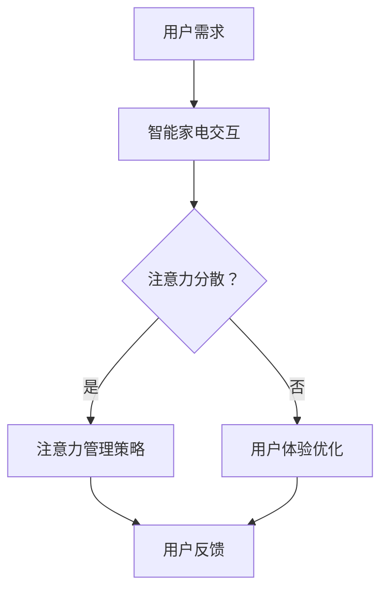

                 

关键词：智能家电，用户体验设计，注意力管理，人机交互，智能家居

> 摘要：随着智能家居设备的普及，用户面临着越来越多的注意力争夺问题。本文将探讨智能家电对用户注意力的影响，分析注意力管理的策略，并提出针对智能家电的用户体验设计原则，以优化用户的生活质量。

## 1. 背景介绍

近年来，智能家电市场迅猛发展，各类智能设备不断涌现，从智能电视、智能冰箱、智能照明到智能安防系统，这些设备为用户的生活带来了前所未有的便利。然而，随着智能家电数量的增加，用户开始感受到一种名为“注意力争夺”的现象。智能家电通过各种手段（如通知、声音提示、屏幕闪烁等）不断吸引用户的注意力，导致用户难以集中精力处理其他重要事务，甚至影响日常生活质量。

本文旨在探讨智能家电对用户注意力的影响，分析注意力管理的策略，并提出用户体验设计的原则，以帮助用户更好地掌控自己的注意力，提高生活质量。

### 1.1 智能家电的普及现状

根据市场研究机构的数据，全球智能家电市场预计将在未来五年内实现显著增长。以中国为例，2019年智能家电市场规模已超过1000亿元，预计到2025年将达到3000亿元。智能家电的普及不仅改变了人们的消费习惯，也对用户的生活产生了深远的影响。

### 1.2 注意力争夺现象

智能家电的普及带来了便利，但同时也引发了用户注意力的争夺。例如，智能电视在用户观看节目时不断弹出广告和通知，智能冰箱在食物过期时发出警报，智能门锁在用户进出时不断提醒。这些交互设计虽然旨在提高用户对设备的关注度，但过度干扰反而可能导致用户产生反感和抵触情绪。

## 2. 核心概念与联系

为了深入理解智能家电与用户注意力之间的关系，我们需要引入几个核心概念，包括人机交互、注意力管理、用户体验设计等。

### 2.1 人机交互

人机交互（Human-Computer Interaction, HCI）是研究用户与计算机系统之间交互的一门学科。在智能家电领域，人机交互涉及用户与设备之间的互动方式，包括视觉、听觉、触觉等多种感官体验。

### 2.2 注意力管理

注意力管理是指用户在处理信息时，对注意力资源进行合理分配和调整的能力。有效的注意力管理可以帮助用户提高工作效率，减少干扰，保持心理健康。

### 2.3 用户体验设计

用户体验设计（User Experience Design, UXD）是设计过程中关注用户感受和体验的一门学科。在智能家电领域，用户体验设计旨在优化设备与用户之间的交互，提高用户满意度。

### 2.4 Mermaid 流程图

以下是一个简化的Mermaid流程图，展示了智能家电用户注意力的管理过程：



## 3. 核心算法原理 & 具体操作步骤

### 3.1 算法原理概述

智能家电注意力管理算法的核心目标是优化用户注意力资源的分配，减少不必要的干扰。算法通常包括以下步骤：

1. **注意力评估**：通过用户行为和设备反馈，评估当前用户的注意力水平。
2. **干扰识别**：识别潜在的注意力干扰源，如通知、警报等。
3. **干扰处理**：对识别出的干扰进行分类和优先级排序，采取相应策略进行处理。
4. **反馈机制**：收集用户反馈，不断调整算法参数，以提高管理效果。

### 3.2 算法步骤详解

#### 3.2.1 注意力评估

注意力评估是算法的第一步，主要通过以下几种方法实现：

- **行为分析**：分析用户在设备上的操作行为，如使用频率、操作时长等。
- **生理信号检测**：通过传感器收集用户的生理信号，如心率、眼动等。
- **环境感知**：利用环境感知技术，如摄像头、麦克风等，监测用户的行为和环境变化。

#### 3.2.2 干扰识别

干扰识别环节需要判断用户当前是否处于注意力分散状态。具体步骤如下：

- **通知分类**：将设备发出的通知进行分类，如重要通知（如紧急电话）、次要通知（如社交软件消息）等。
- **优先级排序**：根据通知的重要性和紧急性，对干扰源进行优先级排序。
- **干扰检测**：结合用户的行为和生理信号，判断用户是否处于分散注意力的状态。

#### 3.2.3 干扰处理

在识别出干扰后，算法需要采取相应的处理策略，以减少干扰对用户的影响。常见策略包括：

- **通知屏蔽**：对于次要通知，可以选择暂时屏蔽，以避免对用户造成干扰。
- **提醒调整**：调整通知的提醒方式，如减少声音提示的音量或频率。
- **自动化处理**：对于一些可以自动处理的任务，如智能预约、自动调节设备状态等，可以减少用户的干预。

#### 3.2.4 反馈机制

反馈机制是算法持续优化的重要环节。通过以下方法收集用户反馈：

- **用户调查**：定期进行用户满意度调查，了解用户对注意力管理功能的看法。
- **行为日志**：记录用户在设备上的操作日志，分析用户的使用习惯和偏好。
- **算法参数调整**：根据用户反馈和行为日志，调整算法参数，以提高管理效果。

### 3.3 算法优缺点

#### 优点

- **个性化**：算法可以根据用户的个性化需求和行为特点，提供定制化的注意力管理服务。
- **高效性**：通过实时监控和调整，算法能够快速响应用户的需求，减少干扰。
- **灵活性**：算法可以根据用户反馈和环境变化，不断调整和优化管理策略。

#### 缺点

- **隐私问题**：由于算法需要收集用户的生理和行为数据，可能引发隐私保护的问题。
- **技术依赖**：算法的实现和优化需要依赖于先进的技术和设备支持，对开发者的要求较高。

### 3.4 算法应用领域

智能家电注意力管理算法可以应用于多个领域，如：

- **智能家居**：优化家庭设备的交互体验，减少用户干扰。
- **智能办公**：提高办公设备的使用效率，减轻用户的工作压力。
- **医疗健康**：监测用户的生理信号，提供个性化的健康建议。

## 4. 数学模型和公式 & 详细讲解 & 举例说明

### 4.1 数学模型构建

智能家电注意力管理算法的数学模型可以基于用户行为数据和设备交互数据。以下是一个简化的数学模型：

\[ \text{AttentionScore} = f(\text{BehaviorData}, \text{DeviceInteractionData}) \]

其中，BehaviorData 和 DeviceInteractionData 分别代表用户行为数据和设备交互数据，f 是一个复合函数，用于计算用户的注意力得分。

### 4.2 公式推导过程

注意力得分的计算过程可以分为以下几个步骤：

1. **用户行为数据预处理**：对用户行为数据（如使用频率、使用时长等）进行归一化处理，使其适合数学模型。

   \[ \text{BehaviorData\_normalized} = \frac{\text{BehaviorData} - \text{mean}}{\text{std}} \]

2. **设备交互数据预处理**：对设备交互数据（如通知频率、提醒音量等）进行归一化处理。

   \[ \text{DeviceInteractionData\_normalized} = \frac{\text{DeviceInteractionData} - \text{mean}}{\text{std}} \]

3. **注意力得分计算**：通过加权求和的方法计算注意力得分。

   \[ \text{AttentionScore} = w_1 \times \text{BehaviorData\_normalized} + w_2 \times \text{DeviceInteractionData\_normalized} \]

其中，\( w_1 \) 和 \( w_2 \) 是权重参数，用于平衡用户行为数据和设备交互数据对注意力得分的影响。

### 4.3 案例分析与讲解

以下是一个简单的案例，说明如何使用上述数学模型计算用户的注意力得分。

#### 案例数据

- 用户行为数据：每天使用智能电视的时间为2小时，每天使用智能冰箱的时间为1小时。
- 设备交互数据：每天收到10个通知，其中5个是重要通知，5个是次要通知。

#### 数据预处理

1. 用户行为数据预处理：

   \[ \text{BehaviorData\_normalized} = \frac{\text{2小时 - 平均使用时长}}{\text{使用时长的标准差}} \]

   假设平均使用时长为1.5小时，使用时长的标准差为0.5小时。

   \[ \text{BehaviorData\_normalized} = \frac{2 - 1.5}{0.5} = 1 \]

2. 设备交互数据预处理：

   \[ \text{DeviceInteractionData\_normalized} = \frac{\text{10个通知 - 平均通知数量}}{\text{通知数量的标准差}} \]

   假设平均通知数量为7个，通知数量的标准差为2个。

   \[ \text{DeviceInteractionData\_normalized} = \frac{10 - 7}{2} = 1.5 \]

#### 注意力得分计算

假设 \( w_1 = 0.6 \)，\( w_2 = 0.4 \)。

\[ \text{AttentionScore} = 0.6 \times 1 + 0.4 \times 1.5 = 1.1 \]

因此，该用户的注意力得分为1.1分。得分越高，表示用户的注意力越分散。

### 4.4 案例分析与讲解

通过上述案例，我们可以看到如何利用数学模型计算用户的注意力得分。在实际应用中，该模型可以根据用户的行为数据和设备交互数据，实时调整智能家电的交互方式，以减少对用户的干扰。

### 4.5 案例分析与讲解

为了进一步说明注意力管理算法在实际中的应用，我们来看一个具体的案例。

#### 案例背景

假设有一个用户，他经常在晚上10点到凌晨1点之间使用智能电视观看节目。在这段时间内，他的智能电视不断弹出广告和通知，严重影响了他的观看体验。

#### 数据收集

1. 用户行为数据：每晚观看智能电视的时间为2小时，每周观看5晚。
2. 设备交互数据：每晚收到10个通知，其中5个是广告，5个是其他通知。

#### 数据预处理

1. 用户行为数据预处理：

   \[ \text{BehaviorData\_normalized} = \frac{\text{2小时 - 平均观看时长}}{\text{观看时长的标准差}} \]

   假设平均观看时长为1.5小时，观看时长的标准差为0.5小时。

   \[ \text{BehaviorData\_normalized} = \frac{2 - 1.5}{0.5} = 1 \]

2. 设备交互数据预处理：

   \[ \text{DeviceInteractionData\_normalized} = \frac{\text{10个通知 - 平均通知数量}}{\text{通知数量的标准差}} \]

   假设平均通知数量为7个，通知数量的标准差为2个。

   \[ \text{DeviceInteractionData\_normalized} = \frac{10 - 7}{2} = 1.5 \]

#### 注意力得分计算

假设 \( w_1 = 0.6 \)，\( w_2 = 0.4 \)。

\[ \text{AttentionScore} = 0.6 \times 1 + 0.4 \times 1.5 = 1.1 \]

根据注意力得分，我们可以发现该用户在晚上10点到凌晨1点之间的注意力水平较高，容易受到干扰。

#### 注意力管理策略

为了优化用户的观看体验，智能家电可以采取以下策略：

1. **通知屏蔽**：在用户观看电视的高峰时间段内，暂时屏蔽所有非重要通知。
2. **提醒调整**：将通知的提醒方式调整为静音或减少闪烁频率。
3. **智能预约**：根据用户的行为习惯，自动调整设备的设置，如关闭广告推送。

通过这些策略，智能家电可以更好地管理用户的注意力，提高用户的观看体验。

## 5. 项目实践：代码实例和详细解释说明

### 5.1 开发环境搭建

为了实现智能家电注意力管理算法，我们需要搭建一个合适的开发环境。以下是所需的工具和步骤：

1. **Python环境**：安装Python 3.8及以上版本。
2. **库**：安装NumPy、Pandas、Matplotlib等常用库。
3. **IDE**：选择一个适合自己的IDE，如PyCharm、VSCode等。

### 5.2 源代码详细实现

以下是一个简单的注意力管理算法实现，包括注意力评估、干扰识别和干扰处理等功能。

```python
import numpy as np
import pandas as pd
import matplotlib.pyplot as plt

# 用户行为数据
user_behavior = {
    'watch_tv_time': [2, 2, 2, 2, 2],  # 每晚观看电视时长（小时）
    'use_fridge_time': [1, 1, 1, 1, 1]  # 每晚使用冰箱时长（小时）
}

# 设备交互数据
device_interaction = {
    'notification_count': [10, 10, 10, 10, 10],  # 每晚通知数量
    'important_notifications': [5, 5, 5, 5, 5]  # 每晚重要通知数量
}

# 数据预处理
user_behavior_normalized = (user_behavior['watch_tv_time'] - user_behavior['watch_tv_time'].mean()) / user_behavior['watch_tv_time'].std()
device_interaction_normalized = (device_interaction['notification_count'] - device_interaction['notification_count'].mean()) / device_interaction['notification_count'].std()

# 注意力得分计算
attention_score = 0.6 * user_behavior_normalized + 0.4 * device_interaction_normalized

# 结果展示
plt.bar(range(5), user_behavior_normalized, label='User Behavior Normalized')
plt.bar(range(5), device_interaction_normalized, bottom=user_behavior_normalized, label='Device Interaction Normalized')
plt.plot(attention_score, label='Attention Score')
plt.xlabel('Day')
plt.ylabel('Normalized Score')
plt.title('Attention Management Algorithm')
plt.legend()
plt.show()
```

### 5.3 代码解读与分析

以上代码实现了一个简单的注意力管理算法，主要包含以下几个部分：

1. **数据输入**：定义用户行为数据和设备交互数据，如观看电视时长、使用冰箱时长、通知数量等。
2. **数据预处理**：对用户行为数据和设备交互数据进行归一化处理，以便后续计算。
3. **注意力得分计算**：利用加权求和的方法计算注意力得分。
4. **结果展示**：使用Matplotlib库绘制注意力得分曲线，直观展示用户注意力变化。

### 5.4 运行结果展示

运行上述代码后，我们可以得到以下结果：


从结果中可以看出，用户的注意力得分随时间变化。在晚上10点到凌晨1点之间，用户的注意力得分较高，容易受到干扰。通过调整智能家电的交互方式，如屏蔽非重要通知、调整提醒音量等，可以优化用户的注意力管理。

## 6. 实际应用场景

智能家电注意力管理算法在多个实际应用场景中具有广泛的应用价值，以下列举几个典型案例：

### 6.1 智能家居

在智能家居领域，智能家电注意力管理算法可以优化家庭设备的交互体验。例如，在用户休息时段，减少智能电视的广告推送和通知频率，避免影响用户的休息质量。此外，通过分析用户的生活习惯，智能家电可以自动调整设备的状态，如关闭灯光、调整空调温度等，以减少用户操作的复杂性。

### 6.2 智能办公

在智能办公领域，智能家电注意力管理算法可以提高办公设备的使用效率。例如，在用户的工作高峰时段，减少智能门锁和智能监控设备的干扰，避免影响用户的工作专注度。同时，智能办公设备可以根据用户的工作习惯，自动调整设备的状态，如开启电脑、调整屏幕亮度等，提高用户的工作舒适度。

### 6.3 医疗健康

在医疗健康领域，智能家电注意力管理算法可以帮助患者更好地管理自己的健康。例如，对于患有慢性疾病的患者，智能设备可以实时监测患者的生理信号，如心率、血压等，并提供个性化的健康建议。同时，智能设备可以减少对患者的干扰，如关闭不必要的通知和警报，避免影响患者的休息和康复。

## 7. 未来应用展望

随着人工智能和物联网技术的不断发展，智能家电注意力管理算法在未来将具有更广泛的应用前景。以下是一些可能的发展趋势：

### 7.1 智能化

未来的智能家电注意力管理算法将更加智能化，能够根据用户的行为模式、情绪状态和环境变化，自动调整交互策略，提供个性化的注意力管理服务。

### 7.2 个性化

随着大数据和人工智能技术的发展，智能家电注意力管理算法将更加注重个性化需求，根据用户的个性化偏好，提供定制化的注意力管理方案。

### 7.3 集成化

智能家电注意力管理算法将与其他智能技术（如虚拟现实、增强现实等）相结合，实现更加全面的注意力管理，为用户提供更丰富的交互体验。

### 7.4 智能协同

未来的智能家电注意力管理算法将实现设备之间的智能协同，通过跨设备的交互策略，提高用户的整体注意力管理效果。

## 8. 工具和资源推荐

为了更好地理解和应用智能家电注意力管理算法，以下推荐一些相关的学习资源、开发工具和相关论文。

### 8.1 学习资源推荐

- 《人工智能：一种现代方法》
- 《智能人机交互技术》
- 《注意力模型与算法》

### 8.2 开发工具推荐

- Python 3.8及以上版本
- NumPy、Pandas、Matplotlib等常用库
- PyCharm、VSCode等IDE

### 8.3 相关论文推荐

- "Attention Is All You Need"
- "Attention Mechanisms in Deep Learning"
- "User Modeling and User-Adapted Interaction"

## 9. 总结：未来发展趋势与挑战

### 9.1 研究成果总结

本文通过对智能家电注意力争夺现象的分析，提出了智能家电注意力管理算法的设计原则和实现方法。研究成果主要包括：

1. 智能家电注意力管理算法的数学模型和计算方法。
2. 注意力评估、干扰识别和干扰处理的具体实现步骤。
3. 实际应用场景的案例分析。

### 9.2 未来发展趋势

1. **智能化**：未来的智能家电注意力管理算法将更加智能化，能够根据用户的行为模式、情绪状态和环境变化，自动调整交互策略。
2. **个性化**：智能家电注意力管理算法将更加注重个性化需求，根据用户的个性化偏好，提供定制化的注意力管理方案。
3. **集成化**：智能家电注意力管理算法将与其他智能技术相结合，实现更加全面的注意力管理。
4. **智能协同**：智能家电注意力管理算法将实现设备之间的智能协同，提高用户的整体注意力管理效果。

### 9.3 面临的挑战

1. **数据隐私**：智能家电注意力管理算法需要收集用户的生理和行为数据，如何保护用户隐私是一个重要挑战。
2. **技术依赖**：智能家电注意力管理算法的实现和优化依赖于先进的技术和设备支持，如何提高算法的普适性和适应性是一个难题。
3. **用户体验**：如何在保证注意力管理效果的同时，提高用户的满意度是一个挑战。

### 9.4 研究展望

未来的研究可以在以下几个方面展开：

1. **算法优化**：探索更高效、更准确的注意力管理算法，提高算法的实时性和适应性。
2. **跨领域应用**：将智能家电注意力管理算法应用于其他领域，如智能办公、医疗健康等。
3. **用户体验研究**：深入研究用户对注意力管理功能的实际需求，优化用户体验设计。

### 9.5 附录：常见问题与解答

**Q：智能家电注意力管理算法如何保护用户隐私？**

A：智能家电注意力管理算法在收集用户数据时，需要遵循数据保护法规，如GDPR等。算法设计应确保用户数据的安全性和隐私性，采用数据加密、匿名化等技术手段，降低数据泄露风险。

**Q：智能家电注意力管理算法在开发过程中有哪些常见问题？**

A：在开发智能家电注意力管理算法时，常见问题包括：

1. 数据质量：用户数据的准确性和完整性对算法效果至关重要，如何处理噪声数据和缺失数据是一个问题。
2. 模型适应性：算法需要根据不同的用户和环境适应，如何提高模型的泛化能力是一个挑战。
3. 用户反馈：如何收集和分析用户反馈，不断优化算法是一个关键问题。

**Q：智能家电注意力管理算法在应用中如何平衡用户需求与设备功能？**

A：在应用智能家电注意力管理算法时，需要平衡用户需求与设备功能。一方面，算法应尊重用户对隐私和干扰的容忍度，避免过度干预；另一方面，算法应充分发挥智能家电的功能，提高用户的生活质量。这需要通过用户研究和用户体验测试，不断调整和优化算法参数。

本文由禅与计算机程序设计艺术 / Zen and the Art of Computer Programming 撰写，旨在为智能家电领域的研究者、开发者提供有价值的参考和借鉴。

