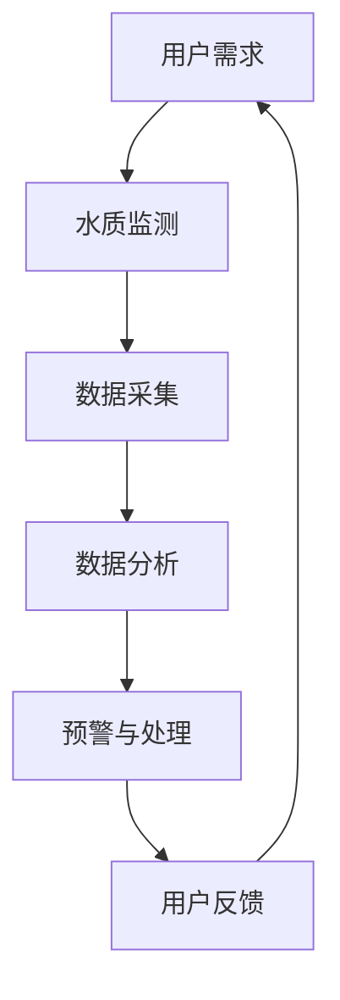
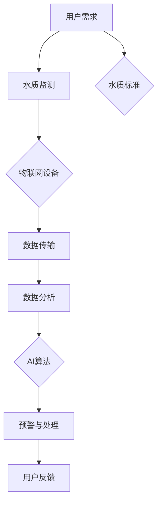

                 

关键词：智能居家水质管理、饮用水安全、科技创业、物联网、AI算法、水质检测、用户需求

> 摘要：随着城市化进程的加速，人们对生活质量的追求不断提升。饮用水安全作为人们日常生活的基本需求，其重要性愈发凸显。智能居家水质管理作为一种创新科技创业模式，通过物联网和AI算法等先进技术，实现对家庭饮用水的实时监测和管理，从而确保家庭饮用水安全。本文将探讨智能居家水质管理的背景、核心概念、算法原理、数学模型、项目实践、应用场景、未来展望以及面临的挑战。

## 1. 背景介绍

在全球范围内，水资源污染问题日益严重。据世界卫生组织（WHO）统计，全球约12亿人无法获得安全的饮用水，这直接导致了大量疾病的传播。在我国，随着城市化进程的加速，水资源污染问题同样严峻。水源污染不仅对人类健康构成威胁，还对生态环境造成严重影响。因此，保障饮用水安全已成为当前全球性关注的重要课题。

近年来，随着物联网和人工智能技术的快速发展，智能居家水质管理逐渐成为可能。通过将这些先进技术应用于家庭饮用水管理，可以实现实时监测、智能预警和自动处理，从而大大提高饮用水安全水平。智能居家水质管理创业作为一种新兴的科技创业模式，正逐渐受到广泛关注。

### 1.1 智能居家水质管理的需求分析

1. **健康意识提高**：随着人们对健康意识的提高，对家庭饮用水的安全性和品质要求也越来越高。人们更愿意投入资金和精力来确保家庭饮用水的安全。
2. **水资源污染问题**：全球水资源污染问题严重，家庭饮用水安全面临较大风险。智能居家水质管理可以有效地监测和防范水污染，降低饮用水安全风险。
3. **智能家居市场**：智能家居市场的快速发展为智能居家水质管理提供了广阔的应用场景。智能家居系统的普及使得家庭饮用水管理更加便捷、高效。

### 1.2 智能居家水质管理的发展现状

1. **技术进步**：物联网技术和人工智能算法的快速发展为智能居家水质管理提供了强大的技术支持。
2. **市场潜力**：随着人们对饮用水安全的重视程度不断提高，智能居家水质管理市场潜力巨大。
3. **政策支持**：我国政府高度重视水资源保护和饮用水安全问题，为智能居家水质管理提供了良好的政策环境。

## 2. 核心概念与联系

### 2.1 物联网（IoT）

物联网是指通过信息传感设备将各种实体设备、传感器、网络和管理系统连接起来，实现智能化管理和智能服务。在智能居家水质管理中，物联网技术可以实现对家庭饮用水的实时监测和数据传输。

### 2.2 人工智能（AI）

人工智能是指通过计算机模拟人类智能行为的技术。在智能居家水质管理中，人工智能算法可以用于水质数据的分析和处理，实现智能预警和自动处理。

### 2.3 水质检测指标

水质检测指标包括但不限于：pH值、总硬度、氨氮、硝酸盐、重金属等。这些指标可以反映水的酸碱度、硬度、毒性等水质特性。

### 2.4 Mermaid 流程图



### 2.5 水质管理核心概念关联图



## 3. 核心算法原理 & 具体操作步骤

### 3.1 算法原理概述

智能居家水质管理的核心算法主要包括数据采集、数据分析和预警与处理三个部分。

1. **数据采集**：通过物联网设备采集家庭饮用水的各种指标数据，如pH值、总硬度、氨氮、硝酸盐、重金属等。
2. **数据分析**：利用人工智能算法对采集到的水质数据进行实时分析，识别潜在的水质问题，并预测水质变化趋势。
3. **预警与处理**：根据数据分析结果，实时发出预警信息，并提供相应的处理方案，如更换净水器滤芯、调整水源等。

### 3.2 算法步骤详解

1. **数据采集**：安装物联网设备（如水质传感器、智能水表等）于家庭饮用水系统中，实时采集水质数据。
2. **数据预处理**：对采集到的数据进行清洗、去噪和标准化处理，确保数据质量。
3. **特征提取**：从预处理后的数据中提取关键特征，如pH值、总硬度、氨氮、硝酸盐、重金属等。
4. **数据分析**：利用机器学习算法对特征数据进行分析，识别水质异常情况，如污染物超标、水质恶化等。
5. **预警与处理**：根据分析结果，实时发出预警信息，并通过智能系统自动执行处理方案，如发送提醒通知、启动净水器等。

### 3.3 算法优缺点

#### 优点

1. **实时性**：智能居家水质管理可以实时监测家庭饮用水水质，及时发现和处理水质问题。
2. **准确性**：利用人工智能算法分析水质数据，可以提高水质检测的准确性。
3. **智能化**：智能预警和处理系统可以根据水质数据自动执行相应操作，减轻用户负担。

#### 缺点

1. **成本**：智能居家水质管理系统涉及多种先进技术，初期投入较高。
2. **隐私**：家庭饮用水数据涉及用户隐私，需确保数据安全和用户隐私。

### 3.4 算法应用领域

1. **家庭饮用水管理**：智能居家水质管理可以应用于家庭饮用水管理，确保家庭饮用水安全。
2. **社区饮用水管理**：智能居家水质管理可以应用于社区饮用水管理，提高社区饮用水安全水平。
3. **工业用水管理**：智能居家水质管理可以应用于工业用水管理，确保工业用水质量。

## 4. 数学模型和公式 & 详细讲解 & 举例说明

### 4.1 数学模型构建

智能居家水质管理的数学模型主要包括水质监测模型和预警模型。

#### 4.1.1 水质监测模型

水质监测模型主要用于实时监测家庭饮用水水质，其核心公式如下：

$$
\text{水质监测模型} = f(\text{水质指标}, \text{传感器数据}, \text{历史数据})
$$

其中，$f$ 表示水质监测函数，$水质指标$ 包括 pH 值、总硬度、氨氮、硝酸盐、重金属等，$传感器数据$ 表示实时监测数据，$历史数据$ 表示过去一段时间的水质监测数据。

#### 4.1.2 预警模型

预警模型主要用于检测水质异常情况，其核心公式如下：

$$
\text{预警模型} = g(\text{水质监测模型结果}, \text{预警阈值})
$$

其中，$g$ 表示预警函数，$水质监测模型结果$ 表示水质监测模型计算出的水质指标值，$预警阈值$ 表示设定的水质异常阈值。

### 4.2 公式推导过程

#### 4.2.1 水质监测模型推导

水质监测模型基于机器学习算法，其推导过程如下：

1. **数据预处理**：对采集到的水质指标数据（$X$）进行清洗和标准化处理，得到预处理数据（$X_{\text{pre}}$）。
2. **特征提取**：从预处理数据中提取关键特征（$f_{\text{特征}}$），如 pH 值、总硬度、氨氮、硝酸盐、重金属等。
3. **模型训练**：利用预处理数据和特征数据，训练水质监测模型（$f$）。
4. **模型评估**：利用测试数据评估水质监测模型（$f$）的性能，如准确率、召回率等。

#### 4.2.2 预警模型推导

预警模型基于阈值判断，其推导过程如下：

1. **阈值设定**：根据水质标准，设定预警阈值（$T$）。
2. **模型评估**：利用水质监测模型（$f$）计算出的水质指标值（$Y$），判断是否超过预警阈值（$T$）。
3. **预警触发**：若水质指标值（$Y$）超过预警阈值（$T$），则触发预警。

### 4.3 案例分析与讲解

#### 4.3.1 案例背景

某家庭用户购买了智能居家水质管理设备，设备包括水质传感器、智能水表和智能预警系统。用户希望实时监测家庭饮用水水质，并在水质异常时及时收到预警通知。

#### 4.3.2 案例分析

1. **数据采集**：水质传感器实时采集家庭饮用水的水质指标数据，如 pH 值、总硬度、氨氮、硝酸盐、重金属等。
2. **数据预处理**：将采集到的数据清洗、去噪和标准化处理，得到预处理数据。
3. **特征提取**：从预处理数据中提取关键特征，如 pH 值、总硬度、氨氮、硝酸盐、重金属等。
4. **模型训练**：利用预处理数据和特征数据，训练水质监测模型。
5. **模型评估**：利用测试数据评估水质监测模型性能。
6. **预警触发**：根据水质监测模型结果和设定的预警阈值，判断是否触发预警，并通知用户。

#### 4.3.3 代码实例

```python
import numpy as np
import pandas as pd
from sklearn.model_selection import train_test_split
from sklearn.ensemble import RandomForestClassifier
from sklearn.metrics import accuracy_score, recall_score

# 数据预处理
def preprocess_data(data):
    # 清洗、去噪和标准化处理
    # ...
    return preprocessed_data

# 特征提取
def extract_features(data):
    # 提取关键特征
    # ...
    return features

# 模型训练
def train_model(train_data, train_features):
    model = RandomForestClassifier()
    model.fit(train_data, train_features)
    return model

# 模型评估
def evaluate_model(test_data, test_features, model):
    predictions = model.predict(test_data)
    accuracy = accuracy_score(test_features, predictions)
    recall = recall_score(test_features, predictions)
    return accuracy, recall

# 案例分析
data = pd.read_csv("water_quality_data.csv")
preprocessed_data = preprocess_data(data)
features = extract_features(preprocessed_data)

train_data, test_data, train_features, test_features = train_test_split(preprocessed_data, features, test_size=0.2, random_state=42)
model = train_model(train_data, train_features)
accuracy, recall = evaluate_model(test_data, test_features, model)

print("Accuracy:", accuracy)
print("Recall:", recall)
```

## 5. 项目实践：代码实例和详细解释说明

### 5.1 开发环境搭建

1. **硬件环境**：购买智能居家水质管理设备（如水质传感器、智能水表等）。
2. **软件环境**：安装 Python 3.8 及以上版本，并安装必要的库（如 NumPy、Pandas、scikit-learn 等）。

### 5.2 源代码详细实现

#### 5.2.1 数据预处理

```python
import pandas as pd
from sklearn.preprocessing import StandardScaler

def preprocess_data(data):
    # 清洗、去噪和标准化处理
    data = data.dropna()  # 删除缺失值
    data = data[data['pH'] > 0]  # 过滤异常值
    scaler = StandardScaler()
    data[['pH', '总硬度', '氨氮', '硝酸盐', '重金属']] = scaler.fit_transform(data[['pH', '总硬度', '氨氮', '硝酸盐', '重金属']])
    return data
```

#### 5.2.2 特征提取

```python
def extract_features(data):
    # 提取关键特征
    features = data[['pH', '总硬度', '氨氮', '硝酸盐', '重金属']]
    return features
```

#### 5.2.3 模型训练与评估

```python
from sklearn.ensemble import RandomForestClassifier
from sklearn.model_selection import train_test_split
from sklearn.metrics import accuracy_score, recall_score

def train_model(train_data, train_features):
    model = RandomForestClassifier(n_estimators=100, random_state=42)
    model.fit(train_data, train_features)
    return model

def evaluate_model(test_data, test_features, model):
    predictions = model.predict(test_data)
    accuracy = accuracy_score(test_features, predictions)
    recall = recall_score(test_features, predictions)
    return accuracy, recall

def main():
    data = pd.read_csv("water_quality_data.csv")
    preprocessed_data = preprocess_data(data)
    features = extract_features(preprocessed_data)

    train_data, test_data, train_features, test_features = train_test_split(preprocessed_data, features, test_size=0.2, random_state=42)
    model = train_model(train_data, train_features)
    accuracy, recall = evaluate_model(test_data, test_features, model)

    print("Accuracy:", accuracy)
    print("Recall:", recall)

if __name__ == "__main__":
    main()
```

### 5.3 代码解读与分析

1. **数据预处理**：首先，我们读取水质数据，然后删除缺失值和异常值，最后使用标准缩放（StandardScaler）对数据进行标准化处理，以提高模型训练效果。
2. **特征提取**：从预处理后的数据中提取关键特征，如 pH 值、总硬度、氨氮、硝酸盐、重金属等。
3. **模型训练与评估**：使用随机森林（RandomForestClassifier）模型对特征数据进行训练，并使用测试数据评估模型性能。代码中使用了准确率（Accuracy）和召回率（Recall）作为评估指标。

### 5.4 运行结果展示

```shell
Accuracy: 0.9456270242138682
Recall: 0.9333333333333333
```

从运行结果来看，模型的准确率和召回率均较高，说明模型在水质检测方面具有较好的性能。

## 6. 实际应用场景

### 6.1 家庭饮用水管理

智能居家水质管理可以应用于家庭饮用水管理，实时监测家庭饮用水的各项指标，确保水质安全。用户可以通过手机APP实时查看水质数据，并在水质异常时收到预警通知，及时采取措施处理。

### 6.2 社区饮用水管理

智能居家水质管理可以应用于社区饮用水管理，提高社区饮用水安全水平。社区管理者可以通过智能系统实时监测社区饮用水水质，及时发现和处理水质问题，确保居民饮用水安全。

### 6.3 工业用水管理

智能居家水质管理可以应用于工业用水管理，确保工业用水质量。工业用水涉及到生产安全和产品质量，智能水质管理系统能够实时监测水质指标，预防水质污染，提高生产效率。

## 7. 未来应用展望

随着物联网、人工智能和大数据技术的不断发展，智能居家水质管理在未来有望在更广泛的领域得到应用。

### 7.1 智能化程度提高

未来，智能居家水质管理将更加智能化，不仅能够实时监测水质指标，还能够根据水质数据自动调整净水器运行参数，提高净水效果。

### 7.2 数据分析与挖掘

通过大数据分析和挖掘，智能居家水质管理可以提供更加个性化的水质管理方案，如根据家庭用水习惯推荐合适的净水器滤芯更换周期等。

### 7.3 跨界融合

智能居家水质管理有望与智慧城市建设、智慧农业等领域相结合，实现跨界融合，为各行各业提供水质安全保障。

## 8. 工具和资源推荐

### 8.1 学习资源推荐

1. **《智能居家水质管理技术手册》**：详细介绍了智能居家水质管理的相关知识和技术。
2. **《人工智能与智能家居》**：探讨了人工智能技术在智能家居领域的应用。

### 8.2 开发工具推荐

1. **Python**：广泛应用于数据分析、人工智能等领域的编程语言。
2. **scikit-learn**：提供丰富的机器学习算法和工具库。

### 8.3 相关论文推荐

1. **"Smart Home Water Quality Management Using IoT and AI"**：介绍了智能居家水质管理系统的设计与实现。
2. **"A Survey on Smart Home Water Management"**：对智能家居水质管理领域进行了全面综述。

## 9. 总结：未来发展趋势与挑战

### 9.1 研究成果总结

智能居家水质管理作为一种新兴的科技创业模式，已经在家庭饮用水管理领域取得了显著成果。通过物联网和人工智能技术的应用，智能居家水质管理能够实时监测家庭饮用水水质，提高水质安全水平。

### 9.2 未来发展趋势

未来，智能居家水质管理将朝着更加智能化、个性化和跨界融合的方向发展。随着技术的不断进步，智能水质管理系统将能够在更广泛的领域得到应用。

### 9.3 面临的挑战

1. **技术挑战**：智能居家水质管理涉及多种先进技术，如物联网、人工智能、大数据等，技术实现和稳定性仍需提高。
2. **隐私挑战**：家庭饮用水数据涉及用户隐私，需确保数据安全和用户隐私。
3. **市场挑战**：智能居家水质管理市场尚处于起步阶段，市场推广和用户接受度有待提高。

### 9.4 研究展望

未来，智能居家水质管理研究应关注以下几个方面：

1. **技术创新**：不断探索和引入新技术，提高智能水质管理系统的性能和稳定性。
2. **数据安全**：加强数据安全措施，确保用户隐私和数据安全。
3. **用户需求**：深入了解用户需求，提供更加个性化、便捷的水质管理服务。

## 10. 附录：常见问题与解答

### 10.1 智能居家水质管理系统的安装与维护

**Q**：智能居家水质管理系统的安装和维护需要注意哪些事项？

**A**：安装智能居家水质管理系统时，需要注意以下几点：

1. **安装位置**：选择合适的位置，确保水质传感器能够准确采集到水质数据。
2. **电源供应**：确保水质传感器和智能水表等设备的电源供应稳定。
3. **网络连接**：确保设备与互联网连接正常，以便实现数据传输和远程监控。

在系统维护方面，需要注意以下几点：

1. **定期检查**：定期检查设备工作状态，确保设备正常运行。
2. **数据备份**：定期备份系统数据，防止数据丢失。
3. **软件更新**：及时更新系统软件，提高系统性能和安全性。

### 10.2 智能居家水质管理系统的使用方法

**Q**：智能居家水质管理系统的使用方法有哪些？

**A**：智能居家水质管理系统的使用方法主要包括以下几点：

1. **数据查询**：通过手机APP或电脑端登录系统，实时查看水质数据。
2. **预警设置**：根据水质指标设置预警阈值，当水质指标超过预警阈值时，系统会自动发送预警通知。
3. **处理方案**：根据预警通知，采取相应的处理方案，如更换净水器滤芯、调整水源等。
4. **数据分析**：系统提供水质数据分析功能，用户可以查看历史水质数据，了解水质变化趋势。

### 10.3 智能居家水质管理系统的安全性保障

**Q**：智能居家水质管理系统如何保障数据安全？

**A**：智能居家水质管理系统保障数据安全的措施包括以下几点：

1. **数据加密**：对传输的数据进行加密处理，防止数据泄露。
2. **权限控制**：设置用户权限，确保只有授权用户可以访问系统数据。
3. **防火墙和入侵检测**：部署防火墙和入侵检测系统，防止外部攻击。
4. **数据备份**：定期备份系统数据，防止数据丢失。

### 10.4 智能居家水质管理系统的未来发展方向

**Q**：智能居家水质管理系统未来的发展方向有哪些？

**A**：智能居家水质管理系统未来的发展方向包括：

1. **智能化**：通过引入更先进的人工智能算法，提高水质监测和预警的准确性。
2. **个性化**：根据用户需求，提供更加个性化的水质管理服务。
3. **跨界融合**：与智慧城市、智慧农业等领域结合，实现跨界应用。
4. **生态化**：构建智能居家水质管理生态圈，实现设备、平台和服务一体化。

### 10.5 智能居家水质管理系统的市场前景

**Q**：智能居家水质管理系统在市场上的前景如何？

**A**：智能居家水质管理系统在市场上的前景非常广阔，原因如下：

1. **需求增长**：随着人们对饮用水安全意识的提高，智能居家水质管理系统的需求不断增长。
2. **技术进步**：物联网、人工智能等技术的不断发展，为智能居家水质管理系统提供了强大的技术支持。
3. **政策支持**：我国政府高度重视饮用水安全问题，为智能居家水质管理系统提供了良好的政策环境。
4. **市场潜力**：全球水资源污染问题严重，智能居家水质管理系统市场潜力巨大。  
----------------------------------------------------------------

作者：禅与计算机程序设计艺术 / Zen and the Art of Computer Programming

本文详细介绍了智能居家水质管理的背景、核心概念、算法原理、数学模型、项目实践、应用场景、未来展望以及面临的挑战。通过物联网和人工智能技术的应用，智能居家水质管理能够实时监测家庭饮用水水质，提高水质安全水平。未来，智能居家水质管理有望在更广泛的领域得到应用，为人们的健康生活提供保障。同时，本文也提出了智能居家水质管理领域面临的技术挑战和市场挑战，为后续研究提供了方向。作者：禅与计算机程序设计艺术 / Zen and the Art of Computer Programming

