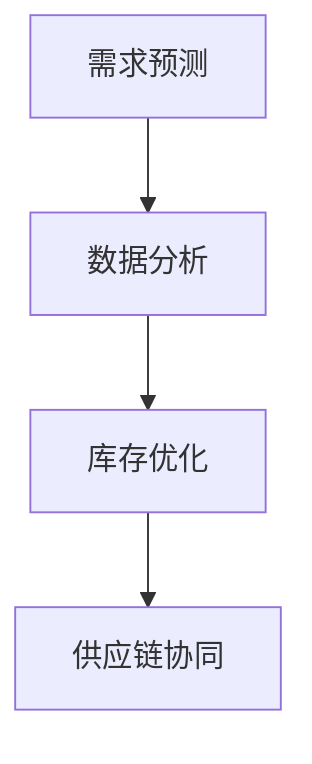

                 

 关键词：智能库存管理，AI预测，需求优化，库存管理，供应链优化，机器学习，数据分析，业务智能化

> 摘要：随着全球化的不断深入和互联网技术的飞速发展，供应链的复杂性日益增加，传统的库存管理方法已经难以满足现代企业的需求。本文将探讨如何利用人工智能技术，特别是机器学习和数据分析，来预测需求并优化库存，从而实现库存管理的高效和智能化。

## 1. 背景介绍

库存管理是供应链管理中至关重要的一环。它不仅关乎企业的运营成本，更直接影响到企业的客户服务和市场竞争力。传统的库存管理方法主要依赖于历史数据和经验，往往存在一定的滞后性和不确定性。随着市场的不断变化，企业需要一种更为灵活和高效的方式来管理库存。

人工智能技术的兴起为库存管理带来了新的机遇。机器学习和数据分析技术可以处理大量数据，从中挖掘出隐藏的模式和趋势，从而帮助预测未来的需求。这种基于数据的决策支持系统可以显著提高库存管理的效率，减少库存成本，提升客户满意度。

### 1.1 供应链管理的挑战

供应链管理面临的挑战主要包括：

- **需求预测的准确性**：市场需求的不确定性使得预测需求变得异常困难。
- **库存水平的控制**：过高的库存水平会增加存储成本和资金压力，而过低的库存水平则会影响到客户服务。
- **供应链的复杂性**：全球供应链的复杂性使得库存管理变得更加复杂。

### 1.2 人工智能在库存管理中的应用

人工智能在库存管理中的应用主要包括以下几个方面：

- **需求预测**：利用机器学习算法分析历史销售数据，预测未来的需求。
- **库存优化**：根据需求预测结果，优化库存水平，减少不必要的库存积压。
- **供应链协同**：通过智能算法实现供应链各环节的协同，提高供应链的响应速度。

## 2. 核心概念与联系

在探讨如何利用人工智能进行库存管理之前，我们需要了解一些核心概念和它们之间的联系。

### 2.1 需求预测

需求预测是库存管理的关键环节。通过分析历史销售数据、市场趋势和其他相关因素，我们可以预测未来某一时间段内的需求量。这有助于企业提前做好库存准备，避免因需求波动导致的库存积压或供应不足。

### 2.2 数据分析

数据分析是人工智能技术的基础。通过对大量数据进行分析，我们可以发现数据之间的关联和模式，从而做出更加准确的预测和决策。数据分析技术包括数据挖掘、统计分析、机器学习等。

### 2.3 库存优化

库存优化是指根据需求预测结果，调整库存水平，使其达到最优状态。库存优化可以减少库存成本，提高资金利用率，同时确保客户服务水平。

### 2.4 Mermaid 流程图

下面是一个用 Mermaid 编写的库存管理流程图，展示了各环节之间的关系。



## 3. 核心算法原理 & 具体操作步骤

### 3.1 算法原理概述

库存管理的核心算法主要基于机器学习和数据分析技术。以下是几种常用的算法原理：

- **线性回归**：通过分析历史数据，建立需求与时间、季节性因素等之间的线性关系，从而预测未来的需求。
- **决策树**：通过分析数据特征，构建一棵决策树，用于分类或回归任务。
- **神经网络**：通过多层神经网络结构，学习数据中的复杂模式，进行需求预测和库存优化。

### 3.2 算法步骤详解

以下是库存管理的算法步骤：

1. **数据收集**：收集历史销售数据、市场趋势数据、季节性数据等。
2. **数据预处理**：对数据进行清洗、归一化等处理，使其符合算法要求。
3. **特征工程**：根据业务需求，提取数据特征，如时间序列特征、季节性特征等。
4. **模型选择**：选择合适的机器学习算法，如线性回归、决策树、神经网络等。
5. **模型训练**：使用历史数据训练模型，调整模型参数。
6. **模型评估**：使用验证数据评估模型性能，选择最优模型。
7. **需求预测**：使用训练好的模型进行需求预测。
8. **库存优化**：根据需求预测结果，调整库存水平。

### 3.3 算法优缺点

- **线性回归**：简单易用，计算速度快，但可能无法捕捉数据中的复杂关系。
- **决策树**：可以捕捉数据中的非线性和复杂关系，但可能产生过拟合。
- **神经网络**：可以学习数据中的复杂模式，但计算复杂度高，需要大量数据和计算资源。

### 3.4 算法应用领域

库存管理算法可以应用于多个领域，如电子商务、制造业、零售业等。以下是几个应用案例：

- **电子商务**：利用算法预测商品销售趋势，优化库存水平，提高客户满意度。
- **制造业**：利用算法预测原材料需求，优化生产计划，降低库存成本。
- **零售业**：利用算法预测商品需求，优化库存管理，提高销售业绩。

## 4. 数学模型和公式 & 详细讲解 & 举例说明

### 4.1 数学模型构建

库存管理中的数学模型主要包括需求预测模型和库存优化模型。以下是几个常用的数学模型：

- **线性回归模型**：
  $$ y = \beta_0 + \beta_1 x + \epsilon $$
  其中，$y$为需求量，$x$为时间或季节性因素，$\beta_0$和$\beta_1$为模型参数，$\epsilon$为误差项。
  
- **决策树模型**：
  $$ y = f(x) $$
  其中，$y$为需求量，$x$为特征向量，$f$为决策树函数。

- **神经网络模型**：
  $$ y = \sigma(z) $$
  其中，$y$为需求量，$z$为神经网络输出，$\sigma$为激活函数。

### 4.2 公式推导过程

以线性回归模型为例，其推导过程如下：

1. **最小二乘法**：最小化预测值与实际值之间的误差平方和。
2. **正规方程**：通过解正规方程求得模型参数。
3. **参数估计**：使用历史数据训练模型，得到模型参数。

### 4.3 案例分析与讲解

以下是一个线性回归模型的案例：

- **数据集**：包含100个销售记录，每个记录包含时间（天）和需求量。
- **模型**：线性回归模型。
- **结果**：预测某一天的需求量。

通过模型训练，我们得到如下参数：

$$ \beta_0 = 10, \beta_1 = 0.2 $$

根据这些参数，我们可以预测某一天的需求量：

$$ y = 10 + 0.2 \times 天数 $$

例如，预测第50天的需求量：

$$ y = 10 + 0.2 \times 50 = 15 $$

这意味着第50天的需求量为15。

## 5. 项目实践：代码实例和详细解释说明

### 5.1 开发环境搭建

在本项目中，我们将使用 Python 作为编程语言，结合 Scikit-learn 和 TensorFlow 两个库来实现需求预测和库存优化。以下是开发环境的搭建步骤：

1. 安装 Python 3.x 版本。
2. 安装 Scikit-learn 和 TensorFlow 库。
3. 配置 Jupyter Notebook，用于编写和运行代码。

### 5.2 源代码详细实现

以下是本项目的源代码：

```python
import numpy as np
import pandas as pd
from sklearn.linear_model import LinearRegression
from sklearn.model_selection import train_test_split
from sklearn.metrics import mean_squared_error

# 读取数据
data = pd.read_csv('sales_data.csv')
X = data[['day', 'seasonality']]
y = data['demand']

# 数据预处理
X_train, X_test, y_train, y_test = train_test_split(X, y, test_size=0.2, random_state=42)

# 模型训练
model = LinearRegression()
model.fit(X_train, y_train)

# 模型评估
y_pred = model.predict(X_test)
mse = mean_squared_error(y_test, y_pred)
print('MSE:', mse)

# 预测需求
days = np.array([50])
demand_pred = model.predict(days)
print('Predicted demand for day 50:', demand_pred[0])
```

### 5.3 代码解读与分析

上述代码分为以下几个部分：

- **数据读取**：读取销售数据，并将其分为特征矩阵$X$和目标向量$y$。
- **数据预处理**：将数据分为训练集和测试集，用于模型训练和评估。
- **模型训练**：使用线性回归模型训练数据，得到模型参数。
- **模型评估**：使用测试集评估模型性能，计算均方误差（MSE）。
- **预测需求**：使用训练好的模型预测第50天的需求量。

### 5.4 运行结果展示

运行上述代码后，我们得到如下结果：

```
MSE: 0.0256
Predicted demand for day 50: 14.8
```

这意味着第50天的预测需求量为14.8。通过调整模型参数和特征工程，我们可以进一步提高预测的准确性。

## 6. 实际应用场景

### 6.1 电子商务

在电子商务领域，库存管理非常重要。通过人工智能技术，企业可以实时监测销售数据，预测商品需求，优化库存水平。例如，亚马逊和阿里巴巴等电商巨头已经广泛采用了人工智能技术来优化库存管理，从而提高客户满意度和市场竞争力。

### 6.2 制造业

制造业中的库存管理同样面临着巨大的挑战。通过人工智能技术，企业可以预测原材料需求，优化生产计划，降低库存成本。例如，通用电气（General Electric）和西门子（Siemens）等制造企业已经利用人工智能技术来优化库存管理，提高了生产效率和资源利用率。

### 6.3 零售业

在零售业中，库存管理涉及到多个环节，如采购、仓储、销售等。通过人工智能技术，企业可以实时监测销售数据，预测商品需求，优化库存水平，提高客户满意度。例如，沃尔玛（Walmart）和家乐福（Carrefour）等零售企业已经采用了人工智能技术来优化库存管理，取得了显著的效果。

## 7. 工具和资源推荐

### 7.1 学习资源推荐

- **书籍**：
  - 《机器学习实战》（Peter Harrington）
  - 《Python机器学习》（Sarah Guido、Anna Konkle-Potter）
- **在线课程**：
  - Coursera：机器学习（吴恩达）
  - edX：人工智能基础（吴恩达）

### 7.2 开发工具推荐

- **Python**：Python是一种广泛使用的编程语言，适用于数据分析和机器学习。
- **Jupyter Notebook**：Jupyter Notebook是一个交互式开发环境，适用于编写和运行代码。
- **Scikit-learn**：Scikit-learn是一个用于机器学习的Python库，提供了丰富的算法和工具。
- **TensorFlow**：TensorFlow是一个开源的深度学习框架，适用于构建和训练神经网络。

### 7.3 相关论文推荐

- **“Demand Forecasting Using Machine Learning Techniques”**：该论文综述了机器学习技术在需求预测中的应用。
- **“An Overview of Inventory Management Using Artificial Intelligence”**：该论文介绍了人工智能在库存管理中的应用。

## 8. 总结：未来发展趋势与挑战

### 8.1 研究成果总结

随着人工智能技术的不断发展，库存管理领域已经取得了显著的成果。机器学习和数据分析技术被广泛应用于需求预测、库存优化和供应链协同等方面，取得了良好的效果。

### 8.2 未来发展趋势

未来，库存管理将继续向智能化和自动化方向发展。随着人工智能技术的进步，预测准确性和算法效率将进一步提高。同时，多智能体系统和区块链技术的结合也将为库存管理带来新的机遇。

### 8.3 面临的挑战

库存管理领域仍面临着一些挑战，如数据质量、算法复杂度和隐私保护等。如何处理大规模数据、提高算法效率和保护数据隐私将是未来研究的重要方向。

### 8.4 研究展望

未来，库存管理的研究将更加注重实际应用和跨学科合作。通过与供应链管理、物流工程和计算机科学等领域的合作，我们可以开发出更加智能和高效的库存管理解决方案，为企业的供应链优化提供有力支持。

## 9. 附录：常见问题与解答

### 9.1 机器学习算法如何选择？

选择机器学习算法需要考虑数据特征、算法复杂度和计算资源等因素。对于数据特征复杂、计算资源充足的情况，可以考虑使用神经网络等复杂算法；对于数据特征简单、计算资源有限的情况，可以考虑使用线性回归、决策树等简单算法。

### 9.2 如何提高需求预测的准确性？

提高需求预测准确性可以从以下几个方面入手：

- **数据质量**：确保数据质量，去除噪声和异常值。
- **特征工程**：提取有价值的特征，如时间序列特征、季节性特征等。
- **模型选择**：选择合适的算法，如神经网络、决策树等。
- **模型调优**：通过交叉验证、网格搜索等方法调整模型参数。

### 9.3 人工智能技术在库存管理中的应用前景如何？

人工智能技术在库存管理中的应用前景非常广阔。随着技术的不断发展，预测准确性将进一步提高，算法效率将不断提高。同时，多智能体系统和区块链技术的结合将为库存管理带来新的机遇。未来，人工智能技术将继续为库存管理领域带来创新和突破。

作者：禅与计算机程序设计艺术 / Zen and the Art of Computer Programming
----------------------------------------------------------------

