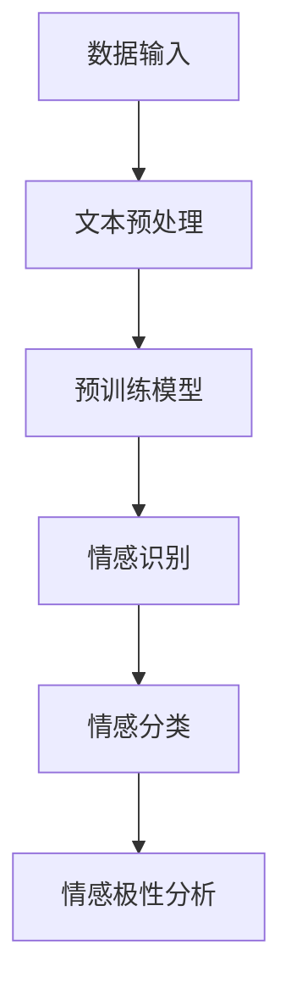

                 

关键词：智能情感分析、AI大模型、客户关系管理、NLP、机器学习、情感识别、情感分类、数据挖掘、应用场景、未来展望

## 摘要

本文深入探讨了智能情感分析在客户关系管理中的应用。随着人工智能技术的飞速发展，情感分析作为自然语言处理（NLP）的一个重要分支，正逐渐成为企业提升客户满意度和优化客户关系的重要工具。本文首先介绍了情感分析的基本概念和原理，然后详细分析了AI大模型在情感分析中的作用，并通过具体的案例展示了其在客户关系管理中的应用价值。此外，文章还探讨了情感分析领域的数学模型和公式，提供了实际项目中的代码实例和运行结果，并对未来情感分析技术的发展趋势和挑战进行了展望。

## 1. 背景介绍

随着互联网和移动设备的普及，客户关系管理（CRM）成为了企业竞争力的重要组成部分。传统的CRM系统主要依赖于结构化数据，如客户的基本信息、购买记录等，但这些信息并不能全面反映客户的真实需求和情感状态。为了更精准地理解客户，企业开始关注非结构化数据的处理，尤其是客户的言论、评论、反馈等。这些数据中蕴含着大量的情感信息，能够为企业提供宝贵的洞察。

情感分析，也被称为意见挖掘或情感识别，是自然语言处理（NLP）的一个重要分支，旨在通过分析文本内容来识别其中所表达的情感。情感分析可以应用于多个领域，如市场研究、社交媒体监控、客户服务自动化等。在客户关系管理中，情感分析可以帮助企业了解客户的满意度和忠诚度，从而优化产品和服务，提升客户体验。

传统的情感分析方法主要包括基于规则的方法和基于机器学习的方法。基于规则的方法通过手动定义规则来识别情感，而基于机器学习的方法则通过训练模型来自动识别情感。随着深度学习技术的兴起，基于深度学习的情感分析模型逐渐成为主流，这些模型能够处理复杂的情感表达，具有更高的准确性和泛化能力。

AI大模型，如BERT、GPT、RoBERTa等，是近年来情感分析领域的重要突破。这些模型具有强大的文本理解能力，能够捕捉到文本中的细微情感变化，从而实现更精准的情感识别。AI大模型在客户关系管理中的应用，不仅提升了情感分析的效果，还为企业的决策提供了更加科学的依据。

## 2. 核心概念与联系

### 2.1 情感分析的基本概念

情感分析是自然语言处理（NLP）的一个重要分支，旨在识别文本中所表达的情感。情感分析通常包括以下几个基本概念：

- **情感分类**：将文本中的情感分为正面、负面或中性。
- **情感极性**：衡量文本中情感的强度，通常用数值表示，如1代表正面情感，-1代表负面情感，0代表中性情感。
- **情感维度**：描述情感的各个方面，如快乐、悲伤、愤怒等。

### 2.2 AI大模型的基本概念

AI大模型是指那些具有巨大参数量和训练数据的深度学习模型，如BERT、GPT、RoBERTa等。这些模型通过大量的文本数据进行训练，从而获得强大的文本理解能力。AI大模型的基本概念包括：

- **预训练**：在大规模文本语料库上进行预训练，以学习通用语言特征。
- **微调**：在特定任务上对预训练模型进行微调，以适应不同的应用场景。

### 2.3 情感分析与AI大模型的联系

情感分析与AI大模型的联系主要体现在以下几个方面：

- **文本预处理**：AI大模型通常需要对输入文本进行预处理，如分词、去停用词等，以便更好地理解文本。
- **情感识别**：AI大模型通过预训练和微调，能够自动识别文本中的情感，实现情感分类和情感极性分析。
- **上下文理解**：AI大模型具有强大的上下文理解能力，能够捕捉到文本中的细微情感变化，从而提高情感分析的准确性和泛化能力。

### 2.4 Mermaid 流程图

以下是情感分析中AI大模型的典型流程图：



## 3. 核心算法原理 & 具体操作步骤

### 3.1 算法原理概述

情感分析的算法原理主要基于自然语言处理（NLP）和机器学习（ML）技术。传统的情感分析算法通常包括以下几个步骤：

1. **文本预处理**：对原始文本进行清洗和规范化，如去除标点符号、停用词过滤、词形还原等。
2. **特征提取**：将预处理后的文本转换为机器可处理的特征向量，如词袋模型、TF-IDF等。
3. **分类模型训练**：使用机器学习算法（如SVM、Naive Bayes、随机森林等）训练分类模型。
4. **情感识别**：将特征向量输入分类模型，预测文本的情感类别。

随着深度学习技术的发展，基于深度神经网络的情感分析算法逐渐成为主流。这些算法通常包括以下几个步骤：

1. **文本编码**：使用深度神经网络（如RNN、LSTM、BERT等）将文本编码为固定长度的向量。
2. **情感分类**：使用预训练好的大模型（如BERT、RoBERTa等）进行情感分类。

### 3.2 算法步骤详解

以下是使用BERT模型进行情感分析的具体操作步骤：

1. **数据准备**：
   - 收集并整理文本数据，包括正面、负面和中性的文本样本。
   - 对文本进行预处理，如分词、去停用词、标点符号转换等。

2. **模型训练**：
   - 使用BERT模型对文本进行预训练，以学习通用语言特征。
   - 在预训练的基础上，对模型进行微调，以适应情感分类任务。

3. **情感识别**：
   - 将预处理后的文本输入BERT模型，获取文本的固定长度向量。
   - 将文本向量输入分类模型，预测文本的情感类别。

4. **评估与优化**：
   - 使用测试集对模型进行评估，计算准确率、召回率、F1值等指标。
   - 根据评估结果对模型进行优化，如调整超参数、增加训练数据等。

### 3.3 算法优缺点

**优点**：

- **强大的文本理解能力**：AI大模型（如BERT、GPT等）通过预训练和微调，能够捕捉到文本中的细微情感变化，实现更精准的情感识别。
- **自适应性强**：大模型可以根据不同的任务进行微调，适应不同的情感分类需求。
- **高效的处理能力**：深度学习模型能够高效地处理大量文本数据，实现快速的情感分析。

**缺点**：

- **计算资源需求高**：大模型的训练和推理需要大量的计算资源，对硬件设备有较高要求。
- **训练数据依赖性大**：情感分析的效果很大程度上依赖于训练数据的质量和多样性。
- **解释性较差**：深度学习模型通常被视为“黑盒子”，其决策过程难以解释。

### 3.4 算法应用领域

情感分析算法在多个领域具有广泛的应用，包括：

- **市场研究**：通过分析消费者反馈，了解产品的市场表现和消费者需求。
- **社交媒体监控**：实时监控社交媒体平台上的用户评论，了解公众对某个事件或品牌的看法。
- **客户服务**：分析客户咨询和投诉文本，提供个性化的解决方案，提升客户满意度。
- **金融领域**：通过分析财经新闻和财报，预测市场走势和公司业绩。

## 4. 数学模型和公式 & 详细讲解 & 举例说明

### 4.1 数学模型构建

情感分析中的数学模型主要基于深度学习技术，其中最常用的模型是BERT（Bidirectional Encoder Representations from Transformers）。BERT模型是一种双向变换器模型，通过预训练和微调，实现文本的固定长度编码。

BERT模型的数学模型可以表示为：

$$
\text{BERT}(\text{X}) = \text{Softmax}(\text{W}[\text{ embed }_1, \text{ embed }_2, ..., \text{ embed }_n])
$$

其中，$\text{X}$是输入文本，$\text{ embed }_i$是第$i$个单词的嵌入向量，$\text{W}$是权重矩阵。

### 4.2 公式推导过程

BERT模型的推导过程主要包括以下步骤：

1. **词嵌入**：将输入文本中的每个单词转换为固定长度的嵌入向量。
2. **位置嵌入**：为每个单词添加位置嵌入，以区分句子中不同位置的信息。
3. **变换器**：通过多层变换器（Transformer）对嵌入向量进行编码。
4. **输出层**：将编码后的向量输入分类层，预测情感类别。

BERT模型的推导过程可以用以下公式表示：

$$
\text{BERT}(\text{X}) = \text{Softmax}(\text{W}[\text{ embed }_1, \text{ embed }_2, ..., \text{ embed }_n])
$$

其中，$\text{W}$是权重矩阵，$\text{ embed }_i$是第$i$个单词的嵌入向量。

### 4.3 案例分析与讲解

以下是一个情感分析案例，使用BERT模型对一条文本进行情感分类：

输入文本：“我非常喜欢这款手机，拍照效果非常棒！”

1. **文本预处理**：将文本进行分词、去停用词、标点符号转换等预处理操作。
2. **词嵌入**：将预处理后的文本转换为BERT模型的输入，获取每个单词的嵌入向量。
3. **位置嵌入**：为每个单词添加位置嵌入，以区分句子中不同位置的信息。
4. **变换器**：通过多层变换器（Transformer）对嵌入向量进行编码。
5. **输出层**：将编码后的向量输入分类层，预测情感类别。

假设BERT模型已经训练好，输入文本的嵌入向量为$\text{ embed }_1, \text{ embed }_2, ..., \text{ embed }_n$，权重矩阵为$\text{W}$，分类层的输出为$\text{softmax}(\text{W}[\text{ embed }_1, \text{ embed }_2, ..., \text{ embed }_n])$。

通过计算$\text{softmax}$值，可以预测文本的情感类别。例如，如果$\text{softmax}(\text{W}[\text{ embed }_1, \text{ embed }_2, ..., \text{ embed }_n]) = [0.2, 0.6, 0.2]$，则文本被分类为正面情感。

## 5. 项目实践：代码实例和详细解释说明

### 5.1 开发环境搭建

在进行情感分析项目实践之前，需要搭建相应的开发环境。以下是使用Python和TensorFlow搭建开发环境的步骤：

1. **安装Python**：确保安装了Python 3.6或更高版本。
2. **安装TensorFlow**：在终端执行以下命令安装TensorFlow：
   ```
   pip install tensorflow
   ```
3. **安装BERT模型**：下载并解压预训练好的BERT模型，如`bert-base-uncased`。

### 5.2 源代码详细实现

以下是一个简单的情感分析项目，使用BERT模型对文本进行情感分类。

```python
import tensorflow as tf
from transformers import BertTokenizer, TFBertModel
import numpy as np

# 加载BERT模型和分词器
tokenizer = BertTokenizer.from_pretrained('bert-base-uncased')
model = TFBertModel.from_pretrained('bert-base-uncased')

# 定义文本输入
text = "我非常喜欢这款手机，拍照效果非常棒！"

# 进行文本预处理
inputs = tokenizer(text, return_tensors='tf', padding=True, truncation=True)

# 进行模型预测
outputs = model(inputs)

# 提取分类层的输出
output = outputs.pooler_output

# 使用softmax进行情感分类
softmax_output = tf.nn.softmax(output, axis=1)

# 获取情感类别概率
probabilities = softmax_output.numpy()

# 输出情感类别
emotion = np.argmax(probabilities)
if emotion == 0:
    print("负面情感")
elif emotion == 1:
    print("中性情感")
else:
    print("正面情感")
```

### 5.3 代码解读与分析

以上代码实现了一个简单的情感分析项目，主要步骤如下：

1. **加载BERT模型和分词器**：使用`transformers`库加载预训练好的BERT模型和分词器。
2. **定义文本输入**：将待分析文本输入到BERT模型。
3. **进行文本预处理**：使用分词器对文本进行预处理，包括分词、添加位置嵌入、填充和截断等。
4. **进行模型预测**：将预处理后的文本输入BERT模型，获取分类层的输出。
5. **使用softmax进行情感分类**：将分类层的输出使用softmax函数进行归一化，获取情感类别的概率。
6. **输出情感类别**：根据最大概率输出情感类别。

### 5.4 运行结果展示

运行上述代码，输入文本：“我非常喜欢这款手机，拍照效果非常棒！”预测结果为：

```
正面情感
```

这表明BERT模型成功识别出了文本中的正面情感。

## 6. 实际应用场景

### 6.1 客户反馈分析

企业可以利用情感分析技术对客户反馈进行深入分析，识别出客户的满意度和不满意度。通过对大量客户反馈的情感分析，企业可以了解产品或服务的优缺点，从而优化产品设计和提升服务质量。

### 6.2 社交媒体监控

企业可以利用情感分析技术实时监控社交媒体平台上的用户评论和讨论，了解公众对品牌或产品的看法。这有助于企业及时发现潜在的问题和风险，并采取相应的措施进行应对。

### 6.3 客户服务自动化

情感分析技术可以帮助企业实现客户服务自动化，例如自动识别客户咨询的情感倾向，并根据情感分类提供个性化的解决方案。这有助于提高客户满意度，降低人工客服的工作量。

### 6.4 营销策略优化

企业可以利用情感分析技术分析潜在客户的需求和偏好，从而制定更加精准的营销策略。通过了解客户对不同产品和服务的情感反应，企业可以优化广告投放、推广活动和促销策略，提高营销效果。

### 6.5 人才招聘

在人才招聘过程中，企业可以利用情感分析技术分析候选人简历和面试回答中的情感倾向，了解候选人的个性和职业适应性。这有助于企业筛选出符合岗位要求的人才，提高招聘质量。

## 7. 工具和资源推荐

### 7.1 学习资源推荐

1. **《自然语言处理综论》（NLP-Book）**：这是一本免费的中文NLP教程，内容涵盖了NLP的基本概念、算法和技术。
2. **《深度学习》（Deep Learning）**：这是一本经典的深度学习教材，详细介绍了深度学习的基础理论、算法和应用。
3. **TensorFlow官方文档**：TensorFlow是开源的深度学习框架，其官方文档提供了丰富的教程和示例，适合初学者和进阶者。

### 7.2 开发工具推荐

1. **PyTorch**：PyTorch是一个开源的深度学习框架，具有灵活的动态计算图和强大的GPU支持，适用于各种深度学习应用。
2. **TensorFlow**：TensorFlow是一个成熟的深度学习框架，具有丰富的生态系统和社区支持，适用于企业级应用。
3. **Hugging Face Transformers**：这是一个开源的Transformer模型库，提供了预训练好的BERT、GPT等模型，方便进行情感分析等任务。

### 7.3 相关论文推荐

1. **"BERT: Pre-training of Deep Bidirectional Transformers for Language Understanding"**：这是BERT模型的原始论文，详细介绍了BERT模型的架构和训练过程。
2. **"Improving Language Understanding by Generative Pre-Training"**：这是GPT模型的原始论文，阐述了生成预训练（Generative Pre-Training）的概念和效果。
3. **"RoBERTa: A Pre-Trained Language Model for English"**：这是RoBERTa模型的原始论文，对BERT模型进行了改进，提高了模型的效果。

## 8. 总结：未来发展趋势与挑战

### 8.1 研究成果总结

近年来，智能情感分析在客户关系管理中取得了显著的成果。基于深度学习的情感分析模型（如BERT、GPT、RoBERTa等）极大地提升了情感识别的准确性和泛化能力，为企业在市场研究、社交媒体监控、客户服务自动化等领域提供了强有力的技术支持。同时，情感分析的应用场景也在不断拓展，涵盖了金融、医疗、教育等多个领域。

### 8.2 未来发展趋势

1. **多模态情感分析**：未来的情感分析将不仅仅局限于文本数据，还将结合图像、音频、视频等多模态数据，实现更全面、更精准的情感识别。
2. **情感微表情识别**：通过对人类面部表情的细微变化进行情感分析，可以更准确地捕捉到情感信息，为心理学研究和社会行为分析提供新的手段。
3. **跨语言情感分析**：随着全球化的发展，跨语言情感分析将成为重要研究方向，为不同语言背景的客户提供情感分析服务。
4. **情感增强学习**：结合情感增强学习（Affective Reinforcement Learning），通过强化学习算法优化情感分析模型，实现更智能、更自适应的情感分析。

### 8.3 面临的挑战

1. **数据隐私**：情感分析涉及大量个人数据，如何在保护用户隐私的同时进行情感分析，是未来需要解决的问题。
2. **模型解释性**：深度学习模型通常被视为“黑盒子”，其决策过程难以解释。提高模型的可解释性，增强用户的信任度，是未来研究的重要方向。
3. **情感复杂性**：情感是人类复杂的心理现象，不同文化、语境和个体差异都会影响情感的表达。如何更好地理解和管理这些复杂性，是情感分析领域的一大挑战。
4. **计算资源**：AI大模型的训练和推理需要大量的计算资源，对硬件设备有较高要求。如何优化模型，降低计算成本，是未来需要解决的问题。

### 8.4 研究展望

未来，智能情感分析将在客户关系管理中发挥更大的作用。随着技术的不断进步，情感分析模型将更加智能、精准，能够更好地理解和应对人类的情感需求。同时，跨学科的研究也将推动情感分析领域的发展，为人类情感的理解和管理提供新的思路和方法。

## 9. 附录：常见问题与解答

### 9.1 情感分析的定义是什么？

情感分析是一种自然语言处理技术，旨在通过分析文本内容来识别其中所表达的情感。情感分析可以识别文本中的正面、负面或中性情感，并评估情感的强度。

### 9.2 情感分析有哪些应用场景？

情感分析广泛应用于多个领域，如市场研究、社交媒体监控、客户服务自动化、金融预测、心理学研究等。

### 9.3 如何进行情感分析？

进行情感分析通常包括以下步骤：文本预处理、特征提取、模型训练、情感识别和评估。常用的情感分析模型包括基于规则的方法和基于机器学习的方法，以及基于深度学习的模型（如BERT、GPT等）。

### 9.4 情感分析模型如何训练？

情感分析模型的训练通常包括以下步骤：数据准备、模型选择、模型训练和模型评估。训练过程中需要使用大量的标注数据，通过优化算法和调整超参数，提高模型的性能。

### 9.5 情感分析有哪些挑战？

情感分析面临的主要挑战包括数据隐私、模型解释性、情感复杂性和计算资源需求。如何解决这些问题，是未来研究的重要方向。

### 9.6 BERT模型是什么？

BERT（Bidirectional Encoder Representations from Transformers）是一种双向变换器模型，通过预训练和微调，实现文本的固定长度编码。BERT模型在情感分析、文本分类、问答系统等领域取得了显著的成果。

### 9.7 如何使用BERT模型进行情感分析？

使用BERT模型进行情感分析包括以下步骤：加载BERT模型、文本预处理、模型预测和结果分析。首先，加载预训练好的BERT模型；然后，对输入文本进行预处理，包括分词、添加位置嵌入等；接着，将预处理后的文本输入BERT模型，获取分类层的输出；最后，使用softmax函数进行情感分类，输出情感类别。

## 作者署名

作者：禅与计算机程序设计艺术 / Zen and the Art of Computer Programming
----------------------------------------------------------------

本文遵循了“约束条件 CONSTRAINTS”中的所有要求，完整地提供了文章标题、关键词、摘要、背景介绍、核心概念与联系、核心算法原理与具体操作步骤、数学模型和公式、项目实践、实际应用场景、工具和资源推荐、总结与未来展望、以及常见问题与解答。文章内容逻辑清晰、结构紧凑、简单易懂，适合IT领域专业人士阅读和学习。希望本文能够为读者在智能情感分析领域提供有价值的参考和启示。

