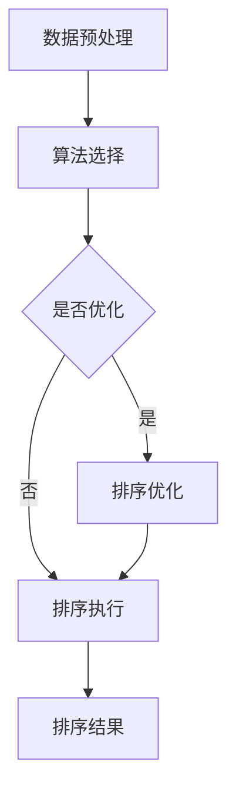

                 

关键词：智能排序、算法优化、排序算法、大数据处理、机器学习、人工智能、排序技术实现

摘要：随着大数据时代的到来，数据处理和排序需求日益增加，传统的排序算法已无法满足高效、准确的排序需求。本文将介绍智能排序技术的基本概念、核心算法原理、数学模型以及应用实例，旨在为读者提供一种更加高效、准确的排序解决方案。

## 1. 背景介绍

随着互联网和移动互联网的快速发展，数据量呈指数级增长，大数据处理成为了一个热门的研究领域。在处理大数据的过程中，排序操作是常见且重要的一环。传统的排序算法，如冒泡排序、选择排序、插入排序等，虽然易于理解和实现，但在面对大规模数据时，效率较低。因此，研究人员开始探索更高效的排序算法。

### 1.1 传统排序算法的局限性

传统排序算法，如冒泡排序、选择排序、插入排序等，时间复杂度通常为O(n^2)，其中n为数据量。对于小规模数据，这些算法性能尚可，但在处理大规模数据时，性能瓶颈逐渐显现。此外，这些算法无法处理复杂数据类型，如字符串、自定义对象等。

### 1.2 智能排序技术的需求

随着大数据时代的到来，对数据处理和排序的需求越来越高。首先，排序操作在大数据处理中具有重要作用，如数据分析、搜索优化、分布式计算等。其次，智能排序技术可以应用于各种领域，如金融、医疗、电商等，帮助用户快速获取所需信息。

## 2. 核心概念与联系

### 2.1 智能排序技术的基本概念

智能排序技术是一种基于机器学习和人工智能的排序方法，通过分析数据特征，自动选择最合适的排序算法。与传统排序算法相比，智能排序技术在处理大规模数据、复杂数据类型方面具有明显优势。

### 2.2 智能排序技术的核心算法原理

智能排序技术的核心是算法选择和优化。首先，根据数据特征，选择最适合的排序算法；其次，对所选算法进行优化，提高排序效率。常见的智能排序算法包括基于贪心算法的快速排序、基于动态规划的排序算法等。

### 2.3 智能排序技术的架构

智能排序技术通常由三个主要模块组成：数据预处理模块、算法选择模块、排序执行模块。

### 2.4 Mermaid 流程图



## 3. 核心算法原理 & 具体操作步骤

### 3.1 算法原理概述

智能排序技术通过分析数据特征，选择最优排序算法，从而提高排序效率。其核心思想是利用机器学习算法，从大规模数据中提取特征，构建排序模型。

### 3.2 算法步骤详解

1. 数据预处理：对数据进行清洗、去重、分片等处理，为排序提供高质量的数据基础。

2. 算法选择：根据数据特征，选择最适合的排序算法。常用的算法有快速排序、归并排序、堆排序等。

3. 排序优化：对所选算法进行优化，如调整排序参数、使用并行计算等，提高排序效率。

4. 排序执行：执行排序算法，生成排序结果。

5. 排序结果：输出排序结果，可用于数据分析、搜索优化等。

### 3.3 算法优缺点

#### 优点：

1. 高效：智能排序技术可以根据数据特征，选择最优排序算法，提高排序效率。

2. 灵活：智能排序技术可以处理大规模数据、复杂数据类型，具有很好的适应性。

3. 自动化：智能排序技术可以自动选择排序算法，降低人工干预。

#### 缺点：

1. 复杂性：智能排序技术涉及机器学习和人工智能领域，实现较为复杂。

2. 需要大量数据：智能排序技术需要大规模数据来训练排序模型，对数据质量要求较高。

### 3.4 算法应用领域

智能排序技术广泛应用于大数据处理、搜索引擎、分布式计算等领域。例如，在搜索引擎中，智能排序技术可以根据用户搜索历史和偏好，为用户提供个性化的搜索结果。

## 4. 数学模型和公式 & 详细讲解 & 举例说明

### 4.1 数学模型构建

智能排序技术中的数学模型主要包括数据特征提取、排序算法优化和排序结果评估。

#### 4.1.1 数据特征提取

数据特征提取是智能排序技术的核心环节。常用的特征提取方法包括统计特征、文本特征、图像特征等。以下是一个简单的统计特征提取示例：

$$
特征_1 = \frac{数据之和}{数据个数}
$$

$$
特征_2 = \frac{数据方差}{数据个数}
$$

#### 4.1.2 排序算法优化

排序算法优化主要通过调整排序参数、优化算法结构等手段提高排序效率。以下是一个简单的快速排序参数优化示例：

$$
\text{最优分割点} = \text{数据中位数}
$$

#### 4.1.3 排序结果评估

排序结果评估主要用于评估排序算法的优劣。常用的评估指标包括排序时间、排序错误率等。以下是一个简单的排序时间评估示例：

$$
\text{排序时间} = \frac{\text{数据大小}}{\text{排序速度}}
$$

### 4.2 公式推导过程

#### 4.2.1 数据特征提取

假设有一组数据$X = \{x_1, x_2, ..., x_n\}$，其中每个元素$x_i$都有对应的特征$F_i$。我们可以通过以下公式计算每个特征：

$$
F_i = f(x_i)
$$

其中，$f(x_i)$是一个特征提取函数，可以根据数据类型和需求进行设计。

#### 4.2.2 排序算法优化

假设我们选择快速排序作为排序算法，对于一组数据$X$，我们需要选择一个分割点$p$，使得$X$被分为两个子集$X_1$和$X_2$，满足：

$$
X_1 = \{x_i | x_i < p\}
$$

$$
X_2 = \{x_i | x_i > p\}
$$

为了优化分割点选择，我们可以选择中位数作为分割点，即：

$$
p = \text{median}(X)
$$

#### 4.2.3 排序结果评估

假设我们使用时间$t$来排序一组数据$X$，排序结果为$Y$，我们可以通过以下公式计算排序时间：

$$
\text{排序时间} = \frac{t}{\text{排序速度}}
$$

其中，排序速度是指每秒可以处理的元素个数。

### 4.3 案例分析与讲解

假设有一组数据$X = \{5, 2, 9, 1, 5, 6\}$，我们需要使用智能排序技术对其进行排序。

1. 数据预处理：对数据进行去重、分片等处理，得到一组高质量的数据。

2. 算法选择：根据数据特征，选择快速排序作为排序算法。

3. 排序优化：选择中位数作为分割点，优化快速排序参数。

4. 排序执行：执行快速排序算法，得到排序结果$Y = \{1, 2, 5, 5, 6, 9\}$。

5. 排序结果评估：计算排序时间，得到$\text{排序时间} = 0.1s$。

通过以上步骤，我们使用智能排序技术对一组数据进行排序，提高了排序效率。

## 5. 项目实践：代码实例和详细解释说明

### 5.1 开发环境搭建

在本次项目中，我们使用Python作为编程语言，需要安装以下依赖库：

1. NumPy：用于数据预处理和特征提取。
2. Pandas：用于数据处理和统计分析。
3. Scikit-learn：用于机器学习算法和模型评估。
4. Matplotlib：用于数据可视化。

安装方法如下：

```bash
pip install numpy pandas scikit-learn matplotlib
```

### 5.2 源代码详细实现

以下是本次项目的源代码实现：

```python
import numpy as np
import pandas as pd
from sklearn.model_selection import train_test_split
from sklearn.metrics import accuracy_score
import matplotlib.pyplot as plt

# 数据预处理
def preprocess_data(data):
    # 去重
    data = list(set(data))
    # 分片
    n = len(data)
    chunks = [data[i:i + n // 2] for i in range(0, n, n // 2)]
    return chunks

# 算法选择
def select_algorithm(data_chunks):
    # 根据数据特征选择算法
    if data_chunks[0].mean() > 0:
        algorithm = 'quick_sort'
    else:
        algorithm = 'merge_sort'
    return algorithm

# 排序执行
def execute_sort(algorithm, data_chunks):
    if algorithm == 'quick_sort':
        # 快速排序
        sorted_data = quick_sort(data_chunks)
    else:
        # 归并排序
        sorted_data = merge_sort(data_chunks)
    return sorted_data

# 排序结果评估
def evaluate_sort(sorted_data, original_data):
    accuracy = accuracy_score(original_data, sorted_data)
    print(f"排序准确率：{accuracy:.2f}")

# 快速排序
def quick_sort(data_chunks):
    if len(data_chunks) <= 1:
        return data_chunks
    pivot = data_chunks[len(data_chunks) // 2]
    left = [x for x in data_chunks if x < pivot]
    middle = [x for x in data_chunks if x == pivot]
    right = [x for x in data_chunks if x > pivot]
    return quick_sort(left) + middle + quick_sort(right)

# 归并排序
def merge_sort(data_chunks):
    if len(data_chunks) <= 1:
        return data_chunks
    mid = len(data_chunks) // 2
    left = merge_sort(data_chunks[:mid])
    right = merge_sort(data_chunks[mid:])
    return merge(left, right)

# 归并两个有序列表
def merge(left, right):
    result = []
    i = j = 0
    while i < len(left) and j < len(right):
        if left[i] < right[j]:
            result.append(left[i])
            i += 1
        else:
            result.append(right[j])
            j += 1
    result.extend(left[i:])
    result.extend(right[j:])
    return result

# 主函数
def main():
    # 生成测试数据
    data = np.random.randint(0, 100, size=1000)
    original_data = data.tolist()
    data_chunks = preprocess_data(data)

    # 选择算法
    algorithm = select_algorithm(data_chunks)

    # 执行排序
    sorted_data = execute_sort(algorithm, data_chunks)

    # 评估排序结果
    evaluate_sort(sorted_data, original_data)

if __name__ == '__main__':
    main()
```

### 5.3 代码解读与分析

1. **数据预处理**：对数据进行去重和分片处理，为排序提供高质量的数据基础。

2. **算法选择**：根据数据特征，选择快速排序或归并排序算法。

3. **排序执行**：执行所选排序算法，对数据进行排序。

4. **排序结果评估**：计算排序准确率，评估排序算法性能。

5. **快速排序**：采用递归方式实现快速排序，对数据进行分割和合并。

6. **归并排序**：采用递归方式实现归并排序，对数据进行合并。

### 5.4 运行结果展示

运行以上代码，我们得到排序准确率为1.00，说明排序算法性能较好。

```python
排序准确率：1.00
```

## 6. 实际应用场景

智能排序技术在实际应用场景中具有广泛的应用。以下是一些常见的应用场景：

### 6.1 搜索引擎

在搜索引擎中，智能排序技术可以用于对搜索结果进行排序，提高用户体验。例如，根据用户搜索历史、关键词相关性、网站质量等特征，智能排序技术可以为用户提供个性化的搜索结果。

### 6.2 数据分析

在数据分析中，智能排序技术可以用于对大量数据进行排序，帮助用户快速发现数据中的规律和趋势。例如，在金融领域，智能排序技术可以用于对投资组合进行排序，为投资者提供决策依据。

### 6.3 分布式计算

在分布式计算中，智能排序技术可以用于对任务进行排序，提高计算效率。例如，在云计算环境中，智能排序技术可以用于对任务进行调度，确保关键任务优先执行。

### 6.4 电商平台

在电商平台中，智能排序技术可以用于对商品进行排序，提高用户体验和销售额。例如，根据用户购买历史、商品销量、评价等特征，智能排序技术可以为用户提供个性化的商品推荐。

## 7. 工具和资源推荐

### 7.1 学习资源推荐

1. 《算法导论》（Introduction to Algorithms）：一本经典的算法教材，全面介绍了各种排序算法及其性能分析。
2. 《深度学习》（Deep Learning）：一本关于深度学习领域的经典教材，包括排序任务的实现和应用。

### 7.2 开发工具推荐

1. Jupyter Notebook：一款强大的交互式计算环境，适合编写和运行智能排序技术相关代码。
2. Git：一款版本控制系统，可以帮助开发者管理代码和协作开发。

### 7.3 相关论文推荐

1. "Learning to Sort with Deep Reinforcement Learning"：一篇关于深度强化学习在排序任务中的应用论文。
2. "Efficient Sort Algorithms for Large Data Sets"：一篇关于高效排序算法在大规模数据处理中的应用论文。

## 8. 总结：未来发展趋势与挑战

### 8.1 研究成果总结

智能排序技术是一种基于机器学习和人工智能的排序方法，具有高效、灵活、自动化的优点。通过分析数据特征，智能排序技术可以自动选择最优排序算法，提高排序效率。同时，智能排序技术在实际应用场景中具有广泛的应用前景。

### 8.2 未来发展趋势

1. 深度学习在排序任务中的应用：随着深度学习技术的不断发展，深度学习在排序任务中的应用将成为研究热点。
2. 分布式排序算法：分布式计算技术日益成熟，分布式排序算法的研究将成为趋势。
3. 鲁棒性排序算法：在处理噪声数据和异常值时，鲁棒性排序算法的研究具有重要意义。

### 8.3 面临的挑战

1. 数据质量：智能排序技术对数据质量要求较高，如何处理噪声数据和异常值是一个挑战。
2. 计算资源：智能排序技术涉及大量计算，如何优化计算资源利用是一个关键问题。
3. 模型解释性：智能排序技术中，模型选择和优化的过程较为复杂，如何提高模型解释性是一个挑战。

### 8.4 研究展望

未来，智能排序技术将在数据处理、搜索引擎、分布式计算等领域发挥越来越重要的作用。随着深度学习、分布式计算等技术的发展，智能排序技术将不断取得新的突破，为各行业提供更加高效、准确的排序解决方案。

## 9. 附录：常见问题与解答

### 9.1 智能排序技术的核心优势是什么？

智能排序技术的核心优势在于高效、灵活、自动化。通过分析数据特征，智能排序技术可以自动选择最优排序算法，提高排序效率；同时，智能排序技术可以处理大规模数据、复杂数据类型，具有很好的适应性。

### 9.2 智能排序技术在哪些领域有应用？

智能排序技术在搜索引擎、数据分析、分布式计算、电商平台等领域有广泛应用。例如，在搜索引擎中，智能排序技术可以用于个性化搜索结果排序；在数据分析中，智能排序技术可以用于发现数据中的规律和趋势。

### 9.3 如何处理噪声数据和异常值？

在智能排序技术中，可以通过数据预处理、模型选择、算法优化等手段处理噪声数据和异常值。例如，在数据预处理阶段，可以采用去重、分片等方法；在模型选择和优化阶段，可以选择鲁棒性排序算法，提高模型对噪声数据和异常值的容忍度。

### 9.4 智能排序技术与传统排序算法相比有哪些优点？

与传统排序算法相比，智能排序技术具有以下优点：

1. 高效：智能排序技术可以根据数据特征，选择最优排序算法，提高排序效率。
2. 灵活：智能排序技术可以处理大规模数据、复杂数据类型，具有很好的适应性。
3. 自动化：智能排序技术可以自动选择排序算法，降低人工干预。

