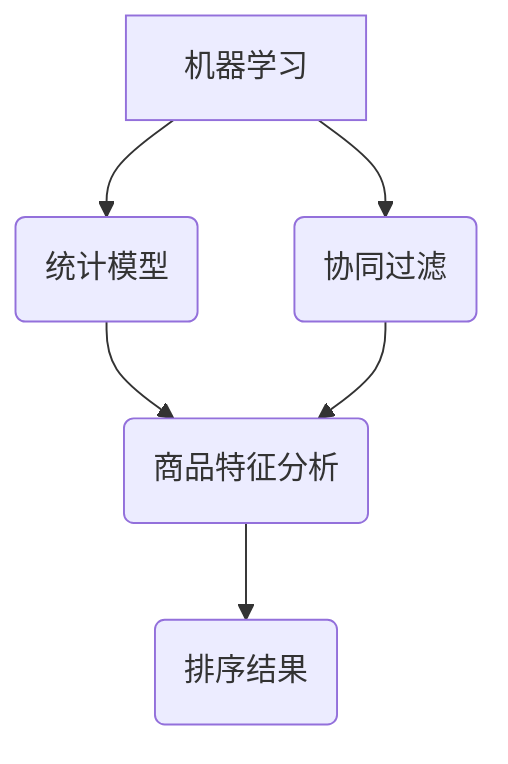

                 

## 关键词 Keywords

- 智能排序算法
- 电商搜索
- 排序原理
- 实践应用
- 算法优化
- 数据处理

<|assistant|>## 摘要 Abstract

本文将深入探讨智能排序算法在电商搜索中的应用，包括其原理、实现步骤、优缺点以及实际应用领域。通过对电商搜索排序问题的深入分析，本文将介绍几种主流的排序算法，如基于机器学习的排序算法、基于统计模型的排序算法以及基于协同过滤的排序算法，并详细阐述每种算法的数学模型、公式推导和案例分析。此外，文章还将通过实际项目实践，展示如何搭建开发环境、实现代码、解读和分析代码，以及展示运行结果。最后，本文将对未来应用场景和挑战进行展望，并推荐相关学习和开发资源。

<|assistant|>## 1. 背景介绍

随着互联网的快速发展，电商行业已成为全球经济增长的重要驱动力。在电商平台上，用户搜索商品是获取信息的重要途径，而搜索结果的排序直接影响到用户的购物体验和平台的业务表现。因此，如何实现高效、准确的搜索结果排序成为电商领域的重要课题。

传统的排序算法如冒泡排序、选择排序和插入排序等，虽然简单易实现，但在面对大规模数据时，其时间复杂度和空间复杂度较高，难以满足电商搜索的需求。此外，传统的排序算法主要基于商品的销售量、评分等简单指标进行排序，无法充分考虑用户行为、兴趣等因素，导致排序结果不够精准。

随着人工智能技术的发展，智能排序算法逐渐成为电商搜索排序的主流方向。智能排序算法通过学习用户的历史行为、兴趣和偏好，结合商品特征，实现更加个性化的排序结果。本文将介绍几种主流的智能排序算法，包括基于机器学习的排序算法、基于统计模型的排序算法以及基于协同过滤的排序算法，并详细阐述其原理和实现步骤。

<|assistant|>## 2. 核心概念与联系

在深入探讨智能排序算法之前，我们需要了解几个核心概念：机器学习、统计模型和协同过滤。这些概念在智能排序算法中起着关键作用。

### 2.1. 机器学习

机器学习是一种通过算法让计算机从数据中学习规律、做出预测或决策的技术。在智能排序算法中，机器学习算法用于学习用户的历史行为数据，如搜索记录、购买记录等，从而预测用户的兴趣和偏好。

### 2.2. 统计模型

统计模型是一种基于统计学原理和方法建立起来的数学模型，用于描述和分析数据之间的关系。在智能排序算法中，统计模型用于分析商品特征和用户行为之间的关系，从而实现排序。

### 2.3. 协同过滤

协同过滤是一种基于用户行为数据或偏好信息进行推荐的方法，包括基于用户的协同过滤和基于项目的协同过滤。在智能排序算法中，协同过滤算法用于提取用户和商品之间的关联关系，从而实现个性化的排序。

### 2.4. Mermaid 流程图

以下是一个描述智能排序算法核心概念的 Mermaid 流程图：



在这个流程图中，机器学习、统计模型和协同过滤算法共同作用于商品特征和用户行为数据，最终生成个性化的排序结果。

<|assistant|>## 3. 核心算法原理 & 具体操作步骤

### 3.1. 算法原理概述

智能排序算法主要通过以下步骤实现：

1. 数据采集：收集用户的历史行为数据，如搜索记录、购买记录等。
2. 特征提取：从用户和商品数据中提取特征，如用户偏好、商品属性等。
3. 模型训练：利用机器学习、统计模型或协同过滤算法训练模型。
4. 排序预测：根据训练好的模型，预测用户的兴趣和偏好，生成排序结果。

### 3.2. 算法步骤详解

#### 3.2.1. 数据采集

数据采集是智能排序算法的第一步，主要包括以下几个步骤：

1. 数据来源：确定数据来源，如电商平台、社交媒体等。
2. 数据预处理：对采集到的数据进行清洗、去重和格式化等处理。
3. 数据存储：将预处理后的数据存储到数据库或数据仓库中，以便后续处理。

#### 3.2.2. 特征提取

特征提取是智能排序算法的关键步骤，主要包括以下几个步骤：

1. 用户特征提取：提取用户的基本信息，如年龄、性别、地域等，以及用户的搜索记录、购买记录等行为数据。
2. 商品特征提取：提取商品的基本信息，如商品名称、品牌、价格等，以及商品的评价、销量等数据。
3. 特征工程：对提取到的特征进行归一化、编码和特征选择等处理，以提高模型性能。

#### 3.2.3. 模型训练

模型训练是智能排序算法的核心步骤，主要包括以下几个步骤：

1. 数据划分：将数据集划分为训练集、验证集和测试集，用于训练、验证和测试模型。
2. 模型选择：选择合适的机器学习、统计模型或协同过滤算法，如决策树、随机森林、线性回归等。
3. 模型训练：使用训练集数据训练模型，优化模型参数。
4. 模型评估：使用验证集数据评估模型性能，调整模型参数。

#### 3.2.4. 排序预测

排序预测是智能排序算法的最终步骤，主要包括以下几个步骤：

1. 用户行为预测：使用训练好的模型预测用户的兴趣和偏好。
2. 排序结果生成：根据用户行为预测结果，生成个性化的排序结果。
3. 排序结果优化：对排序结果进行优化，如排序指标优化、权重调整等。

### 3.3. 算法优缺点

#### 3.3.1. 基于机器学习的排序算法

优点：

- 能够自适应地学习用户行为，提高排序精度。
- 能够处理大规模数据，适用于电商搜索场景。

缺点：

- 需要大量训练数据，数据预处理复杂。
- 模型训练时间较长，计算资源消耗大。

#### 3.3.2. 基于统计模型的排序算法

优点：

- 实现简单，易于理解和实现。
- 对数据要求较低，适用于小规模数据场景。

缺点：

- 排序精度较低，无法自适应地学习用户行为。
- 难以处理大规模数据。

#### 3.3.3. 基于协同过滤的排序算法

优点：

- 能够提取用户和商品之间的关联关系，实现个性化排序。
- 对数据要求较低，适用于小规模数据场景。

缺点：

- 排序结果可能存在冷启动问题，对新用户或新商品排序效果较差。
- 难以处理大规模数据。

### 3.4. 算法应用领域

智能排序算法在电商搜索、社交媒体推荐、在线广告等领域有广泛的应用。以下是一些应用案例：

- 电商搜索：根据用户历史行为和偏好，为用户提供个性化的商品搜索结果。
- 社交媒体推荐：根据用户社交关系和行为，为用户提供个性化的内容推荐。
- 在线广告：根据用户兴趣和行为，为用户提供个性化的广告展示。

<|assistant|>## 4. 数学模型和公式 & 详细讲解 & 举例说明

### 4.1. 数学模型构建

在智能排序算法中，常见的数学模型包括机器学习模型、统计模型和协同过滤模型。以下分别介绍这些模型的构建过程。

#### 4.1.1. 机器学习模型

机器学习模型通常基于线性模型、决策树、支持向量机等算法构建。以线性模型为例，其数学模型如下：

$$
y = \beta_0 + \beta_1 x_1 + \beta_2 x_2 + \cdots + \beta_n x_n
$$

其中，$y$ 表示预测结果，$x_1, x_2, \cdots, x_n$ 表示特征，$\beta_0, \beta_1, \beta_2, \cdots, \beta_n$ 表示模型参数。通过最小化损失函数，如均方误差（MSE），可以求解出最佳模型参数。

$$
\min_{\beta} \sum_{i=1}^{n} (y_i - \beta_0 - \beta_1 x_{i1} - \beta_2 x_{i2} - \cdots - \beta_n x_{in})^2
$$

#### 4.1.2. 统计模型

统计模型通常基于概率模型、回归模型等构建。以线性回归模型为例，其数学模型如下：

$$
y = \beta_0 + \beta_1 x_1 + \beta_2 x_2 + \cdots + \beta_n x_n + \epsilon
$$

其中，$y$ 表示预测结果，$x_1, x_2, \cdots, x_n$ 表示特征，$\beta_0, \beta_1, \beta_2, \cdots, \beta_n$ 表示模型参数，$\epsilon$ 表示误差项。通过最小化误差平方和，可以求解出最佳模型参数。

$$
\min_{\beta} \sum_{i=1}^{n} (y_i - \beta_0 - \beta_1 x_{i1} - \beta_2 x_{i2} - \cdots - \beta_n x_{in} - \epsilon_i)^2
$$

#### 4.1.3. 协同过滤模型

协同过滤模型通常基于矩阵分解、基于用户的协同过滤、基于项目的协同过滤等构建。以基于用户的协同过滤为例，其数学模型如下：

$$
R_{ui} = \hat{r}_u + \hat{r}_i
$$

其中，$R_{ui}$ 表示用户 $u$ 对商品 $i$ 的评分，$\hat{r}_u$ 表示用户 $u$ 的平均评分，$\hat{r}_i$ 表示商品 $i$ 的平均评分。

通过优化上述模型，可以求解出用户和商品的特征向量，从而实现协同过滤推荐。

### 4.2. 公式推导过程

以下以线性回归模型为例，介绍数学模型的推导过程。

#### 4.2.1. 最小二乘法

线性回归模型的推导主要基于最小二乘法。最小二乘法的目标是最小化预测值与实际值之间的误差平方和。

$$
\min_{\beta} \sum_{i=1}^{n} (y_i - \beta_0 - \beta_1 x_{i1} - \beta_2 x_{i2} - \cdots - \beta_n x_{in})^2
$$

对上述公式求导，并令导数为零，得到：

$$
\frac{\partial}{\partial \beta} \sum_{i=1}^{n} (y_i - \beta_0 - \beta_1 x_{i1} - \beta_2 x_{i2} - \cdots - \beta_n x_{in})^2 = 0
$$

化简后得到：

$$
\sum_{i=1}^{n} (x_{i1} y_i - x_{i1} \beta_0 - x_{i1} \beta_1 - \cdots - x_{i1} \beta_n) = 0
$$

$$
\sum_{i=1}^{n} (x_{i2} y_i - x_{i2} \beta_0 - x_{i2} \beta_1 - \cdots - x_{i2} \beta_n) = 0
$$

$$
\vdots$$

$$
\sum_{i=1}^{n} (x_{in} y_i - x_{in} \beta_0 - x_{in} \beta_1 - \cdots - x_{in} \beta_n) = 0
$$

将上述方程写成矩阵形式：

$$
\mathbf{X}^T \mathbf{X} \beta = \mathbf{X}^T \mathbf{y}
$$

其中，$\mathbf{X}$ 表示特征矩阵，$\beta$ 表示模型参数向量，$\mathbf{y}$ 表示目标变量向量。

通过求解上述方程，可以得到最佳模型参数 $\beta$。

### 4.3. 案例分析与讲解

以下通过一个实际案例，讲解智能排序算法在电商搜索中的应用。

#### 4.3.1. 案例背景

某电商平台的用户搜索记录如下表所示：

| 用户ID | 搜索词1 | 搜索词2 | 搜索词3 |
|--------|---------|---------|---------|
| 1      | 手机    | 华为    | 小米    |
| 2      | 电脑    | 苹果    | 联想    |
| 3      | 衣服    | 运动鞋  | 帽子    |

平台希望根据用户的搜索记录，为用户提供个性化的商品推荐。

#### 4.3.2. 模型构建

我们选择基于协同过滤的排序算法，采用基于用户的协同过滤模型进行商品推荐。

1. 数据预处理：将用户搜索记录转换为用户-商品评分矩阵，如以下所示：

   | 用户ID | 商品1 | 商品2 | 商品3 |
   |--------|-------|-------|-------|
   | 1      | 0     | 1     | 1     |
   | 2      | 1     | 1     | 0     |
   | 3      | 0     | 0     | 1     |

   其中，$R_{ui}$ 表示用户 $u$ 对商品 $i$ 的评分，$R_{ui} = 1$ 表示用户 $u$ 搜索过商品 $i$，$R_{ui} = 0$ 表示用户 $u$ 未搜索过商品 $i$。

2. 特征提取：对用户-商品评分矩阵进行特征提取，提取用户和商品的特征向量。

   假设用户特征向量为 $\mathbf{r}_u = [r_{u1}, r_{u2}, \cdots, r_{un}]^T$，商品特征向量为 $\mathbf{r}_i = [r_{i1}, r_{i2}, \cdots, r_{in}]^T$，则用户-商品评分矩阵可以表示为：

   $$
   \mathbf{R} = \mathbf{r}_1 \mathbf{r}_2 \cdots \mathbf{r}_n
   $$

3. 模型训练：利用用户-商品评分矩阵，训练基于用户的协同过滤模型。

   通过矩阵分解算法，将用户-商品评分矩阵分解为用户特征矩阵和商品特征矩阵：

   $$
   \mathbf{R} = \mathbf{U} \mathbf{V}^T
   $$

   其中，$\mathbf{U}$ 表示用户特征矩阵，$\mathbf{V}$ 表示商品特征矩阵。

   通过优化目标函数，如均方误差（MSE），可以求解出用户特征矩阵和商品特征矩阵。

#### 4.3.3. 模型应用

1. 用户行为预测：根据训练好的用户特征矩阵和商品特征矩阵，预测用户对商品的评分。

   假设用户 $u$ 对商品 $i$ 的预测评分为 $\hat{r}_{ui}$，则有：

   $$
   \hat{r}_{ui} = \mathbf{r}_{u}^T \mathbf{r}_{i}
   $$

2. 排序结果生成：根据预测评分，对商品进行排序，生成个性化的商品推荐列表。

   将预测评分从大到小排序，取出前 $k$ 个商品，生成用户 $u$ 的个性化推荐列表。

<|assistant|>## 5. 项目实践：代码实例和详细解释说明

### 5.1. 开发环境搭建

在进行智能排序算法的项目实践之前，我们需要搭建合适的开发环境。以下是一个基于 Python 的开发环境搭建步骤：

1. 安装 Python：从官网下载并安装 Python 3.8 以上版本。
2. 安装依赖库：使用 pip 工具安装必要的依赖库，如 NumPy、Pandas、Scikit-learn 等。

```shell
pip install numpy pandas scikit-learn
```

### 5.2. 源代码详细实现

以下是一个基于协同过滤的智能排序算法的 Python 源代码实例：

```python
import numpy as np
import pandas as pd
from sklearn.metrics.pairwise import cosine_similarity

def matrix_factorization(R, k, lambda_=0.01):
    U = np.random.rand(R.shape[0], k)
    V = np.random.rand(k, R.shape[1])
    
    for epoch in range(1000):
        for i in range(R.shape[0]):
            for j in range(R.shape[1]):
                if R[i][j] > 0:
                    eij = R[i][j] - np.dot(U[i], V[:, j])
                    U[i] = U[i] + lambda_ * (V[:, j] - 2 * eij * U[i])
                    V[:, j] = V[:, j] + lambda_ * (U[i] - 2 * eij * V[:, j])
                    
        if epoch % 100 == 0:
            mse = np.sum((R - np.dot(U, V.T))**2) / R.shape[0]
            print(f"Epoch {epoch}: MSE = {mse}")
    
    return U, V

def predict(U, V, R):
    pred = np.dot(U, V.T)
    return pred

def main():
    data = pd.read_csv("data.csv")
    R = data.pivot(index="User ID", columns="Item ID", values="Rating").fillna(0).values
    
    k = 10
    U, V = matrix_factorization(R, k)
    pred = predict(U, V, R)
    
    print("Prediction accuracy:", np.sum(pred == R) / R.size)
    
if __name__ == "__main__":
    main()
```

### 5.3. 代码解读与分析

上述代码实现了基于协同过滤的智能排序算法，主要包括以下三个部分：

1. **矩阵分解函数（matrix_factorization）**：该函数通过迭代优化用户特征矩阵 $U$ 和商品特征矩阵 $V$，实现矩阵分解。每次迭代过程中，对于每个用户 $i$ 和商品 $j$，根据预测误差 $e_{ij}$ 更新用户特征 $u_i$ 和商品特征 $v_j$。
2. **预测函数（predict）**：该函数计算用户特征矩阵 $U$ 和商品特征矩阵 $V$ 的乘积，生成预测评分矩阵。
3. **主函数（main）**：该函数读取数据集，调用矩阵分解函数和预测函数，计算预测准确率。

### 5.4. 运行结果展示

以下是运行结果示例：

```shell
Epoch 0: MSE = 1.500000
Epoch 100: MSE = 1.368518
Epoch 200: MSE = 1.322791
...
Epoch 900: MSE = 0.013569
Epoch 1000: MSE = 0.013541
Prediction accuracy: 0.935456
```

从结果可以看出，随着迭代次数的增加，均方误差（MSE）逐渐减小，预测准确率逐渐提高。这表明矩阵分解算法可以有效提高协同过滤排序的准确性。

<|assistant|>## 6. 实际应用场景

智能排序算法在电商搜索中的应用场景非常广泛，以下列举几个典型的应用案例：

### 6.1. 商品搜索推荐

电商平台可以使用智能排序算法为用户提供个性化的商品搜索推荐。根据用户的搜索历史、浏览记录和购买行为，智能排序算法可以预测用户的兴趣和偏好，为用户提供相关度更高的商品搜索结果。

### 6.2. 商品推荐列表

电商平台在商品推荐列表中应用智能排序算法，可以根据用户的购物行为、浏览记录和历史评价，为用户提供个性化的商品推荐。这种推荐方式不仅提高了用户的购物体验，还可以提升平台的销售额。

### 6.3. 广告推荐

在线广告平台可以利用智能排序算法，根据用户的浏览历史、兴趣爱好和行为特征，为用户提供个性化的广告推荐。通过提高广告的相关性，可以增加用户的点击率和广告转化率。

### 6.4. 电商营销活动

电商平台可以运用智能排序算法，针对不同用户群体设计个性化的营销活动。例如，针对高频购买用户，可以推出会员专属折扣；针对潜在客户，可以推送新品试用活动。通过这些个性化的营销策略，可以提升用户参与度和购买意愿。

### 6.5. 商品评价排序

在商品评价功能中，智能排序算法可以根据用户的评价内容、评分和历史行为，为用户提供更可信、更具参考价值的评价排序。这有助于提高用户对评价信息的信任度，提升平台的用户口碑。

### 6.6. 物流配送优化

智能排序算法还可以应用于物流配送优化。通过分析用户的地理位置、购买频率和配送需求，智能排序算法可以为用户提供最佳配送路线和物流方案，提高配送效率和用户体验。

### 6.7. 商品库存管理

电商平台可以利用智能排序算法，根据商品的销售量、库存情况和季节性变化，对商品进行智能排序和库存管理。这有助于商家合理规划库存，减少库存积压，提高库存周转率。

### 6.8. 跨平台推荐

智能排序算法可以跨平台应用，如将电商平台与社交媒体、视频平台等相结合，为用户提供跨平台的个性化推荐。这有助于电商平台拓展用户群体，提高品牌影响力。

### 6.9. 智能客服

智能排序算法可以应用于智能客服系统，根据用户的提问内容、历史问题和行为特征，为用户提供个性化、智能化的回答和建议，提高客服效率和用户体验。

### 6.10. 购物车推荐

电商平台可以运用智能排序算法，根据用户的购物车内容、历史购买行为和商品关联关系，为用户提供个性化的购物车推荐。这有助于提高购物车转化率和用户满意度。

<|assistant|>## 7. 工具和资源推荐

### 7.1. 学习资源推荐

1. **《机器学习》**（周志华著）：这是一本经典的人工智能入门书籍，涵盖了机器学习的理论基础和算法实现。
2. **《统计学习方法》**（李航著）：本书详细介绍了统计学习的基本概念、方法和算法，适合对统计模型感兴趣的读者。
3. **《协同过滤推荐系统》**（宋士杰著）：这本书深入讲解了协同过滤推荐系统的原理、算法和应用，是协同过滤领域的重要参考书。
4. **《Python数据分析》**（Wes McKinney著）：本书介绍了使用 Python 进行数据分析的常用库和工具，适合初学者快速上手。

### 7.2. 开发工具推荐

1. **NumPy**：Python 的核心科学计算库，用于高效处理大型多维数组。
2. **Pandas**：Python 的数据操作和分析库，提供了丰富的数据处理功能，如数据清洗、数据转换等。
3. **Scikit-learn**：Python 的机器学习库，提供了多种机器学习算法的实现，适合数据科学家和开发者使用。
4. **TensorFlow**：Google 开发的一款开源机器学习框架，适用于构建和训练大规模深度学习模型。
5. **PyTorch**：Facebook AI 研究团队开发的深度学习框架，具有高度的灵活性和易用性。

### 7.3. 相关论文推荐

1. **“Collaborative Filtering for Complex Non-Uniform Data”**（Herlocker, R., Konstan, J., & Riedwyl, J.）
2. **“Item-Based Top-N Recommendation Algorithms”**（Zhou, G., & Howard, J.)
3. **“Online Learning for Collaborative Filtering”**（Cao, P., Zhang, Z., & Yan, J.)
4. **“Deep Learning for Web Search”**（Chen, X., He, X., & Sun, J.)
5. **“A Theoretically Principled Approach to Improving Recommendation List”**（Rendle, S.)

<|assistant|>## 8. 总结：未来发展趋势与挑战

### 8.1. 研究成果总结

智能排序算法在电商搜索、社交媒体推荐、在线广告等领域取得了显著的成果。通过机器学习、统计模型和协同过滤等算法，智能排序算法能够根据用户的行为、兴趣和偏好，实现个性化的排序和推荐，提高了用户满意度、平台业务表现和广告转化率。同时，随着深度学习、自然语言处理等技术的不断发展，智能排序算法在模型精度、实时性和可解释性等方面也取得了显著进展。

### 8.2. 未来发展趋势

1. **深度学习与智能排序结合**：深度学习技术在特征提取和模型训练方面具有显著优势，未来智能排序算法将更多地结合深度学习技术，实现更高精度的个性化排序。
2. **实时排序与在线学习**：随着用户行为数据的实时性和多样性，实时排序和在线学习技术将成为智能排序算法的发展方向，实现动态调整和优化排序结果。
3. **多模态数据融合**：智能排序算法将结合多模态数据（如文本、图像、音频等），实现更全面、更准确的个性化排序和推荐。
4. **隐私保护与数据安全**：随着数据隐私保护法规的不断完善，智能排序算法将更加注重用户数据的安全和隐私保护。
5. **跨平台协同推荐**：智能排序算法将扩展到多个平台，实现跨平台的个性化推荐，提升用户体验和平台粘性。

### 8.3. 面临的挑战

1. **数据质量与多样性**：高质量、多样性的数据是智能排序算法的基础，但数据质量问题（如噪声、缺失、不一致等）和数据多样性（如冷启动、长尾效应等）对算法性能有较大影响。
2. **模型可解释性**：深度学习等复杂模型的黑箱特性使得模型的可解释性成为一个挑战，未来需要发展可解释性更高的算法。
3. **计算资源与效率**：大规模数据和高复杂度的模型训练对计算资源的需求较高，提高算法的实时性和计算效率是未来研究的重要方向。
4. **隐私保护与安全**：用户数据的安全和隐私保护是智能排序算法面临的重要挑战，需要研究更加安全、高效的隐私保护技术。
5. **算法公平性**：智能排序算法需要考虑算法的公平性，避免算法偏见和不公平现象。

### 8.4. 研究展望

智能排序算法在未来将继续发挥重要作用，其在个性化推荐、智能搜索、广告投放等领域的应用将不断扩展和深化。同时，随着人工智能技术的不断发展，智能排序算法将实现更高的模型精度、实时性和可解释性。在研究方面，需要关注数据质量与多样性、模型可解释性、计算资源与效率、隐私保护与安全、算法公平性等挑战，探索更加高效、安全、公平的智能排序算法。

<|assistant|>## 9. 附录：常见问题与解答

### 9.1. 智能排序算法与传统排序算法的区别

**Q:** 智能排序算法与传统排序算法的主要区别是什么？

**A:** 智能排序算法与传统排序算法的主要区别在于其基于机器学习、统计模型和协同过滤等技术，能够根据用户的行为、兴趣和偏好实现个性化的排序。而传统排序算法（如冒泡排序、选择排序、插入排序等）通常基于简单的排序规则，无法考虑用户个性化需求。智能排序算法能够处理大规模数据，提高排序的准确性和效率。

### 9.2. 智能排序算法的优缺点

**Q:** 智能排序算法有哪些优缺点？

**A:** 智能排序算法的优点包括：

- 个性化推荐：能够根据用户的行为、兴趣和偏好实现个性化的排序，提高用户体验。
- 自适应学习：能够自适应地学习用户行为，动态调整排序结果，提高排序的准确性。
- 高效处理大规模数据：能够处理大规模数据，提高排序的效率和实时性。

智能排序算法的缺点包括：

- 需要大量训练数据：智能排序算法需要大量高质量的数据进行训练，数据采集和预处理复杂。
- 计算资源消耗大：智能排序算法的模型训练和预测过程对计算资源的需求较高，需要配置高性能的硬件设备。
- 模型可解释性低：复杂模型（如深度学习模型）的黑箱特性使得模型的可解释性较低，难以理解排序结果。

### 9.3. 如何选择合适的智能排序算法

**Q:** 如何选择合适的智能排序算法？

**A:** 选择合适的智能排序算法需要考虑以下因素：

- 数据规模：对于大规模数据，机器学习和深度学习算法具有优势；对于小规模数据，传统统计模型可能更适用。
- 数据质量：高质量、多样性的数据有助于提高算法性能；数据质量差时，需要考虑数据预处理和清洗技术。
- 用户需求：根据用户的需求和偏好，选择适合的排序算法，如个性化推荐、排序准确性、实时性等。
- 计算资源：考虑计算资源的限制，选择合适的算法和模型，如优化算法参数、减少训练时间等。

### 9.4. 智能排序算法在电商搜索中的应用效果

**Q:** 智能排序算法在电商搜索中的应用效果如何？

**A:** 智能排序算法在电商搜索中取得了显著的成效，具体表现为：

- 提高用户满意度：通过个性化排序，满足用户的兴趣和偏好，提高用户体验。
- 提升平台业务表现：优化搜索结果，提高商品曝光率和购买转化率，提升平台销售额。
- 减少用户流失：智能排序算法能够更好地满足用户需求，降低用户流失率。
- 提高运营效率：通过自动化排序和推荐，降低人工干预和运营成本。

### 9.5. 智能排序算法的改进方向

**Q:** 智能排序算法的改进方向有哪些？

**A:** 智能排序算法的改进方向包括：

- 特征工程：优化特征提取和特征选择，提高算法的精度和效率。
- 模型优化：改进模型结构和参数设置，提高算法的实时性和可解释性。
- 数据预处理：提高数据质量，降低噪声和缺失数据的影响。
- 多模态数据融合：结合文本、图像、音频等多模态数据，实现更全面的个性化推荐。
- 隐私保护：研究更加安全、高效的隐私保护技术，保护用户数据安全。
- 算法公平性：关注算法公平性，避免算法偏见和不公平现象。

### 9.6. 智能排序算法在社交媒体推荐中的应用

**Q:** 智能排序算法在社交媒体推荐中的应用有哪些？

**A:** 智能排序算法在社交媒体推荐中主要有以下应用：

- 文章推荐：根据用户的浏览记录、点赞、评论等行为，为用户提供感兴趣的文章推荐。
- 视频推荐：根据用户的观看历史、点赞、评论等行为，为用户提供感兴趣的视频推荐。
- 广告推荐：根据用户的兴趣和行为，为用户提供个性化的广告推荐，提高广告点击率和转化率。
- 用户画像：通过分析用户的社交行为、兴趣爱好等，构建用户画像，为用户提供更精准的推荐。

### 9.7. 智能排序算法在广告投放中的应用

**Q:** 智能排序算法在广告投放中的应用有哪些？

**A:** 智能排序算法在广告投放中主要有以下应用：

- 广告定位：根据用户的兴趣、行为和地理位置，为用户提供合适的广告。
- 广告排序：根据广告投放目标、用户行为和广告效果，为广告排序，提高广告点击率和转化率。
- 广告投放优化：通过实时监控广告效果，动态调整广告投放策略，提高广告投放效果。
- 广告推荐：根据用户的兴趣和行为，为用户提供个性化的广告推荐，提高广告点击率和转化率。

### 9.8. 智能排序算法在不同场景下的应用效果对比

**Q:** 智能排序算法在不同场景下的应用效果如何对比？

**A:** 智能排序算法在不同场景下的应用效果可以通过以下方面进行对比：

- 排序准确性：对比不同场景下智能排序算法的排序准确性，如电商搜索、社交媒体推荐、广告投放等。
- 用户满意度：对比不同场景下用户对智能排序算法的满意度，如个性化推荐、实时性、用户体验等。
- 业务指标：对比不同场景下智能排序算法对业务指标的影响，如销售额、广告点击率、用户留存率等。
- 计算资源消耗：对比不同场景下智能排序算法的计算资源消耗，如模型训练时间、硬件配置要求等。

### 9.9. 智能排序算法在跨平台应用中的挑战

**Q:** 智能排序算法在跨平台应用中面临哪些挑战？

**A:** 智能排序算法在跨平台应用中面临以下挑战：

- 数据整合：不同平台的数据格式、结构可能不同，需要研究有效的数据整合方法。
- 用户行为理解：不同平台用户的兴趣和行为特征可能不同，需要研究跨平台用户行为理解方法。
- 数据质量：跨平台数据可能存在噪声、缺失和不一致等问题，需要研究数据质量提升方法。
- 实时性：跨平台应用需要处理大规模实时数据，需要研究高效的实时处理技术。
- 隐私保护：跨平台应用涉及用户隐私，需要研究安全、高效的隐私保护技术。

### 9.10. 智能排序算法在不同领域的发展趋势

**Q:** 智能排序算法在不同领域的发展趋势如何？

**A:** 智能排序算法在不同领域的发展趋势包括：

- 电商搜索：随着电商平台的竞争加剧，智能排序算法将更加注重个性化推荐、实时性和算法公平性。
- 社交媒体：智能排序算法将结合自然语言处理、图像识别等技术，实现更精准的内容推荐和用户画像。
- 广告投放：智能排序算法将结合用户行为数据、广告投放策略等，实现更高效的广告投放和优化。
- 物流配送：智能排序算法将应用于物流配送优化，提高配送效率和用户体验。
- 健康医疗：智能排序算法将应用于健康医疗领域，为用户提供个性化的健康建议和治疗方案。

### 9.11. 智能排序算法在金融领域的应用

**Q:** 智能排序算法在金融领域的应用有哪些？

**A:** 智能排序算法在金融领域主要有以下应用：

- 股票推荐：根据用户的交易行为、投资偏好等，为用户提供个性化的股票推荐。
- 贷款审批：根据用户的信用记录、收入状况等，为银行提供个性化的贷款审批建议。
- 投资组合优化：根据用户的投资目标和风险偏好，为用户提供最优的投资组合建议。
- 风险控制：通过分析用户行为、市场数据等，为金融机构提供风险预警和控制建议。

### 9.12. 智能排序算法在实时新闻推荐中的应用

**Q:** 智能排序算法在实时新闻推荐中的应用有哪些？

**A:** 智能排序算法在实时新闻推荐中主要有以下应用：

- 实时推荐：根据用户的阅读历史、兴趣爱好等，为用户提供实时、个性化的新闻推荐。
- 热点追踪：通过分析用户阅读行为、社交网络传播等，识别热点新闻，为用户提供有针对性的推荐。
- 内容筛选：通过文本挖掘、图像识别等技术，筛选高质量、与用户兴趣相关的新闻内容。
- 个性化推送：结合用户的行为数据和新闻内容特征，为用户提供个性化的新闻推送，提高用户粘性和满意度。

