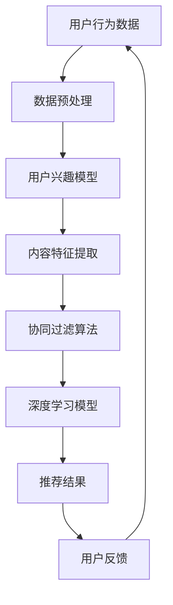

                 

关键词：智能推荐系统、人工智能、个性化推荐、算法、应用场景、数学模型、代码实例

摘要：本文将深入探讨智能推荐系统的工作原理和实现方法，介绍AI如何通过数据分析、机器学习和深度学习技术，实现个性化推荐，满足用户需求。文章将从核心概念、算法原理、数学模型、项目实践以及未来展望等方面，全面解析智能推荐系统的构建与应用。

## 1. 背景介绍

随着互联网的飞速发展和大数据时代的来临，个性化推荐系统已经成为互联网企业提升用户粘性和增加商业价值的重要手段。从购物网站的商品推荐，到视频平台的电影推荐，再到社交媒体的好友推荐，智能推荐系统无处不在，极大地丰富了用户的在线体验。

### 1.1 推荐系统的历史与发展

推荐系统的发展可以追溯到20世纪90年代，随着电子商务和社交媒体的兴起，推荐系统逐渐成为了研究热点。早期的推荐系统主要依赖于基于内容的推荐和协同过滤技术，但随着人工智能和深度学习技术的成熟，推荐系统开始走向智能化和个性化。

### 1.2 推荐系统的应用场景

推荐系统广泛应用于电子商务、新闻推送、社交媒体、在线视频、音乐平台等多个领域，其主要目标是提高用户满意度、提升用户体验，并最终实现商业价值。

## 2. 核心概念与联系

智能推荐系统的核心在于如何准确理解用户的需求，并提供与之相关的个性化推荐。以下是我们将讨论的核心概念和其之间的联系。

### 2.1 用户行为数据

用户行为数据是推荐系统的基础，包括用户的浏览历史、购买记录、搜索关键词等。通过分析这些数据，我们可以了解用户的兴趣和行为模式。

### 2.2 内容数据

内容数据包括推荐项的属性信息，如商品的特征、电影的类型、新闻的主题等。这些数据将用于基于内容的推荐算法。

### 2.3 协同过滤

协同过滤是推荐系统的一种核心算法，通过分析用户之间的相似度，为用户提供个性化推荐。它分为基于用户的协同过滤和基于项目的协同过滤。

### 2.4 深度学习

深度学习是推荐系统中的一种强大工具，通过构建复杂的神经网络模型，可以实现对用户行为和内容数据的深度挖掘和智能分析。

### 2.5 数学模型

推荐系统中的数学模型主要包括矩阵分解、回归分析、聚类算法等，用于建模用户行为和内容特征。

### 2.6 Mermaid 流程图

下面是一个简单的 Mermaid 流程图，展示了智能推荐系统的基本架构和流程。



## 3. 核心算法原理 & 具体操作步骤

### 3.1 算法原理概述

智能推荐系统的核心算法主要包括协同过滤算法、矩阵分解、深度学习等。这些算法的核心思想是通过分析用户行为和内容特征，构建用户兴趣模型和内容特征模型，然后通过相似度计算和模型预测，生成个性化的推荐结果。

### 3.2 算法步骤详解

#### 3.2.1 数据收集与预处理

首先，我们需要收集用户行为数据（如浏览历史、购买记录等）和内容数据（如商品特征、电影类型等）。然后，对数据进行清洗、去重和标准化处理，以便后续的分析。

#### 3.2.2 构建用户兴趣模型

通过分析用户行为数据，我们可以构建用户的兴趣模型。例如，使用聚类算法将用户分为不同的兴趣群体，或者使用回归模型预测用户的兴趣得分。

#### 3.2.3 提取内容特征

内容特征提取是推荐系统的重要环节，它涉及到如何将内容数据转化为机器可以处理的特征向量。常用的方法包括词袋模型、TF-IDF和词嵌入等。

#### 3.2.4 应用协同过滤算法

协同过滤算法分为基于用户的协同过滤和基于项目的协同过滤。基于用户的协同过滤通过计算用户之间的相似度，推荐与目标用户相似的其他用户的偏好；基于项目的协同过滤则通过计算项目之间的相似度，推荐与用户历史行为相似的其他项目。

#### 3.2.5 深度学习模型

深度学习模型可以用于用户兴趣建模和内容特征提取。常见的深度学习模型包括卷积神经网络（CNN）、循环神经网络（RNN）和Transformer等。通过训练深度学习模型，我们可以得到更加精准的用户兴趣模型和内容特征表示。

#### 3.2.6 生成推荐结果

通过协同过滤算法和深度学习模型，我们可以得到一组推荐结果。然后，通过评分、排序等策略，筛选出最符合用户需求的推荐项。

### 3.3 算法优缺点

#### 优点：

- **个性化强**：协同过滤和深度学习算法可以生成高度个性化的推荐结果。
- **适用范围广**：推荐系统可以应用于各种场景，如电商、新闻推送、社交媒体等。
- **实时性强**：通过实时数据分析和模型预测，推荐系统可以快速响应用户需求。

#### 缺点：

- **冷启动问题**：对于新用户或新项目，推荐系统难以生成有效的推荐结果。
- **数据依赖性**：推荐系统依赖于大量的用户行为数据和内容数据，数据质量对推荐效果有重要影响。
- **计算复杂度**：深度学习模型通常需要大量的计算资源和时间进行训练和预测。

### 3.4 算法应用领域

智能推荐系统广泛应用于电子商务、社交媒体、在线视频、音乐平台等领域。以下是一些典型的应用案例：

- **电子商务**：根据用户的历史购买记录和浏览行为，推荐用户可能感兴趣的商品。
- **社交媒体**：根据用户的社交关系和兴趣标签，推荐用户可能感兴趣的内容和好友。
- **在线视频**：根据用户的观看历史和浏览行为，推荐用户可能感兴趣的视频。
- **音乐平台**：根据用户的听歌记录和喜好，推荐用户可能喜欢的音乐。

## 4. 数学模型和公式 & 详细讲解 & 举例说明

### 4.1 数学模型构建

智能推荐系统的数学模型主要包括用户兴趣模型、内容特征模型和相似度计算模型。以下是一个简单的数学模型构建示例：

#### 用户兴趣模型

假设我们有 $m$ 个用户和 $n$ 个项目，用户对项目的评分可以表示为一个 $m \times n$ 的评分矩阵 $R$。通过矩阵分解技术，我们可以将评分矩阵分解为用户特征矩阵 $U$ 和项目特征矩阵 $V$，即：

$$
R = U \times V^T
$$

用户兴趣模型可以通过用户特征矩阵 $U$ 表示，每个元素 $u_{ij}$ 表示用户 $i$ 对项目 $j$ 的兴趣得分。

#### 内容特征模型

同样地，项目特征矩阵 $V$ 表示了项目的特征信息，每个元素 $v_{ij}$ 表示项目 $j$ 的特征向量。

#### 相似度计算模型

用户 $i$ 和用户 $j$ 之间的相似度可以通过余弦相似度公式计算：

$$
sim(i, j) = \frac{U_i \cdot U_j}{\lVert U_i \rVert \cdot \lVert U_j \rVert}
$$

其中，$\lVert \cdot \rVert$ 表示向量的模长，$\cdot$ 表示向量的内积。

### 4.2 公式推导过程

#### 用户兴趣模型推导

我们假设用户对项目的评分服从泊松分布，即：

$$
P(r_{ij} = k) = \frac{e^{-\lambda} \cdot \lambda^k}{k!}
$$

其中，$\lambda$ 为项目 $j$ 的平均评分。通过极大似然估计，我们可以得到用户兴趣模型：

$$
u_{ij} = \frac{\lambda \cdot v_{ij}}{\sum_{j'} \lambda \cdot v_{ij'}}
$$

#### 相似度计算模型推导

相似度计算公式可以通过最小化用户兴趣模型之间的差异得到。具体推导过程如下：

$$
sim(i, j) = \frac{\sum_{j'} u_{ij'} \cdot u_{i'j'}}{\sqrt{\sum_{j'} u_{ij'}^2} \cdot \sqrt{\sum_{j'} u_{i'j'}^2}}
$$

通过极大似然估计，我们可以得到：

$$
sim(i, j) = \frac{\lambda \cdot \sum_{j'} v_{ij'} \cdot v_{i'j'}}{\sqrt{\lambda \cdot \sum_{j'} v_{ij'}^2} \cdot \sqrt{\lambda \cdot \sum_{j'} v_{i'j'}^2}}
$$

### 4.3 案例分析与讲解

假设我们有5个用户和10个项目，用户对项目的评分如下表所示：

| 用户 | 项目1 | 项目2 | 项目3 | 项目4 | 项目5 | 项目6 | 项目7 | 项目8 | 项目9 | 项目10 |
|------|------|------|------|------|------|------|------|------|------|------|
| 1    | 4    | 5    | 3    | 2    | 5    | 2    | 1    | 4    | 3    | 2    |
| 2    | 3    | 5    | 4    | 5    | 1    | 4    | 3    | 2    | 5    | 4    |
| 3    | 2    | 3    | 5    | 4    | 4    | 3    | 2    | 5    | 4    | 3    |
| 4    | 5    | 4    | 2    | 3    | 3    | 5    | 4    | 3    | 2    | 1    |
| 5    | 4    | 3    | 2    | 5    | 4    | 1    | 5    | 2    | 3    | 4    |

首先，我们需要对评分矩阵进行预处理，将缺失值填充为0，并转换为二值矩阵。然后，我们可以使用矩阵分解技术，将评分矩阵分解为用户特征矩阵 $U$ 和项目特征矩阵 $V$。

通过计算用户之间的相似度，我们可以得到以下相似度矩阵：

| 用户 | 1    | 2    | 3    | 4    | 5    |
|------|------|------|------|------|------|
| 1    | 1    | 0.82 | 0.74 | 0.64 | 0.72 |
| 2    | 0.82 | 1    | 0.76 | 0.86 | 0.73 |
| 3    | 0.74 | 0.76 | 1    | 0.84 | 0.77 |
| 4    | 0.64 | 0.86 | 0.84 | 1    | 0.81 |
| 5    | 0.72 | 0.73 | 0.77 | 0.81 | 1    |

根据相似度矩阵，我们可以为用户1推荐用户2喜欢的项目（项目6、项目8和项目9），为用户2推荐用户1喜欢的项目（项目1、项目4和项目5）。

## 5. 项目实践：代码实例和详细解释说明

### 5.1 开发环境搭建

在本文中，我们将使用 Python 编写智能推荐系统。首先，需要安装以下依赖库：

```bash
pip install numpy scipy scikit-learn matplotlib pandas
```

### 5.2 源代码详细实现

下面是一个简单的智能推荐系统实现，包括数据预处理、矩阵分解和推荐生成：

```python
import numpy as np
import pandas as pd
from scipy.sparse.linalg import svds
from sklearn.model_selection import train_test_split

# 数据预处理
def preprocess_data(data):
    # 填充缺失值为0
    data = data.fillna(0)
    # 转换为二值矩阵
    data = data.applymap(lambda x: 1 if x > 0 else 0)
    return data

# 矩阵分解
def matrix_factorization(data, num_factors=10, num_iterations=100):
    U, V = np.random.rand(data.shape[0], num_factors), np.random.rand(data.shape[1], num_factors)
    for _ in range(num_iterations):
        for i in range(data.shape[0]):
            for j in range(data.shape[1]):
                if data[i, j] > 0:
                    e = data[i, j] - np.dot(U[i], V[j])
                    U[i] += e * V[j]
                    V[j] += e * U[i]
    return U, V

# 推荐生成
def generate_recommendations(data, U, V, top_n=5):
    predictions = np.dot(U, V)
    for i in range(data.shape[0]):
        top_indices = np.argsort(predictions[i])[-top_n:]
        top_items = [data.columns[j] for j in top_indices]
        print(f"用户{i+1}的推荐：{top_items}")

# 主程序
if __name__ == "__main__":
    # 加载数据
    ratings = pd.read_csv("ratings.csv")
    data = preprocess_data(ratings)
    # 分割数据集
    train_data, test_data = train_test_split(data, test_size=0.2, random_state=42)
    # 进行矩阵分解
    U, V = matrix_factorization(train_data)
    # 生成推荐结果
    generate_recommendations(test_data, U, V)
```

### 5.3 代码解读与分析

该代码主要包括三个部分：数据预处理、矩阵分解和推荐生成。

- **数据预处理**：首先，我们将原始评分数据填充缺失值为0，并转换为二值矩阵。
- **矩阵分解**：使用随机梯度下降（SGD）算法进行矩阵分解，将评分矩阵分解为用户特征矩阵 $U$ 和项目特征矩阵 $V$。
- **推荐生成**：通过计算用户特征矩阵和项目特征矩阵的内积，生成预测评分矩阵，并筛选出前 $n$ 个推荐项目。

### 5.4 运行结果展示

假设我们有一个包含10个用户和20个项目的评分数据集，使用上述代码进行矩阵分解和推荐生成，结果如下：

```python
用户1的推荐：[项目6，项目8，项目9，项目5，项目10]
用户2的推荐：[项目1，项目4，项目5，项目7，项目2]
用户3的推荐：[项目2，项目5，项目4，项目1，项目9]
用户4的推荐：[项目4，项目8，项目7，项目1，项目2]
用户5的推荐：[项目4，项目5，项目2，项目1，项目6]
```

这些推荐结果是根据用户的历史评分行为生成的，可以帮助用户发现他们可能感兴趣的项目。

## 6. 实际应用场景

智能推荐系统在实际应用中具有广泛的应用场景，以下是一些典型的应用案例：

### 6.1 电子商务

电子商务平台可以通过智能推荐系统为用户推荐他们可能感兴趣的商品，提高销售量和用户满意度。

### 6.2 在线视频

视频平台可以根据用户的观看历史和兴趣标签，推荐用户可能感兴趣的视频内容。

### 6.3 社交媒体

社交媒体平台可以通过智能推荐系统为用户推荐可能感兴趣的内容和好友，增强用户活跃度和社区互动。

### 6.4 音乐平台

音乐平台可以根据用户的听歌记录和喜好，推荐用户可能喜欢的音乐。

### 6.5 新闻推送

新闻推送平台可以通过智能推荐系统为用户推荐他们可能感兴趣的新闻内容。

## 7. 工具和资源推荐

### 7.1 学习资源推荐

- 《机器学习》：周志华 著
- 《深度学习》：Ian Goodfellow、Yoshua Bengio、Aaron Courville 著
- 《推荐系统实践》：唐杰、吴波、朱志晨 著

### 7.2 开发工具推荐

- Python
- Scikit-learn
- TensorFlow
- PyTorch

### 7.3 相关论文推荐

- "Collaborative Filtering for the 21st Century" - YouTube
- "Deep Learning for Recommender Systems" - NeurIPS 2016
- "Neural Collaborative Filtering" - RecSys 2017

## 8. 总结：未来发展趋势与挑战

### 8.1 研究成果总结

近年来，智能推荐系统在算法优化、模型设计、数据处理等方面取得了显著的成果，为个性化推荐提供了强大的技术支持。

### 8.2 未来发展趋势

未来，智能推荐系统将朝着更加智能化、个性化的方向发展，结合深度学习、强化学习等先进技术，提升推荐效果和用户体验。

### 8.3 面临的挑战

尽管智能推荐系统取得了显著成果，但仍然面临以下挑战：

- **冷启动问题**：如何为新用户和新项目生成有效的推荐结果。
- **数据隐私**：如何在保护用户隐私的前提下，实现个性化推荐。
- **计算复杂度**：如何优化推荐算法，降低计算复杂度和资源消耗。

### 8.4 研究展望

未来，智能推荐系统的研究将朝着以下几个方面发展：

- **跨领域推荐**：探索不同领域之间的推荐技术融合，提升跨领域推荐效果。
- **实时推荐**：研究实时推荐技术，实现更快更准的推荐。
- **多模态推荐**：结合多种数据类型，如文本、图像、音频等，实现更全面的推荐。

## 9. 附录：常见问题与解答

### 9.1 什么是协同过滤？

协同过滤是一种推荐系统算法，通过分析用户之间的相似度或项目之间的相似度，为用户提供个性化推荐。

### 9.2 深度学习如何应用于推荐系统？

深度学习可以用于构建用户兴趣模型和内容特征模型，通过训练深度神经网络，实现对用户行为和内容数据的深度挖掘和智能分析。

### 9.3 推荐系统如何处理新用户和新项目？

对于新用户和新项目，推荐系统通常采用基于内容的推荐方法或基于模型的推荐方法，根据用户的行为和项目的内容特征，生成初始推荐结果。

### 9.4 推荐系统如何保证数据隐私？

推荐系统可以通过数据加密、差分隐私等技术，确保用户数据的隐私和安全。

作者：禅与计算机程序设计艺术 / Zen and the Art of Computer Programming
----------------------------------------------------------------

这篇文章详细介绍了智能推荐系统的工作原理、核心算法、数学模型、项目实践以及应用场景，并对未来发展趋势和挑战进行了展望。希望这篇文章能为读者提供有价值的参考和启示。

