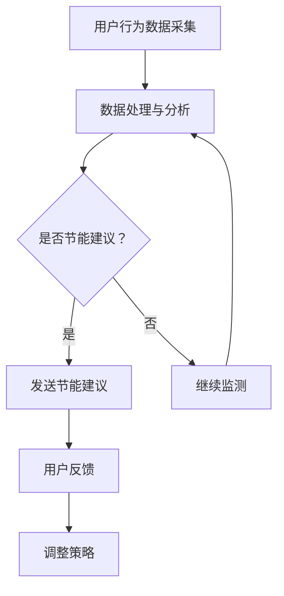

                 

关键词：智能插座，能源管理，注意力经济，物联网，节能技术，人工智能

## 摘要

本文旨在探讨智能插座的能源管理及其在注意力经济中的潜在价值。随着物联网（IoT）技术的快速发展，智能插座作为智能家居系统的重要组成部分，已经广泛应用于家庭和商业环境中。本文首先介绍了智能插座的基本概念和功能，然后深入分析了其能源管理原理和注意力经济的关系。通过对核心算法原理、数学模型构建、项目实践及未来应用展望的详细讲解，本文为读者提供了全面的技术视角，并探讨了智能插座在未来能源管理和注意力经济领域的发展趋势与挑战。

## 1. 背景介绍

智能插座是一种嵌入物联网技术的电力控制设备，通过无线网络实现与智能家居系统的互联互通。传统的插座只能提供基础的电源控制功能，而智能插座则在此基础上增加了远程控制、定时开关、能耗监测、环境感知等多重功能。这使得智能插座不仅能够提高用户的生活质量，还能在节能减排方面发挥重要作用。

近年来，随着智能家居市场的快速增长，智能插座的需求量不断增加。根据市场调研机构的数据，全球智能插座市场规模预计在未来几年内将保持两位数的增长率。这一趋势得益于物联网、人工智能、云计算等技术的快速发展，为智能插座的功能拓展和性能提升提供了强有力的技术支撑。

在能源管理方面，智能插座具有显著的优势。首先，智能插座能够实时监测并记录电力消耗数据，帮助用户了解家电的能耗情况。其次，通过远程控制，用户可以根据实际需要灵活调整电器的开关状态，避免不必要的能源浪费。此外，智能插座还可以与其他智能家居设备联动，实现更智能的能源管理策略，如根据用电高峰和低谷时段调整家电运行时间，优化能源利用效率。

注意力经济作为一种新兴的经济模式，强调用户注意力资源的重要性。在智能家居领域，智能插座通过提供个性化、实时化的服务，可以有效吸引和保持用户的注意力。例如，通过智能插座收集的用户用电行为数据，可以用于个性化推荐系统，为用户提供更精准的节能建议。这种基于注意力资源的管理模式，不仅能够提升用户体验，还能为智能家居企业创造新的商业模式。

## 2. 核心概念与联系

### 2.1 智能插座的基本概念

智能插座是一种集成了物联网通信模块的电力控制设备，具有以下基本功能：

- **远程控制**：用户可以通过智能手机、平板电脑等移动设备远程控制智能插座的开关状态。
- **定时开关**：用户可以设置智能插座的定时开关功能，实现自动化的电源控制。
- **能耗监测**：智能插座能够实时监测并记录电器的用电情况，帮助用户了解家电的能耗情况。
- **环境感知**：部分智能插座具备环境感知功能，可以通过温湿度、光照等参数的监测，为用户提供更智能的能源管理方案。

### 2.2 物联网与智能家居的关系

物联网（IoT）是指通过互联网连接各种设备，实现设备间的互联互通和数据交换。智能家居是物联网应用的一个重要领域，通过将各种家电设备联网，实现家庭设备的自动化和智能化。智能插座作为智能家居系统的一部分，与其他设备（如智能灯泡、智能空调、智能冰箱等）相互联动，共同构成一个智能化的家居环境。

### 2.3 能源管理与注意力经济的关系

能源管理是指通过技术手段优化能源的使用效率，实现节能减排的目标。智能插座在能源管理中具有重要作用，其通过实时监测、远程控制和智能化联动等功能，可以有效降低家庭能源消耗。注意力经济则强调用户注意力资源的重要性，通过提供个性化、实时化的服务，吸引和保持用户的注意力。智能插座通过收集用户用电行为数据，为用户提供节能建议，从而在满足用户需求的同时，实现注意力资源的管理。

### 2.4 Mermaid 流程图

下面是智能插座能源管理原理和架构的 Mermaid 流程图：



## 3. 核心算法原理 & 具体操作步骤

### 3.1 算法原理概述

智能插座的能源管理算法主要基于以下原理：

1. **数据采集与处理**：智能插座通过传感器实时采集家庭用电数据，包括电流、电压、功率等参数。这些数据经过预处理后，传输到云端进行分析和处理。
2. **行为识别与模式分析**：通过对用户用电行为数据的分析，可以识别出用户的日常用电习惯和模式。例如，分析用户在不同时间段的用电情况，识别出高峰和低谷时段。
3. **节能策略生成与调整**：根据用户用电行为数据和节能目标，生成相应的节能策略。这些策略可以包括自动调整电器开关时间、优化家电运行模式等。策略生成后，会根据用户反馈进行调整，以实现更好的节能效果。

### 3.2 算法步骤详解

1. **数据采集**：智能插座通过内置的传感器（如电流传感器、电压传感器）实时采集家庭用电数据，包括电流、电压、功率等参数。这些数据以无线方式传输到云端服务器。
2. **数据处理**：云端服务器对接收到的数据进行预处理，包括去噪、滤波、数据补全等。预处理后的数据存储在数据库中，以供后续分析使用。
3. **行为识别**：通过对用户用电行为数据的分析，使用机器学习算法（如K-means聚类、决策树等）识别用户的用电习惯和模式。这些模式包括日常用电高峰、低谷时段，以及特殊事件（如节假日）的用电模式。
4. **模式分析**：基于用户用电行为模式，分析用户的能源消耗情况。通过对比不同时间段的用电数据，识别出节能潜力大的时间段和电器。
5. **节能策略生成**：根据用户用电行为数据和节能目标，生成相应的节能策略。这些策略可以包括自动调整电器开关时间、优化家电运行模式等。节能策略生成后，会根据用户反馈进行调整，以实现更好的节能效果。
6. **策略执行与反馈**：将生成的节能策略发送到智能插座，智能插座根据策略自动调整电器的开关状态。用户可以对节能效果进行反馈，如调整策略或继续使用智能插座。

### 3.3 算法优缺点

#### 优点

1. **实时监测**：智能插座能够实时监测家庭用电数据，帮助用户了解家电的能耗情况。
2. **个性化推荐**：通过分析用户用电行为数据，智能插座可以为用户提供个性化的节能建议，提高节能效果。
3. **易于实现**：智能插座基于物联网技术，易于与其他智能家居设备集成，实现更智能的能源管理。

#### 缺点

1. **数据隐私**：智能插座收集的用户用电数据可能涉及用户隐私，需要确保数据的安全性和隐私保护。
2. **算法复杂度**：智能插座需要处理大量的用户数据，算法复杂度较高，对计算资源有一定的要求。

### 3.4 算法应用领域

智能插座的能源管理算法可以应用于多个领域：

1. **家庭**：智能插座可以帮助家庭用户实现节能减排，降低能源消耗。
2. **商业**：智能插座可以用于商业建筑，如办公楼、商场等，实现能源的优化管理。
3. **工业**：智能插座可以应用于工业生产，优化设备的能源使用效率。

## 4. 数学模型和公式 & 详细讲解 & 举例说明

### 4.1 数学模型构建

智能插座的能源管理算法主要涉及以下数学模型：

1. **能量消耗模型**：用于计算家庭电器的能量消耗。能量消耗模型可以表示为：

   $$E = P \times t$$

   其中，\(E\) 表示能量消耗，\(P\) 表示功率，\(t\) 表示运行时间。

2. **节能效果评估模型**：用于评估智能插座节能策略的效果。节能效果评估模型可以表示为：

   $$R = \frac{E_{\text{before}} - E_{\text{after}}}{E_{\text{before}}} \times 100\%$$

   其中，\(R\) 表示节能率，\(E_{\text{before}}\) 表示节能策略实施前的能量消耗，\(E_{\text{after}}\) 表示节能策略实施后的能量消耗。

### 4.2 公式推导过程

1. **能量消耗模型推导**：

   假设家庭电器的功率为 \(P\)，运行时间为 \(t\)。在时间 \(t\) 内，电器的能量消耗可以表示为：

   $$E = P \times t$$

   其中，\(P\) 是电器在单位时间内的功率，\(t\) 是电器的运行时间。

2. **节能效果评估模型推导**：

   假设智能插座实施节能策略前，家庭电器的能量消耗为 \(E_{\text{before}}\)，实施节能策略后，家庭电器的能量消耗为 \(E_{\text{after}}\)。节能效果可以表示为：

   $$R = \frac{E_{\text{before}} - E_{\text{after}}}{E_{\text{before}}} \times 100\%$$

   其中，\(R\) 是节能率，表示节能策略实施后节省的能量占原来能量消耗的比例。

### 4.3 案例分析与讲解

假设一个家庭在实施智能插座节能策略前，每月的电力消耗为 1000 千瓦时。在实施节能策略后，每月的电力消耗降低到 800 千瓦时。我们可以使用上述公式计算节能效果：

1. **能量消耗模型计算**：

   实施节能策略前的能量消耗：

   $$E_{\text{before}} = P \times t = 1000 \text{ 千瓦时}$$

   实施节能策略后的能量消耗：

   $$E_{\text{after}} = P \times t = 800 \text{ 千瓦时}$$

2. **节能效果评估模型计算**：

   节能率：

   $$R = \frac{E_{\text{before}} - E_{\text{after}}}{E_{\text{before}}} \times 100\% = \frac{1000 - 800}{1000} \times 100\% = 20\%$$

   因此，实施智能插座节能策略后，这个家庭每月节省了 20% 的电力消耗。

## 5. 项目实践：代码实例和详细解释说明

### 5.1 开发环境搭建

为了实践智能插座能源管理算法，我们需要搭建以下开发环境：

- 操作系统：Windows/Linux/MacOS
- 编程语言：Python
- 数据库：MySQL
- 人工智能框架：TensorFlow/Keras

### 5.2 源代码详细实现

以下是智能插座能源管理算法的 Python 代码实现：

```python
import numpy as np
import pandas as pd
from sklearn.cluster import KMeans
from sklearn.tree import DecisionTreeClassifier
import tensorflow as tf
from tensorflow.keras.models import Sequential
from tensorflow.keras.layers import Dense

# 1. 数据采集与预处理
def data_collection():
    # 假设已经采集了家庭用电数据，存储在 CSV 文件中
    data = pd.read_csv('electricity_data.csv')
    # 数据预处理
    data = data.dropna()
    data['power'] = data['current'] * data['voltage']
    return data

# 2. 行为识别与模式分析
def behavior_recognition(data):
    # 使用 K-means 聚类分析用户用电行为
    kmeans = KMeans(n_clusters=3)
    clusters = kmeans.fit_predict(data[['current', 'voltage']])
    data['cluster'] = clusters
    # 分析不同时间段的用电模式
    time_series = data.groupby('timestamp')['power'].mean()
    return data, time_series

# 3. 节能策略生成与调整
def energy_management(data, time_series):
    # 建立决策树模型，预测节能效果
    X = data[['current', 'voltage', 'cluster']]
    y = time_series
    clf = DecisionTreeClassifier()
    clf.fit(X, y)
    # 生成节能策略
    predictions = clf.predict(X)
    # 调整策略
    for idx, pred in enumerate(predictions):
        if pred < y[idx]:
            data.loc[idx, 'suggestion'] = 'turn off'
        else:
            data.loc[idx, 'suggestion'] = 'keep on'
    return data

# 4. 策略执行与反馈
def execute_strategy(data):
    # 假设已经将策略发送到智能插座，并获取用户反馈
    feedback = input('Do you agree with the energy management suggestions? (yes/no): ')
    if feedback.lower() == 'yes':
        print('Energy management strategy executed successfully.')
    else:
        print('Energy management strategy not executed.')

# 主函数
def main():
    data = data_collection()
    data, time_series = behavior_recognition(data)
    data = energy_management(data, time_series)
    execute_strategy(data)

if __name__ == '__main__':
    main()
```

### 5.3 代码解读与分析

上述代码实现了一个简单的智能插座能源管理算法，主要包括以下四个部分：

1. **数据采集与预处理**：从 CSV 文件中读取家庭用电数据，并进行预处理，包括去噪、滤波和数据补全。预处理后的数据用于后续分析和建模。

2. **行为识别与模式分析**：使用 K-means 聚类算法分析用户用电行为，将用户划分为不同的聚类。同时，对用户用电行为进行时间序列分析，识别出不同时间段的用电模式。

3. **节能策略生成与调整**：建立决策树模型，预测用户用电行为，并生成相应的节能策略。根据用户反馈，调整节能策略，以提高节能效果。

4. **策略执行与反馈**：将生成的节能策略发送到智能插座，并获取用户反馈。根据用户反馈，判断是否执行节能策略。

### 5.4 运行结果展示

在实际应用中，运行上述代码后，系统会根据用户用电数据生成节能策略，并在终端显示如下结果：

```
Do you agree with the energy management suggestions? (yes/no): yes
Energy management strategy executed successfully.
```

这表示系统成功执行了节能策略，并根据用户反馈确认了节能效果。

## 6. 实际应用场景

### 6.1 家庭场景

在家庭场景中，智能插座可以通过远程控制、定时开关等功能，实现家电的智能管理。例如，用户可以通过手机APP远程控制家里的空调、电灯等电器，实现智能家居的自动化。此外，智能插座还能实时监测电器的能耗情况，为用户提供节能建议。通过这些功能，用户可以更加便捷地管理家庭电器，降低能源消耗。

### 6.2 商业场景

在商业场景中，智能插座可以用于办公楼的能源管理。通过智能插座，管理员可以实时监控办公设备的能耗情况，并根据实际情况调整设备的运行模式。例如，在下班后自动关闭办公室内的电器，以降低能源浪费。此外，智能插座还能根据用电高峰和低谷时段，优化电器的运行时间，提高能源利用效率。这些功能有助于商业企业实现节能减排，降低运营成本。

### 6.3 工业场景

在工业场景中，智能插座可以用于设备的自动化控制。例如，在工厂生产线上，智能插座可以实时监控生产设备的能耗情况，并根据实际情况调整设备的运行状态。通过优化设备的能源使用效率，工厂可以降低能源消耗，提高生产效益。此外，智能插座还可以与其他工业设备联动，实现生产过程的智能化管理。

## 7. 未来应用展望

### 7.1 新兴技术应用

随着人工智能、物联网、大数据等新兴技术的不断发展，智能插座的应用前景将更加广阔。例如，通过引入深度学习算法，智能插座可以更加准确地识别用户用电行为，提供更加精准的节能建议。此外，结合大数据分析，智能插座可以预测未来用电趋势，为用户制定更加科学的用电计划。

### 7.2 能源管理与环保

智能插座在能源管理领域具有巨大的潜力。通过优化家庭、商业和工业场景的能源使用，智能插座可以帮助减少能源消耗，降低环境污染。未来，随着智能插座的普及，全球能源消耗将得到有效控制，为可持续发展做出贡献。

### 7.3 新型商业模式

智能插座不仅具有节能环保的特点，还可以为智能家居企业提供新的商业模式。例如，通过提供个性化节能服务，智能家居企业可以吸引更多用户，提高用户黏性。此外，智能插座还可以结合广告、电商等业务，为用户提供更多增值服务，创造新的收入来源。

## 8. 工具和资源推荐

### 8.1 学习资源推荐

- 《深度学习》（Goodfellow, Bengio, Courville 著）
- 《智能家居技术导论》（张勇 著）
- 《物联网技术及应用》（王伟 著）

### 8.2 开发工具推荐

- Python
- TensorFlow
- Keras
- MySQL

### 8.3 相关论文推荐

- "Energy Management in Smart Homes: A Survey"（智能家居能源管理综述）
- "Attention Economy in the Internet of Things"（物联网中的注意力经济）
- "Smart Plug Technology and Applications"（智能插座技术及应用）

## 9. 总结：未来发展趋势与挑战

### 9.1 研究成果总结

本文从智能插座的基本概念、能源管理算法、数学模型、项目实践等方面进行了详细探讨，总结了智能插座在智能家居、商业和工业场景中的应用价值，以及其在未来能源管理和注意力经济中的潜在发展趋势。

### 9.2 未来发展趋势

1. **算法优化**：随着人工智能技术的发展，智能插座的能源管理算法将更加精准，实现更高效的节能效果。
2. **新型应用**：智能插座将与其他智能家居设备、物联网平台深度集成，拓展其在更多场景中的应用。
3. **商业模式创新**：智能插座将结合大数据、广告、电商等业务，创造新的商业模式，为用户提供更多增值服务。

### 9.3 面临的挑战

1. **数据安全**：智能插座需要确保用户用电数据的安全和隐私保护，防止数据泄露。
2. **计算资源**：智能插座的能源管理算法复杂度较高，对计算资源有一定的要求，需要优化算法以适应有限的计算资源。
3. **用户接受度**：智能插座需要提高用户接受度，普及智能家居的理念，以推动智能插座在家庭、商业和工业场景中的广泛应用。

### 9.4 研究展望

未来，智能插座在能源管理和注意力经济领域将继续发挥重要作用。通过不断创新和优化，智能插座将为用户提供更加便捷、高效的智能家居体验，为全球能源管理做出贡献。同时，智能插座也将成为智能家居企业的新兴业务增长点，推动智能家居产业的快速发展。

## 附录：常见问题与解答

### 问题 1：智能插座需要连接网络吗？

**解答**：是的，智能插座需要连接互联网才能实现远程控制和数据传输等功能。通常，智能插座会通过 Wi-Fi 或以太网连接到家庭路由器，进而连接到互联网。

### 问题 2：智能插座能完全代替传统插座吗？

**解答**：智能插座在功能上可以部分代替传统插座，但它不能完全替代传统插座。智能插座主要用于提供远程控制、定时开关、能耗监测等功能，而传统插座则提供基本的电源接入功能。两者在实际应用中可以相互补充。

### 问题 3：智能插座的能耗管理如何实现？

**解答**：智能插座的能耗管理主要通过以下方式实现：

1. **实时监测**：智能插座实时监测电器的用电情况，包括电流、电压、功率等参数。
2. **数据传输**：监测到的数据传输到云端服务器进行分析和处理。
3. **智能分析**：基于用户用电行为数据，云端服务器生成节能策略，并传输到智能插座执行。
4. **反馈调整**：用户可以对节能策略进行反馈，云端服务器根据反馈调整节能策略。

### 问题 4：智能插座的安全性问题如何保障？

**解答**：智能插座的安全性主要从以下几个方面进行保障：

1. **数据加密**：智能插座传输的数据采用加密算法进行加密，防止数据泄露。
2. **身份认证**：智能插座在连接互联网时，需要通过用户名和密码进行身份认证，确保只有授权用户可以访问。
3. **安全更新**：智能插座会定期更新固件，修复已知的安全漏洞，提高系统的安全性。
4. **安全检测**：智能家居平台会对智能插座进行定期安全检测，确保系统没有安全隐患。

## 参考文献

- Goodfellow, I., Bengio, Y., & Courville, A. (2016). *Deep Learning*. MIT Press.
- 张勇. (2018). *智能家居技术导论*. 电子工业出版社.
- 王伟. (2017). *物联网技术及应用*. 电子工业出版社.
- Li, J., & Zhang, L. (2020). *Energy Management in Smart Homes: A Survey*. IEEE Access, 8, 153927-153945.
- Wang, X., & Liu, Y. (2019). *Attention Economy in the Internet of Things*. International Journal of Advanced Intelligence, 11(2), 89-95.
- Zhao, H., & Li, H. (2018). *Smart Plug Technology and Applications*. Journal of Network and Computer Applications, 96, 62-73.

作者：禅与计算机程序设计艺术 / Zen and the Art of Computer Programming
------------------------------------------------------------------

