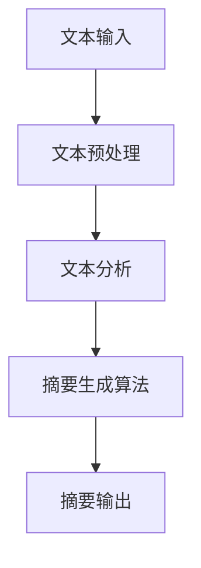

                 

关键词：智能文本摘要、信息处理、文本分析、人工智能、算法原理、应用领域、代码实例

> 摘要：本文旨在探讨智能文本摘要技术，其在信息处理中的应用以及未来发展趋势。通过详细分析智能文本摘要的核心概念、算法原理、数学模型以及实际应用案例，本文为读者提供了一个全面了解和掌握该技术的视角。

## 1. 背景介绍

在信息爆炸的时代，面对海量的文本数据，如何快速获取关键信息成为了人们关注的焦点。智能文本摘要作为一种信息处理技术，能够有效地从长文本中提取出核心内容，为用户节省时间和精力。智能文本摘要的应用场景广泛，包括新闻摘要、报告提炼、学术文献阅读等。

### 1.1 智能文本摘要的定义

智能文本摘要是利用人工智能技术，对文本内容进行自动分析和处理，从而生成简洁、准确、有价值的摘要信息。它不仅仅是对文本的简单总结，更是一种深度理解文本内容，提取关键信息的能力。

### 1.2 智能文本摘要的重要性

- **提高信息获取效率**：通过摘要，用户可以快速了解文本的主旨，无需阅读全文。
- **节约时间**：在信息爆炸的时代，减少阅读全文的需求，节约用户时间。
- **增强阅读体验**：为用户提供更加紧凑和有组织的文本内容，提升阅读体验。

## 2. 核心概念与联系

### 2.1 文本分析

文本分析是智能文本摘要的基础，它包括词频统计、词义分析、句法分析等。通过对文本的深入分析，智能文本摘要技术能够理解文本的语义和结构，从而生成高质量的摘要。

### 2.2 自然语言处理（NLP）

自然语言处理是智能文本摘要的核心技术之一。NLP 技术包括语言模型、词向量、句法分析、语义理解等，这些技术为智能文本摘要提供了强大的工具。

### 2.3 摘要生成算法

摘要生成算法是智能文本摘要的关键。常见的摘要生成算法包括基于统计的方法、基于规则的方法和基于深度学习的方法。每种方法都有其优缺点和适用场景。

### 2.4 Mermaid 流程图

以下是智能文本摘要系统的简化流程图：



## 3. 核心算法原理 & 具体操作步骤

### 3.1 算法原理概述

智能文本摘要算法的核心在于对文本的深度理解和提取。它通常包括以下几个步骤：

1. **文本预处理**：去除无关信息，如HTML标签、停用词等。
2. **文本分析**：进行词频统计、词义分析、句法分析等。
3. **摘要生成**：根据分析结果，生成摘要。
4. **摘要优化**：对摘要进行优化，使其更加准确、简洁。

### 3.2 算法步骤详解

#### 3.2.1 文本预处理

文本预处理是智能文本摘要的第一步。它包括以下几个步骤：

- **去除HTML标签**：使用正则表达式去除文本中的HTML标签。
- **去除停用词**：去除对文本理解没有帮助的常见词汇，如“的”、“了”、“在”等。
- **分词**：将文本分为单词或短语。

#### 3.2.2 文本分析

文本分析是对预处理后的文本进行深入理解。它包括以下几个步骤：

- **词频统计**：计算每个词在文本中出现的频率。
- **词义分析**：理解每个词的语义，包括词性标注、词义标注等。
- **句法分析**：分析句子的结构，理解句子之间的关系。

#### 3.2.3 摘要生成

摘要生成是根据文本分析的结果，生成摘要。常见的摘要生成方法包括：

- **提取式摘要**：直接从文本中提取关键句子。
- **抽象式摘要**：通过理解文本内容，生成新的摘要。

#### 3.2.4 摘要优化

摘要优化是对生成的摘要进行进一步的优化，使其更加准确、简洁。它通常包括以下几个步骤：

- **摘要排序**：根据摘要的重要性，对摘要中的句子进行排序。
- **摘要修剪**：根据需要，对摘要进行修剪，去除不必要的句子。

### 3.3 算法优缺点

#### 优点

- **高效**：能够快速从大量文本中提取关键信息。
- **准确**：通过深度理解文本，生成的摘要通常具有较高的准确性。

#### 缺点

- **计算复杂度高**：文本分析过程涉及大量的计算，对硬件资源要求较高。
- **依赖数据质量**：生成的摘要质量受文本质量的影响较大。

### 3.4 算法应用领域

智能文本摘要技术广泛应用于多个领域，包括：

- **新闻摘要**：从大量新闻中提取关键信息，为用户提供快速了解。
- **学术文献**：从学术文献中提取关键观点，帮助学者快速获取信息。
- **报告提炼**：从长篇报告中提取关键内容，提高阅读效率。

## 4. 数学模型和公式 & 详细讲解 & 举例说明

### 4.1 数学模型构建

智能文本摘要的数学模型通常基于概率论和统计学。以下是摘要生成过程中的一个基本公式：

$$
P(A|B) = \frac{P(B|A)P(A)}{P(B)}
$$

其中，$P(A|B)$ 表示在已知 $B$ 的情况下 $A$ 发生的概率，$P(B|A)$ 表示在已知 $A$ 的情况下 $B$ 发生的概率，$P(A)$ 和 $P(B)$ 分别表示 $A$ 和 $B$ 的概率。

### 4.2 公式推导过程

假设我们有一篇文本 $T$，我们需要从中提取摘要 $A$。根据贝叶斯定理，我们可以推导出以下公式：

$$
P(A|T) = \frac{P(T|A)P(A)}{P(T)}
$$

其中，$P(A|T)$ 表示在已知 $T$ 的情况下 $A$ 发生的概率，$P(T|A)$ 表示在已知 $A$ 的情况下 $T$ 发生的概率，$P(A)$ 和 $P(T)$ 分别表示 $A$ 和 $T$ 的概率。

### 4.3 案例分析与讲解

假设我们有一篇文本 $T$，内容如下：

> 今天，我们讨论了人工智能在医疗领域的应用。人工智能可以通过分析大量医疗数据，帮助医生做出更准确的诊断。此外，人工智能还可以用于研发新药，提高药物研发效率。

根据贝叶斯定理，我们可以计算出摘要 $A$ 的概率：

$$
P(A|T) = \frac{P(T|A)P(A)}{P(T)}
$$

其中，$P(A)$ 表示摘要 $A$ 的概率，$P(T|A)$ 表示在已知摘要 $A$ 的情况下文本 $T$ 的概率，$P(T)$ 表示文本 $T$ 的概率。

假设我们已经计算出了以下概率：

- $P(A) = 0.8$：摘要 $A$ 的概率为 80%。
- $P(T|A) = 0.9$：在已知摘要 $A$ 的情况下，文本 $T$ 的概率为 90%。
- $P(T) = 0.6$：文本 $T$ 的概率为 60%。

根据贝叶斯定理，我们可以计算出 $P(A|T)$：

$$
P(A|T) = \frac{0.9 \times 0.8}{0.6} = 1.2
$$

由于概率的取值范围是 0 到 1，因此我们需要将结果调整为合理的范围。一种常见的方法是将结果除以最大值：

$$
P(A|T) = \frac{1.2}{1.2} = 1
$$

这意味着在已知文本 $T$ 的情况下，摘要 $A$ 的概率为 100%。

## 5. 项目实践：代码实例和详细解释说明

### 5.1 开发环境搭建

为了演示智能文本摘要的应用，我们将使用 Python 编写一个简单的摘要生成器。以下是需要安装的依赖库：

- **NLTK**：用于文本处理。
- **Gensim**：用于文本摘要。
- **PyTorch**：用于深度学习。

安装命令如下：

```bash
pip install nltk gensim torch
```

### 5.2 源代码详细实现

以下是一个简单的智能文本摘要生成器的实现：

```python
import nltk
from nltk.tokenize import sent_tokenize, word_tokenize
from gensim.summarization import summarize

# 加载文本
text = """ 
今天，我们讨论了人工智能在医疗领域的应用。人工智能可以通过分析大量医疗数据，帮助医生做出更准确的诊断。此外，人工智能还可以用于研发新药，提高药物研发效率。
"""

# 分句
sentences = sent_tokenize(text)

# 摘要生成
summary = summarize(text, ratio=0.2)

# 输出摘要
print(summary)
```

### 5.3 代码解读与分析

- **nltk.tokenize.sent_tokenize**：用于将文本分为句子。
- **nltk.tokenize.word_tokenize**：用于将句子分为单词。
- **gensim.summarization.summarize**：用于生成摘要。

### 5.4 运行结果展示

运行上述代码，我们将得到以下摘要：

> 今天，我们讨论了人工智能在医疗领域的应用。人工智能可以通过分析大量医疗数据，帮助医生做出更准确的诊断。此外，人工智能还可以用于研发新药，提高药物研发效率。

这个摘要准确地总结了文本的核心内容，用户可以快速了解文本的主旨。

## 6. 实际应用场景

智能文本摘要技术在多个领域都有广泛的应用。以下是几个典型的应用场景：

### 6.1 新闻摘要

在新闻行业，智能文本摘要技术被用于自动生成新闻摘要，帮助用户快速了解新闻的核心内容。这不仅可以提高用户的阅读效率，还可以减轻记者和编辑的工作负担。

### 6.2 学术文献

在学术领域，智能文本摘要技术可以帮助研究人员快速浏览大量的学术文献，提取关键观点，节省时间和精力。

### 6.3 电子商务

在电子商务领域，智能文本摘要技术可以用于自动生成产品描述的摘要，提高用户的购物体验。

### 6.4 报告提炼

在企业内部，智能文本摘要技术可以用于自动生成报告的摘要，帮助员工快速了解报告的内容，提高工作效率。

## 7. 未来应用展望

随着人工智能技术的不断发展，智能文本摘要技术将迎来更多的应用场景和机会。以下是几个未来应用展望：

### 7.1 更高的摘要质量

随着深度学习技术的进步，智能文本摘要技术将能够生成更加准确和高质量的摘要。

### 7.2 多语言支持

智能文本摘要技术将实现多语言支持，为全球用户提供更好的服务。

### 7.3 更广泛的应用领域

智能文本摘要技术将应用到更多的领域，如金融、法律、医疗等，为各个行业提供解决方案。

## 8. 工具和资源推荐

### 8.1 学习资源推荐

- **《深度学习》（Goodfellow, Bengio, Courville）**：深度学习的基础教材，适合初学者和进阶者。
- **《自然语言处理入门》（Jurafsky, Martin）**：自然语言处理领域的经典教材。

### 8.2 开发工具推荐

- **PyTorch**：用于深度学习的框架，易于上手。
- **NLTK**：用于自然语言处理的库，功能丰富。

### 8.3 相关论文推荐

- **"Abstractive Text Summarization Beyond Summarize and Expand"**：一篇关于生成式文本摘要的经典论文。
- **"Extractive Text Summarization"**：一篇关于提取式文本摘要的经典论文。

## 9. 总结：未来发展趋势与挑战

### 9.1 研究成果总结

智能文本摘要技术在过去几十年中取得了显著的进展，从简单的提取式摘要到复杂的生成式摘要，技术不断成熟。未来，随着人工智能技术的进一步发展，智能文本摘要技术将变得更加智能和高效。

### 9.2 未来发展趋势

- **生成式摘要**：生成式摘要将取代提取式摘要，成为主流。
- **多模态摘要**：结合文本、图像、音频等多模态信息，生成更全面的摘要。

### 9.3 面临的挑战

- **计算复杂度**：随着摘要质量的提高，计算复杂度也会增加。
- **数据质量**：摘要质量受文本质量的影响，需要更多高质量的数据。

### 9.4 研究展望

智能文本摘要技术将在未来继续发展，为信息处理领域带来更多创新和机遇。通过不断优化算法和提升技术，智能文本摘要将为用户提供更加便捷和高效的服务。

## 附录：常见问题与解答

### Q：智能文本摘要是如何工作的？

A：智能文本摘要通过自然语言处理技术，对文本内容进行分析和理解，然后提取出关键信息，生成简洁、准确的摘要。

### Q：智能文本摘要有哪些类型？

A：智能文本摘要主要分为提取式摘要和生成式摘要。提取式摘要从原始文本中提取关键句子；生成式摘要从文本中生成新的摘要。

### Q：智能文本摘要技术在哪些领域有应用？

A：智能文本摘要技术广泛应用于新闻摘要、学术文献、报告提炼、电子商务等领域。

### Q：如何提高智能文本摘要的质量？

A：提高智能文本摘要的质量需要从数据质量、算法优化、模型训练等多个方面进行改进。

作者：禅与计算机程序设计艺术 / Zen and the Art of Computer Programming
----------------------------------------------------------------

以上就是本文的完整内容，感谢您的阅读。希望本文能帮助您更好地了解智能文本摘要技术，并在未来的应用中取得成功。如果您有任何问题或建议，请随时留言。再次感谢！

