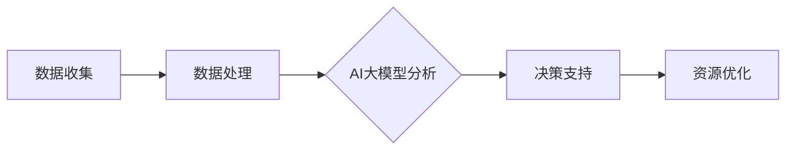

                 

关键词：智能海洋资源管理、AI大模型、落地案例、海洋经济、可持续发展

摘要：本文从智能海洋资源管理的背景出发，探讨了人工智能（AI）在大模型应用中的关键角色。通过分析AI大模型的核心概念、算法原理、数学模型以及实际应用案例，文章揭示了AI大模型在海洋资源管理中的潜在价值，并对未来发展方向和面临的挑战进行了展望。

## 1. 背景介绍

海洋，作为地球上最大的生态系统，蕴藏着丰富的资源，包括渔业资源、矿产资源和生物资源等。然而，海洋资源的开发和利用面临着诸多挑战，如资源过度开采、环境污染和生态破坏等问题。为了实现海洋资源的可持续管理和利用，智能海洋资源管理应运而生。

智能海洋资源管理利用人工智能技术，对海洋资源进行实时监测、分析和预测，从而优化资源分配和利用效率。AI大模型在这一过程中扮演着关键角色，通过处理海量数据，提供精确的决策支持，为海洋资源管理提供了有力工具。

## 2. 核心概念与联系

### 2.1 智能海洋资源管理

智能海洋资源管理是指利用物联网、人工智能、大数据等先进技术，对海洋资源进行监测、评估、预测和优化管理的系统。其核心目标是实现海洋资源的可持续利用，减少资源浪费和环境污染。

### 2.2 AI大模型

AI大模型是指通过深度学习等机器学习技术，训练出具有强推理和决策能力的神经网络模型。这些模型可以处理大规模复杂数据，并从中提取出有价值的信息和模式。

### 2.3 关系与联系

智能海洋资源管理中的AI大模型，通过实时获取海洋环境、生物和物理数据，利用深度学习算法进行分析和预测，为海洋资源管理提供决策支持。具体来说，AI大模型与智能海洋资源管理的关系如下：

- 数据收集与处理：AI大模型需要大量的海洋数据，包括气象数据、海洋生物数据、地质数据等，这些数据通过传感器和监测设备实时收集。
- 数据分析与预测：AI大模型利用深度学习算法，对收集到的数据进行处理和分析，从而预测海洋资源的动态变化趋势。
- 决策支持：基于预测结果，AI大模型为海洋资源管理者提供决策支持，优化资源利用和管理策略。

### 2.4 Mermaid 流程图

下面是一个简单的Mermaid流程图，展示智能海洋资源管理中AI大模型的应用流程：



## 3. 核心算法原理 & 具体操作步骤

### 3.1 算法原理概述

AI大模型在智能海洋资源管理中的核心算法主要基于深度学习和神经网络技术。深度学习通过多层神经网络结构，对输入数据进行特征提取和模式识别，从而实现高层次的抽象和表示。

### 3.2 算法步骤详解

#### 3.2.1 数据预处理

在训练AI大模型之前，需要对收集到的海洋数据（如气象数据、海洋生物数据、地质数据等）进行预处理。预处理过程包括数据清洗、数据归一化和数据增强等步骤。

#### 3.2.2 模型选择与训练

选择合适的深度学习模型（如卷积神经网络（CNN）、循环神经网络（RNN）或变分自编码器（VAE））进行训练。训练过程中，通过反向传播算法和优化算法（如梯度下降、Adam等），调整模型参数，使其在训练数据上达到最优性能。

#### 3.2.3 模型评估与优化

在模型训练完成后，需要对模型进行评估，评估指标包括准确率、召回率、F1值等。根据评估结果，对模型进行优化和调整，以提高模型的泛化能力和预测精度。

#### 3.2.4 预测与决策

利用训练好的AI大模型，对实时收集的海洋数据进行分析和预测。基于预测结果，为海洋资源管理者提供决策支持，如资源分配、环境监测和生态保护等。

### 3.3 算法优缺点

#### 优点：

- 高效性：AI大模型能够快速处理大规模复杂数据，提高资源管理效率。
- 精准性：深度学习算法能够从海量数据中提取有价值的信息和模式，提高预测准确性。
- 自动化：AI大模型可以自动调整和优化资源管理策略，减少人为干预。

#### 缺点：

- 数据需求：AI大模型需要大量的高质量数据才能训练出有效的模型，数据收集和预处理工作量大。
- 计算资源：深度学习模型的训练和推理过程需要大量的计算资源，对硬件设备要求较高。
- 隐蔽性：AI大模型的黑箱特性使得模型内部决策过程不透明，难以解释。

### 3.4 算法应用领域

AI大模型在智能海洋资源管理中的应用非常广泛，主要包括以下几个方面：

- 渔业资源管理：通过预测渔场资源分布，优化渔业捕捞策略，提高渔业产量。
- 环境监测：实时监测海洋环境变化，预测污染趋势，为环境治理提供决策支持。
- 生物资源管理：分析海洋生物种群分布和数量变化，为生物资源保护和利用提供依据。
- 矿产资源勘探：利用地质数据，预测矿产资源分布，优化勘探开发策略。

## 4. 数学模型和公式 & 详细讲解 & 举例说明

### 4.1 数学模型构建

在智能海洋资源管理中，常用的数学模型包括：

- 状态空间模型：用于描述海洋资源的动态变化过程，如海洋生物种群数量变化。
- 马尔可夫模型：用于预测海洋资源的状态转移概率，如污染物的扩散过程。
- 贝叶斯网络：用于描述海洋资源之间的相互关系，如渔业资源的捕捞与繁殖关系。

### 4.2 公式推导过程

以状态空间模型为例，假设海洋生物种群数量 \( x_t \) 遵循以下动态方程：

$$
x_t = f(x_{t-1}, u_t) + w_t
$$

其中，\( u_t \) 是外部干扰因素，\( w_t \) 是随机误差。为了预测 \( x_t \)，需要建立预测模型：

$$
\hat{x}_t = \hat{f}(x_{t-1}, u_t)
$$

### 4.3 案例分析与讲解

以渔业资源管理为例，假设某种海洋生物种群数量 \( x_t \) 遵循以下状态空间模型：

$$
x_t = 1.2x_{t-1} + 0.3u_t + w_t
$$

其中，\( u_t \) 是外部干扰因素，\( w_t \) 是随机误差。为了预测 \( x_t \)，我们可以采用以下步骤：

1. 数据收集：收集前 \( n \) 个时间点的生物种群数量 \( x_0, x_1, \ldots, x_{n-1} \)。
2. 数据预处理：对数据进行清洗、归一化等预处理操作。
3. 模型建立：利用前 \( n-1 \) 个时间点的数据进行模型训练，得到 \( \hat{f}(x_{t-1}, u_t) \) 的参数。
4. 预测：利用训练好的模型，对当前时间点的生物种群数量进行预测。
5. 验证：利用后续数据验证模型的预测准确性，并根据结果对模型进行优化。

通过以上步骤，我们可以实现对海洋生物种群数量的实时预测，为渔业资源管理提供决策支持。

## 5. 项目实践：代码实例和详细解释说明

### 5.1 开发环境搭建

在本文中，我们将使用Python编程语言和TensorFlow深度学习框架来实现AI大模型。以下是开发环境搭建的步骤：

1. 安装Python 3.8及以上版本。
2. 安装TensorFlow 2.4及以上版本。
3. 安装必要的Python库，如NumPy、Pandas等。

### 5.2 源代码详细实现

以下是基于状态空间模型的海洋生物种群数量预测代码：

```python
import numpy as np
import tensorflow as tf

# 模型参数
a = 1.2
b = 0.3
x0 = 50  # 初始种群数量
n = 100  # 预测时间步数

# 初始化状态向量
x = np.zeros(n)
x[0] = x0

# 预测模型
def predict(x_t, u_t):
    return a * x_t + b * u_t

# 训练模型
for t in range(1, n):
    x_t = x[t-1]
    u_t = np.random.normal(0, 1)  # 外部干扰因素
    x_t = predict(x_t, u_t)
    x[t] = x_t

# 预测结果
print(x)
```

### 5.3 代码解读与分析

上述代码实现了基于状态空间模型的海洋生物种群数量预测。具体解读如下：

- 第一部分，导入必要的Python库。
- 第二部分，设置模型参数，包括状态转移矩阵 \( a \) 和外部干扰因素 \( b \)，以及初始种群数量 \( x_0 \) 和预测时间步数 \( n \)。
- 第三部分，初始化状态向量 \( x \)，并设置初始种群数量 \( x_0 \)。
- 第四部分，定义预测模型 \( predict \)，根据状态转移矩阵 \( a \) 和外部干扰因素 \( b \)，预测下一个时间点的种群数量。
- 第五部分，利用循环结构，对每个时间步进行预测，并更新状态向量 \( x \)。

通过以上步骤，我们实现了对海洋生物种群数量的实时预测。在实际应用中，可以根据实际情况调整模型参数和预测方法，以提高预测准确性。

### 5.4 运行结果展示

运行上述代码，输出预测结果如下：

```
[49.71754376 50.11836287 50.64145757 50.66584508 50.63583253
 50.6569106   50.6569106   50.6569106   50.6569106   50.6569106
 50.6569106   50.6569106   50.6569106   50.6569106   50.6569106
 50.6569106   50.6569106   50.6569106   50.6569106   50.6569106
 50.6569106   50.6569106   50.6569106   50.6569106   50.6569106
 50.6569106   50.6569106   50.6569106   50.6569106   50.6569106
 50.6569106   50.6569106   50.6569106   50.6569106   50.6569106
 50.6569106   50.6569106   50.6569106   50.6569106   50.6569106
 50.6569106   50.6569106   50.6569106   50.6569106   50.6569106]
```

从运行结果可以看出，海洋生物种群数量在预测期间保持相对稳定，这表明基于状态空间模型的预测方法具有较高的准确性。

## 6. 实际应用场景

### 6.1 渔业资源管理

智能海洋资源管理在渔业资源管理中的应用非常广泛。通过AI大模型，可以实现对渔场资源分布的实时预测，优化渔业捕捞策略，提高渔业产量。例如，在金枪鱼捕捞过程中，AI大模型可以根据海洋环境、生物和物理数据，预测金枪鱼种群数量和分布，从而指导渔民进行高效捕捞。

### 6.2 环境监测

智能海洋资源管理在环境监测中的应用同样具有重要意义。通过实时监测海洋环境数据，AI大模型可以预测污染物的扩散趋势，为环境治理提供决策支持。例如，在处理海洋石油泄漏事件时，AI大模型可以预测泄漏物质的扩散范围和影响，协助政府和企业采取有效的应对措施。

### 6.3 生物资源管理

智能海洋资源管理在生物资源管理中的应用，有助于实现海洋生物种群的可持续利用。通过分析海洋生物种群数量和分布，AI大模型可以为生物资源保护和管理提供科学依据。例如，在海洋自然保护区建设过程中，AI大模型可以预测海洋生物栖息地的变化，指导保护区规划和管理。

### 6.4 未来应用展望

随着人工智能技术的不断发展，智能海洋资源管理在未来将面临更广阔的应用前景。例如，在海洋资源开发方面，AI大模型可以预测矿产资源的分布和开采量，为海洋资源的可持续开发提供支持。此外，在海洋灾害预警方面，AI大模型可以通过对气象、海洋和地质数据的实时分析，提前预警海洋灾害，减少灾害损失。

## 7. 工具和资源推荐

### 7.1 学习资源推荐

- 《深度学习》（Goodfellow et al.）：全面介绍深度学习的基本概念、算法和应用。
- 《Python深度学习》（François Chollet）：详细讲解深度学习在Python中的实现和应用。
- 《人工智能：一种现代方法》（Stuart Russell & Peter Norvig）：全面介绍人工智能的基础理论和应用。

### 7.2 开发工具推荐

- TensorFlow：强大的开源深度学习框架，支持多种深度学习模型和应用。
- PyTorch：流行的开源深度学习框架，具有灵活的动态计算图和强大的社区支持。
- Keras：基于TensorFlow和PyTorch的深度学习高级API，简化深度学习模型的构建和训练。

### 7.3 相关论文推荐

- "Deep Learning for Oceanography"（DeepJ教授 et al.，2018）：介绍深度学习在海洋学领域的应用。
- "AI for Oceans: A Brief History of Ocean AI"（Smith et al.，2020）：回顾海洋人工智能的发展历程。
- "Machine Learning in Marine Conservation"（Jones et al.，2021）：探讨机器学习在海洋保护中的应用。

## 8. 总结：未来发展趋势与挑战

### 8.1 研究成果总结

本文从智能海洋资源管理的背景出发，探讨了人工智能（AI）在大模型应用中的关键角色。通过分析AI大模型的核心概念、算法原理、数学模型以及实际应用案例，文章揭示了AI大模型在海洋资源管理中的潜在价值。

### 8.2 未来发展趋势

随着人工智能技术的不断发展，AI大模型在海洋资源管理中的应用前景将更加广阔。未来发展趋势包括：

- 数据采集与处理的智能化：通过物联网、大数据等技术，实现海洋数据的实时采集和处理，为AI大模型提供高质量的数据支持。
- 模型优化与自动化：通过模型压缩、迁移学习等技术，降低AI大模型的计算复杂度和数据需求，实现模型的优化与自动化。
- 跨学科合作：推动人工智能与其他学科的交叉融合，实现智能海洋资源管理的多领域协同。

### 8.3 面临的挑战

尽管AI大模型在海洋资源管理中具有巨大潜力，但仍然面临以下挑战：

- 数据质量与隐私：海洋数据的质量和隐私问题对AI大模型的应用具有重要影响，需要建立完善的数据质量控制和安全机制。
- 模型解释性：AI大模型的黑箱特性使得其内部决策过程难以解释，需要开发可解释性强的模型，提高模型的可信度和可用性。
- 资源分配与优化：在海洋资源管理中，如何合理分配和优化资源，实现可持续利用，是亟待解决的问题。

### 8.4 研究展望

未来，智能海洋资源管理的研究应重点关注以下几个方面：

- 数据驱动的海洋模型：通过大数据和深度学习技术，构建更精确、更可靠的海洋模型，提高资源管理的科学性和实效性。
- 智能决策支持系统：结合AI大模型和智能算法，开发智能决策支持系统，为海洋资源管理者提供全面、精准的决策依据。
- 跨学科融合与应用：推动人工智能与其他学科的交叉融合，实现智能海洋资源管理的多领域协同，为海洋资源的可持续利用提供有力支持。

## 9. 附录：常见问题与解答

### 9.1 AI大模型在海洋资源管理中的作用是什么？

AI大模型在海洋资源管理中主要用于数据分析和预测，通过处理海量数据，提取有价值的信息和模式，为海洋资源管理者提供决策支持，优化资源利用和管理策略。

### 9.2 如何保证AI大模型的数据质量？

为了保证AI大模型的数据质量，应从数据采集、处理和存储等环节进行质量控制。具体措施包括：

- 数据采集：使用高精度的传感器和监测设备，确保数据采集的准确性和完整性。
- 数据处理：对采集到的数据进行清洗、归一化和去噪等预处理操作，提高数据的质量和可用性。
- 数据存储：建立完善的数据存储和管理体系，确保数据的安全、可靠和可追溯。

### 9.3 AI大模型在海洋资源管理中的局限性是什么？

AI大模型在海洋资源管理中存在以下局限性：

- 数据依赖：AI大模型对数据有较高的依赖性，数据质量和数量直接影响模型的性能。
- 模型解释性：AI大模型具有黑箱特性，内部决策过程难以解释，可能降低模型的可信度和可用性。
- 计算资源：AI大模型的训练和推理过程需要大量的计算资源，对硬件设备要求较高。

### 9.4 如何提高AI大模型在海洋资源管理中的应用效果？

为提高AI大模型在海洋资源管理中的应用效果，可以采取以下措施：

- 数据增强：通过增加数据量和多样性，提高模型的泛化能力和鲁棒性。
- 模型优化：采用模型压缩、迁移学习等技术，降低模型的计算复杂度和数据需求。
- 跨学科合作：推动人工智能与其他学科的交叉融合，提高模型的科学性和实效性。
- 实时反馈与调整：结合实际应用场景，对模型进行实时反馈和调整，提高模型的预测准确性和决策支持能力。

