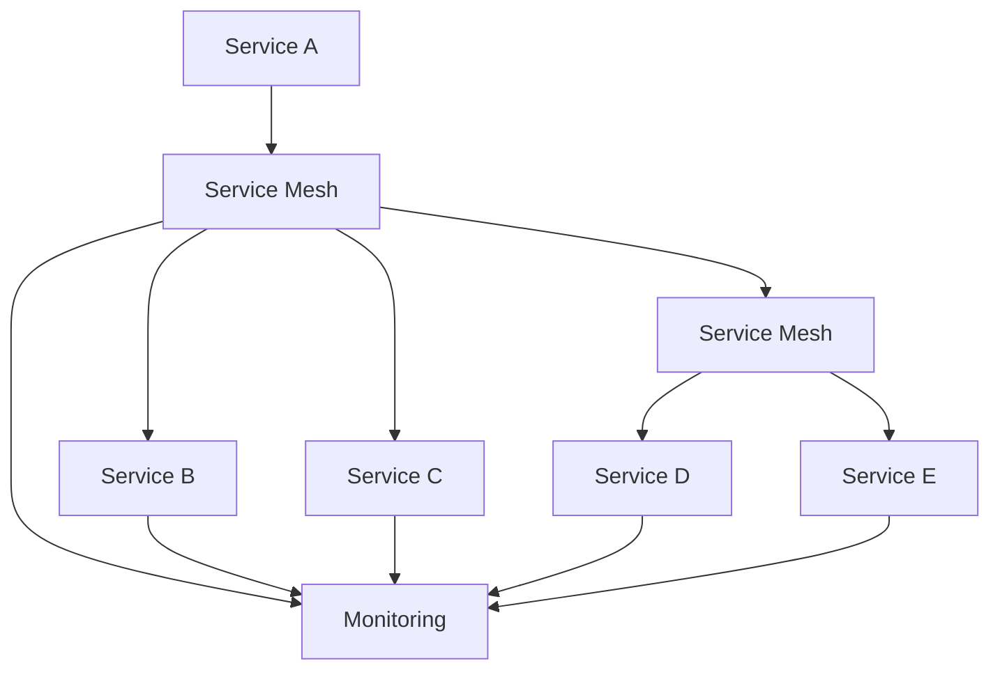

                 

### 关键词 Keywords

- 服务网格
- Istio
- 微服务
- 微服务通信
- 虚拟化
- 负载均衡
- 安全性

<|assistant|>### 摘要 Abstract

随着云计算和微服务架构的普及，微服务之间的通信和整合变得越来越复杂。服务网格作为一种基础设施层，旨在简化微服务之间的通信，提供高可靠性、安全性和可观测性。本文将详细介绍服务网格Istio，探讨其核心概念、架构设计、算法原理及其在微服务通信中的重要性。我们将通过具体的实例和代码解释，展示Istio的实际应用场景，并展望其未来的发展趋势和面临的挑战。

## 1. 背景介绍

在传统的单体应用架构中，应用程序通常是一个单一的实体，所有的功能和服务都紧密耦合在一起。这种架构模式虽然易于开发和维护，但随着业务需求的增长和复杂性的增加，其扩展性和维护成本也逐渐上升。为了解决这一问题，开发者开始将应用程序拆分成多个独立的、可复用的服务，即所谓的微服务架构。

微服务架构将应用程序分解为一组小而独立的服务，每个服务负责特定的业务功能。这种架构模式具有许多优点，如高可伸缩性、灵活部署和易于维护。然而，随之而来的挑战是如何有效地管理和协调这些服务的通信。传统的服务发现、负载均衡和安全控制方法不再适用，因为它们需要考虑到分布式环境中服务实例的动态变化和网络的复杂性。

为了解决这些问题，服务网格作为一种新兴的基础设施层被提了出来。服务网格负责处理微服务之间的通信，提供一系列常见的网络功能，如服务发现、负载均衡、熔断和安全性。Istio是当前最受欢迎的服务网格解决方案之一，它提供了一个开源的服务网格平台，能够与各种微服务架构无缝集成。

## 2. 核心概念与联系

### 2.1 服务网格（Service Mesh）

服务网格是一种基础设施层，它将服务的通信抽象出来，使其独立于应用逻辑。在服务网格中，服务之间的通信通过一组网络代理（通常称为sidecar代理）进行管理。这些代理负责处理服务间的流量，并提供一系列网络功能。

服务网格的主要优势在于，它将服务通信的复杂性从应用代码中分离出来，使得开发者可以专注于业务逻辑的实现。此外，服务网格还提供了更高的灵活性和可扩展性，因为它可以在不修改应用程序代码的情况下动态调整网络行为。

### 2.2 服务发现（Service Discovery）

服务发现是服务网格中的一个核心功能，它负责定位和连接分布式环境中的服务实例。服务网格通常使用服务注册表来存储和更新服务实例的信息。当服务启动时，它会向服务注册表注册自己的地址和端口，从而让其他服务能够找到它。

服务发现机制可以是基于配置的，也可以是动态的。动态服务发现依赖于服务实例的实时状态，能够更好地适应服务实例的动态变化。而基于配置的服务发现通常依赖于静态配置文件，适用于服务实例相对稳定的环境。

### 2.3 负载均衡（Load Balancing）

负载均衡是服务网格中另一个关键功能，它负责将客户端请求分配到多个服务实例上，以实现流量的合理分配和系统资源的最大化利用。服务网格中的负载均衡策略可以是轮询、最少连接、源IP哈希等，这些策略可以根据具体的业务需求进行配置。

负载均衡不仅提高了系统的性能和可靠性，还能够提供故障转移和弹性扩展的能力。当某个服务实例发生故障时，负载均衡器可以自动将其从负载中排除，并将流量重新分配到健康的服务实例上。

### 2.4 安全性（Security）

安全性是服务网格中不可或缺的一部分，它负责保护服务之间的通信免受恶意攻击和未授权访问。服务网格通常提供一系列安全功能，如服务认证、服务授权、流量加密等。

服务认证确保只有经过验证的服务实例才能进行通信。服务授权则基于服务的角色和权限来控制访问。流量加密则通过TLS协议对服务间的数据传输进行加密，确保数据的安全性和完整性。

### 2.5 可观测性（Observability）

可观测性是服务网格中的另一个重要功能，它帮助开发者和服务管理员监控和管理分布式系统。服务网格提供了丰富的监控指标和日志收集功能，使得开发者可以实时了解系统的运行状态和性能。

通过可观测性，开发者可以快速定位和解决问题，提高系统的可靠性和可维护性。

## 2.6 Mermaid 流程图

下面是一个简化的服务网格Istio的流程图，展示了其核心组件和服务之间的交互。



## 3. 核心算法原理 & 具体操作步骤

### 3.1 算法原理概述

服务网格Istio的核心算法原理主要包括以下几个方面：

1. **服务发现**：基于服务注册表和动态更新机制，服务实例启动时自动注册，其他服务通过服务注册表进行发现和连接。
2. **负载均衡**：采用轮询算法，根据服务实例的健康状态和负载情况，将客户端请求分配到不同的服务实例上。
3. **流量管理**：通过Istio的虚拟服务规则，可以自定义路由策略、熔断策略和超时策略，实现对服务流量的精细控制。
4. **安全性**：采用TLS协议对服务间的数据传输进行加密，结合访问控制策略，确保服务间的通信安全。
5. **可观测性**：通过Prometheus和Grafana等监控工具，收集服务网格的监控数据，实现对服务运行状态的实时监控和可视化。

### 3.2 算法步骤详解

1. **服务注册**：服务实例启动后，向服务注册表注册自身信息，包括服务名、地址和端口。
2. **服务发现**：其他服务通过查询服务注册表，获取目标服务的地址和端口信息。
3. **负载均衡**：服务网格采用轮询算法，根据服务实例的健康状态和负载情况，将客户端请求分配到不同的服务实例上。
4. **流量管理**：通过虚拟服务规则，可以自定义路由策略、熔断策略和超时策略，实现对服务流量的精细控制。
5. **安全性**：服务间通信采用TLS协议进行加密，同时结合访问控制策略，确保服务间的通信安全。
6. **监控与日志**：通过Prometheus和Grafana等监控工具，收集服务网格的监控数据，实现对服务运行状态的实时监控和可视化。

### 3.3 算法优缺点

**优点**：

- **简化服务通信**：将服务通信的复杂性从应用代码中分离出来，降低应用开发难度。
- **高可伸缩性**：支持动态扩展和故障转移，提高系统容错能力。
- **安全性**：采用TLS协议和访问控制策略，确保服务间通信安全。
- **可观测性**：提供丰富的监控和日志功能，方便运维和问题排查。

**缺点**：

- **引入额外的复杂性**：需要部署和管理服务网格基础设施，可能增加运维负担。
- **性能开销**：由于服务网格代理的存在，可能会引入一定的性能开销。

### 3.4 算法应用领域

服务网格Istio主要适用于以下场景：

- **分布式微服务架构**：在分布式微服务架构中，服务网格能够简化服务间的通信，提高系统的可靠性和可维护性。
- **云原生应用**：云原生应用通常需要高可伸缩性和高可用性，服务网格能够提供有效的支持。
- **容器编排**：服务网格与Kubernetes等容器编排系统无缝集成，为容器化应用提供高效的通信解决方案。

## 4. 数学模型和公式 & 详细讲解 & 举例说明

### 4.1 数学模型构建

在服务网格Istio中，我们可以使用以下数学模型来描述服务间通信的负载均衡策略：

1. **服务实例选择**：给定一组服务实例S={s1, s2, ..., sn}，根据负载情况和健康状态选择服务实例。
2. **请求分配**：根据服务实例的负载情况，将客户端请求R分配到服务实例上。

### 4.2 公式推导过程

1. **服务实例选择**：设服务实例的负载为L(s)，健康状态为H(s)，则选择服务实例的公式为：

   $$ s^* = \arg\min_{s \in S} L(s) + \alpha \cdot H(s) $$

   其中，α为健康状态的权重系数，可以根据实际需求进行调整。

2. **请求分配**：设客户端请求为R，服务实例的负载为L(s)，则请求分配的公式为：

   $$ R = \frac{L(s)}{\sum_{s' \in S} L(s')} $$

### 4.3 案例分析与讲解

假设有3个服务实例s1、s2和s3，它们的负载和健康状态如下表所示：

| 服务实例 | 负载 | 健康状态 |
| :----: | :----: | :----: |
| s1 | 10 | 0.8 |
| s2 | 20 | 0.9 |
| s3 | 30 | 0.7 |

根据上述数学模型，我们可以计算出最优的服务实例选择和请求分配：

1. **服务实例选择**：

   $$ s^* = \arg\min_{s \in \{s1, s2, s3\}} (10 + 0.8 \cdot 0.8) + (20 + 0.8 \cdot 0.9) + (30 + 0.8 \cdot 0.7) $$

   $$ s^* = s2 $$

   因此，最优的服务实例选择是s2。

2. **请求分配**：

   $$ R = \frac{10}{10 + 20 + 30} = 0.25 $$

   因此，请求R会被分配到s2上。

通过这个案例，我们可以看到如何使用数学模型来描述和计算服务网格Istio中的负载均衡策略。

## 5. 项目实践：代码实例和详细解释说明

### 5.1 开发环境搭建

在本节中，我们将介绍如何搭建一个基于Kubernetes和Istio的服务网格环境。以下是在一个标准Linux服务器上安装Kubernetes和Istio的步骤：

1. **安装Kubernetes**：

   首先，我们需要安装Kubernetes集群。您可以使用Minikube、Docker Machine或Kubeadm等工具来安装Kubernetes集群。这里我们以Minikube为例：

   ```bash
   minikube start --driver=kubeadm
   ```

2. **安装Istio**：

   安装Istio之前，我们需要安装Istio的依赖项，如Docker和Kubernetes命令行工具（kubectl）。

   ```bash
   curl -L https://istio.io/downloadIstio | sh -
   cd istio-1.11.0/
   export PATH=$PATH:./bin
   istioctl install --set profile=demo
   ```

   这将安装Istio的默认配置。您可以根据需要修改Istio的配置文件。

### 5.2 源代码详细实现

在本节中，我们将创建一个简单的微服务应用，并使用Istio对其进行配置。

1. **创建服务定义**：

   首先，我们需要创建服务定义文件（如`service.yaml`）：

   ```yaml
   apiVersion: v1
   kind: Service
   metadata:
     name: hello-world
   spec:
     selector:
       app: hello-world
     ports:
       - protocol: TCP
         port: 80
         targetPort: 8080
     type: ClusterIP
   ```

   这个服务定义创建了一个名为`hello-world`的服务，它映射到具有标签`app: hello-world`的Pod上的8080端口。

2. **创建部署定义**：

   接下来，我们需要创建部署定义文件（如`deployment.yaml`）：

   ```yaml
   apiVersion: apps/v1
   kind: Deployment
   metadata:
     name: hello-world
   spec:
     replicas: 3
     selector:
       matchLabels:
         app: hello-world
     template:
       metadata:
         labels:
           app: hello-world
       spec:
         containers:
         - name: hello-world
           image: hello-world:latest
           ports:
           - containerPort: 8080
   ```

   这个部署定义创建了一个具有3个副本的`hello-world`服务。

3. **应用Istio配置**：

   为了使服务通过Istio进行负载均衡，我们需要创建一个虚拟服务定义文件（如`virtual-service.yaml`）：

   ```yaml
   apiVersion: networking.istio.io/v1alpha3
   kind: VirtualService
   metadata:
     name: hello-world
   spec:
     hosts:
     - "*"
     http:
     - route:
       - destination:
           name: hello-world
           port: 80
   ```

   这个虚拟服务定义将所有进入服务的HTTP请求路由到名为`hello-world`的服务。

### 5.3 代码解读与分析

在上述步骤中，我们创建了一个简单的服务网格环境，并配置了一个简单的微服务应用。以下是每个组件的详细解读：

1. **服务定义（service.yaml）**：

   这个服务定义创建了一个名为`hello-world`的集群内部服务。它使用ClusterIP类型，这意味着它只能在集群内部访问。服务定义中的`selector`字段用于选择具有标签`app: hello-world`的Pod。

2. **部署定义（deployment.yaml）**：

   这个部署定义创建了一个具有3个副本的`hello-world`服务。`replicas`字段指定了Pod的副本数。`selector`字段与上面的服务定义中的`selector`字段相匹配，以确保Pod被正确选择。

3. **虚拟服务定义（virtual-service.yaml）**：

   这个虚拟服务定义将所有进入服务的HTTP请求路由到名为`hello-world`的服务。这意味着当客户端发送HTTP请求时，Istio会根据负载均衡策略将请求分配到不同的`hello-world`服务实例上。

### 5.4 运行结果展示

通过以下命令，我们可以将上述定义应用到Kubernetes集群中：

```bash
kubectl apply -f service.yaml
kubectl apply -f deployment.yaml
kubectl apply -f virtual-service.yaml
```

现在，我们可以使用以下命令测试服务：

```bash
kubectl exec -it <any-pod> -- curl -s http://hello-world:80
```

这个命令将在集群中的任意一个Pod上执行`curl`命令，向`hello-world`服务发送HTTP请求。由于我们使用了Istio的负载均衡功能，请求可能会被分配到不同的服务实例上。

## 6. 实际应用场景

服务网格Istio在实际应用中具有广泛的应用场景。以下是一些典型的应用案例：

1. **大型分布式系统**：

   在大型分布式系统中，服务网格可以帮助简化服务间的通信，提高系统的可靠性和可维护性。例如，在金融领域的分布式交易系统中，服务网格可以确保交易流程的高效、安全执行。

2. **云原生应用**：

   云原生应用通常需要高可伸缩性和高可用性。服务网格提供了有效的支持，如通过自动扩展和故障转移等功能，确保应用在云环境中正常运行。

3. **微服务架构**：

   微服务架构是一种流行的软件架构模式，服务网格在其中发挥着重要作用。它简化了服务间的通信，使得开发者可以专注于业务逻辑的实现。

4. **容器化应用**：

   服务网格与Kubernetes等容器编排系统无缝集成，为容器化应用提供高效的通信解决方案。例如，在容器化应用中，服务网格可以确保容器之间的通信安全、可靠。

### 6.4 未来应用展望

随着云计算和微服务架构的不断发展，服务网格技术将在未来扮演更加重要的角色。以下是一些未来应用展望：

1. **自动化与智能化**：

   服务网格的自动化和智能化水平将不断提高，通过机器学习和人工智能技术，实现更加智能的服务发现、负载均衡和安全性管理。

2. **多云与混合云**：

   随着企业应用逐渐向多云和混合云迁移，服务网格将在跨云环境中发挥重要作用，提供统一的服务通信和管理解决方案。

3. **物联网（IoT）**：

   物联网设备数量庞大，服务网格可以在物联网场景中提供高效、可靠的服务通信，支持大规模物联网应用。

4. **区块链**：

   服务网格与区块链技术的结合，可以为区块链应用提供高效、安全的服务通信，推动区块链技术的发展。

## 7. 工具和资源推荐

### 7.1 学习资源推荐

1. **Istio官方文档**：
   - 地址：https://istio.io/docs/
   - 简介：Istio官方文档提供了全面的教程、指南和参考文档，是学习Istio的最佳资源。

2. **服务网格技术书籍**：
   - 《服务网格：微服务通信基础设施》
   - 简介：这本书详细介绍了服务网格的基本概念、架构设计和实现原理，适合初学者和进阶者。

3. **Kubernetes官方文档**：
   - 地址：https://kubernetes.io/docs/
   - 简介：Kubernetes官方文档提供了丰富的教程、指南和参考文档，是学习Kubernetes的必备资源。

### 7.2 开发工具推荐

1. **Docker**：
   - 地址：https://www.docker.com/
   - 简介：Docker是一个流行的容器化平台，用于构建、运行和分发应用程序。

2. **Kubernetes命令行工具（kubectl）**：
   - 地址：https://kubernetes.io/docs/reference/kubectl/overview/
   - 简介：kubectl是Kubernetes的命令行工具，用于管理和操作Kubernetes集群。

3. **Istio命令行工具（istioctl）**：
   - 地址：https://istio.io/docs/reference/istioctl/
   - 简介：istioctl是Istio的命令行工具，用于配置、监控和操作Istio服务网格。

### 7.3 相关论文推荐

1. **《Service Mesh: A Language for Describing, Configuring, and Securing Microservices Networks》**：
   - 地址：https://arxiv.org/abs/1712.05999
   - 简介：这篇论文介绍了服务网格的基本概念和架构设计，是服务网格领域的经典文献。

2. **《A Survey on Service Mesh: Design, Architecture and Implementation》**：
   - 地址：https://arxiv.org/abs/2006.09120
   - 简介：这篇论文对服务网格进行了全面的综述，涵盖了设计、架构和实现等方面。

## 8. 总结：未来发展趋势与挑战

### 8.1 研究成果总结

服务网格技术自提出以来，已经取得了显著的研究成果。其主要成果包括：

- **核心概念与架构设计**：服务网格的基本概念和架构设计得到了广泛认可，成为微服务通信的基础设施。
- **开源生态建设**：多个开源服务网格项目如Istio、Linkerd等得到了快速发展，为开发者提供了丰富的选择。
- **应用场景拓展**：服务网格技术在金融、云计算、物联网等领域得到了广泛应用，展现出强大的应用潜力。

### 8.2 未来发展趋势

随着云计算和微服务架构的进一步发展，服务网格技术将在未来呈现以下发展趋势：

- **自动化与智能化**：通过引入人工智能和机器学习技术，实现服务网格的自动化和智能化管理。
- **多云与混合云**：支持跨云环境的服务网格解决方案，满足企业对多云和混合云的需求。
- **安全性提升**：加强服务网格的安全功能，确保服务间的通信安全。
- **与区块链结合**：探索服务网格与区块链技术的结合，为区块链应用提供高效、安全的服务通信。

### 8.3 面临的挑战

尽管服务网格技术取得了显著成果，但在未来发展过程中仍面临以下挑战：

- **性能优化**：如何降低服务网格的性能开销，提高系统的整体性能。
- **资源消耗**：如何优化服务网格的资源消耗，降低运维成本。
- **兼容性问题**：如何确保服务网格与现有系统的兼容性，避免引入额外的复杂性。
- **标准化**：推动服务网格技术的标准化进程，降低跨平台集成难度。

### 8.4 研究展望

为了应对未来挑战，服务网格领域的研究可以从以下方向展开：

- **性能优化**：通过算法优化、架构改进等方式，降低服务网格的性能开销。
- **资源消耗**：研究如何在服务网格中实现高效的资源管理和调度。
- **兼容性与标准化**：推动服务网格技术的标准化进程，提高跨平台兼容性。
- **安全性与隐私保护**：加强服务网格的安全功能，确保服务间的通信安全。

总之，服务网格技术在未来将继续发展，为云计算和微服务架构提供更加高效、安全和可管理的通信基础设施。

## 9. 附录：常见问题与解答

### 9.1 服务网格与API网关的区别是什么？

服务网格是一种基础设施层，负责处理微服务之间的通信，提供高可靠性、安全性和可观测性。而API网关则是应用层的一种服务，负责接收外部请求，将请求路由到内部微服务，并进行认证、授权和日志记录等功能。服务网格侧重于通信管理，而API网关侧重于请求处理和业务逻辑。

### 9.2 服务网格是否适用于单体应用？

服务网格主要用于微服务架构，但在一定程度上也可以应用于单体应用。通过在单体应用中引入服务网格，可以实现对服务通信的统一管理和控制，提高系统的可维护性和可扩展性。然而，由于服务网格引入了额外的复杂性，对于单体应用而言，其价值可能相对有限。

### 9.3 服务网格与容器编排系统的关系是什么？

服务网格与容器编排系统如Kubernetes等紧密相关。服务网格通常与容器编排系统无缝集成，通过容器编排系统实现服务实例的动态管理和负载均衡。容器编排系统负责部署和管理容器化应用，而服务网格负责管理容器间通信。两者相互配合，共同构建一个高效、可靠和可扩展的分布式系统。

### 9.4 服务网格对性能有哪些影响？

服务网格在提高服务通信可靠性和安全性的同时，可能会引入一定的性能开销。主要包括：

- **网络开销**：由于引入了服务网格代理，会增加一定的网络延迟。
- **计算开销**：服务网格代理需要进行负载均衡、流量管理和安全性验证等操作，可能会增加计算负载。
- **存储开销**：服务网格需要维护服务实例状态和路由信息，可能增加存储消耗。

然而，通过合理的配置和优化，服务网格的性能开销可以得到有效控制，确保系统整体性能。

### 作者署名

作者：禅与计算机程序设计艺术 / Zen and the Art of Computer Programming

