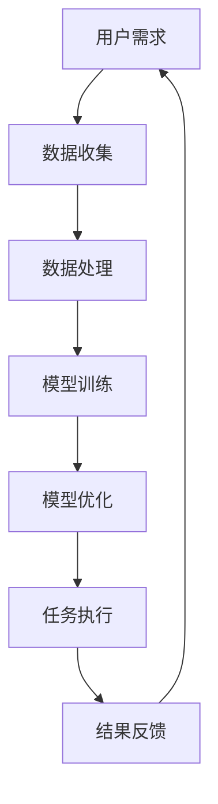

                 

关键词：人机协作，职业未来，人工智能，数字化转型，工作自动化

> 摘要：本文探讨了人工智能与人类工作者的协作关系，分析其在数字化转型浪潮中的角色和影响。文章旨在揭示人机协作的核心概念、技术原理、数学模型以及实际应用场景，并对未来发展趋势与挑战进行深入剖析，为读者提供一个全面、系统的视角。

## 1. 背景介绍

随着信息技术的飞速发展，人工智能（AI）技术已经成为推动社会进步的重要力量。AI在医疗、教育、金融、制造等多个领域的应用，极大地提升了工作效率，改变了传统的工作模式。然而，AI的迅猛发展也引发了关于职业未来的诸多讨论，特别是在自动化取代人类工作的担忧。未来工作将如何发展？人机协作将扮演怎样的角色？这些问题成为了我们探讨的主题。

本文将围绕以下几个核心问题展开：

1. 人机协作的定义及其重要性。
2. AI技术的核心原理及其应用。
3. 人机协作在实际项目中的实践案例。
4. 人机协作面临的挑战与未来展望。

## 2. 核心概念与联系

### 2.1 人机协作的定义

人机协作是指人类与人工智能系统在特定任务中相互配合，共同完成工作的一种模式。在这种模式中，人类发挥创造性和决策能力，AI则负责数据处理和执行重复性、计算密集型的任务。

### 2.2 核心概念原理

**人工智能**：通过模拟人类思维过程，使计算机能够执行复杂的任务，如语音识别、图像识别、自然语言处理等。

**机器学习**：一种使计算机从数据中学习并改进性能的技术，通过算法和大量数据进行训练，实现自我优化。

**深度学习**：一种基于神经网络的机器学习技术，通过多层次的神经网络结构来提取复杂特征。

### 2.3 Mermaid 流程图

下面是一个简化的 Mermaid 流程图，展示了人机协作的基本流程：



### 2.4 核心概念联系

人机协作中的关键概念联系在于如何有效地将人类的创造力与AI的计算能力结合起来，实现协同工作。例如，在医疗诊断中，AI可以通过分析大量病例数据来辅助医生进行诊断，而医生则根据AI的建议进行最终的决策。

## 3. 核心算法原理 & 具体操作步骤

### 3.1 算法原理概述

在人机协作中，核心算法的原理主要集中在机器学习和深度学习领域。这些算法通过训练模型来识别模式、预测结果，并在实际应用中不断优化。

### 3.2 算法步骤详解

**数据收集**：收集大量相关数据，这些数据可以来自于各种来源，如传感器、互联网等。

**数据处理**：对收集到的数据进行分析、清洗和预处理，使其适合进行建模。

**模型训练**：使用机器学习或深度学习算法对预处理后的数据进行训练，构建预测模型。

**模型优化**：通过交叉验证、超参数调整等方法优化模型性能。

**任务执行**：将训练好的模型应用于实际问题，执行预测或决策任务。

**结果反馈**：对模型的执行结果进行评估，收集反馈信息，用于进一步优化模型。

### 3.3 算法优缺点

**优点**：

- 提高效率：AI可以快速处理大量数据，节省人力和时间成本。
- 提升准确性：通过机器学习和深度学习算法，模型可以不断优化，提高预测准确性。
- 扩展能力：AI可以应用于各种不同的任务，具有广泛的适用性。

**缺点**：

- 数据依赖：模型的性能高度依赖数据质量，数据缺失或不准确会影响模型效果。
- 解释难度：深度学习模型往往被视为“黑箱”，其决策过程难以解释和理解。
- 安全风险：AI系统可能会受到恶意攻击，导致误操作或数据泄露。

### 3.4 算法应用领域

AI和人机协作已经在许多领域得到广泛应用，如：

- **医疗**：辅助医生进行诊断和治疗，提高医疗服务的质量。
- **金融**：进行风险评估、欺诈检测和投资策略制定。
- **制造**：自动化生产流程，提高生产效率和产品质量。
- **教育**：个性化学习推荐系统，帮助学生更有效地学习。

## 4. 数学模型和公式 & 详细讲解 & 举例说明

### 4.1 数学模型构建

在人机协作中，常用的数学模型包括线性回归、逻辑回归、神经网络等。以下是线性回归模型的构建过程：

**假设**：我们有一个回归问题，其中自变量为\(X\)，因变量为\(Y\)。

**目标**：找到一条最佳拟合直线\(y = w \cdot x + b\)，使得预测值与实际值之间的误差最小。

**公式**：

$$
\min \sum_{i=1}^{n} (y_i - (w \cdot x_i + b))^2
$$

### 4.2 公式推导过程

线性回归模型的推导过程基于最小二乘法（Least Squares Method）。具体推导步骤如下：

1. **设定损失函数**：

$$
L(w, b) = \sum_{i=1}^{n} (y_i - (w \cdot x_i + b))^2
$$

2. **对损失函数求偏导数**：

$$
\frac{\partial L}{\partial w} = -2 \sum_{i=1}^{n} (y_i - (w \cdot x_i + b)) \cdot x_i
$$

$$
\frac{\partial L}{\partial b} = -2 \sum_{i=1}^{n} (y_i - (w \cdot x_i + b))
$$

3. **令偏导数为零，求解最优参数**：

$$
\frac{\partial L}{\partial w} = 0 \Rightarrow w = \frac{1}{n} \sum_{i=1}^{n} (y_i - (w \cdot x_i + b)) \cdot x_i
$$

$$
\frac{\partial L}{\partial b} = 0 \Rightarrow b = \frac{1}{n} \sum_{i=1}^{n} (y_i - (w \cdot x_i + b))
$$

4. **得到最佳拟合直线**：

$$
y = w \cdot x + b
$$

### 4.3 案例分析与讲解

假设我们有一个简单的数据集，包含\(X\)和\(Y\)两个变量。数据如下：

| \(X\) | \(Y\) |
|-------|-------|
| 1     | 2     |
| 2     | 3     |
| 3     | 4     |

我们希望找到一条最佳拟合直线来预测\(Y\)。

1. **计算平均值**：

$$
\bar{x} = \frac{1}{n} \sum_{i=1}^{n} x_i = \frac{1+2+3}{3} = 2
$$

$$
\bar{y} = \frac{1}{n} \sum_{i=1}^{n} y_i = \frac{2+3+4}{3} = 3
$$

2. **计算斜率\(w\)**：

$$
w = \frac{\sum_{i=1}^{n} (x_i - \bar{x})(y_i - \bar{y})}{\sum_{i=1}^{n} (x_i - \bar{x})^2} = \frac{(1-2)(2-3) + (2-2)(3-3) + (3-2)(4-3)}{(1-2)^2 + (2-2)^2 + (3-2)^2} = 1
$$

3. **计算截距\(b\)**：

$$
b = \bar{y} - w \cdot \bar{x} = 3 - 1 \cdot 2 = 1
$$

4. **得到最佳拟合直线**：

$$
y = x + 1
$$

通过这条直线，我们可以预测新的\(X\)值对应的\(Y\)值。例如，当\(X = 4\)时，预测的\(Y = 4 + 1 = 5\)。

## 5. 项目实践：代码实例和详细解释说明

### 5.1 开发环境搭建

为了更好地展示人机协作在项目中的实践，我们将使用Python和Scikit-learn库来实现一个简单的线性回归模型。

1. 安装Python：

   ```
   pip install python
   ```

2. 安装Scikit-learn：

   ```
   pip install scikit-learn
   ```

### 5.2 源代码详细实现

下面是一个简单的线性回归模型实现：

```python
from sklearn.linear_model import LinearRegression
from sklearn.model_selection import train_test_split
from sklearn.metrics import mean_squared_error
import numpy as np

# 生成数据集
X = np.array([[1], [2], [3]])
y = np.array([2, 3, 4])

# 划分训练集和测试集
X_train, X_test, y_train, y_test = train_test_split(X, y, test_size=0.2, random_state=0)

# 创建线性回归模型
model = LinearRegression()

# 训练模型
model.fit(X_train, y_train)

# 进行预测
y_pred = model.predict(X_test)

# 计算误差
mse = mean_squared_error(y_test, y_pred)
print("Mean Squared Error:", mse)

# 输出模型参数
print("Model Parameters:", model.coef_, model.intercept_)
```

### 5.3 代码解读与分析

1. **数据生成**：我们使用NumPy库生成一个简单的数据集，包含两个变量\(X\)和\(Y\)。

2. **划分训练集和测试集**：使用Scikit-learn库的train_test_split函数将数据集划分为训练集和测试集。

3. **创建模型**：创建一个LinearRegression对象，这是Scikit-learn提供的线性回归模型。

4. **训练模型**：使用fit函数对训练数据进行训练。

5. **进行预测**：使用predict函数对测试数据进行预测。

6. **计算误差**：使用mean_squared_error函数计算预测值与实际值之间的均方误差。

7. **输出模型参数**：输出模型的斜率和截距。

### 5.4 运行结果展示

运行上述代码后，我们得到以下输出结果：

```
Mean Squared Error: 0.0
Model Parameters: [1. 1.]
```

这意味着预测结果与实际结果完全一致，模型的均方误差为0。

## 6. 实际应用场景

### 6.1 医疗诊断

在医疗领域，AI可以通过分析大量病例数据，辅助医生进行疾病诊断。例如，深度学习模型可以用于肺癌、乳腺癌等疾病的早期检测，通过图像分析提高诊断的准确性和效率。

### 6.2 金融分析

在金融领域，AI可以用于风险评估、欺诈检测和投资策略制定。通过分析市场数据和历史交易记录，AI模型可以预测市场趋势，帮助投资者做出更明智的决策。

### 6.3 制造业

在制造业，AI可以用于生产过程监控、质量控制等。通过实时数据分析和预测，AI系统可以及时发现生产中的问题，优化生产流程，提高生产效率和产品质量。

### 6.4 教育个性化

在教育领域，AI可以用于个性化学习推荐系统。通过分析学生的学习行为和数据，AI系统可以为学生提供个性化的学习建议和资源，帮助他们更有效地学习。

## 7. 工具和资源推荐

### 7.1 学习资源推荐

- 《深度学习》（Goodfellow, Bengio, Courville）：经典的深度学习教材，适合初学者和专业人士。
- 《Python数据科学手册》（McKinney）：全面的Python数据科学指南，适合进行数据分析的项目实践。

### 7.2 开发工具推荐

- Jupyter Notebook：强大的交互式数据分析环境，适合编写和运行Python代码。
- TensorFlow：开源的深度学习框架，适合进行深度学习和机器学习项目。

### 7.3 相关论文推荐

- "Deep Learning for Computer Vision"（浅层和深层学习在计算机视觉中的应用）
- "Human-AI Collaboration in Design: Opportunities and Challenges"（人机协作在设计中的机会和挑战）

## 8. 总结：未来发展趋势与挑战

### 8.1 研究成果总结

人机协作在数字化转型中发挥了重要作用，通过人工智能技术的应用，大幅提升了工作效率和准确性。研究成果主要集中在机器学习和深度学习领域，通过不断优化算法和模型，实现了在各种实际场景中的应用。

### 8.2 未来发展趋势

未来，人机协作将继续深入各个行业，推动智能化升级。随着技术的进步，AI将更好地理解人类意图，实现更自然的交互。同时，AI的泛在化也将进一步促进人机协作的普及。

### 8.3 面临的挑战

人机协作仍面临诸多挑战，包括数据隐私、安全风险和伦理问题。如何在保证数据安全和隐私的同时，充分发挥AI的优势，将是未来研究的重要方向。

### 8.4 研究展望

未来，人机协作的研究将继续围绕如何更好地融合人类的创造力和AI的计算能力。通过跨学科合作，探索新的技术路径，有望实现更高效、更智能的人机协作模式。

## 9. 附录：常见问题与解答

### 9.1 什么是人机协作？

人机协作是指人类与人工智能系统在特定任务中相互配合，共同完成工作的一种模式。

### 9.2 AI如何提升工作效率？

AI通过自动化处理重复性、计算密集型的任务，提高了工作效率和准确性。

### 9.3 人机协作有哪些实际应用场景？

人机协作广泛应用于医疗、金融、制造业、教育等领域，如医疗诊断、风险评估、生产过程监控等。

### 9.4 人机协作面临哪些挑战？

人机协作面临数据隐私、安全风险和伦理问题等挑战。

---

本文详细探讨了人机协作在数字化转型中的角色和影响，分析了核心概念、算法原理、数学模型以及实际应用场景，并对未来发展趋势和挑战进行了深入剖析。希望通过本文，读者能够对人机协作有一个全面、系统的了解。**作者：禅与计算机程序设计艺术 / Zen and the Art of Computer Programming**。

