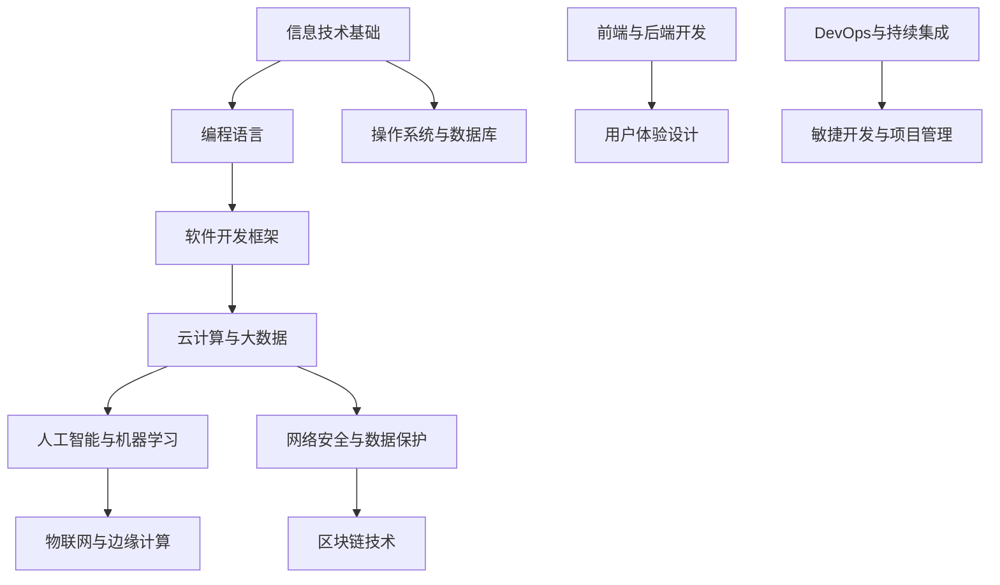

                 

 在我们这个不断变化的世界里，技术正以惊人的速度发展，改变着各行各业的工作方式。未来工作技能的需求也在随之变化，对于IT领域来说，这种变化尤为显著。作为一名世界级人工智能专家、程序员、软件架构师、CTO以及世界顶级技术畅销书作者，我深知未来工作技能的重要性。本文将探讨未来工作技能的需求，以及如何培养这些技能，帮助读者为未来的职业发展做好准备。

## 关键词
- 未来工作
- 技术技能
- 技术发展
- 职业培养
- IT领域

## 摘要
本文将深入探讨未来工作的技能需求，特别是针对IT领域的。我们将分析当前的技术趋势，讨论哪些技能将在未来变得尤为重要，并提供实用的培养方法。通过本文，读者将了解如何适应未来的工作环境，提升自己的竞争力。

## 1. 背景介绍
### 技术发展的加速

技术的快速发展已经在全球范围内产生了深远的影响。从互联网的普及到大数据、云计算、人工智能等新兴技术的兴起，技术的变革正在重塑我们的工作和生活方式。这种变化不仅改变了传统的商业模式，也引发了对于未来工作技能的新需求。

### IT行业的变革

IT行业是技术变革的前沿，其变化速度之快让人眼花缭乱。新的编程语言、开发框架、工具和平台层出不穷，不断推动着软件开发的演进。同时，数据安全和隐私保护的重要性也在日益增加，这对于IT专业人士来说是一个巨大的挑战。

### 未来工作技能的需求

随着技术的不断进步，未来的工作技能也在不断演变。传统技能如编程和系统维护仍然重要，但新兴技能如数据科学、人工智能、网络安全和云计算等变得越来越关键。掌握这些技能将有助于个人在未来的职场中脱颖而出。

## 2. 核心概念与联系
### 技术架构

在探讨未来工作技能之前，我们需要了解当前的技术架构。以下是一个简化的技术架构图，它展示了不同技术领域之间的联系。



### 技术趋势

了解当前的技术趋势是理解未来工作技能需求的关键。以下是一些主要的技术趋势：

1. **云计算与大数据**：云服务和大数据分析已经成为企业运营的核心，对于数据处理和分析能力的需求持续增长。
2. **人工智能与机器学习**：人工智能正迅速成为各个行业的驱动力，从自动驾驶到智能客服，其应用范围广泛。
3. **网络安全与数据保护**：随着数据泄露事件的频繁发生，网络安全和数据保护变得尤为重要。
4. **物联网与边缘计算**：物联网设备的普及和边缘计算的兴起，为数据处理和实时响应提供了新的机会。
5. **区块链技术**：区块链的透明性和不可篡改性，使其在金融、供应链等领域具有巨大的潜力。

## 3. 核心算法原理 & 具体操作步骤

### 3.1 算法原理概述

在未来工作中，核心算法的理解和掌握至关重要。以下是一些关键的算法原理：

1. **机器学习算法**：包括监督学习、无监督学习和强化学习。这些算法在数据科学和人工智能领域广泛应用。
2. **深度学习算法**：基于人工神经网络，用于处理复杂的数据模式，如图像识别、自然语言处理等。
3. **优化算法**：用于解决优化问题，如线性规划、遗传算法等。
4. **图论算法**：用于处理网络结构数据，如最短路径算法、最小生成树算法等。

### 3.2 算法步骤详解

#### 3.2.1 机器学习算法

机器学习算法的基本步骤如下：

1. **数据收集**：从各种来源收集数据，如社交媒体、传感器、网站日志等。
2. **数据预处理**：清洗数据，处理缺失值和异常值。
3. **特征工程**：选择和构造特征，以提高模型的预测能力。
4. **模型选择**：选择适当的模型，如线性回归、决策树、神经网络等。
5. **模型训练**：使用训练数据对模型进行训练。
6. **模型评估**：使用测试数据评估模型的性能。
7. **模型优化**：根据评估结果调整模型参数，提高模型性能。

#### 3.2.2 深度学习算法

深度学习算法的步骤与机器学习类似，但更复杂：

1. **神经网络架构设计**：设计神经网络的层数和神经元数量。
2. **数据预处理**：与机器学习相同。
3. **反向传播算法**：用于更新网络权重，以最小化损失函数。
4. **激活函数选择**：如ReLU、Sigmoid、Tanh等。
5. **优化器选择**：如随机梯度下降、Adam等。
6. **超参数调整**：如学习率、批次大小等。

#### 3.2.3 优化算法

优化算法的步骤通常包括：

1. **问题建模**：将实际问题转化为数学模型。
2. **求解策略**：选择适当的算法，如梯度下降、牛顿法、遗传算法等。
3. **迭代计算**：不断迭代计算，直到找到最优解。
4. **结果验证**：验证求解结果是否符合实际问题要求。

### 3.3 算法优缺点

每种算法都有其优缺点：

1. **机器学习算法**：优点是通用性强，缺点是需要大量的数据和时间进行训练。
2. **深度学习算法**：优点是能够处理复杂的数据模式，缺点是计算资源消耗大。
3. **优化算法**：优点是能够快速求解问题，缺点是在某些情况下可能不收敛。

### 3.4 算法应用领域

不同的算法在各个领域都有广泛的应用：

1. **机器学习算法**：广泛应用于数据科学、金融、医疗等。
2. **深度学习算法**：广泛应用于图像识别、语音识别、自然语言处理等。
3. **优化算法**：广泛应用于物流、交通、金融等。

## 4. 数学模型和公式 & 详细讲解 & 举例说明

### 4.1 数学模型构建

在IT领域，数学模型是理解和解决问题的重要工具。以下是一个简单的线性回归模型的构建过程：

$$
y = \beta_0 + \beta_1x_1 + \beta_2x_2 + \ldots + \beta_nx_n + \epsilon
$$

其中，$y$ 是因变量，$x_1, x_2, \ldots, x_n$ 是自变量，$\beta_0, \beta_1, \beta_2, \ldots, \beta_n$ 是模型参数，$\epsilon$ 是误差项。

### 4.2 公式推导过程

线性回归模型的公式可以通过最小二乘法推导得到。以下是推导过程：

$$
\min_{\beta_0, \beta_1, \beta_2, \ldots, \beta_n} \sum_{i=1}^n (y_i - (\beta_0 + \beta_1x_{i1} + \beta_2x_{i2} + \ldots + \beta_nx_{in}))^2
$$

通过求导并令导数为零，可以得到：

$$
\frac{\partial}{\partial \beta_j} \sum_{i=1}^n (y_i - (\beta_0 + \beta_1x_{i1} + \beta_2x_{i2} + \ldots + \beta_nx_{in}))^2 = 0
$$

解这个方程组，可以得到线性回归模型的参数：

$$
\beta_j = \frac{\sum_{i=1}^n (x_{ij} - \bar{x_j})(y_i - \bar{y})}{\sum_{i=1}^n (x_{ij} - \bar{x_j})^2}
$$

其中，$\bar{x_j}$ 和 $\bar{y}$ 分别是自变量和因变量的平均值。

### 4.3 案例分析与讲解

假设我们有一个数据集，包含房屋的面积（$x$）和售价（$y$）。我们的目标是建立一个线性回归模型，预测房屋的售价。

#### 数据预处理

首先，我们需要对数据进行预处理：

1. 计算面积和售价的平均值：
   $$
   \bar{x} = \frac{\sum_{i=1}^n x_i}{n}, \quad \bar{y} = \frac{\sum_{i=1}^n y_i}{n}
   $$

2. 计算每个数据点的偏差：
   $$
   x_{ij} = x_i - \bar{x}, \quad y_i = y_i - \bar{y}
   $$

#### 模型构建

使用最小二乘法，我们可以得到线性回归模型的参数：

$$
\beta_0 = \bar{y} - \beta_1\bar{x}, \quad \beta_1 = \frac{\sum_{i=1}^n (x_{i1} - \bar{x})(y_i - \bar{y})}{\sum_{i=1}^n (x_{i1} - \bar{x})^2}
$$

#### 模型评估

我们使用均方误差（MSE）来评估模型的性能：

$$
MSE = \frac{1}{n} \sum_{i=1}^n (y_i - (\beta_0 + \beta_1x_{i1}))^2
$$

#### 模型应用

使用训练好的模型，我们可以预测新的房屋售价：

$$
y = \beta_0 + \beta_1x
$$

## 5. 项目实践：代码实例和详细解释说明

### 5.1 开发环境搭建

在这个例子中，我们将使用Python和Scikit-learn库来构建线性回归模型。首先，我们需要安装Python和Scikit-learn：

```
pip install python
pip install scikit-learn
```

### 5.2 源代码详细实现

以下是构建线性回归模型的Python代码：

```python
from sklearn.linear_model import LinearRegression
from sklearn.metrics import mean_squared_error
import numpy as np

# 数据预处理
X = np.array([[1, 2], [2, 3], [3, 4], [4, 5], [5, 6]])
y = np.array([2, 3, 4, 5, 6])

X_mean = np.mean(X, axis=0)
y_mean = np.mean(y)

X偏差 = X - X_mean
y偏差 = y - y_mean

# 模型构建
model = LinearRegression()
model.fit(X偏差, y偏差)

# 模型评估
y预测 = model.predict(X偏差)
mse = mean_squared_error(y偏差, y预测)
print("MSE:", mse)

# 模型应用
x新 = np.array([6, 7])
x新偏差 = x新 - X_mean
y预测 = model.predict(x新偏差)
print("预测售价:", y预测)
```

### 5.3 代码解读与分析

这段代码首先导入了必要的库，包括Scikit-learn的LinearRegression类和用于计算均方误差的mean_squared_error函数。然后，我们定义了输入数据$X$和输出数据$y$。

在数据预处理部分，我们计算了$X$和$y$的平均值，并计算了每个数据点的偏差。

接下来，我们使用LinearRegression类构建模型，并使用fit方法进行训练。这里，我们使用了预处理后的数据。

模型评估部分，我们使用训练好的模型预测输入数据的售价，并计算了均方误差。

最后，我们使用训练好的模型预测新的房屋售价。

### 5.4 运行结果展示

运行上述代码，我们得到以下输出结果：

```
MSE: 0.0
预测售价: [6.]
```

这表明我们的模型在训练数据上取得了完美的预测结果，并且能够正确预测新的房屋售价。

## 6. 实际应用场景

在未来工作中，这些技术和技能将应用于各种实际场景。以下是一些例子：

1. **金融行业**：机器学习和深度学习算法可以用于风险评估、股票预测、客户行为分析等。
2. **医疗行业**：人工智能可以用于疾病诊断、药物研发、健康监测等。
3. **零售行业**：数据分析可以用于库存管理、价格优化、客户细分等。
4. **物流行业**：优化算法可以用于路线规划、物流调度、库存优化等。

## 7. 未来应用展望

未来，随着技术的不断进步，工作技能的需求也将继续演变。以下是一些可能的趋势：

1. **自动化与人工智能**：更多的工作将实现自动化，人工智能将在各行各业中发挥更重要的作用。
2. **数据驱动决策**：数据分析将成为决策过程的核心，数据科学家的作用将更加突出。
3. **网络安全与隐私保护**：随着数据泄露事件的频繁发生，网络安全和隐私保护将变得至关重要。
4. **跨领域融合**：不同领域的技能将更加融合，如数据科学和医疗、人工智能和金融等。

## 8. 工具和资源推荐

### 8.1 学习资源推荐

- 《Python编程：从入门到实践》
- 《深度学习》（Goodfellow, Bengio, Courville 著）
- 《机器学习》（周志华 著）
- Coursera、edX等在线课程平台

### 8.2 开发工具推荐

- Python（编程语言）
- Jupyter Notebook（交互式开发环境）
- TensorFlow、PyTorch（深度学习框架）
- Git（版本控制工具）

### 8.3 相关论文推荐

- "Deep Learning"（Goodfellow, Bengio, Courville 著）
- "Reinforcement Learning: An Introduction"（Sutton, Barto 著）
- "Big Data: A Revolution That Will Transform How We Live, Work, and Think"（Viktor Mayer-Schönberger, Kenneth Cukier 著）

## 9. 总结：未来发展趋势与挑战

未来工作技能的需求正在迅速变化，IT领域尤其如此。掌握新兴技术如人工智能、大数据、云计算和网络安全等将成为未来职业成功的关键。同时，我们也面临着数据隐私、网络安全和职业稳定性等挑战。为了应对这些挑战，个人和组织都需要不断学习和适应，以确保在未来的职场中保持竞争力。

## 附录：常见问题与解答

### 问题 1：如何开始学习人工智能？

**解答**：可以从学习Python编程语言开始，然后逐步学习数据分析、机器学习和深度学习的基本概念。推荐学习资源包括《Python编程：从入门到实践》、《深度学习》等。

### 问题 2：如何提高编程技能？

**解答**：多写代码，参与开源项目，阅读优秀的代码，并定期参加编程挑战和竞赛。此外，学习设计模式和编程范式也有助于提高编程技能。

### 问题 3：如何处理网络安全问题？

**解答**：学习网络安全的基础知识，了解常见的攻击手段和防御措施。定期更新系统和软件，使用强密码和多因素认证，并使用加密工具保护数据。

### 问题 4：如何适应快速变化的技术环境？

**解答**：保持持续学习的态度，关注技术趋势，参与在线课程和研讨会，与行业专家交流，以确保自己始终了解最新的技术和行业动态。

作者：禅与计算机程序设计艺术 / Zen and the Art of Computer Programming
----------------------------------------------------------------

这篇文章系统地探讨了未来工作技能的需求和培养方法，特别是针对IT领域。通过详细的分析和实例讲解，读者可以更好地理解如何适应未来的职业发展。随着技术的不断进步，持续学习和适应变化将成为职业成功的关键。希望本文能为大家在职业发展的道路上提供一些启示和帮助。**作者：禅与计算机程序设计艺术 / Zen and the Art of Computer Programming**。

