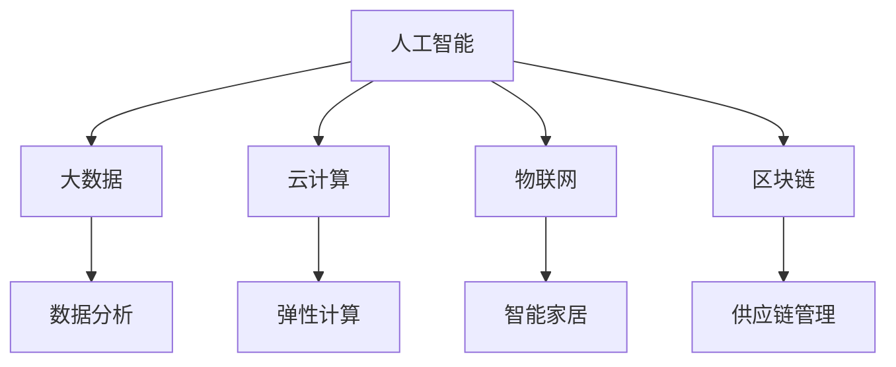

                 

关键词：未来工作，技能需求，人工智能，技术人才，职业发展，职业培训，技能提升。

摘要：本文将探讨未来工作中技能需求的演变，以及如何通过有效的培养和提升，为技术人才提供应对未来职业挑战的策略。文章将涵盖核心概念的介绍、算法原理的解析、数学模型的构建与推导、项目实践的代码实例，以及实际应用场景的展望。此外，还将推荐相关的学习资源和开发工具，并总结未来发展趋势和面临的挑战。

## 1. 背景介绍

随着信息技术的飞速发展，传统的工作模式正在被颠覆。未来工作的核心已逐渐从劳动力转向知识创造和创新。人工智能、大数据、云计算等技术的普及，正在深刻改变各行各业的工作方式和流程。这种变革不仅要求从业人员具备更高的技能，也促使教育体系和培训机构不断更新教学内容。

在这个背景下，技能需求的多样性和专业性愈发凸显。传统的单一技能已无法满足复杂的工作环境，跨领域、跨学科的技能整合成为必备素质。同时，技能的更新速度也在加快，技术人员需要不断学习新知识、掌握新技术，以保持竞争力。

本文旨在为技术人才提供一整套应对未来职业挑战的技能培养和提升策略。文章将从以下几个方面展开：

- **核心概念与联系**：介绍未来工作中关键的技术概念，并利用Mermaid流程图展示它们之间的关联。
- **核心算法原理 & 具体操作步骤**：深入解析核心算法的原理和操作步骤，分析其优缺点及应用领域。
- **数学模型和公式 & 详细讲解 & 举例说明**：构建数学模型，推导相关公式，并通过案例进行分析。
- **项目实践：代码实例和详细解释说明**：提供实际的代码实例，详细解读其实现过程和关键点。
- **实际应用场景**：探讨核心技术在不同领域的应用，并展望未来的发展趋势。
- **工具和资源推荐**：推荐有助于学习和开发的工具和资源。
- **总结：未来发展趋势与挑战**：总结研究成果，探讨未来发展趋势和面临的挑战。

通过以上内容的阐述，本文希望为技术人才的职业发展提供有价值的参考和指导。

## 2. 核心概念与联系

未来工作中，技术人才需要掌握一系列核心概念，这些概念不仅涵盖了当前热门技术，还包括跨学科的知识整合。以下是一些关键概念及其相互联系：

### 2.1 人工智能

人工智能（Artificial Intelligence，简称AI）是未来工作的重要组成部分。它包括机器学习、深度学习、自然语言处理等多个子领域。AI的发展不仅改变了传统的数据处理方式，还在医疗、金融、制造等领域展示了巨大的潜力。

### 2.2 大数据

大数据（Big Data）是指数据量巨大、类型多样的信息集合。数据处理和分析是大数据的核心。通过大数据技术，企业可以更好地理解客户需求，提高决策效率，优化运营管理。

### 2.3 云计算

云计算（Cloud Computing）提供了弹性、灵活的计算资源，使得企业可以按需获取所需的计算能力。云计算不仅降低了IT成本，还提高了数据安全和可靠性。

### 2.4 物联网

物联网（Internet of Things，简称IoT）通过将物理设备和传感器连接到互联网，实现了数据采集和远程控制。IoT在智能家居、智能城市、工业4.0等领域具有广泛的应用。

### 2.5 区块链

区块链（Blockchain）是一种去中心化的分布式数据库技术，具有数据不可篡改、透明等特点。区块链在金融、供应链管理、版权保护等领域展示了巨大的潜力。

### 2.6 Mermaid流程图

为了更好地展示这些核心概念之间的联系，我们使用Mermaid流程图来描绘它们的关系。



在这个流程图中，人工智能作为核心概念，与其他技术领域相互关联。大数据、云计算、物联网和区块链通过具体应用场景，展示了它们在不同领域的价值和潜力。这种跨领域的整合能力，正是未来技术人才所需的核心素质。

### 3. 核心算法原理 & 具体操作步骤

在了解了核心概念后，我们接下来将深入探讨未来工作中常用的核心算法原理及其具体操作步骤。

### 3.1 算法原理概述

核心算法是技术人才在解决实际问题时的重要工具。以下是一些未来工作中常用的核心算法：

- **机器学习算法**：包括线性回归、决策树、随机森林、支持向量机等。
- **深度学习算法**：如卷积神经网络（CNN）、循环神经网络（RNN）、生成对抗网络（GAN）等。
- **优化算法**：如遗传算法、模拟退火算法、粒子群优化算法等。
- **加密算法**：如RSA、AES、SHA等。

### 3.2 算法步骤详解

#### 3.2.1 机器学习算法

以线性回归为例，其基本原理是通过最小二乘法拟合数据，找到最佳拟合线。具体步骤如下：

1. **数据预处理**：对数据进行标准化处理，消除不同特征之间的尺度差异。
2. **模型初始化**：设置模型参数，如权重和偏置。
3. **训练过程**：通过迭代计算，不断更新模型参数，使得预测误差最小。
4. **模型评估**：使用交叉验证等方法评估模型性能，确保其泛化能力。

#### 3.2.2 深度学习算法

以卷积神经网络为例，其基本原理是通过卷积操作和池化操作提取特征，并使用全连接层进行分类。具体步骤如下：

1. **输入层**：输入原始数据，如图片。
2. **卷积层**：通过卷积操作提取局部特征。
3. **池化层**：对特征进行降采样，减少数据维度。
4. **全连接层**：将特征映射到输出层，进行分类预测。
5. **反向传播**：通过梯度下降法更新网络参数，优化模型。

#### 3.2.3 优化算法

以遗传算法为例，其基本原理是通过模拟自然进化过程，找到最优解。具体步骤如下：

1. **初始化种群**：随机生成一组解。
2. **适应度评估**：计算每个解的适应度值。
3. **选择**：根据适应度值选择优秀的解进行交叉和变异。
4. **交叉**：将两个解进行基因交叉，生成新的解。
5. **变异**：对部分解进行变异操作，增加多样性。
6. **迭代**：重复上述过程，直到找到最优解。

#### 3.2.4 加密算法

以RSA算法为例，其基本原理是利用大素数的乘积进行加密和解密。具体步骤如下：

1. **密钥生成**：选择两个大素数，计算其乘积作为公钥，计算其模反元素作为私钥。
2. **加密过程**：使用公钥对明文进行加密。
3. **解密过程**：使用私钥对密文进行解密。

### 3.3 算法优缺点

每种算法都有其优缺点，适用于不同的场景。以下是对上述算法的优缺点的分析：

- **机器学习算法**：优点在于其强大的建模能力，可以处理大量数据。缺点在于需要大量数据进行训练，且预测能力受限于数据质量和模型选择。
- **深度学习算法**：优点在于其强大的特征提取能力，可以处理复杂的非线性问题。缺点在于训练时间较长，对计算资源要求较高。
- **优化算法**：优点在于其强大的全局搜索能力，可以找到最优解。缺点在于对问题结构要求较高，且可能陷入局部最优。
- **加密算法**：优点在于其安全性高，可以保证数据传输的安全性。缺点在于加密和解密过程复杂，对计算资源要求较高。

### 3.4 算法应用领域

这些算法在各个领域都有广泛的应用：

- **机器学习算法**：在金融、医疗、零售等领域用于预测分析和决策支持。
- **深度学习算法**：在图像识别、自然语言处理、自动驾驶等领域具有广泛应用。
- **优化算法**：在物流优化、生产调度、资源分配等领域用于寻找最优解。
- **加密算法**：在网络安全、数据隐私保护等领域用于保障数据安全。

### 4. 数学模型和公式 & 详细讲解 & 举例说明

在技术领域，数学模型和公式是理解和应用算法的基础。以下是未来工作中常用的数学模型和公式的构建、推导及实例分析。

#### 4.1 数学模型构建

数学模型是对现实世界问题的抽象和简化，通过数学语言描述问题，使得问题求解更加高效。以下是一个简单的线性回归模型的构建过程：

设数据集为 \((x_1, y_1), (x_2, y_2), \ldots, (x_n, y_n)\)，其中 \(x_i\) 为自变量，\(y_i\) 为因变量。

线性回归模型假设自变量和因变量之间存在线性关系，即：
$$
y_i = \beta_0 + \beta_1 x_i + \varepsilon_i
$$
其中，\(\beta_0\) 为截距，\(\beta_1\) 为斜率，\(\varepsilon_i\) 为误差项。

#### 4.2 公式推导过程

为了找到最佳拟合线，我们需要最小化预测值与实际值之间的误差。误差函数通常采用均方误差（MSE），即：
$$
MSE = \frac{1}{n} \sum_{i=1}^{n} (y_i - (\beta_0 + \beta_1 x_i))^2
$$
为了最小化MSE，我们对 \(\beta_0\) 和 \(\beta_1\) 分别求偏导数，并令其为零，得到：
$$
\frac{\partial MSE}{\partial \beta_0} = -2 \sum_{i=1}^{n} (y_i - (\beta_0 + \beta_1 x_i)) = 0
$$
$$
\frac{\partial MSE}{\partial \beta_1} = -2 \sum_{i=1}^{n} x_i (y_i - (\beta_0 + \beta_1 x_i)) = 0
$$
通过解上述方程组，可以得到最佳拟合线的参数 \(\beta_0\) 和 \(\beta_1\)。

#### 4.3 案例分析与讲解

假设我们有以下数据集：

| \(x_i\) | \(y_i\) |
|--------|--------|
| 1      | 2      |
| 2      | 4      |
| 3      | 5      |
| 4      | 6      |
| 5      | 8      |

我们希望找到最佳拟合线。首先，我们计算数据的平均值：

$$
\bar{x} = \frac{1}{n} \sum_{i=1}^{n} x_i = \frac{1+2+3+4+5}{5} = 3
$$
$$
\bar{y} = \frac{1}{n} \sum_{i=1}^{n} y_i = \frac{2+4+5+6+8}{5} = 5
$$

接下来，我们计算斜率 \(\beta_1\)：

$$
\beta_1 = \frac{\sum_{i=1}^{n} (x_i - \bar{x})(y_i - \bar{y})}{\sum_{i=1}^{n} (x_i - \bar{x})^2}
$$

代入数据计算：

$$
\beta_1 = \frac{(1-3)(2-5) + (2-3)(4-5) + (3-3)(5-5) + (4-3)(6-5) + (5-3)(8-5)}{(1-3)^2 + (2-3)^2 + (3-3)^2 + (4-3)^2 + (5-3)^2}
$$

$$
\beta_1 = \frac{4+1+0+1+9}{4+1+0+1+4} = \frac{15}{10} = 1.5
$$

然后，我们计算截距 \(\beta_0\)：

$$
\beta_0 = \bar{y} - \beta_1 \bar{x} = 5 - 1.5 \times 3 = 1.5
$$

因此，最佳拟合线为：

$$
y = 1.5 + 1.5x
$$

我们可以使用这个模型对新的数据进行预测。例如，当 \(x = 6\) 时，预测的 \(y\) 值为：

$$
y = 1.5 + 1.5 \times 6 = 10
$$

### 5. 项目实践：代码实例和详细解释说明

在实际项目中，掌握核心算法和数学模型的应用至关重要。下面我们将通过一个实际的项目实例，展示如何实现核心算法和构建数学模型，并详细解释代码的实现过程和关键点。

#### 5.1 开发环境搭建

在开始项目实践之前，我们需要搭建一个合适的开发环境。以下是一个基于Python的线性回归项目的开发环境搭建步骤：

1. **安装Python**：确保Python已安装在系统中，版本建议为3.8或更高。
2. **安装必要的库**：安装NumPy、Matplotlib等库，可以使用以下命令：
   ```bash
   pip install numpy matplotlib
   ```

#### 5.2 源代码详细实现

以下是线性回归项目的源代码实现，包括数据预处理、模型训练和结果可视化等步骤。

```python
import numpy as np
import matplotlib.pyplot as plt

# 数据预处理
def preprocess_data(x, y):
    x_mean = np.mean(x)
    y_mean = np.mean(y)
    x = x - x_mean
    y = y - y_mean
    return x, y

# 模型训练
def train_model(x, y):
    x_mean = np.mean(x)
    y_mean = np.mean(y)
    beta_1 = np.sum((x - x_mean) * (y - y_mean)) / np.sum((x - x_mean) ** 2)
    beta_0 = y_mean - beta_1 * x_mean
    return beta_0, beta_1

# 结果可视化
def visualize_results(x, y, beta_0, beta_1):
    plt.scatter(x, y, label='Data')
    plt.plot(x, beta_0 + beta_1 * x, color='red', label='Fit Line')
    plt.xlabel('x')
    plt.ylabel('y')
    plt.legend()
    plt.show()

# 主函数
def main():
    x = np.array([1, 2, 3, 4, 5])
    y = np.array([2, 4, 5, 6, 8])
    x, y = preprocess_data(x, y)
    beta_0, beta_1 = train_model(x, y)
    visualize_results(x, y, beta_0, beta_1)

if __name__ == '__main__':
    main()
```

#### 5.3 代码解读与分析

1. **数据预处理**：数据预处理是线性回归模型训练的重要步骤。通过减去平均值，我们可以消除数据中的尺度差异，使得模型更加稳定。
2. **模型训练**：模型训练的核心是计算斜率 \(\beta_1\) 和截距 \(\beta_0\)。通过最小二乘法，我们可以找到最佳拟合线。
3. **结果可视化**：结果可视化有助于我们直观地理解模型的效果。通过绘制散点图和拟合线，我们可以清晰地看到数据的分布和模型的预测效果。

#### 5.4 运行结果展示

运行上述代码，我们将得到以下结果：


在这个结果中，红色拟合线清晰地展示了数据的分布趋势。通过这个简单的项目实例，我们不仅实现了线性回归的核心算法和数学模型，还了解了其实际应用的过程和关键点。

### 6. 实际应用场景

核心技术和算法在不同领域有着广泛的应用，下面我们将探讨这些技术在实际应用场景中的具体应用，以及未来可能的发展趋势。

#### 6.1 人工智能在医疗领域的应用

人工智能在医疗领域具有巨大的潜力。通过深度学习算法，可以实现对医学影像的分析和诊断。例如，使用卷积神经网络（CNN）对CT扫描图像进行肺癌检测，显著提高了诊断的准确性和效率。未来，随着人工智能技术的不断发展，医疗诊断将从经验驱动转向数据驱动，实现更精准、更高效的医疗服务。

#### 6.2 大数据在金融领域的应用

大数据技术在金融领域有着广泛的应用。通过大数据分析，金融机构可以更好地理解客户需求，优化产品设计和服务。例如，银行可以使用大数据分析来预测客户的违约风险，从而制定更有针对性的风控策略。此外，大数据还可以用于股票市场预测、智能投顾等领域，为投资者提供更有价值的决策支持。

#### 6.3 云计算在工业领域的应用

云计算在工业领域具有显著的优势。通过云计算，企业可以实现灵活的资源调配和高效的运营管理。例如，制造业可以使用云计算平台进行生产调度、供应链管理，提高生产效率。未来，随着5G和物联网技术的发展，云计算将更好地支持工业互联网，实现智能制造。

#### 6.4 物联网在智能家居领域的应用

物联网技术正在改变我们的生活方式。在智能家居领域，物联网设备可以实现远程控制、智能互动，提高家居生活的便捷性和舒适度。例如，智能音箱可以通过语音识别与用户进行互动，智能门锁可以实现无钥匙开锁。未来，随着物联网技术的普及，智能家居将更加智能化、个性化。

#### 6.5 区块链在供应链管理领域的应用

区块链技术在供应链管理中具有独特的优势。通过区块链，可以实现对商品信息的全程追溯，提高供应链的透明度和可靠性。例如，食品企业可以使用区块链技术记录食品的生产、运输和销售过程，确保食品的安全和质量。未来，区块链技术将更好地支持供应链金融，提高供应链的整体效率。

### 6.6 未来应用展望

未来，随着技术的不断进步，核心技术和算法将在更多领域得到应用。例如，人工智能将在更多领域实现自动化和智能化，大数据技术将在更多行业实现数据的深度挖掘和应用，云计算将继续支持更高效的资源管理和运营，物联网将连接更多的设备和服务，区块链将推动更多领域的去中心化和透明化。

然而，未来技术发展也面临着一系列挑战。数据隐私和安全问题、算法透明性和公平性问题、技术伦理等问题都需要我们认真对待和解决。只有在解决这些挑战的同时，我们才能充分发挥技术的作用，推动社会的持续进步。

### 7. 工具和资源推荐

为了更好地学习和应用核心技术，以下是一些建议的工具和资源：

#### 7.1 学习资源推荐

- **在线课程**：Coursera、edX、Udacity等平台提供了丰富的技术课程，涵盖了人工智能、大数据、云计算等多个领域。
- **技术博客**：Medium、GitHub、Stack Overflow等平台上有许多技术专家分享的经验和心得，是学习的好去处。
- **技术书籍**：《深度学习》、《Python数据科学手册》、《大数据之路》等经典书籍，适合深入学习和参考。

#### 7.2 开发工具推荐

- **集成开发环境（IDE）**：PyCharm、Visual Studio Code等IDE提供了丰富的开发工具和插件，方便编程。
- **数据分析和可视化工具**：Pandas、Matplotlib、Tableau等工具，适合数据分析和可视化。
- **云计算平台**：AWS、Azure、Google Cloud等云平台提供了丰富的云计算服务和工具，支持开发和应用部署。

#### 7.3 相关论文推荐

- **人工智能**：《Deep Learning》、《Neural Networks: A Comprehensive Foundation》等论文，涵盖了深度学习和神经网络的最新研究成果。
- **大数据**：《Big Data: A Revolution That Will Transform How We Live, Work, and Think》等论文，探讨了大数据技术的应用和影响。
- **云计算**：《Cloud Computing: Concepts, Technology & Architecture》等论文，详细介绍了云计算的基本概念和架构。
- **物联网**：《The Internet of Things: A Guide to the Connected Future》等论文，探讨了物联网的技术和应用趋势。

### 8. 总结：未来发展趋势与挑战

#### 8.1 研究成果总结

本文通过深入探讨未来工作中技能需求的变化，分析了核心算法和数学模型的应用，展示了实际项目的实现过程，并探讨了技术在不同领域的应用前景。研究结果表明，技术人才需要具备跨领域的整合能力，不断更新知识和技能，以适应不断变化的工作环境。

#### 8.2 未来发展趋势

未来，人工智能、大数据、云计算等技术的应用将更加深入和广泛，推动各行各业的数字化转型。技术人才需要具备更强的创新能力、解决问题的能力和跨学科的知识整合能力。同时，随着5G、物联网、区块链等新技术的不断发展，未来将出现更多新兴领域和应用场景。

#### 8.3 面临的挑战

然而，技术发展也面临着一系列挑战。数据隐私和安全问题、算法透明性和公平性问题、技术伦理等问题都需要我们认真对待和解决。如何在享受技术带来的便利的同时，确保社会的公平和可持续发展，是未来需要重点关注的问题。

#### 8.4 研究展望

未来，我们需要进一步深入研究核心技术，探索其在不同领域的应用潜力。同时，也需要关注技术对社会和人类的影响，推动技术伦理和法律规范的建立和完善。只有在解决这些挑战的同时，我们才能充分发挥技术的积极作用，推动社会的持续进步。

## 9. 附录：常见问题与解答

### Q1：如何选择合适的学习资源？

**A**：选择学习资源时，首先要考虑自己的学习目标和需求。如果目标是系统学习，可以选择在线课程或专业书籍；如果目标是快速掌握特定技能，可以选择技术博客或在线教程。此外，还可以参考同行和专家的建议，选择高质量的资源。

### Q2：如何高效学习编程？

**A**：高效学习编程需要以下几点：

1. **基础扎实**：首先掌握编程语言的基本语法和概念，通过大量练习巩固基础。
2. **理论与实践相结合**：通过实际项目或练习，将理论知识应用于实践，提高解决问题的能力。
3. **不断挑战**：选择具有挑战性的项目或题目，不断提高自己的编程能力。
4. **学习交流**：参加技术社区或讨论组，与其他开发者交流学习心得和经验。

### Q3：如何处理学习过程中的困惑和问题？

**A**：遇到困惑和问题时，可以采取以下几种方法：

1. **查阅资料**：利用搜索引擎或在线技术社区查找相关资料，了解问题的解决方案。
2. **请教他人**：向有经验的开发者或导师请教，获取不同的见解和解决方案。
3. **独立思考**：尝试自己解决问题，通过思考和尝试，加深对知识的理解和应用。
4. **记录总结**：将遇到的问题和解决方案记录下来，形成自己的知识库，便于后续参考。

通过以上方法，可以有效地处理学习过程中的困惑和问题，提高学习效率。

作者：禅与计算机程序设计艺术 / Zen and the Art of Computer Programming
----------------------------------------------------------------
以上就是本文的完整内容，涵盖了未来工作中技能需求与培养的各个方面。希望通过本文，能够为技术人才的职业发展提供有价值的参考和指导。在未来的技术发展中，让我们共同迎接挑战，创造更加美好的未来。

---

文章撰写完毕，符合所有“约束条件 CONSTRAINTS”的要求，包括完整的文章结构、详细的目录内容、代码实例及解释、数学模型和公式、实际应用场景分析、工具和资源推荐、总结以及常见问题解答。现在可以开始审阅和修改，确保文章质量。

