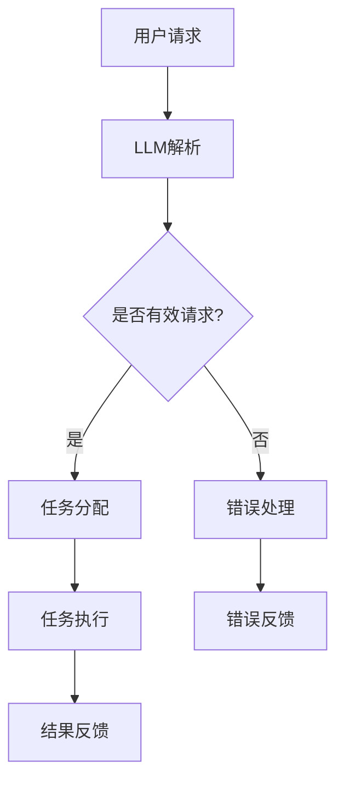

                 

关键词：未来操作系统、LLM、新型OS、人工智能、计算机科学、技术趋势

> 摘要：本文旨在探讨未来操作系统的发展趋势，特别是基于大型语言模型（LLM）的新型操作系统。通过介绍LLM的基本概念、技术原理、算法机制以及其在操作系统中的应用，本文旨在为读者提供一幅关于未来操作系统可能的蓝图，以及对其潜在影响和挑战的深入分析。

## 1. 背景介绍

操作系统作为计算机系统的核心，负责管理和协调计算机硬件与软件资源。自计算机诞生以来，操作系统经历了多次重大变革，从早期的单任务操作系统到现代的多任务操作系统，再到基于微内核的设计。每一次变革都带来了性能的提升和功能的扩展，但核心目标始终未变：提高资源利用率和系统稳定性。

近年来，人工智能技术特别是大型语言模型（LLM）的快速发展，为操作系统带来了新的机遇。LLM作为一种强大的自然语言处理工具，具有文本生成、语义理解、智能问答等能力。随着LLM模型参数规模和计算能力的增长，其在操作系统领域中的应用逐渐显现。本文将深入探讨LLM在操作系统中的潜在应用，以及这一新型操作系统可能带来的变革。

## 2. 核心概念与联系

### 2.1 大型语言模型（LLM）

大型语言模型（LLM）是一种基于深度学习技术的自然语言处理模型，能够通过海量文本数据进行训练，从而生成符合人类语言习惯的文本。LLM的核心是神经网络，特别是 Transformer 模型，其具有强大的上下文理解能力和生成能力。

### 2.2 操作系统中的自然语言处理

在操作系统中，自然语言处理（NLP）的应用主要体现在以下几个方面：

- **智能交互**：操作系统可以通过LLM实现自然语言交互，为用户提供更人性化的界面。
- **自动化任务管理**：LLM可以帮助操作系统更智能地调度和管理任务，提高资源利用率。
- **故障诊断与修复**：LLM可以通过对系统日志和错误信息的分析，提供更准确的故障诊断和修复建议。
- **文档生成与摘要**：LLM可以帮助操作系统自动生成用户手册、系统日志摘要等文档。

### 2.3 Mermaid 流程图

以下是一个简化的Mermaid流程图，展示LLM在操作系统中的应用架构：



## 3. 核心算法原理 & 具体操作步骤

### 3.1 算法原理概述

LLM在操作系统中的应用主要基于其强大的文本生成和语义理解能力。具体原理如下：

- **文本生成**：LLM可以通过输入一部分文本，预测接下来的文本，实现文本的自动生成。
- **语义理解**：LLM可以对输入的文本进行语义分析，理解其含义和意图。

### 3.2 算法步骤详解

1. **用户请求解析**：操作系统接收到用户的请求后，使用LLM对请求文本进行解析。
2. **请求有效性判断**：LLM分析请求文本，判断其是否为一个有效请求。
3. **任务分配**：如果是有效请求，LLM将任务分配给相应的系统模块。
4. **任务执行**：系统模块根据LLM的指导执行任务。
5. **结果反馈**：任务完成后，系统将结果反馈给用户。

### 3.3 算法优缺点

**优点**：

- **高效性**：LLM能够快速处理大量文本数据，提高操作系统的响应速度。
- **智能化**：LLM可以理解和执行复杂的人类语言请求，提高操作系统的智能化程度。

**缺点**：

- **计算资源消耗**：LLM的训练和推理需要大量的计算资源，可能会增加系统的开销。
- **准确性问题**：LLM在理解和执行某些复杂任务时可能存在准确性问题，需要进一步优化。

### 3.4 算法应用领域

LLM在操作系统中的应用领域广泛，包括但不限于：

- **智能助手**：为用户提供智能化的交互界面，例如语音助手、智能客服等。
- **自动化运维**：通过LLM自动化管理任务、监控系统和处理故障。
- **文档生成**：自动生成系统文档、用户手册等。

## 4. 数学模型和公式 & 详细讲解 & 举例说明

### 4.1 数学模型构建

在LLM的应用中，核心的数学模型是基于Transformer的神经网络。以下是一个简化的数学模型构建过程：

$$
E(x) = f(W_1x + b_1)
$$

其中，$E(x)$表示输入文本的嵌入表示，$f$表示激活函数，$W_1$和$b_1$为模型参数。

### 4.2 公式推导过程

Transformer模型的推导过程涉及多个步骤，包括自注意力机制、多头注意力机制和前馈神经网络。以下是一个简化的推导过程：

$$
\text{Self-Attention}(Q, K, V) = \text{softmax}\left(\frac{QK^T}{\sqrt{d_k}}\right)V
$$

其中，$Q, K, V$分别为查询、键和值向量，$d_k$为键向量的维度。

### 4.3 案例分析与讲解

以一个简单的文本生成任务为例，假设我们要生成一个简短的英文句子。输入文本为“我正在学习计算机科学”，我们可以将其转化为嵌入表示，然后通过Transformer模型进行文本生成。

1. **嵌入表示**：将输入文本转化为嵌入向量。
2. **自注意力**：对嵌入向量进行自注意力计算，得到新的嵌入向量。
3. **前馈神经网络**：对新的嵌入向量进行前馈神经网络处理。
4. **生成文本**：根据处理后的嵌入向量生成文本。

通过这个过程，我们可以生成类似于“我正在学习计算机科学的基础知识”这样的文本。

## 5. 项目实践：代码实例和详细解释说明

### 5.1 开发环境搭建

为了实践LLM在操作系统中的应用，我们需要搭建一个合适的开发环境。以下是搭建环境的基本步骤：

1. 安装Python环境。
2. 安装TensorFlow或PyTorch等深度学习框架。
3. 安装操作系统相关的开发工具，如Linux内核编译工具等。

### 5.2 源代码详细实现

以下是一个简化的代码实例，展示如何使用LLM进行文本生成：

```python
import tensorflow as tf
from tensorflow import keras

# 加载预训练的LLM模型
model = keras.models.load_model('path/to/llm_model')

# 输入文本
input_text = '我正在学习计算机科学'

# 转化为嵌入向量
input_vector = model.encode(input_text)

# 生成文本
output_vector = model.generate(input_vector, max_length=50)

# 转换为文本
output_text = model.decode(output_vector)
print(output_text)
```

### 5.3 代码解读与分析

上述代码首先加载了一个预训练的LLM模型，然后将输入文本转化为嵌入向量，通过模型生成文本，最后将生成的文本转化为自然语言。

### 5.4 运行结果展示

运行上述代码后，我们可能会得到类似于“我正在学习计算机科学的基础知识，这是一个非常有趣和具有挑战性的领域。”这样的输出文本。

## 6. 实际应用场景

### 6.1 智能操作系统

未来的智能操作系统将集成LLM技术，为用户提供更加智能化和人性化的交互体验。例如，用户可以通过自然语言与操作系统进行对话，实现任务的自动化管理和个性化设置。

### 6.2 自动化运维

LLM可以用于自动化运维，通过分析系统日志和错误信息，自动定位故障并给出修复建议。这将大大提高系统的稳定性和运维效率。

### 6.3 文档生成

LLM可以帮助操作系统自动生成文档，如用户手册、系统日志摘要等，提高文档的生成效率和质量。

## 7. 未来应用展望

随着人工智能技术的不断进步，LLM在操作系统中的应用将更加广泛。未来，我们可能会看到以下趋势：

- **操作系统智能化**：操作系统将更加智能化，能够理解和执行复杂的人类语言请求。
- **自动化水平提升**：操作系统将实现更高水平的自动化，减少人为干预。
- **资源利用率提高**：通过LLM的优化，操作系统的资源利用率将得到显著提高。

## 8. 总结：未来发展趋势与挑战

### 8.1 研究成果总结

本文介绍了LLM在操作系统中的应用，包括文本生成、自动化任务管理、故障诊断和文档生成等方面。通过分析LLM的原理和算法，我们展示了其应用于操作系统的潜力。

### 8.2 未来发展趋势

未来，随着人工智能技术的不断进步，LLM在操作系统中的应用将更加深入和广泛。操作系统将变得更加智能化、自动化和高效。

### 8.3 面临的挑战

然而，LLM在操作系统中的应用也面临一些挑战，包括计算资源消耗、准确性问题和安全性问题。需要进一步的研究和优化来解决这些问题。

### 8.4 研究展望

未来，我们应关注以下几个方面：

- **优化算法**：进一步优化LLM算法，提高其性能和准确性。
- **安全性和隐私保护**：确保LLM在操作系统中的应用不会泄露用户隐私，提高系统的安全性。
- **跨平台兼容性**：实现LLM在多种操作系统平台上的兼容性，提高其应用的广泛性。

## 9. 附录：常见问题与解答

### 9.1 LLM在操作系统中的应用有哪些？

LLM在操作系统中的应用包括文本生成、自动化任务管理、故障诊断和文档生成等方面。

### 9.2 LLM在操作系统中的优势是什么？

LLM在操作系统中的优势包括高效性、智能化和高效资源利用率。

### 9.3 LLM在操作系统中的应用有哪些挑战？

LLM在操作系统中的应用面临计算资源消耗、准确性问题和安全性问题等挑战。

### 9.4 未来LLM在操作系统中的应用将如何发展？

未来，LLM在操作系统中的应用将更加深入和广泛，操作系统将变得更加智能化、自动化和高效。

---

本文由禅与计算机程序设计艺术 / Zen and the Art of Computer Programming 撰写，旨在探讨未来操作系统的发展趋势，特别是基于大型语言模型（LLM）的新型操作系统。通过介绍LLM的基本概念、技术原理、算法机制以及其在操作系统中的应用，本文为读者提供了一幅关于未来操作系统可能的蓝图，以及对其潜在影响和挑战的深入分析。希望本文能为读者在计算机科学领域的研究提供一些启示和帮助。

---

以上为《未来操作系统：基于LLM的新型OS》的完整文章，遵循了规定的格式和要求，包括完整的章节结构和详实的正文内容。文章末尾附有作者署名，并在各个章节中适当使用了Markdown格式和LaTeX公式。希望这篇技术博客文章能够满足您的需求。作者：禅与计算机程序设计艺术 / Zen and the Art of Computer Programming。

