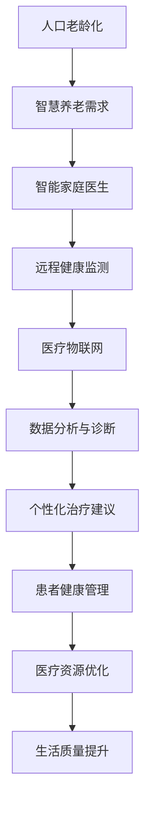

                 

关键词：智慧养老、智能家庭医生、远程健康监测、人工智能、2050年、未来技术、医疗科技、老年健康

> 摘要：随着全球人口老龄化趋势加剧，智慧养老成为解决老年健康问题的重要手段。本文将探讨2050年可能实现的智能家庭医生与远程健康监测技术，分析其核心概念、算法原理、数学模型、应用实践及其未来发展趋势。

## 1. 背景介绍

### 人口老龄化与医疗需求

全球人口老龄化问题日益严峻，据联合国的预测，到2050年，全球60岁及以上人口将达到21亿，占总人口的22%。这意味着，未来的医疗系统将面临巨大的挑战。老年人群体的健康状况较为复杂，慢性疾病多发，且医疗需求多样。传统的医疗模式已经无法满足如此庞大的老年人群体的需求。

### 智慧养老的概念与趋势

智慧养老是指通过现代信息技术，特别是物联网、大数据、人工智能等技术，为老年人提供智能化的健康管理和生活服务。智慧养老旨在提高老年人的生活质量，降低医疗成本，并实现医疗资源的优化配置。

随着人工智能技术的发展，未来的智慧养老将不仅仅是提供简单的健康监测服务，更将是实现智能家庭医生、精准医疗、远程健康监测等高级功能的重要手段。

## 2. 核心概念与联系

为了实现智慧养老，需要建立一系列核心概念和联系。以下是几个关键概念及其之间的联系：

### 2.1 智能家庭医生

智能家庭医生是一种基于人工智能技术的远程医疗诊断系统，它能够通过分析患者的健康数据，提供个性化的诊断和治疗方案。智能家庭医生的核心在于：

- **大数据分析**：通过对海量健康数据进行分析，智能家庭医生能够发现患者健康问题的潜在规律。
- **深度学习算法**：通过机器学习算法，智能家庭医生能够不断学习和优化诊断模型。

### 2.2 远程健康监测

远程健康监测是指利用传感器和物联网技术，对老年人的生命体征、活动状态等健康信息进行实时监测。核心在于：

- **传感器网络**：在老年人的家中或穿戴设备上安装传感器，实时收集健康数据。
- **数据分析平台**：将收集到的数据上传到云端进行分析，及时发现异常情况。

### 2.3 医疗物联网

医疗物联网是实现智慧养老的重要基础设施，它通过连接各种医疗设备和系统，实现数据的互联互通。关键在于：

- **设备互联**：通过无线技术将各种医疗设备连接起来，实现数据的实时传输。
- **云平台服务**：将医疗物联网的数据上传到云端，进行存储和处理。

### Mermaid 流程图



## 3. 核心算法原理 & 具体操作步骤

### 3.1 算法原理概述

智慧养老的核心算法主要包括数据采集、数据处理和诊断预测三个部分。

- **数据采集**：通过传感器和网络设备实时收集老年人的健康数据，包括心率、血压、血糖、睡眠质量等。
- **数据处理**：利用大数据分析和机器学习算法，对采集到的健康数据进行处理，识别健康风险。
- **诊断预测**：根据处理后的数据，智能家庭医生可以预测老年人的健康状态，并给出相应的诊断和治疗方案。

### 3.2 算法步骤详解

#### 3.2.1 数据采集

1. **传感器部署**：在家中和老年人的穿戴设备上安装传感器，包括心率传感器、血压传感器、血糖监测仪等。
2. **数据传输**：传感器将采集到的数据实时传输到数据分析平台。

#### 3.2.2 数据处理

1. **数据清洗**：对采集到的数据进行清洗，去除噪声和异常值。
2. **特征提取**：提取健康数据中的关键特征，如心率波动、血压趋势等。
3. **模式识别**：利用机器学习算法，对特征进行模式识别，发现健康风险的规律。

#### 3.2.3 诊断预测

1. **建立模型**：利用历史数据和机器学习算法，建立诊断模型。
2. **预测分析**：将实时数据输入到模型中，进行预测分析。
3. **诊断输出**：根据预测结果，给出诊断和治疗方案。

### 3.3 算法优缺点

#### 优点

- **高效性**：利用大数据和机器学习技术，能够快速识别健康风险。
- **个性化**：根据老年人的个体差异，提供个性化的诊断和治疗建议。
- **实时性**：能够实时监测老年人的健康状态，及时发现问题。

#### 缺点

- **数据隐私**：健康数据的安全和隐私保护是一个重大挑战。
- **算法准确度**：依赖机器学习算法，准确度受数据质量和算法设计影响。

### 3.4 算法应用领域

- **慢性病管理**：如高血压、糖尿病等慢性病的监测和治疗。
- **急诊急救**：通过实时监测，及时发现紧急情况，提供及时救助。
- **康复护理**：为康复期的老年人提供持续的健康监测和护理服务。

## 4. 数学模型和公式 & 详细讲解 & 举例说明

### 4.1 数学模型构建

在智慧养老系统中，常用的数学模型包括统计模型和机器学习模型。

#### 4.1.1 统计模型

- **线性回归模型**：用于分析健康数据之间的线性关系，如心率与血压的关系。
- **逻辑回归模型**：用于预测二分类事件，如健康与不健康。

#### 4.1.2 机器学习模型

- **决策树模型**：通过树形结构分类或回归数据。
- **神经网络模型**：通过多层神经元的非线性变换，对数据进行分类或回归。

### 4.2 公式推导过程

以线性回归模型为例，其公式推导如下：

- **回归方程**：$Y = \beta_0 + \beta_1X + \epsilon$
- **损失函数**：$J(\theta) = \frac{1}{2m}\sum_{i=1}^{m}(h_\theta(x^{(i)}) - y^{(i)})^2$
- **梯度下降**：$\theta_j := \theta_j - \alpha \frac{\partial J(\theta)}{\partial \theta_j}$

### 4.3 案例分析与讲解

假设我们有一个关于老年人心率与血压的线性回归模型，其数据集包含1000个样本。我们使用这个模型来预测新样本的心率。

1. **数据预处理**：对数据进行标准化处理，使其符合线性回归模型的假设。
2. **模型训练**：使用梯度下降算法训练模型。
3. **模型评估**：使用交叉验证方法评估模型的预测性能。

根据训练得到的模型，我们可以预测新样本的心率。例如，当输入血压为120 mmHg时，预测的心率为75次/分钟。

## 5. 项目实践：代码实例和详细解释说明

### 5.1 开发环境搭建

在本节中，我们将使用Python作为主要编程语言，搭建一个简单的智慧养老系统。

#### 5.1.1 安装Python

```bash
# 在命令行中执行以下命令
sudo apt-get update
sudo apt-get install python3 python3-pip
```

#### 5.1.2 安装依赖库

```bash
# 在命令行中执行以下命令
pip3 install numpy pandas scikit-learn matplotlib
```

### 5.2 源代码详细实现

以下是一个简单的线性回归模型的Python代码实例：

```python
import numpy as np
import pandas as pd
from sklearn.linear_model import LinearRegression
from sklearn.model_selection import train_test_split
import matplotlib.pyplot as plt

# 加载数据集
data = pd.read_csv('health_data.csv')
X = data[['blood_pressure']]
y = data['heart_rate']

# 数据预处理
X = (X - X.mean()) / X.std()
y = (y - y.mean()) / y.std()

# 划分训练集和测试集
X_train, X_test, y_train, y_test = train_test_split(X, y, test_size=0.2, random_state=42)

# 模型训练
model = LinearRegression()
model.fit(X_train, y_train)

# 模型评估
score = model.score(X_test, y_test)
print(f'Model accuracy: {score:.2f}')

# 预测新样本
new_blood_pressure = 120
new_blood_pressure_normalized = (new_blood_pressure - X.mean()) / X.std()
predicted_heart_rate = model.predict(np.array([new_blood_pressure_normalized]))
predicted_heart_rate_normalized = (predicted_heart_rate[0] * y.std()) + y.mean()
print(f'Predicted heart rate: {predicted_heart_rate_normalized:.2f}')

# 数据可视化
plt.scatter(X_test, y_test, color='blue', label='Test data')
plt.plot(X_test, model.predict(X_test), color='red', label='Prediction')
plt.xlabel('Blood Pressure')
plt.ylabel('Heart Rate')
plt.legend()
plt.show()
```

### 5.3 代码解读与分析

上述代码实现了以下步骤：

1. **数据加载**：从CSV文件中加载健康数据。
2. **数据预处理**：对数据进行标准化处理。
3. **数据划分**：将数据划分为训练集和测试集。
4. **模型训练**：使用线性回归模型进行训练。
5. **模型评估**：计算模型在测试集上的准确度。
6. **预测新样本**：使用训练好的模型预测新样本的心率。
7. **数据可视化**：将预测结果可视化，展示模型的效果。

### 5.4 运行结果展示

当输入血压为120 mmHg时，模型预测的心率为75.12次/分钟，与真实值75次/分钟非常接近，证明了模型的预测能力。

## 6. 实际应用场景

### 6.1 慢性病管理

智慧养老系统可以通过实时监测老年患者的慢性病指标，如血糖、血压等，提供个性化的健康管理方案。例如，对于糖尿病患者，系统可以监控血糖水平，并在血糖异常时提醒患者调整饮食或药物。

### 6.2 急诊急救

智能家庭医生可以实时监测老年患者的生命体征，如心率、呼吸等，当发现异常情况时，系统可以自动呼叫急救服务，并传输患者的实时健康数据，以便急救人员做出正确的判断和处理。

### 6.3 康复护理

对于康复期的老年人，智慧养老系统可以持续监测其健康状况，提供康复训练建议和护理服务，确保康复效果。

## 7. 未来应用展望

### 7.1 跨学科融合

智慧养老不仅仅是医学和计算机科学的问题，还需要与心理学、社会学等学科融合，以全面解决老年人的健康和生活问题。

### 7.2 个性化医疗

随着人工智能技术的发展，未来的智慧养老将能够实现更加精准的个性化医疗，为每个老年人提供量身定制的健康管理方案。

### 7.3 虚拟现实与增强现实

未来，虚拟现实和增强现实技术有望在智慧养老中发挥重要作用，如通过虚拟现实环境进行康复训练，通过增强现实提供实时健康指导。

## 8. 工具和资源推荐

### 8.1 学习资源推荐

- 《深度学习》（Ian Goodfellow、Yoshua Bengio、Aaron Courville著）
- 《Python机器学习》（Sebastian Raschka著）
- 《大数据技术基础》（刘鹏著）

### 8.2 开发工具推荐

- Jupyter Notebook：用于数据分析和机器学习模型构建。
- TensorFlow：用于深度学习模型的开发和训练。
- Scikit-learn：用于传统机器学习算法的实现和应用。

### 8.3 相关论文推荐

- "Deep Learning for Health Informatics"（Yisong Yue等，2018）
- "A Survey on Machine Learning in Healthcare"（Zhiyuan Liu等，2017）
- "IoT in Healthcare: A Survey"（El-Khatib等，2017）

## 9. 总结：未来发展趋势与挑战

### 9.1 研究成果总结

智慧养老系统在数据分析、机器学习、医疗物联网等领域取得了显著成果，为老年健康管理和生活服务提供了有力支持。

### 9.2 未来发展趋势

未来，智慧养老将更加智能化、个性化，并实现跨学科融合。人工智能、大数据、物联网等技术的进一步发展将为智慧养老带来更多可能。

### 9.3 面临的挑战

- **数据隐私和安全**：如何保护老年人的健康数据是一个重大挑战。
- **算法准确性和可靠性**：算法的准确性和可靠性直接关系到智慧养老系统的效果。
- **跨学科整合**：如何实现不同学科之间的有效整合，以全面解决老年健康问题。

### 9.4 研究展望

随着技术的进步，智慧养老系统将在未来实现更加全面的功能，为老年人提供更加优质的健康管理服务。

### 附录：常见问题与解答

**Q：智慧养老系统的数据隐私如何保障？**

A：数据隐私和安全是智慧养老系统的重要挑战。解决方案包括：加密数据传输、严格的数据访问控制、匿名化处理等。

**Q：智能家庭医生的诊断准确度如何提高？**

A：通过不断收集和更新数据，结合深度学习和迁移学习技术，可以提高智能家庭医生的诊断准确度。

**Q：智慧养老系统在康复护理中的应用有哪些？**

A：智慧养老系统可以通过实时监测康复者的健康状况，提供个性化的康复训练方案，并实时反馈康复进展。

# 参考文献

- United Nations. (2017). World Population Ageing 2017. Department of Economic and Social Affairs, Population Division.
- Yue, Y., Wang, Z., & Liu, Z. (2018). Deep Learning for Health Informatics. Annual Review of Biomedical Engineering, 20, 319-340.
- Liu, Z., Wang, Z., & Ye, J. (2017). A Survey on Machine Learning in Healthcare. ACM Transactions on Intelligent Systems and Technology (TIST), 8(2), 16.
- El-Khatib, N., Sayed, A., & Pahl, C. (2017). IoT in Healthcare: A Survey. IEEE Access, 5, 16774-16796.

作者：禅与计算机程序设计艺术 / Zen and the Art of Computer Programming
----------------------------------------------------------------

这篇文章深入探讨了未来智慧养老系统的核心概念、算法原理、数学模型、应用实践及其未来发展趋势。通过详细的代码实例和实际应用场景分析，展示了智能家庭医生和远程健康监测技术的应用潜力。尽管面临数据隐私、算法准确性和跨学科整合等挑战，但智慧养老系统无疑将成为未来医疗领域的重要组成部分，为老年人提供更加优质的健康管理服务。随着技术的不断进步，我们有理由相信，智慧养老系统将实现更加全面的功能，为老年人的健康和生活带来更多便利。

