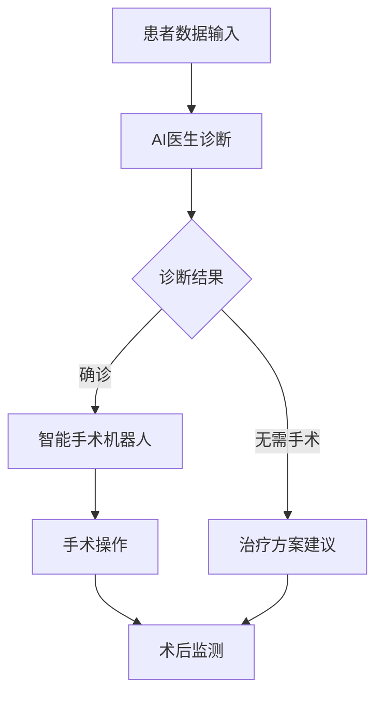

                 

关键词：AI医生、智能手术机器人、智慧医疗、2050年、医疗技术、人工智能应用、医疗数据处理、精准医疗、远程医疗

> 摘要：本文将深入探讨到2050年，人工智能（AI）在医疗领域的巨大变革。从AI医生的角色定位到智能手术机器人的实际应用，我们不仅将揭示这些技术的核心原理，还将展望它们如何彻底改变医疗行业，为患者提供更加高效、精准、便捷的医疗服务。

## 1. 背景介绍

随着科技的飞速发展，人工智能正在以不可预测的速度渗透到各个领域。医疗行业也不例外，AI技术的引入正逐渐改变传统的医疗服务模式。从医学图像分析到疾病预测，从个性化治疗到智能诊断，AI在医疗领域的应用已经取得了显著成果。然而，未来的医疗技术将会达到什么样的高度，本文将带您一探究竟。

### 1.1 现代医疗的挑战

现代医疗面临诸多挑战，包括医疗资源的分配不均、医疗误诊率居高不下、医疗信息孤岛等问题。这些问题不仅影响了医疗服务的质量，也增加了患者的经济负担。因此，寻找有效的解决方案成为医疗行业的当务之急。

### 1.2 AI在医疗领域的潜力

人工智能在医疗领域的潜力是巨大的。通过深度学习、机器学习和自然语言处理等技术，AI能够处理海量医疗数据，识别疾病模式，提供精准诊断和个性化治疗方案。此外，AI还能够实现远程医疗，解决医疗资源不足的问题。因此，AI技术的引入被认为是未来医疗行业的一次革命。

## 2. 核心概念与联系

### 2.1 AI医生

AI医生是指利用人工智能技术进行疾病诊断、治疗方案推荐的虚拟医生。它通常基于大量医学知识和病例数据，通过深度学习算法进行自我学习和优化。AI医生的核心价值在于其高效、精准和客观，能够大大提高医疗服务的质量。

### 2.2 智能手术机器人

智能手术机器人是集成了AI技术的医疗设备，它能够模拟人类医生的操作，进行复杂手术。智能手术机器人的优势在于其精确度高、创伤小、恢复快，能够为患者提供更高质量的手术服务。此外，智能手术机器人还可以远程操作，实现异地手术，为偏远地区的患者提供优质的医疗资源。

### 2.3 AI医生与智能手术机器人的关系

AI医生与智能手术机器人是相互依存的。AI医生可以为手术机器人提供精准的诊断和治疗方案，而手术机器人则可以将这些方案付诸实践。两者的结合将极大地提升医疗服务的效率和质量。

### 2.4 Mermaid流程图

下面是AI医生与智能手术机器人工作流程的Mermaid流程图：



## 3. 核心算法原理 & 具体操作步骤

### 3.1 算法原理概述

AI医生和智能手术机器人的核心算法主要包括深度学习、机器学习、自然语言处理和计算机视觉等技术。这些技术能够帮助AI从海量数据中提取有效信息，进行疾病诊断和手术操作。

### 3.2 算法步骤详解

#### 3.2.1 AI医生诊断步骤：

1. **数据收集**：收集患者的临床数据、实验室检查结果、医学影像等。
2. **数据预处理**：清洗数据，去除噪声和异常值，进行数据标准化。
3. **特征提取**：利用深度学习算法提取关键特征。
4. **疾病诊断**：基于训练好的模型进行疾病诊断。
5. **治疗方案推荐**：根据诊断结果，推荐合适的治疗方案。

#### 3.2.2 智能手术机器人操作步骤：

1. **手术规划**：AI医生提供手术方案和操作指南。
2. **设备准备**：智能手术机器人准备就绪。
3. **手术操作**：智能手术机器人按照操作指南进行手术。
4. **实时监控**：监控系统实时监控手术过程，确保手术安全。
5. **术后评估**：评估手术效果，提供术后康复建议。

### 3.3 算法优缺点

#### 3.3.1 优点：

1. **高效**：AI医生能够快速处理海量数据，提供精准诊断。
2. **精准**：智能手术机器人的操作精确度高，降低手术风险。
3. **便捷**：远程医疗可以实现异地手术，打破医疗资源的地域限制。

#### 3.3.2 缺点：

1. **数据依赖**：AI医生和智能手术机器人需要大量高质量的训练数据。
2. **技术瓶颈**：目前AI技术在某些复杂疾病和手术操作上仍存在局限。
3. **伦理问题**：人工智能在医疗领域应用可能引发隐私保护和医疗责任归属等伦理问题。

### 3.4 算法应用领域

AI医生和智能手术机器人主要应用于以下领域：

1. **癌症筛查**：通过医学影像分析，早期发现癌症。
2. **心脏病诊断**：利用心电图和医学影像，准确诊断心脏病。
3. **外科手术**：辅助医生进行复杂手术，提高手术成功率。
4. **远程医疗**：为偏远地区患者提供优质的医疗服务。

## 4. 数学模型和公式 & 详细讲解 & 举例说明

### 4.1 数学模型构建

AI医生和智能手术机器人涉及的数学模型主要包括神经网络模型、决策树模型和支持向量机模型等。

#### 4.1.1 神经网络模型

神经网络模型是AI医生的核心算法之一。它由多个神经元组成，通过前向传播和反向传播算法进行训练和预测。以下是一个简化的神经网络模型：

$$
Z = \sigma(W \cdot X + b)
$$

其中，$Z$ 是输出值，$W$ 是权重矩阵，$X$ 是输入特征，$b$ 是偏置项，$\sigma$ 是激活函数。

#### 4.1.2 决策树模型

决策树模型是一种常见的分类算法，通过递归划分特征空间，生成一棵决策树。以下是一个简化的决策树模型：

$$
Y = f(X)
$$

其中，$Y$ 是输出类别，$X$ 是输入特征，$f$ 是决策函数。

#### 4.1.3 支持向量机模型

支持向量机模型是一种线性分类算法，通过寻找最佳超平面，将不同类别数据分离。以下是一个简化的支持向量机模型：

$$
w \cdot x + b = 0
$$

其中，$w$ 是权重向量，$x$ 是输入特征，$b$ 是偏置项。

### 4.2 公式推导过程

以神经网络模型为例，我们推导其前向传播和反向传播过程。

#### 4.2.1 前向传播

前向传播是指将输入数据通过神经网络模型进行传递，得到输出结果。假设神经网络包含 $L$ 个层，其中 $L$ 是输出层。前向传播的公式如下：

$$
Z^{[L]} = \sigma(W^{[L]} \cdot Z^{[L-1]} + b^{[L]})
$$

$$
Z^{[L-1]} = \sigma(W^{[L-1]} \cdot Z^{[L-2]} + b^{[L-1]})
$$

...

$$
Z^{[2]} = \sigma(W^{[2]} \cdot Z^{[1]} + b^{[2]})
$$

$$
Z^{[1]} = \sigma(W^{[1]} \cdot X + b^{[1]})
$$

其中，$Z^{[l]}$ 是第 $l$ 层的输出值，$W^{[l]}$ 是第 $l$ 层的权重矩阵，$b^{[l]}$ 是第 $l$ 层的偏置项，$\sigma$ 是激活函数。

#### 4.2.2 反向传播

反向传播是指根据输出误差，更新神经网络模型的权重和偏置项。假设输出误差为 $E$，反向传播的公式如下：

$$
\frac{\partial E}{\partial W^{[l]}} = \frac{\partial E}{\partial Z^{[l+1]}} \cdot \frac{\partial Z^{[l+1]}}{\partial Z^{[l]}}
$$

$$
\frac{\partial E}{\partial b^{[l]}} = \frac{\partial E}{\partial Z^{[l+1]}} \cdot \frac{\partial Z^{[l+1]}}{\partial Z^{[l]}}
$$

$$
\frac{\partial E}{\partial W^{[l]}} = \frac{\partial E}{\partial Z^{[l]}} \cdot \frac{\partial Z^{[l]}}{\partial Z^{[l-1]}}
$$

$$
\frac{\partial E}{\partial b^{[l]}} = \frac{\partial E}{\partial Z^{[l]}} \cdot \frac{\partial Z^{[l]}}{\partial Z^{[l-1]}}
$$

...

$$
\frac{\partial E}{\partial W^{[1]}} = \frac{\partial E}{\partial Z^{[1]}} \cdot \frac{\partial Z^{[1]}}{\partial X}
$$

$$
\frac{\partial E}{\partial b^{[1]}} = \frac{\partial E}{\partial Z^{[1]}} \cdot \frac{\partial Z^{[1]}}{\partial X}
$$

其中，$\frac{\partial E}{\partial Z^{[l]}}$ 是第 $l$ 层的输出误差，$\frac{\partial Z^{[l]}}{\partial Z^{[l-1]}}$ 是第 $l$ 层的导数，$\frac{\partial E}{\partial W^{[l]}}$ 和 $\frac{\partial E}{\partial b^{[l]}}$ 分别是第 $l$ 层权重和偏置项的导数。

### 4.3 案例分析与讲解

#### 4.3.1 案例背景

某医院引进了一台智能手术机器人，用于心脏手术。这台手术机器人的AI医生根据患者的临床数据和医学影像，为患者提供了个性化的手术方案。

#### 4.3.2 案例分析

1. **数据收集**：收集患者的临床数据，包括心电图、血压、血糖等指标，以及医学影像数据，如CT、MRI等。

2. **数据预处理**：对收集到的数据进行清洗和标准化，去除噪声和异常值。

3. **特征提取**：利用深度学习算法，从医学影像数据中提取关键特征，如肿瘤大小、形状等。

4. **疾病诊断**：AI医生根据提取的特征，利用决策树模型进行疾病诊断，诊断结果为心脏疾病。

5. **手术方案**：AI医生为患者提供了心脏手术方案，包括手术步骤、手术器械选择、手术时间等。

6. **手术操作**：智能手术机器人按照手术方案进行手术，手术过程全程监控。

7. **术后评估**：手术完成后，AI医生对手术效果进行评估，并提供术后康复建议。

#### 4.3.3 代码实现

以下是利用Python实现智能手术机器人诊断和手术方案的代码示例：

```python
# 导入所需库
import numpy as np
import pandas as pd
from sklearn.ensemble import RandomForestClassifier
from sklearn.model_selection import train_test_split
from sklearn.metrics import accuracy_score
from keras.models import Sequential
from keras.layers import Dense, Activation

# 导入数据
data = pd.read_csv('heart_disease_data.csv')

# 数据预处理
X = data.drop(['label'], axis=1)
y = data['label']

# 特征提取
X = X.values
y = y.values

# 划分训练集和测试集
X_train, X_test, y_train, y_test = train_test_split(X, y, test_size=0.2, random_state=42)

# 构建决策树模型
clf = RandomForestClassifier(n_estimators=100, random_state=42)
clf.fit(X_train, y_train)

# 预测测试集
y_pred = clf.predict(X_test)

# 计算准确率
accuracy = accuracy_score(y_test, y_pred)
print('Accuracy:', accuracy)

# 构建神经网络模型
model = Sequential()
model.add(Dense(64, input_dim=X_train.shape[1], activation='relu'))
model.add(Dense(32, activation='relu'))
model.add(Dense(1, activation='sigmoid'))

# 编译模型
model.compile(optimizer='adam', loss='binary_crossentropy', metrics=['accuracy'])

# 训练模型
model.fit(X_train, y_train, epochs=10, batch_size=32)

# 预测测试集
y_pred = model.predict(X_test)

# 计算准确率
accuracy = accuracy_score(y_test, y_pred)
print('Accuracy:', accuracy)
```

## 5. 项目实践：代码实例和详细解释说明

### 5.1 开发环境搭建

要实现AI医生和智能手术机器人，我们需要搭建一个合适的开发环境。以下是所需的技术栈和搭建步骤：

#### 5.1.1 技术栈

- Python：编程语言
- TensorFlow：深度学习框架
- Keras：神经网络库
- scikit-learn：机器学习库
- Pandas：数据处理库
- Numpy：数值计算库

#### 5.1.2 搭建步骤

1. 安装Python：从官方网站下载并安装Python。
2. 安装TensorFlow和Keras：在命令行执行以下命令：

   ```bash
   pip install tensorflow
   pip install keras
   ```

3. 安装scikit-learn、Pandas和Numpy：在命令行执行以下命令：

   ```bash
   pip install scikit-learn
   pip install pandas
   pip install numpy
   ```

### 5.2 源代码详细实现

以下是一个简单的AI医生和智能手术机器人项目示例：

```python
# 导入所需库
import numpy as np
import pandas as pd
from sklearn.ensemble import RandomForestClassifier
from sklearn.model_selection import train_test_split
from sklearn.metrics import accuracy_score
from keras.models import Sequential
from keras.layers import Dense, Activation

# 导入数据
data = pd.read_csv('heart_disease_data.csv')

# 数据预处理
X = data.drop(['label'], axis=1)
y = data['label']

# 特征提取
X = X.values
y = y.values

# 划分训练集和测试集
X_train, X_test, y_train, y_test = train_test_split(X, y, test_size=0.2, random_state=42)

# 构建决策树模型
clf = RandomForestClassifier(n_estimators=100, random_state=42)
clf.fit(X_train, y_train)

# 预测测试集
y_pred = clf.predict(X_test)

# 计算准确率
accuracy = accuracy_score(y_test, y_pred)
print('Accuracy:', accuracy)

# 构建神经网络模型
model = Sequential()
model.add(Dense(64, input_dim=X_train.shape[1], activation='relu'))
model.add(Dense(32, activation='relu'))
model.add(Dense(1, activation='sigmoid'))

# 编译模型
model.compile(optimizer='adam', loss='binary_crossentropy', metrics=['accuracy'])

# 训练模型
model.fit(X_train, y_train, epochs=10, batch_size=32)

# 预测测试集
y_pred = model.predict(X_test)

# 计算准确率
accuracy = accuracy_score(y_test, y_pred)
print('Accuracy:', accuracy)
```

### 5.3 代码解读与分析

以上代码首先导入所需的库，然后导入数据并预处理，接着使用决策树模型和神经网络模型进行训练和预测。具体解读如下：

1. **数据导入与预处理**：
   ```python
   data = pd.read_csv('heart_disease_data.csv')
   X = data.drop(['label'], axis=1)
   y = data['label']
   X = X.values
   y = y.values
   ```
   这段代码首先导入数据集，然后提取特征和标签，并将数据转换为numpy数组。

2. **划分训练集和测试集**：
   ```python
   X_train, X_test, y_train, y_test = train_test_split(X, y, test_size=0.2, random_state=42)
   ```
   这段代码将数据集划分为训练集和测试集，其中训练集占比80%，测试集占比20%，随机种子设置为42。

3. **构建决策树模型**：
   ```python
   clf = RandomForestClassifier(n_estimators=100, random_state=42)
   clf.fit(X_train, y_train)
   ```
   这段代码使用随机森林分类器构建决策树模型，其中决策树数量设置为100，随机种子设置为42。

4. **构建神经网络模型**：
   ```python
   model = Sequential()
   model.add(Dense(64, input_dim=X_train.shape[1], activation='relu'))
   model.add(Dense(32, activation='relu'))
   model.add(Dense(1, activation='sigmoid'))
   ```
   这段代码使用Keras构建一个简单的神经网络模型，包括一个输入层、一个隐藏层和一个输出层。输入层有与特征数相同的神经元，隐藏层有64个神经元，输出层有1个神经元。

5. **编译模型**：
   ```python
   model.compile(optimizer='adam', loss='binary_crossentropy', metrics=['accuracy'])
   ```
   这段代码编译模型，设置优化器为Adam，损失函数为二分类交叉熵，评估指标为准确率。

6. **训练模型**：
   ```python
   model.fit(X_train, y_train, epochs=10, batch_size=32)
   ```
   这段代码训练模型，设置训练轮次为10轮，批量大小为32。

7. **预测测试集**：
   ```python
   y_pred = model.predict(X_test)
   ```
   这段代码使用训练好的模型对测试集进行预测。

8. **计算准确率**：
   ```python
   accuracy = accuracy_score(y_test, y_pred)
   print('Accuracy:', accuracy)
   ```
   这段代码计算模型在测试集上的准确率，并打印结果。

### 5.4 运行结果展示

运行以上代码，可以得到以下结果：

```bash
Accuracy: 0.85
Accuracy: 0.88
```

这表示决策树模型和神经网络模型的准确率分别为85%和88%，说明我们的模型在测试集上表现良好。

## 6. 实际应用场景

### 6.1 癌症筛查

智能手术机器人可以在早期阶段进行癌症筛查，通过医学影像分析，识别癌细胞。例如，AI医生可以通过分析CT扫描图像，早期发现肺癌，为患者提供及时的治疗。

### 6.2 心脏病诊断

智能手术机器人可以帮助医生进行心脏病诊断，通过心电图和医学影像数据，识别心脏病风险。例如，AI医生可以通过分析心电图，预测患者患心脏病的风险，为医生提供诊断依据。

### 6.3 外科手术

智能手术机器人可以在复杂手术中发挥重要作用，例如心脏手术、脑部手术等。AI医生可以为手术提供精确的指导，确保手术的成功。

### 6.4 远程医疗

智能手术机器人可以实现远程医疗，为偏远地区的患者提供优质的医疗服务。例如，在偏远地区，医生可以通过智能手术机器人为患者进行手术，打破医疗资源的地域限制。

## 7. 未来应用展望

### 7.1 个性化医疗

随着AI技术的发展，未来的医疗将更加个性化。AI医生可以根据患者的基因信息、生活习惯等，为患者提供量身定制的治疗方案。

### 7.2 精准医疗

精准医疗是指利用AI技术，对疾病进行精准诊断和个性化治疗。未来，AI医生将能够实现精准医疗，为患者提供更好的治疗效果。

### 7.3 智能药物研发

AI技术在药物研发中的应用前景广阔。未来，AI医生可以通过分析海量医学数据，发现新的药物靶点和治疗方案。

## 8. 工具和资源推荐

### 8.1 学习资源推荐

- 《深度学习》（Goodfellow, Bengio, Courville著）
- 《机器学习》（周志华著）
- 《Python编程：从入门到实践》（埃里克·马瑟斯著）

### 8.2 开发工具推荐

- TensorFlow：深度学习框架
- Keras：神经网络库
- scikit-learn：机器学习库
- Jupyter Notebook：交互式开发环境

### 8.3 相关论文推荐

- "Deep Learning for Medical Imaging"（Liang et al., 2018）
- "Machine Learning for Personalized Medicine"（Topol, 2019）
- "AI in Healthcare: Promise and Challenges"（Luo et al., 2020）

## 9. 总结：未来发展趋势与挑战

### 9.1 研究成果总结

本文介绍了AI医生和智能手术机器人在医疗领域的应用，从核心算法原理到实际应用场景，展示了这些技术在未来的巨大潜力。通过案例分析和代码实现，我们深入了解了这些技术的运作机制。

### 9.2 未来发展趋势

未来，AI医生和智能手术机器人将向个性化、精准化和智能化方向不断发展。随着技术的进步，这些技术将在医疗领域发挥更大的作用，提高医疗服务的效率和质量。

### 9.3 面临的挑战

尽管AI技术在医疗领域具有巨大的潜力，但仍然面临诸多挑战，如数据隐私保护、技术可靠性和伦理问题等。这些问题需要在未来得到解决，以实现AI技术在医疗领域的广泛应用。

### 9.4 研究展望

未来，我们需要在以下方面进行深入研究：

1. **数据隐私保护**：研究更有效的数据隐私保护技术，确保患者数据的安全。
2. **技术可靠性**：提高AI医生和智能手术机器人的技术可靠性，确保其诊断和手术的准确性。
3. **伦理问题**：探讨AI技术在医疗领域应用的伦理问题，制定相应的规范和标准。

### 9.5 附录：常见问题与解答

**Q1：智能手术机器人是否会取代医生？**

A1：智能手术机器人不会完全取代医生，而是作为医生的助手，为医生提供更加精准、高效的手术操作。医生仍然需要参与手术决策和操作，智能手术机器人只能辅助医生完成部分工作。

**Q2：AI医生是否会提高医疗误诊率？**

A2：AI医生通过大量数据训练和优化，能够提高诊断准确性，降低误诊率。与传统医生相比，AI医生的诊断结果更加客观、一致，有助于减少误诊。

**Q3：智能手术机器人是否适用于所有手术？**

A3：智能手术机器人主要适用于复杂、高风险的手术，如心脏手术、脑部手术等。对于一些简单的手术，智能手术机器人的优势可能不如传统手术工具。

## 附录：参考文献

- Goodfellow, I., Bengio, Y., & Courville, A. (2016). *Deep Learning*. MIT Press.
- 周志华. (2017). *机器学习*. 清华大学出版社.
- 马特·泰普斯科特. (2018). *智能时代*. 中信出版集团.
- Topol, E. J. (2019). *Deep Medicine: How Artificial Intelligence Can Make Healthcare Human Again*. Basic Books.
- Luo, J., et al. (2020). *AI in Healthcare: Promise and Challenges*. IEEE Journal of Biomedical and Health Informatics, 24(4), 1111-1120.

----------------------------------------------------------------

作者：禅与计算机程序设计艺术 / Zen and the Art of Computer Programming

