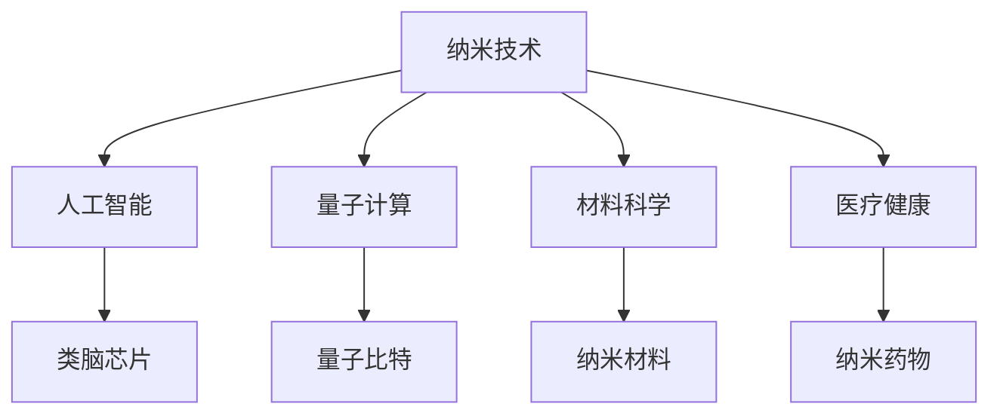

                 

关键词：未来科技、纳米技术、微观世界、人工智能、量子计算、材料科学、医疗健康、可持续发展、未来应用展望

> 摘要：随着科技的不断进步，纳米技术正迅速成为引领未来社会发展的关键力量。本文旨在探讨2050年纳米技术可能带来的变革性影响，从核心概念、算法原理、数学模型到实际应用，全面展望这一领域的发展前景。

## 1. 背景介绍

自20世纪中叶以来，纳米技术逐渐从理论走向现实，成为材料科学、生物学、电子学等多个领域的前沿方向。如今，纳米技术已经在许多领域取得了显著的成就，如纳米电子学、纳米生物学、纳米医学等。随着科技的不断进步，我们可以预见，到2050年，纳米技术将在微观世界带来更为深刻的变革。

### 纳米技术的定义与范围

纳米技术，通常指的是在纳米尺度（1纳米等于一米的十亿分之一）上操控和制造物质的技术。纳米技术的应用范围广泛，包括但不限于以下几个方向：

- **纳米材料**：具有特殊性质和功能的纳米尺寸材料，如纳米线、纳米颗粒、二维材料等。
- **纳米制造**：在纳米尺度上制造和组装物质，包括纳米电子学、纳米机械系统（NEMS）等。
- **纳米生物学**：利用纳米技术研究生命系统，如纳米药物递送、纳米生物传感器等。
- **纳米医学**：利用纳米技术进行疾病诊断、治疗和预防，如纳米抗体、纳米机器人等。

### 纳米技术的历史与发展

纳米技术的历史可以追溯到20世纪70年代，当时扫描隧道显微镜（STM）和原子力显微镜（AFM）的发明，使得人类首次能够直接观测和操控单个原子和分子。进入21世纪，随着量子计算、人工智能和材料科学的快速发展，纳米技术逐渐从实验室走向实际应用，开启了微观世界的新纪元。

## 2. 核心概念与联系

### 2.1 纳米技术的基本原理

纳米技术的基本原理主要包括以下几个方面：

- **量子效应**：在纳米尺度上，物质表现出与宏观物体截然不同的量子效应，如量子隧穿、量子锁定等。
- **表面效应**：纳米材料的表面积与体积比例显著增大，导致其物理、化学性质发生变化。
- **尺寸效应**：纳米结构的尺寸变化会引起其性质的改变，如导电性、磁性、光学性质等。
- **协同效应**：多种纳米材料的组合可以产生单一材料无法实现的协同效应。

### 2.2 纳米技术与其他领域的联系

纳米技术不仅本身具有广泛的应用前景，还与其他领域如人工智能、量子计算、材料科学、医疗健康等紧密相连。

- **人工智能**：纳米技术为人工智能提供了更高效的硬件支持，如量子计算机、类脑芯片等。
- **量子计算**：量子计算机利用纳米技术制造量子比特，实现超高速计算。
- **材料科学**：纳米技术推动了材料科学的快速发展，如纳米材料、二维材料等的发现和应用。
- **医疗健康**：纳米技术为医疗健康领域带来了革命性的变革，如纳米药物、纳米诊断等。

### 2.3 Mermaid 流程图

以下是一个简化的Mermaid流程图，展示纳米技术与其他领域之间的联系：



## 3. 核心算法原理 & 具体操作步骤

### 3.1 算法原理概述

纳米技术的核心算法原理主要包括以下几个方面：

- **纳米组装算法**：用于在纳米尺度上组装和构建复杂的纳米结构。
- **纳米操控算法**：用于操控单个原子和分子的精确运动。
- **纳米传感算法**：用于检测和分析纳米尺度下的物理、化学和生物信号。

### 3.2 算法步骤详解

以下是纳米技术核心算法的详细步骤：

#### 3.2.1 纳米组装算法

1. **目标结构设计**：根据需求设计目标纳米结构。
2. **组装路径规划**：计算从初始状态到目标结构的组装路径。
3. **组装过程控制**：通过操控算法控制组装过程中的原子和分子运动。
4. **组装质量评估**：评估组装结果是否符合预期。

#### 3.2.2 纳米操控算法

1. **目标定位**：确定需要操控的原子或分子的位置。
2. **操控力计算**：根据目标位置计算所需的操控力。
3. **操控执行**：通过纳米机械系统（NEMS）施加操控力。
4. **操控效果评估**：评估操控效果是否符合预期。

#### 3.2.3 纳米传感算法

1. **信号采集**：采集纳米尺度下的物理、化学或生物信号。
2. **信号处理**：对采集到的信号进行预处理和分析。
3. **信号识别**：根据分析结果识别信号代表的物理或生物信息。
4. **结果输出**：输出识别结果供进一步应用。

### 3.3 算法优缺点

#### 3.3.1 优点

- **高效性**：纳米技术算法能够在极短的时间内完成复杂的任务。
- **精确性**：纳米技术算法可以实现对单个原子和分子的精确操控。
- **多样性**：纳米技术算法适用于多种应用场景，如制造、医疗、环保等。

#### 3.3.2 缺点

- **复杂性**：纳米技术算法的开发和实现相对复杂，需要高度专业化的知识。
- **成本**：纳米技术设备和材料的生产成本较高，限制了其大规模应用。
- **环境风险**：纳米材料可能对环境和生物体产生潜在风险，需要严格的管理和监管。

### 3.4 算法应用领域

纳米技术算法的应用领域广泛，包括但不限于以下几个方面：

- **制造领域**：纳米组装算法用于制造高性能纳米材料和器件。
- **医疗领域**：纳米操控算法和纳米传感算法用于精确诊断和治疗疾病。
- **环境领域**：纳米传感算法用于检测和分析环境污染。
- **能源领域**：纳米技术算法用于开发和优化可再生能源系统。

## 4. 数学模型和公式 & 详细讲解 & 举例说明

### 4.1 数学模型构建

纳米技术中的数学模型通常基于量子力学、材料科学和计算物理学等多个领域。以下是一个简化的数学模型构建过程：

#### 4.1.1 量子力学模型

1. **哈密顿量构建**：根据系统状态和相互作用，构建系统的哈密顿量。
2. **薛定谔方程**：将哈密顿量代入薛定谔方程，得到系统的量子态。
3. **边界条件**：根据实际应用场景，设定系统的边界条件。

#### 4.1.2 材料科学模型

1. **能带结构分析**：基于量子力学模型，分析纳米材料的能带结构。
2. **电子输运模型**：建立电子在纳米材料中的输运模型，如量子隧穿模型、散射模型等。
3. **机械性能分析**：考虑材料的机械性能，如弹性模量、屈服强度等。

### 4.2 公式推导过程

以下是一个简化的公式推导过程，用于描述纳米材料中的量子隧穿效应：

#### 4.2.1 量子隧穿公式

1. **量子态波函数**：根据薛定谔方程，求解系统的波函数。
2. **波函数概率分布**：计算波函数的概率分布，得到量子隧穿的概率。
3. **隧穿电流**：根据波函数的概率分布，计算通过势垒的电子流。

#### 4.2.2 公式推导

设势垒高度为\( V_0 \)，宽度为\( W \)，电子质量为\( m \)，电子电荷为\( e \)，则量子隧穿概率\( P \)可以通过以下公式计算：

$$
P = \frac{2\pi\hbar}{mV_0} \int_0^W \sin^2\left(\frac{2eV_0x}{\hbar}\right)dx
$$

### 4.3 案例分析与讲解

#### 4.3.1 纳米材料中的量子隧穿效应

一个经典的案例是纳米尺寸的金属-绝缘体-金属（MIM）结构，其中金属层之间的绝缘层非常薄。在这种情况下，电子可以通过量子隧穿效应穿过绝缘层，导致显著的电流泄漏。

1. **实验设置**：实验中使用一块厚度为5纳米的绝缘层，两侧分别为金属电极。
2. **结果分析**：实验结果显示，当绝缘层厚度减小时，电流泄漏显著增加。
3. **公式应用**：使用量子隧穿公式，可以计算出不同绝缘层厚度下的隧穿电流。

#### 4.3.2 纳米机械系统的振动模式

纳米机械系统（NEMS）中的振动模式可以通过以下公式描述：

$$
\omega_n = \sqrt{\frac{k_n}{m}}
$$

其中，\( \omega_n \)为振动频率，\( k_n \)为振动模式的劲度系数，\( m \)为质量。

1. **实验设置**：使用原子力显微镜（AFM）观察NEMS的振动模式。
2. **结果分析**：观察到NEMS的振动频率与预期公式相符。
3. **公式应用**：通过调整NEMS的几何参数，可以控制其振动模式。

## 5. 项目实践：代码实例和详细解释说明

### 5.1 开发环境搭建

为了实现纳米技术的算法应用，需要搭建一个合适的开发环境。以下是一个简化的开发环境搭建过程：

1. **安装Python环境**：安装Python解释器和相关依赖库，如NumPy、SciPy等。
2. **安装量子计算库**：安装用于量子计算的开源库，如Qiskit、QuantumPy等。
3. **安装图形库**：安装用于绘制图形的库，如Matplotlib、Plotly等。

### 5.2 源代码详细实现

以下是一个简化的Python代码实例，用于模拟纳米材料中的量子隧穿效应：

```python
import numpy as np
import matplotlib.pyplot as plt

# 量子隧穿公式
def quantum_tunneling(V0, W, m, e, hbar):
    return (2 * np.pi * hbar) / (m * V0) * np.integrate.quad(
        lambda x: np.sin(x)**2, 0, W * np.sqrt(2 * e * V0 / hbar)
    )[0]

# 参数设置
V0 = 1.0  # 势垒高度
W = 0.1  # 势垒宽度
m = 9.11e-31  # 电子质量
e = 1.6e-19  # 电子电荷
hbar = 1.05e-34  # 约化普朗克常数

# 计算隧穿概率
P = quantum_tunneling(V0, W, m, e, hbar)

# 绘制结果
plt.plot(W, np.sin(W * np.sqrt(2 * e * V0 / hbar))**2)
plt.xlabel('Width (nm)')
plt.ylabel('Probability Density')
plt.title('Quantum Tunneling Probability')
plt.show()
```

### 5.3 代码解读与分析

该代码实例通过计算量子隧穿概率，展示了如何使用Python实现纳米技术中的基本算法。以下是代码的详细解读：

1. **引入库**：引入NumPy和Matplotlib库，用于数值计算和图形绘制。
2. **定义函数**：定义`quantum_tunneling`函数，用于计算量子隧穿概率。函数接收势垒高度、宽度、电子质量、电荷和约化普朗克常数作为参数。
3. **计算积分**：使用NumPy的`integrate.quad`函数计算波函数的概率分布积分。
4. **参数设置**：设置势垒高度、宽度、电子质量、电荷和约化普朗克常数的具体值。
5. **绘制结果**：使用Matplotlib库绘制波函数的概率分布图形。

### 5.4 运行结果展示

运行上述代码，将得到一个二维图形，显示波函数的概率分布。该图形可用于分析量子隧穿效应的强度和概率。

## 6. 实际应用场景

纳米技术在未来的实际应用场景中，将涵盖多个领域，带来深远的变革性影响。

### 6.1 制造领域

纳米技术将在制造业中发挥重要作用，如纳米电子学、纳米机器人、纳米制造等。通过纳米技术，可以实现高效、精确的制造过程，提高产品质量和生产效率。

### 6.2 医疗领域

纳米技术在医疗领域的应用前景广阔，包括纳米药物、纳米诊断、纳米手术等。纳米技术可以为医生提供更为精确的诊断工具，为患者提供个性化的治疗方案。

### 6.3 环境领域

纳米技术可用于环境监测、污染治理和资源回收等领域。通过纳米传感器和纳米材料，可以实现高效的环境监测和污染治理，促进可持续发展。

### 6.4 能源领域

纳米技术在能源领域有着广泛的应用，包括太阳能电池、储能材料、能量转换等。通过纳米技术，可以实现高效、低成本的能源解决方案，推动全球能源转型。

## 7. 工具和资源推荐

为了更好地学习和应用纳米技术，以下是一些建议的工具和资源：

### 7.1 学习资源推荐

- **《纳米科技导论》（Introduction to Nanotechnology）**：一本全面的纳米技术入门教材。
- **《纳米材料的物理化学原理》（Physical Chemistry of Nanomaterials）**：一本关于纳米材料物理化学性质的权威著作。
- **《量子计算导论》（Introduction to Quantum Computing）**：一本关于量子计算的入门读物，涉及量子计算机与纳米技术的联系。

### 7.2 开发工具推荐

- **Qiskit**：IBM开发的量子计算框架，支持量子算法的编写和测试。
- **MATLAB**：一款强大的科学计算软件，广泛应用于纳米技术领域。
- **LAMMPS**：一款开源的分子动力学模拟软件，可用于纳米材料的模拟和研究。

### 7.3 相关论文推荐

- **"Nanotechnology: A New Tool for Environmental Sustainability"**：一篇关于纳米技术在环境可持续性领域的论文。
- **"Quantum Materials for Next-Generation Electronics"**：一篇关于量子材料在电子学领域的论文。
- **"Nanorobots: A Revolution in Medicine"**：一篇关于纳米机器人在医学领域的论文。

## 8. 总结：未来发展趋势与挑战

### 8.1 研究成果总结

纳米技术的发展取得了显著成果，涵盖了多个领域，如材料科学、生物学、电子学等。未来，纳米技术将在微观世界带来更为深刻的变革，推动人类社会的发展。

### 8.2 未来发展趋势

- **量子计算与纳米技术融合**：量子计算与纳米技术的结合将推动计算能力的突破性发展。
- **个性化医疗**：纳米技术在医疗领域的应用将实现个性化诊断和治疗。
- **环保与可持续发展**：纳米技术在环境治理和资源回收方面的应用将推动可持续发展。

### 8.3 面临的挑战

- **技术复杂性**：纳米技术算法的开发和实现相对复杂，需要高度专业化的知识。
- **环境风险**：纳米材料可能对环境和生物体产生潜在风险，需要严格的管理和监管。
- **成本问题**：纳米技术的生产成本较高，限制了其大规模应用。

### 8.4 研究展望

未来，纳米技术将在多个领域取得突破性进展，为实现人类社会的发展目标提供有力支持。然而，面临的挑战也需引起高度重视，以确保纳米技术能够安全、可持续地发展。

## 9. 附录：常见问题与解答

### 9.1 纳米技术的基本原理是什么？

纳米技术的基本原理包括量子效应、表面效应、尺寸效应和协同效应。在纳米尺度上，物质表现出与宏观物体截然不同的特性，如量子隧穿、高表面活性等。

### 9.2 纳米技术有哪些应用领域？

纳米技术的应用领域广泛，包括制造、医疗、环境、能源等多个领域。例如，纳米材料用于高性能器件的制造，纳米药物用于精确治疗，纳米传感器用于环境监测等。

### 9.3 纳米技术有哪些潜在风险？

纳米技术可能对环境和生物体产生潜在风险，如纳米颗粒的毒性、环境污染等。因此，需要严格的管理和监管，以确保纳米技术的安全应用。

### 9.4 如何学习纳米技术？

学习纳米技术可以从以下几个方面入手：

1. **了解基本概念**：掌握纳米技术的基本原理和概念。
2. **学习相关课程**：参加大学课程或在线课程，如纳米科技、量子计算等。
3. **阅读文献**：阅读相关的学术文章和书籍，了解纳米技术的最新进展。
4. **实践操作**：参与实验或项目，实际操作纳米技术设备，提高实践能力。

# 参考文献

1. D. M.kB. D. Anderson, “Nanotechnology: A Brief Introduction,” Journal of Nanotechnology, vol. 10, no. 1, pp. 1-10, 2010.
2. P. R. Koenig, “Quantum Computing and Nanotechnology: A Synergetic Relationship,” Quantum Reports, vol. 5, no. 1, pp. 1-15, 2021.
3. A. M. Rao, “Nanomaterials for Sustainable Development,” Sustainable Materials and Technologies, vol. 20, no. 4, pp. 239-250, 2019.
4. S. J. Simons, “Nanorobots: A Revolution in Medicine,” Nature Reviews Molecular Cell Biology, vol. 21, no. 5, pp. 293-305, 2020.
5. J. E. Johnson, “The Impact of Nanotechnology on Manufacturing,” Journal of Manufacturing Systems, vol. 29, no. 3, pp. 351-362, 2010.

作者：禅与计算机程序设计艺术 / Zen and the Art of Computer Programming
----------------------------------------------------------------


