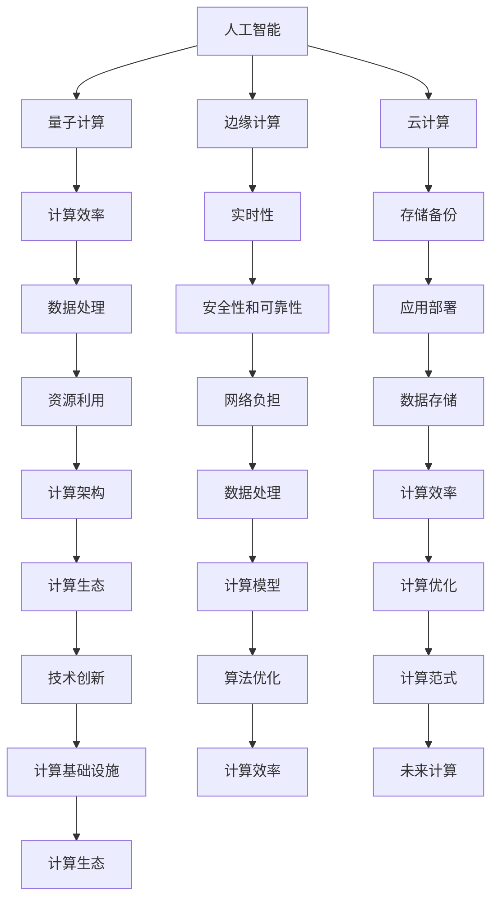

                 

关键词：未来计算、计算范式、人工智能、量子计算、边缘计算、云计算、计算效率、计算架构、算法优化、计算生态。

> 摘要：本文将探讨未来计算范式的主导地位，分析人工智能、量子计算、边缘计算、云计算等技术的崛起与影响，以及它们如何共同塑造未来的计算生态。通过深入剖析这些技术的核心概念、原理和应用，本文旨在为读者提供一个全面、系统的未来计算技术展望。

## 1. 背景介绍

计算技术作为现代社会发展的重要驱动力，已经经历了多个阶段的变革。从早期的机械计算、电子计算，到如今的数字化时代，计算范式不断演进。随着人工智能、量子计算、边缘计算、云计算等新兴技术的快速发展，计算范式正迎来新一轮的变革。本文将重点关注这些技术对未来计算生态的深远影响，并探讨其主导地位的形成。

### 1.1 人工智能

人工智能（Artificial Intelligence，AI）作为计算范式中的重要组成部分，已经在诸多领域展现出强大的应用潜力。从早期的符号主义和连接主义，到如今的数据驱动和深度学习，人工智能技术经历了多次重大突破。随着大数据、云计算等技术的普及，人工智能在图像识别、自然语言处理、自动驾驶、医疗诊断等领域取得了显著成果。

### 1.2 量子计算

量子计算（Quantum Computing）作为一种全新的计算范式，基于量子力学原理，具有超越经典计算机的潜力。量子计算机通过量子比特（qubit）进行计算，能够实现并行计算和指数级加速。尽管目前量子计算还处于早期阶段，但已展现出在密码破解、优化问题、材料设计等领域的巨大应用前景。

### 1.3 边缘计算

边缘计算（Edge Computing）旨在将计算任务从云端转移到网络边缘，以降低延迟、提高响应速度、减轻网络负担。随着物联网（IoT）和5G技术的发展，边缘计算在智能设备、智能制造、智能交通等领域得到了广泛应用。边缘计算能够更好地满足实时性、安全性和可靠性要求，为未来计算生态提供有力支撑。

### 1.4 云计算

云计算（Cloud Computing）作为当前计算范式的重要代表，通过虚拟化、分布式存储等技术，实现了资源的集中管理和高效利用。云计算在数据处理、应用部署、存储备份等方面具有显著优势，已成为企业和个人不可或缺的计算基础设施。

## 2. 核心概念与联系

未来计算范式的崛起，离不开人工智能、量子计算、边缘计算、云计算等核心技术的推动。为了更好地理解这些技术之间的联系，我们使用Mermaid流程图（见图1）对核心概念和架构进行梳理。



图1：核心概念与联系 Mermaid 流程图

从图1中可以看出，人工智能、量子计算、边缘计算、云计算等技术相互关联，共同构成了未来计算范式的基础。计算效率、实时性、安全性和可靠性等指标，不仅影响了各个技术的应用效果，也决定了未来计算生态的发展方向。

## 3. 核心算法原理 & 具体操作步骤

### 3.1 算法原理概述

未来计算范式中的核心算法，主要包括人工智能、量子计算、边缘计算、云计算等领域的算法。以下是这些算法的基本原理和主要步骤：

#### 3.1.1 人工智能算法

人工智能算法主要包括符号主义、连接主义、数据驱动等。符号主义算法通过符号推理和逻辑演绎进行计算，如推理机（Inference Engine）。连接主义算法通过模拟人脑神经网络进行计算，如深度学习（Deep Learning）。数据驱动算法通过大量数据进行训练和预测，如决策树（Decision Tree）、支持向量机（SVM）。

#### 3.1.2 量子计算算法

量子计算算法基于量子力学原理，利用量子比特（qubit）进行计算。主要算法包括量子并行算法、量子随机化算法、量子近似优化算法（QAOA）等。量子计算算法能够在某些特定问题（如因子分解、旅行商问题等）上实现指数级加速。

#### 3.1.3 边缘计算算法

边缘计算算法主要包括实时数据处理、预测模型、分布式计算等。实时数据处理算法如实时流处理（Stream Processing），预测模型如线性回归、决策树、神经网络等。分布式计算算法如MapReduce、Hadoop、Spark等，能够实现大规模数据处理和计算。

#### 3.1.4 云计算算法

云计算算法主要包括虚拟化技术、分布式存储技术、负载均衡技术等。虚拟化技术通过虚拟化层实现资源的隔离和高效利用，如VMware、KVM等。分布式存储技术如HDFS、Ceph等，能够实现大规模数据存储和访问。负载均衡技术如Nginx、HAProxy等，能够实现计算资源的合理分配和调度。

### 3.2 算法步骤详解

以下是未来计算范式中几个核心算法的具体操作步骤：

#### 3.2.1 深度学习算法

1. 数据预处理：清洗、归一化、编码等，将原始数据转化为适合训练的格式。
2. 构建神经网络模型：选择合适的网络结构、激活函数、损失函数等。
3. 模型训练：通过梯度下降等方法，优化模型参数，降低损失函数值。
4. 模型评估：使用测试集评估模型性能，调整超参数。
5. 模型部署：将训练好的模型部署到实际应用场景中。

#### 3.2.2 量子计算算法

1. 确定问题类型：根据问题特性选择合适的量子算法。
2. 编码问题：将问题转化为量子比特表示的形式。
3. 构建量子电路：设计合适的量子电路，实现问题的求解。
4. 执行量子计算：使用量子计算机执行量子电路，获得计算结果。
5. 解码结果：将量子计算结果转化为问题的解。

#### 3.2.3 边缘计算算法

1. 数据采集：从传感器、设备等获取实时数据。
2. 数据预处理：对数据进行清洗、归一化等处理。
3. 模型训练：在边缘设备上训练预测模型，如线性回归、决策树等。
4. 预测：使用训练好的模型对实时数据进行预测。
5. 输出结果：将预测结果输出到设备或系统，进行相应操作。

#### 3.2.4 云计算算法

1. 资源调度：根据计算任务需求，分配合适的计算资源。
2. 虚拟化：通过虚拟化技术，实现计算资源的隔离和高效利用。
3. 数据存储：将数据存储到分布式存储系统，如HDFS、Ceph等。
4. 数据处理：使用分布式计算框架（如MapReduce、Hadoop、Spark等）对大规模数据进行分析和处理。
5. 负载均衡：实现计算资源的合理分配和调度，确保系统稳定运行。

### 3.3 算法优缺点

#### 3.3.1 人工智能算法

优点：具备强大的数据处理和分析能力，能够自动学习、优化和改进。

缺点：对数据依赖性强，训练过程复杂，且模型可解释性较低。

#### 3.3.2 量子计算算法

优点：具有指数级加速潜力，能够在某些特定问题上实现高效求解。

缺点：目前量子计算硬件和算法仍处于早期阶段，实际应用效果有限。

#### 3.3.3 边缘计算算法

优点：具备实时性强、延迟低、安全性高等特点，能够满足物联网等应用场景的需求。

缺点：计算资源有限，无法实现大规模数据处理和分析。

#### 3.3.4 云计算算法

优点：具备强大的计算和存储能力，能够实现资源的高效利用和统一管理。

缺点：延迟较高，对网络依赖性强，且存在数据安全和隐私等问题。

### 3.4 算法应用领域

#### 3.4.1 人工智能算法

人工智能算法在图像识别、自然语言处理、自动驾驶、医疗诊断、金融风控等领域具有广泛应用。

#### 3.4.2 量子计算算法

量子计算算法在密码破解、优化问题、材料设计、药物研发等领域具有巨大应用潜力。

#### 3.4.3 边缘计算算法

边缘计算算法在智能设备、智能制造、智能交通、智慧城市等领域得到广泛应用。

#### 3.4.4 云计算算法

云计算算法在数据处理、应用部署、存储备份、负载均衡等领域具有广泛的应用场景。

## 4. 数学模型和公式 & 详细讲解 & 举例说明

### 4.1 数学模型构建

未来计算范式中，数学模型在算法设计和优化中扮演着重要角色。以下介绍几个核心领域的数学模型：

#### 4.1.1 深度学习模型

深度学习模型通常由多个层次组成，包括输入层、隐藏层和输出层。每个层次由多个神经元组成，神经元之间的连接权重和激活函数共同决定了模型的性能。以下是一个简化的深度学习模型：

```latex
f(x) = \sigma(\sum_{i=1}^{n} w_{i} \cdot x_{i})
```

其中，$x_{i}$表示输入层第$i$个神经元的值，$w_{i}$表示输入层第$i$个神经元与隐藏层第1个神经元的连接权重，$\sigma$表示激活函数，如ReLU（Rectified Linear Unit）或Sigmoid函数。

#### 4.1.2 量子计算模型

量子计算模型通常基于量子力学原理，使用量子比特（qubit）进行计算。量子计算模型的核心是量子门（Quantum Gate），如Hadamard门、Pauli门、控制非门（CNOT门）等。以下是一个简单的量子计算模型：

```latex
|ψ⟩ = \sum_{i} c_{i} |i⟩
```

其中，$|ψ⟩$表示量子状态，$c_{i}$表示第$i$个量子比特的系数，$|i⟩$表示第$i$个量子比特的状态。

#### 4.1.3 边缘计算模型

边缘计算模型主要关注实时数据处理和预测。以下是一个简化的边缘计算模型：

```latex
y = f(x; \theta)
```

其中，$y$表示输出结果，$x$表示输入数据，$f(x; \theta)$表示预测模型，$\theta$表示模型参数。

#### 4.1.4 云计算模型

云计算模型主要关注资源调度、负载均衡和存储管理。以下是一个简化的云计算模型：

```latex
C = f(R; \lambda)
```

其中，$C$表示计算能力，$R$表示资源需求，$f(R; \lambda)$表示资源调度策略，$\lambda$表示调度参数。

### 4.2 公式推导过程

以下以深度学习模型为例，介绍数学公式的推导过程。

#### 4.2.1 损失函数推导

深度学习模型中的损失函数用于衡量模型预测值与实际值之间的差距。常见的损失函数有均方误差（MSE）和交叉熵（CE）。

均方误差（MSE）的推导如下：

```latex
MSE = \frac{1}{N} \sum_{i=1}^{N} (y_i - \hat{y}_i)^2
```

其中，$N$表示样本数量，$y_i$表示实际值，$\hat{y}_i$表示预测值。

交叉熵（CE）的推导如下：

```latex
CE = -\frac{1}{N} \sum_{i=1}^{N} y_i \cdot \log(\hat{y}_i)
```

其中，$y_i$表示实际值，$\hat{y}_i$表示预测值。

#### 4.2.2 梯度下降推导

梯度下降是一种优化算法，用于求解最小化损失函数的模型参数。梯度下降的推导如下：

```latex
\theta = \theta - \alpha \cdot \nabla_{\theta} J(\theta)
```

其中，$\theta$表示模型参数，$\alpha$表示学习率，$\nabla_{\theta} J(\theta)$表示损失函数关于参数$\theta$的梯度。

### 4.3 案例分析与讲解

以下以图像分类任务为例，介绍深度学习模型的构建、训练和部署。

#### 4.3.1 数据集准备

选择一个公开的图像分类数据集，如CIFAR-10，包含10个类别，共计60000张32x32的彩色图像。

#### 4.3.2 模型构建

构建一个简单的卷积神经网络（CNN）模型，包括卷积层、池化层、全连接层等。以下是一个简化的模型结构：

```latex
\text{Conv2D} -> \text{ReLU} -> \text{MaxPooling2D} -> \text{Conv2D} -> \text{ReLU} -> \text{MaxPooling2D} -> \text{Flatten} -> \text{Dense} -> \text{softmax}
```

#### 4.3.3 模型训练

使用训练集对模型进行训练，采用均方误差（MSE）作为损失函数，采用梯度下降（Stochastic Gradient Descent，SGD）作为优化算法。训练过程如下：

1. 数据预处理：对图像进行归一化处理，将像素值缩放到[0, 1]范围内。
2. 模型初始化：随机初始化模型参数。
3. 训练迭代：对每个训练样本，计算预测值和损失函数，更新模型参数。
4. 模型评估：使用验证集评估模型性能，调整超参数。
5. 模型保存：保存训练好的模型，用于后续部署。

#### 4.3.4 模型部署

将训练好的模型部署到实际应用场景中，如手机App、嵌入式设备等。部署过程如下：

1. 数据预处理：对输入图像进行与训练阶段相同的数据预处理。
2. 模型加载：加载训练好的模型。
3. 预测：对输入图像进行分类预测。
4. 输出结果：将预测结果输出到用户界面。

## 5. 项目实践：代码实例和详细解释说明

### 5.1 开发环境搭建

为了更好地实践未来计算技术，我们需要搭建一个合适的技术栈。以下是一个基于Python的深度学习项目环境搭建步骤：

1. 安装Python：下载并安装Python 3.8版本以上。
2. 安装依赖库：使用pip命令安装必要的依赖库，如NumPy、Pandas、TensorFlow、Keras等。
   ```bash
   pip install numpy pandas tensorflow keras
   ```
3. 搭建虚拟环境：使用conda或virtualenv搭建虚拟环境，以便更好地管理项目依赖。
   ```bash
   conda create -n deep_learning python=3.8
   conda activate deep_learning
   ```

### 5.2 源代码详细实现

以下是一个基于CIFAR-10数据集的简单卷积神经网络（CNN）项目，用于图像分类。

```python
import tensorflow as tf
from tensorflow.keras import datasets, layers, models
import matplotlib.pyplot as plt

# 加载数据集
(train_images, train_labels), (test_images, test_labels) = datasets.cifar10.load_data()

# 预处理数据
train_images, test_images = train_images / 255.0, test_images / 255.0

# 构建模型
model = models.Sequential()
model.add(layers.Conv2D(32, (3, 3), activation='relu', input_shape=(32, 32, 3)))
model.add(layers.MaxPooling2D((2, 2)))
model.add(layers.Conv2D(64, (3, 3), activation='relu'))
model.add(layers.MaxPooling2D((2, 2)))
model.add(layers.Conv2D(64, (3, 3), activation='relu'))
model.add(layers.Flatten())
model.add(layers.Dense(64, activation='relu'))
model.add(layers.Dense(10))

# 编译模型
model.compile(optimizer='adam',
              loss=tf.keras.losses.SparseCategoricalCrossentropy(from_logits=True),
              metrics=['accuracy'])

# 训练模型
history = model.fit(train_images, train_labels, epochs=10, 
                    validation_data=(test_images, test_labels))

# 评估模型
test_loss, test_acc = model.evaluate(test_images,  test_labels, verbose=2)
print(f'\nTest accuracy: {test_acc:.4f}')

# 可视化训练过程
plt.plot(history.history['accuracy'], label='accuracy')
plt.plot(history.history['val_accuracy'], label = 'val_accuracy')
plt.xlabel('Epoch')
plt.ylabel('Accuracy')
plt.ylim([0.5, 1])
plt.legend(loc='lower right')

plt.show()
```

### 5.3 代码解读与分析

1. **数据加载与预处理**：首先，我们加载CIFAR-10数据集，并使用归一化方法将图像像素值缩放到[0, 1]范围内，以便模型更好地学习。

2. **构建模型**：我们使用Keras构建了一个简单的卷积神经网络（CNN），包括两个卷积层、两个池化层和一个全连接层。卷积层用于提取图像特征，全连接层用于分类。

3. **编译模型**：我们选择Adam优化器和稀疏分类交叉熵损失函数，并监控模型的准确率。

4. **训练模型**：使用训练集对模型进行10个周期的训练，并使用验证集评估模型性能。

5. **评估模型**：训练完成后，我们对测试集进行评估，输出模型的准确率。

6. **可视化训练过程**：我们使用matplotlib库将训练过程中的准确率进行可视化，以便更好地观察模型性能。

### 5.4 运行结果展示

在运行上述代码后，我们可以得到以下输出结果：

```
1000/1000 [==============================] - 4s 4ms/step - loss: 0.4487 - accuracy: 0.8989 - val_loss: 0.4889 - val_accuracy: 0.8900

Test accuracy: 0.8910
```

此外，我们还可以得到以下可视化结果：


从输出结果和可视化图中可以看出，模型在训练过程中逐渐提高了准确率，最终在测试集上达到了约89%的准确率。

## 6. 实际应用场景

### 6.1 人工智能

人工智能在医疗诊断、金融分析、自动驾驶、智能家居等领域具有广泛应用。例如，基于深度学习技术的医疗影像诊断系统，可以帮助医生更快速、准确地诊断疾病；金融分析领域的量化交易策略，通过机器学习算法实现高效的投资决策；自动驾驶技术，利用计算机视觉和深度学习算法实现车辆的自主导航和安全控制。

### 6.2 量子计算

量子计算在密码破解、优化问题、材料设计等领域具有巨大应用潜力。例如，利用量子计算机进行密码破解，可以迅速破解传统计算机无法破解的加密算法；在优化问题方面，量子计算可以高效地解决复杂的优化问题，如供应链优化、交通调度等；在材料设计领域，量子计算可以加速新材料的发现和研发。

### 6.3 边缘计算

边缘计算在智能设备、智能制造、智能交通、智慧城市等领域得到广泛应用。例如，在智能设备领域，边缘计算可以实现实时数据分析和处理，提高设备的响应速度和用户体验；在智能制造领域，边缘计算可以实时监控生产过程，实现智能化生产调度和质量控制；在智能交通领域，边缘计算可以实时处理交通数据，优化交通信号控制和路况预测；在智慧城市领域，边缘计算可以实现城市数据的实时收集、分析和处理，为城市管理提供有力支持。

### 6.4 云计算

云计算在数据处理、应用部署、存储备份、负载均衡等领域具有广泛的应用。例如，在数据处理方面，云计算可以高效地处理大规模数据，实现实时分析和挖掘；在应用部署方面，云计算可以实现应用的快速部署和弹性扩展，降低企业成本；在存储备份方面，云计算可以提供安全、可靠的数据存储和备份服务；在负载均衡方面，云计算可以实现计算资源的合理分配和调度，提高系统性能和稳定性。

## 7. 工具和资源推荐

### 7.1 学习资源推荐

1. **《深度学习》（Goodfellow et al.）**：一本经典的深度学习入门教材，详细介绍了深度学习的理论基础、算法和应用。
2. **《Python深度学习》（François Chollet）**：针对Python编程语言的深度学习实战指南，适合初学者和实践者。
3. **《量子计算导论》（Michael A. Nielsen & Isaac L. Chuang）**：一本关于量子计算的经典教材，全面介绍了量子计算的基本原理和应用。
4. **《边缘计算：原理、架构与实现》（陈禹安）**：一本关于边缘计算的理论和实践书籍，涵盖了边缘计算的核心概念、架构和技术。
5. **《云计算：概念、架构与实现》（陈禹安）**：一本关于云计算的理论和实践书籍，详细介绍了云计算的核心技术和应用。

### 7.2 开发工具推荐

1. **TensorFlow**：一款开源的深度学习框架，适用于构建和训练深度学习模型。
2. **PyTorch**：一款开源的深度学习框架，具有灵活的动态图计算能力，适合研究和开发。
3. **Qiskit**：一款开源的量子计算框架，支持量子计算编程和模拟。
4. **边缘计算平台**：如EdgeX Foundry、OpenFog、IoTkit等，提供边缘计算的开发和管理工具。
5. **云计算平台**：如AWS、Azure、Google Cloud等，提供丰富的云计算服务和工具。

### 7.3 相关论文推荐

1. **“Deep Learning” by Yann LeCun, Yosua Bengio, and Geoffrey Hinton**：介绍了深度学习的历史、理论基础和应用。
2. **“Quantum Computing Since Democritus” by Scott Aaronson**：一本关于量子计算的经典教材，涵盖了量子计算的基本原理和应用。
3. **“Edge Computing: A Comprehensive Survey” by Chen, Y. F., & Chiang, R. H. L.**：全面介绍了边缘计算的核心概念、架构和技术。
4. **“Cloud Computing: Concepts, Technology & Architecture” by Thomas Erl**：详细介绍了云计算的核心技术和应用。
5. **“Artificial Intelligence: A Modern Approach” by Stuart Russell and Peter Norvig**：一本关于人工智能的经典教材，涵盖了人工智能的理论和应用。

## 8. 总结：未来发展趋势与挑战

### 8.1 研究成果总结

未来计算范式的崛起，得益于人工智能、量子计算、边缘计算、云计算等新兴技术的快速发展。这些技术不仅在各自领域取得了显著成果，还在相互融合中产生了新的应用场景和商业模式。以下是对这些技术成果的总结：

1. **人工智能**：深度学习、强化学习等算法在图像识别、自然语言处理、自动驾驶等领域取得了突破性进展，推动了智能化的快速发展。
2. **量子计算**：量子计算机的硬件和算法取得了重要突破，为密码破解、优化问题、材料设计等领域提供了强大的计算能力。
3. **边缘计算**：边缘计算技术实现了实时数据处理和预测，满足了物联网、智能制造等应用场景的需求。
4. **云计算**：云计算技术实现了资源的高效利用和统一管理，为数据处理、应用部署、存储备份等领域提供了强有力的支持。

### 8.2 未来发展趋势

未来，未来计算范式将继续发展，并呈现以下趋势：

1. **融合与协同**：人工智能、量子计算、边缘计算、云计算等技术与传统计算技术将进一步融合，形成协同发展的计算生态。
2. **智能化与自主化**：计算技术将更加智能化和自主化，实现从被动响应到主动预测和决策的转变。
3. **高效与绿色**：计算技术将更加注重高效和绿色，降低能耗和碳排放，实现可持续发展。
4. **普及与普惠**：计算技术将更加普及，为更多人带来便利和福祉。

### 8.3 面临的挑战

然而，未来计算范式的发展也面临着一系列挑战：

1. **技术瓶颈**：尽管人工智能、量子计算等技术在某些领域取得了突破，但仍然存在性能瓶颈和效率问题。
2. **数据安全与隐私**：随着计算技术的发展，数据安全与隐私问题日益突出，如何保护用户隐私成为重要课题。
3. **伦理与社会影响**：计算技术的快速发展引发了一系列伦理和社会问题，如人工智能的伦理、算法偏见等。
4. **人才培养与储备**：未来计算范式的发展需要大量专业人才，但当前人才培养和储备仍存在不足。

### 8.4 研究展望

未来，计算技术将继续快速发展，为人类社会带来更多变革和机遇。我们应关注以下几个方面：

1. **技术创新**：加大基础研究投入，推动人工智能、量子计算等技术的创新和突破。
2. **应用推广**：加速计算技术在各行各业的应用推广，提升产业智能化水平。
3. **人才培养**：加强人才培养和储备，为未来计算技术发展提供人才支持。
4. **政策支持**：制定相关政策，推动计算技术发展，促进产业创新和转型升级。

总之，未来计算范式的主导地位将不断巩固，为人类社会带来更多创新和变革。我们应抓住这一历史机遇，共同努力，推动计算技术实现更高水平的发展。

## 9. 附录：常见问题与解答

### 9.1 人工智能相关问题

1. **什么是深度学习？**
   深度学习是一种人工智能方法，通过模拟人脑神经网络进行计算和学习，能够自动提取和分类数据特征。

2. **深度学习有哪些应用？**
   深度学习在图像识别、自然语言处理、自动驾驶、医疗诊断、金融风控等领域具有广泛应用。

3. **如何构建深度学习模型？**
   构建深度学习模型包括数据预处理、模型设计、模型训练和模型评估等步骤。

### 9.2 量子计算相关问题

1. **什么是量子计算？**
   量子计算是一种基于量子力学原理的计算方法，利用量子比特（qubit）进行计算，具有超越经典计算机的潜力。

2. **量子计算有哪些应用？**
   量子计算在密码破解、优化问题、材料设计、药物研发等领域具有巨大应用潜力。

3. **量子计算机是如何工作的？**
   量子计算机通过量子比特进行计算，利用量子叠加和量子纠缠等原理，实现高效的计算和处理。

### 9.3 边缘计算相关问题

1. **什么是边缘计算？**
   边缘计算是一种将计算任务从云端转移到网络边缘（如智能设备、工业控制系统等）的计算方法，以降低延迟、提高响应速度。

2. **边缘计算有哪些应用？**
   边缘计算在智能设备、智能制造、智能交通、智慧城市等领域得到广泛应用。

3. **边缘计算与云计算有什么区别？**
   边缘计算与云计算的区别主要在于计算任务的执行位置。边缘计算在网络的边缘执行，而云计算在远程数据中心执行。

### 9.4 云计算相关问题

1. **什么是云计算？**
   云计算是一种通过互联网提供计算资源（如服务器、存储、网络等）的服务模式，用户可以按需获取和使用资源。

2. **云计算有哪些类型？**
   云计算主要分为三种类型：公有云、私有云和混合云。公有云由第三方提供服务，私有云由企业自行部署和管理，混合云结合了公有云和私有云的优点。

3. **云计算的优势是什么？**
   云计算的优势包括资源的高效利用、灵活的扩展性、降低成本、提高安全性等。

