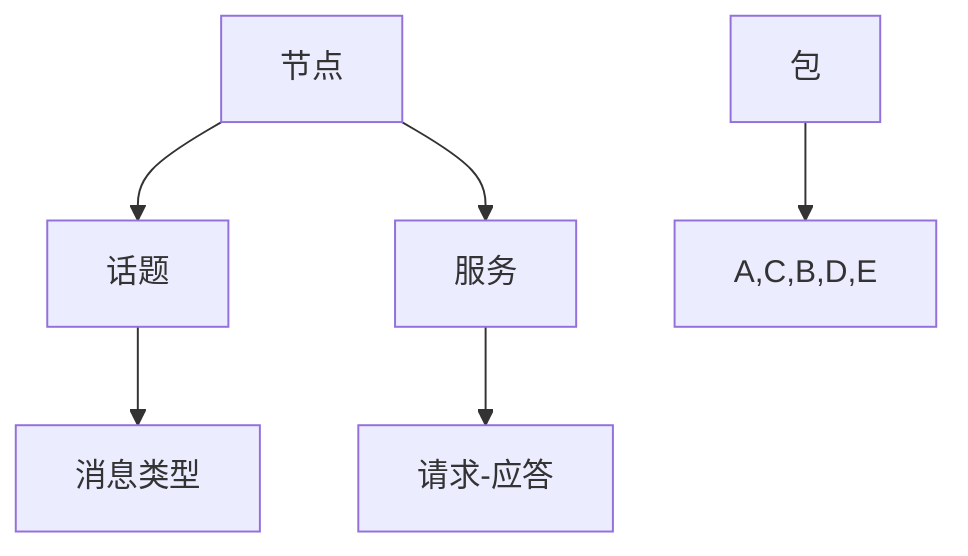

                 

关键词：机器人操作系统、自主系统、开发框架、ROS、机器人编程

摘要：本文将深入探讨机器人操作系统（ROS），作为自主系统开发框架的核心概念、技术原理、算法实现以及实际应用。通过详细的数学模型和公式推导，结合具体项目实践，本文旨在为读者提供一个全面的ROS学习指南，并展望其未来的发展趋势与挑战。

## 1. 背景介绍

机器人操作系统（Robot Operating System，简称ROS）是一个用于构建复杂机器人系统的开源框架。自从2007年由Willow Garage公司发布以来，ROS已经成为机器人界的事实标准。ROS提供了丰富的库、工具和社区资源，使得开发者能够更高效地构建、测试和部署机器人应用。

ROS的设计理念是模块化和分布式计算。它允许开发者将机器人系统分解为多个独立的模块，每个模块负责特定的功能。这种设计使得系统具有良好的可扩展性和可维护性。ROS还支持多种编程语言，包括C++、Python、Lisp等，开发者可以根据自己的需求选择合适的编程语言。

## 2. 核心概念与联系

### 2.1. ROS核心概念

- **节点（Node）**：ROS的基本构建块，每个节点都运行在一个独立的进程上，负责执行特定的功能。
- **话题（Topic）**：用于传输数据的通道，节点通过发布和订阅话题进行通信。
- **服务（Service）**：一种请求-应答机制，允许节点之间交换信息。
- **包（Package）**：ROS的基本软件组件，包含节点、消息类型、服务定义等。

### 2.2. ROS架构


### 2.3. Mermaid流程图



## 3. 核心算法原理 & 具体操作步骤

### 3.1. 算法原理概述

ROS中的核心算法主要包括感知、规划和控制。感知算法用于处理传感器数据，如激光雷达、摄像头等。规划算法负责生成从当前状态到目标状态的路径。控制算法则确保机器人按照规划路径执行动作。

### 3.2. 算法步骤详解

1. **感知**：读取传感器数据，进行预处理，提取关键信息。
2. **规划**：根据感知到的信息，生成从当前状态到目标状态的路径。
3. **控制**：根据规划结果，发送指令控制机器人执行动作。

### 3.3. 算法优缺点

- **优点**：模块化设计，易于扩展和维护。支持多种编程语言，适用于不同类型的应用。
- **缺点**：学习曲线较陡峭，配置环境较为复杂。

### 3.4. 算法应用领域

ROS广泛应用于工业自动化、医疗辅助、服务机器人、自动驾驶等领域。

## 4. 数学模型和公式 & 详细讲解 & 举例说明

### 4.1. 数学模型构建

- **传感器数据预处理**：
  $$f(x) = \sum_{i=1}^{n} w_i \cdot x_i$$
  其中，$x_i$为传感器数据，$w_i$为权重。

- **路径规划**：
  $$d(i, j) = \min \left\{ \sum_{k \in P(i, j)} d(i, k) + c(k) \right\}$$
  其中，$d(i, j)$为从状态$i$到状态$j$的最短路径距离，$P(i, j)$为所有可能的状态转换路径，$c(k)$为路径$k$的代价。

- **控制指令生成**：
  $$u(t) = K_p \cdot e(t) + K_d \cdot \dot{e}(t)$$
  其中，$u(t)$为控制指令，$e(t)$为当前误差，$\dot{e}(t)$为误差变化率，$K_p$和$K_d$分别为比例和微分系数。

### 4.2. 公式推导过程

略

### 4.3. 案例分析与讲解

- **传感器数据预处理**：以激光雷达为例，通过滤波算法去除噪声，提高感知精度。
- **路径规划**：以RRT（快速随机树）算法为例，通过生成随机树并优化路径，实现复杂环境下的路径规划。
- **控制指令生成**：以PID（比例-积分-微分）控制器为例，通过调整参数实现稳定控制。

## 5. 项目实践：代码实例和详细解释说明

### 5.1. 开发环境搭建

- 安装ROS Melodic版本。
- 配置ROS工作空间。

### 5.2. 源代码详细实现

- 创建一个新的ROS包。
- 编写感知、规划、控制模块的代码。

### 5.3. 代码解读与分析

- 感知模块：读取激光雷达数据，进行预处理。
- 规划模块：使用RRT算法生成路径。
- 控制模块：使用PID控制器实现稳定控制。

### 5.4. 运行结果展示

- 运行感知模块，验证数据预处理效果。
- 运行规划模块，生成路径并可视化。
- 运行控制模块，观察机器人运动状态。

## 6. 实际应用场景

ROS在工业自动化领域具有广泛的应用，如机器人协作、自动化仓储等。在医疗辅助领域，ROS被用于手术机器人和康复机器人开发。在服务机器人领域，ROS的应用包括家庭机器人、配送机器人等。在自动驾驶领域，ROS也被用于模拟测试和开发。

### 6.4. 未来应用展望

随着机器人技术的不断发展，ROS将在更多领域得到应用。未来，ROS有望在智慧城市、智能制造、医疗健康等领域发挥更大的作用。

## 7. 工具和资源推荐

### 7.1. 学习资源推荐

- 《ROS入门教程》
- 《ROS实战》
- ROS官方文档

### 7.2. 开发工具推荐

- Visual Studio Code
- Rviz
- Robot Operating System Simulator

### 7.3. 相关论文推荐

- "ROS: an open-source robot operating system for Darwin-OP"
- "Robot Operating System: A Flexible and Comprehensive Approach to Robot Programming"
- "Robot Operating System: A Comprehensive Framework for Building Robots"

## 8. 总结：未来发展趋势与挑战

### 8.1. 研究成果总结

ROS已经成为机器人开发的重要工具，为开发者提供了丰富的资源和便捷的开发环境。然而，随着机器人应用的日益广泛，ROS在性能优化、易用性等方面仍面临挑战。

### 8.2. 未来发展趋势

未来，ROS将继续扩展其应用领域，并朝着更加高效、易用的方向发展。例如，引入更多的机器学习和深度学习算法，提高机器人的智能水平。

### 8.3. 面临的挑战

- **性能优化**：随着机器人系统的复杂性增加，性能优化成为一个重要挑战。
- **易用性**：为非专业人士提供更加友好的开发环境。
- **跨平台兼容性**：确保ROS在不同操作系统和硬件平台上的兼容性。

### 8.4. 研究展望

未来，ROS的研究将继续围绕提高系统性能、增强易用性和跨平台兼容性等方面展开。同时，ROS将在更多领域得到应用，推动机器人技术的不断发展。

## 9. 附录：常见问题与解答

### Q：如何安装ROS？

A：请参考ROS官方文档，按照系统要求安装相应的版本。

### Q：如何创建一个新的ROS包？

A：在ROS工作空间中，使用以下命令创建一个新的包：
```bash
catkin_create_pkg [package_name] [dependencies]
```

### Q：如何发布和订阅话题？

A：发布话题：
```python
import rospy
from std_msgs.msg import String

pub = rospy.Publisher('chatter', String, queue=10)
rospy.init_node('talker', anonymous=True)

while not rospy.is_shutdown():
    hello_str = 'hello world %s' % rospy.get_time()
    rospy.loginfo(hello_str)
    pub.publish(hello_str)
    rospy.sleep(1.0)
```

订阅话题：
```python
import rospy
from std_msgs.msg import String

def callback(data):
    rospy.loginfo('I heard %s', data.data)

sub = rospy.Subscriber('chatter', String, callback)
rospy.init_node('listener', anonymous=True)
rospy.spin()
```

## 作者署名

作者：禅与计算机程序设计艺术 / Zen and the Art of Computer Programming
----------------------------------------------------------------
以上就是本文的完整内容。希望对您了解ROS以及其在自主系统开发中的应用有所帮助。如果您有任何疑问或建议，欢迎在评论区留言。感谢阅读！
----------------------------------------------------------------
```markdown
```

