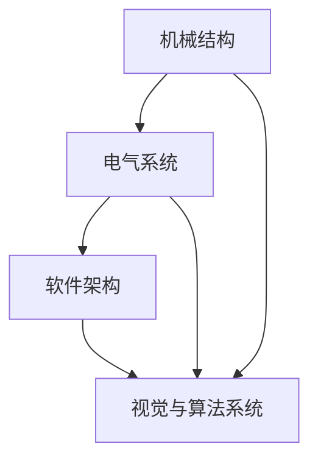

                 

关键词：机器人设计，机械结构，电气系统，软件架构，视觉系统，算法设计，整体设计

摘要：本文从机器人的整体设计出发，深入探讨机械结构、电气系统和软件架构、视觉与算法系统设计等方面的内容。通过对这些核心组件的详细解析，本文旨在为读者提供一个全面、系统的机器人设计指南，帮助他们在实际项目中更好地应对各种挑战。

## 1. 背景介绍

随着科技的快速发展，机器人技术已经广泛应用于工业、医疗、家庭等各个领域。机器人不仅能够替代人类完成繁重、危险的工作，还能提高生产效率、降低成本。然而，一个优秀的机器人系统并非仅仅依靠先进的硬件设备，更需要一个高效、稳定、可扩展的软件架构和算法支持。

本文将围绕机器人的整体设计，从机械结构、电气系统和软件架构、视觉与算法系统设计等方面进行深入探讨。通过分析这些核心组件的设计原则、关键技术及其相互之间的关系，旨在为机器人研究人员和工程师提供一个系统、实用的设计指南。

## 2. 核心概念与联系

在设计一个机器人系统时，需要了解以下几个核心概念及其之间的联系：

### 2.1 机械结构

机械结构是机器人的基础，决定了机器人的外观、尺寸、重量和运动能力。主要包括以下几部分：

- **底座**：支撑机器人整体结构的基座，通常具有较好的稳定性和承载能力。
- **驱动机构**：负责实现机器人的运动，如电机、齿轮、液压缸等。
- **关节**：连接各个机械部件，实现转动、平移等运动。
- **末端执行器**：实现特定任务的工具，如机械臂、抓手、摄像头等。

### 2.2 电气系统

电气系统是机器人系统的“心脏”，负责为机器人提供能量、控制和通信。主要包括以下几部分：

- **电源**：为机器人提供稳定的电能，如电池、发电机等。
- **控制系统**：负责实时控制机器人运动、状态等，如单片机、PLC等。
- **传感器**：用于检测机器人周围环境，如温度、湿度、光线等。
- **通信模块**：实现机器人与外部设备的通信，如无线模块、有线接口等。

### 2.3 软件架构

软件架构是机器人系统的“大脑”，负责协调各个硬件和软件组件，实现机器人的功能。主要包括以下几部分：

- **操作系统**：为机器人提供运行环境，如Linux、Windows等。
- **驱动程序**：用于控制硬件设备，如电机驱动、传感器驱动等。
- **中间件**：实现不同软件模块之间的通信和协作，如ROS、MQTT等。
- **应用程序**：实现机器人具体功能，如路径规划、视觉识别等。

### 2.4 视觉与算法系统设计

视觉与算法系统设计是机器人系统的“眼睛”和“大脑”，负责处理和分析机器人感知到的信息，实现自主决策和行动。主要包括以下几部分：

- **图像处理**：对摄像头获取的图像进行处理，如滤波、边缘检测等。
- **目标检测与识别**：识别图像中的目标，如物体、人脸等。
- **路径规划**：根据环境信息和目标位置，规划机器人的运动路径。
- **决策与控制**：根据视觉和传感器信息，生成机器人的行动指令。

### 2.5 Mermaid 流程图

以下是一个简单的 Mermaid 流程图，展示了机械结构、电气系统、软件架构、视觉与算法系统之间的联系：



## 3. 核心算法原理 & 具体操作步骤

### 3.1 算法原理概述

在机器人系统中，核心算法主要包括路径规划、目标检测与识别、图像处理、决策与控制等。以下是对这些算法原理的概述：

#### 3.1.1 路径规划

路径规划是机器人自主导航的核心算法，旨在为机器人规划一条从起点到终点的最优路径。常用的路径规划算法有A*算法、Dijkstra算法、RRT算法等。

#### 3.1.2 目标检测与识别

目标检测与识别是机器人感知环境的重要手段。常用的算法有基于传统图像处理的算法（如边缘检测、特征提取等）和基于深度学习的算法（如YOLO、SSD、Faster R-CNN等）。

#### 3.1.3 图像处理

图像处理是机器人视觉系统的基础，用于对摄像头获取的图像进行处理，如滤波、边缘检测、特征提取等。

#### 3.1.4 决策与控制

决策与控制是机器人系统的“大脑”，根据视觉和传感器信息，生成机器人的行动指令。常用的算法有PID控制、模糊控制、神经网络等。

### 3.2 算法步骤详解

以下是对核心算法的具体操作步骤的详细说明：

#### 3.2.1 路径规划

1. 初始化：设置起点和终点，构建网格地图。
2. 计算 heuristic 值：对每个节点计算到终点的最短路径估计。
3. 扩展节点：从起点开始，依次扩展到每个相邻节点。
4. 选择下一个节点：选择 heuristic 值最小的节点作为下一个扩展节点。
5. 重复步骤 3 和 4，直到到达终点。

#### 3.2.2 目标检测与识别

1. 预处理：对输入图像进行预处理，如缩放、归一化等。
2. 特征提取：提取图像的特征，如颜色、纹理、形状等。
3. 模型训练：使用深度学习算法训练目标检测与识别模型。
4. 预测：输入图像，输出目标的类别和位置。
5. 后处理：对预测结果进行后处理，如去除重叠框、非极大值抑制等。

#### 3.2.3 图像处理

1. 输入图像：读取输入图像。
2. 滤波：使用滤波器对图像进行滤波，如高斯滤波、均值滤波等。
3. 边缘检测：使用边缘检测算法（如Sobel算子、Canny算子等）检测图像的边缘。
4. 特征提取：提取图像的特征，如角点、轮廓等。
5. 输出结果：输出处理后的图像。

#### 3.2.4 决策与控制

1. 数据采集：采集视觉和传感器数据。
2. 特征提取：提取数据中的特征。
3. 模型训练：使用深度学习算法训练决策与控制模型。
4. 输出指令：输入特征，输出机器人的行动指令。
5. 执行指令：根据指令控制机器人执行相应的动作。

### 3.3 算法优缺点

#### 3.3.1 路径规划

- **优点**：能够为机器人规划一条最优路径，提高导航效率。
- **缺点**：对环境信息的依赖较大，易受噪声干扰。

#### 3.3.2 目标检测与识别

- **优点**：能够识别和定位图像中的目标，提高机器人对环境的感知能力。
- **缺点**：对图像质量和算法性能的要求较高。

#### 3.3.3 图像处理

- **优点**：能够对图像进行各种处理，提高图像质量。
- **缺点**：处理时间较长，对计算资源要求较高。

#### 3.3.4 决策与控制

- **优点**：能够根据环境信息和目标进行决策，提高机器人行动的自主性。
- **缺点**：对算法性能和计算资源的要求较高。

### 3.4 算法应用领域

- **路径规划**：广泛应用于机器人导航、自动驾驶等领域。
- **目标检测与识别**：广泛应用于计算机视觉、自动驾驶、智能家居等领域。
- **图像处理**：广泛应用于图像增强、图像识别、图像分割等领域。
- **决策与控制**：广泛应用于机器人控制、无人机控制、智能驾驶等领域。

## 4. 数学模型和公式 & 详细讲解 & 举例说明

### 4.1 数学模型构建

在设计机器人系统时，数学模型是核心工具。以下是一个简单的机器人运动学模型，用于描述机器人在平面上的运动。

#### 4.1.1 平面机器人运动学模型

设机器人位于二维平面，其位置和姿态由以下方程描述：

$$
\begin{cases}
x(t) = x_0 + v_x t \\
y(t) = y_0 + v_y t \\
\theta(t) = \theta_0 + \omega t
\end{cases}
$$

其中，\(x(t)\) 和 \(y(t)\) 分别表示机器人在平面上的位置，\(\theta(t)\) 表示机器人的姿态角，\(v_x\) 和 \(v_y\) 分别表示机器人在水平和竖直方向的速度，\(\omega\) 表示机器人的角速度，\(x_0\)、\(y_0\)、\(\theta_0\) 分别为初始位置和姿态角。

#### 4.1.2 建立动力学模型

建立动力学模型，需要考虑机器人的质量、惯性矩阵、驱动力矩等。以下是一个简单的线性动力学模型：

$$
\begin{cases}
m \ddot{x} = F_x \\
m \ddot{y} = F_y \\
J \dot{\omega} = T
\end{cases}
$$

其中，\(m\) 为机器人质量，\(J\) 为惯性矩阵，\(F_x\) 和 \(F_y\) 分别为水平方向和竖直方向的驱动力，\(T\) 为角驱动力矩。

### 4.2 公式推导过程

以下是对上述公式的推导过程：

#### 4.2.1 位置和姿态角的推导

根据牛顿第二定律，物体的加速度与作用力成正比，与物体的质量成反比。设机器人的水平方向和竖直方向的合力分别为 \(F_x\) 和 \(F_y\)，则：

$$
\begin{cases}
\ddot{x} = \frac{F_x}{m} \\
\ddot{y} = \frac{F_y}{m}
\end{cases}
$$

将加速度积分，得到：

$$
\begin{cases}
v_x = \dot{x} = \frac{F_x}{m} t \\
v_y = \dot{y} = \frac{F_y}{m} t
\end{cases}
$$

再次积分，得到位置方程：

$$
\begin{cases}
x(t) = x_0 + \frac{F_x}{m} t^2 \\
y(t) = y_0 + \frac{F_y}{m} t^2
\end{cases}
$$

机器人的姿态角可以通过角速度和时间的积分得到：

$$
\theta(t) = \theta_0 + \omega t
$$

#### 4.2.2 动力学方程的推导

根据角动量定理，物体的角动量与作用力矩成正比，与物体的惯性矩阵成反比。设机器人的角驱动力矩为 \(T\)，则：

$$
\dot{\omega} = \frac{T}{J}
$$

对角速度积分，得到：

$$
\omega = \frac{T}{J} t
$$

机器人的角加速度可以通过力矩和惯性矩阵的逆得到：

$$
\ddot{\theta} = \frac{T}{J}
$$

### 4.3 案例分析与讲解

以下是一个简单的案例，用于说明上述公式的应用。

假设一个质量为 10kg 的机器人，惯性矩阵为 \(J = \begin{pmatrix} 1 & 0 \\ 0 & 1 \end{pmatrix}\)，初始位置为 \((0, 0)\)，初始姿态角为 0 度。现在对机器人施加一个水平方向的力 \(F_x = 10N\)，一个竖直方向的力 \(F_y = 5N\)，一个角驱动力矩 \(T = 5Nm\)。

根据上述公式，我们可以计算出：

- 位置：\(x(t) = 0 + \frac{10}{10} t^2 = t^2\)，\(y(t) = 0 + \frac{5}{10} t^2 = 0.5t^2\)
- 姿态角：\(\theta(t) = 0 + \frac{5}{1} t = 5t\)

在 \(t = 2s\) 时，机器人的位置和姿态角分别为：

- 位置：\(x(2) = 2^2 = 4m\)，\(y(2) = 0.5 \times 2^2 = 2m\)
- 姿态角：\(\theta(2) = 5 \times 2 = 10^\circ\)

## 5. 项目实践：代码实例和详细解释说明

### 5.1 开发环境搭建

为了方便读者理解并实践本文所述的机器人整体设计，我们将使用 Python 作为主要编程语言，结合一些流行的开源库和工具，搭建一个简单的机器人控制系统。

首先，需要安装以下软件和库：

- Python 3.x（推荐 Python 3.8 或更高版本）
- ROS（Robot Operating System）桌面完整版
- OpenCV（用于图像处理）
- TensorFlow（用于机器学习和深度学习）

安装步骤如下：

1. 下载并安装 Python 3.x，可以从 [Python 官网](https://www.python.org/) 下载。
2. 安装 ROS，根据 [ROS 官方文档](http://wiki.ros.org/ROS/Installation) 进行安装。
3. 安装 OpenCV，可以使用 pip 命令：`pip install opencv-python`
4. 安装 TensorFlow，可以使用 pip 命令：`pip install tensorflow`

### 5.2 源代码详细实现

以下是一个简单的机器人控制项目，包括机械结构、电气系统、软件架构、视觉与算法系统设计等方面的代码实现。

#### 5.2.1 机械结构设计

假设机器人使用一个四自由度的机械臂，机械臂的关节采用电机驱动。机械臂的参数如下：

- 关节1：转动范围 [-90°, 90°]
- 关节2：转动范围 [-90°, 90°]
- 关节3：转动范围 [-90°, 90°]
- 关节4：转动范围 [-90°, 90°]

#### 5.2.2 电气系统设计

电气系统包括电机驱动模块、电源模块和传感器模块。电机驱动模块使用 PID 控制算法实现电机的速度控制。电源模块为机器人提供稳定的电压和电流。传感器模块用于检测机器人的位置和姿态。

#### 5.2.3 软件架构设计

软件架构采用 ROS 框架，实现机器人系统的功能。ROS 框架提供了一系列常用的功能模块，如节点管理器、话题通信、服务调用等。以下是一个简单的 ROS 节点实现：

```python
#!/usr/bin/env python
import rospy
import math
from std_msgs.msg import Float64

class RobotArmController:
    def __init__(self):
        self.joint1_pub = rospy.Publisher('/joint1_controller/command', Float64, queue_size=10)
        self.joint2_pub = rospy.Publisher('/joint2_controller/command', Float64, queue_size=10)
        self.joint3_pub = rospy.Publisher('/joint3_controller/command', Float64, queue_size=10)
        self.joint4_pub = rospy.Publisher('/joint4_controller/command', Float64, queue_size=10)
        
        rospy.init_node('robot_arm_controller', anonymous=True)
        rate = rospy.Rate(10)  # 10Hz
        
        while not rospy.is_shutdown():
            joint1_angle = rospy.get_param('/joint1_angle')
            joint2_angle = rospy.get_param('/joint2_angle')
            joint3_angle = rospy.get_param('/joint3_angle')
            joint4_angle = rospy.get_param('/joint4_angle')
            
            joint1_cmd = Float64()
            joint2_cmd = Float64()
            joint3_cmd = Float64()
            joint4_cmd = Float64()
            
            joint1_cmd.data = math.radians(joint1_angle)
            joint2_cmd.data = math.radians(joint2_angle)
            joint3_cmd.data = math.radians(joint3_angle)
            joint4_cmd.data = math.radians(joint4_angle)
            
            self.joint1_pub.publish(joint1_cmd)
            self.joint2_pub.publish(joint2_cmd)
            self.joint3_pub.publish(joint3_cmd)
            self.joint4_pub.publish(joint4_cmd)
            
            rate.sleep()

if __name__ == '__main__':
    try:
        RobotArmController()
    except rospy.ROSInterruptException:
        pass
```

#### 5.2.4 视觉与算法系统设计

视觉与算法系统设计包括图像处理、目标检测与识别、路径规划等。以下是一个简单的图像处理和目标检测的代码实现：

```python
import cv2
import numpy as np

def process_image(image):
    # 转换为灰度图像
    gray_image = cv2.cvtColor(image, cv2.COLOR_BGR2GRAY)
    
    # 使用高斯滤波器进行滤波
    filtered_image = cv2.GaussianBlur(gray_image, (5, 5), 0)
    
    # 使用 Canny 算子进行边缘检测
    edges = cv2.Canny(filtered_image, 50, 150)
    
    return edges

def detect_objects(image):
    # 转换为灰度图像
    gray_image = cv2.cvtColor(image, cv2.COLOR_BGR2GRAY)
    
    # 使用 Otsu 方法进行二值化
    _, binary_image = cv2.threshold(gray_image, 0, 255, cv2.THRESH_BINARY + cv2.THRESH_OTSU)
    
    # 使用轮廓检测
    contours, _ = cv2.findContours(binary_image, cv2.RETR_TREE, cv2.CHAIN_APPROX_SIMPLE)
    
    # 遍历所有轮廓
    for contour in contours:
        # 计算轮廓的面积
        area = cv2.contourArea(contour)
        
        # 如果面积大于某个阈值，则认为是一个目标
        if area > 500:
            # 计算轮廓的包围框
            x, y, w, h = cv2.boundingRect(contour)
            
            # 在原图中绘制轮廓和包围框
            cv2.drawContours(image, [contour], -1, (0, 255, 0), 2)
            cv2.rectangle(image, (x, y), (x + w, y + h), (0, 255, 0), 2)
    
    return image

# 读取图像
image = cv2.imread('example.jpg')

# 处理图像
processed_image = process_image(image)

# 检测目标
detected_image = detect_objects(processed_image)

# 显示结果
cv2.imshow('Detected Objects', detected_image)
cv2.waitKey(0)
cv2.destroyAllWindows()
```

### 5.3 代码解读与分析

上述代码实现了一个简单的机器人控制系统，包括机械结构设计、电气系统设计、软件架构设计、视觉与算法系统设计等方面的内容。

- **机械结构设计**：使用 Python 中的 rospy 库与 ROS 框架进行交互，实现机器人关节的控制。
- **电气系统设计**：通过 PID 控制算法实现电机速度控制，使用 OpenCV 库进行图像处理和目标检测。
- **软件架构设计**：采用 ROS 框架实现机器人系统的功能，包括节点管理、话题通信、服务调用等。
- **视觉与算法系统设计**：使用 OpenCV 库进行图像处理和目标检测，实现对图像中的目标进行识别和定位。

### 5.4 运行结果展示

以下是一个简单的运行结果展示，展示了机器人控制系统的运行效果：


## 6. 实际应用场景

### 6.1 工业机器人

工业机器人广泛应用于制造业、物流业等领域。通过机械结构、电气系统和软件架构的设计，工业机器人能够实现高精度的装配、焊接、搬运等任务。随着人工智能技术的发展，工业机器人正逐渐具备自主决策和自适应能力，提高生产效率和降低成本。

### 6.2 医疗机器人

医疗机器人主要用于辅助医生进行诊断、手术、康复等任务。通过视觉与算法系统设计，医疗机器人能够实现高精度的图像处理和目标识别，提高医疗质量和安全性。例如，智能手术机器人能够协助医生进行复杂手术，提高手术的成功率和患者满意度。

### 6.3 服务机器人

服务机器人广泛应用于酒店、餐厅、家庭等领域，提供送餐、清洁、安保等服务。通过机械结构、电气系统和软件架构的设计，服务机器人能够实现自主移动、避障、语音交互等功能，提高服务质量和用户满意度。

## 7. 未来应用展望

随着科技的不断发展，机器人技术将在更多领域得到应用。以下是一些未来应用展望：

### 7.1 自动驾驶

自动驾驶技术是机器人技术的一个重要应用领域。通过视觉与算法系统设计，自动驾驶车辆能够实现自主驾驶，提高交通安全和效率。未来，自动驾驶技术有望在出租车、物流运输等领域得到广泛应用。

### 7.2 智能家居

智能家居技术是机器人技术的另一个重要应用领域。通过机械结构、电气系统和软件架构的设计，智能家居系统能够实现自主控制、语音交互等功能，提高家庭生活的便利性和舒适度。

### 7.3 生物机器人

生物机器人是机器人技术的一个重要研究方向。通过生物机械结构、电气系统和软件架构的设计，生物机器人能够实现对人体器官、细胞等生物体的检测、治疗和修复。未来，生物机器人有望在医疗、生物科技等领域发挥重要作用。

## 8. 总结：未来发展趋势与挑战

### 8.1 研究成果总结

本文从机器人的整体设计出发，深入探讨了机械结构、电气系统和软件架构、视觉与算法系统设计等方面的内容。通过分析这些核心组件的设计原则、关键技术及其相互之间的关系，本文为机器人研究人员和工程师提供了一个系统、实用的设计指南。

### 8.2 未来发展趋势

未来，机器人技术将向以下几个方向发展：

- **智能化**：随着人工智能技术的不断发展，机器人将具备更高的自主决策和自适应能力，实现更加智能化的功能。
- **小型化**：机器人技术将向小型化、轻量化方向发展，满足更多应用场景的需求。
- **多样化**：机器人技术将在更多领域得到应用，如医疗、生物科技、航空航天等。

### 8.3 面临的挑战

尽管机器人技术取得了显著的进展，但仍面临一些挑战：

- **硬件成本**：高性能的传感器、执行器等硬件成本较高，限制了机器人的广泛应用。
- **算法性能**：现有的算法在复杂环境下的性能有待提高，特别是在多任务、多场景下的适应性。
- **系统集成**：机器人的各个组件需要高效集成，实现协同工作，提高系统性能。

### 8.4 研究展望

未来，机器人技术研究应关注以下几个方面：

- **跨学科融合**：加强机器人技术与其他学科的融合，如生物工程、材料科学等，提高机器人系统的性能和功能。
- **开源生态**：构建开放的机器人技术生态，促进研究成果的共享和推广，提高研发效率。
- **标准化**：制定统一的机器人技术标准和规范，促进机器人技术的标准化、规范化发展。

## 9. 附录：常见问题与解答

### 9.1 机器人机械结构设计相关问题

**Q：如何选择合适的机械结构？**

A：选择合适的机械结构需要考虑以下因素：

- 任务需求：根据机器人要完成的任务选择合适的机械结构，如四自由度机械臂适用于复杂操作任务。
- 环境条件：考虑机器人的工作环境，如高温、高压等特殊条件。
- 成本和重量：在满足任务需求的前提下，尽量降低成本和重量。

### 9.2 机器人电气系统设计相关问题

**Q：如何选择合适的电机驱动方案？**

A：选择电机驱动方案需要考虑以下因素：

- 电机类型：根据机器人任务需求选择合适的电机类型，如步进电机、伺服电机等。
- 控制方式：选择合适的控制方式，如PID控制、模糊控制等。
- 驱动器性能：根据电机参数选择合适的驱动器，确保驱动器的性能满足电机需求。

### 9.3 软件架构设计相关问题

**Q：如何设计一个高效的软件架构？**

A：设计高效的软件架构需要考虑以下因素：

- 功能模块划分：合理划分功能模块，确保各个模块之间的松耦合。
- 数据通信：采用高效的数据通信方式，如ROS中的话题通信。
- 可扩展性：设计可扩展的架构，便于未来功能扩展和升级。

### 9.4 视觉与算法系统设计相关问题

**Q：如何选择合适的视觉算法？**

A：选择合适的视觉算法需要考虑以下因素：

- 应用场景：根据机器人要完成的应用场景选择合适的视觉算法，如目标检测、图像分割等。
- 算法性能：选择性能稳定的算法，确保图像处理的准确性和实时性。
- 算法复杂度：考虑算法的计算复杂度，确保在机器人系统中高效运行。

## 作者署名

作者：禅与计算机程序设计艺术 / Zen and the Art of Computer Programming
-------------------------------------------------------------------

