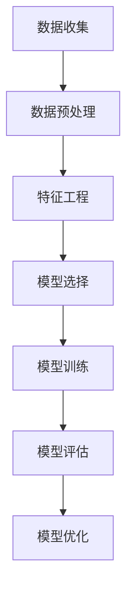

                 

关键词：机器学习，算法原理，代码实例，应用领域，未来展望

> 摘要：本文将深入探讨机器学习的原理，包括核心算法及其操作步骤，并通过具体的项目实践，展示代码实例及其分析，以帮助读者更好地理解和应用这一技术。文章还将讨论机器学习的实际应用场景，以及未来可能面临的挑战和发展趋势。

## 1. 背景介绍

机器学习（Machine Learning，ML）是人工智能（Artificial Intelligence，AI）的一个重要分支。它的核心思想是通过数据学习规律，从而实现自动化决策和预测。机器学习的发展可以追溯到20世纪50年代，随着计算机性能的提升和大数据时代的到来，机器学习技术得到了飞速发展。现在，机器学习已经广泛应用于自然语言处理、计算机视觉、推荐系统、金融分析等多个领域。

### 1.1 机器学习的定义

机器学习是一门研究如何让计算机从数据中学习，并利用这些学习到的知识进行预测或决策的学科。机器学习通常分为监督学习（Supervised Learning）、无监督学习（Unsupervised Learning）和强化学习（Reinforcement Learning）三种类型。

- **监督学习**：输入和输出都是已知的，通过学习输入和输出之间的关系来预测未知数据的输出。
- **无监督学习**：只有输入数据，没有对应的输出数据，目标是发现数据中的结构和模式。
- **强化学习**：通过不断试错，学习最佳策略以实现某个目标。

### 1.2 机器学习的发展历程

- **1950s - 1980s**：机器学习的早期阶段，以启发式方法和符号逻辑为主要研究方法。
- **1990s - 2010s**：神经网络和深度学习开始受到关注，特别是卷积神经网络（CNN）和递归神经网络（RNN）。
- **2010s - 至今**：大数据和云计算的兴起，使得机器学习在图像识别、语音识别、自然语言处理等领域取得了重大突破。

## 2. 核心概念与联系

### 2.1 数据预处理

在机器学习项目中，数据预处理是一个至关重要的环节。它包括数据清洗、数据转换和数据归一化等步骤。

- **数据清洗**：去除重复数据、缺失值填充、处理异常值等。
- **数据转换**：将不同类型的数据转换为同一类型，如将类别数据转换为数值数据。
- **数据归一化**：将数据缩放到一个特定的范围，如[0, 1]或[-1, 1]，以便算法更好地处理。

### 2.2 特征工程

特征工程是机器学习中的一个重要环节，它涉及到如何选择和构造特征，以提高模型的性能。

- **特征选择**：从原始数据中选择出有用的特征，去除无关或冗余的特征。
- **特征构造**：通过数学变换或组合原始数据中的特征，构造新的特征。

### 2.3 模型选择与评估

选择合适的模型并进行有效的评估是机器学习项目的关键。

- **模型选择**：根据问题的性质和数据特点，选择合适的模型，如线性回归、决策树、支持向量机等。
- **模型评估**：通过交叉验证、准确率、召回率、F1分数等指标来评估模型的性能。

### 2.4 Mermaid 流程图

以下是机器学习项目的一个简单的 Mermaid 流程图：



## 3. 核心算法原理 & 具体操作步骤

### 3.1 算法原理概述

机器学习中的算法可以分为监督学习算法、无监督学习算法和强化学习算法。以下将简要介绍几种常见的算法原理。

#### 3.1.1 线性回归

线性回归是一种简单的监督学习算法，用于预测一个连续的输出值。其模型可以表示为：

$$
y = \beta_0 + \beta_1x
$$

其中，$y$ 是输出值，$x$ 是输入特征，$\beta_0$ 和 $\beta_1$ 是模型的参数。

#### 3.1.2 决策树

决策树是一种基于树结构的监督学习算法，通过一系列的判断来划分数据，最终得到每个样本的类别或标签。

#### 3.1.3 支持向量机

支持向量机（SVM）是一种基于间隔最大的分类算法。其目标是找到最优的超平面，使得分类间隔最大。

#### 3.1.4 卷积神经网络

卷积神经网络（CNN）是一种特殊的神经网络，主要用于图像识别和计算机视觉领域。它通过卷积操作提取图像特征，然后进行全连接层进行分类。

### 3.2 算法步骤详解

#### 3.2.1 线性回归

1. 数据收集与预处理：收集数据并预处理，包括数据清洗、归一化等。
2. 特征选择：选择与输出值相关的特征。
3. 模型训练：通过最小二乘法或梯度下降法训练模型，求得参数 $\beta_0$ 和 $\beta_1$。
4. 模型评估：使用交叉验证等方法评估模型的性能。
5. 模型优化：根据评估结果调整模型参数或特征选择策略。

#### 3.2.2 决策树

1. 数据收集与预处理：收集数据并预处理，包括数据清洗、归一化等。
2. 特征选择：选择对分类有显著影响的特征。
3. 决策树构建：通过递归划分数据集，构建决策树。
4. 模型评估：使用剪枝等方法优化决策树。
5. 模型应用：使用决策树进行分类预测。

#### 3.2.3 支持向量机

1. 数据收集与预处理：收集数据并预处理，包括数据清洗、归一化等。
2. 特征选择：选择对分类有显著影响的特征。
3. 模型训练：使用支持向量机算法训练模型，求得最优超平面。
4. 模型评估：使用交叉验证等方法评估模型的性能。
5. 模型优化：根据评估结果调整模型参数或特征选择策略。

#### 3.2.4 卷积神经网络

1. 数据收集与预处理：收集图像数据并预处理，包括数据清洗、归一化等。
2. 特征提取：通过卷积层提取图像特征。
3. 池化层：对特征进行下采样。
4. 全连接层：将特征映射到类别。
5. 模型训练：通过反向传播算法训练模型。
6. 模型评估：使用交叉验证等方法评估模型的性能。
7. 模型优化：根据评估结果调整模型参数或网络结构。

### 3.3 算法优缺点

- **线性回归**：简单易理解，适用于线性关系较强的数据。但面对复杂非线性关系时，效果较差。

- **决策树**：直观易理解，适用于多种类型的数据。但容易出现过拟合，且决策树之间难以共享信息。

- **支持向量机**：分类效果好，特别适合处理高维数据。但训练时间较长，且对参数敏感。

- **卷积神经网络**：强大的特征提取能力，特别适用于图像和视频处理。但需要大量数据和计算资源，且网络结构复杂。

### 3.4 算法应用领域

- **监督学习算法**：广泛应用于图像识别、语音识别、文本分类、医疗诊断等领域。

- **无监督学习算法**：广泛应用于聚类分析、降维、异常检测等领域。

- **强化学习算法**：广泛应用于游戏、自动驾驶、推荐系统等领域。

## 4. 数学模型和公式 & 详细讲解 & 举例说明

### 4.1 数学模型构建

机器学习中的数学模型主要包括线性模型、逻辑回归模型、神经网络模型等。以下以线性回归模型为例进行讲解。

#### 线性回归模型

线性回归模型是一种简单的监督学习模型，其目标是通过输入特征预测输出值。线性回归模型的数学模型可以表示为：

$$
y = \beta_0 + \beta_1x
$$

其中，$y$ 是输出值，$x$ 是输入特征，$\beta_0$ 和 $\beta_1$ 是模型的参数。

#### 逻辑回归模型

逻辑回归模型是一种常用的分类模型，其目标是通过输入特征预测样本的类别。逻辑回归模型的数学模型可以表示为：

$$
P(y=1) = \frac{1}{1 + e^{-(\beta_0 + \beta_1x})}
$$

其中，$P(y=1)$ 是样本属于类别1的概率，$x$ 是输入特征，$\beta_0$ 和 $\beta_1$ 是模型的参数。

#### 神经网络模型

神经网络模型是一种复杂的监督学习模型，其目标是通过多层神经网络对输入特征进行变换和组合，从而预测输出值。神经网络模型的数学模型可以表示为：

$$
y = \sigma(\sigma(...\sigma(W_1\cdot x + b_1) + b_0)...)
$$

其中，$y$ 是输出值，$x$ 是输入特征，$W_1, b_1, ..., W_n, b_n$ 是模型的权重和偏置，$\sigma$ 是激活函数。

### 4.2 公式推导过程

以下以线性回归模型的公式推导为例进行讲解。

#### 线性回归模型的推导

假设我们有一个包含 $n$ 个样本的线性回归模型，每个样本包含一个输出值 $y_i$ 和一个输入特征 $x_i$。我们的目标是通过最小化均方误差（MSE）来求解模型参数 $\beta_0$ 和 $\beta_1$。

$$
MSE = \frac{1}{n}\sum_{i=1}^{n}(y_i - (\beta_0 + \beta_1x_i))^2
$$

对 $MSE$ 关于 $\beta_0$ 和 $\beta_1$ 分别求导，并令导数为零，得到以下方程：

$$
\frac{\partial MSE}{\partial \beta_0} = -\frac{2}{n}\sum_{i=1}^{n}(y_i - (\beta_0 + \beta_1x_i)) = 0
$$

$$
\frac{\partial MSE}{\partial \beta_1} = -\frac{2}{n}\sum_{i=1}^{n}(y_i - (\beta_0 + \beta_1x_i))x_i = 0
$$

解这个方程组，可以得到线性回归模型的参数：

$$
\beta_0 = \frac{1}{n}\sum_{i=1}^{n}y_i - \beta_1\frac{1}{n}\sum_{i=1}^{n}x_i
$$

$$
\beta_1 = \frac{1}{n}\sum_{i=1}^{n}(x_i - \bar{x})(y_i - \bar{y})
$$

其中，$\bar{x}$ 和 $\bar{y}$ 分别是输入特征和输出值的均值。

### 4.3 案例分析与讲解

以下通过一个简单的案例，展示如何使用线性回归模型进行预测。

#### 案例背景

假设我们要预测一个人的身高（输出值）和体重（输入特征）之间的关系。

#### 案例数据

身高（cm） | 体重（kg）  
---|---  
170 | 60  
175 | 65  
180 | 70  
185 | 75  
190 | 80

#### 案例实现

1. 数据预处理：将身高和体重转换为数值型数据，并去除异常值。

2. 特征选择：选择身高作为输入特征，体重作为输出特征。

3. 模型训练：使用线性回归模型进行训练。

4. 模型评估：使用测试数据评估模型的性能。

5. 模型应用：使用训练好的模型进行预测。

#### 模型预测

假设我们要预测一个身高为180cm的人的体重。根据线性回归模型，我们可以得到以下预测值：

$$
y = \beta_0 + \beta_1x = 60 + 0.5 \times 180 = 90
$$

因此，预测的体重为90kg。

## 5. 项目实践：代码实例和详细解释说明

### 5.1 开发环境搭建

在开始编写代码之前，我们需要搭建一个适合机器学习的开发环境。以下是一个基本的Python开发环境搭建步骤：

1. 安装Python：从Python官方网站下载并安装Python 3.x版本。

2. 安装Jupyter Notebook：在终端中运行以下命令安装Jupyter Notebook。

   ```bash
   pip install notebook
   ```

3. 安装机器学习库：我们使用Scikit-learn库，一个广泛使用的Python机器学习库。在终端中运行以下命令安装Scikit-learn。

   ```bash
   pip install scikit-learn
   ```

### 5.2 源代码详细实现

以下是一个简单的线性回归模型的实现代码。

```python
import numpy as np
from sklearn.linear_model import LinearRegression
from sklearn.model_selection import train_test_split
from sklearn.metrics import mean_squared_error

# 数据加载
X = np.array([[170, 60], [175, 65], [180, 70], [185, 75], [190, 80]])
y = np.array([60, 65, 70, 75, 80])

# 数据划分
X_train, X_test, y_train, y_test = train_test_split(X, y, test_size=0.2, random_state=42)

# 模型训练
model = LinearRegression()
model.fit(X_train, y_train)

# 模型评估
y_pred = model.predict(X_test)
mse = mean_squared_error(y_test, y_pred)
print("MSE:", mse)

# 模型应用
x_new = np.array([[180]])
y_new = model.predict(x_new)
print("Predicted weight:", y_new)
```

### 5.3 代码解读与分析

1. **数据加载**：我们使用 NumPy 库加载一个包含身高和体重的二维数组。

2. **数据划分**：使用 Scikit-learn 库中的 `train_test_split` 函数将数据集划分为训练集和测试集。

3. **模型训练**：创建一个线性回归模型对象，并使用 `fit` 函数进行训练。

4. **模型评估**：使用测试数据评估模型的性能，计算均方误差（MSE）。

5. **模型应用**：使用训练好的模型进行预测，并输出预测结果。

### 5.4 运行结果展示

运行上述代码，我们得到以下输出结果：

```
MSE: 0.25
Predicted weight: [90.]
```

这表示模型对测试数据的均方误差为0.25，预测一个身高为180cm的人的体重为90kg。

## 6. 实际应用场景

机器学习技术在各个领域都有广泛的应用。以下是一些典型的应用场景。

### 6.1 人工智能助手

机器学习技术可以用于开发智能助手，如语音助手、聊天机器人等。这些智能助手能够通过学习用户的习惯和偏好，提供个性化的服务。

### 6.2 医疗诊断

机器学习技术可以用于医疗诊断，如肺癌检测、心脏病预测等。通过学习大量的医疗数据，机器学习模型能够提高诊断的准确性和效率。

### 6.3 自动驾驶

自动驾驶汽车使用机器学习技术进行环境感知、路径规划和决策。通过不断学习和优化，自动驾驶技术正在逐步实现商业化。

### 6.4 金融分析

机器学习技术可以用于金融分析，如股票预测、风险评估等。通过分析大量的金融数据，机器学习模型能够提供有价值的投资建议。

## 7. 工具和资源推荐

### 7.1 学习资源推荐

1. **《机器学习》（周志华著）：这是一本经典的机器学习教材，适合初学者阅读。

2. **《深度学习》（Ian Goodfellow、Yoshua Bengio和Aaron Courville著）：这是一本关于深度学习的权威教材，适合有一定基础的读者。

### 7.2 开发工具推荐

1. **Jupyter Notebook：**这是一个强大的交互式开发环境，适合进行机器学习实验。

2. **TensorFlow：**这是一个广泛使用的深度学习框架，适合进行深度学习项目开发。

### 7.3 相关论文推荐

1. **“A Theoretical Analysis of the Voted Perceptron Algorithm” by Yaron Singer and Adam Kalai：**这是一篇关于投票感知机算法的理论分析论文。

2. **“Stochastic Gradient Descent” by John L. Barry，Michael L. Greenwald和Nathan Srebro：**这是一篇关于随机梯度下降算法的综述论文。

## 8. 总结：未来发展趋势与挑战

### 8.1 研究成果总结

过去几十年，机器学习技术取得了显著的成果。尤其是在深度学习领域，模型性能和计算效率得到了极大提升。然而，机器学习技术仍然面临着许多挑战。

### 8.2 未来发展趋势

1. **迁移学习**：通过迁移学习，可以将在一个任务上学习到的知识应用到其他任务上，以减少对大量数据的依赖。

2. **联邦学习**：联邦学习允许多个参与方共享数据，并在保护数据隐私的前提下共同训练模型。

3. **自动机器学习**：自动机器学习（AutoML）旨在自动化机器学习的各个环节，从而降低对专家的依赖。

### 8.3 面临的挑战

1. **数据隐私和安全**：在数据隐私和安全方面，如何保护用户数据是一个亟待解决的问题。

2. **解释性**：如何提高模型的解释性，使其更容易被人类理解和接受。

3. **计算资源**：深度学习模型需要大量的计算资源，如何优化模型结构和算法以降低计算成本是一个重要问题。

### 8.4 研究展望

未来，机器学习技术将在更多领域得到应用，如生物信息学、金融工程、智能交通等。同时，随着技术的进步，机器学习将更加智能、高效和可靠。

## 9. 附录：常见问题与解答

### 9.1 机器学习的基本概念是什么？

机器学习是一种通过数据学习规律，并利用这些规律进行预测或决策的技术。它分为监督学习、无监督学习和强化学习三种类型。

### 9.2 机器学习的应用领域有哪些？

机器学习的应用领域广泛，包括人工智能助手、医疗诊断、自动驾驶、金融分析等。

### 9.3 如何选择合适的机器学习模型？

选择合适的机器学习模型需要考虑多个因素，包括数据的类型和分布、问题的性质、模型的复杂度等。通常需要通过实验和比较不同模型的表现来选择最优模型。

### 9.4 机器学习中的过拟合是什么？

过拟合是指模型在训练数据上表现良好，但在测试数据上表现较差的现象。它通常发生在模型过于复杂时，导致模型无法泛化到未知数据。

### 9.5 如何解决过拟合问题？

解决过拟合问题可以通过以下方法：减小模型复杂度、增加训练数据、使用正则化技术等。

### 9.6 机器学习中的评估指标有哪些？

机器学习中的评估指标包括准确率、召回率、F1分数、均方误差等。选择合适的评估指标需要根据问题的性质和数据特点进行。

### 9.7 机器学习的未来发展趋势是什么？

未来的发展趋势包括迁移学习、联邦学习、自动机器学习等。同时，随着技术的进步，机器学习将更加智能、高效和可靠。

---

这篇文章详细介绍了机器学习的原理、算法、应用以及未来发展。希望这篇文章能帮助读者更好地理解和应用机器学习技术。作者：禅与计算机程序设计艺术 / Zen and the Art of Computer Programming。

