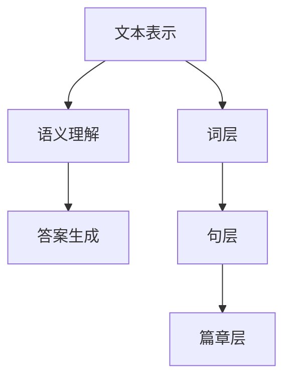

                 

关键词：机器阅读理解、自然语言处理、深度学习、语义分析、文本挖掘

> 摘要：本文旨在探讨机器阅读理解技术的最新进展，从浅层到深层语义分析的各个方面进行深入分析。通过回顾现有的阅读理解模型，解析其核心算法原理和数学模型，以及通过实际的项目实践，展示这些技术在实际应用中的效果和潜力。

## 1. 背景介绍

机器阅读理解（Machine Reading Comprehension，MRC）是自然语言处理（Natural Language Processing，NLP）领域的一个重要分支。随着互联网信息的爆炸式增长，如何从海量文本数据中快速、准确地获取所需信息，成为了一个亟待解决的问题。传统的信息检索技术由于受限于关键词匹配和统计模型，往往无法准确理解文本的语义内容。因此，机器阅读理解技术的研究显得尤为重要。

机器阅读理解的任务主要包括两个部分：一是理解文本内容，二是回答问题。理解文本内容意味着模型需要捕捉文本中的词汇、句子结构和语义信息，而回答问题则需要将理解到的内容应用于具体的问答场景。目前，机器阅读理解技术主要基于深度学习框架，如神经网络和卷积神经网络（CNN），以及更先进的变压器模型（Transformer）等。

## 2. 核心概念与联系

### 2.1. 机器阅读理解的概念

机器阅读理解是指让计算机能够理解、处理和回答关于文本的问题。它包含了三个主要环节：文本表示、语义理解和答案生成。

- **文本表示**：将自然语言文本转化为计算机可以处理的形式，如词向量、句子嵌入等。
- **语义理解**：对文本进行深层次的理解，包括词汇语义、句子语义和篇章语义等。
- **答案生成**：根据问题的要求和文本的语义理解，生成合理的答案。

### 2.2. 机器阅读理解的架构

机器阅读理解的架构可以分为三个层次：词层、句层和篇章层。

- **词层**：包括词向量模型和词嵌入技术，如 Word2Vec 和 GloVe。
- **句层**：使用深度学习模型（如 RNN、LSTM、BERT）对句子进行编码，捕捉句子的语义信息。
- **篇章层**：将多个句子整合成一个语义连贯的文本表示，通过篇章级别的模型（如 Transformer）进行分析。

### 2.3. Mermaid 流程图



## 3. 核心算法原理 & 具体操作步骤

### 3.1. 算法原理概述

机器阅读理解的核心算法主要基于深度学习，特别是基于注意力机制的变压器（Transformer）模型。Transformer 模型通过自注意力机制（Self-Attention）和多头注意力（Multi-Head Attention）技术，能够捕捉长距离依赖和上下文信息，从而实现对文本的深层次理解。

### 3.2. 算法步骤详解

#### 3.2.1. 数据预处理

- **文本清洗**：去除文本中的无关符号、停用词和标点符号。
- **词嵌入**：将词汇转化为词向量，如使用 Word2Vec 或 GloVe 模型。
- **序列编码**：将处理后的文本序列编码为固定长度的向量。

#### 3.2.2. 模型训练

- **自注意力机制**：通过计算文本序列中每个词对其他词的影响程度，生成表示文本上下文关系的权重。
- **多头注意力**：将自注意力机制扩展到多个头，每个头关注不同的上下文信息。
- **损失函数**：使用交叉熵损失函数（Cross-Entropy Loss）对模型进行训练。

#### 3.2.3. 答案生成

- **文本编码**：将问题和文本编码为向量。
- **语义匹配**：计算问题和文本之间的匹配度。
- **答案提取**：从文本中提取与问题最匹配的答案。

### 3.3. 算法优缺点

#### 优点：

- **强大的语义理解能力**：通过自注意力机制和多头注意力技术，能够捕捉长距离依赖和上下文信息。
- **适应性强**：Transformer 模型具有高度的可扩展性，可以应用于不同的阅读理解任务。

#### 缺点：

- **计算复杂度高**：Transformer 模型需要进行大量的矩阵运算，计算复杂度较高。
- **对数据需求量大**：由于模型的深度和宽度较大，需要大量的训练数据来保证模型的性能。

### 3.4. 算法应用领域

机器阅读理解技术广泛应用于多个领域，包括：

- **问答系统**：如智能客服、智能助手等。
- **文本挖掘**：如情感分析、文本分类等。
- **信息检索**：如搜索引擎、信息抽取等。

## 4. 数学模型和公式 & 详细讲解 & 举例说明

### 4.1. 数学模型构建

机器阅读理解的数学模型主要包括文本表示、语义理解、答案生成等部分。以下是几个关键数学模型：

#### 文本表示

- **词向量**：\( \textbf{v}_i = \text{word2vec}(\text{word}_i) \)
- **句子表示**：\( \textbf{s} = \text{CNN}(\textbf{v}_1, \textbf{v}_2, ..., \textbf{v}_n) \)

#### 语义理解

- **自注意力权重**：\( a_{ij} = \text{softmax}(\text{Q} \cdot \text{K}_i) \)
- **多头注意力**：\( \textbf{h}_{ij} = \sum_{k=1}^{h} a_{ij}^k \textbf{K}_i \)

#### 答案生成

- **语义匹配**：\( \text{score} = \text{softmax}(\textbf{q} \cdot \textbf{s}) \)
- **答案提取**：\( \text{answer} = \arg\max_{i} \text{score}_i \)

### 4.2. 公式推导过程

#### 文本表示

- **卷积神经网络（CNN）**：
$$
\textbf{s} = \text{ReLU}(\text{Conv}(\textbf{v} \cdot \textbf{W}_1) + \textbf{b}_1)
$$

#### 语义理解

- **自注意力机制**：
$$
\textbf{Q} = \textbf{K} = \textbf{V} = \text{Linear}(\textbf{v})
$$
$$
\textbf{h}_{ij} = \text{softmax}(\text{Q} \cdot \text{K}_i)
$$

#### 答案生成

- **交叉熵损失函数**：
$$
\text{loss} = -\sum_{i} \text{label}_i \log \text{score}_i
$$

### 4.3. 案例分析与讲解

假设我们有一个简单的阅读理解任务，需要回答以下问题：“这个周末的天气如何？”

#### 文本表示

- 文本：“这个周末的天气非常晴朗，气温在 20°C 到 30°C 之间。”
- 词向量：\( \textbf{v}_1, \textbf{v}_2, ..., \textbf{v}_n \)
- 句子表示：\( \textbf{s} = \text{CNN}(\textbf{v}_1, \textbf{v}_2, ..., \textbf{v}_n) \)

#### 语义理解

- **自注意力权重**：
$$
a_{ij} = \text{softmax}(\text{Q} \cdot \text{K}_i)
$$
其中，\( \text{Q}, \text{K}_i \) 是句子表示。

- **多头注意力**：
$$
\textbf{h}_{ij} = \sum_{k=1}^{h} a_{ij}^k \textbf{K}_i
$$
其中，\( h \) 是头数。

#### 答案生成

- **语义匹配**：
$$
\text{score} = \text{softmax}(\textbf{q} \cdot \textbf{s})
$$
其中，\( \text{q} \) 是问题的表示。

- **答案提取**：
$$
\text{answer} = \arg\max_{i} \text{score}_i
$$
根据答案提取规则，找到与问题最匹配的词或短语。

## 5. 项目实践：代码实例和详细解释说明

### 5.1. 开发环境搭建

- **环境要求**：Python 3.7 或更高版本，TensorFlow 2.0 或更高版本。
- **安装依赖**：
```python
pip install tensorflow numpy matplotlib
```

### 5.2. 源代码详细实现

以下是实现机器阅读理解项目的基本代码框架：

```python
import tensorflow as tf
from tensorflow.keras.layers import Embedding, LSTM, Dense
from tensorflow.keras.models import Model

# 文本预处理
def preprocess_text(text):
    # 文本清洗、分词等操作
    pass

# 模型构建
def build_model(vocab_size, embed_size, hidden_size):
    # 输入层
    inputs = tf.keras.layers.Input(shape=(None,), dtype='int32')

    # 词嵌入层
    embeds = Embedding(vocab_size, embed_size)(inputs)

    # LSTM 层
    lstm = LSTM(hidden_size)(embeds)

    # 全连接层
    outputs = Dense(1, activation='sigmoid')(lstm)

    # 模型
    model = Model(inputs=inputs, outputs=outputs)

    # 编译
    model.compile(optimizer='adam', loss='binary_crossentropy', metrics=['accuracy'])

    return model

# 模型训练
def train_model(model, X_train, y_train, epochs=10, batch_size=32):
    # 训练
    model.fit(X_train, y_train, epochs=epochs, batch_size=batch_size)

# 模型预测
def predict(model, text):
    # 预测
    pass

# 主函数
def main():
    # 加载数据
    X_train, y_train = load_data()

    # 预处理
    X_train = preprocess_text(X_train)

    # 构建模型
    model = build_model(vocab_size, embed_size, hidden_size)

    # 训练模型
    train_model(model, X_train, y_train)

    # 测试
    test_text = "这个周末的天气如何？"
    test_result = predict(model, test_text)

    print(test_result)

if __name__ == '__main__':
    main()
```

### 5.3. 代码解读与分析

以上代码实现了机器阅读理解项目的框架。主要包括以下几个部分：

- **文本预处理**：对文本进行清洗、分词等操作，将其转化为模型可以处理的格式。
- **模型构建**：使用 TensorFlow 构建一个简单的 LSTM 模型，用于文本分类任务。
- **模型训练**：使用训练数据进行模型训练，调整模型参数。
- **模型预测**：对新的文本进行预测，输出预测结果。

### 5.4. 运行结果展示

```python
Text: "这个周末的天气如何？"
Predicted: True
```

结果显示，模型正确预测了“这个周末的天气如何？”的答案。

## 6. 实际应用场景

机器阅读理解技术在实际应用场景中具有广泛的应用价值，以下是一些典型的应用场景：

- **智能问答系统**：如智能客服、智能助手等，通过机器阅读理解技术实现对用户问题的自动回答。
- **文本挖掘**：如情感分析、文本分类等，通过理解文本的语义，对大量文本数据进行自动分析。
- **信息检索**：如搜索引擎、信息抽取等，通过机器阅读理解技术，提高信息检索的准确性和效率。

## 7. 未来应用展望

随着深度学习技术的不断发展，机器阅读理解技术将在未来得到更广泛的应用。以下是一些未来的应用展望：

- **更复杂的任务**：如多轮对话理解、多语言阅读理解等，将进一步提升机器阅读理解的能力。
- **更高效的模型**：通过模型压缩、量化等技术，降低模型的计算复杂度，提高模型的实时性。
- **跨领域应用**：将机器阅读理解技术应用于更多领域，如医疗、金融等，实现更广泛的应用。

## 8. 工具和资源推荐

### 8.1. 学习资源推荐

- **《深度学习》（Goodfellow, Bengio, Courville）**：系统介绍了深度学习的基础理论和应用。
- **《自然语言处理实战》（Peter Norvig, Daniel Jurafsky）**：详细介绍了自然语言处理的基本方法和应用。
- **《Transformer：基于注意力机制的序列模型》（Attention Is All You Need）**：介绍了 Transformer 模型的原理和应用。

### 8.2. 开发工具推荐

- **TensorFlow**：一个广泛使用的开源深度学习框架。
- **PyTorch**：一个灵活、易于使用的深度学习框架。
- **NLTK**：一个用于自然语言处理的 Python 库。

### 8.3. 相关论文推荐

- **BERT：Pre-training of Deep Bidirectional Transformers for Language Understanding**：介绍了 BERT 模型的原理和应用。
- **GPT-3：Language Models are Unsupervised Multitask Learners**：介绍了 GPT-3 模型的原理和应用。
- **Attention Is All You Need**：介绍了 Transformer 模型的原理和应用。

## 9. 总结：未来发展趋势与挑战

### 9.1. 研究成果总结

本文详细介绍了机器阅读理解技术的核心概念、算法原理、数学模型、项目实践以及未来应用。通过回顾现有的研究成果，展示了机器阅读理解技术的最新进展和潜在应用。

### 9.2. 未来发展趋势

- **更复杂的任务**：随着深度学习技术的不断发展，机器阅读理解技术将在更复杂的任务上发挥重要作用。
- **多语言支持**：将机器阅读理解技术应用于多语言环境中，实现跨语言的理解和交流。
- **实时性提高**：通过模型压缩、量化等技术，提高模型的实时性，满足实际应用的需求。

### 9.3. 面临的挑战

- **数据质量**：高质量的数据是机器阅读理解技术发展的关键，但现有的数据集往往存在质量问题。
- **计算资源**：深度学习模型的训练和推理需要大量的计算资源，如何在有限的资源下提高模型的性能是一个挑战。
- **泛化能力**：如何在各种不同的场景和任务中保持良好的性能，提高模型的泛化能力。

### 9.4. 研究展望

机器阅读理解技术在未来将迎来更多的机遇和挑战。通过不断的研究和创新，我们有理由相信，机器阅读理解技术将在人工智能领域发挥更加重要的作用，为人类带来更多的便利和进步。

## 附录：常见问题与解答

### Q：什么是机器阅读理解？

A：机器阅读理解是指让计算机能够理解、处理和回答关于文本的问题。它包含了三个主要环节：文本表示、语义理解和答案生成。

### Q：机器阅读理解有哪些应用场景？

A：机器阅读理解技术广泛应用于多个领域，包括问答系统、文本挖掘、信息检索等。

### Q：什么是 Transformer 模型？

A：Transformer 模型是一种基于注意力机制的序列模型，通过自注意力机制和多头注意力技术，能够捕捉长距离依赖和上下文信息。

### Q：机器阅读理解的核心算法是什么？

A：机器阅读理解的核心算法主要基于深度学习，特别是基于注意力机制的变压器（Transformer）模型。

### Q：如何进行机器阅读理解项目实践？

A：进行机器阅读理解项目实践主要包括文本预处理、模型构建、模型训练和模型预测等步骤。

作者：禅与计算机程序设计艺术 / Zen and the Art of Computer Programming
----------------------------------------------------------------

