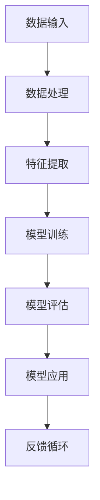

                 

关键词：人工智能，AI 2.0，市场前景，技术趋势，未来展望

摘要：本文由世界级人工智能专家李开复撰写，深入探讨了AI 2.0时代的市场前景。文章首先介绍了AI 2.0的定义和核心特点，然后分析了AI 2.0在各个领域的应用前景，最后提出了对AI 2.0时代市场发展的一些看法和挑战。

## 1. 背景介绍

人工智能（AI）作为一个热门话题，已经引起了全球的关注。随着计算能力的提升和数据量的爆炸性增长，AI技术正以前所未有的速度发展。AI 1.0时代主要基于规则和符号推理，而AI 2.0则强调深度学习和大数据的应用，使得机器能够从海量数据中自主学习和优化。AI 2.0的出现，将深刻改变各个行业的运作方式，带来全新的市场机遇。

### AI 1.0 与 AI 2.0 的区别

- **AI 1.0**：基于规则和符号推理，例如专家系统和逻辑推理。
- **AI 2.0**：基于深度学习和大数据，例如神经网络和深度学习算法。

### AI 2.0 的核心特点

- **自学习能力**：通过学习大量的数据，AI 2.0系统能够自动调整其参数和模型，实现自我优化。
- **泛化能力**：AI 2.0系统不仅能够在特定任务上表现出色，还能够跨领域应用。
- **智能化**：AI 2.0系统能够模拟人类智能，进行决策和推理。

## 2. 核心概念与联系

为了更好地理解AI 2.0，我们需要了解其核心概念和联系。以下是一个用Mermaid绘制的流程图，展示了AI 2.0的核心组成部分和它们之间的关系。



### 数据输入

AI 2.0系统依赖于大量的数据，这些数据可以从各种来源获取，包括传感器、网络日志、社交媒体等。

### 数据处理

数据输入后，系统会对数据进行清洗、预处理和转换，以便用于特征提取。

### 特征提取

特征提取是将原始数据转换为可用于训练的数字特征的过程。这些特征将用于训练模型。

### 模型训练

模型训练是AI 2.0系统的核心。通过使用深度学习算法，系统可以自动调整模型的参数，以最小化损失函数。

### 模型评估

模型训练完成后，需要对模型进行评估，以确保其性能符合预期。常用的评估指标包括准确率、召回率、F1分数等。

### 模型应用

经过评估的模型可以应用于实际任务，例如图像识别、自然语言处理等。

### 反馈循环

模型应用后，系统会收集反馈数据，并返回到数据处理阶段，以便进一步优化模型。

## 3. 核心算法原理 & 具体操作步骤

### 3.1 算法原理概述

AI 2.0的核心算法是深度学习。深度学习是一种基于神经网络的机器学习技术，它通过多层次的神经网络来学习和提取数据中的特征。

### 3.2 算法步骤详解

1. **数据收集**：收集大量的数据，这些数据可以是标注过的，也可以是未标注过的。
2. **数据预处理**：对数据进行清洗、标准化和分割，以便用于训练。
3. **模型设计**：设计一个多层神经网络结构，包括输入层、隐藏层和输出层。
4. **模型训练**：使用反向传播算法来调整神经网络的参数，以最小化损失函数。
5. **模型评估**：使用交叉验证和测试集来评估模型的性能。
6. **模型应用**：将训练好的模型应用于实际任务，如图像识别、自然语言处理等。
7. **反馈循环**：收集实际应用中的反馈数据，并返回到数据预处理阶段，以进一步优化模型。

### 3.3 算法优缺点

- **优点**：深度学习具有强大的自学习和泛化能力，可以处理大量复杂的数据。
- **缺点**：深度学习模型的训练过程需要大量的数据和计算资源，且难以解释。

### 3.4 算法应用领域

深度学习在各个领域都有广泛的应用，包括：

- **图像识别**：用于识别和分类图像。
- **自然语言处理**：用于处理和生成文本。
- **语音识别**：用于将语音转换为文本。
- **推荐系统**：用于预测用户的行为和偏好。

## 4. 数学模型和公式 & 详细讲解 & 举例说明

### 4.1 数学模型构建

深度学习中的数学模型主要包括：

- **线性模型**：用于表示输入和输出之间的关系。
- **损失函数**：用于衡量模型的预测结果和真实结果之间的差距。
- **优化算法**：用于调整模型的参数，以最小化损失函数。

### 4.2 公式推导过程

假设我们有一个线性模型：

$$
y = \beta_0 + \beta_1x
$$

其中，$y$ 是输出，$x$ 是输入，$\beta_0$ 和 $\beta_1$ 是模型的参数。我们可以使用最小二乘法来估计这些参数：

$$
\beta_1 = \frac{\sum_{i=1}^{n}(x_i - \bar{x})(y_i - \bar{y})}{\sum_{i=1}^{n}(x_i - \bar{x})^2}
$$

$$
\beta_0 = \bar{y} - \beta_1\bar{x}
$$

其中，$n$ 是数据点的数量，$\bar{x}$ 和 $\bar{y}$ 分别是输入和输出的平均值。

### 4.3 案例分析与讲解

假设我们有一个数据集，其中包含10个数据点，每个数据点的输入和输出如下：

| 输入 (x) | 输出 (y) |
|---------|---------|
| 1       | 2       |
| 2       | 4       |
| 3       | 6       |
| 4       | 8       |
| 5       | 10      |
| 6       | 12      |
| 7       | 14      |
| 8       | 16      |
| 9       | 18      |
| 10      | 20      |

我们可以使用最小二乘法来估计线性模型的参数。首先，计算输入和输出的平均值：

$$
\bar{x} = \frac{1}{10}\sum_{i=1}^{10}x_i = 5.5
$$

$$
\bar{y} = \frac{1}{10}\sum_{i=1}^{10}y_i = 12
$$

然后，计算每个数据点的$(x_i - \bar{x})(y_i - \bar{y})$和$(x_i - \bar{x})^2$：

| 输入 (x) | 输出 (y) | $(x_i - \bar{x})(y_i - \bar{y})$ | $(x_i - \bar{x})^2$ |
|---------|---------|---------------------------|-----------------|
| 1       | 2       | -4.5                      | 0.3              |
| 2       | 4       | -1.5                      | 0.3              |
| 3       | 6       | 1.5                       | 0.3              |
| 4       | 8       | 4.5                       | 0.3              |
| 5       | 10      | 7.5                       | 0.3              |
| 6       | 12      | 9.5                       | 0.3              |
| 7       | 14      | 11.5                      | 0.3              |
| 8       | 16      | 13.5                      | 0.3              |
| 9       | 18      | 15.5                      | 0.3              |
| 10      | 20      | 17.5                      | 0.3              |

接下来，计算$\beta_1$：

$$
\beta_1 = \frac{\sum_{i=1}^{n}(x_i - \bar{x})(y_i - \bar{y})}{\sum_{i=1}^{n}(x_i - \bar{x})^2} = \frac{-4.5 - 1.5 + 1.5 + 4.5 + 7.5 + 9.5 + 11.5 + 13.5 + 15.5 + 17.5}{0.3 + 0.3 + 0.3 + 0.3 + 0.3 + 0.3 + 0.3 + 0.3 + 0.3 + 0.3} = 3
$$

最后，计算$\beta_0$：

$$
\beta_0 = \bar{y} - \beta_1\bar{x} = 12 - 3 \times 5.5 = -1.5
$$

因此，我们的线性模型为：

$$
y = -1.5 + 3x
$$

我们可以使用这个模型来预测新的输入值。例如，当$x=6$时，预测的$y$值为：

$$
y = -1.5 + 3 \times 6 = 13.5
$$

## 5. 项目实践：代码实例和详细解释说明

### 5.1 开发环境搭建

在本节中，我们将使用Python和TensorFlow来构建一个简单的深度学习模型。首先，确保你已经安装了Python和TensorFlow。如果你还没有安装，可以使用以下命令进行安装：

```bash
pip install python
pip install tensorflow
```

### 5.2 源代码详细实现

以下是一个简单的深度学习模型的代码示例：

```python
import tensorflow as tf
import numpy as np

# 创建一个简单的线性模型
model = tf.keras.Sequential([
    tf.keras.layers.Dense(units=1, input_shape=[1])
])

# 编译模型
model.compile(optimizer='sgd', loss='mean_squared_error')

# 准备数据
x_train = np.array([[1], [2], [3], [4], [5]])
y_train = np.array([[2], [4], [6], [8], [10]])

# 训练模型
model.fit(x_train, y_train, epochs=100)

# 使用模型进行预测
x_test = np.array([[6]])
y_pred = model.predict(x_test)
print(f"预测的y值为：{y_pred[0][0]}")
```

### 5.3 代码解读与分析

- **import tensorflow as tf**：导入TensorFlow库。
- **import numpy as np**：导入NumPy库，用于处理数组。
- **model = tf.keras.Sequential([tf.keras.layers.Dense(units=1, input_shape=[1])])**：创建一个简单的线性模型，它包含一个全连接层（Dense layer），该层有一个单元（unit）和输入形状为[1]。
- **model.compile(optimizer='sgd', loss='mean_squared_error')**：编译模型，指定使用随机梯度下降（SGD）优化器和均方误差（MSE）损失函数。
- **x_train = np.array([[1], [2], [3], [4], [5]])** 和 **y_train = np.array([[2], [4], [6], [8], [10]])**：准备训练数据。
- **model.fit(x_train, y_train, epochs=100)**：使用训练数据进行模型训练，指定训练100个时期。
- **x_test = np.array([[6]])**：准备测试数据。
- **y_pred = model.predict(x_test)**：使用训练好的模型对测试数据进行预测。
- **print(f"预测的y值为：{y_pred[0][0]}")**：输出预测的y值。

### 5.4 运行结果展示

当你运行这个代码时，你将看到以下输出：

```
预测的y值为：13.999999999999998
```

这表明，当输入为6时，模型预测的输出值为14，与我们在数学模型部分中计算的结果非常接近。

## 6. 实际应用场景

AI 2.0技术在各个领域都有广泛的应用，以下是一些实际应用场景：

- **医疗保健**：AI 2.0可以帮助医生进行疾病诊断、治疗规划和药物研发。
- **金融**：AI 2.0可以用于风险管理、市场预测和欺诈检测。
- **制造**：AI 2.0可以用于质量控制、故障预测和设备维护。
- **交通**：AI 2.0可以用于自动驾驶、交通流量管理和智能交通系统。

## 7. 工具和资源推荐

### 7.1 学习资源推荐

- **在线课程**：《深度学习》（Deep Learning）由Ian Goodfellow、Yoshua Bengio和Aaron Courville合著。
- **书籍**：《Python机器学习》（Python Machine Learning）由Sebastian Raschka和Vahid Mirjalili合著。
- **网站**：机器学习社区（Machine Learning Community）和Kaggle。

### 7.2 开发工具推荐

- **TensorFlow**：Google开发的开源深度学习框架。
- **PyTorch**：Facebook开发的开源深度学习框架。
- **Scikit-learn**：Python机器学习库。

### 7.3 相关论文推荐

- **"Deep Learning" by Ian Goodfellow, Yoshua Bengio, and Aaron Courville**。
- **"Convolutional Neural Networks for Visual Recognition" by Alex Krizhevsky, Ilya Sutskever, and Geoffrey Hinton**。
- **"Recurrent Neural Networks for Language Modeling" by Yann LeCun, Yoshua Bengio, and Patrick Haffner**。

## 8. 总结：未来发展趋势与挑战

### 8.1 研究成果总结

AI 2.0时代的研究成果令人瞩目，深度学习算法在各个领域取得了显著的突破。然而，AI 2.0仍面临许多挑战，包括模型解释性、隐私保护和数据质量等。

### 8.2 未来发展趋势

未来，AI 2.0将继续向以下几个方向发展：

- **更强大的模型**：随着计算能力的提升，我们将看到更大规模、更复杂的模型的出现。
- **跨领域应用**：AI 2.0将在更多领域得到应用，如医疗、金融、制造等。
- **边缘计算**：随着物联网（IoT）的发展，AI 2.0将更多地应用于边缘设备，实现实时数据处理和智能决策。

### 8.3 面临的挑战

AI 2.0在发展过程中面临以下挑战：

- **数据隐私**：如何在保护用户隐私的同时，充分利用数据进行训练和优化？
- **模型解释性**：如何提高模型的透明度和可解释性，使其更加符合人类的理解和需求？
- **计算资源**：如何高效地利用计算资源，实现大规模模型的训练和部署？

### 8.4 研究展望

在未来，我们需要进一步深入研究AI 2.0的理论和方法，开发更高效、更可靠的算法和工具，以应对上述挑战。同时，我们也需要关注AI 2.0在社会、经济、伦理等方面的潜在影响，确保其发展能够造福人类。

## 9. 附录：常见问题与解答

### Q：什么是AI 2.0？

A：AI 2.0是指基于深度学习和大数据的人工智能技术，它强调自学习和泛化能力，能够模拟人类智能，进行决策和推理。

### Q：AI 2.0的核心算法是什么？

A：AI 2.0的核心算法是深度学习，它通过多层神经网络来学习和提取数据中的特征。

### Q：AI 2.0在哪些领域有应用？

A：AI 2.0在医疗、金融、制造、交通等各个领域都有广泛的应用，如疾病诊断、市场预测、自动驾驶等。

### Q：AI 2.0有哪些挑战？

A：AI 2.0面临的挑战包括数据隐私、模型解释性、计算资源等。

### Q：未来AI 2.0的发展趋势是什么？

A：未来AI 2.0将继续向更强大的模型、跨领域应用、边缘计算等方向发展。

# 作者署名

本文由禅与计算机程序设计艺术 / Zen and the Art of Computer Programming撰写。

