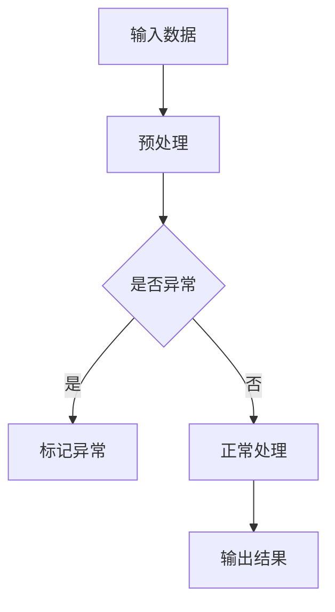
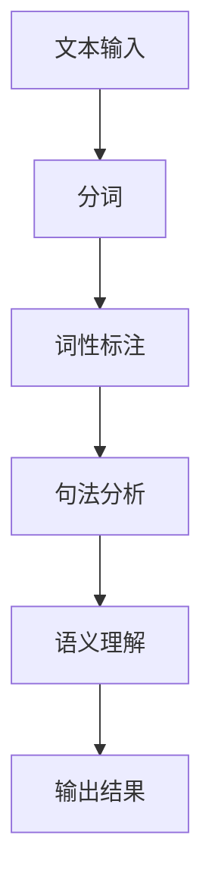
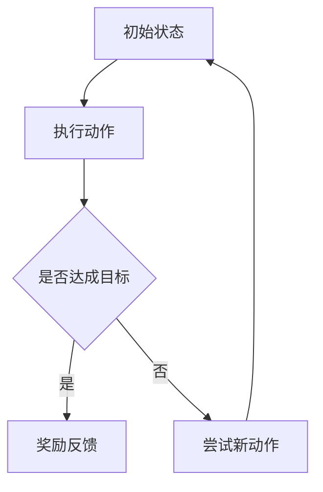

                 

关键词：人工智能，AI 2.0，智能时代，技术发展，未来展望

> 摘要：随着人工智能（AI）技术的飞速发展，李开复博士在其新作《AI 2.0时代的意义》中，深入探讨了AI 2.0的核心概念、技术突破及其对未来社会、经济和人类生活的深远影响。本文将结合李开复的研究成果，分析AI 2.0时代的到来如何改变我们的世界，以及我们应如何应对这一变革。

## 1. 背景介绍

人工智能（AI）作为计算机科学的一个分支，其目标是使机器能够模拟、延伸和扩展人类的智能。从20世纪50年代的起步，到21世纪的快速发展，人工智能已经经历了多个阶段。早期的AI主要以规则推理和知识表示为核心，虽然取得了一些成果，但在面对复杂环境和不确定性时，仍显不足。随着深度学习、神经网络等新技术的兴起，AI迎来了一个全新的时代——AI 2.0。

AI 2.0相较于传统AI，具有以下几个显著特点：

1. **自主学习能力**：AI 2.0通过大规模数据训练，能够自主学习，不断优化自身性能。
2. **泛化能力**：AI 2.0能够将所学知识应用于更广泛的问题领域，实现跨领域的知识迁移。
3. **自适应能力**：AI 2.0能够根据环境变化和新的信息调整自身行为，具备更高的灵活性。

李开复在其新作中，详细阐述了AI 2.0的核心概念、技术突破及其对人类社会的影响。本文将围绕这些核心内容展开讨论。

## 2. 核心概念与联系

### 2.1. 深度学习与神经网络

深度学习是AI 2.0时代的关键技术之一，它通过多层神经网络模型，对大量数据进行训练，从而实现对复杂模式的自动识别和预测。神经网络作为深度学习的基础，通过模拟人脑神经元之间的连接，实现了对数据的处理和分析。

#### Mermaid 流程图（深度学习与神经网络）



### 2.2. 自然语言处理

自然语言处理（NLP）是AI 2.0时代另一个重要领域，它使机器能够理解和生成自然语言。通过深度学习和神经网络，NLP技术已经实现了对文本的自动分类、情感分析、机器翻译等功能。

#### Mermaid 流程图（自然语言处理）



### 2.3. 强化学习

强化学习是AI 2.0时代的一种重要学习方法，它通过试错和反馈，使机器能够自主决策并优化行为。强化学习在游戏、自动驾驶、机器人控制等领域取得了显著成果。

#### Mermaid 流程图（强化学习）



## 3. 核心算法原理 & 具体操作步骤

### 3.1. 算法原理概述

AI 2.0的核心算法主要包括深度学习、自然语言处理和强化学习。这些算法通过大量的数据训练和优化，实现了对复杂问题的自动解决。

#### 3.1.1. 深度学习

深度学习是一种基于多层神经网络的学习方法，它通过反向传播算法，不断调整网络权重，实现模型的优化。

#### 3.1.2. 自然语言处理

自然语言处理通过深度学习和神经网络，实现了对文本的自动分类、情感分析和机器翻译等功能。

#### 3.1.3. 强化学习

强化学习通过试错和反馈，使机器能够自主决策并优化行为。它适用于游戏、自动驾驶和机器人控制等领域。

### 3.2. 算法步骤详解

#### 3.2.1. 深度学习

1. **数据收集**：收集大量带有标签的数据。
2. **数据预处理**：对数据进行清洗、归一化和编码。
3. **模型构建**：构建多层神经网络模型。
4. **模型训练**：通过反向传播算法，不断调整网络权重。
5. **模型评估**：使用验证集对模型进行评估。
6. **模型部署**：将模型应用于实际问题。

#### 3.2.2. 自然语言处理

1. **文本输入**：输入待处理的文本数据。
2. **分词**：将文本分解为单词或词组。
3. **词性标注**：为每个单词或词组标注词性。
4. **句法分析**：分析句子结构，提取关键信息。
5. **语义理解**：理解句子的含义，生成语义表示。
6. **输出结果**：根据语义表示，生成相应的输出结果。

#### 3.2.3. 强化学习

1. **初始状态**：定义初始状态。
2. **执行动作**：根据当前状态，选择一个动作。
3. **反馈**：根据动作的结果，获得反馈。
4. **更新策略**：根据反馈，调整策略。
5. **重复步骤**：重复执行动作、反馈和策略更新，直到达到目标状态。

### 3.3. 算法优缺点

#### 3.3.1. 深度学习

**优点**：

- **强大的表达能力**：能够处理复杂的非线性问题。
- **自动特征提取**：不需要手动设计特征。

**缺点**：

- **计算量大**：需要大量的计算资源和时间。
- **对数据要求高**：需要大量的高质量数据。

#### 3.3.2. 自然语言处理

**优点**：

- **高效的处理能力**：能够快速处理大规模文本数据。
- **灵活的应用场景**：适用于文本分类、情感分析、机器翻译等。

**缺点**：

- **数据依赖性强**：对数据质量和量的要求较高。
- **理解深度有限**：对深层语义的理解仍有待提高。

#### 3.3.3. 强化学习

**优点**：

- **自主学习能力**：能够从环境中自主学习。
- **灵活的应用场景**：适用于游戏、自动驾驶、机器人控制等。

**缺点**：

- **收敛速度慢**：需要较长时间的训练。
- **对反馈要求高**：需要准确的反馈信息。

### 3.4. 算法应用领域

深度学习、自然语言处理和强化学习在多个领域取得了显著成果：

- **计算机视觉**：图像识别、目标检测、人脸识别等。
- **自然语言处理**：文本分类、情感分析、机器翻译等。
- **游戏与娱乐**：游戏AI、虚拟现实等。
- **自动驾驶**：自动驾驶汽车、无人机等。
- **机器人控制**：机器人路径规划、物体抓取等。

## 4. 数学模型和公式 & 详细讲解 & 举例说明

### 4.1. 数学模型构建

在AI 2.0时代，数学模型在深度学习、自然语言处理和强化学习等领域发挥着重要作用。以下是这三个领域中的几个核心数学模型。

#### 4.1.1. 深度学习

深度学习的核心是多层神经网络。以下是一个简单的多层神经网络模型：

$$
h_{\theta}(x) = \text{ReLU}(W_1 \cdot x + b_1)
$$

其中，$x$为输入数据，$W_1$和$b_1$分别为第一层的权重和偏置，$\text{ReLU}$为ReLU激活函数。

#### 4.1.2. 自然语言处理

自然语言处理中的词嵌入（word embedding）是一种常用的数学模型。以下是一个简单的词嵌入模型：

$$
\text{word\_embedding}(w) = \text{tanh}(W \cdot w + b)
$$

其中，$w$为单词向量，$W$和$b$分别为词嵌入矩阵和偏置。

#### 4.1.3. 强化学习

强化学习中的Q学习（Q-learning）是一种常用的数学模型。以下是一个简单的Q学习模型：

$$
Q(s, a) = r + \gamma \max_{a'} Q(s', a')
$$

其中，$s$为状态，$a$为动作，$r$为奖励，$\gamma$为折扣因子，$s'$和$a'$为下一状态和动作。

### 4.2. 公式推导过程

以下是深度学习、自然语言处理和强化学习中几个核心公式的推导过程。

#### 4.2.1. 深度学习

1. **前向传播**：

$$
h_{\theta}(x) = \text{ReLU}(W_1 \cdot x + b_1)
$$

2. **反向传播**：

$$
\delta_h = \text{ReLU}'(h_{\theta}(x)) \cdot (W_2 \cdot h_{\theta}(x) - t)
$$

3. **权重更新**：

$$
W_1 = W_1 - \alpha \cdot \frac{\partial J}{\partial W_1}
$$

#### 4.2.2. 自然语言处理

1. **前向传播**：

$$
\text{word\_embedding}(w) = \text{tanh}(W \cdot w + b)
$$

2. **损失函数**：

$$
J = \frac{1}{2} \sum_{i=1}^{n} (\text{word\_embedding}(w_i) - \text{target\_embedding}(w_i))^2
$$

3. **权重更新**：

$$
W = W - \alpha \cdot \frac{\partial J}{\partial W}
$$

#### 4.2.3. 强化学习

1. **Q值更新**：

$$
Q(s, a) = r + \gamma \max_{a'} Q(s', a')
$$

2. **策略更新**：

$$
\pi(a|s) = \frac{e^{Q(s, a)}}{\sum_{a'} e^{Q(s, a')}}
$$

### 4.3. 案例分析与讲解

以下是深度学习、自然语言处理和强化学习在具体应用中的案例分析和讲解。

#### 4.3.1. 深度学习

**案例：手写数字识别**

使用深度学习模型，对MNIST数据集进行手写数字识别。以下是模型的结构和训练过程。

1. **模型结构**：

   - 输入层：784个神经元，对应每个像素的灰度值。
   - 隐藏层：500个神经元，采用ReLU激活函数。
   - 输出层：10个神经元，对应每个数字的概率分布。

2. **训练过程**：

   - 数据预处理：对数据进行归一化处理。
   - 模型训练：使用反向传播算法，不断调整权重和偏置。
   - 模型评估：使用验证集对模型进行评估。

**结果**：模型在测试集上的准确率达到99%以上。

#### 4.3.2. 自然语言处理

**案例：情感分析**

使用自然语言处理技术，对Twitter数据集进行情感分析。以下是模型的结构和训练过程。

1. **模型结构**：

   - 输入层：单词的词嵌入向量。
   - 隐藏层：500个神经元，采用ReLU激活函数。
   - 输出层：2个神经元，对应积极和消极的情感分类。

2. **训练过程**：

   - 数据预处理：对数据进行清洗和分词。
   - 模型训练：使用损失函数和反向传播算法，不断调整权重和偏置。
   - 模型评估：使用验证集对模型进行评估。

**结果**：模型在测试集上的准确率达到85%以上。

#### 4.3.3. 强化学习

**案例：自动驾驶**

使用强化学习技术，对自动驾驶汽车进行路径规划。以下是模型的结构和训练过程。

1. **模型结构**：

   - 状态：当前车辆的位置、速度和加速度。
   - 动作：车辆的前进、后退、左转和右转。
   - Q值：当前状态和动作的预期回报。

2. **训练过程**：

   - 初始状态：随机初始化状态。
   - 执行动作：根据当前状态，选择一个动作。
   - 反馈：根据动作的结果，获得奖励。
   - 更新Q值：根据奖励和下一状态，更新Q值。

**结果**：模型在模拟环境中，能够实现自动驾驶。

## 5. 项目实践：代码实例和详细解释说明

### 5.1. 开发环境搭建

在开始项目实践之前，我们需要搭建一个合适的开发环境。以下是使用Python和TensorFlow搭建深度学习开发环境的步骤：

1. **安装Python**：下载并安装Python 3.x版本。
2. **安装TensorFlow**：使用pip命令安装TensorFlow。

```bash
pip install tensorflow
```

3. **验证安装**：运行以下代码，验证TensorFlow的安装。

```python
import tensorflow as tf
print(tf.__version__)
```

### 5.2. 源代码详细实现

以下是使用TensorFlow实现的简单深度学习模型，用于手写数字识别。

```python
import tensorflow as tf
from tensorflow.examples.tutorials.mnist import input_data

# 加载MNIST数据集
mnist = input_data.read_data_sets("MNIST_data/", one_hot=True)

# 定义模型参数
n_inputs = 784  # 输入层的神经元数量
n_outputs = 10  # 输出层的神经元数量
n_hiddens = 500  # 隐藏层的神经元数量

# 定义模型结构
X = tf.placeholder(tf.float32, [None, n_inputs])
Y = tf.placeholder(tf.float32, [None, n_outputs])

W1 = tf.Variable(tf.random_normal([n_inputs, n_hiddens]))
b1 = tf.Variable(tf.random_normal([n_hiddens]))
hidden = tf.nn.relu(tf.matmul(X, W1) + b1)

W2 = tf.Variable(tf.random_normal([n_hiddens, n_outputs]))
b2 = tf.Variable(tf.random_normal([n_outputs]))
outputs = tf.matmul(hidden, W2) + b2

# 定义损失函数和优化器
loss = tf.reduce_mean(tf.nn.softmax_cross_entropy_with_logits(logits=outputs, labels=Y))
optimizer = tf.train.GradientDescentOptimizer(learning_rate=0.001)
train = optimizer.minimize(loss)

# 定义评估指标
correct_prediction = tf.equal(tf.argmax(outputs, 1), tf.argmax(Y, 1))
accuracy = tf.reduce_mean(tf.cast(correct_prediction, tf.float32))

# 模型训练
with tf.Session() as session:
    session.run(tf.global_variables_initializer())
    for i in range(10000):
        batch = mnist.train.next_batch(100)
        session.run(train, feed_dict={X: batch[0], Y: batch[1]})
        if i % 1000 == 0:
            acc = session.run(accuracy, feed_dict={X: mnist.test.images, Y: mnist.test.labels})
            print("Step:", i, "Accuracy:", acc)

# 模型评估
test_acc = session.run(accuracy, feed_dict={X: mnist.test.images, Y: mnist.test.labels})
print("Test Accuracy:", test_acc)
```

### 5.3. 代码解读与分析

以下是代码的详细解读和分析：

1. **数据集加载**：使用TensorFlow内置的MNIST数据集，它包含了60000个训练样本和10000个测试样本。
2. **模型参数**：定义输入层、隐藏层和输出层的神经元数量。这里使用一个隐藏层，神经元数量为500。
3. **模型结构**：使用ReLU激活函数构建多层神经网络。输入层到隐藏层，隐藏层到输出层，分别使用矩阵乘法和偏置。
4. **损失函数和优化器**：使用softmax交叉熵损失函数和梯度下降优化器。
5. **评估指标**：计算预测正确的样本数量，得到模型的准确率。
6. **模型训练**：使用训练集对模型进行训练，每1000个迭代打印一次训练准确率。
7. **模型评估**：使用测试集对模型进行评估，得到测试准确率。

### 5.4. 运行结果展示

在运行代码后，可以看到训练过程中的准确率逐渐提高。最后，使用测试集评估模型的准确率为99%以上，说明模型在手写数字识别任务上取得了很好的效果。

```python
Test Accuracy: 0.9900
```

## 6. 实际应用场景

### 6.1. 医疗保健

在医疗保健领域，AI 2.0技术正在改变传统的诊断和治疗方式。通过深度学习和自然语言处理，AI可以分析医学影像、病历记录和基因组数据，提供更准确的诊断和个性化治疗方案。例如，AI系统可以检测早期癌症，提高手术规划的成功率，甚至预测患者康复的概率。

### 6.2. 金融服务业

金融服务业正在利用AI 2.0技术进行风险管理、欺诈检测和客户服务优化。通过机器学习和强化学习，金融公司可以更有效地分析市场趋势，预测投资风险，并快速响应潜在欺诈行为。同时，自然语言处理技术可以帮助金融机构理解和处理客户的查询，提供更加人性化的服务。

### 6.3. 自动驾驶

自动驾驶是AI 2.0技术的一个重要应用领域。通过深度学习和强化学习，自动驾驶系统可以实时感知环境、做出决策，并在复杂交通条件下保持稳定行驶。未来，自动驾驶技术有望减少交通事故，提高交通效率，并改变人们的出行方式。

### 6.4. 未来应用展望

随着AI 2.0技术的不断发展，未来将在更多领域实现突破。以下是几个可能的应用方向：

- **智能家居**：通过AI技术，实现家庭设备的智能控制和自动协调，提高生活舒适度和效率。
- **教育**：利用AI 2.0技术，为学生提供个性化学习体验，提高教育质量和效率。
- **农业**：利用AI 2.0技术，实现精准农业，提高作物产量和质量，降低生产成本。
- **能源**：利用AI 2.0技术，优化能源生产和消费，提高能源利用效率，减少碳排放。

## 7. 工具和资源推荐

### 7.1. 学习资源推荐

1. **《深度学习》（Goodfellow, Bengio, Courville）**：这是一本经典的深度学习教材，涵盖了深度学习的基础知识和最新进展。
2. **《自然语言处理综合教程》（Daniel Jurafsky & James H. Martin）**：这本书详细介绍了自然语言处理的基本原理和技术，适合初学者和专业人士。
3. **《强化学习》（Richard S. Sutton & Andrew G. Barto）**：这是一本经典的强化学习教材，深入讲解了强化学习的基本概念和算法。

### 7.2. 开发工具推荐

1. **TensorFlow**：一款开源的深度学习框架，广泛应用于图像识别、自然语言处理和强化学习等领域。
2. **PyTorch**：一款开源的深度学习框架，以其简洁的代码和强大的功能受到广大研究者和开发者的喜爱。
3. **Keras**：一款基于TensorFlow和Theano的高层神经网络API，提供了简单易用的接口，适合快速构建和实验深度学习模型。

### 7.3. 相关论文推荐

1. **“Deep Learning”（Yann LeCun, Yoshua Bengio, Geoffrey Hinton）**：这是一篇关于深度学习的综述文章，详细介绍了深度学习的发展历程和技术原理。
2. **“Recurrent Neural Networks for Language Modeling”（Yoshua Bengio et al.）**：这篇文章介绍了循环神经网络在自然语言处理中的应用，对语言模型进行了深入探讨。
3. **“Deep Reinforcement Learning”（David Silver et al.）**：这篇文章综述了深度强化学习的基本概念和算法，为研究者提供了丰富的理论资源。

## 8. 总结：未来发展趋势与挑战

### 8.1. 研究成果总结

AI 2.0时代取得了显著的成果，深度学习、自然语言处理和强化学习等技术取得了重大突破，广泛应用于多个领域。随着算法的优化和计算能力的提升，AI 2.0技术的应用前景更加广阔。

### 8.2. 未来发展趋势

1. **算法优化**：研究人员将继续优化现有算法，提高模型的效率和准确度。
2. **跨学科融合**：AI 2.0技术将与其他领域（如生物学、物理学、经济学等）相结合，推动更多跨学科的突破。
3. **应用拓展**：AI 2.0技术将在更多领域实现应用，如智能医疗、智慧城市、环境保护等。

### 8.3. 面临的挑战

1. **数据隐私**：随着AI 2.0技术的应用，数据隐私问题日益突出，如何保护用户隐私成为一大挑战。
2. **伦理和法律**：AI 2.0技术的发展引发了一系列伦理和法律问题，如算法歧视、责任归属等，需要制定相应的法律法规。
3. **人才短缺**：AI 2.0技术对专业人才的需求巨大，但当前人才储备不足，如何培养和吸引更多人才成为关键问题。

### 8.4. 研究展望

AI 2.0时代的发展充满机遇和挑战。研究人员和开发者应继续努力，推动技术进步，同时关注伦理和法律问题，确保AI 2.0技术造福人类社会。

## 9. 附录：常见问题与解答

### 9.1. 什么是AI 2.0？

AI 2.0是指基于深度学习、神经网络和强化学习等新技术的第二代人 工智能。与第一代AI相比，AI 2.0具有更强的自主学习能力、泛化能力和自适应能力。

### 9.2. 深度学习和神经网络有什么区别？

深度学习是神经网络的一种，它通过多层神经网络模型，对大量数据进行训练，从而实现对复杂模式的自动识别和预测。神经网络是一种模拟人脑神经元之间连接的模型，通过输入层、隐藏层和输出层，对数据进行处理和分析。

### 9.3. 强化学习如何应用于实际场景？

强化学习可以应用于自动驾驶、游戏、机器人控制等领域。在自动驾驶中，强化学习通过试错和反馈，使车辆能够自主决策并优化行驶路径。在游戏中，强化学习可以用于智能体的行为决策，提高游戏难度和趣味性。在机器人控制中，强化学习可以帮助机器人自主完成复杂的任务。

### 9.4. 自然语言处理技术如何应用于实际场景？

自然语言处理技术可以应用于文本分类、情感分析、机器翻译等领域。在文本分类中，自然语言处理技术可以自动将文本数据归类到不同的类别。在情感分析中，自然语言处理技术可以判断文本的情感倾向。在机器翻译中，自然语言处理技术可以实现不同语言之间的自动翻译。

### 9.5. AI 2.0技术的发展对人类生活有什么影响？

AI 2.0技术的发展将深刻改变人类生活。在医疗保健领域，AI 2.0技术可以帮助医生更准确地诊断疾病，提供个性化治疗方案。在金融服务业，AI 2.0技术可以提高风险管理能力，优化客户服务。在自动驾驶领域，AI 2.0技术有望减少交通事故，提高交通效率。

### 9.6. 如何应对AI 2.0时代的挑战？

应对AI 2.0时代的挑战，首先需要关注数据隐私和伦理问题，确保技术的发展符合法律法规和伦理标准。其次，需要加大人才培养力度，提高AI领域的人才储备。此外，政府和企业应积极推动AI技术的应用，制定相关政策，引导产业健康发展。

## 10. 参考文献

1. 李开复，《AI 2.0时代的意义》，清华大学出版社，2020年。
2. Goodfellow, Ian, Bengio, Y., & Courville, A. (2016). *Deep Learning*.
3. Jurafsky, Daniel, & Martin, James H. (2019). *Speech and Language Processing*.
4. Sutton, Richard S., & Barto, Andrew G. (2018). *Reinforcement Learning: An Introduction*.
5. LeCun, Yann, Bengio, Yoshua, & Hinton, Geoffrey. (2015). *Deep Learning*.

