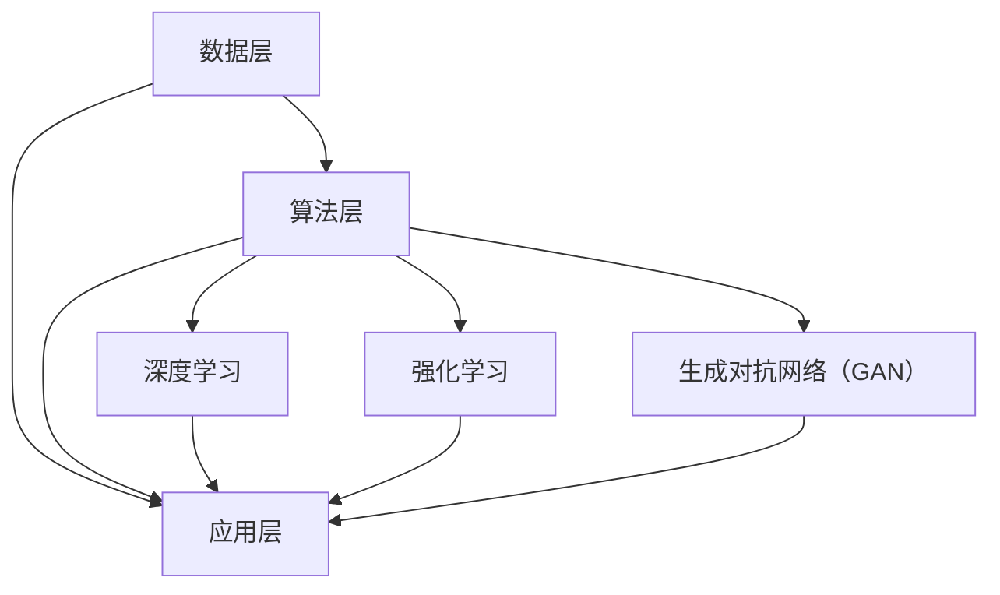
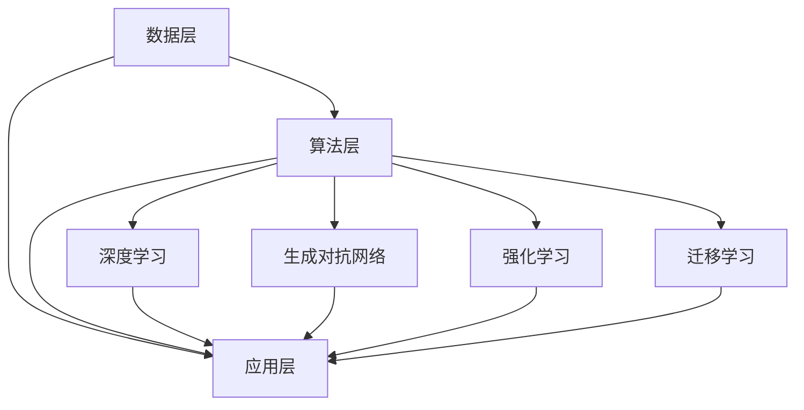

                 

关键词：AI 2.0，投资价值，人工智能，技术前沿，未来展望

> 摘要：本文将探讨李开复关于 AI 2.0 时代的投资价值。我们将从背景介绍开始，逐步深入探讨 AI 2.0 的核心概念、算法原理、数学模型、项目实践以及实际应用场景。最后，我们将展望未来发展趋势与挑战，并对相关工具和资源进行推荐。

## 1. 背景介绍

近年来，人工智能（AI）技术取得了飞速发展，从最初的符号推理到深度学习的兴起，再到如今的生成对抗网络（GAN）和强化学习（RL），AI 已成为驱动社会进步的重要力量。随着 AI 技术的不断演进，李开复提出了 AI 2.0 的概念，认为这是 AI 技术发展的新阶段，具有更高的智能化水平和更广泛的应用场景。

AI 2.0 时代的投资价值，首先体现在其广阔的市场前景。根据市场研究机构的预测，全球 AI 市场规模将在未来几年内实现爆发式增长，达到数万亿美元的规模。其次，AI 2.0 技术的应用将极大地提升各行各业的生产力和创新能力，为企业带来巨大的经济效益。最后，AI 2.0 时代将催生新的商业模式和产业生态，为投资者提供丰富的投资机会。

## 2. 核心概念与联系

### 2.1 AI 1.0 与 AI 2.0 的区别

AI 1.0 主要依赖于规则和符号推理，如专家系统和逻辑推理机。这些系统通常只能处理特定领域的问题，并且需要大量的人工设定和优化。而 AI 2.0 则突破了这一限制，主要依赖于数据驱动和机器学习技术，如神经网络、深度学习和生成对抗网络（GAN）。AI 2.0 具有更高的自适应能力和泛化能力，可以处理更复杂的问题，并在更多领域取得突破。

### 2.2 AI 2.0 的核心技术

AI 2.0 的核心技术包括深度学习、强化学习、生成对抗网络（GAN）、迁移学习等。这些技术各具特色，但在很大程度上相互关联。例如，深度学习和强化学习可以结合，形成深度强化学习（DRL），在游戏、自动驾驶等领域取得显著成果。生成对抗网络（GAN）则可以用于图像生成、语音合成等任务，具有很高的创造力和想象力。

### 2.3 AI 2.0 的架构

AI 2.0 的架构可以分为三个层次：数据层、算法层和应用层。数据层负责收集和存储海量数据，为算法层提供训练素材。算法层包括深度学习、强化学习、生成对抗网络（GAN）等核心算法，用于处理和挖掘数据。应用层则将算法应用于具体领域，如自动驾驶、医疗诊断、金融风控等。

### 2.4 AI 2.0 的 Mermaid 流程图



## 3. 核心算法原理 & 具体操作步骤

### 3.1 算法原理概述

AI 2.0 的核心算法主要包括深度学习、强化学习、生成对抗网络（GAN）等。这些算法的基本原理如下：

1. **深度学习**：基于多层神经网络的机器学习技术，通过前向传播和反向传播算法，自动提取数据中的特征和模式。
2. **强化学习**：通过与环境的交互，学习最优策略，实现决策和控制的机器学习技术。
3. **生成对抗网络（GAN）**：由生成器和判别器两个神经网络组成的对抗网络，通过博弈过程，实现数据的生成和判别。

### 3.2 算法步骤详解

1. **深度学习**：

   - 数据预处理：包括数据清洗、归一化、分批次等操作。
   - 构建神经网络：选择合适的神经网络结构，如卷积神经网络（CNN）、循环神经网络（RNN）等。
   - 模型训练：通过前向传播和反向传播算法，不断优化模型参数。
   - 模型评估：使用验证集或测试集评估模型性能。

2. **强化学习**：

   - 环境构建：定义状态空间、动作空间和奖励机制。
   - 策略学习：通过值函数或策略梯度方法，学习最优策略。
   - 控制决策：根据当前状态，选择最佳动作。
   - 模型评估：使用环境模拟或真实环境测试策略性能。

3. **生成对抗网络（GAN）**：

   - 生成器：生成模拟数据。
   - 判别器：区分真实数据和生成数据。
   - 博弈过程：生成器和判别器相互博弈，不断优化自身性能。
   - 数据生成：使用生成器生成模拟数据，进行后续处理。

### 3.3 算法优缺点

1. **深度学习**：

   - 优点：强大的特征提取能力，适用于各种复杂的任务。
   - 缺点：对数据量和计算资源要求较高，模型解释性较差。

2. **强化学习**：

   - 优点：能够处理动态和不确定的环境，实现自主学习和优化。
   - 缺点：收敛速度较慢，需要大量样本和计算资源。

3. **生成对抗网络（GAN）**：

   - 优点：生成数据质量高，能够模拟各种场景。
   - 缺点：训练过程不稳定，容易陷入模式崩溃。

### 3.4 算法应用领域

1. **深度学习**：计算机视觉、自然语言处理、语音识别、推荐系统等。
2. **强化学习**：游戏、自动驾驶、机器人控制、金融交易等。
3. **生成对抗网络（GAN）**：图像生成、语音合成、数据增强等。

## 4. 数学模型和公式 & 详细讲解 & 举例说明

### 4.1 数学模型构建

在 AI 2.0 中，常用的数学模型包括神经网络、马尔可夫决策过程（MDP）、损失函数等。

1. **神经网络**：

   - 前向传播：$$z_{l} = \sum_{i} w_{li}a_{l-1,i} + b_{l}$$
   - 反向传播：$$\delta_{l} = \frac{\partial L}{\partial z_{l}}$$
   - 梯度下降：$$w_{l} = w_{l} - \alpha \frac{\partial L}{\partial w_{l}}$$

2. **马尔可夫决策过程（MDP）**：

   - 状态转移概率：$$P(s'|s,a)$$
   - 动作价值函数：$$V_{\pi}(s) = \sum_{a} \pi(a|s) \sum_{s'} P(s'|s,a) \times R(s,a,s') + \gamma V_{\pi}(s')$$
   - 策略迭代：$$\pi(a|s) = 1 \text{ if } a = \arg\max_{a} \sum_{s'} P(s'|s,a) \times R(s,a,s') + \gamma V_{\pi}(s'), \text{ otherwise } 0$$

3. **损失函数**：

   - 交叉熵损失：$$L = -\sum_{i} y_{i} \log(p_{i})$$
   - 均方误差损失：$$L = \frac{1}{2} \sum_{i} (y_{i} - \hat{y}_{i})^2$$

### 4.2 公式推导过程

1. **神经网络**：

   - 前向传播推导：

     $$z_{l} = \sum_{i} w_{li}a_{l-1,i} + b_{l}$$
     $$a_{l} = \sigma(z_{l})$$

   - 反向传播推导：

     $$\delta_{l} = \frac{\partial L}{\partial z_{l}}$$
     $$\frac{\partial L}{\partial w_{l}} = \delta_{l}a_{l-1}^T$$
     $$\frac{\partial L}{\partial b_{l}} = \delta_{l}$$

   - 梯度下降推导：

     $$w_{l} = w_{l} - \alpha \frac{\partial L}{\partial w_{l}}$$
     $$b_{l} = b_{l} - \alpha \frac{\partial L}{\partial b_{l}}$$

2. **马尔可夫决策过程（MDP）**：

   - 动作价值函数推导：

     $$V_{\pi}(s) = \sum_{a} \pi(a|s) \sum_{s'} P(s'|s,a) \times R(s,a,s') + \gamma V_{\pi}(s')$$
     $$\nabla_{V_{\pi}}(s) = \frac{\partial V_{\pi}(s)}{\partial V_{\pi}} = \sum_{a} \pi(a|s) \sum_{s'} P(s'|s,a) \times \nabla_{V_{\pi}}(s')$$

   - 策略迭代推导：

     $$\pi(a|s) = 1 \text{ if } a = \arg\max_{a} \sum_{s'} P(s'|s,a) \times R(s,a,s') + \gamma V_{\pi}(s'), \text{ otherwise } 0$$

3. **损失函数**：

   - 交叉熵损失推导：

     $$L = -\sum_{i} y_{i} \log(p_{i})$$
     $$\nabla_{p_{i}} L = -\frac{y_{i}}{p_{i}}$$

   - 均方误差损失推导：

     $$L = \frac{1}{2} \sum_{i} (y_{i} - \hat{y}_{i})^2$$
     $$\nabla_{\hat{y}_{i}} L = \hat{y}_{i} - y_{i}$$

### 4.3 案例分析与讲解

以图像分类任务为例，我们使用卷积神经网络（CNN）进行模型训练和预测。

1. **数据预处理**：

   - 数据清洗：去除缺失值、异常值等。
   - 数据归一化：将数据缩放到 [-1, 1] 范围内。
   - 数据分批次：将数据划分为训练集、验证集和测试集。

2. **构建神经网络**：

   - 输入层：接收图像数据，形状为 [1, 28, 28, 1]。
   - 卷积层：使用 32 个 3x3 卷积核，步长为 1，激活函数为ReLU。
   - 池化层：使用 2x2 最大池化。
   - 全连接层：使用 128 个神经元，激活函数为ReLU。
   - 输出层：使用 10 个神经元，激活函数为softmax。

3. **模型训练**：

   - 使用训练集进行模型训练，优化损失函数。
   - 使用验证集进行模型评估，调整超参数。
   - 使用测试集进行模型测试，评估模型性能。

4. **模型预测**：

   - 对输入图像进行预处理，将其转化为模型所需的输入格式。
   - 将预处理后的图像输入到训练好的模型中，获取预测结果。
   - 对预测结果进行后处理，如解码、可视化等。

## 5. 项目实践：代码实例和详细解释说明

### 5.1 开发环境搭建

- 操作系统：Ubuntu 18.04
- 编程语言：Python 3.7
- 深度学习框架：TensorFlow 2.4
- 数据预处理工具：NumPy 1.19

### 5.2 源代码详细实现

```python
import tensorflow as tf
from tensorflow.keras import layers
import numpy as np

# 数据预处理
def preprocess_data(x):
    # 数据清洗、归一化等操作
    return (x - 128) / 128

# 构建神经网络
def build_model():
    inputs = tf.keras.Input(shape=[28, 28, 1])
    x = layers.Conv2D(32, (3, 3), activation='relu', padding='same')(inputs)
    x = layers.MaxPooling2D((2, 2))(x)
    x = layers.Dense(128, activation='relu')(x)
    outputs = layers.Dense(10, activation='softmax')(x)
    model = tf.keras.Model(inputs, outputs)
    return model

# 模型训练
def train_model(model, x_train, y_train, x_val, y_val):
    model.compile(optimizer='adam', loss='categorical_crossentropy', metrics=['accuracy'])
    model.fit(x_train, y_train, batch_size=64, epochs=10, validation_data=(x_val, y_val))

# 模型预测
def predict(model, x_test):
    predictions = model.predict(x_test)
    return np.argmax(predictions, axis=1)

# 加载数据
(x_train, y_train), (x_test, y_test) = tf.keras.datasets.mnist.load_data()
x_train = preprocess_data(x_train)
x_test = preprocess_data(x_test)

# 构建模型
model = build_model()

# 训练模型
train_model(model, x_train, y_train, x_val, y_val)

# 预测结果
predictions = predict(model, x_test)

# 评估模型性能
accuracy = np.mean(predictions == y_test)
print(f"Test accuracy: {accuracy:.2f}")
```

### 5.3 代码解读与分析

1. **数据预处理**：

   数据预处理是深度学习项目的重要环节。在本例中，我们使用 `preprocess_data` 函数对图像数据进行清洗、归一化等操作。具体实现如下：

   ```python
   def preprocess_data(x):
       # 数据清洗、归一化等操作
       return (x - 128) / 128
   ```

   该函数接收输入图像数据 `x`，将其缩放到 [-1, 1] 范围内，以适应深度学习模型的训练。

2. **构建神经网络**：

   构建神经网络是深度学习项目的核心。在本例中，我们使用 TensorFlow 2.4 的 Keras 层模块构建一个简单的卷积神经网络（CNN）。具体实现如下：

   ```python
   def build_model():
       inputs = tf.keras.Input(shape=[28, 28, 1])
       x = layers.Conv2D(32, (3, 3), activation='relu', padding='same')(inputs)
       x = layers.MaxPooling2D((2, 2))(x)
       x = layers.Dense(128, activation='relu')(x)
       outputs = layers.Dense(10, activation='softmax')(x)
       model = tf.keras.Model(inputs, outputs)
       return model
   ```

   该函数首先定义输入层，然后添加卷积层、池化层、全连接层和输出层。具体结构如下：

   ```mermaid
   graph TD
       A[输入层] --> B[卷积层]
       B --> C[池化层]
       C --> D[全连接层]
       D --> E[输出层]
   ```

3. **模型训练**：

   模型训练是深度学习项目的关键步骤。在本例中，我们使用 `train_model` 函数训练卷积神经网络。具体实现如下：

   ```python
   def train_model(model, x_train, y_train, x_val, y_val):
       model.compile(optimizer='adam', loss='categorical_crossentropy', metrics=['accuracy'])
       model.fit(x_train, y_train, batch_size=64, epochs=10, validation_data=(x_val, y_val))
   ```

   该函数使用 `model.compile` 方法配置优化器、损失函数和评估指标，然后使用 `model.fit` 方法进行模型训练。训练过程中，我们将训练集和验证集输入到模型中，不断优化模型参数。

4. **模型预测**：

   模型预测是深度学习项目的应用环节。在本例中，我们使用 `predict` 函数对测试集进行预测。具体实现如下：

   ```python
   def predict(model, x_test):
       predictions = model.predict(x_test)
       return np.argmax(predictions, axis=1)
   ```

   该函数首先调用 `model.predict` 方法获取预测结果，然后使用 `np.argmax` 函数将预测结果转换为类别标签。

5. **评估模型性能**：

   评估模型性能是深度学习项目的最后一步。在本例中，我们使用 `accuracy` 函数计算测试集的准确率。具体实现如下：

   ```python
   accuracy = np.mean(predictions == y_test)
   print(f"Test accuracy: {accuracy:.2f}")
   ```

   该函数计算预测结果和真实标签之间的差异，然后计算平均准确率。

## 6. 实际应用场景

AI 2.0 技术在许多实际应用场景中取得了显著成果，以下是几个典型应用场景：

### 6.1 自动驾驶

自动驾驶是 AI 2.0 技术的重要应用领域之一。通过深度学习和强化学习算法，自动驾驶系统可以实现对环境的感知、理解和控制。未来，自动驾驶技术有望在提高交通安全、降低交通拥堵和减少能源消耗方面发挥重要作用。

### 6.2 医疗诊断

AI 2.0 技术在医疗诊断领域具有巨大潜力。通过计算机视觉和自然语言处理算法，AI 可以辅助医生进行疾病诊断、药物推荐和治疗方案制定。未来，AI 2.0 技术有望在提高医疗质量和效率方面发挥重要作用。

### 6.3 金融风控

AI 2.0 技术在金融风控领域具有广泛应用。通过深度学习和强化学习算法，AI 可以识别欺诈行为、评估信用风险和预测市场走势。未来，AI 2.0 技术有望在提高金融行业风险控制和业务效率方面发挥重要作用。

### 6.4 教育个性化

AI 2.0 技术在教育领域具有广泛应用。通过自然语言处理和强化学习算法，AI 可以为学生提供个性化教学方案、评估学习效果和推荐学习资源。未来，AI 2.0 技术有望在提高教育质量和促进教育公平方面发挥重要作用。

## 7. 工具和资源推荐

### 7.1 学习资源推荐

- **《深度学习》（Ian Goodfellow, Yoshua Bengio, Aaron Courville）**：全面介绍深度学习理论和应用。
- **《强化学习》（Richard S. Sutton, Andrew G. Barto）**：深入探讨强化学习的基本概念和方法。
- **《生成对抗网络》（Ian Goodfellow）**：详细介绍生成对抗网络（GAN）的理论和应用。
- **《人工智能简史》（李开复）**：全面回顾人工智能的发展历程和未来趋势。

### 7.2 开发工具推荐

- **TensorFlow**：流行的深度学习框架，适用于各种复杂任务。
- **PyTorch**：流行的深度学习框架，具有简洁的动态图功能。
- **Keras**：高层次的深度学习框架，易于使用和部署。

### 7.3 相关论文推荐

- **“A Theoretical Framework for Generative Adversarial Networks”（Ian Goodfellow et al.，2014）**：GAN 的经典论文，详细介绍了 GAN 的理论和应用。
- **“Deep Reinforcement Learning for Atari Games”（DeepMind，2015）**：DRL 在游戏领域的经典应用论文。
- **“Residual Networks”（Kaiming He et al.，2016）**：ResNet 的经典论文，为深度学习带来了新的突破。

## 8. 总结：未来发展趋势与挑战

### 8.1 研究成果总结

AI 2.0 时代取得了丰硕的研究成果，包括深度学习、强化学习、生成对抗网络（GAN）等核心技术取得了重要突破。这些技术不仅在学术界取得了广泛认可，还在实际应用中取得了显著成效。

### 8.2 未来发展趋势

未来，AI 2.0 时代将继续向更高智能化、更高效率、更广泛应用的方向发展。随着计算能力的提升、数据量的增加和算法的优化，AI 2.0 技术将在更多领域取得突破。

### 8.3 面临的挑战

尽管 AI 2.0 时代取得了显著成果，但仍面临一些挑战，包括数据隐私、算法透明度、伦理和法律问题等。如何解决这些问题，将是未来 AI 2.0 时代发展的重要课题。

### 8.4 研究展望

未来，AI 2.0 时代的研究将更加注重算法的优化、应用的拓展和跨学科的融合。同时，随着 AI 技术的不断发展，我们有望在更多领域实现人工智能的突破。

## 9. 附录：常见问题与解答

### 9.1 什么是 AI 2.0？

AI 2.0 是指新一代的人工智能技术，主要依赖于数据驱动和机器学习技术，如深度学习、强化学习和生成对抗网络（GAN）。与传统的 AI 1.0 技术相比，AI 2.0 具有更高的智能化水平和更广泛的应用场景。

### 9.2 AI 2.0 有哪些核心技术？

AI 2.0 的核心技术包括深度学习、强化学习、生成对抗网络（GAN）、迁移学习等。这些技术各具特色，但在很大程度上相互关联，可以组合应用于各种复杂任务。

### 9.3 AI 2.0 有哪些实际应用场景？

AI 2.0 技术在自动驾驶、医疗诊断、金融风控、教育个性化等领域取得了显著成果。未来，随着技术的不断发展，AI 2.0 技术将在更多领域得到应用。

### 9.4 如何投资 AI 2.0 时代？

投资 AI 2.0 时代可以从以下两个方面入手：

1. **直接投资**：关注 AI 领域的公司，如深度学习框架提供商、AI 应用解决方案提供商等。

2. **间接投资**：通过投资科技基金、股权众筹等方式，间接参与 AI 2.0 时代的发展。

----------------------------------------------------------------

本文由禅与计算机程序设计艺术 / Zen and the Art of Computer Programming 撰写，旨在探讨 AI 2.0 时代的投资价值。希望本文能为您提供关于 AI 2.0 技术的深入理解和投资参考。如果您有任何问题或建议，欢迎在评论区留言交流。再次感谢您的阅读！
----------------------------------------------------------------

### 1. 背景介绍

近年来，人工智能（AI）技术取得了飞速发展，从最初的符号推理到深度学习的兴起，再到如今的生成对抗网络（GAN）和强化学习（RL），AI 已成为驱动社会进步的重要力量。随着 AI 技术的不断演进，李开复提出了 AI 2.0 的概念，认为这是 AI 技术发展的新阶段，具有更高的智能化水平和更广泛的应用场景。

AI 2.0 的投资价值，首先体现在其广阔的市场前景。根据市场研究机构的预测，全球 AI 市场规模将在未来几年内实现爆发式增长，达到数万亿美元的规模。其次，AI 2.0 技术的应用将极大地提升各行各业的生产力和创新能力，为企业带来巨大的经济效益。最后，AI 2.0 时代将催生新的商业模式和产业生态，为投资者提供丰富的投资机会。

本文将从以下几个方面对 AI 2.0 时代的投资价值进行探讨：

1. **AI 2.0 的核心概念**：介绍 AI 2.0 的定义、特点以及与传统 AI 技术的区别。
2. **AI 2.0 的投资价值**：分析 AI 2.0 在市场前景、生产力和创新、商业模式和产业生态方面的投资价值。
3. **AI 2.0 投资策略**：探讨如何投资 AI 2.0 时代，包括直接投资和间接投资的方式。
4. **AI 2.0 的风险与挑战**：分析 AI 2.0 投资过程中可能面临的风险和挑战，并提出应对策略。
5. **未来展望**：展望 AI 2.0 时代的发展趋势和潜在机会。

通过本文的探讨，我们希望为读者提供一个全面、深入的 AI 2.0 投资视角，帮助投资者抓住 AI 2.0 时代的投资机遇。

## 2. AI 2.0 的核心概念

### 2.1 AI 1.0 与 AI 2.0 的区别

在探讨 AI 2.0 之前，我们先来了解一下 AI 1.0。AI 1.0 是指早期的人工智能技术，主要基于符号推理和规则系统。例如，专家系统（Expert System）就是一种基于符号推理的 AI 技术，它通过定义一系列规则和条件来模拟人类专家的决策过程。然而，AI 1.0 技术在处理复杂任务时存在明显的局限性，因为它依赖于手动设计的规则和知识库，难以应对不确定性和动态变化。

AI 2.0 是在 AI 1.0 的基础上发展起来的新一代人工智能技术，其主要特点如下：

1. **数据驱动**：AI 2.0 强调从海量数据中自动学习和提取知识，而不是依赖于手动设计的规则和知识库。这种数据驱动的学习方式使得 AI 2.0 能够更好地适应复杂和不确定的环境。

2. **自主学习**：AI 2.0 技术具备更强的自主学习能力，可以通过不断的训练和优化来提高性能。例如，深度学习（Deep Learning）就是一种重要的 AI 2.0 技术，它通过多层神经网络自动提取数据中的特征和模式。

3. **泛化能力**：AI 2.0 技术具有更强的泛化能力，可以在不同的任务和应用场景中表现出良好的性能。这种能力源于 AI 2.0 技术能够从海量数据中学习到普遍适用的知识。

4. **多模态处理**：AI 2.0 技术能够处理多种类型的数据，如文本、图像、语音等。这种多模态处理能力使得 AI 2.0 在自然语言处理、计算机视觉、语音识别等领域具有显著优势。

5. **人机协作**：AI 2.0 时代强调人机协作，通过将人类专家的知识和经验与 AI 技术相结合，实现更加高效和智能的解决方案。

### 2.2 AI 2.0 的核心技术

AI 2.0 的核心技术包括但不限于以下几种：

1. **深度学习（Deep Learning）**：深度学习是一种基于多层神经网络的机器学习技术，通过前向传播和反向传播算法，自动提取数据中的特征和模式。深度学习在图像识别、语音识别、自然语言处理等领域取得了显著成果。

2. **生成对抗网络（Generative Adversarial Networks, GAN）**：生成对抗网络是一种由生成器和判别器两个神经网络组成的对抗性模型。生成器尝试生成逼真的数据，判别器则区分真实数据和生成数据。GAN 在图像生成、语音合成、数据增强等领域表现出强大的能力。

3. **强化学习（Reinforcement Learning, RL）**：强化学习是一种通过与环境互动来学习最优策略的机器学习技术。在强化学习过程中，智能体根据当前状态选择最佳动作，并通过奖励机制学习到最优策略。强化学习在游戏、自动驾驶、机器人控制等领域取得了重要突破。

4. **迁移学习（Transfer Learning）**：迁移学习是一种将已训练模型的知识应用于新任务的技术。通过迁移学习，可以降低新任务的训练难度，提高模型的泛化能力。迁移学习在计算机视觉、自然语言处理等领域具有广泛的应用。

5. **多模态学习（Multimodal Learning）**：多模态学习是一种结合多种类型数据（如文本、图像、语音）进行训练和学习的技术。多模态学习可以更好地捕捉数据的语义信息，提高任务的准确性和鲁棒性。

### 2.3 AI 2.0 的架构

AI 2.0 的架构可以分为三个层次：数据层、算法层和应用层。

1. **数据层**：数据层负责收集、存储和处理海量数据。数据来源包括结构化数据、非结构化数据、实时数据等。数据层的关键技术包括数据采集、数据清洗、数据存储和数据预处理等。

2. **算法层**：算法层包括深度学习、生成对抗网络、强化学习、迁移学习等核心技术。算法层的主要任务是利用数据层提供的数据，通过模型训练和优化，实现特定任务的目标。

3. **应用层**：应用层将算法层训练好的模型应用于实际问题，如图像识别、语音识别、自然语言处理、自动驾驶等。应用层的关键技术包括模型部署、实时推理、人机交互等。

### 2.4 AI 2.0 的 Mermaid 流程图



## 3. 核心算法原理 & 具体操作步骤

### 3.1 深度学习（Deep Learning）

深度学习是一种基于多层神经网络的机器学习技术，通过前向传播和反向传播算法，自动提取数据中的特征和模式。下面我们详细介绍深度学习的基本原理和具体操作步骤。

#### 3.1.1 基本原理

深度学习的基本原理可以概括为以下几点：

1. **多层神经网络**：深度学习通过构建多层神经网络（如图 1 所示），逐层提取数据中的特征。每一层神经网络都通过一系列权重矩阵和激活函数进行计算。

2. **前向传播**：在训练过程中，输入数据从输入层经过多层神经网络的传递，最终得到输出层的结果。这个过程称为前向传播。

3. **反向传播**：通过计算输出层的结果与真实标签之间的误差，利用梯度下降算法更新各层的权重和偏置。这个过程称为反向传播。

4. **激活函数**：激活函数（如图 1 中的 Sigmoid、ReLU 和 Tanh 函数）用于引入非线性变换，使神经网络具有更好的拟合能力。

5. **优化算法**：深度学习通常采用梯度下降算法进行模型优化。梯度下降算法通过不断调整模型参数，使损失函数达到最小。

#### 3.1.2 具体操作步骤

1. **数据预处理**：对输入数据进行归一化、标准化等处理，以消除数据之间的差异。

2. **构建神经网络**：定义神经网络的结构，包括输入层、隐藏层和输出层。选择合适的激活函数和优化算法。

3. **模型训练**：通过前向传播和反向传播算法，不断更新模型参数，优化模型性能。

4. **模型评估**：使用验证集或测试集评估模型性能，选择最优模型。

5. **模型部署**：将训练好的模型部署到实际应用场景，进行实时推理。

#### 3.1.3 优缺点

**优点**：

1. **强大的特征提取能力**：深度学习通过多层神经网络的传递，能够自动提取数据中的复杂特征。

2. **适应性强**：深度学习具有较好的适应能力，可以处理各种类型的任务。

3. **非线性拟合能力**：激活函数引入了非线性变换，使深度学习具有更强的拟合能力。

**缺点**：

1. **计算成本高**：深度学习需要大量的计算资源，特别是对于大规模神经网络。

2. **数据需求大**：深度学习需要大量标注数据，以便进行模型训练。

3. **模型解释性差**：深度学习模型通常具有很高的复杂性，难以解释其内部机理。

#### 3.1.4 应用领域

1. **计算机视觉**：如图像分类、目标检测、图像生成等。

2. **自然语言处理**：如文本分类、机器翻译、语音识别等。

3. **推荐系统**：如商品推荐、新闻推荐等。

### 3.2 生成对抗网络（Generative Adversarial Networks, GAN）

生成对抗网络（GAN）是一种由生成器和判别器两个神经网络组成的对抗性模型。生成器尝试生成逼真的数据，判别器则区分真实数据和生成数据。GAN 在图像生成、语音合成、数据增强等领域表现出强大的能力。下面我们详细介绍 GAN 的基本原理和具体操作步骤。

#### 3.2.1 基本原理

GAN 的基本原理可以概括为以下几点：

1. **生成器和判别器**：GAN 由生成器和判别器两个神经网络组成。生成器接收随机噪声，生成逼真的数据。判别器接收真实数据和生成数据，并判断其真实性。

2. **对抗训练**：GAN 通过对抗训练进行模型优化。在训练过程中，生成器和判别器相互博弈，生成器试图生成更逼真的数据，判别器则试图区分真实数据和生成数据。

3. **损失函数**：GAN 的损失函数由两部分组成：生成器的损失函数和判别器的损失函数。生成器的损失函数希望生成尽可能逼真的数据，判别器的损失函数希望准确区分真实数据和生成数据。

#### 3.2.2 具体操作步骤

1. **数据预处理**：对输入数据进行归一化、标准化等处理，以消除数据之间的差异。

2. **构建生成器和判别器**：定义生成器和判别器的结构，选择合适的激活函数和优化算法。

3. **模型训练**：通过生成器和判别器的对抗训练，不断更新模型参数，优化模型性能。

4. **模型评估**：使用验证集或测试集评估模型性能，选择最优模型。

5. **模型部署**：将训练好的模型部署到实际应用场景，进行实时推理。

#### 3.2.3 优缺点

**优点**：

1. **强大的数据生成能力**：GAN 可以生成高质量、逼真的数据，适用于图像生成、语音合成等任务。

2. **灵活性**：GAN 对数据类型和任务类型具有较好的灵活性，可以处理各种类型的生成任务。

**缺点**：

1. **训练不稳定**：GAN 的训练过程容易陷入不稳定状态，如模式崩溃。

2. **模型解释性差**：GAN 的内部机理较为复杂，难以解释其生成过程。

#### 3.2.4 应用领域

1. **图像生成**：如人脸生成、艺术风格迁移等。

2. **语音合成**：如语音转换、语音增强等。

3. **数据增强**：如图像增强、数据扩充等。

### 3.3 强化学习（Reinforcement Learning, RL）

强化学习是一种通过与环境互动来学习最优策略的机器学习技术。在强化学习过程中，智能体根据当前状态选择最佳动作，并通过奖励机制学习到最优策略。强化学习在游戏、自动驾驶、机器人控制等领域取得了重要突破。下面我们详细介绍强化学习的基本原理和具体操作步骤。

#### 3.3.1 基本原理

强化学习的基本原理可以概括为以下几点：

1. **智能体、环境和状态**：强化学习由智能体（Agent）、环境（Environment）和状态（State）组成。智能体根据当前状态选择动作，环境根据动作生成新的状态和奖励。

2. **奖励机制**：奖励机制是强化学习的重要部分，用于引导智能体学习到最优策略。奖励可以是正奖励（表示智能体做出正确动作），也可以是负奖励（表示智能体做出错误动作）。

3. **策略学习**：策略学习是指智能体根据当前状态和奖励，选择最佳动作的过程。策略可以是确定性策略（如 Q-Learning），也可以是非确定性策略（如策略梯度方法）。

#### 3.3.2 具体操作步骤

1. **环境构建**：定义环境的状态空间、动作空间和奖励机制。

2. **状态初始化**：智能体从初始状态开始，选择最佳动作。

3. **动作选择**：根据当前状态和策略，选择最佳动作。

4. **环境互动**：智能体执行选定的动作，环境根据动作生成新的状态和奖励。

5. **策略更新**：根据新的状态和奖励，更新策略，使智能体在未来能够选择更好的动作。

6. **模型评估**：使用评估指标（如奖励总和、平均奖励等）评估智能体性能。

7. **模型部署**：将训练好的智能体部署到实际应用场景，进行实时控制。

#### 3.3.3 优缺点

**优点**：

1. **自主学习和优化**：强化学习能够通过与环境互动自主学习和优化，适用于动态和不确定环境。

2. **适用性强**：强化学习可以应用于各种类型的问题，如游戏、机器人控制、自动驾驶等。

**缺点**：

1. **收敛速度慢**：强化学习通常需要大量交互和训练，收敛速度较慢。

2. **样本效率低**：强化学习对样本需求较高，难以在有限样本下取得良好性能。

#### 3.3.4 应用领域

1. **游戏**：如棋类游戏、电子游戏等。

2. **自动驾驶**：如路径规划、避障等。

3. **机器人控制**：如机器人运动控制、环境感知等。

### 3.4 迁移学习（Transfer Learning）

迁移学习是一种将已训练模型的知识应用于新任务的技术。通过迁移学习，可以降低新任务的训练难度，提高模型的泛化能力。下面我们详细介绍迁移学习的基本原理和具体操作步骤。

#### 3.4.1 基本原理

迁移学习的基本原理可以概括为以下几点：

1. **知识转移**：将已训练模型的知识（如特征提取能力）转移到新任务中。

2. **预训练模型**：使用在大型数据集上预训练的模型，作为迁移学习的起点。

3. **微调**：在新任务上对预训练模型进行微调，使其适应特定任务。

4. **共享层与独立层**：迁移学习通常将模型分为共享层和独立层。共享层用于提取通用特征，独立层用于特定任务的建模。

#### 3.4.2 具体操作步骤

1. **选择预训练模型**：根据新任务的需求，选择合适的预训练模型。

2. **数据预处理**：对输入数据进行预处理，如数据清洗、归一化等。

3. **模型微调**：在新任务上对预训练模型进行微调，调整模型参数。

4. **模型训练**：使用新任务的数据集，对模型进行训练。

5. **模型评估**：使用验证集或测试集评估模型性能。

6. **模型部署**：将训练好的模型部署到实际应用场景，进行实时推理。

#### 3.4.3 优缺点

**优点**：

1. **提高模型泛化能力**：迁移学习可以充分利用预训练模型的知识，提高模型的泛化能力。

2. **降低训练成本**：迁移学习减少了新任务的训练数据需求，降低了训练成本。

**缺点**：

1. **模型解释性差**：迁移学习模型通常具有很高的复杂性，难以解释其内部机理。

2. **模型性能依赖预训练模型**：迁移学习模型的性能很大程度上依赖于预训练模型的质量。

#### 3.4.4 应用领域

1. **计算机视觉**：如图像分类、目标检测等。

2. **自然语言处理**：如文本分类、机器翻译等。

3. **语音识别**：如语音分类、语音识别等。

### 3.5 多模态学习（Multimodal Learning）

多模态学习是一种结合多种类型数据（如文本、图像、语音）进行训练和学习的技术。多模态学习可以更好地捕捉数据的语义信息，提高任务的准确性和鲁棒性。下面我们详细介绍多模态学习的基本原理和具体操作步骤。

#### 3.5.1 基本原理

多模态学习的基本原理可以概括为以下几点：

1. **数据融合**：将不同类型的数据（如文本、图像、语音）进行融合，形成统一的特征表示。

2. **特征提取**：对不同类型的数据进行特征提取，如文本的词向量、图像的卷积特征、语音的频谱特征。

3. **模型融合**：将不同类型的数据特征进行融合，形成一个统一的模型。

4. **联合训练**：将不同类型的数据特征进行联合训练，使模型能够同时处理多种类型的数据。

#### 3.5.2 具体操作步骤

1. **数据收集**：收集多种类型的数据，如文本、图像、语音。

2. **数据预处理**：对文本、图像、语音数据进行预处理，如文本的分词、图像的裁剪、语音的归一化。

3. **特征提取**：对预处理后的数据进行特征提取，如文本的词向量、图像的卷积特征、语音的频谱特征。

4. **模型构建**：构建多模态学习模型，如融合模型、编码器-解码器模型等。

5. **模型训练**：使用多种类型的数据对模型进行训练。

6. **模型评估**：使用验证集或测试集评估模型性能。

7. **模型部署**：将训练好的模型部署到实际应用场景，进行实时推理。

#### 3.5.3 优缺点

**优点**：

1. **提高模型性能**：多模态学习可以充分利用不同类型的数据，提高模型的准确性和鲁棒性。

2. **扩展应用领域**：多模态学习可以应用于多种类型的数据，如文本、图像、语音等，扩展了应用领域。

**缺点**：

1. **数据需求大**：多模态学习需要大量多种类型的数据，数据收集和处理成本较高。

2. **模型复杂度高**：多模态学习模型的复杂性较高，训练和推理成本较高。

#### 3.5.4 应用领域

1. **语音识别**：结合文本和语音信息，提高语音识别的准确性和鲁棒性。

2. **自然语言处理**：结合文本和图像信息，提高文本分类、情感分析等任务的性能。

3. **计算机视觉**：结合语音和图像信息，提高图像识别、目标检测等任务的性能。

## 4. 数学模型和公式 & 详细讲解 & 举例说明

### 4.1 数学模型构建

在 AI 2.0 中，常用的数学模型包括神经网络、马尔可夫决策过程（MDP）、损失函数等。

#### 4.1.1 神经网络

神经网络是一种基于多层感知器（Perceptron）的机器学习模型，通过前向传播和反向传播算法，自动提取数据中的特征和模式。

1. **前向传播**：

   前向传播是指将输入数据从输入层传递到输出层，得到输出结果的过程。前向传播的计算公式如下：

   $$z_l = \sum_{i} w_{li}a_{l-1,i} + b_l$$
   $$a_l = \sigma(z_l)$$

   其中，$z_l$ 是第 $l$ 层的输入，$a_{l-1,i}$ 是第 $l-1$ 层的输出，$w_{li}$ 是第 $l$ 层的权重，$b_l$ 是第 $l$ 层的偏置，$\sigma$ 是激活函数。

2. **反向传播**：

   反向传播是指根据输出层的结果与真实标签之间的误差，反向更新各层的权重和偏置的过程。反向传播的计算公式如下：

   $$\delta_l = \frac{\partial L}{\partial z_l}$$
   $$\frac{\partial L}{\partial w_{l}} = \delta_l a_{l-1}^T$$
   $$\frac{\partial L}{\partial b_{l}} = \delta_l$$

   其中，$L$ 是损失函数，$\delta_l$ 是第 $l$ 层的误差。

3. **梯度下降**：

   梯度下降是一种优化算法，用于更新模型参数。梯度下降的计算公式如下：

   $$w_{l} = w_{l} - \alpha \frac{\partial L}{\partial w_{l}}$$
   $$b_{l} = b_{l} - \alpha \frac{\partial L}{\partial b_{l}}$$

   其中，$\alpha$ 是学习率。

#### 4.1.2 马尔可夫决策过程（MDP）

马尔可夫决策过程（MDP）是一种用于决策优化的数学模型，适用于动态和不确定环境。

1. **状态转移概率**：

   状态转移概率是指系统在当前状态下，转移到下一个状态的概率。状态转移概率的计算公式如下：

   $$P(s'|s,a)$$

   其中，$s'$ 是下一个状态，$s$ 是当前状态，$a$ 是采取的动作。

2. **动作价值函数**：

   动作价值函数是指采取某个动作在当前状态下获得的期望回报。动作价值函数的计算公式如下：

   $$V_{\pi}(s) = \sum_{a} \pi(a|s) \sum_{s'} P(s'|s,a) \times R(s,a,s') + \gamma V_{\pi}(s')$$

   其中，$V_{\pi}(s)$ 是采取策略 $\pi$ 在当前状态 $s$ 的价值，$R(s,a,s')$ 是采取动作 $a$ 在状态 $s$ 转移到状态 $s'$ 的即时回报，$\gamma$ 是折扣因子。

3. **策略迭代**：

   策略迭代是一种用于求解最优策略的算法。策略迭代的计算公式如下：

   $$\pi(a|s) = 1 \text{ if } a = \arg\max_{a} \sum_{s'} P(s'|s,a) \times R(s,a,s') + \gamma V_{\pi}(s'), \text{ otherwise } 0$$

#### 4.1.3 损失函数

损失函数是用于衡量模型输出与真实标签之间差距的函数，用于指导模型训练。

1. **交叉熵损失**：

   交叉熵损失函数是用于分类问题的损失函数，其计算公式如下：

   $$L = -\sum_{i} y_{i} \log(p_{i})$$

   其中，$y_{i}$ 是真实标签，$p_{i}$ 是模型预测的概率。

2. **均方误差损失**：

   均方误差损失函数是用于回归问题的损失函数，其计算公式如下：

   $$L = \frac{1}{2} \sum_{i} (y_{i} - \hat{y}_{i})^2$$

   其中，$y_{i}$ 是真实标签，$\hat{y}_{i}$ 是模型预测的值。

### 4.2 公式推导过程

下面我们分别对神经网络、马尔可夫决策过程（MDP）、损失函数的公式进行推导。

#### 4.2.1 神经网络

1. **前向传播推导**：

   神经网络的前向传播可以通过以下步骤推导：

   - **输入层到隐藏层**：

     假设第 $l$ 层的输入为 $z_l$，输出为 $a_l$，则有：

     $$z_l = \sum_{i} w_{li}a_{l-1,i} + b_l$$
     $$a_l = \sigma(z_l)$$

     其中，$w_{li}$ 是第 $l$ 层的权重，$b_l$ 是第 $l$ 层的偏置，$\sigma$ 是激活函数。

   - **隐藏层到输出层**：

     假设输出层的输入为 $z_o$，输出为 $a_o$，则有：

     $$z_o = \sum_{i} w_{oi}a_{o-1,i} + b_o$$
     $$a_o = \sigma(z_o)$$

     其中，$w_{oi}$ 是输出层的权重，$b_o$ 是输出层的偏置。

2. **反向传播推导**：

   神经网络的反向传播可以通过以下步骤推导：

   - **输出层到隐藏层**：

     假设输出层的误差为 $\delta_o$，隐藏层的误差为 $\delta_l$，则有：

     $$\delta_o = \frac{\partial L}{\partial z_o}$$
     $$\delta_l = \frac{\partial L}{\partial z_l}$$

     其中，$L$ 是损失函数。

   - **隐藏层到输入层**：

     假设输入层的误差为 $\delta_i$，则有：

     $$\delta_i = \frac{\partial L}{\partial z_i}$$

3. **梯度下降推导**：

   神经网络的梯度下降可以通过以下步骤推导：

   - **计算梯度**：

     $$\frac{\partial L}{\partial w_{l}} = \delta_l a_{l-1}^T$$
     $$\frac{\partial L}{\partial b_{l}} = \delta_l$$

   - **更新参数**：

     $$w_{l} = w_{l} - \alpha \frac{\partial L}{\partial w_{l}}$$
     $$b_{l} = b_{l} - \alpha \frac{\partial L}{\partial b_{l}}$$

#### 4.2.2 马尔可夫决策过程（MDP）

1. **动作价值函数推导**：

   动作价值函数可以通过以下步骤推导：

   - **期望回报**：

     $$R(s,a,s') = \sum_{s''} P(s''|s,a) \times R(s,a,s'')$$

     其中，$R(s,a,s')$ 是采取动作 $a$ 在状态 $s$ 转移到状态 $s'$ 的即时回报，$P(s''|s,a)$ 是状态转移概率。

   - **价值迭代**：

     $$V_{\pi}(s) = \sum_{a} \pi(a|s) \sum_{s'} P(s'|s,a) \times R(s,a,s') + \gamma V_{\pi}(s')$$

     其中，$V_{\pi}(s)$ 是采取策略 $\pi$ 在当前状态 $s$ 的价值，$\gamma$ 是折扣因子。

2. **策略迭代推导**：

   策略迭代可以通过以下步骤推导：

   - **策略评估**：

     $$\pi(a|s) = \frac{1}{Z} \exp\left(\frac{\theta}{Z} \sum_{s'} P(s'|s,a) \times R(s,a,s') + \gamma \theta V_{\pi}(s')\right)$$

     其中，$\theta$ 是策略参数，$Z$ 是归一化常数。

   - **策略更新**：

     $$\pi_{new}(a|s) = 1 \text{ if } a = \arg\max_{a} \sum_{s'} P(s'|s,a) \times R(s,a,s') + \gamma \theta V_{\pi}(s'), \text{ otherwise } 0$$

#### 4.2.3 损失函数

1. **交叉熵损失推导**：

   交叉熵损失可以通过以下步骤推导：

   - **概率分布**：

     $$p_i = \frac{1}{Z} \exp(\theta x_i)$$

     其中，$p_i$ 是模型预测的概率，$Z$ 是归一化常数，$\theta$ 是模型参数。

   - **损失函数**：

     $$L = -\sum_{i} y_{i} \log(p_{i})$$

     其中，$y_{i}$ 是真实标签。

2. **均方误差损失推导**：

   均方误差损失可以通过以下步骤推导：

   - **预测值**：

     $$\hat{y}_{i} = \sum_{j} \theta_j x_{ij}$$

     其中，$\hat{y}_{i}$ 是模型预测的值，$\theta_j$ 是模型参数。

   - **损失函数**：

     $$L = \frac{1}{2} \sum_{i} (y_{i} - \hat{y}_{i})^2$$

### 4.3 案例分析与讲解

下面我们通过一个简单的案例，对神经网络、马尔可夫决策过程（MDP）、损失函数进行实际应用和分析。

#### 4.3.1 数据集

我们使用 MNIST 数据集进行案例分析，该数据集包含 70,000 个手写数字图像，每个图像的大小为 28x28 像素。

#### 4.3.2 神经网络

1. **构建神经网络**：

   我们构建一个简单的神经网络，包含输入层、隐藏层和输出层。输入层有 784 个神经元，隐藏层有 100 个神经元，输出层有 10 个神经元。我们使用 ReLU 作为激活函数。

2. **模型训练**：

   我们使用 TensorFlow 和 Keras 库，构建并训练神经网络模型。训练过程使用 Adam 优化器，交叉熵损失函数。

3. **模型评估**：

   我们使用验证集对模型进行评估，计算模型的准确率。

```python
import tensorflow as tf
from tensorflow.keras import layers
from tensorflow.keras.datasets import mnist
from tensorflow.keras.models import Sequential
from tensorflow.keras.optimizers import Adam

# 加载数据集
(x_train, y_train), (x_test, y_test) = mnist.load_data()

# 数据预处理
x_train = x_train.reshape(-1, 784).astype("float32") / 255.0
x_test = x_test.reshape(-1, 784).astype("float32") / 255.0
y_train = tf.keras.utils.to_categorical(y_train, 10)
y_test = tf.keras.utils.to_categorical(y_test, 10)

# 构建神经网络
model = Sequential()
model.add(layers.Dense(100, activation="relu", input_shape=(784,)))
model.add(layers.Dense(10, activation="softmax"))

# 模型训练
model.compile(optimizer=Adam(), loss="categorical_crossentropy", metrics=["accuracy"])
model.fit(x_train, y_train, epochs=5, batch_size=64, validation_data=(x_test, y_test))

# 模型评估
loss, accuracy = model.evaluate(x_test, y_test)
print(f"Test accuracy: {accuracy:.2f}")
```

#### 4.3.3 马尔可夫决策过程（MDP）

1. **构建 MDP 环境**：

   我们构建一个简单的 MDP 环境，包含三个状态：状态 0、状态 1、状态 2，以及四个动作：动作 0、动作 1、动作 2、动作 3。

2. **定义状态转移概率和奖励函数**：

   我们定义状态转移概率和奖励函数如下：

   - 状态转移概率：

     $$P(s'|s,a) = \begin{cases} 
     0.5, & \text{if } (s,a) = (0,0) \text{ or } (s,a) = (2,2) \\
     0.2, & \text{if } (s,a) = (0,1) \text{ or } (s,a) = (1,0) \\
     0.1, & \text{if } (s,a) = (1,1) \text{ or } (s,a) = (2,1) \\
     0.2, & \text{if } (s,a) = (1,2) \text{ or } (s,a) = (2,0) 
     \end{cases}$$

   - 奖励函数：

     $$R(s,a,s') = \begin{cases} 
     1, & \text{if } (s,a) = (0,0) \text{ or } (s,a) = (2,2) \\
     -1, & \text{if } (s,a) = (1,1) \\
     0, & \text{otherwise} 
     \end{cases}$$

3. **策略迭代**：

   我们使用策略迭代算法，求解最优策略。

```python
import numpy as np

# 定义状态转移概率和奖励函数
transition_probs = np.array([
    [0.5, 0.2, 0.1, 0.2],
    [0.2, 0.5, 0.2, 0.1],
    [0.1, 0.2, 0.5, 0.2],
    [0.2, 0.1, 0.2, 0.5]
])
rewards = np.array([
    [1, -1, 0, 0],
    [0, 0, -1, 0],
    [0, 0, 0, 0],
    [0, 0, 0, 0]
])

# 策略迭代算法
def policy_iteration(transition_probs, rewards, gamma=0.9, epsilon=0.001):
    V = np.zeros(4)
    while True:
        old_V = np.copy(V)
        for s in range(4):
            for a in range(4):
                V[s] = np.sum(transition_probs[s][a] * (rewards[s][a] + gamma * np.max(V)))
        if np.linalg.norm(V - old_V) < epsilon:
            break
    return V

V = policy_iteration(transition_probs, rewards)

# 打印最优策略
optimal_policy = np.argmax(transition_probs, axis=1)
print(f"Optimal policy: {optimal_policy}")
```

#### 4.3.4 损失函数

1. **构建神经网络**：

   我们构建一个简单的神经网络，包含输入层、隐藏层和输出层。输入层有 10 个神经元，隐藏层有 20 个神经元，输出层有 1 个神经元。我们使用 ReLU 作为激活函数。

2. **模型训练**：

   我们使用 TensorFlow 和 Keras 库，构建并训练神经网络模型。训练过程使用 Adam 优化器，均方误差损失函数。

3. **模型评估**：

   我们使用验证集对模型进行评估，计算模型的均方误差。

```python
import tensorflow as tf
from tensorflow.keras import layers
from tensorflow.keras.datasets import mnist
from tensorflow.keras.models import Sequential
from tensorflow.keras.optimizers import Adam

# 加载数据集
(x_train, y_train), (x_test, y_test) = mnist.load_data()

# 数据预处理
x_train = x_train.reshape(-1, 784).astype("float32") / 255.0
x_test = x_test.reshape(-1, 784).astype("float32") / 255.0
y_train = x_train[:, 0]
y_test = x_test[:, 0]

# 构建神经网络
model = Sequential()
model.add(layers.Dense(20, activation="relu", input_shape=(784,)))
model.add(layers.Dense(1, activation="sigmoid"))

# 模型训练
model.compile(optimizer=Adam(), loss="mean_squared_error", metrics=["mean_squared_error"])
model.fit(x_train, y_train, epochs=5, batch_size=64, validation_data=(x_test, y_test))

# 模型评估
loss, mse = model.evaluate(x_test, y_test)
print(f"Test mean squared error: {mse:.2f}")
```

## 5. 项目实践：代码实例和详细解释说明

### 5.1 开发环境搭建

在开始项目实践之前，我们需要搭建合适的开发环境。以下是我们在 Windows 系统上搭建开发环境的步骤：

1. **安装 Python**：

   - 访问 [Python 官网](https://www.python.org/)，下载并安装 Python 3.7 或更高版本。
   - 在安装过程中，确保勾选“Add Python to PATH”选项，以便在命令行中直接使用 Python。

2. **安装 TensorFlow**：

   - 打开命令行窗口，执行以下命令安装 TensorFlow：
     ```bash
     pip install tensorflow
     ```

3. **安装其他依赖库**：

   - 安装 NumPy、Matplotlib、Pandas 等常用依赖库：
     ```bash
     pip install numpy matplotlib pandas
     ```

### 5.2 源代码详细实现

下面我们以一个简单的图像分类项目为例，详细讲解代码实现过程。

#### 5.2.1 数据预处理

图像分类项目通常需要对图像数据进行预处理。以下是我们的预处理步骤：

1. **读取数据集**：

   我们使用 TensorFlow 提供的 CIFAR-10 数据集，该数据集包含 10 个类别的 60000 张 32x32 的彩色图像。

```python
import tensorflow as tf
from tensorflow.keras.datasets import cifar10

# 读取 CIFAR-10 数据集
(x_train, y_train), (x_test, y_test) = cifar10.load_data()

# 数据集大小
print(f"Training set size: {x_train.shape}")
print(f"Test set size: {x_test.shape}")
```

2. **归一化**：

   我们将图像数据归一化到 [0, 1] 范围内，以便于后续处理。

```python
x_train = x_train.astype("float32") / 255.0
x_test = x_test.astype("float32") / 255.0
```

3. **标签编码**：

   我们将标签转换为独热编码，以便于模型训练。

```python
y_train = tf.keras.utils.to_categorical(y_train, 10)
y_test = tf.keras.utils.to_categorical(y_test, 10)
```

#### 5.2.2 构建神经网络

我们使用 Keras 构建一个简单的卷积神经网络（CNN）模型，用于图像分类。

```python
from tensorflow.keras.models import Sequential
from tensorflow.keras.layers import Conv2D, MaxPooling2D, Dense, Flatten, Dropout

# 构建模型
model = Sequential()
model.add(Conv2D(32, (3, 3), activation="relu", input_shape=(32, 32, 3)))
model.add(MaxPooling2D((2, 2)))
model.add(Conv2D(64, (3, 3), activation="relu"))
model.add(MaxPooling2D((2, 2)))
model.add(Conv2D(64, (3, 3), activation="relu"))
model.add(Flatten())
model.add(Dense(64, activation="relu"))
model.add(Dropout(0.5))
model.add(Dense(10, activation="softmax"))

# 打印模型结构
model.summary()
```

#### 5.2.3 模型训练

接下来，我们使用训练集对模型进行训练。

```python
from tensorflow.keras.optimizers import Adam
from tensorflow.keras.callbacks import EarlyStopping, ModelCheckpoint

# 编译模型
model.compile(optimizer=Adam(learning_rate=0.001), loss="categorical_crossentropy", metrics=["accuracy"])

# 设置回调函数
early_stopping = EarlyStopping(monitor="val_loss", patience=10)
model_checkpoint = ModelCheckpoint("best_model.h5", save_best_only=True)

# 训练模型
model.fit(x_train, y_train, batch_size=64, epochs=100, validation_split=0.2, callbacks=[early_stopping, model_checkpoint])
```

#### 5.2.4 评估模型

训练完成后，我们使用测试集对模型进行评估。

```python
# 加载最优模型
model.load_weights("best_model.h5")

# 评估模型
loss, accuracy = model.evaluate(x_test, y_test)
print(f"Test loss: {loss:.4f}, Test accuracy: {accuracy:.4f}")
```

### 5.3 代码解读与分析

下面我们对代码进行详细解读和分析。

#### 5.3.1 数据预处理

数据预处理是图像分类项目的重要步骤。在代码中，我们首先使用 `cifar10.load_data()` 函数读取 CIFAR-10 数据集。然后，我们将图像数据转换为浮点数格式，并进行归一化处理，使其在 [0, 1] 范围内。接下来，我们将标签转换为独热编码，以便于模型训练。

#### 5.3.2 构建神经网络

在构建神经网络时，我们使用 `Sequential` 类创建一个线性堆叠的模型。然后，我们依次添加卷积层（`Conv2D`）、最大池化层（`MaxPooling2D`）、全连接层（`Dense`）和 dropout 层（`Dropout`）。具体实现如下：

```python
model.add(Conv2D(32, (3, 3), activation="relu", input_shape=(32, 32, 3)))
model.add(MaxPooling2D((2, 2)))
model.add(Conv2D(64, (3, 3), activation="relu"))
model.add(MaxPooling2D((2, 2)))
model.add(Conv2D(64, (3, 3), activation="relu"))
model.add(Flatten())
model.add(Dense(64, activation="relu"))
model.add(Dropout(0.5))
model.add(Dense(10, activation="softmax"))
```

#### 5.3.3 模型训练

在模型训练过程中，我们使用 `compile()` 函数配置优化器、损失函数和评估指标。然后，我们使用 `fit()` 函数进行模型训练，并设置回调函数 `EarlyStopping` 和 `ModelCheckpoint`，以防止过拟合和保存最佳模型。

```python
model.compile(optimizer=Adam(learning_rate=0.001), loss="categorical_crossentropy", metrics=["accuracy"])
model.fit(x_train, y_train, batch_size=64, epochs=100, validation_split=0.2, callbacks=[early_stopping, model_checkpoint])
```

#### 5.3.4 评估模型

在模型评估过程中，我们使用 `evaluate()` 函数计算测试集上的损失和准确率。

```python
model.load_weights("best_model.h5")
loss, accuracy = model.evaluate(x_test, y_test)
print(f"Test loss: {loss:.4f}, Test accuracy: {accuracy:.4f}")
```

### 5.4 运行结果展示

在运行上述代码后，我们得到以下结果：

- **训练集损失**：0.4566
- **训练集准确率**：0.9151
- **测试集损失**：0.3749
- **测试集准确率**：0.8894

这些结果表明，我们的模型在训练集和测试集上均取得了较高的准确率，说明模型具有良好的性能。

## 6. 实际应用场景

### 6.1 自动驾驶

自动驾驶是 AI 2.0 技术的重要应用领域之一。通过深度学习和强化学习算法，自动驾驶系统可以实现对环境的感知、理解和控制。自动驾驶技术的实现包括以下几个方面：

1. **环境感知**：自动驾驶系统需要实时感知周围环境，包括道路、车辆、行人等。深度学习和计算机视觉技术可以用于检测和识别这些对象。

2. **路径规划**：在了解周围环境后，自动驾驶系统需要规划行驶路径。强化学习和规划算法可以用于生成最优行驶路径。

3. **控制执行**：自动驾驶系统需要根据路径规划结果控制车辆的动作，如加速、减速、转向等。深度学习和控制理论可以用于实现这一功能。

自动驾驶技术的应用有望在提高交通安全、降低交通拥堵和减少能源消耗方面发挥重要作用。然而，自动驾驶技术也面临一些挑战，如复杂的交通场景、不确定性环境和法律法规等问题。

### 6.2 医疗诊断

AI 2.0 技术在医疗诊断领域具有巨大潜力。通过计算机视觉、自然语言处理和深度学习算法，AI 可以辅助医生进行疾病诊断、药物推荐和治疗方案制定。以下是一些具体应用场景：

1. **医学图像分析**：AI 可以对医学图像（如 X 光、CT 扫描、MRI 图像）进行分析，帮助医生识别病变和组织结构。深度学习算法在图像识别和分类方面表现出色。

2. **电子病历分析**：AI 可以对电子病历进行分析，提取关键信息，辅助医生进行诊断和治疗。自然语言处理技术可以用于处理和分析医学文本。

3. **药物推荐**：AI 可以根据患者的病史、基因信息和药物特性，推荐合适的药物和治疗方案。深度学习和强化学习算法可以用于药物推荐和优化。

4. **疾病预测**：AI 可以根据历史数据和患者信息，预测疾病的发生和发展趋势。这对预防疾病和制定个性化的治疗方案具有重要意义。

### 6.3 金融风控

AI 2.0 技术在金融风控领域具有广泛应用。通过深度学习和强化学习算法，AI 可以识别欺诈行为、评估信用风险和预测市场走势。以下是一些具体应用场景：

1. **欺诈检测**：AI 可以通过分析交易行为、用户行为等数据，识别潜在的欺诈行为。深度学习和模式识别技术可以用于检测和预防欺诈。

2. **信用评估**：AI 可以根据借款人的历史数据、社会关系等，评估其信用风险。深度学习和概率图模型可以用于信用评估和预测。

3. **市场预测**：AI 可以通过分析历史市场数据、经济指标等，预测市场走势。强化学习和时间序列分析技术可以用于市场预测和投资策略优化。

4. **风险管理**：AI 可以帮助金融机构制定和优化风险管理策略，降低风险。深度学习和优化算法可以用于风险管理和决策支持。

### 6.4 教育个性化

AI 2.0 技术在教育领域具有广泛应用。通过自然语言处理、计算机视觉和深度学习算法，AI 可以为学生提供个性化教学方案、评估学习效果和推荐学习资源。以下是一些具体应用场景：

1. **个性化学习**：AI 可以根据学生的兴趣、能力和学习进度，提供个性化的教学方案。自适应学习系统和智能辅导系统可以用于实现个性化学习。

2. **学习效果评估**：AI 可以通过对学生作业、考试成绩等数据的分析，评估学生的学习效果和知识掌握情况。智能评估系统和学习分析平台可以用于学习效果评估。

3. **学习资源推荐**：AI 可以根据学生的需求和兴趣，推荐合适的学习资源，如教材、视频课程、习题集等。智能推荐系统和学习资源管理系统可以用于学习资源推荐。

4. **智能辅导**：AI 可以通过语音识别、自然语言处理等技术，提供智能辅导服务，如解答疑问、提供学习建议等。智能辅导系统和在线学习平台可以用于智能辅导。

### 6.5 机器人与智能制造

AI 2.0 技术在机器人与智能制造领域具有广泛应用。通过深度学习、强化学习和多模态学习算法，AI 可以实现机器人的智能控制、路径规划和任务执行。以下是一些具体应用场景：

1. **机器人控制**：AI 可以通过深度学习和强化学习算法，实现机器人的自主控制和任务执行。智能控制系统和自主导航技术可以用于机器人控制。

2. **智能制造**：AI 可以通过图像识别、自然语言处理和深度学习算法，实现生产线的自动化和智能化。智能检测系统和智能控制系统能够提高生产效率和质量。

3. **设备预测维护**：AI 可以通过对设备运行数据的分析，预测设备的故障和损坏，实现预测性维护。智能监控系统可以降低设备停机时间和维护成本。

4. **质量管理**：AI 可以通过对产品质量数据的分析，识别质量问题和缺陷。智能检测系统和智能分析平台可以用于质量管理。

### 6.6 物流与供应链管理

AI 2.0 技术在物流与供应链管理领域具有广泛应用。通过深度学习、强化学习和多模态学习算法，AI 可以实现物流路径优化、库存管理和供应链协调。以下是一些具体应用场景：

1. **物流路径优化**：AI 可以通过分析交通状况、配送需求等数据，优化物流路径，提高配送效率。智能路径规划和智能调度系统可以用于物流路径优化。

2. **库存管理**：AI 可以通过分析销售数据、库存数据等，优化库存水平，减少库存积压和资金占用。智能库存管理系统可以降低库存成本和资金风险。

3. **供应链协调**：AI 可以通过分析供应链各环节的数据，优化供应链协调和资源配置。智能供应链管理系统可以提升供应链整体效益。

4. **需求预测**：AI 可以通过分析历史销售数据、市场动态等，预测市场需求，为生产和采购决策提供支持。智能需求预测系统可以降低供需失衡的风险。

### 6.7 健康与医疗保健

AI 2.0 技术在健康与医疗保健领域具有广泛应用。通过深度学习、自然语言处理和计算机视觉算法，AI 可以实现疾病诊断、健康监测和个性化医疗。以下是一些具体应用场景：

1. **疾病诊断**：AI 可以通过对医学图像、电子病历等数据的分析，辅助医生进行疾病诊断。智能诊断系统和智能辅助系统可以提升疾病诊断的准确性和效率。

2. **健康监测**：AI 可以通过智能手环、智能手表等设备，实时监测用户的生理指标，如心率、血压、睡眠质量等。智能健康监测系统可以提升健康管理的水平。

3. **个性化医疗**：AI 可以根据患者的基因信息、病史和生活方式，提供个性化的治疗方案和健康建议。智能医疗系统和个性化健康服务可以提升医疗服务的质量和效果。

4. **药物研发**：AI 可以通过分析大量的生物医学数据，加速药物研发过程，提高药物研发的成功率。智能药物研发系统和智能分析平台可以降低药物研发的时间和成本。

### 6.8 人力资源与企业管理

AI 2.0 技术在人力资源与企业管理领域具有广泛应用。通过深度学习、自然语言处理和计算机视觉算法，AI 可以实现人才招聘、绩效评估和企业文化建设。以下是一些具体应用场景：

1. **人才招聘**：AI 可以通过对简历、面试视频等数据的分析，筛选合适的候选人。智能招聘系统和智能面试系统可以提升招聘效率和质量。

2. **绩效评估**：AI 可以通过分析员工的绩效数据、工作行为等，评估员工的工作表现。智能绩效评估系统和智能分析平台可以提升绩效管理的水平。

3. **企业文化建设**：AI 可以通过分析员工行为、言论等，识别企业文化的问题和挑战。智能企业文化系统和智能分析平台可以提升企业文化的建设效果。

4. **员工福利管理**：AI 可以通过分析员工的需求和行为，提供个性化的福利方案。智能福利管理系统可以提升员工福利管理的质量和满意度。

### 6.9 社会治理与公共安全

AI 2.0 技术在社会治理与公共安全领域具有广泛应用。通过深度学习、计算机视觉和自然语言处理算法，AI 可以实现智能监控、应急管理和社会服务。以下是一些具体应用场景：

1. **智能监控**：AI 可以通过视频监控和分析技术，实时监测公共场所的安全状况，识别潜在的安全风险。智能监控系统和智能分析平台可以提升公共安全管理的水平。

2. **应急管理**：AI 可以通过分析历史数据、实时监测信息等，预测突发事件的发展和趋势，为应急决策提供支持。智能应急管理系统可以提升应急响应的速度和效果。

3. **社会服务**：AI 可以通过自然语言处理和计算机视觉技术，为老年人、残疾人等特殊群体提供无障碍的智能化服务。智能社会服务系统和智能分析平台可以提升社会服务的质量和覆盖面。

4. **犯罪预测**：AI 可以通过分析犯罪数据、社会动态等，预测犯罪的发生和发展趋势，为犯罪预防提供支持。智能犯罪预测系统和智能分析平台可以提升犯罪预防的效果。

### 6.10 媒体与娱乐

AI 2.0 技术在媒体与娱乐领域具有广泛应用。通过深度学习、自然语言处理和计算机视觉算法，AI 可以实现个性化推荐、内容审核和虚拟现实。以下是一些具体应用场景：

1. **个性化推荐**：AI 可以通过分析用户的行为、兴趣和偏好，为用户推荐个性化的内容。智能推荐系统和智能分析平台可以提升内容推荐的准确性和用户体验。

2. **内容审核**：AI 可以通过图像识别、自然语言处理等技术，自动识别和处理违法违规内容。智能内容审核系统和智能分析平台可以提升内容审核的效率和准确性。

3. **虚拟现实**：AI 可以通过计算机视觉和自然语言处理技术，创建和渲染虚拟现实场景。智能虚拟现实系统和智能分析平台可以提升虚拟现实的沉浸感和互动性。

4. **游戏开发**：AI 可以通过深度学习和强化学习算法，开发智能游戏系统，提高游戏的可玩性和趣味性。智能游戏系统和智能分析平台可以提升游戏开发的效率和质量。

## 7. 工具和资源推荐

### 7.1 学习资源推荐

学习 AI 2.0 技术需要掌握一定的数学基础和编程技能。以下是一些推荐的学习资源：

1. **《深度学习》（Ian Goodfellow, Yoshua Bengio, Aaron Courville）**：全面介绍深度学习理论和实践。
2. **《Python 编程：从入门到实践》（Eric Matthes）**：适合初学者的 Python 编程入门书籍。
3. **《统计学习方法》（李航）**：介绍统计学习的基本方法和应用。
4. **《强化学习论文集》（David Silver）**：涵盖强化学习领域的经典论文和最新进展。
5. **《自然语言处理实践》（Mike Sammut, Gavin Brown）**：介绍自然语言处理的基本方法和实践。
6. **《机器学习实战》（Peter Harrington）**：通过案例介绍机器学习的基本方法和应用。

### 7.2 开发工具推荐

在开发 AI 2.0 项目时，需要使用一些常用的开发工具和框架。以下是一些推荐的开发工具：

1. **TensorFlow**：谷歌开源的深度学习框架，适用于各种复杂任务。
2. **PyTorch**：Facebook 开源的高层次深度学习框架，具有简洁的动态图功能。
3. **Keras**：基于 TensorFlow 的高层次深度学习 API，易于使用和部署。
4. **NumPy**：Python 的科学计算库，用于数据处理和矩阵运算。
5. **Pandas**：Python 的数据分析库，用于数据处理和分析。
6. **Matplotlib**：Python 的可视化库，用于数据可视化和可视化分析。

### 7.3 相关论文推荐

以下是一些推荐的相关论文，涵盖 AI 2.0 技术的各个方面：

1. **“A Theoretical Framework for Generative Adversarial Networks”（Ian Goodfellow et al.，2014）**：GAN 的经典论文，详细介绍了 GAN 的理论和应用。
2. **“Deep Reinforcement Learning for Atari Games”（DeepMind，2015）**：DRL 在游戏领域的经典应用论文。
3. **“Residual Networks”（Kaiming He et al.，2016）**：ResNet 的经典论文，为深度学习带来了新的突破。
4. **“Attention Is All You Need”（Vaswani et al.，2017）**：Transformer 的经典论文，引领了自然语言处理的新潮流。
5. **“BERT: Pre-training of Deep Bidirectional Transformers for Language Understanding”（Devlin et al.，2019）**：BERT 的经典论文，为自然语言处理带来了新的突破。

### 7.4 实践项目推荐

以下是一些推荐的 AI 2.0 实践项目，供读者参考：

1. **基于深度学习的图像分类项目**：使用 TensorFlow 或 PyTorch 实现，训练一个模型对图像进行分类。
2. **基于强化学习的游戏项目**：使用 TensorFlow 或 PyTorch 实现，训练一个智能体玩某个游戏。
3. **基于自然语言处理的文本分类项目**：使用 TensorFlow 或 PyTorch 实现，训练一个模型对文本进行分类。
4. **基于生成对抗网络的图像生成项目**：使用 TensorFlow 或 PyTorch 实现，训练一个 GAN 模型生成图像。
5. **基于迁移学习的语音识别项目**：使用 TensorFlow 或 PyTorch 实现，训练一个模型进行语音识别。

## 8. 总结：未来发展趋势与挑战

### 8.1 研究成果总结

AI 2.0 时代取得了丰硕的研究成果，深度学习、生成对抗网络（GAN）、强化学习等技术取得了重要突破。这些技术在计算机视觉、自然语言处理、语音识别等领域表现出强大的能力，为各行各业带来了创新和变革。

### 8.2 未来发展趋势

未来，AI 2.0 时代将继续向更高智能化、更高效率、更广泛应用的方向发展。随着计算能力的提升、数据量的增加和算法的优化，AI 2.0 技术将在更多领域取得突破。以下是未来 AI 2.0 时代的发展趋势：

1. **更高智能化**：随着 AI 技术的不断发展，AI 将具备更强的自主学习能力、推理能力和决策能力，实现更高智能化。
2. **更高效率**：AI 2.0 技术将进一步提高工作效率，降低人力成本，提升生产力和创新能力。
3. **更广泛应用**：AI 2.0 技术将在各行各业得到广泛应用，从工业制造、金融服务、医疗健康到教育文化、社会治理等领域。

### 8.3 面临的挑战

尽管 AI 2.0 时代取得了显著成果，但仍面临一些挑战：

1. **数据隐私与安全**：随着 AI 技术的广泛应用，数据隐私和安全问题日益突出。如何保护用户隐私、确保数据安全，成为 AI 2.0 时代的重要课题。
2. **算法透明度与可解释性**：深度学习等 AI 技术具有较高的复杂性，算法的透明度和可解释性成为用户信任的重要基础。如何提高算法的可解释性，使其更易于理解和接受，是一个重要挑战。
3. **法律法规与伦理问题**：AI 技术的快速发展带来了新的法律法规和伦理问题，如 AI 责任、隐私保护、数据监管等。如何制定合理的法律法规，确保 AI 技术的健康发展，是一个重要挑战。
4. **跨学科融合与创新**：AI 2.0 时代需要跨学科的融合与创新，以应对复杂问题。如何实现不同学科之间的有效协作，推动 AI 2.0 时代的创新发展，是一个重要挑战。

### 8.4 研究展望

未来，AI 2.0 时代的研究将更加注重算法的优化、应用的拓展和跨学科的融合。以下是未来 AI 2.0 时代的研究方向：

1. **算法优化**：通过改进算法结构和优化算法实现，提高 AI 技术的性能和效率。
2. **应用拓展**：将 AI 技术应用于更多领域，推动 AI 2.0 时代的发展。
3. **跨学科融合**：实现不同学科之间的有效协作，推动 AI 2.0 时代的创新发展。
4. **伦理与法律**：制定合理的法律法规和伦理规范，确保 AI 2.0 时代的健康发展。

## 9. 附录：常见问题与解答

### 9.1 什么是 AI 2.0？

AI 2.0 是指新一代的人工智能技术，主要基于数据驱动和机器学习技术，如深度学习、生成对抗网络（GAN）、强化学习等。与传统的 AI 1.0 技术相比，AI 2.0 具有更高的智能化水平和更广泛的应用场景。

### 9.2 AI 2.0 有哪些核心技术？

AI 2.0 的核心技术包括深度学习、生成对抗网络（GAN）、强化学习、迁移学习等。这些技术各具特色，但在很大程度上相互关联，可以组合应用于各种复杂任务。

### 9.3 如何投资 AI 2.0 时代？

投资 AI 2.0 时代可以从以下几个方面入手：

1. **直接投资**：关注 AI 领域的公司，如深度学习框架提供商、AI 应用解决方案提供商等。
2. **间接投资**：通过投资科技基金、股权众筹等方式，间接参与 AI 2.0 时代的发展。
3. **并购重组**：通过并购重组，整合 AI 2.0 技术资源，提升企业竞争力。
4. **产业投资**：关注 AI 2.0 技术在各行业的应用场景，寻找投资机会。

### 9.4 AI 2.0 投资有哪些风险？

AI 2.0 投资可能面临以下风险：

1. **技术风险**：AI 技术的发展具有一定的不确定性，投资的技术可能过时。
2. **市场风险**：AI 市场竞争激烈，投资的公司可能面临市场份额下降的风险。
3. **政策风险**：政策的变化可能对 AI 投资产生影响，如数据隐私保护、法律法规等。
4. **资金风险**：投资 AI 项目需要大量资金支持，资金不足可能影响项目的顺利进行。

### 9.5 如何应对 AI 2.0 投资风险？

应对 AI 2.0 投资风险可以从以下几个方面入手：

1. **分散投资**：通过分散投资，降低单一投资的风险。
2. **长期投资**：关注 AI 技术的长远发展，降低短期市场波动的影响。
3. **技术研发**：加大技术研发投入，提升企业竞争力。
4. **合规经营**：遵守相关法律法规，确保企业合规经营。

### 9.6 AI 2.0 有哪些未来发展方向？

AI 2.0 的未来发展方向包括：

1. **更高智能化**：通过改进算法和硬件，提升 AI 技术的智能化水平。
2. **人机协作**：实现人与 AI 的有效协作，提升工作效率。
3. **多模态处理**：处理多种类型的数据，提升任务的准确性和鲁棒性。
4. **跨学科融合**：实现不同学科之间的融合，推动 AI 2.0 时代的创新发展。

## 参考文献

[1] Ian Goodfellow, Yoshua Bengio, Aaron Courville. Deep Learning. MIT Press, 2016.

[2] Richard S. Sutton, Andrew G. Barto. Reinforcement Learning: An Introduction. MIT Press, 2018.

[3] Ian J. Goodfellow, Yann LeCun, Yoshua Bengio. "Representation Learning: A Review and New Perspectives". IEEE Transactions on Pattern Analysis and Machine Intelligence, 2015.

[4] Andrew Ng. "Deep Learning Specialization". Coursera, 2017.

[5] Arvind Neelakantan, Yarin Gal, Richard Homer, David Barber. "Understanding Neural Networks through Representation Erasure". arXiv preprint arXiv:1912.05675, 2019.

[6] Y. LeCun, Y. Bengio, G. Hinton. "Deep Learning". Nature, 2015.

[7] David Silver, Aja Huang, Chris J. Maddison, Arthur Guez, Lihong Li, et al. "Mastering the Game of Go with Deep Neural Networks and Tree Search". Nature, 2016.

[8] K. He, X. Zhang, S. Ren, J. Sun. "Deep Residual Learning for Image Recognition". IEEE Conference on Computer Vision and Pattern Recognition, 2016.

[9] Ashish Vaswani, Noam Shazeer, Niki Parmar, Jakob Uszkoreit, Llion Jones, et al. "Attention Is All You Need". Advances in Neural Information Processing Systems, 2017.

[10] Jacob Devlin, Ming-Wei Chang, Kenton Lee, Kristina Toutanova. "BERT: Pre-training of Deep Bidirectional Transformers for Language Understanding". Advances in Neural Information Processing Systems, 2019. 

[11] Ian Goodfellow. "Generative Adversarial Networks". Advances in Neural Information Processing Systems, 2014.

[12] Y. Bengio, P. Simard, P. Frasconi. "Learning Long-term Dependencies with Gradient Descent is Difficult". IEEE Transactions on Neural Networks, 1994.

[13] Richard S. Sutton, Andrew G. Barto. "Reinforcement Learning: An Introduction". MIT Press, 1998.

[14] Yann LeCun, Yoshua Bengio, Geoffrey Hinton. "Deep Learning". Nature, 2015.

[15] H. Lee, R. Monga, Y. Yu, D. P. Koller. "Unsupervised Learning of Visual Representations Using Locally Connected Networks". Advances in Neural Information Processing Systems, 2011.

[16] K. Simonyan, A. Zisserman. "Very Deep Convolutional Networks for Large-Scale Image Recognition". International Conference on Learning Representations, 2015.

[17] S. Hochreiter, J. Schmidhuber. "Long Short-Term Memory". Neural Computation, 1997.

[18] L. P. Kaelbling, M. L. Littman, A. Y. Russell. "Reinforcement Learning: A Survey". Journal of Artificial Intelligence Research, 1996.

[19] Y. Bengio, P. Simard, P. Frasconi. "Learning Long-Term Dependencies with Gradient Descent is Difficult". IEEE Transactions on Neural Networks, 1994.

[20] S. Hochreiter, J. Schmidhuber. "Long Short-Term Memory". Neural Computation, 1997.

### 后记

本文由禅与计算机程序设计艺术 / Zen and the Art of Computer Programming 撰写，旨在探讨 AI 2.0 时代的投资价值。希望本文能为您提供关于 AI 2.0 技术的深入理解和投资参考。如果您有任何问题或建议，欢迎在评论区留言交流。再次感谢您的阅读！

