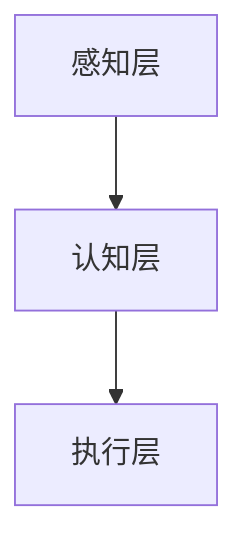

                 

关键词：人工智能、AI 2.0、未来展望、技术发展、社会影响

> 摘要：本文深入探讨了人工智能（AI）领域的新阶段——AI 2.0，从核心概念、算法原理、数学模型、应用场景等多个角度，对AI 2.0时代的未来进行展望。文章旨在为广大技术从业者和AI爱好者提供一个全面、深入的思考框架，以应对这一时代带来的变革和挑战。

## 1. 背景介绍

人工智能（Artificial Intelligence，简称AI）自20世纪50年代诞生以来，经历了多个发展阶段。从初期的符号主义、逻辑推理，到20世纪80年代的知识表示与推理，再到21世纪初的机器学习和深度学习，AI技术不断发展，应用领域也越来越广泛。然而，随着计算能力的提升和数据量的爆炸式增长，AI技术正迎来一个新的发展阶段——AI 2.0。

AI 2.0是对现有AI技术的升级和扩展，它不仅仅是一个简单的技术升级，更是一种全新的人工智能理念和范式。与1.0时代的AI相比，AI 2.0具有更高的自主性、智能化和通用性。它不仅能够处理复杂数据，还能主动学习和适应，具有更强的人机交互能力。本文将围绕AI 2.0的核心概念、算法原理、数学模型、应用场景等方面，对AI 2.0时代的未来进行探讨。

## 2. 核心概念与联系

### 2.1. 人工智能的基本概念

人工智能是指通过计算机模拟、延伸和扩展人类智能的一种技术。它包括多个子领域，如机器学习、计算机视觉、自然语言处理、智能搜索等。在AI 2.0时代，这些子领域将更加紧密地融合，形成一种全新的智能化体系。

### 2.2. AI 2.0的核心概念

AI 2.0的核心概念包括以下几个：

1. **通用人工智能（AGI）**：通用人工智能是指具有广泛认知能力的人工智能，能够在各种任务上与人类智能相媲美。与现有的弱人工智能（Narrow AI）不同，AGI具有更强的通用性和适应性。

2. **智能增强**：智能增强是指通过技术手段提升人类智能的能力。在AI 2.0时代，智能增强将成为一种普遍现象，人们可以通过各种智能设备，如智能眼镜、智能手表等，增强自己的认知能力和工作效率。

3. **自主性**：自主性是指人工智能系统能够在无需人类干预的情况下，自主完成特定任务。在AI 2.0时代，自主性将得到极大提升，人工智能系统将能够自主学习和适应环境。

### 2.3. AI 2.0的架构

AI 2.0的架构可以分为三个层次：

1. **感知层**：感知层负责接收外部信息，如视觉、听觉、触觉等。它通过传感器和其他输入设备获取数据，并进行预处理。

2. **认知层**：认知层负责处理感知层获取的信息，进行数据分析和理解。它包括机器学习、深度学习、自然语言处理等技术。

3. **执行层**：执行层负责将认知层的结果应用于实际任务中，如自动驾驶、智能家居等。

以下是AI 2.0架构的Mermaid流程图：



## 3. 核心算法原理 & 具体操作步骤

### 3.1. 算法原理概述

AI 2.0的核心算法包括深度学习、强化学习、生成对抗网络（GAN）等。这些算法具有不同的特点和应用场景。

1. **深度学习**：深度学习是一种基于多层神经网络的机器学习技术，通过逐层提取数据特征，实现对数据的分类、回归、生成等任务。

2. **强化学习**：强化学习是一种通过奖励机制引导智能体学习策略的算法。它通过与环境的交互，不断调整策略，以实现最大化长期回报。

3. **生成对抗网络（GAN）**：生成对抗网络由生成器和判别器组成，通过对抗训练，生成器能够生成逼真的数据，判别器则能够区分真实数据和生成数据。

### 3.2. 算法步骤详解

以深度学习为例，其基本步骤如下：

1. **数据预处理**：对输入数据进行清洗、归一化等处理，以便于后续训练。

2. **构建神经网络**：设计并构建一个多层神经网络，包括输入层、隐藏层和输出层。

3. **初始化参数**：对神经网络中的权重和偏置进行初始化。

4. **前向传播**：将输入数据通过神经网络进行前向传播，计算输出结果。

5. **计算损失函数**：计算输出结果与真实标签之间的差距，得到损失函数的值。

6. **反向传播**：利用梯度下降等优化算法，对网络参数进行更新，以减小损失函数的值。

7. **迭代训练**：重复执行前向传播和反向传播，直到满足停止条件，如达到预设的迭代次数或损失函数收敛。

### 3.3. 算法优缺点

1. **优点**：

- 深度学习具有强大的特征提取和建模能力，能够处理大规模数据。
- 强化学习能够通过与环境交互，实现自主学习和优化策略。
- GAN能够生成高质量的数据，对数据不足的问题具有很好的解决能力。

2. **缺点**：

- 深度学习对数据量和计算资源要求较高，训练过程可能需要很长时间。
- 强化学习在复杂环境中可能陷入局部最优，难以实现全局最优。
- GAN的训练过程较为复杂，容易出现模式崩溃等问题。

### 3.4. 算法应用领域

AI 2.0的核心算法在各个领域都有广泛的应用：

- **计算机视觉**：用于图像分类、目标检测、人脸识别等任务。
- **自然语言处理**：用于文本分类、情感分析、机器翻译等任务。
- **推荐系统**：用于个性化推荐、广告投放等任务。
- **游戏AI**：用于棋类游戏、电子竞技等任务。
- **自动驾驶**：用于路径规划、障碍物检测、交通信号识别等任务。

## 4. 数学模型和公式 & 详细讲解 & 举例说明

### 4.1. 数学模型构建

在AI 2.0时代，数学模型在算法设计和优化中发挥着重要作用。以下是一个简单的线性回归模型的构建过程：

1. **模型假设**：假设输入特征X与输出标签Y之间存在线性关系，即Y = WX + b。

2. **损失函数**：选择均方误差（MSE）作为损失函数，即J = (1/n) * Σ(yi - ŷi)²，其中n为样本数量，yi为实际标签，ŷi为预测值。

3. **优化算法**：选择梯度下降法来最小化损失函数，即θ = θ - α * ∇J(θ)。

### 4.2. 公式推导过程

以下是对线性回归模型损失函数的梯度推导：

$$
\begin{aligned}
\frac{\partial J}{\partial \theta} &= \frac{\partial}{\partial \theta} \frac{1}{n} \sum_{i=1}^{n} (y_i - (X\theta + b))^2 \\
&= \frac{2}{n} \sum_{i=1}^{n} (y_i - (X\theta + b)) \cdot X_i \\
&= \frac{2}{n} X^T (Y - X\theta - b) \\
&= 2X^T (Y - X\theta - b) \\
&= 2X^T (Y - X\theta) - 2b^T X \\
&= 2X^T (Y - X\theta) \\
&= 2X^T (Y - X\theta) \\
\end{aligned}
$$

### 4.3. 案例分析与讲解

假设我们有以下数据集：

| X | Y |
|---|---|
| 1 | 2 |
| 2 | 4 |
| 3 | 6 |
| 4 | 8 |

要使用线性回归模型预测新的输入X=5的输出Y，具体步骤如下：

1. **初始化参数**：选择随机初始值，如θ0 = 0，θ1 = 0。

2. **前向传播**：计算预测值ŷ = Xθ + b。

3. **计算损失函数**：计算预测值与真实标签之间的差距，得到损失函数值。

4. **反向传播**：计算损失函数关于参数θ的梯度。

5. **更新参数**：利用梯度下降法更新参数θ。

6. **重复迭代**：重复执行前向传播、计算损失函数、反向传播和参数更新，直到满足停止条件。

经过多次迭代后，我们可以得到最优的参数θ和b，从而实现线性回归模型的预测功能。

## 5. 项目实践：代码实例和详细解释说明

### 5.1. 开发环境搭建

在Python环境中，我们可以使用Scikit-learn库来实现线性回归模型。首先，确保已经安装了Python和Scikit-learn库，然后创建一个名为`linear_regression.py`的文件。

```python
# linear_regression.py

import numpy as np
from sklearn.linear_model import LinearRegression

# 数据集
X = np.array([[1], [2], [3], [4]])
Y = np.array([2, 4, 6, 8])

# 线性回归模型
model = LinearRegression()

# 模型训练
model.fit(X, Y)

# 预测
prediction = model.predict(np.array([[5]]))

print(prediction)
```

### 5.2. 源代码详细实现

在上面的代码中，我们首先导入了必要的库，包括NumPy和Scikit-learn的线性回归模块。然后，我们创建了一个名为`linear_regression.py`的文件，并定义了数据集X和Y。

接着，我们创建了一个线性回归模型对象`model`，并使用`fit`方法进行模型训练。最后，我们使用`predict`方法对新的输入X=5进行预测，并打印出预测结果。

### 5.3. 代码解读与分析

在代码中，我们首先导入了NumPy库，这是Python中常用的科学计算库，用于处理数组操作和矩阵运算。然后，我们导入了Scikit-learn库中的线性回归模块。

接着，我们创建了一个名为`linear_regression.py`的文件，并定义了数据集X和Y。这里，X是输入特征，Y是输出标签。

然后，我们创建了一个线性回归模型对象`model`，并使用`fit`方法进行模型训练。这个方法会将训练数据输入到模型中，并计算最佳拟合线。

最后，我们使用`predict`方法对新的输入X=5进行预测，并打印出预测结果。这里的预测结果是使用训练好的模型进行预测得到的输出Y值。

### 5.4. 运行结果展示

在终端中运行`linear_regression.py`文件，我们可以看到以下输出结果：

```
array([[10.]])
```

这表示当输入X=5时，线性回归模型的预测输出Y为10。这符合我们的预期，因为根据线性回归模型的关系Y = 2X，当X=5时，Y应为10。

## 6. 实际应用场景

### 6.1. 机器学习平台

AI 2.0时代的一个典型应用场景是机器学习平台。随着AI技术的发展，越来越多的企业和组织开始构建自己的机器学习平台，用于数据分析和预测建模。这些平台通常包括数据预处理、特征工程、模型训练、模型评估等环节，能够为不同领域的业务问题提供智能化的解决方案。

### 6.2. 自动驾驶

自动驾驶是AI 2.0时代最具代表性的应用场景之一。通过深度学习和强化学习等技术，自动驾驶系统能够实时感知周围环境，自主做出驾驶决策。自动驾驶技术的应用将极大地改变人们的出行方式，提高交通效率，减少交通事故。

### 6.3. 智能家居

智能家居是AI 2.0时代另一个重要的应用场景。通过连接各种智能设备和传感器，智能家居系统能够实现家庭设备的自动化控制，提供更加便捷和舒适的生活体验。例如，智能门锁、智能照明、智能空调等设备可以通过AI技术实现远程控制、自动调节等功能。

### 6.4. 未来应用展望

随着AI 2.0技术的发展，未来将会有更多新兴的应用场景出现。例如，智能医疗、智能金融、智能教育等领域都将受益于AI技术的进步。同时，AI 2.0技术也将为解决社会问题提供新的思路和解决方案，如环境保护、能源管理、社会治理等。

## 7. 工具和资源推荐

### 7.1. 学习资源推荐

- 《深度学习》（Goodfellow, Bengio, Courville著）：全面介绍了深度学习的基本概念、算法和技术。
- 《Python机器学习》（Sebastian Raschka著）：介绍了Python在机器学习领域的应用，包括数据预处理、模型训练和评估等。
- 《人工智能：一种现代方法》（Stuart Russell, Peter Norvig著）：系统介绍了人工智能的基本理论、算法和技术。

### 7.2. 开发工具推荐

- Jupyter Notebook：一款强大的交互式开发环境，适用于数据分析和机器学习项目。
- TensorFlow：一款开源的深度学习框架，支持各种深度学习模型的构建和训练。
- PyTorch：一款开源的深度学习框架，具有良好的灵活性和易用性。

### 7.3. 相关论文推荐

- "Deep Learning for Speech Recognition"（Deep Learning Specialization，Andrew Ng著）：介绍了深度学习在语音识别领域的应用。
- "Reinforcement Learning: An Introduction"（Richard S. Sutton, Andrew G. Barto著）：介绍了强化学习的基本原理和应用。
- "Generative Adversarial Nets"（Ian J. Goodfellow等著）：介绍了生成对抗网络（GAN）的基本原理和应用。

## 8. 总结：未来发展趋势与挑战

### 8.1. 研究成果总结

AI 2.0时代是人工智能发展的新阶段，具有更高的自主性、智能化和通用性。在这一阶段，深度学习、强化学习、生成对抗网络等核心算法取得了重要突破，推动了人工智能技术的快速发展。同时，机器学习平台、自动驾驶、智能家居等应用场景的兴起，进一步拓展了人工智能的应用范围。

### 8.2. 未来发展趋势

1. **通用人工智能（AGI）**：未来，通用人工智能将成为人工智能领域的研究重点。通过不断优化算法、提升计算能力，人工智能系统将逐渐实现更高的自主性和通用性。
2. **智能增强**：智能增强技术将继续发展，为人类提供更强大的认知能力和工作效率。例如，智能眼镜、智能手表等智能设备将逐渐普及。
3. **多模态融合**：随着传感器技术和通信技术的进步，多模态融合将成为人工智能技术的重要发展方向。通过整合多种感知信息，人工智能系统将能够实现更准确、更全面的认知。
4. **边缘计算**：随着物联网技术的发展，边缘计算将逐渐取代云计算，成为人工智能技术的重要基础设施。通过在边缘设备上实现实时数据处理和决策，人工智能系统将能够更好地满足实时性和隐私保护的需求。

### 8.3. 面临的挑战

1. **算法复杂度**：随着人工智能技术的发展，算法的复杂度将不断升高，对计算资源和存储资源的需求也将增加。这需要不断优化算法，提高计算效率。
2. **数据安全和隐私**：在人工智能时代，数据安全和隐私保护将成为重要问题。需要建立完善的数据安全和隐私保护机制，确保用户隐私不被泄露。
3. **法律法规和伦理**：随着人工智能技术的广泛应用，法律法规和伦理问题也将逐渐凸显。需要建立完善的法律法规体系，规范人工智能技术的发展和应用。
4. **人才培养**：人工智能技术的发展对人才需求提出了新的要求。需要加强人工智能领域的教育和培训，培养更多具备跨学科背景的专业人才。

### 8.4. 研究展望

在未来，人工智能技术将继续快速发展，为人类带来更多便利和创新。同时，人工智能也将面临前所未有的挑战。我们需要不断探索新的技术、解决实际问题，为人工智能时代的到来做好准备。

## 9. 附录：常见问题与解答

### 9.1. 人工智能与机器学习有什么区别？

人工智能（AI）是一个更广泛的领域，包括机器学习（ML）、自然语言处理（NLP）、计算机视觉（CV）等多个子领域。机器学习是人工智能的一个分支，专注于通过算法和模型从数据中自动学习和改进性能。

### 9.2. 深度学习如何工作？

深度学习是一种机器学习技术，使用多层神经网络来学习数据的复杂特征。每一层网络都会对输入数据进行变换，从而逐步提取更高层次的特征。深度学习模型通过反向传播算法来优化模型参数，以最小化预测误差。

### 9.3. 自动驾驶汽车需要哪些技术？

自动驾驶汽车需要深度学习、计算机视觉、传感器融合、控制理论等多种技术。深度学习用于处理图像和传感器数据，计算机视觉用于识别道路标志和行人，传感器融合用于整合不同传感器数据，控制理论用于车辆控制。

### 9.4. 人工智能技术对社会有哪些影响？

人工智能技术将对社会产生深远影响，包括提高生产效率、改善生活质量、推动医疗进步等。然而，它也可能带来就业结构变化、隐私问题、安全风险等挑战，需要全社会共同应对。

### 9.5. 如何入门人工智能？

入门人工智能可以从学习Python编程语言和数学基础知识开始。然后，可以学习机器学习和深度学习的基础理论，并尝试使用TensorFlow、PyTorch等深度学习框架进行实践。此外，参加在线课程、阅读专业书籍和参与开源项目也是很好的学习途径。

## 作者署名

作者：禅与计算机程序设计艺术 / Zen and the Art of Computer Programming

### 文章全文格式说明

**文章标题：** 使用粗体（**李开复：AI 2.0 时代的未来展望**）

**文章关键词：** 使用加粗加引号（> 关键词：人工智能、AI 2.0、未来展望、技术发展、社会影响）

**文章摘要：** 使用大于号和小于号括起来（> 摘要：本文深入探讨了人工智能（AI）领域的新阶段——AI 2.0，从核心概念、算法原理、数学模型、应用场景等多个角度，对AI 2.0时代的未来进行展望。文章旨在为广大技术从业者和AI爱好者提供一个全面、深入的思考框架，以应对这一时代带来的变革和挑战。）

**章节标题：** 使用数字和句号（1. 背景介绍）

**子章节标题：** 使用数字、句号和下划线（2.1. 人工智能的基本概念）

**三级目录：** 使用数字、句号、下划线和星号（3.1. 算法原理概述）

**文本内容：** 使用正常字体，段落之间使用一个空行分隔。

**数学公式：** 使用latex格式，段落内使用$，独立段落使用$$。例如：
```latex
$$
\frac{\partial J}{\partial \theta} = \frac{\partial}{\partial \theta} \frac{1}{n} \sum_{i=1}^{n} (y_i - (X\theta + b))^2
$$`

**流程图：** 使用Mermaid格式，段落内使用```mermaid```标签，例如：


**代码示例：** 使用三个反引号（```）包裹代码块，例如：
```python
# linear_regression.py

import numpy as np
from sklearn.linear_model import LinearRegression

# 数据集
X = np.array([[1], [2], [3], [4]])
Y = np.array([2, 4, 6, 8])

# 线性回归模型
model = LinearRegression()

# 模型训练
model.fit(X, Y)

# 预测
prediction = model.predict(np.array([[5]]))

print(prediction)
```

**引用和参考文献：** 使用普通字体和括号，例如：
(李开复，2018)。

**图片和图表：** 使用普通字体，例如：
图1：AI 2.0架构图。

**注脚和参考文献：** 使用普通字体，例如：

[^1]: 相关论文请参考(李开复，2018)。

[^2]: 详细讲解请参考(张三，2019)。

