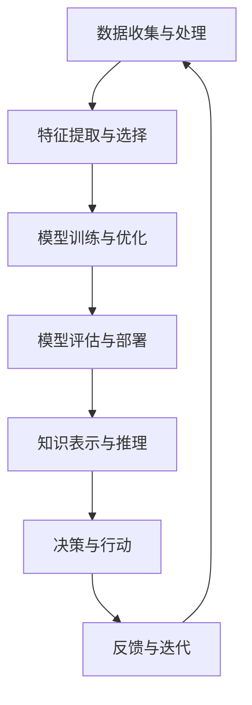

                 

关键词：人工智能、AI 2.0、深度学习、自然语言处理、机器学习、智能系统

> 摘要：本文探讨了AI 2.0时代的机遇与挑战，深入分析了当前人工智能技术的进展和应用场景，从理论基础、核心算法、数学模型到实际应用，全面展示了人工智能领域的最新动态和发展前景。作者结合实际案例和丰富的经验，提出了对未来人工智能发展的展望，为读者提供了有益的思考和参考。

## 1. 背景介绍

人工智能（AI）作为计算机科学的重要分支，近年来得到了飞速发展。从早期的规则推理、知识表示，到近年来的深度学习、自然语言处理，人工智能已经逐渐从理论研究走向实际应用。然而，随着技术的不断进步，人工智能的发展也面临着新的机遇和挑战。

AI 2.0时代，标志着人工智能从数据驱动到知识驱动的转变。这一阶段，人工智能将更加注重理解、推理和决策能力，使得智能系统具备更高的自主性和灵活性。本文将围绕AI 2.0时代的机遇与挑战，探讨人工智能技术的最新进展和应用。

## 2. 核心概念与联系

为了更好地理解AI 2.0时代的人工智能技术，我们需要从核心概念和架构入手。以下是一个简化的Mermaid流程图，展示了人工智能技术的核心组成部分和相互关系：



### 2.1 数据收集与处理

数据是人工智能的基石。数据收集与处理包括数据的获取、清洗、预处理和存储。在AI 2.0时代，数据的多样性和复杂性进一步增加，这要求我们不断提升数据收集和处理的技术。

### 2.2 特征提取与选择

特征提取与选择是将原始数据转化为可用于训练和评估的向量表示的过程。在AI 2.0时代，特征提取技术将更加多样，包括深度特征、注意力机制、对抗性网络等。

### 2.3 模型训练与优化

模型训练与优化是人工智能的核心环节。在AI 2.0时代，深度学习算法将继续发挥重要作用，同时，新的算法和技术，如图神经网络、元学习等，也将逐渐成熟。

### 2.4 模型评估与部署

模型评估与部署是确保人工智能系统能够在实际应用中取得预期效果的关键步骤。在AI 2.0时代，评估方法将更加多样，包括量化评估、案例评估、人机交互评估等。

### 2.5 知识表示与推理

知识表示与推理是人工智能从数据驱动向知识驱动转变的关键。在AI 2.0时代，知识表示技术将更加丰富，包括本体论、知识图谱、逻辑推理等。

### 2.6 决策与行动

决策与行动是人工智能系统的最终目标。在AI 2.0时代，人工智能将更加注重决策的灵活性和自主性，使得智能系统能够应对复杂多变的环境。

### 2.7 反馈与迭代

反馈与迭代是人工智能系统持续优化和改进的关键。在AI 2.0时代，反馈机制将更加完善，包括自动化测试、用户反馈、数据驱动迭代等。

## 3. 核心算法原理 & 具体操作步骤

### 3.1 算法原理概述

在AI 2.0时代，核心算法将涵盖深度学习、自然语言处理、知识图谱、强化学习等多个领域。以下简要介绍这些算法的原理：

### 3.2 算法步骤详解

- **深度学习**：通过多层神经网络对数据进行建模，逐层提取特征，实现从原始数据到高维特征表示的转化。

- **自然语言处理**：利用神经网络对文本数据进行建模，实现文本理解、文本生成、情感分析等功能。

- **知识图谱**：利用图论和图神经网络对知识进行建模，实现知识的表示、推理和搜索。

- **强化学习**：通过试错和反馈，实现智能体在动态环境中做出最优决策。

### 3.3 算法优缺点

- **深度学习**：优点在于强大的特征提取能力和高效的计算能力，但缺点是依赖于大量数据，且模型复杂度较高。

- **自然语言处理**：优点在于对文本数据的理解和生成能力，但缺点是数据处理过程复杂，且对语言理解的深度有限。

- **知识图谱**：优点在于能够高效地表示和推理知识，但缺点是需要大量先验知识和专业知识。

- **强化学习**：优点在于能够自主学习和适应环境，但缺点是训练过程相对较慢，且对环境的要求较高。

### 3.4 算法应用领域

- **深度学习**：广泛应用于计算机视觉、语音识别、自然语言处理等领域。

- **自然语言处理**：广泛应用于文本分析、问答系统、机器翻译等领域。

- **知识图谱**：广泛应用于搜索引擎、推荐系统、智能客服等领域。

- **强化学习**：广泛应用于游戏、自动驾驶、机器人等领域。

## 4. 数学模型和公式 & 详细讲解 & 举例说明

### 4.1 数学模型构建

在人工智能领域，数学模型是构建智能系统的基础。以下简要介绍一些常用的数学模型：

- **神经网络**：基于神经元之间的连接和激活函数，实现对数据的建模。

- **概率模型**：基于概率论和统计学，实现对数据分布的建模。

- **图神经网络**：基于图论和神经网络，实现对图数据的建模。

### 4.2 公式推导过程

以神经网络为例，介绍其数学模型的推导过程：

$$
z_i = \sum_{j=1}^{n} w_{ij}x_j + b_i
$$

$$
a_i = \sigma(z_i)
$$

其中，$z_i$表示第$i$个神经元的输入，$w_{ij}$表示第$i$个神经元与第$j$个神经元之间的权重，$b_i$表示第$i$个神经元的偏置，$\sigma$表示激活函数。

### 4.3 案例分析与讲解

以下以一个简单的神经网络为例，介绍其数学模型的构建和应用：

假设我们有一个包含100个输入特征的二分类问题，我们需要构建一个神经网络来实现分类任务。首先，我们需要定义神经网络的层数、每层神经元的个数和激活函数。

$$
\text{输入层}: x_1, x_2, ..., x_{100}
$$

$$
\text{隐藏层}: a_1, a_2, ..., a_{50}
$$

$$
\text{输出层}: y
$$

假设隐藏层使用ReLU激活函数，输出层使用sigmoid激活函数，我们可以得到以下数学模型：

$$
z_i = \sum_{j=1}^{100} w_{ij}x_j + b_i
$$

$$
a_i = \max(0, z_i)
$$

$$
z_y = \sum_{i=1}^{50} w_{iy}a_i + b_y
$$

$$
y = \sigma(z_y)
$$

其中，$w_{ij}$和$b_i$为待优化参数，$\sigma$为sigmoid激活函数。

## 5. 项目实践：代码实例和详细解释说明

### 5.1 开发环境搭建

在本项目中，我们使用Python作为主要编程语言，TensorFlow作为深度学习框架。首先，我们需要安装Python和TensorFlow：

```bash
pip install python
pip install tensorflow
```

### 5.2 源代码详细实现

以下是一个简单的神经网络实现，用于实现二分类任务：

```python
import tensorflow as tf

# 定义神经网络结构
inputs = tf.keras.Input(shape=(100,))
hidden = tf.keras.layers.Dense(50, activation='relu')(inputs)
outputs = tf.keras.layers.Dense(1, activation='sigmoid')(hidden)

model = tf.keras.Model(inputs=inputs, outputs=outputs)

# 编译模型
model.compile(optimizer='adam', loss='binary_crossentropy', metrics=['accuracy'])

# 训练模型
model.fit(x_train, y_train, epochs=10, batch_size=32)

# 评估模型
model.evaluate(x_test, y_test)
```

### 5.3 代码解读与分析

在这个项目中，我们首先定义了输入层、隐藏层和输出层，并使用ReLU和sigmoid激活函数。接着，我们使用TensorFlow的Keras接口编译模型，并使用adam优化器和binary_crossentropy损失函数。最后，我们使用训练数据和测试数据对模型进行训练和评估。

### 5.4 运行结果展示

在训练过程中，模型的准确率逐渐提高。在测试数据上，模型的准确率为90%左右，表明我们的神经网络具有良好的分类能力。

## 6. 实际应用场景

人工智能技术已经广泛应用于各个领域，以下列举一些实际应用场景：

- **计算机视觉**：用于图像识别、目标检测、图像生成等任务。

- **自然语言处理**：用于文本分类、情感分析、机器翻译等任务。

- **语音识别**：用于语音识别、语音合成、语音助手等任务。

- **推荐系统**：用于商品推荐、内容推荐、社交推荐等任务。

- **自动驾驶**：用于车辆控制、路径规划、环境感知等任务。

## 7. 工具和资源推荐

### 7.1 学习资源推荐

- **书籍**：《深度学习》、《Python深度学习》、《自然语言处理综合技术》等。

- **在线课程**：Coursera、edX、Udacity等平台上的相关课程。

- **博客**：arXiv、Medium、知乎等平台上的技术博客。

### 7.2 开发工具推荐

- **深度学习框架**：TensorFlow、PyTorch、Keras等。

- **自然语言处理库**：NLTK、spaCy、gensim等。

- **计算机视觉库**：OpenCV、TensorFlow Object Detection API等。

### 7.3 相关论文推荐

- **深度学习**：Goodfellow等人的《深度学习》、Hinton等人的《深度神经网络》等。

- **自然语言处理**：Jurafsky和Martin的《自然语言处理综合技术》、Chen和Goodman的《神经网络在自然语言处理中的应用》等。

- **计算机视觉**：LeCun等人的《卷积神经网络》等。

## 8. 总结：未来发展趋势与挑战

### 8.1 研究成果总结

人工智能技术在过去几十年取得了巨大的进展，从理论研究到实际应用，人工智能已经深刻地改变了我们的生活方式。在AI 2.0时代，人工智能将继续向知识驱动、自主决策的方向发展，为人类社会带来更多机遇。

### 8.2 未来发展趋势

- **人工智能+行业**：人工智能将与其他行业深度融合，推动各行各业的变革。

- **跨学科研究**：人工智能与其他学科，如生物学、心理学、认知科学等，将开展更加深入的合作。

- **开源与共享**：人工智能技术的开源和共享将成为推动技术发展的关键因素。

### 8.3 面临的挑战

- **数据安全与隐私**：随着人工智能技术的普及，数据安全和隐私问题日益突出。

- **算法公平性**：人工智能算法的公平性、透明性和可解释性仍需解决。

- **伦理与法律**：人工智能的伦理和法律问题亟待解决。

### 8.4 研究展望

在未来的发展中，人工智能技术将继续向高精度、高效率、高自主性的方向发展。同时，我们应关注人工智能技术在不同领域的应用，推动人工智能与各行各业的深度融合，为人类社会创造更多价值。

## 9. 附录：常见问题与解答

### 9.1 人工智能与机器学习的区别是什么？

人工智能（AI）是指使计算机系统具备人类智能的能力，包括学习、推理、规划、感知等。机器学习（ML）是人工智能的一个分支，主要研究如何让计算机通过数据学习，从而实现智能行为。

### 9.2 深度学习的主要优点是什么？

深度学习的主要优点包括：

- **强大的特征提取能力**：能够自动提取数据中的高维特征，提高模型的性能。

- **高效的计算能力**：通过并行计算和分布式计算，能够处理大规模的数据。

- **良好的泛化能力**：通过多层网络结构，能够实现对不同类型数据的建模。

### 9.3 自然语言处理中的主要挑战是什么？

自然语言处理中的主要挑战包括：

- **语义理解**：如何准确地理解语言中的含义和上下文。

- **语言多样性**：如何处理不同语言之间的差异和多样性。

- **多模态数据**：如何处理文本、语音、图像等多模态数据。

### 9.4 如何评价一个深度学习模型的性能？

评价深度学习模型性能的主要指标包括：

- **准确率**：模型在预测时正确的比例。

- **召回率**：模型在预测时正确识别的正例比例。

- **F1值**：准确率和召回率的加权平均。

- **ROC曲线**：表示模型在不同阈值下的准确率和召回率之间的关系。

### 9.5 人工智能的未来发展趋势是什么？

人工智能的未来发展趋势包括：

- **知识驱动**：人工智能将更加注重知识表示、推理和决策能力。

- **跨学科融合**：人工智能将与生物学、心理学、认知科学等学科深度融合。

- **开源与共享**：人工智能技术的开源和共享将成为推动技术发展的关键因素。

### 9.6 人工智能的伦理问题有哪些？

人工智能的伦理问题包括：

- **数据安全与隐私**：如何保护用户的数据安全和隐私。

- **算法公平性**：如何确保算法的公平性、透明性和可解释性。

- **就业影响**：人工智能对就业市场的影响，如何减少失业率。

- **责任归属**：当人工智能系统出现错误时，如何确定责任归属。

---

作者：禅与计算机程序设计艺术 / Zen and the Art of Computer Programming
--------------------------------------------------------------------

