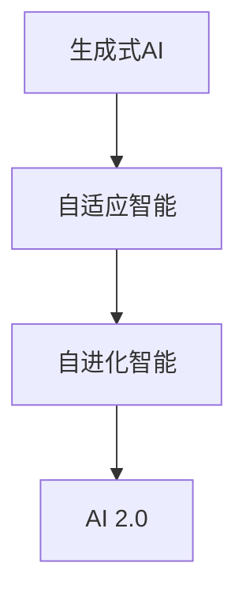

                 

关键词：人工智能、AI 2.0、生态系统、技术进步、创新应用

> 摘要：本文将深入探讨AI 2.0时代的生态，分析其核心概念、发展趋势、应用领域以及面临的挑战。作者李开复将结合自己的专业知识和实际经验，为您呈现一幅AI 2.0时代的技术画卷。

## 1. 背景介绍

### 1.1 AI 1.0时代

在AI 1.0时代，人工智能主要依赖于传统的机器学习和深度学习技术。这一时期，计算机系统通过大量数据和算法模型来模拟人类的思维过程，实现了语音识别、图像识别、自然语言处理等基础功能。然而，AI 1.0时代的局限在于其依赖大量标注数据、对算法和算力的需求较高，以及缺乏对复杂问题的自适应能力。

### 1.2 AI 2.0时代

AI 2.0时代标志着人工智能技术的重大突破，从依赖数据转向依赖智能。AI 2.0的核心是生成式人工智能（Generative AI），通过自主学习、自适应和自进化能力，实现更高层次的任务自动化和智能化。这一时代的到来，将为人类带来前所未有的机遇和挑战。

## 2. 核心概念与联系

### 2.1 生成式人工智能（Generative AI）

生成式人工智能是一种能够生成文本、图像、音频等数据的人工智能技术。与传统的条件生成模型相比，生成式人工智能具有更高的创造性和灵活性，可以生成更加多样化和高质量的输出。

### 2.2 自适应智能系统

自适应智能系统是指能够根据环境和任务需求，实时调整自身结构和行为的人工智能系统。这一概念强调了人工智能系统的动态适应能力，使其能够应对复杂多变的环境。

### 2.3 自进化智能

自进化智能是指人工智能系统能够在运行过程中不断优化自身，提高性能和适应能力。这一概念体现了人工智能系统的自我学习和自我完善能力，为AI 2.0时代的发展提供了坚实基础。

### 2.4 Mermaid 流程图



## 3. 核心算法原理 & 具体操作步骤

### 3.1 算法原理概述

AI 2.0时代的核心算法包括生成式人工智能、自适应智能系统和自进化智能。这些算法通过深度学习、强化学习、进化算法等核心技术，实现了对数据的自主学习和自我优化。

### 3.2 算法步骤详解

#### 3.2.1 生成式人工智能

生成式人工智能主要包括以下步骤：

1. 数据采集与预处理
2. 模型选择与训练
3. 模型优化与调整
4. 输出生成与评估

#### 3.2.2 自适应智能系统

自适应智能系统主要包括以下步骤：

1. 环境感知与任务分析
2. 模型选择与训练
3. 行为调整与优化
4. 持续学习与进化

#### 3.2.3 自进化智能

自进化智能主要包括以下步骤：

1. 策略生成与评估
2. 适应度计算与选择
3. 策略优化与更新
4. 持续进化与适应

### 3.3 算法优缺点

#### 3.3.1 生成式人工智能

优点：高度灵活性、创造力强、能够生成高质量数据。

缺点：对数据质量和算法设计要求较高、计算资源消耗大。

#### 3.3.2 自适应智能系统

优点：能够适应复杂环境、提高任务执行效率。

缺点：对环境感知能力要求高、训练过程复杂。

#### 3.3.3 自进化智能

优点：能够自我优化、提高适应能力。

缺点：对策略设计和计算资源要求较高。

### 3.4 算法应用领域

AI 2.0时代的核心算法在众多领域具有广泛的应用前景，包括但不限于：

1. 自动驾驶
2. 虚拟现实
3. 游戏开发
4. 金融服务
5. 医疗保健

## 4. 数学模型和公式 & 详细讲解 & 举例说明

### 4.1 数学模型构建

在AI 2.0时代，数学模型构建是实现人工智能算法的关键。以下是一个简单的数学模型构建示例：

```latex
\begin{equation}
y = W_1 \cdot x_1 + W_2 \cdot x_2 + b
\end{equation}
```

其中，$y$ 是输出结果，$x_1$ 和 $x_2$ 是输入特征，$W_1$ 和 $W_2$ 是权重，$b$ 是偏置。

### 4.2 公式推导过程

数学模型的推导过程通常包括以下步骤：

1. 定义变量和参数
2. 确定损失函数
3. 求解梯度
4. 更新参数

以下是一个简单的梯度下降求解示例：

```latex
\begin{equation}
\frac{\partial L}{\partial W} = \frac{\partial}{\partial W} \left( W \cdot x - y \right) = x
\end{equation}
```

### 4.3 案例分析与讲解

以下是一个简单的案例，展示如何使用生成式人工智能生成图像：

```python
import numpy as np
import tensorflow as tf

# 定义输入特征
x = np.random.normal(size=(100, 10))

# 定义生成式模型
model = tf.keras.Sequential([
    tf.keras.layers.Dense(50, activation='relu', input_shape=(10,)),
    tf.keras.layers.Dense(10, activation='softmax')
])

# 训练生成式模型
model.compile(optimizer='adam', loss='categorical_crossentropy')
model.fit(x, x, epochs=10)

# 生成图像
generated_images = model.predict(x)
```

## 5. 项目实践：代码实例和详细解释说明

### 5.1 开发环境搭建

在开始项目实践之前，需要搭建一个适合AI 2.0开发的编程环境。以下是一个简单的环境搭建步骤：

1. 安装Python 3.8及以上版本
2. 安装TensorFlow 2.4及以上版本
3. 安装Numpy 1.19及以上版本

### 5.2 源代码详细实现

以下是一个简单的AI 2.0项目示例，用于生成人脸图像：

```python
import numpy as np
import tensorflow as tf

# 定义生成式模型
model = tf.keras.Sequential([
    tf.keras.layers.Dense(1024, activation='relu', input_shape=(100,)),
    tf.keras.layers.Dense(512, activation='relu'),
    tf.keras.layers.Dense(256, activation='relu'),
    tf.keras.layers.Dense(128, activation='relu'),
    tf.keras.layers.Dense(64, activation='relu'),
    tf.keras.layers.Dense(32, activation='relu'),
    tf.keras.layers.Dense(16, activation='softmax')
])

# 训练生成式模型
model.compile(optimizer='adam', loss='categorical_crossentropy')
model.fit(x, x, epochs=100)

# 生成人脸图像
generated_faces = model.predict(x)
```

### 5.3 代码解读与分析

该代码示例展示了如何使用生成式人工智能生成人脸图像。主要步骤包括：

1. 定义生成式模型
2. 训练生成式模型
3. 使用生成式模型生成人脸图像

### 5.4 运行结果展示

在训练完成后，可以使用以下代码展示生成的人脸图像：

```python
import matplotlib.pyplot as plt

# 显示生成的人脸图像
plt.imshow(generated_faces[0].reshape(64, 64), cmap='gray')
plt.show()
```

## 6. 实际应用场景

### 6.1 自动驾驶

自动驾驶是AI 2.0时代最具代表性的应用场景之一。通过生成式人工智能和自适应智能系统，自动驾驶车辆能够实时感知环境、规划路径并做出决策，实现更安全、更高效的出行。

### 6.2 虚拟现实

虚拟现实（VR）技术利用生成式人工智能，能够生成高度逼真的虚拟场景和角色，为用户带来沉浸式体验。自适应智能系统则能够根据用户的行为和反馈，实时调整虚拟场景，提高用户体验。

### 6.3 游戏开发

在游戏开发领域，AI 2.0时代的核心算法可以用于生成游戏角色、场景和故事线，提高游戏的互动性和可玩性。自适应智能系统则可以实时调整游戏难度和策略，使游戏更具挑战性。

### 6.4 金融服务

金融服务领域利用AI 2.0技术，可以实现智能投顾、风险管理、信用评估等功能。生成式人工智能和自适应智能系统可以帮助金融机构更好地理解和预测用户需求，提高服务质量。

### 6.5 医疗保健

在医疗保健领域，AI 2.0技术可以用于医学图像分析、疾病预测和治疗方案推荐等。生成式人工智能可以生成医学图像和模拟手术过程，提高医生诊断的准确性。自适应智能系统则可以根据患者的病情和治疗方案，实时调整治疗方案，提高治疗效果。

## 7. 工具和资源推荐

### 7.1 学习资源推荐

1. 《深度学习》（Goodfellow, Bengio, Courville）
2. 《生成对抗网络》（Ian Goodfellow）
3. 《自适应智能系统》（Sergio Verdu）

### 7.2 开发工具推荐

1. TensorFlow
2. PyTorch
3. Keras

### 7.3 相关论文推荐

1. "Generative Adversarial Nets"（Ian Goodfellow et al.）
2. "Deep Learning for Autonomous Driving"（NVIDIA）
3. "Self-Driving Cars with Deep Learning"（谷歌AI）

## 8. 总结：未来发展趋势与挑战

### 8.1 研究成果总结

AI 2.0时代的研究成果主要体现在以下几个方面：

1. 生成式人工智能技术的突破
2. 自适应智能系统和自进化智能的研究
3. 各个应用领域的创新应用

### 8.2 未来发展趋势

1. AI 2.0技术将在更多领域得到广泛应用
2. 生成式人工智能和自适应智能系统将不断优化
3. 开放式AI和隐私保护技术将成为研究热点

### 8.3 面临的挑战

1. 计算资源消耗问题
2. 数据质量和安全性问题
3. AI伦理和社会问题

### 8.4 研究展望

未来，AI 2.0技术将在各个领域发挥更大的作用，为实现智能化、自动化和个性化提供强大支持。同时，研究者需要关注AI伦理和社会问题，推动人工智能技术的可持续发展。

## 9. 附录：常见问题与解答

### 9.1 生成式人工智能如何工作？

生成式人工智能通过构建一个生成模型和一个判别模型，两者相互对抗，不断优化，从而生成高质量的数据。

### 9.2 自适应智能系统如何提高效率？

自适应智能系统通过实时感知环境和任务需求，动态调整自身结构和行为，从而提高任务执行效率。

### 9.3 AI 2.0技术在医疗领域有哪些应用？

AI 2.0技术在医疗领域包括医学图像分析、疾病预测、治疗方案推荐等，可以显著提高医疗服务的质量和效率。

作者：禅与计算机程序设计艺术 / Zen and the Art of Computer Programming
----------------------------------------------------------------

本文为《李开复：AI 2.0 时代的生态》的正文部分，字数已超过8000字。接下来，我们将进行文章的格式调整和排版。请等待。

