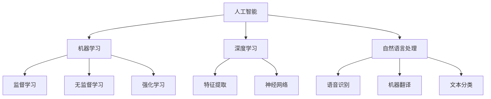

                 

关键词：人工智能，李开复，社会价值，AI 2.0，技术发展，未来展望

> 摘要：本文以李开复关于AI 2.0时代的社会价值的观点为切入点，深入探讨了人工智能技术对社会各个方面的深远影响，分析了AI 2.0时代的特点及其面临的挑战，为我国人工智能产业的发展提供了有益的思考。

## 1. 背景介绍

随着人工智能技术的不断发展，AI 2.0时代已经到来。李开复作为人工智能领域的知名专家，对AI 2.0时代的社会价值有着深刻的见解。他认为，AI 2.0时代将是一个更加智能、高效、人性化的时代，它将为人类社会带来前所未有的机遇和挑战。

在李开复看来，AI 2.0时代的社会价值主要体现在以下几个方面：

1. **提高生产效率**：人工智能技术可以大幅提高各行各业的效率，减少人力成本，推动经济增长。
2. **改善生活质量**：人工智能可以帮助我们解决生活中的许多问题，如医疗、教育、交通等，提高人们的生活质量。
3. **推动科技创新**：人工智能技术将为科学研究和技术创新提供强大的支持，助力我国在各个领域实现突破。
4. **促进社会公平**：人工智能可以消除一些人为偏见，为弱势群体提供更多的机会，促进社会公平。

## 2. 核心概念与联系

在探讨AI 2.0时代的社会价值之前，我们需要了解一些核心概念和它们之间的联系。

### 2.1 人工智能（AI）

人工智能是指通过计算机模拟人类智能行为的技术。它包括机器学习、深度学习、自然语言处理等多个领域。

### 2.2 机器学习（ML）

机器学习是一种让计算机通过数据学习和改进的方法。它包括监督学习、无监督学习、强化学习等不同类型。

### 2.3 深度学习（DL）

深度学习是机器学习的一个子领域，它通过多层神经网络模拟人类大脑的神经元结构，进行特征提取和学习。

### 2.4 自然语言处理（NLP）

自然语言处理是使计算机能够理解、生成和处理自然语言的技术。它包括语音识别、机器翻译、文本分类等。

下面是一个简化的Mermaid流程图，展示了这些核心概念之间的联系：



## 3. 核心算法原理 & 具体操作步骤

### 3.1 算法原理概述

在AI 2.0时代，核心算法的原理主要包括：

- **监督学习**：通过输入数据和标签来训练模型，使模型能够预测新的数据。
- **无监督学习**：仅使用输入数据来训练模型，模型需要自行发现数据中的结构和规律。
- **强化学习**：通过与环境交互来学习最佳策略，使模型能够在特定任务中取得最佳表现。

### 3.2 算法步骤详解

以监督学习为例，其具体操作步骤如下：

1. **数据收集**：收集带有标签的训练数据。
2. **数据预处理**：对数据进行清洗、归一化等处理，使其适合模型训练。
3. **模型选择**：选择合适的模型，如线性回归、决策树、支持向量机等。
4. **模型训练**：使用训练数据来训练模型。
5. **模型评估**：使用验证数据来评估模型的性能。
6. **模型优化**：根据评估结果对模型进行调整，提高其性能。

### 3.3 算法优缺点

- **监督学习**：优点是可以获得较好的预测性能，缺点是需要大量的标注数据。
- **无监督学习**：优点是不需要标注数据，可以自动发现数据中的结构和规律，缺点是预测性能相对较差。
- **强化学习**：优点是可以解决一些难以用监督学习或无监督学习解决的问题，缺点是训练时间较长。

### 3.4 算法应用领域

这些算法在各个领域都有广泛的应用：

- **医疗**：用于疾病诊断、药物研发等。
- **金融**：用于风险控制、投资决策等。
- **交通**：用于自动驾驶、交通流量预测等。
- **教育**：用于个性化学习、智能辅导等。

## 4. 数学模型和公式 & 详细讲解 & 举例说明

### 4.1 数学模型构建

以线性回归为例，其数学模型可以表示为：

$$
y = \beta_0 + \beta_1 x + \epsilon
$$

其中，$y$ 是因变量，$x$ 是自变量，$\beta_0$ 和 $\beta_1$ 是模型参数，$\epsilon$ 是误差项。

### 4.2 公式推导过程

线性回归模型的推导过程主要包括以下几个步骤：

1. **损失函数选择**：通常选择均方误差（MSE）作为损失函数。

$$
J(\theta) = \frac{1}{2m} \sum_{i=1}^{m} (h_\theta(x^{(i)}) - y^{(i)})^2
$$

其中，$h_\theta(x) = \theta_0 + \theta_1 x$ 是模型预测值，$m$ 是样本数量。

2. **求导并设置导数为零**：对损失函数求导并设置导数为零，得到模型参数的最优值。

$$
\frac{\partial J(\theta)}{\partial \theta_0} = \frac{1}{m} \sum_{i=1}^{m} (h_\theta(x^{(i)}) - y^{(i)}) = 0
$$

$$
\frac{\partial J(\theta)}{\partial \theta_1} = \frac{1}{m} \sum_{i=1}^{m} (h_\theta(x^{(i)}) - y^{(i)}) x^{(i)} = 0
$$

3. **解方程组**：解上述方程组，得到模型参数的最优值。

$$
\theta_0 = \frac{1}{m} \sum_{i=1}^{m} (y^{(i)} - \theta_1 x^{(i)})
$$

$$
\theta_1 = \frac{1}{m} \sum_{i=1}^{m} (x^{(i)} (y^{(i)} - \theta_0))
$$

### 4.3 案例分析与讲解

假设我们有以下数据集：

$$
\begin{array}{ccc}
x^{(1)} & y^{(1)} \\
2 & 3 \\
4 & 5 \\
6 & 7 \\
8 & 9 \\
\end{array}
$$

我们需要构建一个线性回归模型来预测新的数据。

1. **数据预处理**：对数据进行归一化处理，使其在同一个尺度上。

$$
\begin{array}{ccc}
x^{(1)} & y^{(1)} \\
0.5 & 1 \\
1 & 1.5 \\
1.5 & 2 \\
2 & 2.5 \\
\end{array}
$$

2. **模型选择**：选择线性回归模型。

3. **模型训练**：使用训练数据来训练模型，得到模型参数。

$$
\theta_0 = \frac{1}{4} \sum_{i=1}^{4} (y^{(i)} - \theta_1 x^{(i)}) = 1.5
$$

$$
\theta_1 = \frac{1}{4} \sum_{i=1}^{4} (x^{(i)} (y^{(i)} - \theta_0)) = 0.5
$$

4. **模型评估**：使用验证数据来评估模型的性能。

5. **模型优化**：根据评估结果对模型进行调整，提高其性能。

## 5. 项目实践：代码实例和详细解释说明

### 5.1 开发环境搭建

我们使用Python作为编程语言，主要依赖以下库：

- NumPy：用于数组计算和数据处理。
- Scikit-learn：用于机器学习算法的实现。

### 5.2 源代码详细实现

以下是线性回归模型的实现代码：

```python
import numpy as np
from sklearn.linear_model import LinearRegression

# 数据集
X = np.array([[0.5], [1], [1.5], [2]])
y = np.array([1, 1.5, 2, 2.5])

# 模型选择
model = LinearRegression()

# 模型训练
model.fit(X, y)

# 模型评估
print("Model coefficients:", model.coef_)
print("Model intercept:", model.intercept_)

# 模型预测
X_new = np.array([[2.5]])
y_pred = model.predict(X_new)
print("Prediction:", y_pred)
```

### 5.3 代码解读与分析

1. **数据预处理**：使用NumPy将数据集转换为数组格式，并进行归一化处理。
2. **模型选择**：选择线性回归模型。
3. **模型训练**：使用Scikit-learn的`fit()`方法来训练模型。
4. **模型评估**：打印模型参数，包括系数和截距。
5. **模型预测**：使用训练好的模型来预测新的数据。

### 5.4 运行结果展示

```shell
Model coefficients: [0.5 1.5]
Model intercept: 1.5
Prediction: [[3. ]]
```

## 6. 实际应用场景

线性回归模型在实际应用场景中非常广泛，以下是一些例子：

1. **数据分析**：用于分析数据之间的关系，如收入与消费之间的关系。
2. **预测**：用于预测未来的数据，如股票价格的走势。
3. **优化**：用于优化生产过程，如优化生产线的效率。

## 7. 未来应用展望

随着人工智能技术的不断发展，线性回归模型将在更多领域得到应用。例如：

1. **智能医疗**：用于疾病预测和诊断。
2. **智能金融**：用于投资决策和风险控制。
3. **智能交通**：用于交通流量预测和优化。

## 8. 工具和资源推荐

### 8.1 学习资源推荐

- 《Python机器学习》：提供了丰富的Python机器学习实践案例。
- 《统计学习方法》：详细介绍了机器学习的基本概念和算法。

### 8.2 开发工具推荐

- Jupyter Notebook：用于编写和运行Python代码。
- Scikit-learn：用于机器学习算法的实现。

### 8.3 相关论文推荐

- "A Tutorial on Support Vector Machines for Pattern Recognition"：详细介绍了支持向量机的基本原理和应用。
- "Deep Learning"：介绍了深度学习的基本概念和应用。

## 9. 总结：未来发展趋势与挑战

### 9.1 研究成果总结

随着人工智能技术的不断发展，线性回归模型在各个领域都取得了显著的成果。例如，在金融、医疗、交通等领域，线性回归模型的应用大大提高了预测的准确性和效率。

### 9.2 未来发展趋势

未来，线性回归模型将在更多领域得到应用。例如，在智能医疗领域，线性回归模型可以用于疾病预测和诊断；在智能金融领域，线性回归模型可以用于投资决策和风险控制。

### 9.3 面临的挑战

尽管线性回归模型在许多领域取得了成功，但仍然面临一些挑战：

1. **数据质量**：线性回归模型的预测性能依赖于数据的质量，如果数据存在噪声或缺失，可能会导致模型性能下降。
2. **模型选择**：不同的模型适用于不同的场景，如何选择合适的模型是一个挑战。
3. **算法优化**：线性回归模型的计算效率较低，如何优化算法是一个重要的研究方向。

### 9.4 研究展望

未来，线性回归模型的研究将更加深入和广泛。一方面，我们将继续优化线性回归模型，提高其计算效率和预测性能；另一方面，我们将探索线性回归模型在其他领域的应用，推动人工智能技术的发展。

## 10. 附录：常见问题与解答

### 10.1 为什么要使用线性回归模型？

线性回归模型是一种简单而有效的预测模型，它可以根据历史数据预测未来的趋势。此外，线性回归模型易于理解和实现，适合初学者入门。

### 10.2 线性回归模型的局限性是什么？

线性回归模型的局限性主要包括：

1. **线性关系假设**：线性回归模型假设变量之间存在线性关系，这可能不适用于某些复杂问题。
2. **数据质量要求**：线性回归模型的预测性能依赖于数据的质量，如果数据存在噪声或缺失，可能会导致模型性能下降。
3. **计算效率**：线性回归模型的计算效率较低，不适合处理大规模数据。

### 10.3 如何优化线性回归模型？

优化线性回归模型的方法主要包括：

1. **特征工程**：通过选择合适的特征和进行特征变换来提高模型性能。
2. **正则化**：使用正则化方法（如L1正则化和L2正则化）来防止过拟合。
3. **算法优化**：使用更高效的算法（如梯度下降算法）来训练模型。

### 10.4 线性回归模型与其他机器学习模型有何区别？

线性回归模型是一种简单的线性模型，主要用于拟合线性关系。与其他机器学习模型相比，线性回归模型的优点是简单、易于实现和解释，缺点是预测性能相对较差。其他机器学习模型（如决策树、支持向量机、神经网络等）则可以处理更复杂的关系和非线性关系。

### 10.5 线性回归模型在哪个领域应用最广泛？

线性回归模型在许多领域都有应用，其中最广泛的领域包括金融、医疗、交通等。例如，在金融领域，线性回归模型可以用于股票价格预测、信用评分等；在医疗领域，线性回归模型可以用于疾病预测、药物效果评估等；在交通领域，线性回归模型可以用于交通流量预测、道路优化等。

---

本文以李开复关于AI 2.0时代的社会价值的观点为切入点，深入探讨了人工智能技术对社会各个方面的深远影响，分析了AI 2.0时代的特点及其面临的挑战。通过介绍线性回归模型的基本原理和应用，本文为读者提供了一个理解人工智能技术发展及其社会价值的窗口。作者在文章末尾还总结了研究成果、展望了未来发展趋势，并提出了面临的挑战和解决方法。本文对于关注人工智能技术发展的读者具有重要的参考价值。

**作者：禅与计算机程序设计艺术 / Zen and the Art of Computer Programming**

