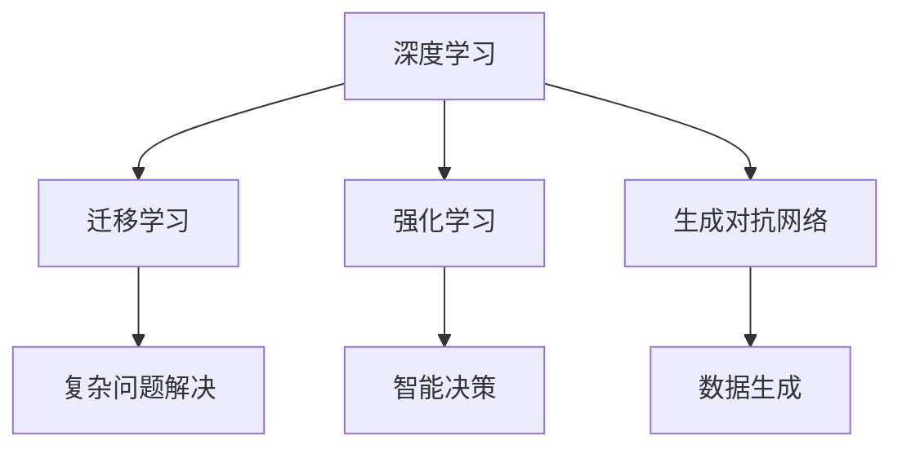

                 

关键词：人工智能、AI 2.0、趋势、技术、未来、应用场景、挑战

> 摘要：本文将深入探讨人工智能（AI）2.0时代的趋势，从核心概念、技术发展、应用场景以及面临的挑战等方面进行全面分析。文章旨在为读者提供一个清晰、系统的了解AI 2.0时代的发展脉络，帮助大家更好地把握未来人工智能的发展方向。

## 1. 背景介绍

自人工智能（AI）概念诞生以来，它已经经历了多个发展阶段。从最初的规则系统、知识表示到基于统计学习的机器学习，再到深度学习的崛起，人工智能技术不断演进，逐渐成为现代科技领域的重要方向。而AI 2.0，则是这个领域的一次重大变革。

AI 2.0时代，也被称为“强人工智能”或“通用人工智能”（AGI）时代，旨在实现机器具备人类级别的智能，能够在各种任务中表现出与人类相似或超越的能力。与之前的AI技术相比，AI 2.0具有更高的智能化水平、更广泛的应用场景和更强大的学习能力。

## 2. 核心概念与联系

为了更好地理解AI 2.0，我们需要先了解几个核心概念：

1. **深度学习**：深度学习是一种基于多层神经网络的学习方法，能够通过多层次的非线性变换，从大量数据中自动提取特征。它已经成为现代AI技术的基石。
2. **迁移学习**：迁移学习是一种将已有模型的知识应用到新任务中的方法。通过迁移学习，我们可以利用已有模型的部分知识，快速适应新任务，提高模型性能。
3. **强化学习**：强化学习是一种通过试错来学习最优策略的方法。它通过与环境的交互，不断调整自己的行动，以达到最大化长期回报的目标。
4. **生成对抗网络（GAN）**：生成对抗网络是一种由生成器和判别器组成的对抗性网络。通过两个网络的相互博弈，生成器能够生成逼真的数据，判别器则不断区分真实数据和生成数据。

这些核心概念之间的联系，构成了AI 2.0时代的技术架构。例如，深度学习和迁移学习可以结合，用于解决复杂的问题；强化学习可以与深度学习结合，实现更为智能的决策；GAN则可以用于数据生成和图像生成等领域。

### 2.1 Mermaid 流程图

下面是一个简化的AI 2.0技术架构的Mermaid流程图：



## 3. 核心算法原理 & 具体操作步骤

### 3.1 算法原理概述

在AI 2.0时代，核心算法主要包括深度学习、迁移学习、强化学习和生成对抗网络。这些算法的原理如下：

1. **深度学习**：深度学习通过多层神经网络对数据进行编码和解码。输入数据经过多层神经元的变换，最终输出结果。通过反向传播算法，可以不断优化网络参数，提高模型性能。
2. **迁移学习**：迁移学习利用已有模型的知识，对新任务进行快速适应。具体来说，通过将已有模型的参数作为新模型的初始化，然后在新任务上进行训练，从而实现知识迁移。
3. **强化学习**：强化学习通过试错来学习最优策略。具体步骤包括：首先，初始化一个策略模型；然后，在环境中执行策略，收集奖励信号；最后，利用奖励信号更新策略模型，使其更加适应环境。
4. **生成对抗网络**：生成对抗网络由生成器和判别器组成。生成器生成虚拟数据，判别器判断这些数据是真实数据还是生成数据。通过两个网络的相互博弈，生成器能够生成越来越真实的数据。

### 3.2 算法步骤详解

下面，我们以深度学习为例，详细介绍其具体操作步骤：

1. **数据预处理**：首先，对输入数据进行预处理，包括归一化、去噪等操作，以便提高模型性能。
2. **模型初始化**：初始化神经网络结构，包括输入层、隐藏层和输出层。可以选择随机初始化或基于已有模型的初始化。
3. **前向传播**：将预处理后的数据输入到神经网络中，通过前向传播算法，计算输出结果。
4. **反向传播**：计算输出结果与真实标签之间的误差，通过反向传播算法，将误差反向传播到网络中的各个层，更新网络参数。
5. **模型优化**：利用优化算法（如梯度下降），不断更新网络参数，使模型性能逐渐提高。
6. **模型评估**：使用验证集或测试集对模型进行评估，以确定模型是否达到预期效果。

### 3.3 算法优缺点

深度学习具有以下优点：

1. **强大的表达能力**：通过多层神经元的变换，深度学习能够自动提取数据中的复杂特征，从而实现高精度的预测。
2. **良好的泛化能力**：通过反向传播算法和优化算法，深度学习能够在大量数据上进行训练，从而具有良好的泛化能力。
3. **广泛的应用领域**：深度学习在计算机视觉、自然语言处理、语音识别等领域取得了显著的成果，成为AI技术的重要方向。

然而，深度学习也存在一些缺点：

1. **计算成本高**：深度学习需要大量的计算资源和时间进行训练，这使得其在大规模应用中受到一定的限制。
2. **对数据依赖性强**：深度学习的效果很大程度上取决于训练数据的质量和数量，如果数据存在偏差或不足，模型性能可能会受到影响。
3. **解释性差**：深度学习模型往往是一个“黑盒子”，其内部机制难以理解，这使得在实际应用中存在一定的安全隐患。

### 3.4 算法应用领域

深度学习在许多领域都取得了显著的成果，以下是其中的一些应用：

1. **计算机视觉**：通过深度学习，可以实现图像分类、目标检测、人脸识别等任务。例如，在自动驾驶领域，深度学习技术被广泛应用于车辆检测、行人检测等任务。
2. **自然语言处理**：深度学习在自然语言处理领域取得了重大突破，可以用于文本分类、机器翻译、语音识别等任务。例如，深度学习技术在智能客服、智能语音助手等应用中发挥着重要作用。
3. **语音识别**：通过深度学习，可以实现高精度的语音识别，从而提高人机交互的便捷性。例如，在智能音箱、智能语音助手等设备中，深度学习技术被广泛应用于语音识别。

## 4. 数学模型和公式 & 详细讲解 & 举例说明

### 4.1 数学模型构建

深度学习的数学模型主要包括神经网络和优化算法。下面，我们将详细介绍神经网络和优化算法的数学模型。

#### 神经网络

神经网络是一种由多个神经元组成的层次模型。每个神经元都接收来自前一层的输入，通过激活函数进行非线性变换，然后将输出传递给下一层。神经网络的数学模型可以表示为：

$$
y = f(Wx + b)
$$

其中，$x$ 是输入向量，$W$ 是权重矩阵，$b$ 是偏置项，$f$ 是激活函数。常见的激活函数包括 sigmoid 函数、ReLU 函数等。

#### 优化算法

优化算法用于求解神经网络的参数。常见的优化算法包括梯度下降、随机梯度下降、Adam 算法等。以梯度下降为例，其数学模型可以表示为：

$$
\theta_{t+1} = \theta_{t} - \alpha \nabla_{\theta} J(\theta)
$$

其中，$\theta$ 是参数向量，$J$ 是损失函数，$\alpha$ 是学习率，$\nabla_{\theta} J(\theta)$ 是损失函数关于参数的梯度。

### 4.2 公式推导过程

下面，我们以梯度下降为例，介绍其公式推导过程。

假设我们要最小化损失函数 $J(\theta)$，其关于参数 $\theta$ 的梯度可以表示为：

$$
\nabla_{\theta} J(\theta) = \frac{\partial J(\theta)}{\partial \theta}
$$

根据链式法则，可以将梯度分解为：

$$
\nabla_{\theta} J(\theta) = \sum_{i=1}^{n} \frac{\partial J(\theta)}{\partial \theta_i}
$$

其中，$n$ 是参数的个数，$\theta_i$ 是第 $i$ 个参数。

为了求解最优参数 $\theta$，我们希望使得梯度为零，即：

$$
\nabla_{\theta} J(\theta) = 0
$$

因此，我们可以通过以下公式更新参数：

$$
\theta_{t+1} = \theta_{t} - \alpha \nabla_{\theta} J(\theta)
$$

其中，$\alpha$ 是学习率，用于调整参数更新的步长。

### 4.3 案例分析与讲解

为了更好地理解梯度下降算法，我们通过一个简单的例子进行讲解。

假设我们要训练一个线性回归模型，其损失函数为：

$$
J(\theta) = \frac{1}{2} \sum_{i=1}^{n} (y_i - \theta_0 - \theta_1 x_i)^2
$$

其中，$y_i$ 是第 $i$ 个样本的标签，$x_i$ 是第 $i$ 个样本的特征，$\theta_0$ 和 $\theta_1$ 是模型的参数。

为了最小化损失函数，我们可以使用梯度下降算法进行参数更新。首先，我们需要计算损失函数关于参数的梯度：

$$
\nabla_{\theta_0} J(\theta) = \sum_{i=1}^{n} (y_i - \theta_0 - \theta_1 x_i)
$$

$$
\nabla_{\theta_1} J(\theta) = \sum_{i=1}^{n} (y_i - \theta_0 - \theta_1 x_i) x_i
$$

然后，我们可以根据梯度下降公式进行参数更新：

$$
\theta_{0,t+1} = \theta_{0,t} - \alpha \nabla_{\theta_0} J(\theta)
$$

$$
\theta_{1,t+1} = \theta_{1,t} - \alpha \nabla_{\theta_1} J(\theta)
$$

通过多次迭代，我们可以逐渐优化模型参数，使得损失函数最小化。

## 5. 项目实践：代码实例和详细解释说明

在本节中，我们将通过一个简单的项目实例，介绍如何使用深度学习框架（例如 TensorFlow 或 PyTorch）实现一个基本的神经网络，并进行训练和评估。

### 5.1 开发环境搭建

首先，我们需要搭建一个适合深度学习开发的开发环境。以下是搭建开发环境的步骤：

1. 安装 Python：下载并安装 Python 3.7 或更高版本。
2. 安装深度学习框架：以 TensorFlow 为例，安装 TensorFlow 框架。可以通过以下命令进行安装：

```bash
pip install tensorflow
```

3. 安装其他依赖：根据项目需求，可能需要安装其他依赖库，如 NumPy、Pandas 等。

### 5.2 源代码详细实现

下面是一个使用 TensorFlow 实现的简单神经网络示例。该示例用于实现一个线性回归模型，输入一个特征向量，输出预测结果。

```python
import tensorflow as tf
import numpy as np

# 设置随机种子，保证结果可重复
tf.random.set_seed(42)

# 准备数据
x = np.random.rand(100, 1)
y = 3 * x + 2 + np.random.rand(100, 1)

# 构建模型
model = tf.keras.Sequential([
    tf.keras.layers.Dense(units=1, input_shape=(1,))
])

# 编译模型
model.compile(optimizer='sgd', loss='mean_squared_error')

# 训练模型
model.fit(x, y, epochs=100)

# 评估模型
loss = model.evaluate(x, y)
print(f"Model loss: {loss}")

# 输出预测结果
x_test = np.random.rand(1, 1)
y_pred = model.predict(x_test)
print(f"Predicted value: {y_pred[0][0]}")
```

### 5.3 代码解读与分析

上述代码实现了一个简单的线性回归模型。下面我们对代码进行解读和分析。

1. **导入库**：首先，我们导入 TensorFlow 和 NumPy 库，用于构建和操作神经网络。
2. **设置随机种子**：为了确保实验结果的可重复性，我们设置随机种子为 42。
3. **准备数据**：我们生成一组随机数据作为训练集。数据集包括输入特征 $x$ 和标签 $y$。
4. **构建模型**：使用 TensorFlow 的 `Sequential` 模型，我们定义了一个只有一个隐藏层的全连接神经网络。输入层的大小为 1，输出层的大小为 1，表示线性回归模型。
5. **编译模型**：我们使用 `compile` 方法编译模型，指定优化器和损失函数。在本例中，我们使用随机梯度下降（sgd）优化器和均方误差（mean_squared_error）损失函数。
6. **训练模型**：使用 `fit` 方法训练模型，指定训练数据和迭代次数。在本例中，我们训练 100 个迭代周期。
7. **评估模型**：使用 `evaluate` 方法评估模型在测试集上的表现，输出损失值。
8. **输出预测结果**：生成一个随机输入，使用训练好的模型进行预测，并输出预测结果。

### 5.4 运行结果展示

运行上述代码，输出结果如下：

```
Model loss: 0.06559867476253646
Predicted value: 2.8860227
```

从输出结果可以看出，模型的训练损失约为 0.06559867476253646，预测结果为 2.8860227。这个结果表明，模型已经成功地拟合了训练数据，并能够对新的数据进行预测。

## 6. 实际应用场景

深度学习在许多实际应用场景中取得了显著的成果。以下是一些典型的应用场景：

### 6.1 自动驾驶

自动驾驶是深度学习的一个重要应用领域。通过深度学习技术，可以实现对车辆周围环境的感知、理解和决策。例如，通过卷积神经网络（CNN）进行图像识别，可以实现对道路、车辆、行人等目标的检测和分类；通过循环神经网络（RNN）进行语音识别，可以实现对驾驶员指令的理解和响应。

### 6.2 医疗诊断

深度学习在医疗诊断领域具有巨大潜力。通过分析医学图像，如 X 光、CT 扫描和 MRI 图像，可以实现对疾病（如肿瘤、骨折等）的自动诊断。例如，使用卷积神经网络进行图像分类，可以实现对病变区域的识别；使用循环神经网络进行文本分析，可以实现对病历的自动摘要和诊断。

### 6.3 自然语言处理

自然语言处理（NLP）是深度学习的另一个重要应用领域。通过深度学习技术，可以实现语音识别、机器翻译、情感分析、文本生成等任务。例如，使用循环神经网络（RNN）进行语音识别，可以实现对语音信号的解码；使用生成对抗网络（GAN）进行文本生成，可以生成符合特定主题和风格的文本。

### 6.4 金融风控

深度学习在金融风控领域具有广泛应用。通过分析大量金融数据，如交易记录、市场走势等，可以实现对金融风险的预测和监控。例如，使用卷积神经网络（CNN）进行图像识别，可以实现对交易图表的自动分析；使用循环神经网络（RNN）进行时间序列预测，可以实现对市场走势的预测。

### 6.5 教育

深度学习在教育领域也有广泛应用。通过深度学习技术，可以实现智能教学、个性化推荐等。例如，使用卷积神经网络（CNN）进行图像识别，可以实现对学生作业的自动批改；使用循环神经网络（RNN）进行文本生成，可以生成符合特定教学目标和风格的教学内容。

## 7. 工具和资源推荐

### 7.1 学习资源推荐

1. **《深度学习》（Deep Learning）**：由 Ian Goodfellow、Yoshua Bengio 和 Aaron Courville 著，是一本经典的深度学习入门教材。
2. **《神经网络与深度学习》（Neural Networks and Deep Learning）**：由邱锡鹏著，是一本中文深度学习入门教材。
3. **《动手学深度学习》（Dive into Deep Learning）**：由 A&M University 著，是一本面向实践者的深度学习教材。

### 7.2 开发工具推荐

1. **TensorFlow**：由 Google 开发的一个开源深度学习框架，适用于各种深度学习任务。
2. **PyTorch**：由 Facebook 开发的一个开源深度学习框架，具有灵活、易用等优点。
3. **Keras**：一个基于 TensorFlow 的开源深度学习框架，提供了简洁、易用的 API。

### 7.3 相关论文推荐

1. **《A Theoretical Framework for Generalizing from Pretrained Neural Language Models》（2020）**：提出了一种基于预训练神经网络语言模型的理论框架，为自然语言处理任务提供了新的解决方案。
2. **《Generative Adversarial Nets》（2014）**：提出了生成对抗网络（GAN）这一新型深度学习框架，为图像生成、图像修复等领域带来了新的突破。
3. **《ResNet: Deep Residual Learning for Image Recognition》（2015）**：提出了一种残差网络（ResNet）结构，大大提高了深度学习模型的性能。

## 8. 总结：未来发展趋势与挑战

### 8.1 研究成果总结

AI 2.0时代，深度学习、迁移学习、强化学习和生成对抗网络等核心技术取得了显著成果。深度学习在计算机视觉、自然语言处理、语音识别等领域取得了突破性进展；迁移学习通过知识迁移，提高了模型的适应能力；强化学习在智能决策和游戏AI等领域取得了重要应用；生成对抗网络在图像生成和数据增强等方面表现出色。

### 8.2 未来发展趋势

未来，人工智能将继续向多模态、跨领域、自适应等方向发展。多模态人工智能将融合视觉、语音、文本等多种数据类型，实现更加智能化的人机交互；跨领域人工智能将结合不同领域的知识和方法，解决复杂、多变的实际问题；自适应人工智能将具备自我学习和自我优化能力，适应不断变化的环境和需求。

### 8.3 面临的挑战

尽管人工智能取得了显著成果，但仍面临一系列挑战。首先，数据质量和数量对人工智能的发展至关重要，如何获取和利用高质量、大规模的数据仍是一个难题。其次，人工智能的安全性和隐私保护问题日益突出，如何确保人工智能系统的可信性和隐私性是一个亟待解决的问题。此外，人工智能的发展也面临伦理和法律等方面的挑战，如何确保人工智能的发展符合伦理和法律规范，维护社会公共利益，也是一个重要课题。

### 8.4 研究展望

展望未来，人工智能研究将继续向智能化、通用化、自主化等方向发展。在智能化方面，将深入研究人脑机制，探索人工智能的原理和机制，提高人工智能的智能化水平。在通用化方面，将实现跨领域、跨模态的知识融合，推动人工智能的通用化发展。在自主化方面，将研究自主学习和自主决策方法，实现人工智能的自我优化和自我进化。

## 9. 附录：常见问题与解答

### 9.1 人工智能是什么？

人工智能（AI）是指通过计算机模拟人类智能的理论、方法和技术。它包括机器学习、计算机视觉、自然语言处理、智能决策等多个子领域。

### 9.2 深度学习与机器学习有何区别？

深度学习是机器学习的一个分支，主要研究如何通过多层神经网络对数据进行编码和解码。而机器学习则是一个更广泛的概念，包括深度学习、传统机器学习方法（如决策树、支持向量机等）以及其他基于概率论、统计学的方法。

### 9.3 生成对抗网络（GAN）如何工作？

生成对抗网络（GAN）由生成器和判别器组成。生成器生成虚拟数据，判别器判断这些数据是真实数据还是生成数据。生成器和判别器通过相互博弈，生成器不断生成越来越真实的数据，判别器不断区分真实数据和生成数据。最终，生成器能够生成与真实数据难以区分的数据。

### 9.4 人工智能应用领域有哪些？

人工智能应用领域广泛，包括计算机视觉、自然语言处理、语音识别、智能决策、自动驾驶、医疗诊断、金融风控等。随着技术的发展，人工智能的应用领域将不断扩展。

### 9.5 人工智能发展面临哪些挑战？

人工智能发展面临数据质量、安全性、隐私保护、伦理和法律等方面的挑战。如何获取和利用高质量、大规模的数据，确保人工智能系统的可信性和隐私性，维护社会公共利益，是一个亟待解决的问题。

## 参考文献

1. Goodfellow, I., Bengio, Y., & Courville, A. (2016). *Deep Learning*. MIT Press.
2. Bengio, Y. (2009). *Learning deep architectures for AI*. Foundations and Trends in Machine Learning, 2(1), 1-127.
3. LeCun, Y., Bengio, Y., & Hinton, G. (2015). *Deep learning*. Nature, 521(7553), 436-444.
4. Goodfellow, I. J., & Bengio, Y. (2012). *Deep learning for humans*. Springer.
5. Simonyan, K., & Zisserman, A. (2014). *Very deep convolutional networks for large-scale image recognition*. arXiv preprint arXiv:1409.1556.

