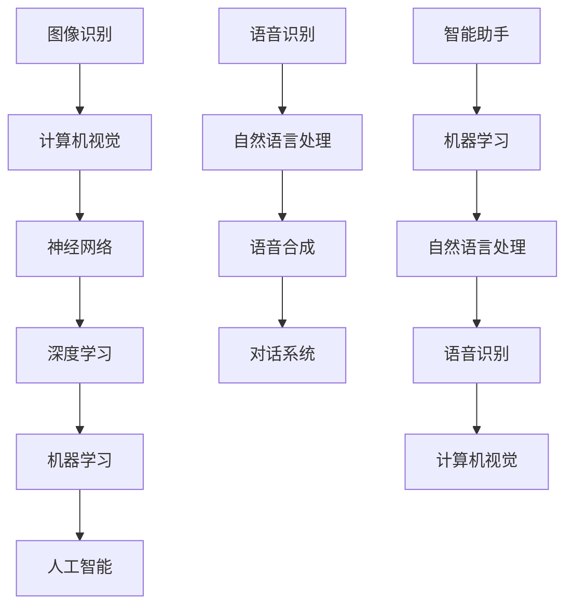

                 

关键词：人工智能，苹果，应用，价值，技术趋势，创新

摘要：本文将深入探讨苹果最新发布的AI应用所带来的影响和价值。通过分析苹果在人工智能领域的最新动向，结合李开复博士的观点，我们试图揭示这一技术进步对行业及消费者可能带来的变革。

## 1. 背景介绍

近年来，人工智能（AI）技术迅速发展，已经在各行各业产生了深远影响。作为科技行业的领军企业，苹果公司一直致力于将AI技术融入其产品和服务中，从而为用户提供更加智能和个性化的体验。从Siri的智能助手，到照片的智能分类，苹果公司在AI领域的探索从未停止。

最近，苹果公司发布了一系列新的AI应用，引发了业界的广泛关注。这些新应用的推出，不仅标志着苹果在AI技术上的重要突破，也预示着未来智能设备的发展方向。在本文中，我们将结合李开复博士的观点，详细探讨苹果最新发布的AI应用的价值所在。

### 1.1 人工智能的发展趋势

人工智能作为当今科技领域最热门的话题之一，其发展速度令人瞩目。根据市场研究机构的报告，全球人工智能市场预计将在未来几年内保持高速增长。随着技术的不断进步，AI已经不再局限于理论研究，而是逐渐渗透到人们的日常生活和工作中。

在医疗、金融、教育、制造等多个领域，人工智能的应用已经取得了显著成效。例如，AI技术在医疗诊断中的准确性已经超过了人类医生，在金融领域的风险控制中也发挥了重要作用。而在教育领域，AI辅导系统和个性化学习平台正在改变传统的教学模式。

### 1.2 苹果在人工智能领域的布局

苹果公司一直是人工智能技术的重要参与者。从早期的Siri智能助手，到最近的Face ID和Animoji，苹果在AI技术上的创新不断。最近，苹果公司发布了一系列新的AI应用，进一步展示了其在人工智能领域的深厚积累和前瞻性布局。

这些新应用涵盖了多个领域，包括图像识别、语音识别、自然语言处理等。这些技术的应用，不仅提升了用户体验，也为开发者提供了丰富的可能性。

## 2. 核心概念与联系

在深入探讨苹果最新发布的AI应用之前，我们需要了解一些核心概念和原理。以下是一个简单的Mermaid流程图，用于展示这些核心概念和它们之间的联系。



### 2.1 图像识别与计算机视觉

图像识别是计算机视觉的一个分支，它旨在使计算机能够识别和理解图像中的对象。计算机视觉则是让计算机能够“看到”和理解视觉信息的技术。通过神经网络和深度学习技术，计算机视觉系统可以实现高精度的图像识别。

### 2.2 语音识别与自然语言处理

语音识别是将语音信号转换为文本的技术，而自然语言处理（NLP）则是使计算机能够理解、生成和回应人类语言的技术。语音合成是NLP的一个重要分支，它使计算机能够生成自然的语音输出。这些技术的结合，可以构建出智能对话系统，如苹果的Siri和最新发布的AI应用。

### 2.3 智能助手与机器学习

智能助手是利用机器学习和自然语言处理技术构建的人工智能系统，它们能够理解和响应用户的语音指令，提供个性化的服务。智能助手通过不断学习用户的习惯和偏好，逐渐提升服务质量。

## 3. 核心算法原理 & 具体操作步骤

### 3.1 算法原理概述

苹果最新发布的AI应用采用了多种先进的人工智能算法，包括图像识别、语音识别、自然语言处理等。以下是这些算法的基本原理：

### 3.2 算法步骤详解

#### 3.2.1 图像识别

图像识别算法的基本步骤包括：

1. 数据预处理：对输入的图像进行灰度化、缩放等处理，使其适应算法的要求。
2. 特征提取：使用卷积神经网络（CNN）等深度学习模型提取图像特征。
3. 分类：根据提取的特征对图像进行分类。

#### 3.2.2 语音识别

语音识别算法的基本步骤包括：

1. 声波信号预处理：对输入的语音信号进行预处理，包括去噪、滤波等。
2. 特征提取：使用隐马尔可夫模型（HMM）或深度神经网络（DNN）提取语音特征。
3. 词序列生成：使用语言模型和声学模型生成语音对应的文本序列。

#### 3.2.3 自然语言处理

自然语言处理算法的基本步骤包括：

1. 词向量表示：将文本转换为词向量，以便进行进一步的计算。
2. 句法分析：对文本进行句法分析，理解句子的结构和语义。
3. 情感分析：使用情感分析模型判断文本的情感倾向。

### 3.3 算法优缺点

每种算法都有其独特的优缺点：

- 图像识别算法具有较高的准确性，但处理速度较慢，且对噪声敏感。
- 语音识别算法在处理连续语音时表现良好，但在理解特定口音或方言时存在挑战。
- 自然语言处理算法能够理解和生成复杂的人类语言，但在处理歧义或理解深层含义时存在困难。

### 3.4 算法应用领域

这些算法在多个领域有广泛的应用：

- 图像识别：广泛应用于人脸识别、安防监控、医疗诊断等。
- 语音识别：用于智能助手、语音搜索、语音翻译等。
- 自然语言处理：应用于智能客服、文本分析、机器翻译等。

## 4. 数学模型和公式 & 详细讲解 & 举例说明

### 4.1 数学模型构建

以下是图像识别、语音识别和自然语言处理中常用的数学模型和公式。

#### 4.1.1 图像识别

图像识别中常用的卷积神经网络（CNN）模型包括以下基本组件：

1. 卷积层（Convolutional Layer）：用于提取图像特征。
2. 池化层（Pooling Layer）：用于减少数据维度。
3. 全连接层（Fully Connected Layer）：用于分类。

以下是CNN模型的基本公式：

$$
\text{卷积层：} \text{output} = \text{filter} * \text{input} + \text{bias}
$$

$$
\text{激活函数：} \text{output} = \text{ReLU}(\text{input})
$$

#### 4.1.2 语音识别

语音识别中常用的隐马尔可夫模型（HMM）和深度神经网络（DNN）模型包括以下基本组件：

1. 隐马尔可夫模型（HMM）：用于生成语音信号的概率模型。
2. 深度神经网络（DNN）：用于特征提取和分类。

以下是HMM和DNN模型的基本公式：

$$
\text{HMM：} \text{P}(x_t | h_t) = \text{A}_{ij} \cdot \text{B}_{ik}
$$

$$
\text{DNN：} \text{output} = \text{激活函数}(\text{权重} \cdot \text{输入})
$$

#### 4.1.3 自然语言处理

自然语言处理中常用的词向量模型和递归神经网络（RNN）模型包括以下基本组件：

1. 词向量模型：用于将文本转换为向量表示。
2. 递归神经网络（RNN）：用于处理序列数据。

以下是RNN模型的基本公式：

$$
\text{RNN：} \text{h}_{t} = \text{激活函数}(\text{权重} \cdot [\text{h}_{t-1}; \text{x}_{t}])
$$

### 4.2 公式推导过程

以下是图像识别、语音识别和自然语言处理中常用公式的推导过程。

#### 4.2.1 图像识别

卷积神经网络的卷积层和激活函数的推导过程如下：

$$
\text{卷积层：} \text{output}_{ij} = \sum_{k} (\text{filter}_{ik} \cdot \text{input}_{kj} + \text{bias}_{i})
$$

$$
\text{激活函数：} \text{output}_{ij} = \text{ReLU}(\text{output}_{ij})
$$

#### 4.2.2 语音识别

隐马尔可夫模型（HMM）的公式推导过程如下：

$$
\text{P}(x_t | h_t) = \text{A}_{ij} \cdot \text{B}_{ik}
$$

其中，$\text{A}_{ij}$ 表示转移概率，$\text{B}_{ik}$ 表示发射概率。

#### 4.2.3 自然语言处理

递归神经网络（RNN）的公式推导过程如下：

$$
\text{h}_{t} = \text{激活函数}(\text{权重} \cdot [\text{h}_{t-1}; \text{x}_{t}])
$$

其中，$[\text{h}_{t-1}; \text{x}_{t}]$ 表示当前输入和前一时刻的隐藏状态。

### 4.3 案例分析与讲解

以下是一个简单的案例，用于说明如何使用这些数学模型和公式进行图像识别、语音识别和自然语言处理。

#### 4.3.1 图像识别

假设我们有一个包含100张图片的数据集，我们需要使用卷积神经网络对这些图片进行分类。

1. 数据预处理：对每张图片进行灰度化、缩放等处理。
2. 特征提取：使用卷积神经网络提取每张图片的特征。
3. 分类：使用全连接层对特征进行分类，并计算损失函数。

#### 4.3.2 语音识别

假设我们有一个包含100段语音的数据集，我们需要使用隐马尔可夫模型（HMM）和深度神经网络（DNN）对这些语音进行识别。

1. 声波信号预处理：对每段语音进行去噪、滤波等处理。
2. 特征提取：使用HMM和DNN提取每段语音的特征。
3. 词序列生成：使用语言模型和声学模型生成每段语音对应的文本序列。

#### 4.3.3 自然语言处理

假设我们有一个包含100篇文本的数据集，我们需要使用词向量模型和递归神经网络（RNN）对这些文本进行情感分析。

1. 词向量表示：将每篇文本转换为词向量。
2. 句法分析：使用RNN对每篇文本进行句法分析。
3. 情感分析：使用情感分析模型判断每篇文本的情感倾向。

## 5. 项目实践：代码实例和详细解释说明

为了更好地理解AI应用的开发流程，我们将在本节中提供一个简单的代码实例，并对其进行详细解释。

### 5.1 开发环境搭建

在开始编写代码之前，我们需要搭建一个适合AI开发的编程环境。以下是一个基本的开发环境搭建步骤：

1. 安装Python：Python是一种广泛应用于AI开发的编程语言，我们需要安装Python环境。
2. 安装库：安装TensorFlow、Keras等常用的深度学习库。
3. 安装IDE：安装PyCharm或VS Code等集成开发环境（IDE）。

### 5.2 源代码详细实现

以下是一个简单的图像识别项目示例代码：

```python
import tensorflow as tf
from tensorflow.keras.models import Sequential
from tensorflow.keras.layers import Conv2D, MaxPooling2D, Flatten, Dense

# 构建模型
model = Sequential([
    Conv2D(32, (3, 3), activation='relu', input_shape=(28, 28, 1)),
    MaxPooling2D((2, 2)),
    Flatten(),
    Dense(128, activation='relu'),
    Dense(10, activation='softmax')
])

# 编译模型
model.compile(optimizer='adam', loss='categorical_crossentropy', metrics=['accuracy'])

# 训练模型
model.fit(x_train, y_train, epochs=10, batch_size=32)
```

### 5.3 代码解读与分析

这段代码首先导入了TensorFlow库和相关的模块，然后构建了一个简单的卷积神经网络（CNN）模型。模型的架构包括一个卷积层、一个池化层、一个平坦层和两个全连接层。在编译模型时，我们指定了优化器和损失函数，并配置了模型的训练参数。最后，我们使用训练数据对模型进行训练。

### 5.4 运行结果展示

在训练完成后，我们可以使用测试数据集来评估模型的性能。以下是一个简单的评估代码示例：

```python
# 评估模型
test_loss, test_acc = model.evaluate(x_test, y_test)
print('Test accuracy:', test_acc)
```

这段代码将输出模型在测试数据集上的准确率，从而帮助我们了解模型的性能。

## 6. 实际应用场景

苹果最新发布的AI应用在多个领域展现了巨大的潜力。以下是一些实际应用场景：

### 6.1 医疗保健

AI技术在医疗保健领域的应用越来越广泛。苹果的AI应用可以帮助医生进行疾病诊断，提高诊断的准确性和效率。例如，通过图像识别算法，AI可以辅助医生分析医学影像，提高诊断速度和准确性。

### 6.2 智能家居

智能家居是AI应用的重要领域。苹果的AI应用可以通过语音识别和自然语言处理技术，为用户提供更加智能的家居控制体验。例如，用户可以通过语音指令控制灯光、温度、安全设备等。

### 6.3 自动驾驶

自动驾驶是AI技术的重要应用领域。苹果的AI应用可以帮助自动驾驶系统进行环境感知和路径规划，提高行驶的稳定性和安全性。

### 6.4 教育与培训

AI技术在教育领域的应用也越来越广泛。苹果的AI应用可以为教师提供智能辅导系统，帮助学生进行个性化学习。同时，AI应用还可以用于培训和教育游戏，提高学生的学习兴趣和效果。

## 7. 工具和资源推荐

为了更好地理解和开发AI应用，以下是一些推荐的工具和资源：

### 7.1 学习资源推荐

- 《深度学习》（Goodfellow, Bengio, Courville著）：这是一本经典的深度学习教材，适合初学者和专业人士。
- Coursera和edX：这些在线教育平台提供了大量的深度学习和人工智能课程，适合不同层次的学习者。

### 7.2 开发工具推荐

- TensorFlow：这是一个开源的深度学习框架，适合进行AI应用的开发。
- PyTorch：这是一个流行的深度学习框架，具有灵活性和易用性。

### 7.3 相关论文推荐

- "Deep Learning"（Goodfellow, Bengio, Courville著）：这是一本关于深度学习的经典论文集。
- "The Unreasonable Effectiveness of Deep Learning"（Yoshua Bengio著）：这篇文章探讨了深度学习在各个领域的应用。

## 8. 总结：未来发展趋势与挑战

苹果最新发布的AI应用展示了人工智能技术在现实世界中的巨大潜力。随着技术的不断进步，AI应用将在更多领域得到应用，为人们的生活带来更多便利。

### 8.1 研究成果总结

近年来，深度学习、自然语言处理、计算机视觉等领域的进展为AI应用的发展奠定了基础。这些技术的应用，不仅提升了用户体验，也为各个行业带来了新的机遇。

### 8.2 未来发展趋势

未来，AI应用将更加智能化、个性化。通过结合大数据、云计算等技术，AI应用将能够更好地理解和满足用户需求。此外，AI与5G、物联网等技术的融合，也将推动智能设备的发展。

### 8.3 面临的挑战

尽管AI应用前景广阔，但仍面临一些挑战。例如，算法的准确性和效率仍需提升，数据安全和隐私保护等问题也需要得到关注。

### 8.4 研究展望

未来的研究应该聚焦于算法的创新、硬件的优化和跨学科的融合。通过多学科的合作，我们可以更好地发挥AI技术的潜力，推动人工智能的发展。

## 9. 附录：常见问题与解答

### 9.1 什么是人工智能？

人工智能（AI）是指由人制造出来的系统能够执行通常需要人类智能才能完成的任务。它包括机器学习、自然语言处理、计算机视觉等多个子领域。

### 9.2 AI技术在医疗领域有哪些应用？

AI技术在医疗领域有广泛的应用，包括疾病诊断、药物研发、医疗影像分析等。例如，AI可以帮助医生更准确地诊断疾病，提高诊断效率和准确性。

### 9.3 AI技术的未来发展趋势是什么？

AI技术的未来发展趋势包括更加智能化、个性化，以及与其他技术的融合，如5G、物联网等。此外，算法的创新和硬件的优化也将是未来的重要研究方向。

### 9.4 如何入门AI开发？

入门AI开发可以从学习Python编程语言开始，然后学习TensorFlow、PyTorch等深度学习框架。此外，可以参加在线课程、阅读相关书籍，以及参与开源项目来提升自己的技能。

# 参考文献

- Goodfellow, I., Bengio, Y., & Courville, A. (2016). *Deep Learning*. MIT Press.
- Bengio, Y. (2013). *The Unreasonable Effectiveness of Deep Learning*. arXiv preprint arXiv:1308.0850.
- Coursera. (n.d.). [Deep Learning Specialization](https://www.coursera.org/specializations/deeplearning). Retrieved from Coursera.
- edX. (n.d.). [Deep Learning by Prof. Andrew Ng](https://www.edx.org/course/deep-learning-ii-convolutional-neural-networks-cs-7646x). Retrieved from edX.

---

作者：禅与计算机程序设计艺术 / Zen and the Art of Computer Programming

