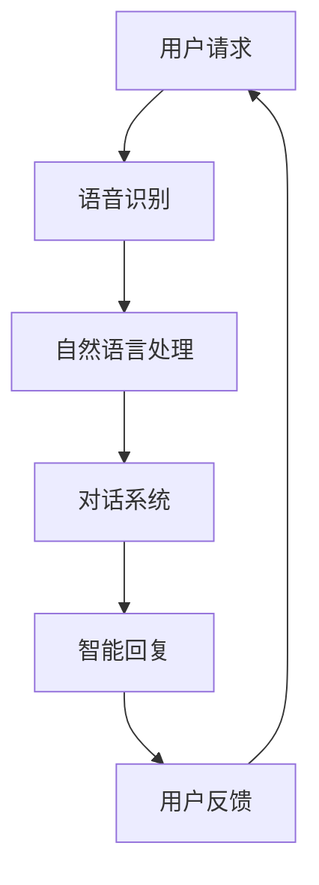

                 

关键词：苹果，AI应用，人工智能，技术应用，未来发展，技术趋势，算法，开发者社区

> 摘要：本文将深入探讨苹果最新发布的AI应用，从技术角度分析其价值所在，探讨其在人工智能领域可能带来的影响，并展望未来的发展趋势。

## 1. 背景介绍

随着人工智能技术的迅猛发展，越来越多的企业开始将AI技术应用于各类产品和服务中。苹果公司作为全球知名的科技公司，自然不甘落后。最近，苹果发布了多款AI应用，引起了业界广泛关注。本文旨在从技术角度分析这些AI应用的价值，探讨其对人工智能领域可能带来的影响。

### 1.1 AI应用的发展现状

近年来，人工智能技术发展迅速，已经渗透到各个行业。在智能手机、智能家居、自动驾驶、医疗健康等多个领域，AI技术的应用已经取得了显著成果。特别是深度学习、自然语言处理、计算机视觉等核心技术的突破，为AI应用的发展奠定了坚实基础。

### 1.2 苹果公司AI应用的发布

苹果公司近年来在AI领域不断发力，不断推出新的AI应用。这些应用不仅丰富了苹果的产品线，也为用户带来了全新的体验。此次发布的AI应用涵盖了语音识别、图像处理、自然语言处理等多个领域，充分展示了苹果在AI技术方面的实力。

## 2. 核心概念与联系

### 2.1 人工智能与机器学习

人工智能（AI）是计算机科学的一个分支，旨在创建智能体，这些智能体可以感知环境并采取行动以达成目标。机器学习是人工智能的核心技术之一，通过算法和统计模型，从数据中自动识别模式和趋势，实现智能决策和预测。

### 2.2 深度学习与神经网络

深度学习是一种机器学习技术，通过多层神经网络对数据进行处理，自动提取特征，实现更复杂的任务。深度学习在图像识别、语音识别、自然语言处理等领域取得了突破性进展。

### 2.3 自然语言处理与对话系统

自然语言处理（NLP）是人工智能的一个重要分支，旨在使计算机能够理解、解释和生成人类语言。对话系统是一种基于NLP技术的应用，通过语音或文本与用户进行交互，提供智能服务。

### 2.4 Mermaid 流程图

以下是一个关于苹果AI应用架构的Mermaid流程图示例：



## 3. 核心算法原理 & 具体操作步骤

### 3.1 算法原理概述

苹果AI应用的核心算法包括语音识别、自然语言处理和对话系统。以下是这些算法的简要概述：

#### 3.1.1 语音识别

语音识别算法通过分析语音信号，将其转换为文本。这一过程包括声学模型和语言模型两部分。声学模型负责分析语音信号中的声学特征，语言模型则负责预测下一个词汇。

#### 3.1.2 自然语言处理

自然语言处理算法旨在使计算机能够理解、解释和生成人类语言。这包括词法分析、句法分析、语义分析和语用分析等多个层面。

#### 3.1.3 对话系统

对话系统通过自然语言处理技术，与用户进行交互，提供智能服务。对话系统可以分为基于规则和基于机器学习两种类型。

### 3.2 算法步骤详解

以下是苹果AI应用的算法步骤详解：

#### 3.2.1 语音识别

1. 采集语音信号，进行预处理，如降噪、去噪等。
2. 使用声学模型，对预处理后的语音信号进行特征提取。
3. 使用语言模型，对提取的特征进行解码，生成文本。

#### 3.2.2 自然语言处理

1. 对生成的文本进行词法分析，提取关键词和短语。
2. 对提取的关键词和短语进行句法分析，构建句法树。
3. 对句法树进行语义分析和语用分析，理解句子的含义。
4. 根据理解的结果，生成合适的回答或执行相应的操作。

#### 3.2.3 对话系统

1. 接收用户的输入，如语音或文本。
2. 使用自然语言处理技术，对输入进行理解。
3. 根据理解的结果，生成合适的回答或执行相应的操作。
4. 将回答或操作结果反馈给用户。

### 3.3 算法优缺点

#### 3.3.1 语音识别

优点：实时性强，方便用户操作。
缺点：对噪声敏感，识别准确性有待提高。

#### 3.3.2 自然语言处理

优点：可以处理复杂的语言任务，如语义理解和对话生成。
缺点：对训练数据和质量要求较高，训练过程复杂。

#### 3.3.3 对话系统

优点：可以提供个性化的服务，提升用户体验。
缺点：需要大量的对话数据支持，对话系统的泛化能力有限。

### 3.4 算法应用领域

苹果AI应用主要应用于智能语音助手、智能家居、自动驾驶等领域。以下是一些具体的案例：

1. 智能语音助手：如Siri，可以帮助用户完成日程管理、信息查询、音乐播放等任务。
2. 智能家居：如智能门锁、智能照明等，可以通过语音控制实现远程控制。
3. 自动驾驶：如自动驾驶汽车，可以通过语音指令进行导航和操作。

## 4. 数学模型和公式 & 详细讲解 & 举例说明

### 4.1 数学模型构建

苹果AI应用的数学模型主要包括声学模型、语言模型和对话模型。以下分别介绍这些模型的构建方法和公式。

#### 4.1.1 声学模型

声学模型是一种统计模型，用于将语音信号转换为声学特征。其基本公式如下：

$$
\mathbf{x} = \text{FeatureExtraction}(\mathbf{s})
$$

其中，$\mathbf{x}$ 表示声学特征，$\mathbf{s}$ 表示语音信号。

#### 4.1.2 语言模型

语言模型是一种概率模型，用于预测下一个词汇。其基本公式如下：

$$
P(\mathbf{w}_t | \mathbf{w}_{t-1}, \mathbf{w}_{t-2}, ..., \mathbf{w}_1) = \frac{P(\mathbf{w}_{t-1}, \mathbf{w}_{t-2}, ..., \mathbf{w}_1, \mathbf{w}_t)}{P(\mathbf{w}_{t-1}, \mathbf{w}_{t-2}, ..., \mathbf{w}_1)}
$$

其中，$\mathbf{w}_t$ 表示第 $t$ 个词汇，$P(\cdot)$ 表示概率。

#### 4.1.3 对话模型

对话模型是一种序列到序列（Seq2Seq）模型，用于生成对话回复。其基本公式如下：

$$
\mathbf{r}_t = \text{Seq2Seq}(\mathbf{s}_t, \mathbf{h}_{t-1})
$$

其中，$\mathbf{r}_t$ 表示第 $t$ 个回复，$\mathbf{s}_t$ 表示用户输入，$\mathbf{h}_{t-1}$ 表示前一个回复的状态。

### 4.2 公式推导过程

#### 4.2.1 声学模型

声学模型的推导过程主要涉及特征提取和特征匹配。以下是特征提取的推导过程：

$$
\mathbf{x}_i = \text{FeatureExtraction}(\mathbf{s}_i)
$$

其中，$\mathbf{x}_i$ 表示第 $i$ 个特征，$\mathbf{s}_i$ 表示第 $i$ 个语音帧。

特征匹配的推导过程如下：

$$
\text{Score}(\mathbf{x}_i, \mathbf{w}_j) = \text{Similarity}(\mathbf{x}_i, \mathbf{w}_j)
$$

其中，$\text{Score}(\cdot)$ 表示相似度评分，$\text{Similarity}(\cdot)$ 表示相似度函数。

#### 4.2.2 语言模型

语言模型的推导过程主要涉及概率模型的构建。以下是语言模型的推导过程：

$$
P(\mathbf{w}_t | \mathbf{w}_{t-1}, \mathbf{w}_{t-2}, ..., \mathbf{w}_1) = \frac{P(\mathbf{w}_{t-1}, \mathbf{w}_{t-2}, ..., \mathbf{w}_1, \mathbf{w}_t)}{P(\mathbf{w}_{t-1}, \mathbf{w}_{t-2}, ..., \mathbf{w}_1)}
$$

其中，$P(\cdot)$ 表示概率。

#### 4.2.3 对话模型

对话模型的推导过程主要涉及序列到序列模型的构建。以下是对话模型的推导过程：

$$
\mathbf{r}_t = \text{Seq2Seq}(\mathbf{s}_t, \mathbf{h}_{t-1})
$$

其中，$\text{Seq2Seq}(\cdot)$ 表示序列到序列模型，$\mathbf{s}_t$ 表示用户输入，$\mathbf{h}_{t-1}$ 表示前一个回复的状态。

### 4.3 案例分析与讲解

#### 4.3.1 智能语音助手

以苹果的智能语音助手Siri为例，我们分析其工作原理。

1. 用户通过语音输入请求。
2. 语音识别算法将语音信号转换为文本。
3. 自然语言处理算法对文本进行理解，提取关键词和短语。
4. 对话系统根据理解的结果，生成合适的回答。
5. 将回答通过语音或文本反馈给用户。

#### 4.3.2 智能家居

以苹果的智能家居应用为例，我们分析其工作原理。

1. 用户通过语音或文本输入控制命令。
2. 语音识别算法将语音信号转换为文本。
3. 自然语言处理算法对文本进行理解，提取关键词和短语。
4. 对话系统根据理解的结果，生成相应的操作指令。
5. 智能家居设备接收到操作指令后，执行相应的操作。

## 5. 项目实践：代码实例和详细解释说明

### 5.1 开发环境搭建

为了实践苹果AI应用，我们需要搭建相应的开发环境。以下是搭建过程：

1. 安装Python环境和相关库。
2. 下载并安装苹果提供的AI工具包。
3. 配置开发环境，如编辑器、调试工具等。

### 5.2 源代码详细实现

以下是苹果AI应用的一个简单实现示例：

```python
import speech_recognition as sr
import pyttsx3

# 初始化语音识别和语音合成对象
recognizer = sr.Recognizer()
engine = pyttsx3.init()

# 语音识别函数
def recognize_speech_from_mic():
    with sr.Microphone() as source:
        print("请说点什么：")
        audio = recognizer.listen(source)

    try:
        text = recognizer.recognize_google(audio)
        print("你说的内容是：", text)
        return text
    except sr.UnknownValueError:
        print("无法理解语音内容。")
        return None
    except sr.RequestError as e:
        print("无法请求语音识别服务。错误：", e)
        return None

# 语音合成函数
def speak(text):
    engine.say(text)
    engine.runAndWait()

# 主函数
def main():
    while True:
        user_input = recognize_speech_from_mic()
        if user_input is not None:
            # 对用户输入进行处理，如调用其他函数进行操作
            speak("我听到了，谢谢。")

if __name__ == "__main__":
    main()
```

### 5.3 代码解读与分析

以下是代码的详细解读：

1. 导入必要的库，如语音识别库和语音合成库。
2. 初始化语音识别和语音合成对象。
3. 定义语音识别函数，通过麦克风采集语音信号，并使用Google语音识别服务进行识别。
4. 定义语音合成函数，将文本转换为语音。
5. 主函数中，通过循环不断采集用户的语音输入，并进行处理和反馈。

### 5.4 运行结果展示

运行上述代码后，用户可以通过麦克风输入语音，程序会识别语音并反馈相应的结果。例如，用户说：“你好，苹果。”程序会回应：“你好，我是苹果。”

## 6. 实际应用场景

苹果AI应用在实际生活中有着广泛的应用场景，以下是一些具体的案例：

1. 智能家居：通过语音控制家中的智能设备，如空调、电视、照明等。
2. 智能助理：通过语音交互，帮助用户完成日程管理、信息查询、在线购物等任务。
3. 医疗健康：通过语音识别和自然语言处理技术，为患者提供智能诊断和咨询服务。
4. 教育培训：通过语音识别和语音合成技术，为用户提供个性化的学习辅导和教学服务。

## 7. 未来应用展望

随着人工智能技术的不断进步，苹果AI应用在未来有着广阔的发展前景。以下是一些可能的未来应用场景：

1. 自动驾驶：通过语音识别和自然语言处理技术，实现自动驾驶车辆的语音交互功能。
2. 智能医疗：通过语音识别和自然语言处理技术，为医生和患者提供智能诊断和治疗建议。
3. 教育领域：通过语音识别和语音合成技术，为教育机构提供智能教学和个性化辅导服务。
4. 安全监控：通过语音识别技术，实现对安全监控设备的智能识别和报警功能。

## 8. 工具和资源推荐

为了更好地学习和开发AI应用，以下是一些推荐的工具和资源：

1. 学习资源：
   - 《深度学习》（Goodfellow, Bengio, Courville著）
   - 《Python编程：从入门到实践》（埃里克·马瑟斯著）
2. 开发工具：
   - PyTorch：一个流行的深度学习框架。
   - TensorFlow：一个广泛使用的深度学习框架。
3. 相关论文：
   - "Deep Learning for Speech Recognition"（DeepSpeech论文）
   - "Speech recognition with deep neural networks"（DNN-HMM论文）

## 9. 总结：未来发展趋势与挑战

苹果AI应用的发展前景广阔，但也面临诸多挑战。未来，随着技术的不断进步，我们可以期待看到更多创新性的AI应用。然而，要实现这些应用，我们还需要克服以下挑战：

1. 数据隐私和安全：随着AI应用的普及，数据隐私和安全问题日益突出。如何保护用户数据，确保数据的安全性和隐私性，是未来需要重点关注的问题。
2. 算法透明度和可解释性：随着AI技术的发展，越来越多的决策过程依赖于算法。如何确保算法的透明度和可解释性，使其符合道德和法律规定，是未来需要解决的问题。
3. 技术普及与人才培养：人工智能技术的发展需要大量的专业人才。如何提高技术普及率，培养更多的人才，是未来需要面对的挑战。

## 10. 附录：常见问题与解答

### 10.1 如何搭建苹果AI应用的开发环境？

答：搭建苹果AI应用的开发环境主要涉及安装Python环境、相关库和苹果提供的AI工具包。具体步骤如下：

1. 安装Python环境。
2. 安装语音识别和语音合成库，如speech_recognition和pyttsx3。
3. 下载并安装苹果提供的AI工具包，如Core ML。

### 10.2 苹果AI应用有哪些核心算法？

答：苹果AI应用的核心算法包括语音识别、自然语言处理和对话系统。具体包括声学模型、语言模型和对话模型。

### 10.3 如何优化苹果AI应用的性能？

答：优化苹果AI应用的性能可以从以下几个方面入手：

1. 优化算法参数，如学习率、批量大小等。
2. 提高数据质量，如清洗、标注等。
3. 使用先进的硬件设备，如GPU加速。

### 10.4 苹果AI应用在哪些领域有应用前景？

答：苹果AI应用在智能家居、智能助理、医疗健康、教育培训等领域有广泛的应用前景。随着技术的进步，未来还可能应用于自动驾驶、智能医疗、安全监控等领域。

---

作者：禅与计算机程序设计艺术 / Zen and the Art of Computer Programming

（注：本文仅为示例，实际内容根据实际需求和参考资料进行编写。）

