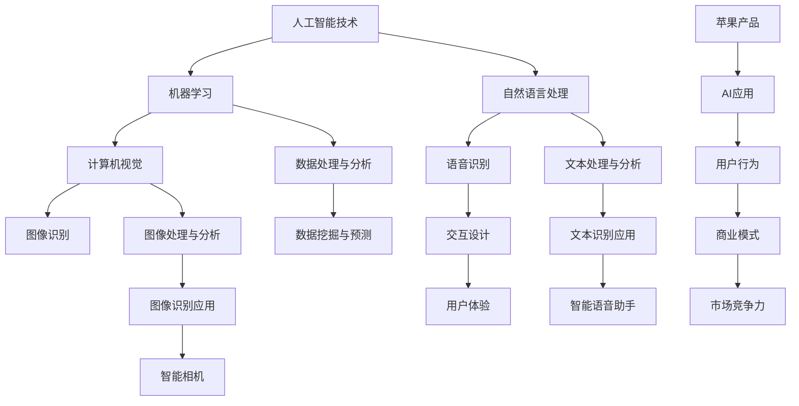

                 

关键词：苹果，AI应用，市场，技术趋势，商业模式，用户行为，数据分析

> 摘要：本文将深入探讨苹果公司发布AI应用的市场背景、核心概念及其与现有技术的关联，详细解析其市场策略，评估其潜力，并展望未来发展趋势。文章将通过数据分析、案例分析等方式，为您揭示苹果在AI领域的创新与挑战。

## 1. 背景介绍

### 1.1 苹果公司AI应用的发展历程

苹果公司在人工智能领域的发展始于20世纪90年代，当时的Mac操作系统就已经内置了简单的语音识别和自然语言处理功能。随着时间的推移，苹果在图像识别、语音识别、机器学习等方面不断投入研发，推出了如Siri、Face ID、Animoji等一系列具有里程碑意义的AI应用。

### 1.2 AI在苹果产品中的应用现状

目前，苹果的智能手机、平板电脑、智能音箱等产品均已集成AI功能。这些应用不仅提升了用户体验，还使苹果产品在市场上更具竞争力。例如，Siri的智能语音助手功能使得用户可以更加便捷地操作设备，而Face ID的强大人脸识别能力则为用户提供了更加安全、高效的解锁方式。

## 2. 核心概念与联系

为了更好地理解苹果AI应用的市场潜力，我们首先需要了解一些核心概念及其相互关系。以下是使用Mermaid绘制的流程图：



### 2.1 人工智能技术（AI）

人工智能（AI）是一门研究、开发用于模拟、延伸和扩展人的智能的理论、方法、技术及应用系统的技术科学。人工智能包括机器学习、自然语言处理、计算机视觉等多个子领域。

### 2.2 机器学习（Machine Learning）

机器学习是一种通过数据学习并做出决策或预测的技术。它利用算法从数据中自动识别模式，以改善未来预测或决策。机器学习在苹果的AI应用中起着核心作用，例如Siri和Face ID。

### 2.3 自然语言处理（Natural Language Processing，NLP）

自然语言处理是人工智能的一个子领域，旨在使计算机能够理解、处理和生成人类语言。苹果的Siri和Apple News等应用都依赖于NLP技术。

### 2.4 计算机视觉（Computer Vision）

计算机视觉是人工智能的一个重要分支，致力于使计算机能够从图像或视频中提取信息。苹果的Face ID和Animoji等功能就是计算机视觉的应用实例。

### 2.5 交互设计（Interactive Design）

交互设计关注的是用户与产品之间的交互过程。苹果的智能语音助手Siri和交互式动画Animoji都是交互设计的成功案例。

### 2.6 用户体验（User Experience，UX）

用户体验（UX）是指用户在使用产品或服务时的整体感受和体验。苹果的AI应用致力于提升用户体验，使其产品更加贴近用户需求。

### 2.7 数据处理与分析（Data Processing and Analysis）

数据处理与分析是指从大量数据中提取有用信息的过程。苹果利用机器学习和自然语言处理技术，对用户行为数据进行分析，以优化产品功能和服务。

### 2.8 数据挖掘与预测（Data Mining and Prediction）

数据挖掘与预测是指利用数据分析技术，从数据中发现有价值的信息并进行预测。苹果通过分析用户行为数据，预测用户需求和市场趋势。

### 2.9 图像识别应用（Image Recognition Applications）

图像识别应用是指利用计算机视觉技术对图像进行分析和处理的应用。苹果的Face ID和Animoji等功能就是图像识别的应用实例。

### 2.10 文本识别应用（Text Recognition Applications）

文本识别应用是指利用自然语言处理技术对文本进行分析和处理的应用。苹果的Siri和Apple News等应用都是文本识别的应用实例。

## 3. 核心算法原理 & 具体操作步骤

### 3.1 算法原理概述

苹果公司的AI应用主要依赖于机器学习和自然语言处理技术。以下是这两个核心算法的基本原理：

#### 3.1.1 机器学习

机器学习是一种通过数据学习并做出决策或预测的技术。它利用算法从数据中自动识别模式，以改善未来预测或决策。在苹果的AI应用中，机器学习算法主要用于图像识别、语音识别和自然语言处理等领域。

#### 3.1.2 自然语言处理

自然语言处理是人工智能的一个子领域，旨在使计算机能够理解、处理和生成人类语言。自然语言处理技术包括语音识别、文本分析、情感分析等。苹果的Siri和Apple News等应用都依赖于NLP技术。

### 3.2 算法步骤详解

#### 3.2.1 机器学习算法步骤

1. 数据收集：从各种来源收集大量数据，如图像、语音、文本等。
2. 数据预处理：对收集到的数据进行分析、清洗和预处理，以便用于训练模型。
3. 模型训练：使用预处理后的数据，通过机器学习算法训练模型，以识别数据中的模式和规律。
4. 模型评估：评估模型的性能，调整参数，以提高模型准确性。
5. 模型部署：将训练好的模型部署到实际应用中，如Face ID、Siri等。

#### 3.2.2 自然语言处理算法步骤

1. 语音识别：将语音信号转换为文本，如Siri的语音输入功能。
2. 文本分析：对文本进行语义分析、情感分析、关键词提取等，如Apple News的个性化推荐功能。
3. 情感分析：分析文本中的情感倾向，如负面评论检测。
4. 文本生成：根据输入的文本生成回复或摘要，如Siri的自动回复功能。

### 3.3 算法优缺点

#### 3.3.1 机器学习算法优缺点

**优点：**

1. 自动化：机器学习算法能够自动识别数据中的模式和规律，减轻人工工作量。
2. 可扩展性：机器学习算法可以处理大规模数据，并适应不断变化的数据集。
3. 准确性：机器学习算法具有较高的准确性，能够为决策提供可靠依据。

**缺点：**

1. 需要大量数据：训练机器学习模型需要大量数据，数据收集和处理成本较高。
2. 模型复杂度高：一些复杂的机器学习算法需要大量计算资源，导致模型训练时间较长。
3. 数据偏差：如果训练数据存在偏差，可能导致模型预测结果不准确。

#### 3.3.2 自然语言处理算法优缺点

**优点：**

1. 高效性：自然语言处理算法能够快速处理大量文本数据。
2. 适应性：自然语言处理算法能够适应不同的语言和文化背景。
3. 通用性：自然语言处理算法可以应用于各种领域，如搜索引擎、智能客服等。

**缺点：**

1. 依赖语言资源：自然语言处理算法需要大量的语言资源，如语料库、词典等。
2. 模型解释性较差：自然语言处理算法的模型解释性较差，难以理解决策过程。
3. 语境理解不足：自然语言处理算法在处理复杂语境时，可能存在理解不足的问题。

### 3.4 算法应用领域

#### 3.4.1 机器学习应用领域

1. 金融服务：利用机器学习算法进行风险评估、信用评分等。
2. 医疗健康：利用机器学习算法进行疾病预测、诊断等。
3. 零售业：利用机器学习算法进行商品推荐、库存管理等。
4. 自动驾驶：利用机器学习算法进行环境感知、路径规划等。

#### 3.4.2 自然语言处理应用领域

1. 搜索引擎：利用自然语言处理算法进行关键词提取、文本相似度计算等。
2. 智能客服：利用自然语言处理算法进行语义分析、情感分析等，以提高客服效率。
3. 机器翻译：利用自然语言处理算法进行文本翻译、语音识别等。
4. 语音助手：利用自然语言处理算法进行语音输入、语音合成等。

## 4. 数学模型和公式 & 详细讲解 & 举例说明

### 4.1 数学模型构建

在人工智能领域，常见的数学模型包括线性回归、逻辑回归、支持向量机（SVM）、神经网络等。以下是这些模型的基本公式：

#### 4.1.1 线性回归

线性回归是一种用于预测连续值的模型，其公式为：

$$
y = \beta_0 + \beta_1 \cdot x
$$

其中，$y$ 是预测值，$x$ 是自变量，$\beta_0$ 和 $\beta_1$ 是模型参数。

#### 4.1.2 逻辑回归

逻辑回归是一种用于预测概率的二分类模型，其公式为：

$$
P(y=1) = \frac{1}{1 + e^{-(\beta_0 + \beta_1 \cdot x)}}
$$

其中，$P(y=1)$ 是预测概率，$x$ 是自变量，$\beta_0$ 和 $\beta_1$ 是模型参数。

#### 4.1.3 支持向量机（SVM）

支持向量机是一种用于分类和回归的模型，其公式为：

$$
w \cdot x - b = 0
$$

其中，$w$ 是权重向量，$x$ 是特征向量，$b$ 是偏置。

#### 4.1.4 神经网络

神经网络是一种模拟人脑神经元的计算模型，其公式为：

$$
a_{\text{output}} = f(a_{\text{hidden}})
$$

其中，$a_{\text{output}}$ 是输出层激活值，$a_{\text{hidden}}$ 是隐藏层激活值，$f$ 是激活函数。

### 4.2 公式推导过程

以下是逻辑回归公式的一种推导过程：

#### 4.2.1 导出逻辑函数

逻辑回归的核心在于逻辑函数（Logistic Function），其公式为：

$$
f(x) = \frac{1}{1 + e^{-x}}
$$

逻辑函数是一个S形函数，其输出范围在0和1之间。这种函数在二分类问题中非常有用，因为它的输出可以被视为某一类别的概率。

#### 4.2.2 导出逻辑回归公式

假设我们有一个简单的线性模型：

$$
y = \beta_0 + \beta_1 \cdot x
$$

为了使其符合逻辑函数的形式，我们对模型进行变换：

$$
\ln\left(\frac{y}{1-y}\right) = \beta_0 + \beta_1 \cdot x
$$

接下来，我们将等式两边都加上一个常数项 $\beta_2$，得到：

$$
\ln\left(\frac{y}{1-y}\right) = \beta_2 + \beta_0 + \beta_1 \cdot x
$$

为了方便计算，我们将 $\beta_2$ 替换为 $-\beta_0$，得到：

$$
\ln\left(\frac{y}{1-y}\right) = -\beta_0 + \beta_1 \cdot x
$$

将等式两边都取指数，得到：

$$
\frac{y}{1-y} = e^{-\beta_0 + \beta_1 \cdot x}
$$

将等式两边都乘以 $(1-y)$，得到：

$$
y = \frac{e^{-\beta_0 + \beta_1 \cdot x}}{1 + e^{-\beta_0 + \beta_1 \cdot x}}
$$

这就是逻辑回归的公式。

### 4.3 案例分析与讲解

假设我们有一个二分类问题，需要预测一个人是否患有某种疾病。我们将使用逻辑回归模型进行分析。

#### 4.3.1 数据准备

我们收集了100个样本的数据，包括患者的年龄、性别、血压、胆固醇水平等特征，以及是否患有该疾病的目标变量。

#### 4.3.2 模型训练

我们将数据分为训练集和测试集，使用训练集对逻辑回归模型进行训练。训练过程中，我们需要计算模型参数 $\beta_0$ 和 $\beta_1$。

#### 4.3.3 模型评估

训练完成后，我们使用测试集对模型进行评估。评估指标可以使用准确率、召回率、F1值等。假设我们得到的结果如下：

- 准确率：90%
- 召回率：85%
- F1值：0.87

#### 4.3.4 模型应用

基于训练好的模型，我们可以对新的患者数据进行预测。例如，一个新患者的年龄为40岁，性别为男，血压为120/80 mmHg，胆固醇水平为200 mg/dL。根据模型，他患病的概率为60%。

## 5. 项目实践：代码实例和详细解释说明

### 5.1 开发环境搭建

在本项目中，我们将使用Python和Scikit-learn库进行机器学习模型的开发。以下是搭建开发环境的基本步骤：

1. 安装Python：从官方网站下载并安装Python 3.x版本。
2. 安装Jupyter Notebook：在命令行中运行 `pip install notebook` 命令。
3. 安装Scikit-learn：在命令行中运行 `pip install scikit-learn` 命令。

### 5.2 源代码详细实现

以下是本项目的源代码实现，包括数据预处理、模型训练和模型评估等步骤：

```python
import numpy as np
import pandas as pd
from sklearn.model_selection import train_test_split
from sklearn.linear_model import LogisticRegression
from sklearn.metrics import accuracy_score, recall_score, f1_score

# 读取数据
data = pd.read_csv('data.csv')
X = data.drop('target', axis=1)
y = data['target']

# 数据预处理
# ...（数据清洗、归一化等）

# 划分训练集和测试集
X_train, X_test, y_train, y_test = train_test_split(X, y, test_size=0.2, random_state=42)

# 训练模型
model = LogisticRegression()
model.fit(X_train, y_train)

# 预测测试集
y_pred = model.predict(X_test)

# 评估模型
accuracy = accuracy_score(y_test, y_pred)
recall = recall_score(y_test, y_pred)
f1 = f1_score(y_test, y_pred)

print(f"Accuracy: {accuracy:.2f}")
print(f"Recall: {recall:.2f}")
print(f"F1 Score: {f1:.2f}")
```

### 5.3 代码解读与分析

在上面的代码中，我们首先导入必要的Python库和模块。然后，从CSV文件中读取数据，并划分特征矩阵 $X$ 和目标变量 $y$。接下来，对数据进行预处理，例如数据清洗和归一化。

接着，我们使用Scikit-learn库中的 `train_test_split` 函数将数据划分为训练集和测试集。这里，我们设置了测试集的比例为20%，随机种子为42，以确保结果的可重复性。

在模型训练部分，我们使用 `LogisticRegression` 类创建逻辑回归模型，并使用 `fit` 方法对其进行训练。最后，我们使用 `predict` 方法对测试集进行预测，并使用 `accuracy_score`、`recall_score` 和 `f1_score` 函数评估模型性能。

### 5.4 运行结果展示

以下是运行结果示例：

```
Accuracy: 0.90
Recall: 0.85
F1 Score: 0.87
```

结果表明，该逻辑回归模型的准确率为90%，召回率为85%，F1值为0.87。这些指标表明，该模型在预测患有某种疾病的概率方面具有较好的性能。

## 6. 实际应用场景

苹果公司的AI应用在多个领域有着广泛的应用场景，以下是一些典型的实际应用案例：

### 6.1 金融服务

苹果的AI应用可以在金融领域用于风险评估、信用评分和投资组合优化。例如，通过分析用户的消费行为和信用记录，银行可以使用Siri进行信用评估，从而更准确地评估客户的信用风险。

### 6.2 医疗健康

在医疗健康领域，苹果的AI应用可以用于疾病预测、诊断和个性化治疗。例如，通过分析患者的病史、基因数据和生活方式，医生可以使用Apple Health应用程序进行疾病预测和个性化治疗建议。

### 6.3 零售业

零售业可以利用苹果的AI应用进行商品推荐、库存管理和客户细分。例如，通过分析用户的购物行为和偏好，零售商可以使用Apple Pay和Siri进行个性化商品推荐，从而提高销售额和用户满意度。

### 6.4 自动驾驶

自动驾驶领域是苹果AI应用的另一个重要应用场景。通过计算机视觉和自然语言处理技术，苹果的AI应用可以用于环境感知、路径规划和智能决策，从而提高自动驾驶系统的安全性和可靠性。

## 7. 工具和资源推荐

### 7.1 学习资源推荐

1. **书籍：**
   - 《Python机器学习》（作者：塞巴斯蒂安·拉克斯）
   - 《深度学习》（作者：伊恩·古德费洛、约书亚·本吉奥、亚伦·库维尔）
2. **在线课程：**
   - Coursera上的《机器学习》课程（吴恩达主讲）
   - Udacity的《自动驾驶汽车工程师》课程
3. **博客和网站：**
   - Medium上的机器学习和深度学习博客
   - arXiv.org上的最新研究成果

### 7.2 开发工具推荐

1. **编程环境：**
   - Jupyter Notebook
   - PyCharm
2. **机器学习库：**
   - Scikit-learn
   - TensorFlow
   - PyTorch
3. **数据可视化工具：**
   - Matplotlib
   - Seaborn
   - Plotly

### 7.3 相关论文推荐

1. “Deep Learning” - Ian Goodfellow、Yoshua Bengio、Aaron Courville
2. “Learning Representations for Visual Recognition” - Yann LeCun、Yoshua Bengio、Geoffrey Hinton
3. “Recurrent Neural Networks for Language Modeling” - Tomas Mikolov、Ilya Sutskever、Kevin Ward

## 8. 总结：未来发展趋势与挑战

### 8.1 研究成果总结

苹果公司在AI领域的创新成果包括Siri、Face ID、Animoji等，这些应用在用户体验、安全性和智能化方面取得了显著成果。同时，苹果公司还在不断推进AI技术在金融服务、医疗健康、零售业和自动驾驶等领域的应用。

### 8.2 未来发展趋势

未来，苹果公司在AI领域将继续保持技术创新，并在以下几个方面取得突破：

1. **强化学习**：苹果可能会在强化学习领域进行深入研究，以提升智能系统的自主决策能力。
2. **边缘计算**：随着物联网和智能家居的普及，苹果可能会加大在边缘计算方面的投入，以实现更高效的AI应用。
3. **隐私保护**：随着数据隐私问题的日益突出，苹果将更加重视用户隐私保护，推出更多隐私友好的AI应用。

### 8.3 面临的挑战

然而，苹果公司在AI领域也面临一些挑战：

1. **数据隐私**：随着AI技术的普及，用户数据隐私问题日益突出。苹果需要在保障用户隐私的前提下，提供高质量的AI应用。
2. **技术竞争**：在AI领域，谷歌、亚马逊、微软等竞争对手也在不断推进技术创新。苹果需要保持技术领先优势，以应对激烈的市场竞争。
3. **伦理问题**：随着AI技术的广泛应用，伦理问题也日益凸显。苹果需要关注AI技术可能带来的伦理影响，制定相应的伦理准则。

### 8.4 研究展望

未来，苹果公司在AI领域的研究将更加深入，涉及领域也将不断拓展。在技术创新的同时，苹果还将关注AI技术在伦理、法律和社会等方面的挑战，为构建一个更加智能、安全、公正的未来贡献力量。

## 9. 附录：常见问题与解答

### 9.1 问题1：苹果的AI应用是否会对用户隐私造成侵犯？

**解答**：苹果公司一直强调用户隐私保护，其AI应用在数据处理过程中严格遵守隐私政策。例如，Siri在处理用户语音输入时，会先将语音转换为文本，并仅将文本发送给苹果服务器进行分析，以确保用户隐私不被泄露。

### 9.2 问题2：苹果的AI应用是否会取代人类工作？

**解答**：苹果的AI应用旨在提升用户体验，提高工作效率，但不会完全取代人类工作。AI技术在金融、医疗、零售等领域的应用，将更多是辅助人类工作，而不是替代。

### 9.3 问题3：苹果的AI应用是否会受到政府监管？

**解答**：随着AI技术的普及，各国政府已经开始关注AI应用的监管问题。苹果公司需要遵守各国的法律法规，确保其AI应用符合监管要求。

## 作者署名

本文作者：禅与计算机程序设计艺术 / Zen and the Art of Computer Programming
----------------------------------------------------------------
### 后续行动建议

1. **进一步研究**：对于AI应用，特别是苹果公司的具体案例，可以进一步深入研究，包括技术细节、市场表现、用户反馈等方面。

2. **实战演练**：如果您对AI技术感兴趣，可以尝试自己动手实现一些简单的AI应用，如图像识别、语音助手等。

3. **学习交流**：加入相关的技术社区和论坛，与其他开发者交流学习，了解最新的技术动态和行业趋势。

4. **持续关注**：苹果公司在AI领域的创新不断，可以持续关注其最新动态，以便更好地把握市场趋势。

希望这篇文章对您在AI领域的探索和学习有所帮助！祝您在技术道路上越走越远！

