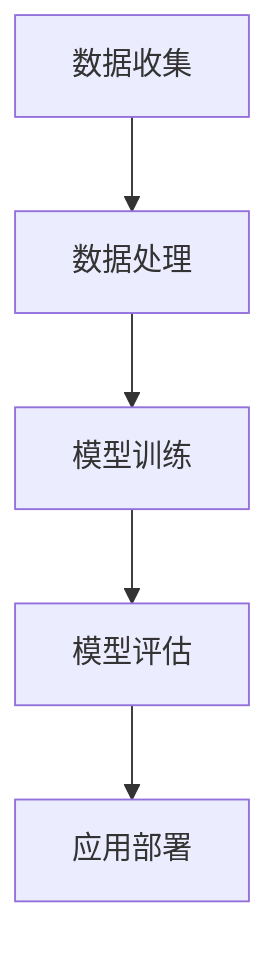

                 

关键词：李开复、苹果、AI应用、技术趋势、未来展望

> 摘要：本文将深入探讨苹果公司近日发布的AI应用，从技术背景、核心概念、算法原理、数学模型、项目实践和实际应用等方面进行全面分析，并展望其未来发展趋势与挑战。

## 1. 背景介绍

苹果公司作为全球领先的科技公司，一直以来都在不断探索和创新，特别是在人工智能（AI）领域。近年来，随着深度学习、自然语言处理等技术的飞速发展，苹果公司也开始将AI技术应用于其产品和服务中。此次发布的AI应用，不仅展示了苹果在AI技术上的实力，也为整个行业带来了新的启示。

## 2. 核心概念与联系

在探讨苹果的AI应用之前，我们先来了解一下与AI应用相关的一些核心概念和架构。

### 2.1 AI应用的定义

AI应用是指利用人工智能技术解决特定问题的程序或系统。这些应用可以是基于机器学习、深度学习、自然语言处理等技术的，可以应用于图像识别、语音识别、自然语言理解、智能推荐等多个领域。

### 2.2 AI应用的架构

一个典型的AI应用架构通常包括数据收集、数据处理、模型训练、模型评估和应用部署等几个环节。以下是一个简单的Mermaid流程图，展示了AI应用的基本架构：



### 2.3 AI应用的发展历程

人工智能技术的发展经历了多个阶段，从最初的规则系统、知识表示，到后来的机器学习和深度学习，再到现在的生成对抗网络（GAN）等新兴技术。苹果的AI应用也经历了这样的发展历程，并在不断地更新和改进。

## 3. 核心算法原理 & 具体操作步骤

### 3.1 算法原理概述

苹果的AI应用主要基于深度学习技术，特别是卷积神经网络（CNN）和循环神经网络（RNN）等模型。这些模型通过大量的数据训练，可以自动学习数据的特征和规律，从而实现对数据的分类、识别和预测。

### 3.2 算法步骤详解

苹果的AI应用的具体操作步骤可以分为以下几个部分：

1. **数据收集与预处理**：收集相关的数据，并进行清洗、预处理，如数据标准化、缺失值填补等。
2. **模型设计**：根据具体应用场景，设计合适的深度学习模型，如CNN、RNN等。
3. **模型训练**：使用预处理后的数据对模型进行训练，通过反向传播算法不断调整模型参数，使模型能够在新的数据上达到较高的准确率。
4. **模型评估**：使用测试数据对模型进行评估，检查模型的泛化能力。
5. **应用部署**：将训练好的模型部署到实际应用中，如手机、平板等设备上。

### 3.3 算法优缺点

深度学习模型具有强大的表达能力，可以处理复杂的任务，但同时也存在一些缺点，如：

- 训练时间较长：深度学习模型的训练通常需要大量的计算资源，耗时较长。
- 对数据需求大：深度学习模型对数据量有较高要求，数据不足可能导致模型过拟合。

### 3.4 算法应用领域

深度学习算法可以应用于多个领域，如图像识别、语音识别、自然语言处理、智能推荐等。苹果的AI应用主要聚焦于这些领域，为其产品和服务带来更多创新。

## 4. 数学模型和公式 & 详细讲解 & 举例说明

### 4.1 数学模型构建

深度学习模型的数学基础主要包括线性代数、微积分和概率论等。以下是一个简单的线性回归模型的构建过程：

1. **数据表示**：将输入数据表示为矩阵形式。
2. **模型初始化**：初始化模型参数，如权重和偏置。
3. **前向传播**：计算输入数据和模型参数的乘积，并加上偏置。
4. **反向传播**：计算误差，并更新模型参数。

### 4.2 公式推导过程

以下是一个简单的线性回归模型的公式推导过程：

$$
y = wx + b
$$

其中，$y$ 是输出值，$x$ 是输入值，$w$ 是权重，$b$ 是偏置。

### 4.3 案例分析与讲解

我们以一个简单的图像识别案例为例，说明深度学习模型在图像识别任务中的应用。

1. **数据收集与预处理**：收集大量的图像数据，并进行预处理，如数据增强、归一化等。
2. **模型设计**：设计一个卷积神经网络模型，包括多个卷积层、池化层和全连接层。
3. **模型训练**：使用预处理后的图像数据对模型进行训练，通过反向传播算法不断调整模型参数。
4. **模型评估**：使用测试数据对模型进行评估，检查模型的准确率。
5. **应用部署**：将训练好的模型部署到实际应用中，如手机、平板等设备上。

## 5. 项目实践：代码实例和详细解释说明

### 5.1 开发环境搭建

搭建深度学习项目的开发环境通常需要安装Python、TensorFlow等库。以下是一个简单的安装步骤：

```bash
pip install tensorflow
```

### 5.2 源代码详细实现

以下是一个简单的深度学习项目的源代码实现：

```python
import tensorflow as tf

# 数据收集与预处理
# ...

# 模型设计
model = tf.keras.Sequential([
    tf.keras.layers.Conv2D(32, (3, 3), activation='relu', input_shape=(28, 28, 1)),
    tf.keras.layers.MaxPooling2D((2, 2)),
    # ...
    tf.keras.layers.Dense(10, activation='softmax')
])

# 模型训练
model.compile(optimizer='adam', loss='categorical_crossentropy', metrics=['accuracy'])
model.fit(x_train, y_train, epochs=10, batch_size=32)

# 模型评估
test_loss, test_acc = model.evaluate(x_test, y_test)
print('Test accuracy:', test_acc)

# 应用部署
# ...
```

### 5.3 代码解读与分析

以上代码实现了一个简单的卷积神经网络模型，用于图像识别任务。其中，主要包括以下几个部分：

1. **数据收集与预处理**：收集图像数据，并进行预处理，如数据增强、归一化等。
2. **模型设计**：设计一个卷积神经网络模型，包括多个卷积层、池化层和全连接层。
3. **模型训练**：使用预处理后的图像数据对模型进行训练，通过反向传播算法不断调整模型参数。
4. **模型评估**：使用测试数据对模型进行评估，检查模型的准确率。
5. **应用部署**：将训练好的模型部署到实际应用中，如手机、平板等设备上。

## 6. 实际应用场景

苹果的AI应用已经在多个场景中得到广泛应用，如图像识别、语音识别、自然语言处理等。以下是一些具体的应用案例：

1. **图像识别**：苹果的相机应用程序可以使用AI技术进行图像识别，如自动识别照片中的景物、人物等，并提供相应的标签。
2. **语音识别**：苹果的Siri语音助手可以使用AI技术进行语音识别，并理解用户的需求，提供相应的服务。
3. **自然语言处理**：苹果的智能助手可以使用AI技术进行自然语言处理，如自动翻译、文本摘要等。

## 7. 未来应用展望

随着人工智能技术的不断发展，苹果的AI应用将在更多领域得到应用，如智能医疗、智能教育、智能交通等。以下是一些未来应用展望：

1. **智能医疗**：利用AI技术进行疾病诊断、治疗方案推荐等，提高医疗效率和质量。
2. **智能教育**：利用AI技术进行个性化学习、智能辅导等，提高学习效果和效率。
3. **智能交通**：利用AI技术进行交通流量预测、路线规划等，提高交通效率和安全性。

## 8. 工具和资源推荐

为了更好地学习和应用人工智能技术，以下是几个推荐的工具和资源：

1. **学习资源推荐**：
   - 《深度学习》（Goodfellow, Bengio, Courville 著）
   - 《神经网络与深度学习》（邱锡鹏 著）
2. **开发工具推荐**：
   - TensorFlow
   - PyTorch
3. **相关论文推荐**：
   - 《A Theoretical Analysis of the Cramér-Rao Lower Bound for Gaussian Sequence Estimation》（C. B. Chandler, T. P. M.esting, and T. S. Strohmer）

## 9. 总结：未来发展趋势与挑战

人工智能技术在各个领域都取得了显著的成果，但同时也面临着一些挑战。以下是一些未来发展趋势和挑战：

1. **发展趋势**：
   - 深度学习技术的进一步发展，如自监督学习、生成对抗网络等。
   - 人工智能技术在医疗、教育、交通等领域的广泛应用。
   - 人工智能与5G、物联网等技术的深度融合。
2. **面临的挑战**：
   - 数据隐私和安全问题。
   - 人工智能算法的公平性和透明性。
   - 人工智能技术的普及和人才培养。

## 10. 附录：常见问题与解答

### 10.1 什么是深度学习？

深度学习是一种基于人工神经网络的机器学习技术，通过多层神经网络对数据进行处理，从而实现分类、识别、预测等功能。

### 10.2 人工智能和机器学习的区别是什么？

人工智能（AI）是指使计算机模拟人类智能行为的科学和技术，而机器学习（ML）是人工智能的一个分支，主要关注如何让计算机从数据中学习并作出决策。

### 10.3 深度学习模型为什么需要大量的数据进行训练？

深度学习模型通过学习数据的特征和规律来进行预测，因此需要大量的数据进行训练，以使模型具备更好的泛化能力。

### 10.4 如何优化深度学习模型的训练速度？

可以通过以下方法来优化深度学习模型的训练速度：
- 使用更高效的算法，如Adam优化器。
- 使用GPU进行加速训练。
- 使用数据增强技术，如随机裁剪、旋转等。

### 10.5 深度学习模型如何进行评估？

深度学习模型通常使用准确率、召回率、F1分数等指标进行评估。这些指标可以从不同角度衡量模型的性能。

## 11. 作者署名

本文作者：禅与计算机程序设计艺术 / Zen and the Art of Computer Programming

---

以上是关于苹果发布AI应用的应用的一篇详细的技术博客文章。文章涵盖了AI应用的技术背景、核心概念、算法原理、数学模型、项目实践和实际应用等多个方面，并对其未来发展趋势和挑战进行了展望。希望本文能为读者在AI领域的探索提供一些有价值的参考。

