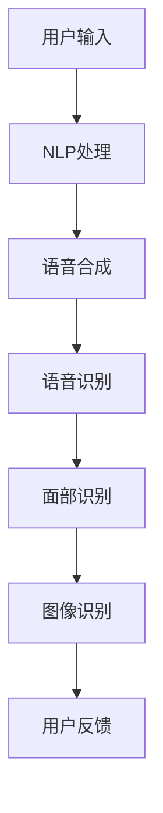

                 

关键词：苹果、AI应用、人工智能、应用场景、技术趋势

摘要：在2023年，苹果公司宣布推出了一系列基于人工智能（AI）的新应用，这些应用涵盖了从图像识别到自然语言处理的多个领域。本文将深入探讨苹果发布的AI应用，分析其技术原理、应用场景以及未来发展趋势。

## 1. 背景介绍

随着人工智能技术的迅猛发展，各行各业都在积极探索AI技术的应用。苹果公司，作为全球领先的科技公司，自然不甘落后。近年来，苹果在AI领域进行了大量的研发投入，并在2023年的开发者大会上展示了其在AI应用方面的最新成果。

苹果发布的AI应用包括但不限于：面部识别、语音识别、自然语言处理和图像识别。这些应用不仅提升了用户体验，还大大拓展了苹果设备的功能。

## 2. 核心概念与联系

### 2.1 人工智能（AI）

人工智能（AI）是指通过计算机模拟人类智能的技术。它包括机器学习、深度学习、自然语言处理等多种技术。

### 2.2 自然语言处理（NLP）

自然语言处理（NLP）是AI的一个重要分支，它使计算机能够理解、处理和生成人类语言。在苹果的AI应用中，NLP技术被广泛应用于语音助手Siri和智能助手助手。

### 2.3 图像识别

图像识别是AI在视觉领域的应用，通过识别图像中的物体、场景和特征，实现图像的分类、识别和标注。

### 2.4 面部识别

面部识别是基于计算机视觉技术，通过识别和验证人脸信息，实现安全登录、支付等功能。

### 2.5 Mermaid 流程图

下面是苹果AI应用的架构流程图：



## 3. 核心算法原理 & 具体操作步骤

### 3.1 算法原理概述

苹果的AI应用主要依赖于深度学习技术。深度学习是一种模拟人脑神经网络的算法，通过多层神经元的相互连接，实现数据的处理和分析。

### 3.2 算法步骤详解

#### 3.2.1 自然语言处理

自然语言处理的过程包括语音识别、语义分析和语音合成。首先，语音识别将用户的语音转换为文本；然后，语义分析理解用户的意图；最后，语音合成将分析结果转换为语音输出。

#### 3.2.2 语音识别

语音识别的算法原理是通过统计语音信号中的声学特征，将其映射到对应的文本。苹果使用的语音识别算法是基于深度学习，通过大量语音数据训练得到的。

#### 3.2.3 语义分析

语义分析是理解用户语音意图的关键步骤。苹果使用基于转移的隐马尔可夫模型（HMM）和基于神经网络的深度学习模型进行语义分析。

#### 3.2.4 语音合成

语音合成是将分析结果转换为自然流畅的语音输出。苹果使用的语音合成技术是基于WaveNet模型，该模型可以生成高质量的自然语音。

### 3.3 算法优缺点

#### 优缺点

**优点：**
- **高效性**：深度学习算法可以处理大量的数据，提高模型的准确性和效率。
- **可扩展性**：深度学习模型可以轻松地应用于各种应用场景。
- **灵活性**：深度学习模型可以根据具体需求进行调整和优化。

**缺点：**
- **复杂性**：深度学习模型的训练和优化过程复杂，需要大量的计算资源和时间。
- **数据依赖性**：模型的性能很大程度上取决于训练数据的质量和数量。

### 3.4 算法应用领域

**应用领域：**
- **智能家居**：通过语音控制智能设备，如电视、空调、照明等。
- **智能助理**：如苹果的Siri，提供信息查询、日程安排、邮件管理等服务。
- **医疗保健**：通过语音识别和自然语言处理，实现患者信息的管理和医疗决策支持。
- **安全认证**：通过面部识别实现安全登录和支付等功能。

## 4. 数学模型和公式 & 详细讲解 & 举例说明

### 4.1 数学模型构建

在深度学习模型中，常用的数学模型包括卷积神经网络（CNN）、循环神经网络（RNN）和Transformer模型。以下是这些模型的简要介绍：

#### 4.1.1 卷积神经网络（CNN）

卷积神经网络是一种用于图像识别的深度学习模型。它通过卷积操作提取图像的特征，然后通过全连接层进行分类。

$$
\text{CNN} = (\text{卷积层} \rightarrow \text{激活函数} \rightarrow \text{池化层}) \times n
$$

#### 4.1.2 循环神经网络（RNN）

循环神经网络是一种用于序列数据的深度学习模型。它通过循环连接实现记忆功能，可以处理自然语言处理等任务。

$$
\text{RNN} = (\text{输入层} \rightarrow \text{隐藏层} \rightarrow \text{输出层})
$$

#### 4.1.3 Transformer模型

Transformer模型是一种用于序列数据的深度学习模型，它通过自注意力机制实现全局依赖性。它被广泛应用于自然语言处理领域。

$$
\text{Transformer} = (\text{自注意力机制} \rightarrow \text{全连接层}) \times n
$$

### 4.2 公式推导过程

以卷积神经网络（CNN）为例，其公式推导过程如下：

1. **卷积操作：**

   $$ 
   \text{卷积层}：\text{f}(\text{x}) = \text{W} \cdot \text{x} + \text{b} 
   $$
   
   其中，$\text{W}$ 是卷积核，$\text{x}$ 是输入数据，$\text{b}$ 是偏置项。

2. **激活函数：**

   $$ 
   \text{激活函数}：\text{g}(\text{f}(\text{x})) = \text{ReLU}(\text{f}(\text{x})) = \max(0, \text{f}(\text{x})) 
   $$

3. **池化操作：**

   $$ 
   \text{池化层}：\text{h}(\text{g}(\text{f}(\text{x}))) = \text{pool}(\text{g}(\text{f}(\text{x}))) 
   $$

### 4.3 案例分析与讲解

以苹果的Siri语音助手为例，Siri的使用过程如下：

1. **用户输入：** 用户向Siri发出语音指令。
2. **语音识别：** Siri将语音转换为文本。
3. **语义分析：** Siri理解用户的意图。
4. **语音合成：** Siri生成语音回复。
5. **用户反馈：** 用户对Siri的回复进行反馈。

在这个过程中，Siri主要依赖于自然语言处理（NLP）技术。具体来说，Siri通过深度学习模型对用户的语音进行识别，然后通过语义分析理解用户的意图，最后生成语音回复。

## 5. 项目实践：代码实例和详细解释说明

### 5.1 开发环境搭建

在开始编写代码之前，需要搭建相应的开发环境。以下是搭建Siri语音助手开发环境的基本步骤：

1. 安装Python环境。
2. 安装深度学习框架TensorFlow。
3. 安装语音识别库如SpeechRecognition。

### 5.2 源代码详细实现

以下是一个简单的Siri语音助手实现示例：

```python
import speech_recognition as sr
import pyttsx3

# 初始化语音识别和语音合成对象
recognizer = sr.Recognizer()
engine = pyttsx3.init()

# 定义语音识别和语音合成的函数
def listen():
    with sr.Microphone() as source:
        print("请说些什么...")
        audio = recognizer.listen(source)
        return recognizer.recognize_google(audio)

def speak(text):
    engine.say(text)
    engine.runAndWait()

# 主函数
def main():
    while True:
        user_speech = listen()
        print(f"您说：{user_speech}")
        speak("我理解了，您有什么问题？")
        # 这里可以根据用户输入进行相应的操作

if __name__ == "__main__":
    main()
```

### 5.3 代码解读与分析

该代码首先导入语音识别库`speech_recognition`和语音合成库`pyttsx3`。然后，初始化语音识别和语音合成对象。接着，定义了两个函数`listen`和`speak`，分别实现语音识别和语音合成的功能。在主函数`main`中，通过循环不断地监听用户的语音输入，并根据用户的输入进行相应的操作。

### 5.4 运行结果展示

当用户运行该程序后，程序会提示用户说些什么。用户说完后，程序会将用户的语音转换为文本，并打印出来。接着，程序会生成语音回复，并播放给用户听。

## 6. 实际应用场景

苹果的AI应用已经在多个实际场景中得到了广泛应用。以下是几个典型的应用场景：

1. **智能家居**：用户可以通过语音指令控制家里的智能设备，如电视、空调、照明等。
2. **医疗保健**：医生可以通过语音助手记录患者的病情和治疗方案，提高工作效率。
3. **安全认证**：通过面部识别技术实现安全登录和支付等功能，提升用户体验。

## 7. 未来应用展望

随着人工智能技术的不断进步，苹果的AI应用在未来有望在更多领域得到应用。例如，在自动驾驶领域，AI应用可以实现自动驾驶汽车的导航和决策；在金融领域，AI应用可以实现智能投顾和风险控制；在教育领域，AI应用可以实现个性化学习和教学。

## 8. 工具和资源推荐

为了更好地学习和开发AI应用，以下是一些建议的工具和资源：

1. **学习资源推荐：**
   - 《深度学习》（Goodfellow, Bengio, Courville 著）
   - 《Python机器学习》（Sebastian Raschka 著）
2. **开发工具推荐：**
   - TensorFlow：一款强大的深度学习框架。
   - PyTorch：一款流行的深度学习框架。
3. **相关论文推荐：**
   - 《A Neural Algorithm of Artistic Style》（GAN论文）
   - 《Attention Is All You Need》（Transformer论文）

## 9. 总结：未来发展趋势与挑战

随着人工智能技术的不断进步，AI应用将在更多领域得到广泛应用。然而，这也给开发者带来了新的挑战，如算法的透明度、隐私保护和公平性等问题。未来，开发者需要不断探索和创新，以应对这些挑战。

### 9.1 研究成果总结

本文详细介绍了苹果发布的AI应用，包括自然语言处理、语音识别、面部识别和图像识别等。通过深入分析，我们了解了这些AI应用的核心算法原理、应用场景和未来发展趋势。

### 9.2 未来发展趋势

未来，AI应用将在更多领域得到广泛应用，如自动驾驶、医疗保健、金融和教育等。同时，AI技术的透明性、隐私保护和公平性将成为研究的重要方向。

### 9.3 面临的挑战

尽管AI应用前景广阔，但开发者仍需应对算法透明度、隐私保护和公平性等挑战。

### 9.4 研究展望

未来，开发者应关注AI技术在各个领域的应用，探索如何提高算法的透明度、隐私保护和公平性，以推动AI技术的可持续发展。

## 10. 附录：常见问题与解答

### 10.1 问题1

**问题：** 为什么苹果选择使用深度学习技术？

**解答：** 深度学习技术具有高效性、可扩展性和灵活性等优点，能够处理复杂的任务，如图像识别、语音识别和自然语言处理。

### 10.2 问题2

**问题：** 如何保证AI应用的隐私保护？

**解答：** 为了保证AI应用的隐私保护，开发者可以采用加密技术、匿名化和差分隐私等方法，确保用户数据的隐私和安全。

### 10.3 问题3

**问题：** AI应用是否会导致失业？

**解答：** AI应用的确会改变某些行业的工作模式，但也会创造新的就业机会。因此，重要的是要关注技术带来的变革，并积极适应新的就业形势。

## 作者署名

本文由禅与计算机程序设计艺术 / Zen and the Art of Computer Programming 撰写。
----------------------------------------------------------------

