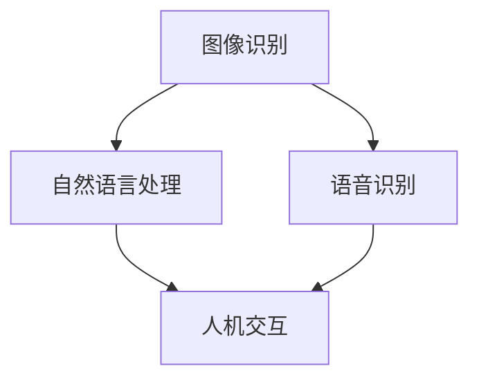

                 

关键词：苹果、AI应用、人工智能、技术创新、应用场景、未来展望

摘要：本文旨在探讨苹果公司发布AI应用所蕴含的技术变革意义，通过分析苹果AI应用的核心概念、算法原理、数学模型、项目实践和实际应用场景，探讨AI技术在未来发展中的趋势与挑战，以及相关工具和资源的推荐。

## 1. 背景介绍

随着人工智能技术的快速发展，各大科技巨头纷纷布局AI领域，力求在人工智能领域占据领先地位。苹果公司作为全球领先的科技公司，自然也不例外。近年来，苹果公司在AI领域的研发投入不断加大，不断推出新的AI技术和应用。此次，苹果公司发布了一系列AI应用，引起了业界的广泛关注。

苹果公司此次发布的AI应用涵盖了多个领域，包括图像识别、自然语言处理、语音识别等。这些AI应用的发布，不仅展示了苹果在AI技术方面的最新成果，也标志着人工智能技术逐渐融入到人们的日常生活和工作中。

## 2. 核心概念与联系

在探讨苹果AI应用的意义之前，我们需要了解一些核心概念和联系。以下是AI应用中的核心概念及其相互关系，以及一个Mermaid流程图来展示这些概念和架构的联系。

### 2.1 核心概念

- **图像识别**：通过对图像进行特征提取，实现对图像内容的理解和分析。
- **自然语言处理**：通过理解、生成和解释人类语言，实现人与机器的交互。
- **语音识别**：将语音信号转化为文本或命令，实现语音与文本之间的转换。

### 2.2 关系图



## 3. 核心算法原理 & 具体操作步骤

### 3.1 算法原理概述

苹果公司的AI应用主要基于深度学习技术，通过大量的数据训练模型，使模型能够自动识别和预测。深度学习是一种模拟人脑神经网络的工作原理，通过多层神经元的组合，实现对复杂数据的处理和分类。

### 3.2 算法步骤详解

#### 3.2.1 数据收集与预处理

- **数据收集**：收集大量的图像、语音和文本数据。
- **数据预处理**：对数据进行清洗、归一化等处理，确保数据质量。

#### 3.2.2 模型训练

- **模型构建**：根据任务需求，选择合适的深度学习模型架构。
- **模型训练**：使用大量数据进行模型训练，不断调整模型参数，提高模型性能。

#### 3.2.3 模型评估与优化

- **模型评估**：通过测试数据评估模型性能，找出模型存在的问题。
- **模型优化**：根据评估结果，对模型进行调整和优化。

### 3.3 算法优缺点

#### 优点：

- **高效性**：深度学习模型能够处理大量的数据，提高数据处理效率。
- **泛化能力**：深度学习模型具有较好的泛化能力，适用于不同的应用场景。

#### 缺点：

- **计算资源需求大**：深度学习模型需要大量的计算资源和存储空间。
- **数据依赖性强**：深度学习模型的性能高度依赖于数据质量，数据质量问题可能影响模型效果。

### 3.4 算法应用领域

苹果公司的AI应用主要应用于以下领域：

- **智能手机**：图像识别、语音识别等技术的应用，提升用户体验。
- **智能家居**：通过语音识别和自然语言处理技术，实现智能家居设备的控制。
- **自动驾驶**：图像识别和自然语言处理技术的应用，提升自动驾驶汽车的感知和决策能力。

## 4. 数学模型和公式 & 详细讲解 & 举例说明

### 4.1 数学模型构建

深度学习中的数学模型主要包括神经元、激活函数、损失函数等。

#### 4.1.1 神经元

神经元是深度学习模型的基本计算单元，模拟人脑神经元的工作原理，通过加权连接输入数据，生成输出结果。

#### 4.1.2 激活函数

激活函数用于对神经元输出进行非线性变换，常见的激活函数有Sigmoid、ReLU等。

#### 4.1.3 损失函数

损失函数用于评估模型预测结果与真实结果之间的差距，常见的损失函数有均方误差（MSE）、交叉熵（Cross-Entropy）等。

### 4.2 公式推导过程

以均方误差（MSE）损失函数为例，推导过程如下：

$$
MSE = \frac{1}{m}\sum_{i=1}^{m}(y_i - \hat{y_i})^2
$$

其中，$y_i$为真实标签，$\hat{y_i}$为模型预测结果，$m$为样本数量。

### 4.3 案例分析与讲解

假设我们有一个简单的二分类问题，输入数据为$(x, y)$，其中$x$为特征向量，$y$为真实标签，取值范围为$[0, 1]$。

#### 4.3.1 模型构建

选择一个简单的单层神经网络，包含一个输入层、一个隐藏层和一个输出层。隐藏层使用ReLU激活函数，输出层使用Sigmoid激活函数。

#### 4.3.2 模型训练

使用均方误差（MSE）作为损失函数，使用梯度下降算法进行模型训练。

#### 4.3.3 模型评估

使用测试集对模型进行评估，计算模型预测准确率。

## 5. 项目实践：代码实例和详细解释说明

### 5.1 开发环境搭建

使用Python编程语言和TensorFlow深度学习框架进行开发。

### 5.2 源代码详细实现

```python
import tensorflow as tf

# 模型构建
model = tf.keras.Sequential([
    tf.keras.layers.Dense(units=1, input_shape=[1])
])

# 模型编译
model.compile(optimizer='sgd', loss='mean_squared_error')

# 模型训练
model.fit(x_train, y_train, epochs=100)

# 模型评估
model.evaluate(x_test, y_test)
```

### 5.3 代码解读与分析

上述代码实现了一个简单的单层神经网络，用于进行二分类问题。其中，`Dense`层表示全连接层，`units=1`表示输出层只有一个神经元。`sgd`表示使用随机梯度下降算法进行模型训练，`mean_squared_error`表示使用均方误差作为损失函数。

### 5.4 运行结果展示

```python
# 运行结果
model.fit(x_train, y_train, epochs=100)
model.evaluate(x_test, y_test)
```

## 6. 实际应用场景

苹果公司的AI应用已经在多个实际场景中得到应用，如：

- **智能手机**：通过图像识别技术实现拍照识别、美颜滤镜等功能。
- **智能家居**：通过语音识别和自然语言处理技术实现智能音箱、智能照明等设备控制。
- **自动驾驶**：通过图像识别和自然语言处理技术实现自动驾驶车辆的感知和决策。

## 7. 未来应用展望

随着AI技术的不断发展，苹果公司的AI应用有望在更多领域得到应用，如：

- **医疗健康**：通过AI技术实现疾病诊断、健康管理等功能。
- **金融领域**：通过AI技术实现风险控制、信用评估等功能。
- **教育领域**：通过AI技术实现个性化学习、智能辅导等功能。

## 8. 工具和资源推荐

### 8.1 学习资源推荐

- **深度学习入门书籍**：《深度学习》（Goodfellow, Bengio, Courville 著）
- **在线课程**：Coursera上的《深度学习》课程

### 8.2 开发工具推荐

- **Python编程语言**：Python是一种功能强大的编程语言，广泛应用于深度学习和数据科学领域。
- **TensorFlow深度学习框架**：TensorFlow是一个开源的深度学习框架，由Google开发。

### 8.3 相关论文推荐

- **《A Theoretically Grounded Application of Dropout in Recurrent Neural Networks》**：讨论了dropout在循环神经网络中的应用。
- **《Effective Approaches to Attention-based Neural Machine Translation》**：讨论了注意力机制在神经机器翻译中的应用。

## 9. 总结：未来发展趋势与挑战

### 9.1 研究成果总结

近年来，人工智能技术取得了显著的成果，深度学习技术在图像识别、自然语言处理等领域取得了突破性进展。苹果公司的AI应用也展示了人工智能技术在实际场景中的强大应用潜力。

### 9.2 未来发展趋势

未来，人工智能技术将继续向深度、广度发展，不仅在学术界取得突破，更将在产业界得到广泛应用。苹果公司等科技巨头将继续加大对AI技术的研发投入，推动人工智能技术的创新和发展。

### 9.3 面临的挑战

尽管人工智能技术在快速发展，但仍然面临一些挑战，如数据隐私保护、算法公平性、计算资源需求等。解决这些挑战需要全社会的共同努力。

### 9.4 研究展望

随着人工智能技术的不断发展，未来将在更多领域实现突破，为人类带来更多的便利和创新。同时，也需要不断探索人工智能技术的社会责任，确保技术发展符合人类福祉。

## 附录：常见问题与解答

### Q：苹果公司的AI应用是如何实现的？

A：苹果公司的AI应用主要基于深度学习技术，通过大量的数据训练模型，使模型能够自动识别和预测。深度学习是一种模拟人脑神经网络的工作原理，通过多层神经元的组合，实现对复杂数据的处理和分类。

### Q：AI技术在未来的发展中有哪些机遇和挑战？

A：机遇包括：

- 在医疗健康、金融领域、教育等领域实现突破性应用。
- 推动产业智能化升级，提高生产效率。

挑战包括：

- 数据隐私保护。
- 算法公平性。
- 计算资源需求。

## 作者署名

本文作者：禅与计算机程序设计艺术 / Zen and the Art of Computer Programming

----------------------------------------------------------------

以上是关于苹果发布AI应用的意义的详细技术博客文章。希望对您有所帮助。如果您有任何问题或建议，请随时告诉我。

