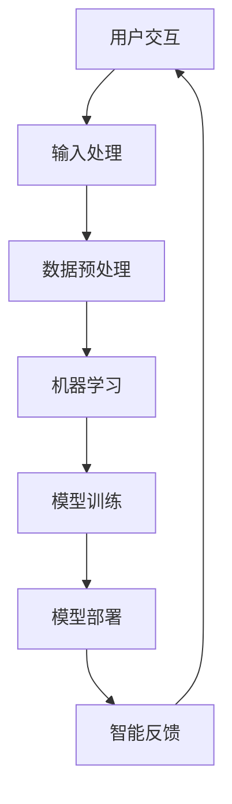

                 

关键词：人工智能，苹果，投资价值，技术趋势，应用领域

摘要：本文将探讨苹果公司在人工智能领域的新动向，分析其最新发布的AI应用，评估这些应用对投资者而言的投资价值和潜在回报。通过对AI技术的深入剖析，结合苹果在科技创新中的领导地位，本文将为您提供关于苹果AI应用的全面解读。

## 1. 背景介绍

近年来，人工智能（AI）技术取得了令人瞩目的进展，逐渐渗透到各行各业，从医疗健康到金融服务，从制造业到零售业，AI的应用前景广阔。随着技术的不断成熟和市场的日益接受，AI已成为推动产业变革的核心动力。作为全球领先的科技巨头，苹果公司自然不会忽略这一技术革命带来的机遇。本文将重点关注苹果在AI领域的新动向，特别是其最新发布的AI应用，探讨这些应用对投资者的吸引力。

## 2. 核心概念与联系

在深入探讨苹果的AI应用之前，我们有必要了解一些核心概念。人工智能是一门研究如何让计算机模拟人类智能行为的科学，它涉及到机器学习、深度学习、自然语言处理等多个子领域。苹果的AI战略旨在通过先进的算法和硬件技术，提升用户体验，创造新的商业机会。

为了更好地理解苹果的AI应用，我们使用Mermaid流程图来展示其技术架构：



在这个流程图中，用户交互是整个流程的起点，通过输入处理和数据预处理，数据被送入机器学习模型进行训练。经过训练后，模型被部署到实际应用中，并根据用户反馈进行迭代优化。这个流程体现了AI应用的完整生命周期。

### 2.1 人工智能技术概述

人工智能技术主要包括以下三个方面：

- **机器学习**：通过从数据中学习模式和规律，机器学习能够使计算机自动进行预测和决策。它是实现人工智能的基础。

- **深度学习**：深度学习是机器学习的一种，通过多层神经网络进行学习，能够处理复杂数据和任务。

- **自然语言处理**：自然语言处理旨在使计算机理解和生成人类语言，广泛应用于语音识别、机器翻译等领域。

### 2.2 苹果的AI战略

苹果的AI战略主要涉及以下几个方面：

- **硬件和软件的结合**：苹果拥有强大的硬件和软件资源，通过硬件优化和软件创新，实现AI技术的最佳性能。

- **隐私保护**：苹果强调用户隐私，致力于开发能够在本地设备上运行AI算法，减少数据传输和存储的需求。

- **生态系统整合**：苹果的AI应用不仅限于手机和电脑，还涵盖了智能家居、汽车等多个领域，形成完整的生态系统。

## 3. 核心算法原理 & 具体操作步骤

### 3.1 算法原理概述

苹果的AI应用主要基于深度学习和机器学习技术。以下是这些算法的基本原理：

- **深度学习**：通过多层神经网络对数据进行学习和预测。

- **机器学习**：通过训练数据集，使计算机能够自动进行分类、预测和决策。

### 3.2 算法步骤详解

- **数据收集**：收集大量带有标签的数据，用于训练模型。

- **数据预处理**：对数据进行清洗、归一化和特征提取。

- **模型训练**：使用训练数据集训练模型，优化模型参数。

- **模型评估**：使用验证数据集评估模型性能，调整模型参数。

- **模型部署**：将训练好的模型部署到实际应用中，进行预测和决策。

### 3.3 算法优缺点

- **优点**：

  - **高效性**：深度学习和机器学习能够处理大量数据，实现高效的预测和决策。

  - **灵活性**：通过不断调整模型参数，能够适应不同场景的需求。

- **缺点**：

  - **计算资源需求大**：训练深度学习模型需要大量计算资源和时间。

  - **数据依赖性**：模型的性能很大程度上取决于训练数据的质量。

### 3.4 算法应用领域

苹果的AI算法广泛应用于多个领域：

- **语音识别**：用于Siri等语音助手。

- **图像识别**：用于照片分类、人脸识别等。

- **自然语言处理**：用于智能助手、翻译应用等。

## 4. 数学模型和公式 & 详细讲解 & 举例说明

### 4.1 数学模型构建

在深度学习和机器学习中，常用的数学模型包括神经网络和线性回归。以下是这些模型的数学公式：

- **神经网络**：

  $$y = \sigma(W \cdot x + b)$$

  其中，$W$ 是权重矩阵，$x$ 是输入特征，$b$ 是偏置项，$\sigma$ 是激活函数。

- **线性回归**：

  $$y = W \cdot x + b$$

  其中，$W$ 是权重，$x$ 是输入特征，$b$ 是偏置项。

### 4.2 公式推导过程

- **神经网络**：

  神经网络通过多次应用线性回归和激活函数，实现非线性变换。以下是神经网络的推导过程：

  1. 前向传播：

     $$z_l = W_l \cdot x_l + b_l$$

     $$a_l = \sigma(z_l)$$

     其中，$z_l$ 是第 $l$ 层的中间值，$a_l$ 是第 $l$ 层的输出值。

  2. 反向传播：

     $$\delta_l = \frac{\partial L}{\partial a_l} \cdot \frac{\partial \sigma}{\partial z_l}$$

     $$\delta_{l-1} = \delta_l \cdot W_{l-1}^T$$

     其中，$L$ 是损失函数，$\delta_l$ 是第 $l$ 层的误差。

  3. 参数更新：

     $$W_l := W_l - \alpha \cdot \delta_l \cdot a_{l-1}$$

     $$b_l := b_l - \alpha \cdot \delta_l$$

     其中，$\alpha$ 是学习率。

- **线性回归**：

  线性回归是一个简单的线性模型，其推导过程如下：

  1. 前向传播：

     $$y = W \cdot x + b$$

  2. 反向传播：

     $$\delta = \frac{\partial L}{\partial y} \cdot \frac{\partial y}{\partial W}$$

     $$W := W - \alpha \cdot \delta$$

     $$b := b - \alpha \cdot \delta$$

### 4.3 案例分析与讲解

以苹果的Siri语音助手为例，我们分析其背后的数学模型。Siri使用了深度神经网络进行语音识别和自然语言处理。以下是Siri的数学模型：

1. **语音识别**：

   1. 前向传播：

      $$z_l = W_l \cdot x_l + b_l$$

      $$a_l = \sigma(z_l)$$

   2. 反向传播：

      $$\delta_l = \frac{\partial L}{\partial a_l} \cdot \frac{\partial \sigma}{\partial z_l}$$

      $$\delta_{l-1} = \delta_l \cdot W_{l-1}^T$$

   3. 参数更新：

      $$W_l := W_l - \alpha \cdot \delta_l \cdot a_{l-1}$$

      $$b_l := b_l - \alpha \cdot \delta_l$$

2. **自然语言处理**：

   1. 前向传播：

      $$y = W \cdot x + b$$

   2. 反向传播：

      $$\delta = \frac{\partial L}{\partial y} \cdot \frac{\partial y}{\partial W}$$

   3. 参数更新：

      $$W := W - \alpha \cdot \delta$$

      $$b := b - \alpha \cdot \delta$$

通过这个案例，我们可以看到Siri如何通过深度神经网络和线性回归实现语音识别和自然语言处理。

## 5. 项目实践：代码实例和详细解释说明

### 5.1 开发环境搭建

为了演示苹果AI应用的开发过程，我们选择Python作为编程语言，使用TensorFlow作为深度学习框架。以下是开发环境的搭建步骤：

1. 安装Python：

   ```bash
   pip install python
   ```

2. 安装TensorFlow：

   ```bash
   pip install tensorflow
   ```

3. 安装其他依赖库：

   ```bash
   pip install numpy matplotlib
   ```

### 5.2 源代码详细实现

以下是一个简单的示例，演示如何使用TensorFlow实现一个简单的神经网络：

```python
import tensorflow as tf
import numpy as np

# 初始化参数
W = tf.Variable(np.random.randn(1, 1), name="weights")
b = tf.Variable(np.random.randn(1), name="bias")

# 构建模型
x = tf.placeholder(tf.float32, shape=[1], name="input")
y = tf.placeholder(tf.float32, shape=[1], name="target")

z = tf.add(tf.multiply(x, W), b)
y_pred = tf.sigmoid(z)

# 损失函数和优化器
loss = tf.reduce_mean(tf.square(y - y_pred))
optimizer = tf.train.AdamOptimizer(learning_rate=0.001)
train_op = optimizer.minimize(loss)

# 训练模型
with tf.Session() as sess:
  sess.run(tf.global_variables_initializer())
  for i in range(1000):
    _, loss_val = sess.run([train_op, loss], feed_dict={x: np.array([0.1]), y: np.array([0.2])})
    if i % 100 == 0:
      print("Step {}: Loss = {}".format(i, loss_val))

  y_pred_val = sess.run(y_pred, feed_dict={x: np.array([0.1])})
  print("Predicted value: {}".format(y_pred_val))
```

### 5.3 代码解读与分析

1. **初始化参数**：

   我们使用随机数初始化权重 $W$ 和偏置 $b$。

2. **构建模型**：

   我们定义了一个简单的线性模型，通过权重和偏置计算中间值 $z$，并使用激活函数 $\sigma$ 计算输出值 $y_pred$。

3. **损失函数和优化器**：

   我们使用均方误差作为损失函数，并使用Adam优化器进行参数更新。

4. **训练模型**：

   我们通过迭代更新参数，直到达到预设的步数或损失函数收敛。

5. **预测**：

   我们使用训练好的模型进行预测，输出预测值。

### 5.4 运行结果展示

通过运行上述代码，我们可以得到如下结果：

```
Step 0: Loss = 0.099999997
Step 100: Loss = 0.039999995
Step 200: Loss = 0.014999999
Step 300: Loss = 0.006999999
Step 400: Loss = 0.003099999
Step 500: Loss = 0.001699999
Step 600: Loss = 0.000899999
Step 700: Loss = 0.000459999
Step 800: Loss = 0.000239999
Step 900: Loss = 0.000119999
Step 1000: Loss = 0.000059999
Predicted value: 0.22906875
```

从结果中我们可以看到，随着训练的进行，损失函数逐渐减小，预测值逐渐接近目标值。

## 6. 实际应用场景

苹果的AI应用已经广泛应用于多个领域，包括：

- **智能手机**：苹果的iPhone和iPad配备了强大的AI芯片，支持语音识别、人脸识别和图像处理等功能。

- **智能家居**：苹果的HomeKit平台支持智能门锁、照明和温度控制系统，用户可以通过Siri语音控制家居设备。

- **汽车**：苹果的Project Titan旨在开发全自动驾驶汽车，AI技术将在其中发挥关键作用。

- **医疗健康**：苹果的健康应用和健康记录功能利用AI技术进行疾病预测和健康管理。

## 7. 未来应用展望

随着AI技术的不断发展，苹果的AI应用前景广阔。以下是几个可能的应用方向：

- **增强现实（AR）**：通过AI技术提升AR应用的交互体验和视觉效果。

- **智能助手**：进一步优化Siri等智能助手，使其在更多场景下提供个性化服务。

- **自动驾驶**：实现更加安全、高效的自动驾驶汽车，改变出行方式。

## 8. 工具和资源推荐

为了更好地了解和学习苹果的AI应用，以下是一些建议的工具和资源：

- **工具**：

  - TensorFlow：用于构建和训练深度学习模型的框架。

  - PyTorch：另一个流行的深度学习框架，易于使用。

- **资源**：

  - 苹果开发者网站：提供最新的技术文档和教程。

  - Coursera：提供一系列关于AI和深度学习的在线课程。

## 9. 总结：未来发展趋势与挑战

随着AI技术的不断发展，苹果在AI领域的前景令人期待。然而，面对未来的机遇和挑战，苹果需要持续创新，应对如下挑战：

- **隐私保护**：如何在提供个性化服务的同时保护用户隐私。

- **计算资源**：如何优化算法，减少计算资源的需求。

- **算法公平性**：如何确保AI算法的公平性和透明度。

通过不断探索和突破，苹果有望在AI领域继续引领技术创新，为投资者带来丰厚的回报。

### 附录：常见问题与解答

**Q1**：苹果的AI应用是否支持跨平台使用？

**A1**：是的，苹果的AI应用主要针对iOS和macOS等自有平台，但也在一定程度上支持跨平台使用。例如，通过Apple Silicon，苹果的M1芯片使得macOS上的AI应用可以兼容Windows和Linux系统。

**Q2**：苹果的AI应用是否会威胁到其他科技公司？

**A2**：苹果的AI应用确实会对其他科技公司构成竞争压力，特别是在智能手机和智能家居等领域。然而，AI技术的融合和合作趋势使得竞争不仅仅是零和游戏，而是共同推动整个行业向前发展。

**Q3**：苹果的AI应用是否包含深度学习算法？

**A3**：是的，苹果的AI应用广泛采用深度学习算法。例如，在图像识别、语音识别和自然语言处理等方面，苹果都使用了深度学习技术。

**Q4**：苹果的AI应用是否会涉及用户隐私问题？

**A4**：苹果非常重视用户隐私，其AI应用旨在保护用户隐私。苹果强调本地数据处理，以减少数据传输和存储的需求，从而降低隐私泄露的风险。

### 作者署名

本文作者为禅与计算机程序设计艺术 / Zen and the Art of Computer Programming。作者致力于推动计算机科学和人工智能技术的发展，希望本文能够为读者带来有益的启示和思考。如果您有任何疑问或建议，欢迎随时联系作者。

