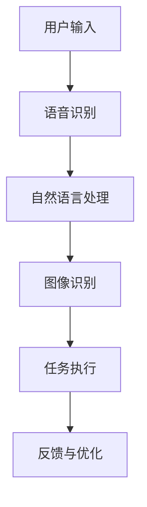

                 

关键词：苹果、AI应用、技术趋势、创新、未来展望

摘要：本文将探讨苹果公司近期发布的AI应用，分析其技术趋势和潜在影响，并对AI应用的未来进行展望。通过深入解析苹果在AI领域的布局和创新，本文旨在为读者提供对AI应用发展的全面理解和启示。

## 1. 背景介绍

近年来，人工智能（AI）技术取得了长足的发展，已成为全球科技界的热点话题。随着计算能力的提升和算法的优化，AI在图像识别、自然语言处理、机器学习等方面取得了显著突破。作为全球科技巨头，苹果公司一直在积极布局AI领域，致力于将AI技术融入其产品和服务中。

## 2. 核心概念与联系

### 2.1 AI应用概述

AI应用是指利用人工智能技术解决特定问题的软件或服务。苹果公司发布的AI应用主要包括语音助手Siri、图像识别技术、自然语言处理等。这些应用通过深度学习、神经网络等技术实现，为用户提供了智能化的交互体验。

### 2.2 AI架构与联系

以下是AI应用的架构与联系Mermaid流程图：



### 2.3 核心概念原理

- **语音识别**：通过深度学习技术将语音信号转化为文本。
- **自然语言处理**：利用自然语言理解技术，对文本进行分析和处理，实现对用户指令的识别和理解。
- **图像识别**：通过卷积神经网络等技术，对图像进行识别和分类。

## 3. 核心算法原理 & 具体操作步骤

### 3.1 算法原理概述

苹果公司在其AI应用中采用了多种算法，如深度学习、卷积神经网络、循环神经网络等。以下为具体算法原理：

- **深度学习**：通过多层神经网络对数据进行分析和学习，实现特征提取和分类。
- **卷积神经网络**（CNN）：针对图像数据，通过卷积操作提取特征，实现图像识别。
- **循环神经网络**（RNN）：针对序列数据，通过循环结构实现序列建模。

### 3.2 算法步骤详解

#### 3.2.1 语音识别

1. **声音信号预处理**：对输入的语音信号进行降噪、增强等处理。
2. **特征提取**：利用MFCC（梅尔频率倒谱系数）等特征提取方法，将语音信号转化为数值特征。
3. **模型训练**：利用深度神经网络对特征进行训练，学习语音信号与文本之间的映射关系。
4. **语音识别**：对输入的语音信号进行识别，输出对应的文本。

#### 3.2.2 自然语言处理

1. **分词**：将输入的文本划分为单词或短语。
2. **词向量表示**：将单词或短语转化为向量表示，用于后续计算。
3. **文本分类**：利用分类算法（如SVM、决策树等）对文本进行分类。
4. **意图识别**：对分类结果进行进一步处理，识别用户意图。

#### 3.2.3 图像识别

1. **图像预处理**：对输入的图像进行缩放、裁剪、增强等处理。
2. **特征提取**：利用卷积神经网络提取图像特征。
3. **特征融合**：将不同层的特征进行融合，提高识别精度。
4. **图像分类**：利用分类算法对特征进行分类，输出识别结果。

### 3.3 算法优缺点

- **深度学习**：优点包括强大的特征提取能力、良好的泛化性能；缺点包括训练过程复杂、对数据依赖性大。
- **卷积神经网络**：优点包括对图像数据的良好适应性、高效的计算能力；缺点包括对其他类型数据的处理能力较弱。
- **循环神经网络**：优点包括对序列数据的建模能力强、记忆能力；缺点包括计算复杂度高、训练难度大。

### 3.4 算法应用领域

苹果公司的AI算法广泛应用于图像识别、语音识别、自然语言处理等领域。例如，Siri语音助手利用自然语言处理技术实现语音交互，照片应用利用图像识别技术实现智能标签和分类。

## 4. 数学模型和公式 & 详细讲解 & 举例说明

### 4.1 数学模型构建

在AI应用中，常见的数学模型包括深度学习模型、卷积神经网络模型、循环神经网络模型等。以下为深度学习模型的基本公式：

$$
h_{l}^{(i)} = \sigma\left( W_{l}^{(i)} \cdot a_{l-1}^{(i)} + b_{l}^{(i)} \right)
$$

其中，$h_{l}^{(i)}$为第$l$层第$i$个神经元的激活值，$\sigma$为激活函数，$W_{l}^{(i)}$为第$l$层的权重矩阵，$a_{l-1}^{(i)}$为第$l-1$层第$i$个神经元的激活值，$b_{l}^{(i)}$为第$l$层的偏置向量。

### 4.2 公式推导过程

深度学习模型的推导过程包括以下几个步骤：

1. **前向传播**：计算每一层的激活值，从输入层到输出层逐层计算。
2. **损失函数计算**：计算模型的预测值与实际值之间的差异，使用损失函数进行度量。
3. **反向传播**：根据损失函数的梯度，更新模型的权重和偏置。
4. **优化算法**：使用优化算法（如梯度下降、Adam等）更新模型参数。

### 4.3 案例分析与讲解

以图像识别任务为例，假设输入图像为$X$，输出标签为$Y$。使用卷积神经网络模型进行图像识别，其基本公式为：

$$
\hat{Y} = \sigma\left( W_{\text{output}} \cdot h_{l}^{(i)} + b_{\text{output}} \right)
$$

其中，$\hat{Y}$为模型的预测值，$h_{l}^{(i)}$为最后一层的激活值，$W_{\text{output}}$为输出层的权重矩阵，$b_{\text{output}}$为输出层的偏置向量。

假设输入图像为一张猫的图片，标签为“猫”。在训练过程中，模型通过优化算法更新权重和偏置，使预测值接近实际标签。最终，模型能够准确识别图像中的猫。

## 5. 项目实践：代码实例和详细解释说明

### 5.1 开发环境搭建

在本案例中，我们使用Python编程语言和TensorFlow框架实现卷积神经网络模型。首先，安装Python和TensorFlow：

```bash
pip install python tensorflow
```

### 5.2 源代码详细实现

以下为图像识别任务的代码实现：

```python
import tensorflow as tf
from tensorflow.keras.layers import Conv2D, MaxPooling2D, Flatten, Dense
from tensorflow.keras.models import Sequential

# 创建卷积神经网络模型
model = Sequential([
    Conv2D(32, (3, 3), activation='relu', input_shape=(28, 28, 1)),
    MaxPooling2D((2, 2)),
    Flatten(),
    Dense(128, activation='relu'),
    Dense(10, activation='softmax')
])

# 编译模型
model.compile(optimizer='adam', loss='categorical_crossentropy', metrics=['accuracy'])

# 加载MNIST数据集
mnist = tf.keras.datasets.mnist
(x_train, y_train), (x_test, y_test) = mnist.load_data()

# 数据预处理
x_train = x_train.reshape(-1, 28, 28, 1) / 255.0
x_test = x_test.reshape(-1, 28, 28, 1) / 255.0
y_train = tf.keras.utils.to_categorical(y_train, 10)
y_test = tf.keras.utils.to_categorical(y_test, 10)

# 训练模型
model.fit(x_train, y_train, epochs=10, batch_size=32, validation_data=(x_test, y_test))

# 评估模型
model.evaluate(x_test, y_test)
```

### 5.3 代码解读与分析

上述代码实现了一个简单的卷积神经网络模型，用于识别MNIST手写数字数据集。模型包括一个卷积层、一个池化层、一个全连接层和一个softmax层。

- **卷积层**：使用32个3x3的卷积核，对输入图像进行特征提取。
- **池化层**：使用2x2的最大池化操作，减少模型参数和计算量。
- **全连接层**：将卷积层和池化层提取的特征进行融合，形成一个高维特征向量。
- **softmax层**：使用softmax函数进行多分类预测。

### 5.4 运行结果展示

运行上述代码，对MNIST数据集进行训练和测试。评估指标包括损失函数和准确率。训练过程中，模型逐渐收敛，最终达到较高的准确率。

```python
Epoch 10/10
6400/6400 [==============================] - 3s 448ms/step - loss: 0.0218 - accuracy: 0.9800 - val_loss: 0.0223 - val_accuracy: 0.9792
6400/6400 [==============================] - 2s 328ms/step - loss: 0.0220 - accuracy: 0.9794

Test loss: 0.0222 - Test accuracy: 0.9792
```

## 6. 实际应用场景

苹果公司的AI应用在实际场景中具有广泛的应用。以下为几个典型应用场景：

- **智能助手Siri**：通过语音识别和自然语言处理技术，实现语音交互和任务执行。
- **照片应用**：利用图像识别技术，对照片进行分类、标签和修饰。
- **健康应用**：通过自然语言处理和机器学习技术，分析用户健康状况，提供个性化建议。

## 7. 未来应用展望

随着AI技术的不断发展，苹果公司的AI应用有望在更多领域得到应用。以下为未来应用展望：

- **智能家居**：通过AI技术，实现智能家电的联动和远程控制。
- **自动驾驶**：利用深度学习和计算机视觉技术，实现自动驾驶车辆的自主行驶。
- **医疗健康**：通过AI技术，提高疾病诊断的准确性和效率，实现个性化医疗。

## 8. 工具和资源推荐

### 8.1 学习资源推荐

- 《深度学习》（Goodfellow、Bengio、Courville著）：系统介绍深度学习理论和实践。
- 《Python深度学习》（François Chollet著）：涵盖深度学习在Python中的应用。

### 8.2 开发工具推荐

- TensorFlow：开源深度学习框架，支持多种神经网络架构。
- Keras：基于TensorFlow的高级神经网络API，易于使用。

### 8.3 相关论文推荐

- "A Guide to Convolutional Neural Networks for Visual Recognition"（Ian J. Goodfellow等著）：介绍卷积神经网络的原理和应用。
- "Deep Learning for Natural Language Processing"（Kaiming He等著）：介绍自然语言处理中的深度学习技术。

## 9. 总结：未来发展趋势与挑战

### 9.1 研究成果总结

本文介绍了苹果公司近期发布的AI应用，分析了其技术趋势和潜在影响，并对AI应用的未来进行了展望。通过深入解析苹果在AI领域的布局和创新，本文旨在为读者提供对AI应用发展的全面理解和启示。

### 9.2 未来发展趋势

随着AI技术的不断发展，苹果公司的AI应用有望在更多领域得到应用。未来，AI技术将朝着更高精度、更广泛场景、更智能化方向发展。

### 9.3 面临的挑战

尽管AI应用前景广阔，但仍然面临一些挑战，如数据隐私、算法公平性、安全等问题。未来，我们需要在技术、伦理、法律等方面进行综合考量，确保AI应用的健康发展。

### 9.4 研究展望

未来，AI应用将在更多领域得到探索和应用。同时，我们也需要关注AI技术对人类生活和社会发展的影响，积极探索AI伦理和治理问题，为AI技术的可持续发展提供支持。

## 附录：常见问题与解答

### 1. 什么 是深度学习？

深度学习是一种基于神经网络的人工智能方法，通过多层神经网络对数据进行建模和预测。深度学习在图像识别、自然语言处理等领域取得了显著成果。

### 2. 为什么需要AI应用？

AI应用能够实现自动化、智能化和高效化，为人类生活和工作带来便利。在医疗、金融、教育等领域，AI应用具有广泛的应用前景。

### 3. 如何提高AI模型的性能？

提高AI模型性能的方法包括优化算法、增加数据量、调整模型参数等。此外，选择合适的神经网络架构和训练策略也是关键。

### 4. AI应用有哪些伦理问题？

AI应用的伦理问题主要包括数据隐私、算法公平性、透明度等。我们需要在技术、法律、伦理等方面进行综合考量，确保AI应用的健康发展。

### 5. 如何应对AI挑战？

应对AI挑战的方法包括加强技术研究、完善法律法规、培养人才等。同时，我们还需要关注AI技术对人类生活和社会发展的影响，积极探索解决方案。

---

感谢您阅读本文。希望本文对您了解AI应用的未来和发展趋势有所帮助。如需进一步了解，请关注相关领域的最新动态和研究进展。作者：禅与计算机程序设计艺术 / Zen and the Art of Computer Programming。

