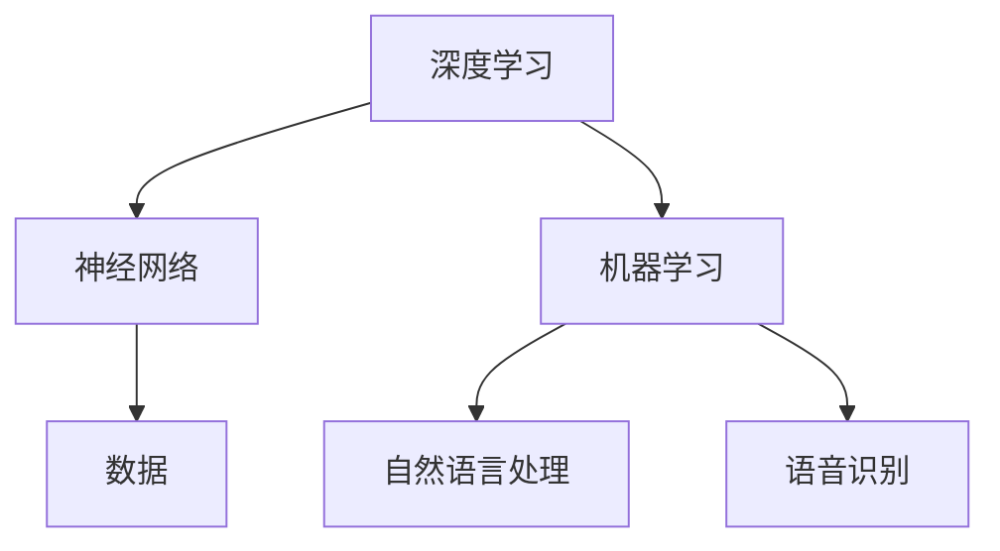

                 

关键词：李开复，苹果，AI应用，未来展望，技术趋势

> 摘要：本文深入探讨了苹果公司近期发布的AI应用，以及其对未来技术发展的深远影响。通过对苹果AI应用的核心概念、算法原理、数学模型和项目实践的分析，我们旨在为读者提供一个全面的视角，了解AI在日常生活和企业应用中的巨大潜力。

## 1. 背景介绍

人工智能（AI）技术近年来取得了飞速发展，不仅改变了我们的生活，也在各行各业中带来了巨大的变革。苹果公司，作为全球科技巨头之一，一直在探索如何将AI技术更好地融入其产品和服务中。从Siri的语音助手到照片分类和面部识别功能，苹果已经在多个方面展示了AI的潜力。

然而，随着AI技术的不断进步，苹果公司近期发布了一系列全新的AI应用，这不仅标志着苹果对AI技术的深度重视，也预示着未来科技发展的新方向。本文将围绕这些应用，探讨AI技术可能带来的变革。

### 1.1 AI应用的发布

苹果公司近日发布了一系列AI应用，包括但不限于：

1. **图像识别和分类**：利用深度学习算法，可以更准确地识别和分类照片，提供更智能的图片管理体验。
2. **语音助手增强**：进一步优化Siri的语音识别和响应能力，使其更自然、更智能。
3. **个性化推荐**：通过分析用户行为和偏好，提供更个性化的内容和应用推荐。
4. **隐私保护**：利用AI技术，提高数据安全性和隐私保护，确保用户信息的安全。

### 1.2 市场影响

苹果公司的AI应用发布，引起了业界的广泛关注。这不仅因为苹果的巨大市场份额，更因为其技术实力和创新能力。随着这些应用的普及，AI技术将更加贴近大众，应用场景也将更加广泛。

## 2. 核心概念与联系

在深入了解苹果的AI应用之前，我们需要明确几个核心概念和它们之间的关系。

### 2.1 深度学习与神经网络

深度学习是人工智能的核心技术之一，它通过模仿人脑的神经网络结构，对大量数据进行分析和学习。神经网络由多个层次组成，每一层都能够提取数据的不同特征。

### 2.2 机器学习与数据

机器学习是AI的基础，它通过算法使计算机能够从数据中学习，并做出预测或决策。数据是机器学习的基础，只有大量的高质量数据，机器学习算法才能发挥出最大的效果。

### 2.3 自然语言处理与语音识别

自然语言处理（NLP）是使计算机理解和生成自然语言的技术。语音识别则是NLP的一个分支，它将语音转换为文本，使得语音助手等应用成为可能。

### 2.4 Mermaid流程图

为了更清晰地展示这些概念之间的联系，我们可以使用Mermaid流程图来描述。



## 3. 核心算法原理 & 具体操作步骤

### 3.1 算法原理概述

苹果的AI应用主要基于深度学习和机器学习技术。具体来说，它们使用了卷积神经网络（CNN）和循环神经网络（RNN）来处理图像和语音数据，同时采用了强化学习算法来优化模型。

### 3.2 算法步骤详解

#### 3.2.1 图像识别与分类

1. **数据收集与预处理**：收集大量图像数据，并进行预处理，如大小调整、灰度化等。
2. **构建卷积神经网络**：使用CNN模型，通过多层卷积和池化操作，提取图像特征。
3. **训练模型**：使用预处理后的图像数据，对CNN模型进行训练，优化模型参数。
4. **评估与测试**：使用未见过的新图像，评估模型的准确性和鲁棒性。

#### 3.2.2 语音识别

1. **音频采集与预处理**：采集用户的语音数据，并进行预处理，如降噪、分割等。
2. **构建循环神经网络**：使用RNN模型，对预处理后的语音数据进行处理，提取语音特征。
3. **训练模型**：使用大量语音数据，对RNN模型进行训练，优化模型参数。
4. **解码与输出**：将处理后的语音数据解码为文本，输出给用户。

#### 3.2.3 个性化推荐

1. **用户行为数据收集**：收集用户在各种应用中的行为数据，如浏览、购买、评论等。
2. **构建推荐模型**：使用机器学习算法，分析用户行为数据，构建推荐模型。
3. **推荐内容生成**：根据用户的偏好和兴趣，生成个性化的推荐内容。
4. **用户反馈与优化**：收集用户对推荐内容的反馈，不断优化推荐模型。

### 3.3 算法优缺点

#### 优点：

1. **高效性**：深度学习和机器学习算法具有很高的计算效率，可以快速处理大量数据。
2. **准确性**：通过大量数据和复杂的模型，AI应用可以提供高精度的识别和预测。
3. **个性化**：个性化推荐和语音助手等功能，可以根据用户的行为和偏好，提供更贴心的服务。

#### 缺点：

1. **计算资源需求**：深度学习和机器学习算法需要大量的计算资源和时间。
2. **数据隐私**：用户数据的安全性和隐私保护是一个重要问题。
3. **算法偏见**：算法可能因为数据集的不平衡或偏差，导致产生偏见。

### 3.4 算法应用领域

1. **图像识别和分类**：广泛应用于社交媒体、安防监控等领域。
2. **语音识别**：广泛应用于智能助手、语音控制等领域。
3. **个性化推荐**：广泛应用于电子商务、新闻推送等领域。

## 4. 数学模型和公式 & 详细讲解 & 举例说明

### 4.1 数学模型构建

苹果的AI应用主要使用了卷积神经网络（CNN）和循环神经网络（RNN）等深度学习模型。以下是一个简化的CNN模型示例：

$$
y = f(W_n \cdot z_n + b_n)
$$

其中，$y$ 是输出，$z_n$ 是输入数据，$W_n$ 是权重矩阵，$b_n$ 是偏置，$f$ 是激活函数。

### 4.2 公式推导过程

以图像识别为例，CNN模型的基本推导过程如下：

1. **输入层**：输入图像数据。
2. **卷积层**：通过卷积操作提取图像特征。
   $$
   h_{ij}^l = \sum_{k} W_{ik}^l * g_{kj}^{l-1} + b_l
   $$
   其中，$h_{ij}^l$ 是第 $l$ 层的第 $i$ 行第 $j$ 列的卷积结果，$W_{ik}^l$ 是卷积核，$g_{kj}^{l-1}$ 是上一层的输出，$b_l$ 是偏置。
3. **池化层**：对卷积结果进行池化操作，减少数据维度。
   $$
   p_{ij}^l = \max(h_{ij}^l)
   $$
4. **全连接层**：将池化结果输入全连接层，进行分类。
   $$
   z_l = W_l \cdot p_{ij}^l + b_l
   $$
   $$
   y = f(z_l)
   $$

### 4.3 案例分析与讲解

假设我们有一个图像识别任务，需要将图片分类为“猫”或“狗”。我们可以使用CNN模型进行训练和预测。

1. **数据集准备**：准备包含“猫”和“狗”图片的数据集，并进行预处理。
2. **模型构建**：构建一个简单的CNN模型，包括卷积层、池化层和全连接层。
3. **模型训练**：使用数据集对模型进行训练，优化模型参数。
4. **模型评估**：使用未训练的数据集，评估模型的准确性和鲁棒性。
5. **预测**：使用训练好的模型，对新图片进行分类预测。

## 5. 项目实践：代码实例和详细解释说明

### 5.1 开发环境搭建

为了实现苹果的AI应用，我们需要搭建一个合适的开发环境。以下是一个简单的Python开发环境搭建步骤：

1. **安装Python**：下载并安装Python 3.8版本。
2. **安装库**：安装TensorFlow、Keras等深度学习库。

### 5.2 源代码详细实现

以下是一个简单的CNN模型实现示例：

```python
import tensorflow as tf
from tensorflow.keras import layers

# 构建模型
model = tf.keras.Sequential([
    layers.Conv2D(32, (3, 3), activation='relu', input_shape=(64, 64, 3)),
    layers.MaxPooling2D((2, 2)),
    layers.Conv2D(64, (3, 3), activation='relu'),
    layers.MaxPooling2D((2, 2)),
    layers.Conv2D(64, (3, 3), activation='relu'),
    layers.Flatten(),
    layers.Dense(64, activation='relu'),
    layers.Dense(1, activation='sigmoid')
])

# 编译模型
model.compile(optimizer='adam', loss='binary_crossentropy', metrics=['accuracy'])

# 训练模型
model.fit(x_train, y_train, epochs=10, validation_data=(x_val, y_val))

# 预测
predictions = model.predict(x_test)
```

### 5.3 代码解读与分析

上述代码实现了一个简单的CNN模型，用于图像识别任务。首先，我们导入了TensorFlow库，并定义了一个序列模型。模型由卷积层、池化层和全连接层组成。在编译模型时，我们指定了优化器和损失函数。接着，使用训练数据对模型进行训练，并在验证集上进行评估。最后，使用训练好的模型对新数据进行预测。

## 6. 实际应用场景

### 6.1 个人生活

随着AI技术的发展，我们的生活变得更加便捷和智能化。例如，苹果的Siri语音助手可以帮我们设置日程、发送消息、查询信息等。图像识别和分类功能可以让我们更轻松地管理照片和视频。个性化推荐系统可以为我们提供更感兴趣的内容和应用。

### 6.2 企业应用

AI技术在企业中的应用也越来越广泛。例如，图像识别和分类技术可以用于安防监控、质量控制等领域。语音识别技术可以用于客服、语音搜索等领域。个性化推荐系统可以用于电子商务、内容推荐等领域。

## 7. 工具和资源推荐

### 7.1 学习资源推荐

1. **《深度学习》（Goodfellow, Bengio, Courville）**：这是一本经典的深度学习教材，详细介绍了深度学习的理论和技术。
2. **TensorFlow官方网站**：提供了丰富的文档和教程，帮助用户快速入门深度学习。

### 7.2 开发工具推荐

1. **Google Colab**：一个免费的云端Jupyter notebook环境，支持GPU加速。
2. **TensorFlow 2.0**：一个易于使用的深度学习框架，适用于各种深度学习任务。

### 7.3 相关论文推荐

1. **“A Neural Algorithm of Artistic Style”**：一篇关于风格迁移的论文，展示了深度学习在艺术领域的应用。
2. **“Deep Learning for Natural Language Processing”**：一篇关于自然语言处理领域的综述，介绍了深度学习在NLP中的应用。

## 8. 总结：未来发展趋势与挑战

### 8.1 研究成果总结

苹果公司的AI应用发布，标志着AI技术在个人生活和企业应用中的深入发展。深度学习、机器学习和自然语言处理等技术，正在不断推动AI技术的发展和应用。

### 8.2 未来发展趋势

1. **计算能力的提升**：随着GPU和TPU等专用硬件的发展，深度学习模型的训练和推理速度将大幅提升。
2. **数据隐私和安全**：随着用户对数据隐私和安全的关注，AI技术将更加注重数据保护。
3. **跨领域的融合**：AI技术将与其他领域（如医疗、金融、教育等）深度融合，带来更多的应用场景。

### 8.3 面临的挑战

1. **算法偏见和公平性**：如何保证AI算法的公平性和透明性，是一个重要的挑战。
2. **数据隐私和安全**：如何确保用户数据的安全和隐私，是AI技术发展的重要问题。
3. **计算资源需求**：深度学习模型需要大量的计算资源，如何优化计算效率，是一个挑战。

### 8.4 研究展望

未来，AI技术将在更多领域得到应用，为人类带来更多的便利和创新。同时，我们也需要关注AI技术带来的伦理和社会问题，确保其在发展的过程中，能够更好地服务于人类。

## 9. 附录：常见问题与解答

### 9.1 什么是深度学习？

深度学习是一种机器学习技术，它通过模拟人脑的神经网络结构，对大量数据进行学习，以实现自动化预测或决策。

### 9.2 人工智能和机器学习的区别是什么？

人工智能（AI）是一个广泛的领域，包括机器学习、深度学习、自然语言处理等子领域。而机器学习是人工智能的一个分支，专注于使用算法从数据中学习，并做出预测或决策。

### 9.3 为什么AI技术需要大量数据？

大量数据是训练机器学习模型的关键，只有通过大量数据的学习，模型才能提取到数据的特征，并做出准确的预测或决策。

### 9.4 AI技术会对就业产生什么影响？

AI技术可能会取代一些重复性和低技能的工作，但也会创造新的就业机会，特别是那些需要复杂思考和创造性工作的领域。

作者：禅与计算机程序设计艺术 / Zen and the Art of Computer Programming
```

