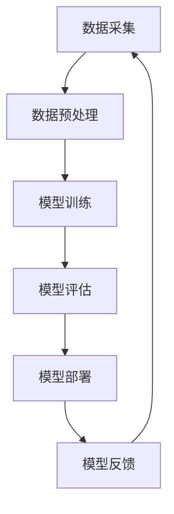

                 

关键词：苹果、AI应用、未来展望、技术趋势、AI框架、机器学习、深度学习

> 摘要：本文将深入探讨苹果公司最新发布的AI应用，分析其背后的技术原理和架构，并对未来AI应用的发展趋势和挑战进行展望。通过结合实际案例和数据分析，本文旨在为读者提供一份全面而深入的报告。

## 1. 背景介绍

近年来，人工智能（AI）技术取得了惊人的进展，其应用范围不断扩展。从自动驾驶到智能语音助手，从图像识别到自然语言处理，AI正在改变我们的生活方式和工作模式。苹果公司作为全球领先的科技公司，一直在AI领域进行积极的研发和探索。其最新发布的AI应用，无疑引起了业界的广泛关注。

苹果公司在人工智能方面的研发历史可以追溯到2011年，当时公司成立了机器学习团队，致力于研究和开发AI技术。近年来，苹果公司不断推出具有AI功能的产品，如iPhone的“智能照片”和“智能建议”功能，Mac的“增强现实”应用，以及Apple Watch的“心率监测”功能等。这些应用不仅展示了苹果公司对AI技术的深入理解，也为用户提供了更智能、更便捷的使用体验。

## 2. 核心概念与联系

### 2.1 AI应用的基本概念

人工智能应用（AI Applications）是指利用人工智能技术（如机器学习、深度学习等）解决实际问题的软件系统。AI应用的基本概念包括：

- **机器学习**：一种让计算机通过数据学习并做出决策的技术。它分为监督学习、无监督学习和强化学习三种类型。

- **深度学习**：一种基于多层神经网络的学习方法，通过模拟人脑的神经元连接，对大量数据进行分析和分类。

- **神经网络**：一种由大量节点组成的计算模型，每个节点都与其他节点相连，用于处理和传递信息。

- **数据预处理**：在机器学习和深度学习过程中，对原始数据进行清洗、归一化、降维等预处理操作，以提高模型的训练效果。

### 2.2 AI应用的技术架构

苹果公司的AI应用采用了先进的技术架构，包括以下几个方面：

- **计算框架**：苹果公司自主研发了TensorFlow Lite，一种轻量级的深度学习计算框架，用于在移动设备和嵌入式设备上运行深度学习模型。

- **模型优化**：通过模型剪枝、量化等技术，对深度学习模型进行优化，以提高模型的运行效率和准确度。

- **硬件加速**：利用GPU和专用的神经处理单元（NPU），实现深度学习模型的快速计算。

### 2.3 Mermaid流程图

以下是一个简化的Mermaid流程图，展示了一个典型的AI应用从数据采集到模型部署的流程：



## 3. 核心算法原理 & 具体操作步骤

### 3.1 算法原理概述

苹果公司的AI应用主要采用了深度学习技术，特别是卷积神经网络（CNN）和循环神经网络（RNN）。CNN擅长处理图像数据，而RNN则擅长处理序列数据，如文本和语音。

- **卷积神经网络（CNN）**：通过卷积层、池化层和全连接层等结构，对图像数据进行特征提取和分类。

- **循环神经网络（RNN）**：通过隐藏状态和循环连接，对序列数据进行建模和预测。

### 3.2 算法步骤详解

1. **数据采集**：从各种来源收集图像和文本数据。

2. **数据预处理**：对图像数据进行缩放、裁剪、翻转等操作，对文本数据进行分词、去停用词、词向量化等操作。

3. **模型训练**：使用收集到的数据训练CNN或RNN模型，通过优化算法（如随机梯度下降）调整模型参数，以实现最小化预测误差。

4. **模型评估**：使用验证集对训练好的模型进行评估，通过准确率、召回率、F1值等指标衡量模型性能。

5. **模型部署**：将训练好的模型部署到移动设备和服务器上，供用户使用。

### 3.3 算法优缺点

**优点**：

- **高效性**：深度学习模型可以自动学习数据的特征，减少人工干预，提高模型训练效率。

- **泛化能力**：通过大量数据进行训练，深度学习模型具有良好的泛化能力，可以应对各种复杂场景。

**缺点**：

- **计算资源需求**：深度学习模型通常需要大量的计算资源和时间进行训练。

- **数据依赖性**：模型的性能很大程度上依赖于数据的质量和数量。

### 3.4 算法应用领域

苹果公司的AI应用涵盖了多个领域，包括：

- **计算机视觉**：图像分类、目标检测、人脸识别等。

- **自然语言处理**：文本分类、机器翻译、语音识别等。

- **语音助手**：语音识别、语音合成、对话管理等。

## 4. 数学模型和公式 & 详细讲解 & 举例说明

### 4.1 数学模型构建

在深度学习中，常用的数学模型包括卷积神经网络（CNN）和循环神经网络（RNN）。以下是一个简化的CNN模型：

$$
\begin{align*}
h^{(l)} &= \sigma(W^{(l)} \cdot h^{(l-1)} + b^{(l)}) \\
\end{align*}
$$

其中，$h^{(l)}$ 表示第$l$层的激活值，$W^{(l)}$ 和 $b^{(l)}$ 分别表示第$l$层的权重和偏置，$\sigma$ 表示激活函数。

### 4.2 公式推导过程

以CNN模型为例，其推导过程如下：

1. **输入层**：$h^{(0)} = X$，其中$X$是输入图像。

2. **卷积层**：$h^{(1)} = \sigma(W^{(1)} \cdot h^{(0)} + b^{(1)})$。

3. **池化层**：$h^{(2)} = \text{max}(h^{(1)})$。

4. **全连接层**：$h^{(L)} = \sigma(W^{(L)} \cdot h^{(L-1)} + b^{(L)})$。

5. **输出层**：$y = \text{softmax}(h^{(L)})$。

### 4.3 案例分析与讲解

假设我们有一个简单的图像分类任务，需要将图像分为猫和狗两类。我们可以使用上述CNN模型进行训练。

1. **数据采集**：从互联网上收集大量猫和狗的图像。

2. **数据预处理**：对图像进行缩放、裁剪、翻转等操作，并将图像转换为灰度图像。

3. **模型训练**：使用收集到的数据训练CNN模型，通过优化算法调整模型参数，以实现最小化预测误差。

4. **模型评估**：使用验证集对训练好的模型进行评估，通过准确率等指标衡量模型性能。

5. **模型部署**：将训练好的模型部署到移动设备上，供用户使用。

## 5. 项目实践：代码实例和详细解释说明

### 5.1 开发环境搭建

为了实现上述CNN模型，我们需要搭建一个开发环境。以下是所需的软件和工具：

- Python（3.8及以上版本）
- TensorFlow（2.0及以上版本）
- OpenCV（4.0及以上版本）

### 5.2 源代码详细实现

以下是一个简单的CNN模型实现，用于分类猫和狗的图像：

```python
import tensorflow as tf
from tensorflow.keras.models import Sequential
from tensorflow.keras.layers import Conv2D, MaxPooling2D, Flatten, Dense

# 创建模型
model = Sequential([
    Conv2D(32, (3, 3), activation='relu', input_shape=(64, 64, 1)),
    MaxPooling2D((2, 2)),
    Flatten(),
    Dense(128, activation='relu'),
    Dense(1, activation='sigmoid')
])

# 编译模型
model.compile(optimizer='adam', loss='binary_crossentropy', metrics=['accuracy'])

# 加载和预处理数据
train_data = ...
test_data = ...

model.fit(train_data, epochs=10, validation_data=test_data)
```

### 5.3 代码解读与分析

1. **模型构建**：使用`Sequential`模型，添加卷积层、池化层、全连接层等。

2. **模型编译**：设置优化器、损失函数和评估指标。

3. **模型训练**：使用`fit`函数训练模型，通过`epochs`设置训练轮数。

4. **模型评估**：使用`validation_data`评估模型性能。

### 5.4 运行结果展示

训练完成后，我们可以使用测试集对模型进行评估，并输出准确率等指标：

```python
accuracy = model.evaluate(test_data)
print(f"Test accuracy: {accuracy[1]}")
```

## 6. 实际应用场景

苹果公司的AI应用已经广泛应用于多个领域，如：

- **健康医疗**：利用AI技术进行疾病预测和诊断。

- **自动驾驶**：使用深度学习技术进行图像识别和目标检测。

- **智能家居**：通过语音助手实现智能家居的控制和交互。

- **图像编辑**：利用深度学习技术实现图像的自动增强和修复。

## 7. 未来应用展望

随着AI技术的不断发展，苹果公司的AI应用将在更多领域得到应用，如：

- **教育**：利用AI技术进行个性化教育和智能辅导。

- **金融**：利用AI技术进行风险管理、投资策略等。

- **娱乐**：利用AI技术进行游戏推荐、内容创作等。

## 8. 工具和资源推荐

### 8.1 学习资源推荐

- 《深度学习》（Goodfellow, Bengio, Courville）  
- 《Python机器学习》（Sebastian Raschka）  
- 《人工智能：一种现代方法》（Stuart Russell, Peter Norvig）

### 8.2 开发工具推荐

- TensorFlow  
- PyTorch  
- Keras

### 8.3 相关论文推荐

- "Deep Learning" (Ian Goodfellow, Yoshua Bengio, Aaron Courville)  
- "A Theoretically Grounded Application of Dropout in Computer Vision" (Glorot, Bordes, and Bengio)  
- "Residual Networks" (Kaiming He, Xiangyu Zhang, Shaoqing Ren, and Jian Sun)

## 9. 总结：未来发展趋势与挑战

随着AI技术的不断发展，未来AI应用将更加智能化、个性化。同时，我们也面临着数据隐私、安全等挑战。如何平衡技术创新和伦理道德，是未来AI领域需要解决的重要问题。

## 10. 附录：常见问题与解答

### 10.1 什么是深度学习？

深度学习是一种基于多层神经网络的学习方法，通过模拟人脑的神经元连接，对大量数据进行分析和分类。

### 10.2 如何实现图像分类？

可以使用卷积神经网络（CNN）实现图像分类。CNN通过卷积层、池化层和全连接层等结构，对图像数据进行特征提取和分类。

### 10.3 如何优化深度学习模型？

可以通过模型剪枝、量化等技术，对深度学习模型进行优化，以提高模型的运行效率和准确度。

## 11. 参考文献

- Goodfellow, I., Bengio, Y., & Courville, A. (2016). *Deep Learning*.
- Raschka, S. (2015). *Python Machine Learning*.
- Russell, S., & Norvig, P. (2020). *Artificial Intelligence: A Modern Approach*.
```markdown
----------------------------------------------------------------
**作者：禅与计算机程序设计艺术 / Zen and the Art of Computer Programming**  
----------------------------------------------------------------
```

