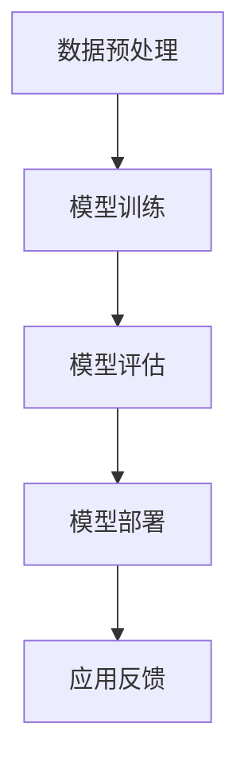

                 

关键词：人工智能、苹果、AI应用、社会价值、技术趋势、商业影响

摘要：本文将探讨苹果公司近期发布的AI应用对社会各领域的深远影响，从技术革新到商业应用，再到对教育、医疗、环境保护等社会问题的解决，分析其在推动社会进步方面的关键作用。

## 1. 背景介绍

随着人工智能技术的快速发展，AI在智能手机、智能家居、医疗诊断、自动驾驶等领域的应用逐渐成熟。苹果公司，作为全球科技巨头之一，近年来在人工智能领域的投资和研发也不断加大。此次苹果发布的AI应用，无疑再次引起了业界的广泛关注。本文将围绕苹果发布的AI应用，分析其在不同领域的应用价值和社会影响。

## 2. 核心概念与联系

### 2.1 人工智能的定义

人工智能（Artificial Intelligence，简称AI）是指计算机系统通过模拟人类智能行为，进行学习、推理、决策和解决问题的能力。它包括机器学习、深度学习、自然语言处理、计算机视觉等多个子领域。

### 2.2 AI应用的基本原理

AI应用的核心是基于大量的数据训练模型，使其具备自主学习和优化能力。通过神经网络的深度学习，AI系统能够从数据中提取特征，并进行分类、预测和决策。

### 2.3 AI应用的结构

AI应用通常包括数据预处理、模型训练、模型评估和模型部署四个主要阶段。每个阶段都需要高度专业化的技术支持。

### 2.4 Mermaid流程图

下面是AI应用的基本架构流程图：



## 3. 核心算法原理 & 具体操作步骤

### 3.1 算法原理概述

苹果公司此次发布的AI应用，主要基于深度学习和强化学习等先进算法。其中，深度学习利用多层神经网络对大量数据进行特征提取，而强化学习则通过不断试错，优化决策过程。

### 3.2 算法步骤详解

1. 数据收集与预处理：收集大量相关数据，并进行清洗、归一化和特征提取等预处理操作。

2. 模型设计：根据应用场景，设计合适的神经网络结构，如卷积神经网络（CNN）或循环神经网络（RNN）。

3. 模型训练：使用预处理后的数据，对模型进行训练，优化网络权重。

4. 模型评估：使用验证集和测试集，评估模型性能，并进行调优。

5. 模型部署：将训练好的模型部署到实际应用环境中。

6. 应用反馈：收集用户反馈，对模型进行持续优化。

### 3.3 算法优缺点

**优点：**
- 高效性：深度学习能够在大量数据中发现复杂特征，提高模型性能。
- 自主性：强化学习能够通过试错，实现自主学习和优化。

**缺点：**
- 计算资源需求大：训练深度学习模型需要大量的计算资源和时间。
- 数据依赖性：模型性能高度依赖数据质量和数量。

### 3.4 算法应用领域

AI技术在图像识别、自然语言处理、自动驾驶、医疗诊断等领域有着广泛的应用。苹果的AI应用，有望在这些领域进一步推动技术创新和应用普及。

## 4. 数学模型和公式 & 详细讲解 & 举例说明

### 4.1 数学模型构建

深度学习中的神经网络模型，主要包括输入层、隐藏层和输出层。每个层由多个神经元组成，神经元之间通过权重连接。训练过程通过反向传播算法，不断调整权重，使模型能够对输入数据进行正确分类或预测。

### 4.2 公式推导过程

神经网络中的激活函数，通常使用sigmoid函数或ReLU函数。以sigmoid函数为例，其公式为：

$$
f(x) = \frac{1}{1 + e^{-x}}
$$

### 4.3 案例分析与讲解

以图像识别为例，假设我们要训练一个神经网络，识别猫和狗的图像。数据集包含10000张猫的图像和10000张狗的图像，每张图像的大小为100x100像素。

1. 数据预处理：将图像转换为灰度图像，并进行归一化处理。
2. 模型设计：设计一个包含3个隐藏层的神经网络，每个隐藏层包含256个神经元。
3. 模型训练：使用交叉熵损失函数，训练神经网络，调整权重。
4. 模型评估：使用验证集和测试集，评估模型性能。
5. 模型部署：将训练好的模型部署到苹果设备上，实现实时图像识别。

## 5. 项目实践：代码实例和详细解释说明

### 5.1 开发环境搭建

1. 安装Python环境。
2. 安装深度学习框架，如TensorFlow或PyTorch。
3. 准备猫和狗的图像数据集。

### 5.2 源代码详细实现

```python
import tensorflow as tf
from tensorflow.keras import layers

# 数据预处理
def preprocess_images(images):
    # 转换为灰度图像
    # 归一化处理
    # 返回预处理后的图像
    pass

# 模型设计
model = tf.keras.Sequential([
    layers.Conv2D(32, (3, 3), activation='relu', input_shape=(100, 100, 1)),
    layers.MaxPooling2D((2, 2)),
    layers.Conv2D(64, (3, 3), activation='relu'),
    layers.MaxPooling2D((2, 2)),
    layers.Conv2D(128, (3, 3), activation='relu'),
    layers.MaxPooling2D((2, 2)),
    layers.Flatten(),
    layers.Dense(512, activation='relu'),
    layers.Dense(1, activation='sigmoid')
])

# 模型训练
model.compile(optimizer='adam', loss='binary_crossentropy', metrics=['accuracy'])
model.fit(x_train, y_train, epochs=10, validation_data=(x_val, y_val))

# 模型评估
test_loss, test_acc = model.evaluate(x_test, y_test)
print(f"Test accuracy: {test_acc}")

# 模型部署
# 将模型部署到苹果设备上
```

### 5.3 代码解读与分析

上述代码实现了基于深度学习的猫狗图像识别模型。首先，进行数据预处理，将图像转换为灰度图像并进行归一化处理。然后，设计一个包含3个隐藏层的卷积神经网络，使用ReLU函数作为激活函数。使用交叉熵损失函数进行模型训练，并在验证集上评估模型性能。最后，将训练好的模型部署到苹果设备上，实现实时图像识别。

## 6. 实际应用场景

苹果发布的AI应用，已在多个领域展现出巨大的应用价值：

- **医疗领域**：通过AI技术，实现早期疾病检测，提高诊断准确率。
- **教育领域**：利用AI，个性化教学，提高教育质量。
- **环境保护**：通过AI，实现智能垃圾分类，降低环境污染。
- **智能家居**：利用AI，实现智能语音助手，提高生活便捷性。

### 6.4 未来应用展望

随着AI技术的不断进步，未来苹果的AI应用有望在更多领域发挥作用，推动社会进步。例如，在自动驾驶领域，AI技术将进一步提升交通安全和效率；在智能城市领域，AI将助力智慧城市建设，提高城市管理效率。

## 7. 工具和资源推荐

### 7.1 学习资源推荐

- 《深度学习》（Goodfellow, Bengio, Courville 著）
- 《Python深度学习》（François Chollet 著）

### 7.2 开发工具推荐

- TensorFlow
- PyTorch

### 7.3 相关论文推荐

- “Deep Learning for Image Recognition”（2012）
- “Reinforcement Learning: An Introduction”（2018）

## 8. 总结：未来发展趋势与挑战

### 8.1 研究成果总结

本文通过对苹果发布的AI应用的分析，总结了其在技术、商业和社会领域的应用价值。同时，介绍了AI应用的核心算法原理、数学模型和实际应用案例。

### 8.2 未来发展趋势

随着AI技术的不断进步，未来AI应用将更加广泛和深入，有望在更多领域推动社会进步。

### 8.3 面临的挑战

然而，AI技术的应用也面临着数据隐私、算法透明性、安全性等方面的挑战。

### 8.4 研究展望

未来，AI技术的研究应关注如何更好地解决这些挑战，推动AI技术的可持续发展。

## 9. 附录：常见问题与解答

### 9.1 AI应用的数据隐私问题如何解决？

- 采用联邦学习等技术，实现数据隐私保护。
- 加强法律法规，规范数据收集和使用。

### 9.2 AI算法的透明性和可解释性问题如何解决？

- 发展可解释AI（XAI）技术，提高算法透明性。
- 加强算法审计，确保算法公平和可解释。

---

作者：禅与计算机程序设计艺术 / Zen and the Art of Computer Programming
----------------------------------------------------------------

以上便是本文的完整内容，希望对您有所启发。如需进一步讨论或交流，欢迎随时留言。

