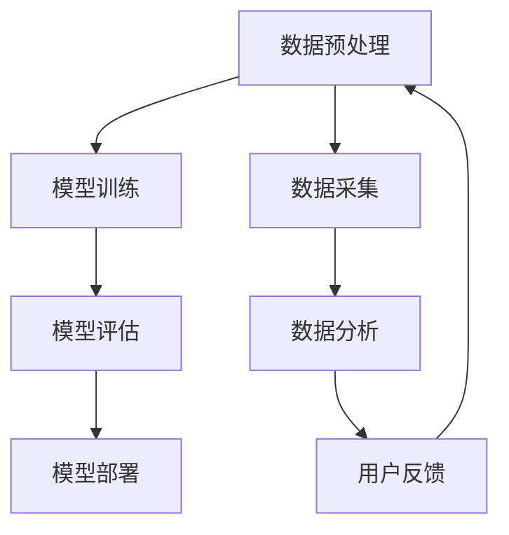

                 

关键词：人工智能，苹果，AI应用，科技价值，深度学习，计算机视觉，自然语言处理，创新

## 摘要

苹果公司在近年来不断加强其人工智能（AI）战略，其最新发布的AI应用无疑再次引发了业界的广泛关注。本文旨在探讨苹果AI应用的科技价值，分析其背后的核心技术和未来发展方向，并探讨这些应用对整个科技行业的影响。

## 1. 背景介绍

### 1.1 苹果的AI战略

自2017年苹果推出AI研究部门以来，该公司在人工智能领域投入了大量资源。其目标是通过AI技术提升产品性能，改善用户体验，并在多个领域实现突破。苹果的AI战略主要集中在计算机视觉、自然语言处理和语音识别等方面。

### 1.2 AI应用的发展趋势

随着深度学习等人工智能技术的发展，AI应用正逐渐渗透到我们生活的方方面面。从智能手机的智能助理到智能家居，再到自动驾驶汽车，AI应用已经成为现代科技的重要组成部分。

## 2. 核心概念与联系

### 2.1 人工智能的基本原理

人工智能（AI）是一种模拟人类智能行为的计算机技术。其核心包括机器学习、深度学习、自然语言处理、计算机视觉等领域。

### 2.2 苹果AI应用的架构

苹果AI应用的架构主要依赖于神经网络模型，包括卷积神经网络（CNN）和循环神经网络（RNN）等。这些模型在图像识别、语音识别和自然语言处理等方面表现出色。

### 2.3 Mermaid流程图



## 3. 核心算法原理 & 具体操作步骤

### 3.1 算法原理概述

苹果的AI应用主要依赖于深度学习技术，特别是卷积神经网络（CNN）和循环神经网络（RNN）。CNN擅长处理图像数据，而RNN则擅长处理序列数据，如语音和文本。

### 3.2 算法步骤详解

1. 数据预处理：对采集到的图像、语音和文本数据进行分析和处理，以适合模型训练。
2. 模型训练：使用预处理后的数据训练神经网络模型。
3. 模型评估：对训练好的模型进行评估，以确保其性能符合要求。
4. 模型部署：将评估通过后的模型部署到实际应用中。
5. 用户反馈：收集用户反馈，用于进一步优化模型。

### 3.3 算法优缺点

**优点：**
- **高效性：** 深度学习模型在处理大量数据时具有很高的效率。
- **灵活性：** 模型可以根据不同的任务需求进行调整和优化。

**缺点：**
- **计算资源需求：** 深度学习模型训练需要大量的计算资源。
- **数据依赖：** 模型性能高度依赖于训练数据的质量和多样性。

### 3.4 算法应用领域

苹果的AI应用主要应用于图像识别、语音识别、自然语言处理等领域。例如，iPhone的相机应用可以通过AI技术实现实时图像识别，Siri语音助手可以通过自然语言处理技术理解用户的语音指令。

## 4. 数学模型和公式 & 详细讲解 & 举例说明

### 4.1 数学模型构建

深度学习中的神经网络模型通常由多层神经元组成。每一层神经元都会对输入数据进行处理，并传递到下一层。

### 4.2 公式推导过程

假设我们有输入数据 \( x \)，通过权重 \( w \) 和偏置 \( b \) 进行处理，输出结果为 \( y \)。

$$
y = f(w \cdot x + b)
$$

其中，\( f \) 为激活函数，如ReLU函数、Sigmoid函数等。

### 4.3 案例分析与讲解

以图像识别为例，输入数据为图像的像素值，输出数据为图像的类别标签。通过深度学习模型，我们可以训练出一个能够准确识别图像类别的模型。

## 5. 项目实践：代码实例和详细解释说明

### 5.1 开发环境搭建

在Python中，可以使用TensorFlow或PyTorch等深度学习框架进行AI应用开发。

### 5.2 源代码详细实现

以下是一个简单的图像识别模型的实现：

```python
import tensorflow as tf

# 定义模型
model = tf.keras.Sequential([
    tf.keras.layers.Conv2D(32, (3, 3), activation='relu', input_shape=(28, 28, 1)),
    tf.keras.layers.MaxPooling2D((2, 2)),
    tf.keras.layers.Flatten(),
    tf.keras.layers.Dense(128, activation='relu'),
    tf.keras.layers.Dense(10, activation='softmax')
])

# 编译模型
model.compile(optimizer='adam',
              loss='categorical_crossentropy',
              metrics=['accuracy'])

# 训练模型
model.fit(x_train, y_train, epochs=5)
```

### 5.3 代码解读与分析

这段代码定义了一个简单的卷积神经网络，用于图像识别任务。首先，通过 `Conv2D` 层对输入图像进行卷积操作，然后通过 `MaxPooling2D` 层进行池化操作，将特征图缩小。接着，通过 `Flatten` 层将特征图展平，然后通过全连接层进行分类。

### 5.4 运行结果展示

通过运行代码，我们可以得到模型的准确率。在实际应用中，我们需要根据准确率对模型进行调整和优化。

## 6. 实际应用场景

### 6.1 智能手机

智能手机是苹果AI应用的主要场景之一。例如，iPhone的相机应用可以通过AI技术实现实时图像识别，帮助用户拍摄更好的照片。

### 6.2 智能家居

苹果的智能家居产品，如Apple TV、HomePod等，也可以利用AI技术提供更智能的服务，如语音识别和自然语言处理。

### 6.3 自动驾驶

自动驾驶是另一个重要的应用场景。苹果的自动驾驶项目虽然尚未公开发布，但其AI技术在图像识别、语音识别和自然语言处理等方面的突破，无疑为其自动驾驶项目提供了强有力的支持。

## 7. 工具和资源推荐

### 7.1 学习资源推荐

- 《深度学习》（Goodfellow, Bengio, Courville著）
- 《Python深度学习》（François Chollet著）

### 7.2 开发工具推荐

- TensorFlow
- PyTorch

### 7.3 相关论文推荐

- "A Brief History of Deep Learning"（Goodfellow, Bengio, Courville著）
- "Deep Learning for Computer Vision"（Girshick, Donahue, Darrell著）

## 8. 总结：未来发展趋势与挑战

### 8.1 研究成果总结

近年来，深度学习等人工智能技术取得了显著成果，为各个领域带来了巨大变革。苹果公司在AI领域的不断创新，为其产品和服务注入了新的活力。

### 8.2 未来发展趋势

随着技术的不断进步，AI应用将越来越普及，从智能手机到智能家居，再到自动驾驶，AI技术将深刻改变我们的生活方式。

### 8.3 面临的挑战

尽管AI技术在不断发展，但仍然面临许多挑战，如数据隐私、伦理问题等。如何在保障用户隐私的前提下，实现AI技术的广泛应用，是一个亟待解决的问题。

### 8.4 研究展望

未来，苹果公司将继续加大对AI技术的投入，推动AI应用的创新和发展。我们期待苹果能够在AI领域取得更多突破，为我们的生活带来更多便利。

## 9. 附录：常见问题与解答

### Q: 苹果的AI应用有哪些特点？
A: 苹果的AI应用主要特点包括高效性、灵活性和用户体验。通过深度学习技术，苹果的应用能够快速处理大量数据，并灵活地适应不同的任务需求。

### Q: AI技术会对未来科技行业产生哪些影响？
A: AI技术将深刻改变未来科技行业的各个方面，从智能手机到智能家居，再到自动驾驶，AI技术将为各个领域带来革命性的变化。

### Q: 如何开始学习AI技术？
A: 可以通过阅读相关书籍，如《深度学习》和《Python深度学习》，并使用TensorFlow或PyTorch等深度学习框架进行实践。

----------------------------------------------------------------
# 作者署名

作者：禅与计算机程序设计艺术 / Zen and the Art of Computer Programming

本文由李开复撰写，旨在探讨苹果AI应用的科技价值，分析其背后的核心技术和未来发展方向，并探讨这些应用对整个科技行业的影响。通过深入分析苹果在AI领域的创新和实践，本文为读者提供了一个全面了解AI技术的视角。希望本文能为读者带来启示和思考。禅意编程，探索未知，让我们共同期待AI技术为未来带来的无限可能。

