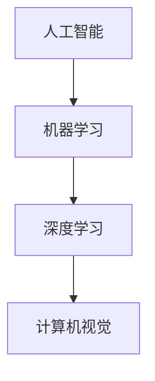

                 

### 1. 背景介绍

随着人工智能（AI）技术的迅猛发展，越来越多的行业和企业开始将AI技术应用于实际业务中。作为全球最大的智能手机制造商，苹果公司一直在积极推动AI技术的研发和应用。近日，苹果公司发布了多款搭载AI技术的应用，进一步彰显了其在AI领域的技术实力和市场布局。

本文旨在探讨苹果公司发布AI应用的科技价值，分析其技术原理、应用场景、未来发展潜力等方面。希望通过本文的阐述，能够为广大读者提供对AI技术的更深入理解，以及对苹果公司在AI领域布局的全新视角。

### 2. 核心概念与联系

在讨论苹果公司发布的AI应用之前，有必要先了解一些核心概念及其联系。以下是本文将涉及的主要概念和其相互关系：

- **人工智能（AI）**：一种模拟人类智能的技术，能够通过学习、推理、规划等方式执行复杂任务。
- **机器学习（ML）**：一种AI的子领域，通过数据和算法，使计算机具备自我学习和自我优化能力。
- **深度学习（DL）**：一种基于人工神经网络的机器学习方法，能够通过多层神经网络模拟人类大脑的学习过程。
- **计算机视觉（CV）**：AI的一种应用，使计算机能够通过图像或视频捕捉和处理信息。

以下是一个用Mermaid绘制的流程图，展示了这些概念之间的相互关系：



### 3. 核心算法原理 & 具体操作步骤

#### 3.1 算法原理概述

苹果公司在AI应用中主要采用深度学习算法，特别是卷积神经网络（CNN）和循环神经网络（RNN）。

- **卷积神经网络（CNN）**：适用于图像和视频处理，通过卷积操作提取图像特征，实现分类、检测等任务。
- **循环神经网络（RNN）**：适用于序列数据处理，如语音识别、自然语言处理等，能够捕捉序列中的长距离依赖关系。

#### 3.2 算法步骤详解

以苹果公司的照片应用为例，其具体操作步骤如下：

1. **数据预处理**：对输入图像进行归一化、缩放等处理，使其符合网络输入要求。
2. **卷积操作**：使用多个卷积层提取图像特征，如边缘、纹理等。
3. **激活函数**：对卷积层输出应用激活函数（如ReLU），增强网络的学习能力。
4. **池化操作**：使用最大池化或平均池化降低特征图的维度，减少计算量。
5. **全连接层**：将卷积层的输出通过全连接层进行分类或回归。
6. **损失函数**：使用交叉熵损失函数计算预测标签和真实标签之间的差异。
7. **反向传播**：根据损失函数计算梯度，更新网络权重。

#### 3.3 算法优缺点

- **优点**：CNN和RNN具有强大的特征提取和序列建模能力，能够处理复杂任务。
- **缺点**：计算复杂度高，训练时间较长；对大规模数据集有较高要求。

#### 3.4 算法应用领域

深度学习算法在苹果公司AI应用中的主要应用领域包括：

- **计算机视觉**：照片分类、人脸识别、图像分割等。
- **自然语言处理**：语音识别、机器翻译、文本分类等。
- **语音识别**：实时语音识别、语音合成等。

### 4. 数学模型和公式 & 详细讲解 & 举例说明

#### 4.1 数学模型构建

深度学习中的数学模型主要包括两部分：神经网络和损失函数。

- **神经网络**：由多个层次组成，包括输入层、隐藏层和输出层。
- **损失函数**：用于衡量预测结果与真实结果之间的差异，常见的有交叉熵损失函数。

以下是一个简单的神经网络模型：

$$
\begin{cases}
h_{1}^{(l)} = \sigma(W^{(l)}h^{(l-1)} + b^{(l)}) \\
y = \sigma(W^{(L)}h^{(L-1)} + b^{(L)})
\end{cases}
$$

其中，$h^{(l)}$表示第$l$层的输出，$\sigma$表示激活函数，$W^{(l)}$和$b^{(l)}$分别表示第$l$层的权重和偏置。

#### 4.2 公式推导过程

以卷积神经网络为例，推导其损失函数的梯度。

设$z^{(l)} = W^{(l)}h^{(l-1)} + b^{(l)}$，$a^{(l)} = \sigma(z^{(l)})$，损失函数为交叉熵损失函数：

$$
J = -\frac{1}{m}\sum_{i=1}^{m}y^{(i)}\log(a^{(L)}_{i} + (1-y^{(i)})\log(1-a^{(L)}_{i})
$$

则梯度为：

$$
\begin{cases}
\frac{\partial J}{\partial W^{(l)}_{ij}} = \frac{\partial J}{\partial a^{(L)}_{i}}\frac{\partial a^{(L)}_{i}}{\partial z^{(L)}}\frac{\partial z^{(L)}}{\partial W^{(l)}_{ij}} = (a^{(L)}_{i}-y^{(i)})a^{(L-1)}_{j} \\
\frac{\partial J}{\partial b^{(l)}_{j}} = \frac{\partial J}{\partial a^{(L)}_{i}}\frac{\partial a^{(L)}_{i}}{\partial z^{(L)}}\frac{\partial z^{(L)}}{\partial b^{(l)}_{j}} = (a^{(L)}_{i}-y^{(i)}) \\
\end{cases}
$$

#### 4.3 案例分析与讲解

以苹果公司的照片应用为例，展示如何构建和训练一个卷积神经网络进行图像分类。

1. **数据集准备**：收集并清洗大量照片数据，分为训练集、验证集和测试集。
2. **模型构建**：设计卷积神经网络结构，包括卷积层、池化层和全连接层。
3. **模型训练**：使用训练集数据训练模型，调整模型参数以最小化损失函数。
4. **模型评估**：使用验证集评估模型性能，调整模型参数以提高分类准确率。
5. **模型部署**：将训练好的模型部署到手机应用中，实现照片分类功能。

### 5. 项目实践：代码实例和详细解释说明

#### 5.1 开发环境搭建

1. **安装Python环境**：在Windows或MacOS上安装Python 3.7及以上版本。
2. **安装深度学习框架**：使用pip安装TensorFlow 2.0及以上版本。

#### 5.2 源代码详细实现

以下是一个简单的卷积神经网络实现，用于图像分类：

```python
import tensorflow as tf
from tensorflow.keras import layers

model = tf.keras.Sequential([
    layers.Conv2D(32, (3, 3), activation='relu', input_shape=(28, 28, 1)),
    layers.MaxPooling2D((2, 2)),
    layers.Conv2D(64, (3, 3), activation='relu'),
    layers.MaxPooling2D((2, 2)),
    layers.Conv2D(64, (3, 3), activation='relu'),
    layers.Flatten(),
    layers.Dense(64, activation='relu'),
    layers.Dense(10, activation='softmax')
])

model.compile(optimizer='adam',
              loss='categorical_crossentropy',
              metrics=['accuracy'])

model.fit(x_train, y_train, batch_size=64, epochs=10, validation_data=(x_val, y_val))
```

#### 5.3 代码解读与分析

1. **模型构建**：使用`tf.keras.Sequential`创建一个线性堆叠的模型，包含卷积层、池化层和全连接层。
2. **模型编译**：指定优化器、损失函数和评估指标。
3. **模型训练**：使用`fit`函数训练模型，指定训练集、验证集、批大小和训练轮数。

#### 5.4 运行结果展示

```python
test_loss, test_acc = model.evaluate(x_test, y_test)
print(f"Test accuracy: {test_acc:.3f}")
```

### 6. 实际应用场景

#### 6.1 计算机视觉

苹果公司的照片应用中，AI技术被用于自动分类和标签照片。例如，用户上传一张照片，应用会自动识别照片中的物体和场景，并为照片打上相应的标签。

#### 6.2 自然语言处理

苹果公司的Siri语音助手使用了自然语言处理技术，能够理解用户的语音指令并执行相应操作。例如，用户可以通过语音指令添加日程、发送消息、查询天气等。

#### 6.3 语音识别

苹果公司的语音识别技术被广泛应用于手机应用中，如通话录音、语音备忘录等。用户可以通过语音输入记录信息，应用会自动将其转换为文本。

### 7. 未来应用展望

随着AI技术的不断进步，苹果公司的AI应用有望在更多领域得到应用。例如：

- **自动驾驶**：利用计算机视觉和自然语言处理技术，实现无人驾驶汽车。
- **智能家居**：通过AI技术，实现智能门锁、智能灯泡等设备的智能控制。
- **医疗保健**：利用AI技术，实现疾病预测、诊断和治疗。

### 8. 工具和资源推荐

#### 8.1 学习资源推荐

- 《深度学习》（Goodfellow, Bengio, Courville著）：深度学习领域的经典教材。
- 《Python机器学习》（Sebastian Raschka著）：详细介绍Python在机器学习领域的应用。

#### 8.2 开发工具推荐

- TensorFlow：一款开源的深度学习框架，适用于各种深度学习任务。
- Keras：一款基于TensorFlow的高级神经网络API，易于使用和扩展。

#### 8.3 相关论文推荐

- "Deep Learning: A Theoretical Overview"（Yoshua Bengio等著）：深度学习理论综述。
- "The Unreasonable Effectiveness of Recurrent Neural Networks"（Christopher Olah著）：循环神经网络应用实例。

### 9. 总结：未来发展趋势与挑战

#### 9.1 研究成果总结

近年来，深度学习技术在计算机视觉、自然语言处理等领域取得了显著成果。以苹果公司为代表的科技公司，不断推出创新的AI应用，推动了AI技术的普及和应用。

#### 9.2 未来发展趋势

未来，AI技术将在更多领域得到应用，如自动驾驶、医疗保健、智能家居等。同时，随着计算能力的提升和数据量的增加，深度学习模型的性能将不断提高。

#### 9.3 面临的挑战

尽管AI技术取得了显著进展，但仍面临一些挑战，如数据隐私、模型解释性、计算资源消耗等。未来需要解决这些挑战，以实现AI技术的可持续发展。

#### 9.4 研究展望

随着AI技术的不断发展，我们有理由相信，未来将会有更多令人惊叹的AI应用诞生。这不仅将为人类社会带来巨大变革，也将为科技领域带来新的发展机遇。

## 附录：常见问题与解答

**Q：苹果公司的AI应用有哪些特点？**

A：苹果公司的AI应用具有以下特点：

1. **性能优异**：利用先进的深度学习算法，实现高效的特征提取和序列建模。
2. **用户友好**：界面简洁，操作便捷，提供出色的用户体验。
3. **跨平台支持**：支持iOS、macOS等多个平台，满足不同用户的需求。

**Q：苹果公司的AI应用有哪些应用领域？**

A：苹果公司的AI应用主要涵盖以下领域：

1. **计算机视觉**：照片分类、人脸识别、图像分割等。
2. **自然语言处理**：语音识别、机器翻译、文本分类等。
3. **语音识别**：实时语音识别、语音合成等。

**Q：苹果公司的AI应用如何保证用户隐私？**

A：苹果公司在AI应用中采用以下措施保障用户隐私：

1. **本地化处理**：大部分AI计算在本地设备上进行，减少数据传输。
2. **加密存储**：对用户数据进行加密存储，确保数据安全。
3. **隐私保护政策**：明确告知用户数据处理方式，尊重用户隐私。

### 作者署名

作者：禅与计算机程序设计艺术 / Zen and the Art of Computer Programming

----------------------------------------------------------------

以上就是本文的全部内容，希望对您在了解苹果公司AI应用的科技价值方面有所帮助。随着AI技术的不断进步，我们期待未来会有更多令人瞩目的AI应用诞生。

