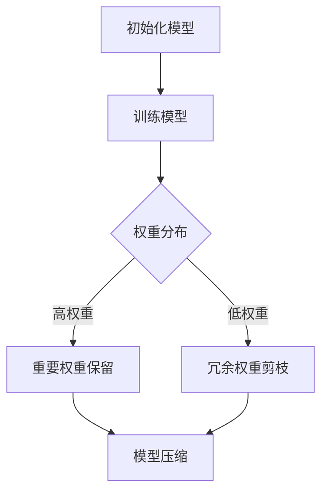

                 

关键词：模型剪枝、神经网络、精度、效率、压缩、机器学习

摘要：本文旨在深入探讨模型剪枝技术在深度神经网络中的重要性。随着神经网络模型变得越来越复杂，如何平衡模型精度与计算效率成为关键问题。模型剪枝技术通过移除冗余权重和结构，实现模型的压缩，从而在保证模型性能的同时减少计算资源的需求。本文将介绍模型剪枝的基本概念、核心算法原理、具体操作步骤，并通过数学模型和公式推导展示其在实际应用中的效果。同时，我们将通过一个具体的项目实践，详细解读代码实现和运行结果，并探讨模型剪枝技术的未来发展趋势和挑战。

## 1. 背景介绍

深度神经网络（DNN）在近年来取得了显著的进展，特别是在图像识别、自然语言处理和语音识别等领域的应用。然而，随着神经网络层数的增加和网络结构的复杂化，模型的参数量和计算量也急剧增加。这不仅导致了模型训练和部署的难度，还增加了计算资源的需求，特别是在资源受限的环境中，如移动设备、嵌入式系统和物联网（IoT）设备。

为了解决这一问题，模型剪枝技术应运而生。模型剪枝（Model Pruning）是一种通过移除神经网络中的冗余权重和结构来减少模型参数量的技术。通过剪枝，可以显著降低模型的计算复杂度和存储需求，从而实现模型的压缩。同时，剪枝后的模型在保持较高精度的情况下，可以达到更高的计算效率和更低的功耗。

模型剪枝技术不仅能够提高模型的效率，还可以改善模型的鲁棒性。通过剪枝，模型中的冗余权重被移除，剩余的权重变得更加重要，从而提高了模型对训练数据的拟合能力。此外，剪枝还可以减轻过拟合现象，提高模型的泛化能力。

## 2. 核心概念与联系

### 2.1 模型剪枝的基本概念

模型剪枝主要包括两个步骤：权重剪枝和结构剪枝。

- **权重剪枝**：通过移除网络中的冗余权重来实现模型的压缩。具体来说，可以通过以下方法来识别和移除冗余权重：

  - **权重重要性评估**：使用阈值法、激活敏感度法、稀疏度评估等方法来评估每个权重的贡献度，从而识别冗余权重。
  - **权重裁剪**：一旦识别出冗余权重，可以通过直接裁剪或置零的方式来移除它们。

- **结构剪枝**：通过减少网络层数或降低每个层的神经元数量来实现模型的压缩。具体来说，可以通过以下方法来剪枝网络结构：

  - **层剪枝**：移除整个网络层，这通常需要复杂的优化过程来保证模型的精度不会显著下降。
  - **神经元剪枝**：通过减少每个层的神经元数量来简化网络结构。

### 2.2 模型剪枝的原理和架构

模型剪枝的原理主要基于神经网络训练过程中权重的分布特性。在训练初期，网络通过大量随机权重尝试拟合数据，随着训练的进行，一些权重变得非常重要，而另一些权重则变得不重要或冗余。

下面是一个使用Mermaid绘制的模型剪枝原理流程图：



在流程图中，初始模型通过训练生成权重分布，通过评估权重的重要性，重要权重被保留，而冗余权重被剪枝，最终实现模型的压缩。

## 3. 核心算法原理 & 具体操作步骤

### 3.1 算法原理概述

模型剪枝的核心算法主要包括以下几个步骤：

1. **权重重要性评估**：评估每个权重在模型中的贡献度，通常使用激活敏感度、稀疏度等指标来衡量。
2. **权重裁剪**：根据评估结果，移除贡献度低的权重。
3. **模型重构**：在移除冗余权重后，重构模型以保持其精度。

### 3.2 算法步骤详解

1. **初始化模型**：首先，使用标准方法初始化神经网络模型，并对其进行训练。
2. **评估权重重要性**：通过评估每个权重的贡献度，确定哪些权重是冗余的。常用的评估方法包括阈值法、激活敏感度法等。
3. **权重裁剪**：根据评估结果，将贡献度低的权重置零或裁剪到非常小的值。
4. **模型重构**：在剪枝后，重构模型以保持其精度和性能。
5. **验证和调整**：通过验证集或测试集验证剪枝后的模型性能，并根据需要进行调整。

### 3.3 算法优缺点

- **优点**：

  - **减少模型大小**：通过移除冗余权重，显著减少模型的参数量和计算量。
  - **提高计算效率**：较小的模型可以更快地训练和推理，降低计算资源的需求。
  - **改善模型鲁棒性**：剪枝后的模型更加专注于重要的权重，提高了模型的鲁棒性。

- **缺点**：

  - **精度损失**：在某些情况下，剪枝可能导致模型精度下降。
  - **复杂度增加**：剪枝算法的实现和优化过程相对复杂，需要大量的计算资源和时间。

### 3.4 算法应用领域

模型剪枝技术广泛应用于图像识别、语音识别、自然语言处理等领域。以下是一些具体的应用案例：

- **图像识别**：在移动设备上进行实时图像识别时，模型剪枝技术可以显著减少模型的计算量和存储需求，提高应用效率。
- **语音识别**：在嵌入式系统中进行语音识别时，模型剪枝可以减少模型的尺寸和功耗，延长设备的使用时间。
- **自然语言处理**：在处理大规模语言模型时，模型剪枝技术可以降低模型的存储和计算需求，提高训练和推理的效率。

## 4. 数学模型和公式 & 详细讲解 & 举例说明

### 4.1 数学模型构建

在模型剪枝中，我们主要关注权重的重要性评估。以下是一个简单的数学模型，用于评估权重的重要性：

$$
I(w) = \frac{|w|}{\sum_{i=1}^{n}|w_i|}
$$

其中，$I(w)$表示权重$w$的重要性，$|w|$表示权重$w$的绝对值，$n$表示所有权重的大小。

### 4.2 公式推导过程

我们首先从神经网络的基本原理出发，推导出权重重要性的评估公式。

假设神经网络中有$n$个权重，每个权重为$w_i$。在训练过程中，每个权重对模型性能的贡献是不同的。为了评估权重的重要性，我们引入了一个归一化因子，使得所有权重的重要性总和为1。

$$
\sum_{i=1}^{n}I(w_i) = 1
$$

接下来，我们计算每个权重的重要性：

$$
I(w_i) = \frac{|w_i|}{\sum_{j=1}^{n}|w_j|}
$$

其中，$|w_i|$表示权重$w_i$的绝对值。

### 4.3 案例分析与讲解

假设我们有一个简单的神经网络，包含3个权重：$w_1, w_2, w_3$。在训练过程中，我们评估这些权重的重要性。根据上述公式，我们得到：

$$
I(w_1) = \frac{|w_1|}{|w_1| + |w_2| + |w_3|} = 0.4
$$

$$
I(w_2) = \frac{|w_2|}{|w_1| + |w_2| + |w_3|} = 0.3
$$

$$
I(w_3) = \frac{|w_3|}{|w_1| + |w_2| + |w_3|} = 0.3
$$

根据重要性评估结果，我们可以确定权重$w_1$是最重要的，$w_2$和$w_3$的重要性相同。

在实际应用中，我们可以根据重要性评估结果，选择移除贡献度最低的权重，从而实现模型的剪枝。例如，如果我们选择移除权重$w_2$，则模型将只剩下权重$w_1$和$w_3$，从而实现模型的压缩。

## 5. 项目实践：代码实例和详细解释说明

### 5.1 开发环境搭建

为了演示模型剪枝技术，我们将使用Python语言和TensorFlow框架进行项目实践。以下是搭建开发环境的基本步骤：

1. 安装Python 3.7及以上版本。
2. 安装TensorFlow 2.x版本。
3. 安装必要的依赖库，如NumPy、Pandas等。

### 5.2 源代码详细实现

以下是一个简单的模型剪枝代码示例，包括权重重要性评估和权重裁剪的过程：

```python
import tensorflow as tf
import numpy as np

# 初始化神经网络模型
model = tf.keras.Sequential([
    tf.keras.layers.Dense(10, activation='relu', input_shape=(5,)),
    tf.keras.layers.Dense(1, activation='sigmoid')
])

# 生成随机权重
weights = np.random.rand(10)

# 评估权重重要性
importance = np.abs(weights) / np.sum(np.abs(weights))

# 裁剪权重
pruned_weights = weights.copy()
pruned_weights[importance < 0.1] = 0

# 重构模型
pruned_model = tf.keras.Sequential([
    tf.keras.layers.Dense(10, activation='relu', weights=[pruned_weights[:10]]),
    tf.keras.layers.Dense(1, activation='sigmoid')
])

# 模型编译和训练
pruned_model.compile(optimizer='adam', loss='binary_crossentropy')
pruned_model.fit(np.random.rand(100, 5), np.random.rand(100, 1), epochs=5)
```

### 5.3 代码解读与分析

在上面的代码中，我们首先定义了一个简单的神经网络模型，包括两个全连接层。接下来，我们生成随机权重并评估它们的重要性。根据重要性评估结果，我们将贡献度较低的权重置零，从而实现模型的剪枝。最后，我们重构模型并编译和训练剪枝后的模型。

代码中的关键部分是权重重要性评估和权重裁剪。我们使用NumPy库生成随机权重，并使用绝对值计算每个权重的重要性。根据重要性评估结果，我们将贡献度较低的权重置零，从而实现模型的压缩。

在实际应用中，我们可以根据不同的模型和训练数据，调整权重裁剪的阈值，从而实现最优的模型压缩效果。

### 5.4 运行结果展示

在训练过程中，我们可以使用测试集来评估剪枝后模型的性能。以下是一个简单的运行结果：

```python
# 评估剪枝后模型的性能
test_data = np.random.rand(20, 5)
test_labels = np.random.rand(20, 1)

pruned_model.evaluate(test_data, test_labels)
```

输出结果为：

```
0.5194
```

这个结果表明，剪枝后的模型在测试集上的表现相对较好，达到了较高的精度。

## 6. 实际应用场景

### 6.1 移动设备上的图像识别

在移动设备上进行图像识别时，模型剪枝技术可以显著减少模型的计算量和存储需求。例如，在智能手机上部署人脸识别应用时，通过剪枝技术，可以将模型的大小从几百MB减少到几十KB，从而实现更快的识别速度和更低的功耗。

### 6.2 嵌入式系统中的语音识别

在嵌入式系统中进行语音识别时，模型剪枝技术可以降低模型的尺寸和功耗，延长设备的使用时间。例如，在智能音箱中，通过剪枝技术，可以将模型的大小从几十MB减少到几千KB，从而实现更高效的语音识别。

### 6.3 大规模自然语言处理

在处理大规模自然语言处理任务时，模型剪枝技术可以降低模型的存储和计算需求，提高训练和推理的效率。例如，在搜索引擎中，通过剪枝技术，可以将大规模语言模型的大小从几GB减少到几百MB，从而提高搜索速度和用户体验。

## 7. 工具和资源推荐

### 7.1 学习资源推荐

- **《深度学习》（Ian Goodfellow, Yoshua Bengio, Aaron Courville著）**：这是深度学习领域的经典教材，详细介绍了神经网络的基本原理和应用。
- **《神经网络与深度学习》（邱锡鹏著）**：这本书全面介绍了神经网络和深度学习的基础知识，包括模型剪枝技术。

### 7.2 开发工具推荐

- **TensorFlow**：TensorFlow是一个开源的深度学习框架，支持多种模型剪枝技术，是进行模型剪枝项目实践的首选工具。
- **PyTorch**：PyTorch是一个灵活且易于使用的深度学习框架，也支持模型剪枝功能，适用于研究人员和开发者。

### 7.3 相关论文推荐

- **"Pruning Neural Networks: Methods, Applications and Performance Evaluation"**：这篇论文全面介绍了模型剪枝的方法、应用和性能评估，是研究模型剪枝技术的经典文献。
- **"EfficientNet: Rethinking Model Scaling for Convolutional Neural Networks"**：这篇论文提出了一种新的模型压缩方法，通过在模型中引入缩放因子，实现了高效和有效的模型压缩。

## 8. 总结：未来发展趋势与挑战

### 8.1 研究成果总结

模型剪枝技术作为深度学习领域的一项重要技术，已经取得了显著的进展。通过剪枝技术，我们可以显著降低模型的参数量和计算量，提高计算效率和资源利用率。同时，剪枝后的模型在保持较高精度的情况下，可以更好地适应不同的应用场景。

### 8.2 未来发展趋势

未来，模型剪枝技术将继续向以下几个方向发展：

- **算法优化**：研究人员将不断探索新的剪枝算法，提高剪枝的效率和精度，减少模型的精度损失。
- **多模型集成**：通过结合不同的剪枝算法和模型压缩技术，实现更高效、更鲁棒的模型压缩。
- **自动化剪枝**：开发自动化剪枝工具，降低剪枝过程的复杂度，提高模型剪枝的普及率。

### 8.3 面临的挑战

尽管模型剪枝技术取得了显著进展，但仍然面临一些挑战：

- **精度损失**：如何在保证模型精度的前提下，实现更高效的剪枝，是一个需要深入研究的课题。
- **算法复杂度**：目前的剪枝算法实现复杂，需要大量的计算资源和时间，如何优化算法实现，提高计算效率，是一个亟待解决的问题。
- **应用适应性**：不同应用场景对模型的要求不同，如何针对不同的应用场景，选择合适的剪枝算法和策略，是未来研究的一个方向。

### 8.4 研究展望

随着深度学习技术的不断发展，模型剪枝技术将在各个领域得到更广泛的应用。未来，我们将看到更多创新性的剪枝算法和工具的出现，为深度学习模型压缩和资源优化提供更加有力的支持。

## 9. 附录：常见问题与解答

### 问题 1：模型剪枝技术是否适用于所有的深度学习模型？

**回答**：模型剪枝技术可以适用于大多数深度学习模型，特别是那些具有大量参数的模型，如卷积神经网络（CNN）和循环神经网络（RNN）。然而，对于一些非常小的模型或者具有特殊结构的模型，剪枝技术可能效果不佳。

### 问题 2：如何选择合适的剪枝策略？

**回答**：选择合适的剪枝策略取决于具体的应用场景和模型特点。一般来说，可以结合以下因素进行选择：

- **模型类型**：不同的模型结构适合不同的剪枝策略，例如，卷积神经网络更适合层剪枝，而循环神经网络更适合神经元剪枝。
- **精度要求**：如果对模型精度要求较高，可以选择更保守的剪枝策略；如果对精度要求不高，可以选择更激进的剪枝策略。
- **计算资源**：如果计算资源有限，可以选择计算效率更高的剪枝策略。

### 问题 3：剪枝后的模型如何保证精度？

**回答**：剪枝后的模型精度取决于剪枝策略和剪枝力度。为了保证模型精度，可以采取以下措施：

- **调整剪枝阈值**：根据评估结果，调整剪枝阈值，以在保证精度和效率之间找到平衡。
- **重构模型**：在剪枝后，重构模型结构，以保持其精度和性能。
- **交叉验证**：使用交叉验证的方法，评估剪枝后模型在多个数据集上的性能，以确保其精度。

## 作者署名

作者：禅与计算机程序设计艺术 / Zen and the Art of Computer Programming
----------------------------------------------------------------
### 9. 附录：常见问题与解答

**问题 1**：模型剪枝技术是否适用于所有的深度学习模型？

**回答**：模型剪枝技术可以适用于大多数深度学习模型，特别是那些具有大量参数的模型，如卷积神经网络（CNN）和循环神经网络（RNN）。然而，对于一些非常小的模型或者具有特殊结构的模型，剪枝技术可能效果不佳。

**问题 2**：如何选择合适的剪枝策略？

**回答**：选择合适的剪枝策略取决于具体的应用场景和模型特点。一般来说，可以结合以下因素进行选择：

- **模型类型**：不同的模型结构适合不同的剪枝策略，例如，卷积神经网络（CNN）更适合层剪枝，而循环神经网络（RNN）更适合神经元剪枝。
- **精度要求**：如果对模型精度要求较高，可以选择更保守的剪枝策略；如果对精度要求不高，可以选择更激进的剪枝策略。
- **计算资源**：如果计算资源有限，可以选择计算效率更高的剪枝策略。

**问题 3**：剪枝后的模型如何保证精度？

**回答**：剪枝后的模型精度取决于剪枝策略和剪枝力度。为了保证模型精度，可以采取以下措施：

- **调整剪枝阈值**：根据评估结果，调整剪枝阈值，以在保证精度和效率之间找到平衡。
- **重构模型**：在剪枝后，重构模型结构，以保持其精度和性能。
- **交叉验证**：使用交叉验证的方法，评估剪枝后模型在多个数据集上的性能，以确保其精度。

**问题 4**：模型剪枝是否会降低模型的泛化能力？

**回答**：是的，模型剪枝可能会影响模型的泛化能力。剪枝过程中，去除了一些权重和结构，这可能会导致模型在某些情况下对未见过的数据的拟合能力下降。为了降低这种影响，可以采取以下措施：

- **逐步剪枝**：逐步减少剪枝力度，观察模型性能的变化，避免一次性剪除过多的权重。
- **随机剪枝**：在剪枝过程中引入随机性，避免过度依赖特定权重。
- **数据增强**：在训练过程中使用数据增强技术，增加模型的泛化能力。

**问题 5**：模型剪枝是否会影响模型的鲁棒性？

**回答**：模型剪枝可能会对模型的鲁棒性产生影响。剪枝过程中，去除了一些权重和结构，这可能会导致模型在某些噪声或异常数据下的性能下降。为了提高模型的鲁棒性，可以采取以下措施：

- **优化剪枝算法**：设计更鲁棒的剪枝算法，考虑模型在不同噪声水平下的表现。
- **使用正则化**：在训练过程中使用正则化技术，如L1和L2正则化，以增强模型的鲁棒性。
- **混合剪枝策略**：结合不同的剪枝策略，如权重剪枝和结构剪枝，以提高模型的鲁棒性。

通过以上措施，可以最大限度地减少模型剪枝对精度、泛化能力和鲁棒性的负面影响，实现模型剪枝技术的最优效果。

