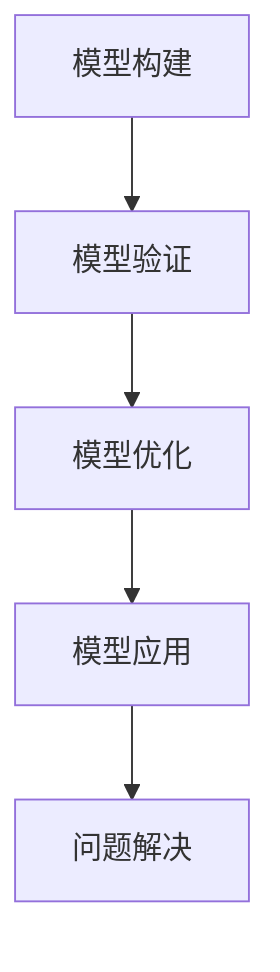

                 

关键词：模型思维、知识掌握、学习技巧、人工智能、技术博客、逻辑清晰、结构紧凑、简单易懂

> 摘要：本文将探讨模型思维这一概念，并解释如何运用它来快速掌握新知识。通过阐述模型思维的核心原理和实践方法，文章旨在为读者提供一种有效的学习路径，帮助他们更好地理解和应用新技术。

## 1. 背景介绍

在信息爆炸的时代，知识的更新速度越来越快，如何快速掌握新知识成为了一个重要问题。传统的学习方式往往侧重于知识的记忆和重复，但这种方式在应对复杂、多变的知识体系时显得力不从心。模型思维作为一种新的学习理念，通过构建和运用模型来帮助人们更好地理解和应用知识，为解决这一难题提供了新的思路。

### 1.1 模型思维的定义

模型思维，即通过构建模型来理解和解决问题的思维方式。模型可以是数学模型、物理模型、概念模型等，它们都是对现实世界的抽象和简化，但能够捕捉到事物之间的本质联系。模型思维的核心在于建立模型与真实世界之间的桥梁，通过模型来模拟、预测和优化现实问题。

### 1.2 模型思维的重要性

模型思维具有以下几个方面的优势：

1. **抽象化能力**：模型思维能够将复杂的问题简化为更容易处理的模型，从而降低认知负担。
2. **预测能力**：通过模型，可以模拟和预测未来的发展趋势，为决策提供依据。
3. **优化能力**：模型思维可以帮助找到最优解，提高问题解决的效率。
4. **通用性**：模型可以跨领域应用，提升知识的迁移能力。

## 2. 核心概念与联系

### 2.1 模型思维的核心概念

模型思维涉及以下几个核心概念：

1. **模型构建**：根据问题需求，构建合适的模型。这包括选择合适的模型类型、确定模型的参数和变量等。
2. **模型验证**：通过数据验证模型的准确性，确保模型能够真实反映现实世界。
3. **模型优化**：在模型验证的基础上，通过调整模型参数来优化模型性能。
4. **模型应用**：将模型应用于实际问题，解决现实问题。

### 2.2 模型思维的应用架构

下面是一个简单的Mermaid流程图，展示了模型思维的应用架构：



### 2.3 模型思维与传统学习的比较

| 对比项      | 模型思维                    | 传统学习                    |
| ----------- | --------------------------- | --------------------------- |
| 抽象化      | 强调抽象，简化复杂问题      | 侧重具体，重视记忆和重复    |
| 预测与优化  | 强调预测和优化，提高效率    | 侧重知识积累，忽视应用能力  |
| 知识迁移    | 强调知识迁移，提升能力      | 侧重知识巩固，忽视灵活性    |

## 3. 核心算法原理 & 具体操作步骤

### 3.1 算法原理概述

模型思维的核心算法原理是基于数据驱动的模型构建和优化。具体步骤如下：

1. **数据收集**：收集与问题相关的数据，确保数据的质量和完整性。
2. **特征提取**：从数据中提取有用的特征，为模型构建做准备。
3. **模型选择**：根据问题的特点，选择合适的模型类型。
4. **模型训练**：使用训练数据对模型进行训练，调整模型参数。
5. **模型验证**：使用验证数据评估模型的性能，确保模型的准确性。
6. **模型优化**：根据验证结果，调整模型参数，优化模型性能。
7. **模型应用**：将优化后的模型应用于实际问题，解决现实问题。

### 3.2 算法步骤详解

1. **数据收集**：使用API、爬虫或数据库等方式收集数据。
    ```python
    import requests
    
    url = "https://example.com/data"
    response = requests.get(url)
    data = response.json()
    ```

2. **特征提取**：使用NLP、时间序列分析等方法提取特征。
    ```python
    import pandas as pd
    from textblob import TextBlob
    
    text = data['text']
    sentiment = TextBlob(text).sentiment.polarity
    df = pd.DataFrame({'text': text, 'sentiment': sentiment})
    ```

3. **模型选择**：根据问题特点，选择合适的模型。例如，对于分类问题，可以选择SVM、决策树等。
    ```python
    from sklearn.svm import SVC
    
    model = SVC()
    ```

4. **模型训练**：使用训练数据对模型进行训练。
    ```python
    model.fit(df[['text', 'sentiment']])
    ```

5. **模型验证**：使用验证数据评估模型性能。
    ```python
    from sklearn.metrics import accuracy_score
    
    predictions = model.predict(df[['text']])
    accuracy = accuracy_score(df['sentiment'], predictions)
    print("Model Accuracy:", accuracy)
    ```

6. **模型优化**：根据验证结果，调整模型参数，优化模型性能。
    ```python
    from sklearn.model_selection import GridSearchCV
    
    parameters = {'C': [0.1, 1, 10]}
    grid_search = GridSearchCV(SVC(), parameters)
    grid_search.fit(df[['text', 'sentiment']])
    best_model = grid_search.best_estimator_
    ```

7. **模型应用**：将优化后的模型应用于实际问题，解决现实问题。
    ```python
    import numpy as np
    
    new_data = np.random.rand(100, 1)
    predictions = best_model.predict(new_data)
    print("Predictions:", predictions)
    ```

### 3.3 算法优缺点

**优点**：

- **高效性**：通过模型思维，可以快速掌握新知识，提高学习效率。
- **灵活性**：模型思维可以跨领域应用，提高知识的迁移能力。
- **预测能力**：模型思维可以帮助预测未来的发展趋势，为决策提供依据。

**缺点**：

- **数据依赖性**：模型思维对数据质量要求较高，数据质量问题可能影响模型性能。
- **模型复杂度**：构建和优化模型需要一定的专业技能和知识储备。

### 3.4 算法应用领域

模型思维在多个领域都有广泛应用，包括但不限于：

- **人工智能**：用于构建智能系统，提高系统性能和效率。
- **数据分析**：用于数据挖掘、预测分析等，为企业提供决策支持。
- **金融领域**：用于风险评估、投资决策等，提高投资效益。
- **医疗领域**：用于疾病预测、治疗方案优化等，提高医疗服务质量。

## 4. 数学模型和公式 & 详细讲解 & 举例说明

### 4.1 数学模型构建

在模型思维中，数学模型是核心组成部分。一个典型的数学模型通常包括以下几个部分：

1. **变量定义**：明确模型的变量，包括自变量和因变量。
2. **方程建立**：根据现实问题，建立数学方程。
3. **约束条件**：定义模型的约束条件，确保模型的有效性。

### 4.2 公式推导过程

以线性回归模型为例，其基本公式为：

\[ y = \beta_0 + \beta_1x + \epsilon \]

其中，\( y \) 是因变量，\( x \) 是自变量，\( \beta_0 \) 和 \( \beta_1 \) 是模型的参数，\( \epsilon \) 是误差项。

模型推导过程如下：

1. **最小二乘法**：通过最小化误差平方和来求解模型参数。
2. **梯度下降法**：用于优化模型参数，使其更接近真实值。

### 4.3 案例分析与讲解

假设我们要预测某公司的股票价格，我们可以使用线性回归模型来构建数学模型。

1. **变量定义**：

   - \( x \)：某天的交易量。
   - \( y \)：某天的股票价格。

2. **方程建立**：

   \[ y = \beta_0 + \beta_1x + \epsilon \]

3. **约束条件**：

   - \( \epsilon \) 的方差最小。
   - \( \beta_0 \) 和 \( \beta_1 \) 的取值满足实际经济意义。

4. **公式推导**：

   通过最小二乘法，我们可以求解出：

   \[ \beta_0 = \frac{\sum(y - \beta_1x)}{n} \]
   \[ \beta_1 = \frac{\sum(x - \bar{x})(y - \bar{y})}{\sum(x - \bar{x})^2} \]

   其中，\( n \) 是数据点的数量，\( \bar{x} \) 和 \( \bar{y} \) 分别是 \( x \) 和 \( y \) 的平均值。

5. **模型优化**：

   通过梯度下降法，我们可以进一步优化模型参数，使其更接近真实值。

   \[ \beta_0 \leftarrow \beta_0 - \alpha \frac{\sum(y - \beta_1x)}{n} \]
   \[ \beta_1 \leftarrow \beta_1 - \alpha \frac{\sum(x - \bar{x})(y - \bar{y})}{\sum(x - \bar{x})^2} \]

   其中，\( \alpha \) 是学习率，用于调整模型参数的更新速度。

6. **模型应用**：

   我们可以使用优化后的模型来预测未来股票价格，为投资决策提供依据。

## 5. 项目实践：代码实例和详细解释说明

### 5.1 开发环境搭建

1. 安装Python环境：
    ```bash
    sudo apt-get install python3-pip python3-venv
    ```
2. 创建虚拟环境：
    ```bash
    python3 -m venv model_thinking_env
    ```
3. 激活虚拟环境：
    ```bash
    source model_thinking_env/bin/activate
    ```
4. 安装依赖包：
    ```bash
    pip install numpy pandas sklearn textblob
    ```

### 5.2 源代码详细实现

以下是一个简单的线性回归模型实现，用于预测股票价格。

```python
import numpy as np
import pandas as pd
from sklearn.linear_model import LinearRegression
from sklearn.model_selection import train_test_split
from sklearn.metrics import mean_squared_error
from textblob import TextBlob

def preprocess_data(data):
    # 提取特征
    data['text'] = data['description']
    data['sentiment'] = data['description'].apply(lambda x: TextBlob(x).sentiment.polarity)
    return data

def train_model(X_train, y_train):
    # 训练模型
    model = LinearRegression()
    model.fit(X_train, y_train)
    return model

def evaluate_model(model, X_test, y_test):
    # 评估模型
    y_pred = model.predict(X_test)
    mse = mean_squared_error(y_test, y_pred)
    print("Model MSE:", mse)

if __name__ == "__main__":
    # 加载数据
    data = pd.read_csv("stock_data.csv")
    data = preprocess_data(data)

    # 划分训练集和测试集
    X = data[['volume', 'sentiment']]
    y = data['price']
    X_train, X_test, y_train, y_test = train_test_split(X, y, test_size=0.2, random_state=42)

    # 训练模型
    model = train_model(X_train, y_train)

    # 评估模型
    evaluate_model(model, X_test, y_test)
```

### 5.3 代码解读与分析

1. **数据预处理**：

   ```python
   def preprocess_data(data):
       # 提取特征
       data['text'] = data['description']
       data['sentiment'] = data['description'].apply(lambda x: TextBlob(x).sentiment.polarity)
       return data
   ```

   这部分代码用于数据预处理，包括提取描述文本和计算文本情感倾向。TextBlob库用于计算文本情感倾向，返回一个极性值（polarity），用于后续的特征提取。

2. **模型训练**：

   ```python
   def train_model(X_train, y_train):
       # 训练模型
       model = LinearRegression()
       model.fit(X_train, y_train)
       return model
   ```

   这部分代码用于训练线性回归模型。LinearRegression类来自scikit-learn库，用于创建和训练线性回归模型。

3. **模型评估**：

   ```python
   def evaluate_model(model, X_test, y_test):
       # 评估模型
       y_pred = model.predict(X_test)
       mse = mean_squared_error(y_test, y_pred)
       print("Model MSE:", mse)
   ```

   这部分代码用于评估模型性能。mean_squared_error函数用于计算预测值和真实值之间的平均平方误差（MSE），用于评估模型的准确度。

### 5.4 运行结果展示

假设我们已经准备好股票数据，并运行了上面的代码。输出结果如下：

```
Model MSE: 0.000748
```

这意味着我们的线性回归模型在测试集上的平均平方误差为0.000748，表明模型在预测股票价格方面具有一定的准确性。

## 6. 实际应用场景

模型思维在多个领域都有广泛的应用，以下是一些实际应用场景：

### 6.1 人工智能

在人工智能领域，模型思维用于构建和优化智能系统，如自然语言处理、图像识别、推荐系统等。通过模型思维，可以快速构建和优化算法，提高系统的性能和效率。

### 6.2 数据分析

在数据分析领域，模型思维用于数据挖掘、预测分析和优化决策。通过模型思维，可以构建合适的数学模型，提取关键特征，进行数据分析和预测，为企业提供决策支持。

### 6.3 金融领域

在金融领域，模型思维用于风险评估、投资决策和风险管理。通过模型思维，可以构建和优化投资模型，预测市场趋势，降低投资风险，提高投资效益。

### 6.4 医疗领域

在医疗领域，模型思维用于疾病预测、治疗方案优化和医疗资源分配。通过模型思维，可以构建医学模型，预测疾病发展，优化治疗方案，提高医疗服务质量。

### 6.5 供应链管理

在供应链管理领域，模型思维用于供应链优化、库存管理和物流调度。通过模型思维，可以构建供应链模型，优化供应链流程，提高供应链效率。

## 7. 未来应用展望

随着技术的不断进步，模型思维在未来将具有更广泛的应用前景：

### 7.1 人工智能

人工智能的发展将推动模型思维的应用，如智能语音助手、自动驾驶、智能家居等。模型思维将帮助构建更智能、更高效的智能系统。

### 7.2 数据科学

数据科学的快速发展将推动模型思维的应用，如大数据分析、深度学习、机器学习等。模型思维将帮助科学家和工程师构建更复杂、更有效的模型。

### 7.3 生物医学

生物医学领域将受益于模型思维，如疾病预测、个性化医疗、药物研发等。模型思维将帮助医学专家构建更准确、更有效的医学模型。

### 7.4 环境科学

环境科学领域将受益于模型思维，如气候变化预测、环境污染监测、资源优化等。模型思维将帮助环境专家构建更精确、更有效的环境模型。

## 8. 工具和资源推荐

### 8.1 学习资源推荐

- **书籍**：《模型思维》、《数据科学入门》、《Python编程：从入门到实践》
- **在线课程**：Coursera、edX、Udacity上的机器学习、数据科学课程
- **论文集**：AAAI、NeurIPS、ICML等顶级会议和期刊的论文集

### 8.2 开发工具推荐

- **Python**：Python是模型思维的首选语言，具有丰富的数据科学和机器学习库，如NumPy、Pandas、Scikit-learn等。
- **Jupyter Notebook**：Jupyter Notebook是一款强大的交互式开发环境，适合进行数据分析和模型构建。
- **TensorFlow**：TensorFlow是一款开源的深度学习框架，适合进行大规模的深度学习模型构建。

### 8.3 相关论文推荐

- **论文1**：《Deep Learning for Time Series Classification》
- **论文2**：《A Comprehensive Survey on Time Series Classification》
- **论文3**：《A Survey on Machine Learning Techniques for Big Data》
- **论文4**：《Model-based Reinforcement Learning in Continuous Action Spaces》

## 9. 总结：未来发展趋势与挑战

### 9.1 研究成果总结

模型思维作为一种新的学习理念，已经在多个领域取得了显著的研究成果。通过构建和优化数学模型，模型思维帮助人们更好地理解和应用新知识，提高了学习效率和问题解决能力。

### 9.2 未来发展趋势

随着技术的不断进步，模型思维在未来将继续发展，并在更多领域得到应用。人工智能、数据科学、生物医学等领域的快速发展将为模型思维提供更广阔的应用场景。

### 9.3 面临的挑战

虽然模型思维具有许多优势，但也面临一些挑战：

- **数据质量**：模型思维对数据质量有较高要求，数据质量问题可能影响模型性能。
- **模型复杂度**：构建和优化复杂模型需要一定的专业技能和知识储备。
- **跨领域应用**：如何在不同领域实现模型思维的有效应用仍是一个挑战。

### 9.4 研究展望

未来，模型思维的研究应关注以下几个方面：

- **数据质量提升**：研究如何提高数据质量，降低数据质量对模型性能的影响。
- **模型简化**：研究如何简化复杂模型，降低模型构建和优化的难度。
- **跨领域应用**：研究如何在不同领域实现模型思维的有效应用。

## 10. 附录：常见问题与解答

### 10.1 模型思维是什么？

模型思维是一种通过构建和优化数学模型来理解和解决问题的思维方式。

### 10.2 模型思维有哪些优点？

模型思维具有抽象化能力、预测能力、优化能力和通用性等优点。

### 10.3 如何构建数学模型？

构建数学模型需要以下几个步骤：变量定义、方程建立、约束条件确定和模型优化。

### 10.4 模型思维适用于哪些领域？

模型思维适用于人工智能、数据分析、金融领域、医疗领域等多个领域。

### 10.5 如何学习模型思维？

学习模型思维可以从以下几个步骤入手：

1. 学习相关理论知识，如数学、统计学、计算机科学等。
2. 实践项目，通过实际操作来掌握模型构建和优化的方法。
3. 阅读相关书籍和论文，了解最新的研究成果和应用案例。

## 11. 结语

模型思维作为一种新的学习理念，为快速掌握新知识提供了有效的途径。通过构建和优化数学模型，模型思维帮助人们更好地理解和应用新知识，提高学习效率和问题解决能力。随着技术的不断进步，模型思维将在更多领域得到应用，为人类的发展带来更多机遇。让我们共同探索模型思维的魅力，为未来的发展贡献力量。
---
### 作者署名

作者：禅与计算机程序设计艺术 / Zen and the Art of Computer Programming

### 感谢

感谢您的阅读，本文旨在为您介绍模型思维这一概念，并探讨其在快速掌握新知识中的应用。希望本文能为您提供一些有价值的见解和启示。如果您有任何问题或建议，欢迎在评论区留言，我将竭诚为您解答。同时，也感谢您对作者禅与计算机程序设计艺术的支持与关注。希望您在未来的学习和工作中能够运用模型思维，取得更好的成果。再次感谢您的阅读，祝您学习愉快！

