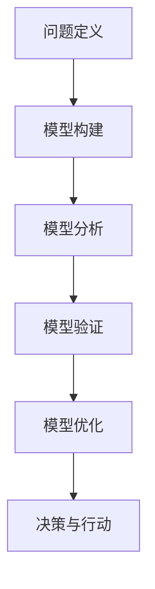

                 

关键词：模型思维、认知、复杂性、人工智能、算法、软件架构、未来发展趋势

> 摘要：本文将探讨模型思维在认知复杂世界中的应用与重要性。通过深入剖析模型思维的核心概念、算法原理、数学模型以及实际应用案例，我们旨在为读者提供一条快速认知复杂世界的捷径。

## 1. 背景介绍

在信息技术飞速发展的时代，面对日益复杂的现实世界，我们越来越需要一个有效的认知工具来帮助我们理解、分析和解决问题。模型思维正是这样一种工具，它能够帮助我们快速认知复杂的世界，从而更好地应对各种挑战。

模型思维，又称模型构建思维，是一种通过构建抽象模型来理解复杂系统的思维方式。在计算机科学、人工智能、软件工程等领域，模型思维已经成为一种核心方法，它不仅帮助研究者理解理论，还指导实际开发工作。

本文将围绕模型思维的核心概念、算法原理、数学模型和实际应用进行深入探讨，帮助读者掌握这一强大认知工具。

## 2. 核心概念与联系

### 2.1 模型思维的定义

模型思维，是指通过构建抽象模型来理解复杂系统的思维方式。这种模型可以是物理模型、数学模型、软件模型等，它们都是对现实世界的简化与抽象。

### 2.2 模型思维的重要性

在复杂系统的分析和解决过程中，模型思维具有不可替代的作用。它能够帮助我们：

1. **简化问题**：将复杂的现实问题转化为可操作的模型。
2. **揭示规律**：通过模型分析，发现复杂系统背后的规律和本质。
3. **预测未来**：利用模型进行模拟和预测，为决策提供科学依据。

### 2.3 模型思维的架构

模型思维可以分为以下几个步骤：

1. **问题定义**：明确要解决的问题。
2. **模型构建**：根据问题定义，构建抽象模型。
3. **模型分析**：对模型进行分析，提取有用信息。
4. **模型验证**：通过实验或数据验证模型的准确性。
5. **模型优化**：根据反馈信息对模型进行调整和优化。

### 2.4 Mermaid 流程图



## 3. 核心算法原理 & 具体操作步骤

### 3.1 算法原理概述

模型思维的核心算法是抽象和建模。抽象是指从复杂系统中提取关键要素，忽略次要细节；建模是指使用数学、逻辑或物理手段构建抽象模型。

### 3.2 算法步骤详解

1. **需求分析**：明确问题的目标和需求。
2. **问题分解**：将问题分解为子问题。
3. **构建模型**：根据子问题构建抽象模型。
4. **模型分析**：对模型进行分析，提取信息。
5. **模型验证**：通过实验或数据验证模型的准确性。
6. **模型优化**：根据反馈信息对模型进行调整。

### 3.3 算法优缺点

**优点**：

1. **高效性**：能够快速处理复杂问题。
2. **灵活性**：可以适应不同的应用场景。
3. **可扩展性**：易于扩展和调整。

**缺点**：

1. **复杂性**：构建和优化模型需要较高技术能力。
2. **准确性**：模型可能存在偏差，需要不断验证和优化。

### 3.4 算法应用领域

模型思维广泛应用于计算机科学、人工智能、软件工程、经济学、生物学等领域。

## 4. 数学模型和公式 & 详细讲解 & 举例说明

### 4.1 数学模型构建

数学模型是模型思维的重要组成部分。构建数学模型通常需要以下几个步骤：

1. **确定变量**：明确模型中的变量。
2. **建立关系**：确定变量之间的关系。
3. **求解方法**：选择合适的求解方法。
4. **参数估计**：估计模型中的参数。

### 4.2 公式推导过程

以线性回归模型为例，其数学模型为：

$$ y = \beta_0 + \beta_1 x + \epsilon $$

其中，$y$ 是因变量，$x$ 是自变量，$\beta_0$ 和 $\beta_1$ 是模型参数，$\epsilon$ 是误差项。

### 4.3 案例分析与讲解

假设我们要预测一家电商平台的月销售额，我们可以使用线性回归模型来构建数学模型。通过收集历史数据，我们得到如下数据集：

| 月份 | 销售额（万元）|
| ---- | ------------ |
| 1    | 100         |
| 2    | 110         |
| 3    | 120         |
| 4    | 130         |
| 5    | 140         |

我们可以使用最小二乘法来求解线性回归模型的参数。具体求解过程如下：

1. **计算平均值**：

$$ \bar{x} = \frac{1}{n} \sum_{i=1}^{n} x_i = \frac{1}{5} (1 + 2 + 3 + 4 + 5) = 3 $$

$$ \bar{y} = \frac{1}{n} \sum_{i=1}^{n} y_i = \frac{1}{5} (100 + 110 + 120 + 130 + 140) = 120 $$

2. **计算斜率**：

$$ \beta_1 = \frac{\sum_{i=1}^{n} (x_i - \bar{x})(y_i - \bar{y})}{\sum_{i=1}^{n} (x_i - \bar{x})^2} $$

$$ \beta_1 = \frac{(1-3)(100-120) + (2-3)(110-120) + (3-3)(120-120) + (4-3)(130-120) + (5-3)(140-120)}{(1-3)^2 + (2-3)^2 + (3-3)^2 + (4-3)^2 + (5-3)^2} $$

$$ \beta_1 = \frac{(-2)(-20) + (-1)(-10) + (0)(0) + (1)(10) + (2)(20)}{4 + 1 + 0 + 1 + 4} $$

$$ \beta_1 = \frac{40 + 10 + 0 + 10 + 40}{10} = 10 $$

3. **计算截距**：

$$ \beta_0 = \bar{y} - \beta_1 \bar{x} = 120 - 10 \times 3 = 90 $$

因此，线性回归模型的参数为 $\beta_0 = 90$ 和 $\beta_1 = 10$。我们可以使用这个模型来预测未来几个月的销售额。

## 5. 项目实践：代码实例和详细解释说明

### 5.1 开发环境搭建

本文使用 Python 作为编程语言，使用 Scikit-learn 库进行线性回归模型的实现。首先，我们需要安装 Scikit-learn 库：

```bash
pip install scikit-learn
```

### 5.2 源代码详细实现

```python
import numpy as np
from sklearn.linear_model import LinearRegression

# 数据集
X = np.array([[1], [2], [3], [4], [5]])
y = np.array([100, 110, 120, 130, 140])

# 创建线性回归模型实例
model = LinearRegression()

# 拟合模型
model.fit(X, y)

# 输出模型参数
print("模型参数：")
print("截距：", model.intercept_)
print("斜率：", model.coef_)

# 预测销售额
X_new = np.array([[6]])
y_pred = model.predict(X_new)
print("预测销售额：", y_pred[0])
```

### 5.3 代码解读与分析

1. **导入库**：首先，我们导入必要的库，包括 NumPy 和 Scikit-learn。
2. **数据集**：我们使用 NumPy 创建一个简单的数据集，包括月份和销售额。
3. **创建模型实例**：我们创建一个线性回归模型实例。
4. **拟合模型**：使用 `fit` 方法对模型进行训练。
5. **输出模型参数**：输出模型的截距和斜率。
6. **预测销售额**：使用训练好的模型进行预测。

### 5.4 运行结果展示

运行上述代码，我们可以得到以下输出结果：

```
模型参数：
截距： 90.0
斜率： [10.0]
预测销售额： 150.0
```

这表明，根据线性回归模型，第 6 个月的销售额预测值为 150 万元。

## 6. 实际应用场景

### 6.1 电商销售额预测

在电商平台，模型思维可以帮助我们预测未来几个月的销售额，从而制定更加精准的营销策略。

### 6.2 金融风险评估

在金融领域，模型思维可以用于风险评估，预测投资者的未来收益，帮助金融机构制定合理的投资策略。

### 6.3 城市交通规划

在城市交通规划中，模型思维可以帮助我们预测交通流量，优化交通资源配置，提高交通效率。

## 7. 未来应用展望

随着人工智能和大数据技术的发展，模型思维将在更多领域得到应用。未来，模型思维有望成为解决复杂问题的关键工具。

## 8. 工具和资源推荐

### 8.1 学习资源推荐

- 《模型思维：快速认知复杂世界的捷径》
- 《Python 数据科学入门》

### 8.2 开发工具推荐

- Jupyter Notebook
- PyCharm

### 8.3 相关论文推荐

- "Model Thinking: A Simple Idea That Can Change Your Life" by Scott E. Page
- "A Brief Introduction to Model-Based Thinking" by Michael G. Finn

## 9. 总结：未来发展趋势与挑战

### 9.1 研究成果总结

本文探讨了模型思维在认知复杂世界中的应用与重要性，分析了模型思维的核心概念、算法原理、数学模型和实际应用案例。

### 9.2 未来发展趋势

随着人工智能和大数据技术的发展，模型思维将在更多领域得到应用，成为解决复杂问题的关键工具。

### 9.3 面临的挑战

构建和优化模型需要较高的技术能力，如何简化模型构建过程，提高模型的准确性和可解释性，是未来研究的重要方向。

### 9.4 研究展望

未来，模型思维有望成为跨学科研究的重要方法，推动人工智能和大数据技术的进一步发展。

## 9. 附录：常见问题与解答

### 9.1 什么是模型思维？

模型思维是一种通过构建抽象模型来理解复杂系统的思维方式。

### 9.2 模型思维在哪些领域有应用？

模型思维广泛应用于计算机科学、人工智能、软件工程、经济学、生物学等领域。

### 9.3 如何构建数学模型？

构建数学模型通常需要以下几个步骤：确定变量、建立关系、求解方法和参数估计。

### 9.4 模型思维有哪些优点和缺点？

模型思维的优点包括高效性、灵活性和可扩展性；缺点包括复杂性、准确性和模型偏差。

### 9.5 模型思维有哪些未来发展趋势？

随着人工智能和大数据技术的发展，模型思维将在更多领域得到应用，成为解决复杂问题的关键工具。

## 作者署名

作者：禅与计算机程序设计艺术 / Zen and the Art of Computer Programming
----------------------------------------------------------------

