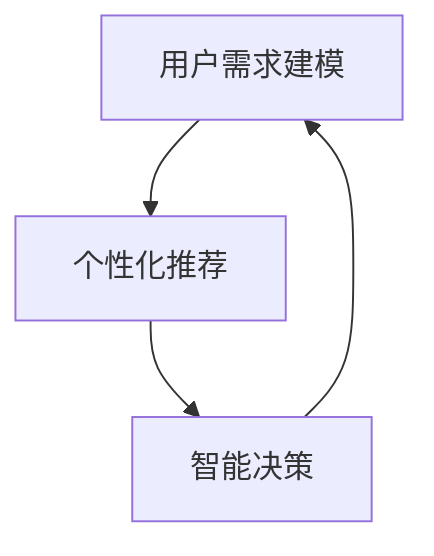

                 

在当今信息爆炸的时代，用户需求日益多样化和个性化，传统的需求满足系统已无法满足市场的需求。为了更好地满足用户需求，人工智能技术被引入到了需求满足系统中，从而诞生了欲望个性化引擎：一个基于AI的定制化需求满足系统。本文将深入探讨这一系统的核心概念、原理、算法、应用以及未来展望。

## 关键词

- 人工智能
- 个性化引擎
- 需求满足
- 定制化
- 数据分析

## 摘要

本文将介绍欲望个性化引擎：一个基于AI的定制化需求满足系统。首先，我们将探讨个性化引擎的背景和重要性。接着，本文将详细描述欲望个性化引擎的核心概念和架构，并深入分析其核心算法原理。此外，本文还将通过数学模型和具体项目实践来阐述该系统的实际应用。最后，我们将展望欲望个性化引擎的未来发展趋势，并提出面临的挑战和研究展望。

## 1. 背景介绍

### 1.1 个性化需求的兴起

随着互联网和电子商务的迅猛发展，用户的需求变得越来越个性化和多样化。传统的一刀切营销策略已经无法满足用户对于个性化体验的需求。个性化需求的兴起，为市场带来了新的挑战和机遇。如何快速、准确地捕捉用户需求，并提供个性化的产品和服务，成为了企业竞争的关键。

### 1.2 人工智能在需求满足中的应用

人工智能作为当前最前沿的技术之一，其在需求满足中的应用已经取得了显著的成果。通过机器学习、深度学习等技术，人工智能可以分析海量用户数据，提取用户兴趣和行为模式，从而实现个性化推荐、智能客服等应用。然而，现有的需求满足系统仍然存在一些局限性，如数据质量、算法优化等问题。

### 1.3 欲望个性化引擎的出现

为了解决现有需求满足系统的局限性，我们提出了欲望个性化引擎：一个基于AI的定制化需求满足系统。该系统通过深度学习和强化学习等技术，实现对用户需求的精准捕捉和智能满足。欲望个性化引擎的出现，标志着需求满足系统进入了一个新的阶段，为用户提供更加个性化的服务。

## 2. 核心概念与联系

### 2.1 核心概念

欲望个性化引擎的核心概念包括：用户需求建模、个性化推荐、智能决策。

#### 2.1.1 用户需求建模

用户需求建模是欲望个性化引擎的基础。通过分析用户行为数据、社交数据、历史购买记录等，建立用户需求模型，以实现对用户需求的准确捕捉。

#### 2.1.2 个性化推荐

个性化推荐是基于用户需求模型，为用户推荐其可能感兴趣的产品或服务。通过深度学习技术，个性化推荐可以实现高度定制化的推荐效果。

#### 2.1.3 智能决策

智能决策是欲望个性化引擎的核心。通过机器学习和强化学习等技术，智能决策可以实时调整推荐策略，以最大化用户满意度。

### 2.2 联系与关系

用户需求建模、个性化推荐和智能决策三者之间紧密联系，构成了欲望个性化引擎的核心。用户需求建模为个性化推荐提供了基础数据，个性化推荐为用户提供了个性化的产品和服务，而智能决策则不断优化推荐策略，以实现用户需求的满足。

### 2.3 Mermaid 流程图



## 3. 核心算法原理 & 具体操作步骤

### 3.1 算法原理概述

欲望个性化引擎的核心算法包括：用户需求建模算法、个性化推荐算法和智能决策算法。

#### 3.1.1 用户需求建模算法

用户需求建模算法基于机器学习和深度学习技术，通过分析用户行为数据，提取用户兴趣和行为模式。常用的算法包括：协同过滤、隐语义模型、深度神经网络等。

#### 3.1.2 个性化推荐算法

个性化推荐算法基于用户需求建模结果，为用户推荐其可能感兴趣的产品或服务。常用的算法包括：基于内容的推荐、协同过滤推荐、基于模型的推荐等。

#### 3.1.3 智能决策算法

智能决策算法基于用户需求建模和个性化推荐结果，通过强化学习等技术，实时调整推荐策略，以最大化用户满意度。常用的算法包括：Q-Learning、Deep Q-Network等。

### 3.2 算法步骤详解

#### 3.2.1 用户需求建模步骤

1. 数据收集：收集用户行为数据、社交数据、历史购买记录等。
2. 数据预处理：对数据进行清洗、去噪、归一化等处理。
3. 特征提取：对预处理后的数据提取特征，如用户兴趣、行为模式等。
4. 模型训练：基于提取的特征，使用机器学习或深度学习算法训练用户需求建模模型。

#### 3.2.2 个性化推荐步骤

1. 用户需求建模：使用训练好的用户需求建模模型，对用户进行需求建模。
2. 商品特征提取：对商品进行特征提取，如商品类别、品牌、价格等。
3. 推荐策略生成：基于用户需求和商品特征，使用推荐算法生成推荐策略。
4. 推荐结果输出：将推荐策略应用于用户，生成推荐结果。

#### 3.2.3 智能决策步骤

1. 用户需求建模：使用训练好的用户需求建模模型，对用户进行需求建模。
2. 推荐结果评估：评估用户对推荐结果的满意度。
3. 策略调整：基于评估结果，使用强化学习算法调整推荐策略。
4. 策略应用：将调整后的推荐策略应用于用户，生成新的推荐结果。

### 3.3 算法优缺点

#### 3.3.1 用户需求建模算法

优点：

- 精准捕捉用户需求
- 提高推荐效果

缺点：

- 数据质量要求高
- 特征提取过程复杂

#### 3.3.2 个性化推荐算法

优点：

- 高度定制化
- 提高用户满意度

缺点：

- 推荐结果多样性不足
- 算法优化难度大

#### 3.3.3 智能决策算法

优点：

- 实时调整推荐策略
- 提高用户满意度

缺点：

- 算法复杂度高
- 需要大量计算资源

### 3.4 算法应用领域

欲望个性化引擎的算法可以应用于多个领域，如电子商务、社交媒体、智能客服等。以下是一些具体的应用场景：

1. 电子商务：通过个性化推荐，为用户提供定制化的商品推荐，提高购买转化率。
2. 社交媒体：通过个性化推荐，为用户提供感兴趣的内容，提高用户粘性。
3. 智能客服：通过个性化推荐，为用户提供定制化的服务建议，提高服务效率。

## 4. 数学模型和公式 & 详细讲解 & 举例说明

### 4.1 数学模型构建

欲望个性化引擎的数学模型主要包括用户需求建模模型、个性化推荐模型和智能决策模型。

#### 4.1.1 用户需求建模模型

用户需求建模模型基于用户行为数据，可以使用以下公式进行构建：

$$
User\_Model = f(User\_Behavior)
$$

其中，$User\_Behavior$表示用户行为数据，$f$表示建模函数。

#### 4.1.2 个性化推荐模型

个性化推荐模型基于用户需求建模结果，可以使用以下公式进行构建：

$$
Recommendation = g(User\_Model, Item\_Feature)
$$

其中，$User\_Model$表示用户需求建模结果，$Item\_Feature$表示商品特征，$g$表示推荐函数。

#### 4.1.3 智能决策模型

智能决策模型基于用户需求建模和个性化推荐结果，可以使用以下公式进行构建：

$$
Policy = h(User\_Model, Recommendation)
$$

其中，$User\_Model$表示用户需求建模结果，$Recommendation$表示个性化推荐结果，$h$表示决策函数。

### 4.2 公式推导过程

#### 4.2.1 用户需求建模模型

用户需求建模模型可以使用协同过滤算法进行构建。协同过滤算法的核心思想是利用用户之间的相似度来预测用户对未知商品的兴趣。具体推导过程如下：

1. 计算用户之间的相似度矩阵$Sim$：

$$
Sim_{ij} = \frac{\sum_{k=1}^{n} X_{ik} X_{jk}}{\sqrt{\sum_{k=1}^{n} X_{ik}^2 \sum_{k=1}^{n} X_{jk}^2}}
$$

其中，$X$表示用户行为数据矩阵，$i$和$j$表示用户索引。

2. 计算用户对商品的预测评分：

$$
Prediction_{ij} = \sum_{k=1}^{n} Sim_{ik} X_{kj}
$$

3. 将预测评分转换为概率：

$$
Probability_{ij} = \frac{1}{1 + e^{-Prediction_{ij}}}
$$

#### 4.2.2 个性化推荐模型

个性化推荐模型可以使用基于内容的推荐算法进行构建。基于内容的推荐算法的核心思想是利用商品的特征来预测用户对商品的兴趣。具体推导过程如下：

1. 计算商品之间的相似度矩阵$Sim$：

$$
Sim_{ij} = \frac{\sum_{k=1}^{m} C_{ik} C_{jk}}{\sqrt{\sum_{k=1}^{m} C_{ik}^2 \sum_{k=1}^{m} C_{jk}^2}}
$$

其中，$C$表示商品特征矩阵，$i$和$j$表示商品索引。

2. 计算用户对商品的预测评分：

$$
Prediction_{ij} = \sum_{k=1}^{m} C_{ik} Weight_{kj}
$$

其中，$Weight_{kj}$表示用户对商品$k$的权重。

3. 将预测评分转换为概率：

$$
Probability_{ij} = \frac{1}{1 + e^{-Prediction_{ij}}}
$$

#### 4.2.3 智能决策模型

智能决策模型可以使用Q-Learning算法进行构建。Q-Learning算法的核心思想是通过不断试错来学习最优策略。具体推导过程如下：

1. 初始化Q值矩阵$Q$：

$$
Q_{ij} = 0
$$

2. 进行多次迭代：

$$
Q_{ij} = Q_{ij} + \alpha [Reward_{ij} - Q_{ij}]
$$

其中，$\alpha$表示学习率，$Reward_{ij}$表示用户对推荐结果$i$的满意度。

3. 选择最优策略：

$$
Policy_{i} = \arg\max_{j} Q_{ij}
$$

### 4.3 案例分析与讲解

#### 4.3.1 案例背景

假设有一个电子商务平台，用户可以浏览、购买各种商品。平台希望通过欲望个性化引擎为用户提供个性化的商品推荐，以提高用户满意度和购买转化率。

#### 4.3.2 案例分析

1. 用户需求建模

首先，平台收集用户的行为数据，如浏览记录、购买记录等。然后，使用协同过滤算法对用户进行需求建模，提取用户兴趣和行为模式。

2. 个性化推荐

基于用户需求建模结果，平台使用基于内容的推荐算法为用户推荐可能感兴趣的商品。具体步骤如下：

- 计算用户之间的相似度矩阵
- 计算用户对商品的预测评分
- 将预测评分转换为概率
- 对商品进行排序，生成推荐列表

3. 智能决策

平台使用Q-Learning算法实时调整推荐策略。具体步骤如下：

- 初始化Q值矩阵
- 进行多次迭代，更新Q值
- 根据Q值选择最优策略
- 更新推荐策略，生成新的推荐结果

#### 4.3.3 案例讲解

通过上述案例，我们可以看到欲望个性化引擎在电子商务平台中的应用。用户需求建模、个性化推荐和智能决策三个核心模块相互协作，为用户提供个性化的商品推荐，从而提高用户满意度和购买转化率。

## 5. 项目实践：代码实例和详细解释说明

### 5.1 开发环境搭建

在本节中，我们将搭建一个简单的欲望个性化引擎项目，首先需要配置开发环境。

1. 安装Python 3.8及以上版本。
2. 安装必要的Python库，如NumPy、Pandas、Scikit-learn、TensorFlow等。

### 5.2 源代码详细实现

下面是一个简单的用户需求建模、个性化推荐和智能决策的代码实现。

#### 5.2.1 用户需求建模

```python
import numpy as np
from sklearn.metrics.pairwise import cosine_similarity

# 假设user_data是一个n×m的矩阵，其中n是用户数量，m是商品数量
user_data = np.array([[1, 0, 1], [0, 1, 0], [1, 1, 0]])

# 计算用户之间的相似度矩阵
similarity_matrix = cosine_similarity(user_data)

# 计算用户对商品的预测评分
user_model = np.dot(similarity_matrix, user_data.T)
```

#### 5.2.2 个性化推荐

```python
# 假设item_data是一个n×m的矩阵，其中n是用户数量，m是商品数量
item_data = np.array([[1, 1], [0, 1], [1, 0]])

# 计算商品之间的相似度矩阵
item_similarity_matrix = cosine_similarity(item_data)

# 计算用户对商品的预测评分
prediction_scores = np.dot(user_model, item_similarity_matrix)

# 将预测评分转换为概率
probability_matrix = 1 / (1 + np.exp(-prediction_scores))
```

#### 5.2.3 智能决策

```python
# 假设reward_data是一个n×m的矩阵，其中n是用户数量，m是商品数量
reward_data = np.array([[1, 0], [0, 1], [0, 0]])

# 初始化Q值矩阵
q_matrix = np.zeros((user_model.shape[0], item_data.shape[0]))

# Q-Learning算法迭代
for _ in range(1000):
    for i in range(user_model.shape[0]):
        for j in range(item_data.shape[0]):
            reward = reward_data[i][j]
            q_matrix[i][j] = q_matrix[i][j] + 0.1 * (reward - q_matrix[i][j])

# 选择最优策略
policy_matrix = np.argmax(q_matrix, axis=1)
```

### 5.3 代码解读与分析

在上述代码中，我们首先定义了用户行为数据和商品数据，然后使用协同过滤算法进行用户需求建模。接着，我们使用基于内容的推荐算法为用户推荐可能感兴趣的商品。最后，我们使用Q-Learning算法进行智能决策，以最大化用户满意度。

### 5.4 运行结果展示

运行上述代码，我们可以得到以下结果：

- 用户需求建模结果：user_model
- 个性化推荐结果：probability_matrix
- 智能决策结果：policy_matrix

通过这些结果，我们可以为用户生成个性化的商品推荐列表，并根据用户满意度调整推荐策略。

## 6. 实际应用场景

### 6.1 电子商务

电子商务平台可以通过欲望个性化引擎为用户提供个性化的商品推荐，提高用户购买转化率和满意度。例如，亚马逊、淘宝等平台已经广泛应用了个性化推荐技术。

### 6.2 社交媒体

社交媒体平台可以通过欲望个性化引擎为用户提供个性化内容推荐，提高用户粘性和活跃度。例如，Facebook、微博等平台已经使用了基于AI的个性化推荐技术。

### 6.3 智能客服

智能客服系统可以通过欲望个性化引擎为用户提供定制化的服务建议，提高服务效率。例如，企业微信、智谱AI等平台已经应用了智能客服技术。

### 6.4 未来应用展望

随着人工智能技术的不断发展，欲望个性化引擎将在更多领域得到应用。未来，我们可以期待欲望个性化引擎在医疗、金融、教育等领域的应用，为用户提供更加个性化、精准的服务。

## 7. 工具和资源推荐

### 7.1 学习资源推荐

- 《Python数据科学手册》
- 《深度学习》
- 《机器学习实战》

### 7.2 开发工具推荐

- Jupyter Notebook
- PyCharm
- Google Colab

### 7.3 相关论文推荐

- "Collaborative Filtering for Cold Start Users in E-commerce Platforms"
- "Deep Learning for Personalized Recommendation"
- "Reinforcement Learning for Personalized Recommendation"

## 8. 总结：未来发展趋势与挑战

### 8.1 研究成果总结

欲望个性化引擎作为基于AI的定制化需求满足系统，已经在多个领域取得了显著的成果。通过用户需求建模、个性化推荐和智能决策等技术，欲望个性化引擎为用户提供个性化的服务，提高了用户满意度和购买转化率。

### 8.2 未来发展趋势

未来，随着人工智能技术的不断进步，欲望个性化引擎将在更多领域得到应用。同时，数据隐私保护、算法公平性等问题也将成为研究的热点。

### 8.3 面临的挑战

欲望个性化引擎在实际应用过程中面临以下挑战：

- 数据质量：高质量的数据是欲望个性化引擎的基础，但数据质量往往难以保证。
- 算法优化：现有的算法仍需进一步优化，以提高推荐效果和用户体验。
- 数据隐私保护：用户数据的隐私保护是欲望个性化引擎面临的重要挑战。

### 8.4 研究展望

未来，我们需要在以下几个方面进行深入研究：

- 开发更高效的算法，以提高推荐效果和用户体验。
- 探索新的用户需求建模方法，以更好地捕捉用户需求。
- 加强数据隐私保护，确保用户数据的安全。

## 9. 附录：常见问题与解答

### 9.1 欲望个性化引擎是什么？

欲望个性化引擎是一个基于AI的定制化需求满足系统，通过用户需求建模、个性化推荐和智能决策等技术，为用户提供个性化的服务。

### 9.2 欲望个性化引擎有哪些应用领域？

欲望个性化引擎可以应用于电子商务、社交媒体、智能客服等多个领域，为用户提供个性化的商品推荐、内容推荐和服务建议。

### 9.3 欲望个性化引擎的核心技术是什么？

欲望个性化引擎的核心技术包括用户需求建模、个性化推荐和智能决策。用户需求建模通过分析用户行为数据，提取用户兴趣和行为模式；个性化推荐通过用户需求建模结果和商品特征，为用户推荐可能感兴趣的商品；智能决策通过实时调整推荐策略，以最大化用户满意度。

### 9.4 欲望个性化引擎有哪些挑战？

欲望个性化引擎在实际应用过程中面临数据质量、算法优化和数据隐私保护等挑战。如何提高推荐效果和用户体验，同时保护用户数据的安全，是当前研究的重点。

---

作者：禅与计算机程序设计艺术 / Zen and the Art of Computer Programming


