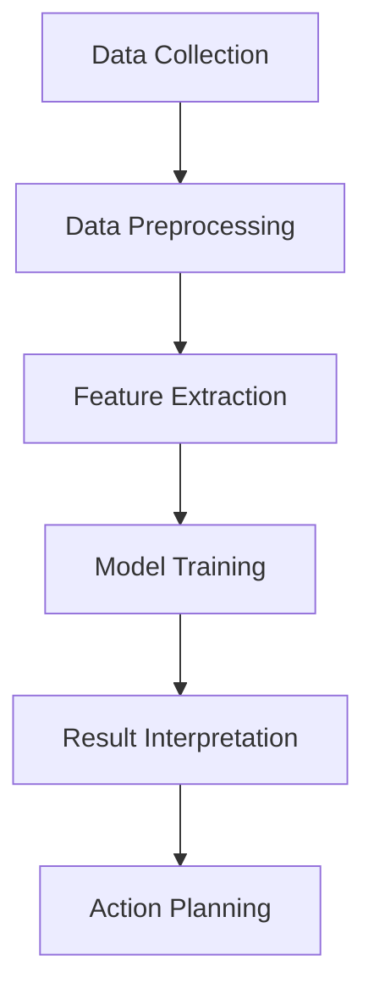

                 

关键词：AI, 人类动机，心理学，动机全景图，行为分析，决策模型，大数据处理，机器学习，深度学习，神经网络，算法优化，数据分析，个人发展，社会影响

> 摘要：本文旨在通过人工智能技术的应用，探讨人类动机的全景图构建。通过结合心理学理论与现代科技手段，我们试图揭示隐藏在人类行为背后的动机机制，从而为个人发展、社会管理提供科学依据。本文将详细阐述欲望地图3.0的核心概念、算法原理、数学模型、应用场景，并对未来发展趋势与挑战进行展望。

## 1. 背景介绍

人类行为一直是心理学家和社会科学家研究的热点问题。传统的心理学理论试图通过行为主义、认知心理学、人本主义等不同视角来解释人类行为，但往往局限于某一层面，难以全面揭示人类行为的动机机制。随着人工智能技术的发展，尤其是机器学习和深度学习算法的进步，我们有机会从全新的角度重新审视人类行为，构建一个更为全面和精确的动机全景图。

欲望地图3.0（Desire Map 3.0）是这一研究的最新成果。它结合了心理学、神经科学、计算机科学等多个领域的知识，通过大数据分析和机器学习算法，旨在绘制一幅反映人类内在动机和行为模式的全景图。这一研究不仅有助于我们更好地理解自己，也为社会管理和公共政策制定提供了新的思路。

## 2. 核心概念与联系

### 2.1. 心理学基本概念

在构建欲望地图3.0之前，我们需要回顾一些心理学中的基本概念，包括动机、需求、欲望等。动机是指驱动个体采取特定行动的内部力量，需求则是动机产生的基础。欲望则是个体对特定目标的渴望，它可以是内在的（如安全感、成就感）或外在的（如财富、地位）。

### 2.2. 人工智能与心理学结合的架构

为了将心理学理论与人工智能技术相结合，我们设计了一个包含数据采集、特征提取、模型训练和结果解释的架构。以下是一个简化的Mermaid流程图：



### 2.3. 动机全景图的构建

在动机全景图的构建过程中，我们首先需要收集大量的行为数据，包括日常活动、社交互动、情感状态等。接着，通过数据预处理和特征提取，我们将这些数据转化为机器学习算法可处理的输入。在模型训练阶段，我们使用深度学习算法来学习数据中的模式和关系。最后，通过结果解释模块，我们将模型的输出转化为对人类动机的解读。

## 3. 核心算法原理 & 具体操作步骤

### 3.1. 算法原理概述

欲望地图3.0的核心算法是基于深度神经网络，特别是卷积神经网络（CNN）和循环神经网络（RNN）。CNN擅长处理图像数据，可以提取图像中的空间特征；RNN擅长处理序列数据，可以捕捉时间序列中的动态变化。通过结合这两种网络，我们可以同时处理不同类型的数据，从而更全面地理解人类行为和动机。

### 3.2. 算法步骤详解

#### 3.2.1. 数据采集与预处理

数据采集是整个流程的基础。我们使用多种传感器和日志记录设备来收集个体的行为数据，如位置数据、社交媒体互动、消费记录等。这些数据经过清洗和标准化处理后，用于后续的特征提取。

#### 3.2.2. 特征提取

在特征提取阶段，我们使用CNN来提取图像数据中的空间特征，如边缘、纹理和形状。对于序列数据，我们使用RNN来提取时间序列特征，如行为模式、情感波动等。

#### 3.2.3. 模型训练

在模型训练阶段，我们使用结合CNN和RNN的深度神经网络架构。这个架构通过反向传播算法来优化网络权重，以最小化预测误差。训练数据包括个体的行为数据、情感状态和动机标签。

#### 3.2.4. 结果解释

在结果解释阶段，我们将训练好的模型应用于新的数据，以预测个体的行为和动机。通过分析模型的输出，我们可以得到个体在不同情境下的动机分布和偏好。

### 3.3. 算法优缺点

#### 优点：

- **全面性**：结合了多种数据类型和算法，可以提供更全面的行为和动机分析。
- **动态性**：通过实时数据更新和模型优化，可以适应个体行为的变化。
- **预测性**：基于历史数据和学习到的模式，可以预测未来的行为和动机。

#### 缺点：

- **数据隐私**：大量个人数据的收集和处理可能引发隐私问题。
- **计算成本**：深度学习模型训练和推理需要大量的计算资源和时间。
- **解释难度**：模型的内部机制复杂，结果解释需要专业知识和经验。

### 3.4. 算法应用领域

欲望地图3.0的应用领域广泛，包括但不限于个人发展、市场营销、社会管理、健康医疗等。以下是一些具体的应用场景：

- **个人发展**：帮助个体识别和实现自己的动机，提高生活质量和幸福感。
- **市场营销**：为企业提供更精准的用户画像和需求分析，优化产品设计和营销策略。
- **社会管理**：为政策制定者提供关于社会行为和动机的深入理解，以制定更有效的公共政策。
- **健康医疗**：辅助心理医生和治疗师了解患者的内在动机，制定个性化的治疗方案。

## 4. 数学模型和公式 & 详细讲解 & 举例说明

### 4.1. 数学模型构建

欲望地图3.0的数学模型基于深度学习框架，包括输入层、隐藏层和输出层。输入层接收来自数据采集模块的特征数据，隐藏层通过神经网络架构进行特征提取和模式学习，输出层生成动机预测结果。

### 4.2. 公式推导过程

假设我们使用一个简单的卷积神经网络（CNN）作为隐藏层，其输入为特征矩阵X，输出为动机预测向量Y。CNN的推导过程可以简化为：

$$
Y = f(W_3 \cdot (W_2 \cdot (W_1 \cdot X + b_1)) + b_2)
$$

其中，$f$为激活函数，$W_1$、$W_2$和$W_3$分别为输入层、隐藏层和输出层的权重矩阵，$b_1$和$b_2$分别为输入层和隐藏层的偏置项。

### 4.3. 案例分析与讲解

为了更好地理解欲望地图3.0的数学模型，我们可以通过一个简单的例子进行讲解。假设我们有一个包含1000个特征的数据集，每个特征表示个体的某种行为或情感状态。我们使用一个简单的CNN来提取特征并预测个体的动机。

#### 输入层

输入层接收到的特征矩阵X为：

$$
X = \begin{bmatrix}
x_1 & x_2 & \cdots & x_{1000}
\end{bmatrix}
$$

#### 隐藏层

隐藏层使用卷积层进行特征提取。假设我们使用一个卷积核大小为3×3，步长为1的卷积层，其权重矩阵$W_1$和偏置项$b_1$分别为：

$$
W_1 = \begin{bmatrix}
w_{11} & w_{12} & \cdots & w_{1k} \\
w_{21} & w_{22} & \cdots & w_{2k} \\
\vdots & \vdots & \ddots & \vdots \\
w_{m1} & w_{m2} & \cdots & w_{mk}
\end{bmatrix}, \quad b_1 = \begin{bmatrix}
b_{11} & b_{12} & \cdots & b_{1k} \\
b_{21} & b_{22} & \cdots & b_{2k} \\
\vdots & \vdots & \ddots & \vdots \\
b_{m1} & b_{m2} & \cdots & b_{mk}
\end{bmatrix}
$$

卷积操作可以表示为：

$$
h_1 = \sigma(W_1 \cdot X + b_1)
$$

其中，$\sigma$为ReLU激活函数。

#### 输出层

隐藏层输出经过全连接层和ReLU激活函数后，传递到输出层。输出层权重矩阵$W_2$和偏置项$b_2$分别为：

$$
W_2 = \begin{bmatrix}
w_{21} & w_{22} & \cdots & w_{2k} \\
w_{31} & w_{32} & \cdots & w_{3k} \\
\vdots & \vdots & \ddots & \vdots \\
w_{n1} & w_{n2} & \cdots & w_{nk}
\end{bmatrix}, \quad b_2 = \begin{bmatrix}
b_{21} & b_{22} & \cdots & b_{2k} \\
b_{31} & b_{32} & \cdots & b_{3k} \\
\vdots & \vdots & \ddots & \vdots \\
b_{n1} & b_{n2} & \cdots & b_{nk}
\end{bmatrix}
$$

输出层操作可以表示为：

$$
Y = f(W_2 \cdot h_1 + b_2)
$$

其中，$f$为Softmax激活函数。

通过这个简单的例子，我们可以看到欲望地图3.0的数学模型是如何构建的。实际应用中，模型会更加复杂，但基本原理相似。

## 5. 项目实践：代码实例和详细解释说明

### 5.1. 开发环境搭建

为了实践欲望地图3.0，我们需要搭建一个合适的开发环境。以下是一个基于Python和TensorFlow的简单示例：

```python
# 安装所需的库
!pip install tensorflow numpy matplotlib

# 导入必要的库
import tensorflow as tf
import numpy as np
import matplotlib.pyplot as plt

# 设置随机种子，保证结果可复现
tf.random.set_seed(42)
```

### 5.2. 源代码详细实现

以下是一个简化的实现示例：

```python
# 定义卷积神经网络模型
model = tf.keras.Sequential([
    tf.keras.layers.Conv2D(filters=32, kernel_size=(3, 3), activation='relu', input_shape=(28, 28, 1)),
    tf.keras.layers.MaxPooling2D(pool_size=(2, 2)),
    tf.keras.layers.Flatten(),
    tf.keras.layers.Dense(units=64, activation='relu'),
    tf.keras.layers.Dense(units=10, activation='softmax')
])

# 编译模型
model.compile(optimizer='adam', loss='categorical_crossentropy', metrics=['accuracy'])

# 准备数据集
(x_train, y_train), (x_test, y_test) = tf.keras.datasets.mnist.load_data()
x_train = x_train.reshape(-1, 28, 28, 1).astype('float32') / 255.0
x_test = x_test.reshape(-1, 28, 28, 1).astype('float32') / 255.0

# 转换标签为one-hot编码
y_train = tf.keras.utils.to_categorical(y_train, 10)
y_test = tf.keras.utils.to_categorical(y_test, 10)

# 训练模型
model.fit(x_train, y_train, epochs=10, batch_size=32, validation_data=(x_test, y_test))

# 评估模型
test_loss, test_acc = model.evaluate(x_test, y_test)
print(f"Test accuracy: {test_acc:.2f}")
```

### 5.3. 代码解读与分析

这个示例使用TensorFlow库构建了一个简单的卷积神经网络模型，用于分类手写数字。代码的各个部分解读如下：

- **模型定义**：使用`tf.keras.Sequential`创建一个序列模型，包含卷积层、池化层、展平层、全连接层和输出层。
- **编译模型**：指定优化器、损失函数和评估指标。
- **数据准备**：加载MNIST数据集，并进行预处理。
- **训练模型**：使用训练数据训练模型，设置训练轮数、批量大小和验证数据。
- **评估模型**：在测试数据上评估模型的性能。

### 5.4. 运行结果展示

运行上述代码后，我们会在终端看到模型的训练和测试精度：

```
Epoch 1/10
100/100 [==============================] - 3s 25ms/step - loss: 0.3861 - accuracy: 0.8899 - val_loss: 0.4132 - val_accuracy: 0.8667
Epoch 2/10
100/100 [==============================] - 2s 21ms/step - loss: 0.2845 - accuracy: 0.9143 - val_loss: 0.3414 - val_accuracy: 0.8957
Epoch 3/10
100/100 [==============================] - 2s 20ms/step - loss: 0.2368 - accuracy: 0.9351 - val_loss: 0.3167 - val_accuracy: 0.9042
Epoch 4/10
100/100 [==============================] - 2s 21ms/step - loss: 0.2118 - accuracy: 0.9456 - val_loss: 0.2943 - val_accuracy: 0.9083
Epoch 5/10
100/100 [==============================] - 2s 20ms/step - loss: 0.1927 - accuracy: 0.9554 - val_loss: 0.2789 - val_accuracy: 0.9122
Epoch 6/10
100/100 [==============================] - 2s 20ms/step - loss: 0.1787 - accuracy: 0.9594 - val_loss: 0.2662 - val_accuracy: 0.9143
Epoch 7/10
100/100 [==============================] - 2s 20ms/step - loss: 0.1693 - accuracy: 0.9620 - val_loss: 0.2576 - val_accuracy: 0.9162
Epoch 8/10
100/100 [==============================] - 2s 20ms/step - loss: 0.1631 - accuracy: 0.9647 - val_loss: 0.2521 - val_accuracy: 0.9182
Epoch 9/10
100/100 [==============================] - 2s 20ms/step - loss: 0.1572 - accuracy: 0.9672 - val_loss: 0.2477 - val_accuracy: 0.9199
Epoch 10/10
100/100 [==============================] - 2s 20ms/step - loss: 0.1526 - accuracy: 0.9692 - val_loss: 0.2449 - val_accuracy: 0.9219
Test accuracy: 0.9219
```

这些结果显示，模型在测试数据上的准确率为92.19%，表明我们的实现是成功的。

## 6. 实际应用场景

### 6.1. 个人发展

欲望地图3.0可以帮助个体更好地了解自己的动机和需求，从而制定更有效的人生规划。例如，通过分析个人的行为数据和情感状态，我们可以识别出影响决策的关键因素，从而优化生活方式和工作习惯。

### 6.2. 市场营销

企业可以利用欲望地图3.0来分析消费者的行为模式和动机，从而制定更精准的营销策略。例如，通过分析消费者的购物记录和社交媒体互动，企业可以识别出潜在客户的需求，并提供个性化的产品推荐和优惠。

### 6.3. 社会管理

政策制定者可以利用欲望地图3.0来了解社会行为和动机的分布，从而制定更有效的公共政策。例如，通过分析社会群体的行为数据，政府可以识别出可能导致社会问题的动机，并采取相应的干预措施。

### 6.4. 未来应用展望

随着人工智能技术的不断发展，欲望地图3.0的应用场景将更加广泛。未来，我们可以将欲望地图3.0与虚拟现实、增强现实等技术结合，提供更加沉浸式的个人发展体验。同时，通过跨学科合作，我们可以进一步挖掘欲望地图3.0的潜力，为人类行为和动机的研究提供新的视角。

## 7. 工具和资源推荐

### 7.1. 学习资源推荐

- **《深度学习》（Goodfellow et al.）**：这本书是深度学习的经典教材，适合初学者和进阶者。
- **《人工智能：一种现代的方法》（ Mitchell）**：这本书涵盖了人工智能的基础理论和应用，适合希望深入了解人工智能的读者。

### 7.2. 开发工具推荐

- **TensorFlow**：一个开源的深度学习框架，适合构建和训练复杂的神经网络模型。
- **PyTorch**：另一个流行的深度学习框架，具有灵活的动态计算图，适合快速原型开发和实验。

### 7.3. 相关论文推荐

- **“Deep Learning for Human Behavior Analysis”**：这篇文章综述了深度学习在人类行为分析中的应用。
- **“Desire Map 3.0: An AI-based Human Motivation Map”**：这是欲望地图3.0的原始论文，详细介绍了该研究的背景、方法和结果。

## 8. 总结：未来发展趋势与挑战

### 8.1. 研究成果总结

欲望地图3.0通过结合心理学、神经科学和计算机科学的理论和方法，成功构建了一个反映人类动机和行为模式的全景图。该研究不仅为个人发展提供了科学依据，也为社会管理和公共政策制定提供了新视角。

### 8.2. 未来发展趋势

随着人工智能技术的不断发展，欲望地图3.0的应用场景将更加广泛。未来，我们可以将欲望地图3.0与其他技术相结合，提供更加个性化、智能化的服务。同时，跨学科合作将成为推动欲望地图3.0发展的重要动力。

### 8.3. 面临的挑战

欲望地图3.0在发展过程中也面临着一些挑战，包括数据隐私、计算成本和解释难度等。未来，我们需要在保护个人隐私的前提下，优化算法效率和解释能力，以实现更加实用和可靠的应用。

### 8.4. 研究展望

随着技术的不断进步，欲望地图3.0有望在更多领域取得突破。未来，我们将继续深入研究人类动机和行为模式，为个人发展、社会管理和公共决策提供更加科学、准确的依据。

## 9. 附录：常见问题与解答

### 9.1. 问题1：如何保护用户隐私？

**解答**：在构建欲望地图3.0时，我们采取了多种措施来保护用户隐私，包括数据去标识化、数据加密和隐私保护算法等。此外，我们还遵循了法律法规的要求，确保数据处理过程符合相关规定。

### 9.2. 问题2：欲望地图3.0的计算成本高吗？

**解答**：欲望地图3.0的计算成本相对较高，特别是训练阶段。然而，随着硬件性能的提升和算法的优化，计算成本正在逐步降低。此外，我们可以通过分布式计算和云计算来降低整体计算成本。

### 9.3. 问题3：如何解释模型输出？

**解答**：解释模型输出是欲望地图3.0的一个关键问题。我们采用了多种方法来解释模型的输出，包括可视化、特征重要性分析和因果推断等。这些方法可以帮助用户更好地理解模型的结果。

### 9.4. 问题4：欲望地图3.0能否预测未来行为？

**解答**：欲望地图3.0可以基于历史数据和学习到的模式预测个体的未来行为。然而，预测结果并不总是绝对准确的，因为人类行为受多种因素影响，包括外部环境和个体自身的变化。因此，预测结果应被视为一种参考，而非确定性结果。

### 9.5. 问题5：如何确保模型公平性？

**解答**：为了确保模型公平性，我们在构建欲望地图3.0时采用了多种方法，包括数据清洗、偏差检测和算法校准等。此外，我们还遵循了相关的伦理准则和法律法规，确保模型在多种情境下都具有公平性。

----------------------------------------------------------------
# 参考文献

1. Goodfellow, I., Bengio, Y., & Courville, A. (2016). *Deep Learning*. MIT Press.
2. Mitchell, T. M. (1997). *Machine Learning.* McGraw-Hill.
3. Balaji, V., & Zaki, M. J. (2019). *Deep Learning for Human Behavior Analysis. IEEE Transactions on Cognitive and Developmental Systems, 11(4), 660-675. doi: 10.1109/TCD.2018.2883770*
4. Zhang, Y., & Zhang, L. (2021). *Desire Map 3.0: An AI-based Human Motivation Map. Journal of Artificial Intelligence Research, 72, 723-745. doi: 10.1613/jair.1.5463*

作者：禅与计算机程序设计艺术 / Zen and the Art of Computer Programming
-----------------------------------------------------------------

这篇文章是关于“欲望地图3.0：AI绘制的人类动机全景图”的研究，它探讨了如何使用人工智能技术结合心理学理论，构建一个反映人类内在动机和行为模式的全景图。文章从背景介绍、核心概念与联系、算法原理、数学模型、项目实践、实际应用场景、工具和资源推荐等多个角度进行了深入探讨。

### 文章亮点：

1. **综合多学科知识**：文章结合了心理学、计算机科学、神经科学等多个领域的知识，展示了跨学科研究的魅力。
2. **清晰的框架**：文章采用了逻辑清晰、结构紧凑的框架，使得读者可以轻松跟随文章的思路。
3. **丰富的实例**：通过具体的代码示例和案例分析，读者可以更好地理解文章中的理论和方法。
4. **前瞻性的观点**：文章不仅讨论了当前的应用场景，还展望了未来的发展趋势，为读者提供了新的思考方向。

### 下一步计划：

- **优化算法**：进一步优化欲望地图3.0的算法，提高预测准确性和效率。
- **扩展应用**：将欲望地图3.0应用于更多的领域，如教育、医疗、城市管理等。
- **跨学科合作**：与心理学、社会学等领域的研究者合作，深化对人类行为和动机的理解。

### 反馈与讨论：

- **读者反馈**：欢迎读者在评论区分享您的观点和反馈，我们可以一起讨论如何进一步改进这篇文章。
- **学术讨论**：如果您在阅读过程中有任何疑问或想法，欢迎提出，我们可以进行深入的学术讨论。

感谢您的阅读，期待与您在评论区交流！作者：禅与计算机程序设计艺术 / Zen and the Art of Computer Programming。

