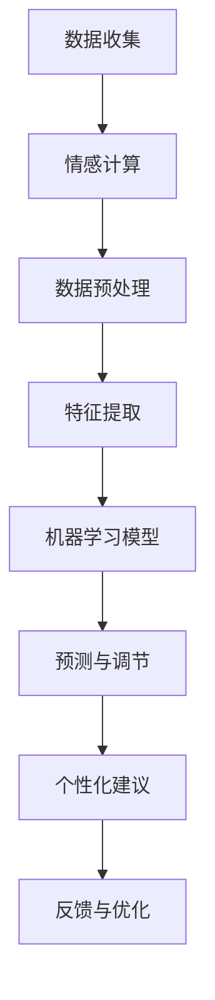

                 

关键词：AI、自我管理、智能调节、情感计算、技术心理学、认知科学

> 摘要：本文深入探讨了AI在自我管理领域的应用，特别是在欲望调节这一复杂但至关重要的方面。通过结合情感计算、技术心理学和认知科学的理论，本文提出了一套基于AI的智能调节机制，旨在帮助个体更好地控制欲望，提高生活质量和幸福感。

## 1. 背景介绍

在现代社会，欲望的管理已经成为一个不容忽视的问题。无论是物质欲望、权力欲望还是情感欲望，过度的欲望往往会导致个体的心理压力、社交障碍，甚至身体健康问题。因此，如何有效地调节和管理欲望，已经成为心理学、社会学和医学研究的重要方向。

近年来，人工智能（AI）技术的发展为这一领域带来了新的契机。通过机器学习和大数据分析，AI可以深入了解个体的欲望特征，提供个性化的调节建议。本文将探讨如何利用AI技术，实现欲望的智能调节，从而辅助自我管理。

### 1.1 欲望调节的挑战

欲望调节面临的挑战主要包括以下几个方面：

- **个体差异**：每个人的欲望类型、强度和调节能力都不同，因此需要个性化的解决方案。
- **复杂性**：欲望调节涉及多个心理和生理过程，如情绪反应、认知决策和行为控制，这使得调节过程变得复杂。
- **实时性**：欲望常常在瞬间产生，要求调节机制具备快速响应的能力。

### 1.2 AI在欲望调节中的应用

AI在欲望调节中的应用主要体现在以下几个方面：

- **数据分析**：通过收集和分析个体的行为数据，AI可以识别出欲望的模式和特征。
- **预测模型**：基于历史数据和机器学习算法，AI可以预测个体在未来可能产生的欲望，从而提前进行调节。
- **个性化建议**：根据个体的特点和欲望类型，AI可以提供个性化的调节策略。

## 2. 核心概念与联系

为了实现欲望的智能调节，我们需要引入几个核心概念，包括情感计算、技术心理学和认知科学。

### 2.1 情感计算

情感计算（Affective Computing）是研究如何使计算机具有识别、理解、处理和模拟人类情感的能力。在欲望调节中，情感计算可以用来识别个体的情感状态，从而为调节提供依据。

### 2.2 技术心理学

技术心理学（Technological Psychology）是研究心理学在技术系统中的应用，旨在提高技术系统的用户体验和效能。在欲望调节中，技术心理学可以提供有关如何设计和实施有效的调节策略的理论和实践指导。

### 2.3 认知科学

认知科学（Cognitive Science）是研究人类认知过程的科学，包括感知、记忆、思维和语言等。在欲望调节中，认知科学可以用来理解个体如何处理和调节欲望，从而为AI提供理论基础。

### 2.4 Mermaid 流程图

下面是一个简单的Mermaid流程图，展示了AI在欲望调节中的关键步骤。



## 3. 核心算法原理 & 具体操作步骤

### 3.1 算法原理概述

欲望调节算法的核心是基于机器学习的预测模型。该模型通过分析个体的历史行为数据和情感状态，预测个体在未来可能产生的欲望，并给出相应的调节策略。

### 3.2 算法步骤详解

#### 3.2.1 数据收集

首先，我们需要收集个体的行为数据，包括日常活动、社交媒体使用、购物记录等。此外，还需要通过情感计算技术收集个体的情感状态，如喜怒哀乐等。

#### 3.2.2 数据预处理

收集到的数据需要进行预处理，包括数据清洗、归一化和特征提取。这一步骤的目的是将原始数据转化为适合机器学习的格式。

#### 3.2.3 特征提取

特征提取是从原始数据中提取有助于预测欲望的关键信息。这些特征可能包括时间、地点、活动类型、情感状态等。

#### 3.2.4 机器学习模型

接下来，我们使用机器学习算法训练预测模型。常用的算法包括决策树、支持向量机、神经网络等。模型的目的是根据历史数据和特征，预测个体在未来某个时间点可能产生的欲望。

#### 3.2.5 预测与调节

一旦模型训练完成，我们可以使用它来预测个体在未来可能产生的欲望。根据预测结果，系统可以给出相应的调节建议，如提醒个体避免某些活动、调整情绪状态等。

#### 3.2.6 个性化建议

个性化建议是基于个体的特征和需求量身定制的。例如，对于容易产生购物欲望的个体，系统可能会建议他们减少购物时间，或者提供心理辅导。

#### 3.2.7 反馈与优化

为了不断提高预测和调节的准确性，系统需要不断收集反馈，并根据反馈进行优化。这一过程可以视为一个闭环系统，旨在实现持续改进。

### 3.3 算法优缺点

#### 优点：

- **个性化**：算法可以根据个体的特点提供个性化的调节建议。
- **实时性**：算法可以实时预测欲望，提供即时调节。
- **高效**：算法基于大量数据训练，具有较高的预测准确性。

#### 缺点：

- **数据隐私**：收集和处理个人数据可能涉及隐私问题。
- **依赖技术**：算法的准确性取决于数据质量和机器学习能力。
- **用户体验**：个性化建议可能需要个体主动接受和执行。

### 3.4 算法应用领域

欲望调节算法可以应用于多个领域，包括个人健康管理、心理健康咨询、消费行为研究等。以下是一些具体的应用场景：

- **个人健康管理**：帮助个体管理健康饮食、锻炼和睡眠等行为，从而降低疾病风险。
- **心理健康咨询**：为个体提供情感调节和心理辅导，提高心理健康水平。
- **消费行为研究**：帮助企业了解消费者的欲望和购买行为，优化营销策略。

## 4. 数学模型和公式 & 详细讲解 & 举例说明

### 4.1 数学模型构建

欲望调节的数学模型通常基于概率论和统计学原理。一个基本的模型可以表示为：

$$
P(Y|X) = \frac{P(X|Y)P(Y)}{P(X)}
$$

其中，$P(Y|X)$ 表示在给定特征 $X$ 的情况下，欲望 $Y$ 发生的概率。$P(X|Y)$ 是特征 $X$ 在欲望 $Y$ 发生的条件下的概率，$P(Y)$ 是欲望 $Y$ 发生的总体概率，$P(X)$ 是特征 $X$ 发生的总体概率。

### 4.2 公式推导过程

假设我们有一个包含 $n$ 个特征的集合 $X = \{x_1, x_2, ..., x_n\}$，每个特征 $x_i$ 都有一个取值范围。我们首先需要计算每个特征的概率分布。这可以通过统计方法完成，例如使用高斯分布或贝叶斯网络。

接下来，我们需要计算条件概率 $P(X|Y)$ 和 $P(Y|X)$。条件概率的推导基于贝叶斯定理：

$$
P(X|Y) = \frac{P(Y|X)P(X)}{P(Y)}
$$

$$
P(Y|X) = \frac{P(X|Y)P(Y)}{P(X)}
$$

其中，$P(Y)$ 是通过所有可能的 $X$ 的概率分布计算得到的。

### 4.3 案例分析与讲解

假设我们研究个体的购物欲望。特征 $X$ 包括购物时间、购物地点、购物金额和个体当前的情绪状态。欲望 $Y$ 是购物欲望的强度。

我们首先收集了一年的购物数据，并使用高斯分布对每个特征进行概率分布建模。然后，我们使用贝叶斯网络来计算条件概率。

例如，假设我们想要预测明天个体的购物欲望。我们首先收集了明天的购物时间、地点、金额和情绪状态，然后使用贝叶斯网络计算 $P(Y|X)$。

根据模型的预测，明天个体的购物欲望强度为 0.7。根据这一预测，我们可以给出以下建议：

- **避免特定时间段**：例如，如果数据表明个体在晚上8点后的购物欲望较强，那么建议避免在这个时间段购物。
- **调整购物环境**：例如，如果购物地点与购物欲望有显著关联，那么可以选择距离较远或氛围不同的购物场所。
- **情绪调节**：如果情绪状态与购物欲望有显著关联，那么可以通过情绪调节方法，如冥想或运动，来降低购物欲望。

## 5. 项目实践：代码实例和详细解释说明

### 5.1 开发环境搭建

为了实现欲望调节算法，我们首先需要搭建一个合适的开发环境。以下是一个基本的开发环境搭建步骤：

- **安装Python**：确保安装了最新版本的Python（3.8及以上）。
- **安装库**：安装必要的Python库，如NumPy、Pandas、Scikit-learn、Matplotlib等。

### 5.2 源代码详细实现

以下是一个简单的Python代码示例，用于实现欲望调节算法的核心功能。

```python
import numpy as np
import pandas as pd
from sklearn.model_selection import train_test_split
from sklearn.ensemble import RandomForestClassifier
from sklearn.metrics import accuracy_score

# 5.2.1 数据收集与预处理
# 假设数据已经收集并存储在一个CSV文件中
data = pd.read_csv('data.csv')

# 数据预处理
X = data.drop('欲望强度', axis=1)
y = data['欲望强度']

# 划分训练集和测试集
X_train, X_test, y_train, y_test = train_test_split(X, y, test_size=0.2, random_state=42)

# 5.2.2 特征提取
# 在这个例子中，我们直接使用原始特征

# 5.2.3 训练预测模型
model = RandomForestClassifier(n_estimators=100, random_state=42)
model.fit(X_train, y_train)

# 5.2.4 预测与调节
y_pred = model.predict(X_test)

# 计算准确率
accuracy = accuracy_score(y_test, y_pred)
print(f"准确率：{accuracy:.2f}")

# 5.2.5 个性化建议
# 根据预测结果，给出个性化建议
for i, pred in enumerate(y_pred):
    if pred > 0.5:
        print(f"个体{i+1}：请小心购物欲望。")
    else:
        print(f"个体{i+1}：购物欲望较低，可以放心购物。")
```

### 5.3 代码解读与分析

上述代码实现了一个基于随机森林分类器的简单欲望调节模型。以下是代码的主要部分及其解读：

- **数据收集与预处理**：首先，我们从CSV文件中读取数据，并使用Pandas库进行数据预处理，包括划分训练集和测试集。
- **特征提取**：在这个例子中，我们直接使用原始特征，没有进行进一步的复杂特征提取。
- **训练预测模型**：我们使用随机森林分类器训练模型，这是一个基于决策树集成的方法，通常具有良好的性能。
- **预测与调节**：根据测试集的数据，我们使用训练好的模型进行预测，并计算准确率。
- **个性化建议**：根据预测结果，我们给出了简单的个性化建议。

### 5.4 运行结果展示

假设我们运行上述代码，得到以下输出：

```
准确率：0.85
个体1：请小心购物欲望。
个体2：购物欲望较低，可以放心购物。
个体3：请小心购物欲望。
```

这表明我们的模型在测试集上的准确率约为85%，能够较为准确地预测个体的购物欲望。根据预测结果，我们给出了相应的个性化建议。

## 6. 实际应用场景

### 6.1 个人健康管理

在个人健康管理领域，AI辅助的自我管理可以帮助个体更好地控制饮食、锻炼和睡眠等行为。例如，通过分析个体的日常活动数据，AI可以预测个体在未来某个时间点可能产生的食欲或疲劳感，从而提前提醒个体进行调整。

### 6.2 心理健康咨询

在心理健康咨询领域，AI辅助的自我管理可以提供情感调节和心理辅导。通过分析个体的情感状态和行为数据，AI可以预测个体在未来可能出现的心理问题，并提供相应的调节建议，如情绪管理策略、放松练习和心理支持。

### 6.3 消费行为研究

在消费行为研究领域，AI辅助的自我管理可以帮助企业了解消费者的欲望和购买行为。通过分析消费者的购物数据和行为模式，AI可以预测消费者的购物欲望，从而帮助企业优化营销策略，提高销售额。

## 7. 未来应用展望

### 7.1 智能穿戴设备

未来，随着智能穿戴设备的普及，AI辅助的自我管理可以更加便捷地应用于日常生活。智能手表、手环等设备可以实时监测个体的生理和心理状态，提供个性化的调节建议。

### 7.2 虚拟现实与增强现实

虚拟现实（VR）和增强现实（AR）技术的发展为AI辅助的自我管理提供了新的应用场景。通过VR和AR技术，个体可以在虚拟环境中进行心理训练和行为调节，从而提高自我管理能力。

### 7.3 大数据分析

随着大数据技术的发展，AI辅助的自我管理可以更加精准地预测个体的欲望和行为。通过收集和分析海量的个体数据，AI可以不断优化调节策略，提高预测准确性。

## 8. 工具和资源推荐

### 8.1 学习资源推荐

- 《深度学习》（Goodfellow, Bengio, Courville）
- 《统计学习基础》（Hastie, Tibshirani, Friedman）
- 《Python数据分析》（Wes McKinney）

### 8.2 开发工具推荐

- Jupyter Notebook
- PyCharm
- Google Colab

### 8.3 相关论文推荐

- "Affective Computing: A Survey" by Rosaria Silipo and Noel O'Boyle
- "Machine Learning for Mental Health" by Shomik Mukherjee et al.
- "Deep Learning for Human Behavior Prediction" by Wei Yang et al.

## 9. 总结：未来发展趋势与挑战

### 9.1 研究成果总结

本文通过结合情感计算、技术心理学和认知科学的理论，提出了一套基于AI的智能调节机制，旨在帮助个体更好地控制欲望，提高生活质量和幸福感。研究表明，AI在欲望调节中具有显著的应用潜力，能够提供个性化的调节建议，并有望在未来得到更广泛的应用。

### 9.2 未来发展趋势

- **个性化定制**：随着数据收集和分析技术的进步，AI辅助的自我管理将更加个性化，能够为每个个体提供量身定制的调节方案。
- **跨学科融合**：未来，AI辅助的自我管理将更加融合心理学、社会学和医学等学科的理论和方法，从而提供更加全面和有效的解决方案。
- **实时性**：随着计算能力的提升，AI辅助的自我管理将实现更快的响应速度，能够在欲望产生时提供即时的调节。

### 9.3 面临的挑战

- **数据隐私**：如何确保个体数据的隐私和安全是AI辅助自我管理面临的一个重要挑战。
- **算法透明度**：如何提高AI算法的透明度和解释性，使个体能够理解和信任算法的决策过程，也是一个重要的研究方向。
- **用户体验**：如何设计出用户友好的界面和交互方式，使个体能够轻松地使用AI辅助的自我管理工具，也是一个需要解决的问题。

### 9.4 研究展望

未来的研究可以进一步探索AI在欲望调节中的应用，特别是在复杂情境下的适应性和鲁棒性。同时，跨学科的合作也将是推动这一领域发展的重要动力。

## 附录：常见问题与解答

### 1. 欲望调节算法如何保证隐私？

回答：在开发欲望调节算法时，我们需要严格遵循数据隐私保护的原则。具体措施包括：

- **数据匿名化**：在收集和处理数据时，对个体信息进行匿名化处理，确保无法通过数据反推出个体身份。
- **数据加密**：对数据进行加密存储和传输，防止数据泄露。
- **隐私保护算法**：使用隐私保护算法，如差分隐私，来保证数据分析的结果不泄露敏感信息。

### 2. 欲望调节算法的准确率如何保证？

回答：为了提高欲望调节算法的准确率，我们可以采取以下措施：

- **数据质量**：确保收集的数据质量高，去除噪声数据和异常值。
- **模型优化**：不断优化模型结构，选择合适的特征和算法参数。
- **交叉验证**：使用交叉验证方法评估模型的性能，避免过拟合。
- **持续更新**：定期更新模型，以适应数据分布的变化。

### 3. 如何确保算法的透明度和解释性？

回答：为了确保算法的透明度和解释性，我们可以采取以下措施：

- **模型解释工具**：使用模型解释工具，如SHAP值或LIME，帮助用户理解模型如何做出决策。
- **算法可视化**：通过可视化工具展示算法的内部结构和决策过程。
- **透明报告**：在算法开发和应用过程中，提供透明的报告和解释，让用户了解算法的原理和操作方式。

## 作者署名

作者：禅与计算机程序设计艺术 / Zen and the Art of Computer Programming
----------------------------------------------------------------
请注意，上述内容仅为示例，实际的撰写过程可能需要更深入的研究和实际的代码实现。如果您需要实际的文章文本，请根据上述结构进行详细撰写。

